# Appendix E: Budget Templates
## Phase-by-Phase Investment Planning and ROI Calculator

**Purpose:** Budget planning templates for 90-day agent-ready infrastructure implementation  
**Use:** Estimate costs, plan budget, calculate ROI before starting Chapter 3  
**Date:** November 8, 2025  
**Version:** 1.0

---

## Budget Overview

### Total Investment Range

| Budget Tier | Phase 1 | Phase 2 | Phase 3 | Total (12 Weeks) | Monthly Ongoing |
|-------------|---------|---------|---------|------------------|-----------------|
| **Lean** | $30-50K | $50-70K | $30-50K | **$110-170K** | $3-5K |
| **Moderate** | $40-80K | $60-100K | $40-80K | **$140-260K** | $10-15K |
| **Well-Funded** | $60-120K | $80-150K | $60-120K | **$200-390K** | $25-40K |

**Note:** Costs are cumulative. "Total" includes all 3 phases over 12 weeks.

---

## Budget Tier Selection Guide

### Lean Budget ($110-170K Total)

**Best For:**
- Proof of concept
- Internal tools (<1K users)
- Non-healthcare use cases
- Startups or small teams

**Trade-offs:**
- More self-hosted/open-source (operational burden)
- Limited enterprise support
- Manual scaling required
- Longer time-to-market

---

### Moderate Budget ($140-260K Total) ⭐ RECOMMENDED

**Best For:**
- Production systems
- Healthcare deployment
- Enterprise use cases (<10K users)
- Most organizations

**Trade-offs:**
- Managed services (reduced operational burden)
- Enterprise support included
- Auto-scaling
- Faster time-to-market

**Echo Health Systems used this tier:** $150K total investment, 477% ROI over 18 months

---

### Well-Funded Budget ($200-390K Total)

**Best For:**
- Enterprise-scale (>50K users)
- Multi-region deployment
- Mission-critical systems
- High-volume workloads

**Trade-offs:**
- Best-in-class everything
- Dedicated support and SLAs
- Advanced features
- Highest costs

---


**Figure E.1: Budget Tier Phase Breakdown (3 Tiers × 3 Phases)**

This diagram shows the phase-by-phase investment distribution across three budget tiers over the 90-day implementation. **Tier 1 (Lean)** at $110-170K uses open-source components with higher operational burden, suitable for proofs of concept and small teams. **Tier 2 (Moderate)** at $140-260K is recommended for most organizations, using managed services with enterprise support—Echo Health Systems used this tier with $150K investment achieving 477% ROI in 18 months. **Tier 3 (Well-Funded)** at $200-390K provides enterprise-scale infrastructure with dedicated support and SLAs. Each tier distributes spending across Phase 1 (Foundation: governance, storage, semantic layer), Phase 2 (Intelligence: LLM integration, RAG, multi-agent), and Phase 3 (Production: observability, API gateway, HITL, launch). The moderate tier receives bold teal emphasis as the recommended choice for production healthcare deployments.

---

## Phase-by-Phase Budget Breakdown

### Phase 1: Foundation (Weeks 1-4)

**Goal:** Build governance and storage foundation

| Category | Lean | Moderate | Well-Funded | Notes |
|----------|------|----------|-------------|-------|
| **Week 1: Governance (Layer 5)** |  |  |  |  |
| ABAC Policy Engine | Free (OPA) | $9/user/mo × 100 users = $900 | $2K setup + $500/mo | Azure AD, OPA, AWS VP |
| Audit Logging | $200/mo (Elasticsearch) | $500/mo (Azure Monitor) | $10K/mo (Splunk) | Log storage and retention |
| Secrets Management | Free (Vault OSS) | $50/mo (Azure Key Vault) | $200/mo (Vault Enterprise) | Credentials encryption |
| **Week 1 Subtotal** | **$200/mo** | **$1,450/mo** | **$10,700/mo** |  |
| **Week 2: Storage (Layer 1)** |  |  |  |  |
| Vector Database | Free (pgvector) | $500/mo (Azure AI Search) | $5K/mo (Pinecone Enterprise) | 1M-10M vectors |
| Data Warehouse | Free (Postgres) | $1K/mo (Snowflake) | $8K/mo (Snowflake Enterprise) | 6-12 months history |
| Graph Database (optional) | Free (Neo4j Community) | $2K/mo (Neo4j Pro) | $6K/mo (Neo4j Enterprise) | If needed |
| **Week 2 Subtotal** | **Free** | **$3,500/mo** | **$19,000/mo** |  |
| **Week 3: Semantic Layer (Layer 3)** |  |  |  |  |
| Semantic Platform | Free (dbt Core) | $3K/mo (dbt Cloud) | $8K/mo (dbt Enterprise) | 10-20 models |
| Data Catalog | Free (DataHub) | $1K/mo (Atlan) | $10K/mo (Collibra) | 50-100 terms |
| **Week 3 Subtotal** | **Free** | **$4,000/mo** | **$18,000/mo** |  |
| **Week 4: Real-Time Data (Layer 2)** |  |  |  |  |
| CDC | $500/mo (Debezium infra) | $1K/mo (Fivetran) | $5K/mo (Fivetran Enterprise) | 5-8 sources |
| Event Streaming | $500/mo (Kafka OSS) | $3K/mo (Azure Event Hubs) | $8K/mo (Confluent Enterprise) | 1K events/sec |
| **Week 4 Subtotal** | **$1,000/mo** | **$4,000/mo** | **$13,000/mo** |  |
| **Phase 1 Monthly Total** | **$1,200/mo** | **$12,950/mo** | **$60,700/mo** |  |
| **Phase 1 One-Time Costs** | $5K (setup labor) | $10K (setup + training) | $20K (setup + premium support) |  |
| **Phase 1 Total (4 weeks)** | **$10K** | **$23K** | **$80K** | One-time + 1 month recurring |

**Phase 1 Budget Calculator:**
```
One-time costs:         $______
Monthly recurring × 1:  $______
Phase 1 Total:          $______
```

---

### Phase 2: Intelligence (Weeks 5-8)

**Goal:** Build LLM integration, RAG, multi-agent orchestration, caching

| Category | Lean | Moderate | Well-Funded | Notes |
|----------|------|----------|-------------|-------|
| **Week 5: LLM Integration (Layer 4)** |  |  |  |  |
| LLM API (OpenAI/Claude) | $1K/mo | $3K/mo | $10K/mo | GPT-4o, varies by volume |
| Embedding Model | $100/mo | $300/mo | $1K/mo | text-embedding-3 |
| Agent Framework | Free (LangChain OSS) | Free (LangChain OSS) | Free (LangChain OSS) | Open-source |
| **Week 5 Subtotal** | **$1,100/mo** | **$3,300/mo** | **$11,000/mo** |  |
| **Week 6: RAG Implementation** |  |  |  |  |
| Reranker | Free (cross-encoder) | $200/mo (Cohere Rerank) | $1K/mo (Cohere Enterprise) | Optional but recommended |
| (Vector DB already counted in Phase 1) | — | — | — |  |
| **Week 6 Subtotal** | **Free** | **$200/mo** | **$1,000/mo** |  |
| **Week 7: Multi-Agent Orchestration** |  |  |  |  |
| LangGraph | Free (OSS) | Free (OSS) | Free (OSS) | Open-source |
| Additional LLM API usage | $500/mo | $1K/mo | $3K/mo | More agents = more API calls |
| **Week 7 Subtotal** | **$500/mo** | **$1,000/mo** | **$3,000/mo** |  |
| **Week 8: Caching & Optimization** |  |  |  |  |
| Redis Cache | $200/mo (OSS infra) | $1K/mo (Redis Enterprise) | $3K/mo (Redis Enterprise+) | Semantic caching |
| Load Testing Tools | Free (k6, Locust) | $200/mo (Loader.io) | $1K/mo (BlazeMeter) | Optional |
| **Week 8 Subtotal** | **$200/mo** | **$1,200/mo** | **$4,000/mo** |  |
| **Phase 2 Monthly Total** | **$1,800/mo** | **$5,700/mo** | **$19,000/mo** |  |
| **Phase 2 One-Time Costs** | $5K (integration labor) | $10K (integration + optimization) | $20K (enterprise integration) |  |
| **Phase 2 Total (4 weeks)** | **$11K** | **$26K** | **$60K** | One-time + 1 month recurring |

**Phase 2 Budget Calculator:**
```
Phase 1 total:          $______
Phase 2 one-time:       $______
Phase 2 monthly × 1:    $______
Phases 1+2 Total:       $______
```

---

### Phase 3: Production (Weeks 9-12)

**Goal:** Observability, API gateway, HITL, production launch

| Category | Lean | Moderate | Well-Funded | Notes |
|----------|------|----------|-------------|-------|
| **Week 9: Observability (Layer 6)** |  |  |  |  |
| APM (Datadog, etc.) | $500/mo (Prometheus+Grafana) | $3K/mo (Datadog) | $10K/mo (Datadog full suite) | Monitoring and tracing |
| LLM Observability | $100/mo (LangSmith Dev) | $500/mo (LangSmith Team) | $2K/mo (W&B + LangSmith) | LLM-specific tracing |
| **Week 9 Subtotal** | **$600/mo** | **$3,500/mo** | **$12,000/mo** |  |
| **Week 10: API Gateway (Layer 7)** |  |  |  |  |
| API Gateway | $200/mo (Kong OSS) | $688/mo (Azure API Mgmt Standard) | $2,799/mo (Azure Premium) | Rate limiting, auth |
| Load Testing | Free | $200/mo | $1K/mo | 500+ concurrent users |
| **Week 10 Subtotal** | **$200/mo** | **$888/mo** | **$3,799/mo** |  |
| **Week 11: HITL & Testing** |  |  |  |  |
| HITL Platform | $200/mo (custom) | $500/mo (Label Studio) | $2K/mo (Scale AI) | Human review UI |
| Bias Testing Tools | Free (in-house) | $200/mo (Fairlearn + tools) | $1K/mo (consulting) | Demographic testing |
| **Week 11 Subtotal** | **$200/mo** | **$700/mo** | **$3,000/mo** |  |
| **Week 12: Production Launch** |  |  |  |  |
| Production Infrastructure | — | — | — | Already counted in phases 1-2 |
| Training & Documentation | $1K (labor) | $2K (labor) | $5K (labor + consulting) | Team training |
| **Week 12 Subtotal** | **$1K one-time** | **$2K one-time** | **$5K one-time** |  |
| **Phase 3 Monthly Total** | **$1,000/mo** | **$5,088/mo** | **$18,799/mo** |  |
| **Phase 3 One-Time Costs** | $6K (launch labor) | $12K (launch + training) | $25K (enterprise launch) |  |
| **Phase 3 Total (4 weeks)** | **$10K** | **$22K** | **$60K** | One-time + 1 month recurring |

**Phase 3 Budget Calculator:**
```
Phases 1+2 total:       $______
Phase 3 one-time:       $______
Phase 3 monthly × 1:    $______
ALL PHASES Total:       $______
```

---

## Total 12-Week Investment Summary

| Budget Tier | Phase 1 | Phase 2 | Phase 3 | **12-Week Total** | Ongoing/Month |
|-------------|---------|---------|---------|-------------------|---------------|
| **Lean** | $10K | $11K | $10K | **$31K** | $4K |
| **Moderate** | $23K | $26K | $22K | **$71K** | $24K |
| **Well-Funded** | $80K | $60K | $60K | **$200K** | $99K |

**Note:** Actual spending depends on:
- Team size (FTEs allocated)
- Cloud platform choice (Azure, AWS, GCP)
- Existing infrastructure (can reuse some components)
- Data volume (affects storage and LLM API costs)

**Echo Health Systems spent:** ~$150K total (Moderate tier), $15K/month ongoing

---



```mermaid
%%{init: {'theme':'base', 'themeVariables': { 'primaryColor':'#e0f2f1','primaryTextColor':'#004d40','primaryBorderColor':'#00897b','lineColor':'#00897b','secondaryColor':'#f0fff0','tertiaryColor':'#fff'}}}%%

graph LR
    W0["<b>Week 0</b><br/><b>$0</b>"]
    
    W4["<b>Week 4</b><br/><b>Phase 1 Complete</b><br/><b>Moderate: $23K</b>"]
    
    W8["<b>Week 8</b><br/><b>Phase 2 Complete</b><br/><b>Cumulative: $49K</b>"]
    
    W12["<b>Week 12</b><br/><b>Production Launch</b><br/><b>Total: $71K</b>"]
    
    ONGOING["<b>Ongoing</b><br/><b>$24K/month</b><br/><b>operational costs</b>"]
    
    Copyright["<b>© 2025 Colaberry Inc.</b>"]
    
    W0 -->|<b>Foundation</b>| W4
    W4 -->|<b>Intelligence</b>| W8
    W8 -->|<b>Production</b>| W12
    W12 -->|<b>Post-launch</b>| ONGOING
    
    style W0 fill:#f9f9f9,stroke:#666666,stroke-width:2px,color:#000000
    style W4 fill:#e0f2f1,stroke:#00897b,stroke-width:2px,color:#004d40
    style W8 fill:#e0f2f1,stroke:#00897b,stroke-width:2px,color:#004d40
    style W12 fill:#00695c,color:#ffffff,stroke:#004d40,stroke-width:3px
    style ONGOING fill:#e0f2f1,stroke:#00897b,stroke-width:2px,color:#004d40
    style Copyright fill:#ffffff,stroke:none,color:#666666
```

**Figure E.2: Phase Investment Timeline (Moderate Tier - 12 Weeks)**

This timeline shows cumulative spending progression for the recommended Moderate budget tier ($140-260K) across the 90-day implementation. Starting at **Week 0 with $0 investment**, Phase 1 (Foundation) costs $23K by Week 4 covering governance, storage, semantic layer, and real-time data infrastructure. Phase 2 (Intelligence) adds $26K for LLM integration, RAG, and multi-agent orchestration, reaching $49K cumulative by Week 8. Phase 3 (Production) adds final $22K for observability, API gateway, and HITL, achieving production launch at Week 12 with **$71K total investment**. Post-launch ongoing operational costs stabilize at $24K/month for infrastructure maintenance, LLM API usage, and platform licenses. Echo Health Systems followed this investment pattern, investing $150K total (including contingency) and achieving positive cash flow by Week 10 with 477% ROI over 18 months.

---

## Ongoing Monthly Costs (Post-Week 12)

**After 90-day implementation, ongoing monthly operational costs:**

| Category | Lean | Moderate | Well-Funded |
|----------|------|----------|-------------|
| **Infrastructure (Layers 1-2-3)** | $1,700 | $12,450 | $60,700 |
| Storage (L1) | Free | $3,500 | $19,000 |
| Real-Time (L2) | $1,000 | $4,000 | $13,000 |
| Semantic (L3) | Free | $4,000 | $18,000 |
| Governance (L5) | $200 | $1,450 | $10,700 |
| **Intelligence (Layer 4)** | $1,800 | $5,700 | $19,000 |
| LLM API | $1,600 | $5,300 | $17,000 |
| Caching | $200 | $400 | $2,000 |
| **Observability (Layer 6)** | $600 | $3,500 | $12,000 |
| **API Gateway (Layer 7)** | $200 | $888 | $3,799 |
| **HITL Platform** | $200 | $500 | $2,000 |
| **TOTAL MONTHLY** | **$4,500** | **$23,038** | **$97,499** |

**Note:** Monthly costs can be optimized 20-50% through:
- Semantic caching (reduce LLM API costs 50-60%)
- Tiered storage (hot/warm/cold)
- Auto-scaling (scale down off-hours)
- Reserved capacity (30-50% discount)

**Echo Health Systems ongoing:** $15K/month (optimized through caching and tiered storage)

---

## ROI Calculator

### Monthly Benefit Estimation

**1. Efficiency Gains (Staff Time Saved):**
```
Current state: ______ hours/month spent on manual queries
Agent-ready state: ______ hours/month (70-80% reduction typical)
Hours saved: ______ hours/month
Cost per hour: $______ (loaded cost)
Monthly efficiency benefit: $______
```

**Example (Echo Health Systems):**
- Current: 800 hours/month (20 clinicians × 40 hours/month)
- Agent-ready: 200 hours/month (20 clinicians × 10 hours/month)
- Hours saved: 600 hours/month
- Cost per hour: $75 (loaded cost for clinician time)
- **Monthly efficiency benefit: $45,000**

---

**2. Revenue Impact (Better Decisions/Engagement):**
```
Current conversion rate: ______%
Agent-enhanced rate: ______% (typical 5-15% improvement)
Additional revenue: $______/month
```

**Example (Echo Health Systems):**
- Current patient engagement: 60%
- Agent-enhanced: 72% (12% improvement)
- Additional patients served: 240/month
- Revenue per patient: $250
- **Monthly revenue benefit: $60,000**

---

**3. Cost Reduction (Waste Reduction):**
```
Current waste (denied claims, readmissions, etc.): $______/month
Agent-optimized waste: $______/month (typical 20-30% reduction)
Monthly cost reduction: $______
```

**Example (Echo Health Systems):**
- Current denied claims: $50K/month
- Agent-optimized: $35K/month (30% reduction)
- **Monthly cost reduction: $15,000**

---

**Total Monthly Benefit:**
```
Efficiency: $______
Revenue: $______
Cost reduction: $______
TOTAL: $______/month
```

**Echo Health Systems total benefit: $120,000/month**

---

### ROI Calculation

**12-Month ROI:**
```
12-month benefit: $______/month × 12 = $______
12-month cost (initial + ongoing): $______ + ($______/month × 12) = $______
Net benefit: $______ - $______ = $______
ROI: $______ ÷ $______ × 100 = ______%
```

**18-Month ROI:**
```
18-month benefit: $______/month × 18 = $______
18-month cost (initial + ongoing): $______ + ($______/month × 18) = $______
Net benefit: $______ - $______ = $______
ROI: $______ ÷ $______ × 100 = ______%
```

---



```mermaid
%%{init: {'theme':'base', 'themeVariables': { 'primaryColor':'#e0f2f1','primaryTextColor':'#004d40','primaryBorderColor':'#00897b','lineColor':'#00897b','secondaryColor':'#f0fff0','tertiaryColor':'#fff'}}}%%

graph LR
    INVEST["<b>💰 Initial Investment</b><br/><b>$150K (12 weeks)</b><br/><b>+ $15K/month ongoing</b>"]
    
    EFFICIENCY["<b>⚡ Efficiency Gains</b><br/><b>$45K/month</b><br/><b>600 hours saved</b>"]
    
    REVENUE["<b>📈 Revenue Increase</b><br/><b>$60K/month</b><br/><b>12% engagement lift</b>"]
    
    COST["<b>💵 Cost Reduction</b><br/><b>$15K/month</b><br/><b>30% waste reduction</b>"]
    
    TOTAL["<b>✅ Total Monthly Benefit</b><br/><b>$120K/month</b>"]
    
    ROI["<b>🎯 ROI (18 months)</b><br/><b>Benefit: $2.16M</b><br/><b>Cost: $420K</b><br/><b>Net: $1.74M (477% ROI)</b><br/><b>Payback: 10 weeks</b>"]
    
    Copyright["<b>© 2025 Colaberry Inc.</b>"]
    
    INVEST --> EFFICIENCY
    INVEST --> REVENUE
    INVEST --> COST
    
    EFFICIENCY --> TOTAL
    REVENUE --> TOTAL
    COST --> TOTAL
    
    TOTAL --> ROI
    
    style INVEST fill:#990000,color:#ffffff,stroke:#b71c1c,stroke-width:3px
    style EFFICIENCY fill:#e0f2f1,stroke:#00897b,stroke-width:2px,color:#004d40
    style REVENUE fill:#e0f2f1,stroke:#00897b,stroke-width:2px,color:#004d40
    style COST fill:#e0f2f1,stroke:#00897b,stroke-width:2px,color:#004d40
    style TOTAL fill:#e0f2f1,stroke:#00897b,stroke-width:2px,color:#004d40
    style ROI fill:#00695c,color:#ffffff,stroke:#004d40,stroke-width:3px
    style Copyright fill:#ffffff,stroke:none,color:#666666
```

**Figure E.3: ROI Calculation Flow (Echo Health Systems Case Study)**

This diagram illustrates ROI calculation methodology using Echo Health Systems' actual results. The **initial investment** (shown in red) totaled $150K for 12-week implementation plus $15K/month ongoing operational costs. This investment generated three benefit streams: **Efficiency gains** of $45K/month from 600 hours saved in clinician time (reducing manual query work by 75%), **Revenue increase** of $60K/month from 12% patient engagement improvement serving 240 additional patients monthly, and **Cost reduction** of $15K/month from 30% reduction in denied claims and waste. These three streams combine to **$120K/month total benefit** (shown in teal). Over 18 months, this produced $2.16M in benefits against $420K total costs (initial + ongoing), yielding **$1.74M net benefit and 477% ROI** with positive cash flow achieved at week 10. The dark teal success box emphasizes the exceptional financial outcome, demonstrating that agent-ready infrastructure investments typically achieve payback in 10-14 weeks for healthcare organizations.

---

### ROI Benchmarks by Industry

| Industry | Typical Payback | 18-Month ROI | Key Benefit |
|----------|-----------------|--------------|-------------|
| **Healthcare** | 10-14 weeks | 300-500% | Staff time saved, better patient outcomes |
| **Financial Services** | 12-16 weeks | 250-400% | Faster analysis, better risk decisions |
| **Retail** | 16-20 weeks | 200-350% | Better customer experience, higher conversion |
| **Manufacturing** | 20-24 weeks | 150-300% | Faster insights, reduced downtime |
| **Internal Tools** | 24-32 weeks | 100-250% | Staff productivity, reduced support tickets |

**Healthcare typically has fastest ROI** due to:
- High staff costs ($100K+ per clinician)
- Significant time spent on administrative tasks (30-40% of time)
- Direct revenue impact (better patient engagement = more revenue)

---

## Budget Risk Mitigation

### Common Budget Overruns

**1. LLM API Costs Underestimated**
- **Risk:** Monthly API costs 2-3x projections
- **Cause:** More users than expected, complex queries, poor caching
- **Mitigation:** 
  - Start with conservative usage estimates
  - Implement semantic caching (Week 8) to reduce costs 50-60%
  - Monitor costs daily, set spending alerts

---

**2. Data Volume Underestimated**
- **Risk:** Storage and streaming costs 2x projections
- **Cause:** More data sources, higher volume, longer retention
- **Mitigation:**
  - Start with 5-8 sources (not 20)
  - Use tiered storage (hot/warm/cold)
  - Archive old data (>2 years)

---

**3. Team Velocity Slower Than Planned**
- **Risk:** 90 days → 120 days (budget 33% over)
- **Cause:** Integration complexity, missing prerequisites, team unavailable
- **Mitigation:**
  - Pre-flight readiness assessment (Chapter 3) before starting
  - Dedicated team (6-8 FTEs, 100% allocated)
  - Address blockers immediately (daily standups)

---

**4. Scope Creep**
- **Risk:** "Can we add just one more feature?" → 150% budget
- **Cause:** Stakeholder requests, gold-plating, perfectionism
- **Mitigation:**
  - Strict scope control (follow Chapter 3 week-by-week)
  - Defer nice-to-haves to Weeks 13-16 (post-launch)
  - Weekly executive check-ins (communicate trade-offs)

---

**5. Vendor Price Increases**
- **Risk:** Vendor increases prices mid-project
- **Cause:** Market dynamics, vendor changes pricing model
- **Mitigation:**
  - Annual contracts (lock in pricing)
  - Budget 10-15% contingency
  - Have backup vendors identified (Appendix A helps)

---

## Budget Contingency Recommendations

**Always budget 10-20% contingency:**

| Budget Tier | Primary Budget | Contingency (15%) | Total Budget |
|-------------|----------------|-------------------|--------------|
| **Lean** | $110-170K | +$17-26K | **$127-196K** |
| **Moderate** | $140-260K | +$21-39K | **$161-299K** |
| **Well-Funded** | $200-390K | +$30-59K | **$230-449K** |

**Use contingency for:**
- Unexpected vendor costs
- Additional team members if needed
- Scope changes (if justified)
- Extended timeline (if unavoidable)

---

## Budget Approval Template

**Use this template for executive approval:**

---

**AI Agent Infrastructure Investment Proposal**

**Executive Summary:**
- **Total Investment:** $______ (12 weeks)
- **Ongoing Cost:** $______/month
- **Expected ROI:** ______% over 18 months
- **Payback Period:** ______ months

**Business Justification:**
- **Problem:** [Describe current data/analytics pain points]
- **Solution:** Agent-ready data infrastructure (7-layer architecture)
- **Benefits:**
  - Efficiency: $______/month (staff time saved)
  - Revenue: $______/month (better decisions/engagement)
  - Cost Reduction: $______/month (waste reduction)
- **Total Monthly Benefit:** $______/month

**Investment Breakdown:**
- Phase 1 (Weeks 1-4 - Foundation): $______
- Phase 2 (Weeks 5-8 - Intelligence): $______
- Phase 3 (Weeks 9-12 - Production): $______
- Contingency (15%): $______
- **Total:** $______

**Ongoing Operational Cost:** $______/month

**Timeline:**
- Week 1: Governance foundation
- Week 4: Phase 1 complete (data foundation)
- Week 8: Phase 2 complete (AI agents operational)
- Week 12: Production launch

**Success Metrics:**
- Query latency <2s (vs current 9-13s)
- Natural language understanding 85%+ (vs 40-60%)
- Data freshness <1 hour (vs 24+ hours)
- Agent accuracy 85%+ (vs manual analysis)

**Risk Mitigation:**
- Pre-flight readiness assessment before starting
- Weekly health checks (INPACT™ + GOALS tracking)
- Phase exit gates (GO/NO-GO decisions)
- 15% budget contingency

**Requested Approval:**
- [ ] Budget: $______ (12 weeks) + $______/month ongoing
- [ ] Team: 6-8 FTEs dedicated for 12 weeks
- [ ] Authority: Proceed with vendor contracts and hiring

**Approved by:** ______________________ Date: ______

---

## Cost Optimization Strategies

### Short-Term (Weeks 1-12)

1. **Use open-source where possible:**
   - dbt Core (vs dbt Cloud)
   - Kafka OSS (vs Confluent Cloud)
   - Prometheus/Grafana (vs Datadog)
   - **Savings:** 30-50% in Phase 1-2

2. **Start small, scale later:**
   - 5 data sources (not 20)
   - 1K-10M vectors (not 100M+)
   - 1 region (not multi-region)
   - **Savings:** 50-70% in storage/streaming costs

3. **Delay non-critical components:**
   - Graph database (if not needed immediately)
   - Advanced observability (use basic first)
   - Multi-region (launch single region first)
   - **Savings:** $10-30K in Phase 1-2

---

### Long-Term (Post-Week 12)

1. **Implement semantic caching:**
   - Reduce LLM API costs 50-60%
   - **Savings:** $2-10K/month (moderate tier)

2. **Optimize prompts:**
   - Reduce token usage 20-30%
   - **Savings:** $1-3K/month

3. **Tiered storage:**
   - Move old data to cheaper storage (S3 Glacier, Azure Archive)
   - **Savings:** $500-2K/month

4. **Reserved capacity:**
   - Azure/AWS reserved instances (1-3 year commitment)
   - **Savings:** 30-50% vs on-demand

5. **Auto-scaling:**
   - Scale down during off-hours
   - **Savings:** 20-40% on compute

---

## Budget Templates Download

**Excel templates available separately for:**
- Phase-by-phase budget planner
- ROI calculator with your organization's numbers
- Monthly cost tracker
- Vendor comparison spreadsheet

---

**© 2025 Colaberry Inc. All rights reserved.**

---

**END OF APPENDIX E**
