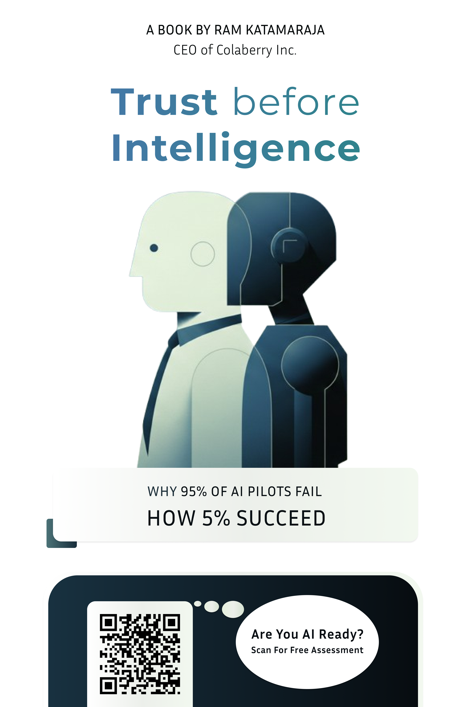

## COVER

<!-- pagebreak -->

## TITLE PAGE

# Trust Before Intelligence

### Why 95% of AI Pilots Fail, How 5% Succeed

**Ram Dhan Yadav Katamaraja**

CEO, Colaberry Inc.

*Colaberry Press*

<!-- pagebreak -->

## COPYRIGHT PAGE

**Trust Before Intelligence: Why 95% of AI Pilots Fail, How 5% Succeed**

Copyright © 2025-2026 Ram Dhan Yadav Katamaraja

All rights reserved. No part of this publication may be reproduced, distributed, or transmitted in any form or by any means, including photocopying, recording, or other electronic or mechanical methods, without the prior written permission of the publisher, except in the case of brief quotations embodied in critical reviews and certain other noncommercial uses permitted by copyright law.

**Trademarks**

INPACT Framework™, INPACT Score™, GOALS Framework™, and GOALS Metrics™ are trademarks of Colaberry Inc.

All other trademarks are the property of their respective owners.

**Disclaimer**

Echo Health Systems is a fictional case study created for pedagogical purposes. The organization, people, and specific metrics are composites based on patterns observed across real enterprise implementations. While Echo is fictional, the challenges, solutions, and outcomes reflect verified patterns from actual deployments.

The information in this book is provided for educational purposes only. The author and publisher make no representations or warranties with respect to the accuracy or completeness of the contents of this work.

**Published by**

Colaberry Press
Boston, Massachusetts

www.colaberry.com

ISBN: 979-8-9948853-0-7 (paperback)
ISBN: 979-8-9948853-1-4 (ebook)

First Edition: 2026

<!-- pagebreak -->

## DEDICATION

*To teams told to "just add AI" without the infrastructure to support it.*

*To practitioners building trust, one layer at a time.*

*To my colleagues at Colaberry, who inspired this endeavor.*

*To my parents, my wife Swapna, and my kids, for their unwavering support in life.*

<!-- pagebreak -->

## TABLE OF CONTENTS

**PART I: THE TRUST IMPERATIVE**

- **Chapter 0:** Trust Before Intelligence ..... 1
- **Chapter 1:** Why 95% of Agent Pilots Fail ..... 9
- **Chapter 2:** The INPACT Framework™ ..... 26
- **Chapter 3:** From BI-Era to Agent-Era ..... 43

**PART II: THE 95% SOLUTION**

- **Chapter 4:** The 95% Solution – Part 1 (Foundation Layers) ..... 53
- **Chapter 5:** The 95% Solution – Part 2 (Intelligence Layers) ..... 74
- **Chapter 6:** The 95% Solution – Part 3 (Transparency & Orchestration Layers) ..... 99

**PART III: TRUST IN PRACTICE**

- **Chapter 7:** The GOALS Framework™ ..... 124
- **Chapter 8:** The Architecture of Trust in Action ..... 157
- **Chapter 9:** What's Your Score? ..... 175

**DIGITAL COMPANION**

- **Chapter 10:** The AI Agent Readiness Playbook ..... 186
- **Chapter 11:** Build Your Tech Stack ..... 202
- **Chapter 12:** Running Agents at Scale ..... 217

**BACK MATTER**

- INPACT Practitioner Reference ..... 240
- Glossary ..... 249
- Index
- About the Author

<!-- pagebreak -->

## FOREWORD

*I didn't set out to write a book. I set out to answer a challenge our clients have been struggling with.*

Throughout 2025, I kept hearing the same refrain from clients: "Our data is not ready for AI." Then MIT research from the NANDA (Networked Agents and Decentralized AI) initiative published its findings: 95% of enterprise AI pilots fail to deliver measurable business value. In that moment, I realized that both statements were true. The clients who said they weren't ready were right, and they had plenty of company. Nearly everyone was failing. The infrastructure gap they sensed wasn't intuition; it was diagnosis.

The technology shift is happening at breathtaking speed, faster than anything I've seen in three decades of helping enterprises transform their digital and data capabilities. But regardless of how fast the shift moves, enterprises carry a responsibility that doesn't accelerate with it. They have obligations to their customers, their shareholders, and the regulatory frameworks they operate within. You can't haphazardly throw in new technology and expect it to work. The stakes are simply too high.

And then there is the human dimension, which may be the hardest part of all. Change management in the age of AI is enormous, not just logistically, but emotionally. People are afraid. They are afraid of what AI will do to their jobs, their careers, and their world. Left unaddressed, fear makes people reject new technology, no matter how capable it is. I see it everywhere, in boardrooms and break rooms alike.

I believe we need to move toward winning the hearts and minds of the people who will live and work alongside these AI systems. That can only happen by providing technology, and the governance, culture, and operational systems around it, that people can genuinely trust.

That's why the name of this book is *Trust Before Intelligence*. Trust, of course, is an enormous word, spanning ethics, safety, privacy, fairness, transparency, and reliability. This book focuses on one critical dimension: *operational trust*, the kind of trust an AI agent must earn through every interaction and every decision.

To make this practical rather than theoretical, this book offers two frameworks born from experience and expertise. The INPACT Framework™ provides a six-layer architecture for building trustworthy AI infrastructure. The GOALS Framework™ provides the operational metrics to measure and sustain that trust over time. Together, they represent a blueprint for addressing the challenges enterprises now face.

This book is the practitioner's guide for building the infrastructure that makes AI agents trustworthy today.

Writing it required a kind of partnership I hadn't expected. Claude, Anthropic's AI, served as a thinking partner throughout. Not generating the ideas, which came from decades of practice, but helping me pressure-test them, organize them, and express them with the precision that practitioners need. The irony of writing a book about AI trust with an AI collaborator is not lost on me. It's also proof of the thesis: when the infrastructure of collaboration is right, intelligence delivers extraordinary value.

My hope is that this book changes the conversation. Instead of asking "Is our data ready for AI?" I want teams to ask "Is our infrastructure ready to earn the trust that makes AI valuable?" This simple reframing, from readiness to trustworthiness, changes everything.

**Trust comes first. Intelligence follows.**

<!-- pagebreak -->

## ACKNOWLEDGMENTS

This book exists because of the generosity of many people who shared their time, expertise, and encouragement. Writing about enterprise AI trust required drawing on a community far larger than any one person's experience, and I'm grateful to everyone who helped shape these ideas.

**The Colaberry Team.** This book reflects lessons learned building Colaberry alongside an exceptional team. John McBride, David Freni (who also designed the cover), David Lahme, Ali Muwwakkil, Karun Swaroop, Ramamohan Manamasa, Angie Mezo, Neha Sharma, Nate Taylor, Prasad Ankepalli, Mohammad Abdul Aleem, Sai Tejesh Kowtharapu, and many other Colaberry experts who are in the trenches, thank you for your dedication to our mission and for tolerating my book-related distractions.

**Thought Leaders and Influences.** Martin Fowler's writings on software architecture and enterprise patterns at ThoughtWorks have been a lasting influence on my thinking and career. The ideas in this book were also shaped by pioneers redefining what's possible with AI: Dario Amodei's work on AI safety, Andrej Karpathy's Software 3.0 vision, Andrew Ng's democratization of machine learning, Peter Diamandis's vision of abundance, and Tony Robbins's principles on peak performance and organizational transformation. Dr. John J. Sviokla's insights on AI strategy and business transformation helped bridge the gap between technical possibility and enterprise reality.

**Professional Community.** I'm grateful to colleagues across organizations who challenged my thinking and refined these frameworks. Paul Bilodeau and Aditya Mohan Sharma at SkillsProject contributed insights on AI adoption in workforce transformation. Suhit Anantula, author of *The Helix Moment*, offered valuable perspectives on navigating inflection points in technology and business. Vishal Kumar at The Work Company offered perspectives on the future of work and AI integration. The YPO Tech AI / ML Community provided a forum for testing ideas with fellow technology leaders. Rajkumar Kandukuri and Sudhakar MVK reviewed early drafts and provided invaluable suggestions that improved both clarity and practical applicability. Their willingness to read rough chapters and push back on unclear thinking made this a better book.

**Harvard OPM.** My classmates and Alumni at Harvard Business School's Owner/President Management program pushed me to think bigger about what this book could become. Special thanks to Shailu Tipparaju, Mike Said, Ricardo De La Fuente, Michael Chen, Mustapha Shaikh, Volodymyr Berezhniy, Mathew (Madhu) Mammen, Ashwin Mittal, Vad Yazvinski, Tim Gu, Benson Smith, Gustavo Ayala, Vic Bageria, and many other business leaders for their ongoing support and the kind of candid feedback that only true peers can give.

**A Note on AI Collaboration.** Claude, Anthropic's AI, served as a thinking partner throughout this book. This collaboration embodied the very thesis: when the right infrastructure of trust is in place, human-AI partnership produces results neither could achieve alone.

*To everyone who contributed to this work, named and unnamed: thank you. The trust we build together is what makes intelligence worthwhile.*
