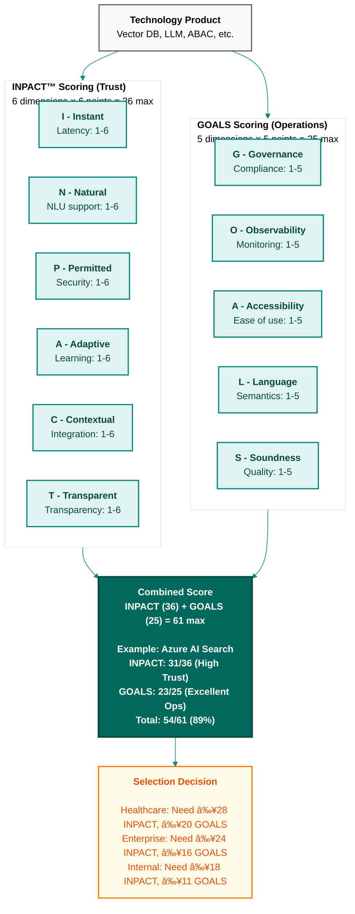
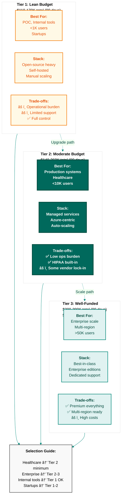
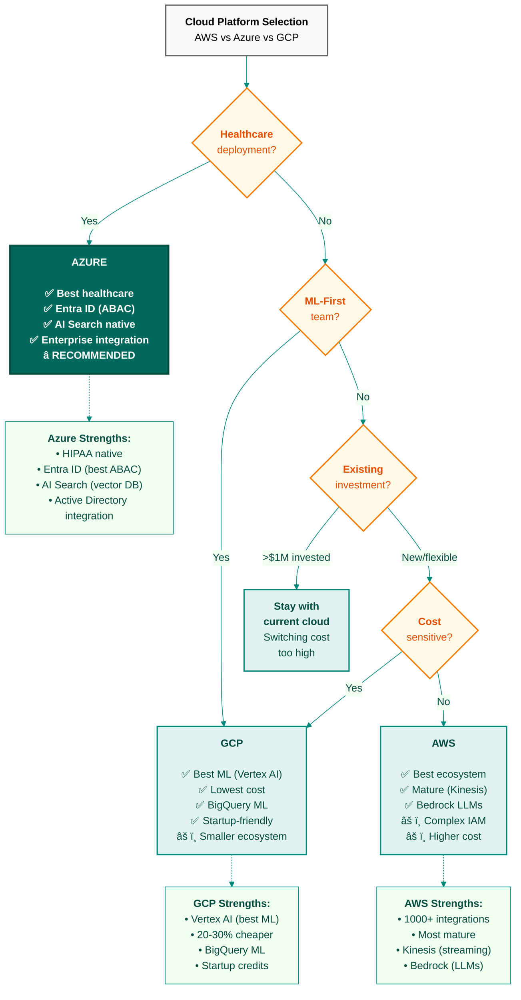
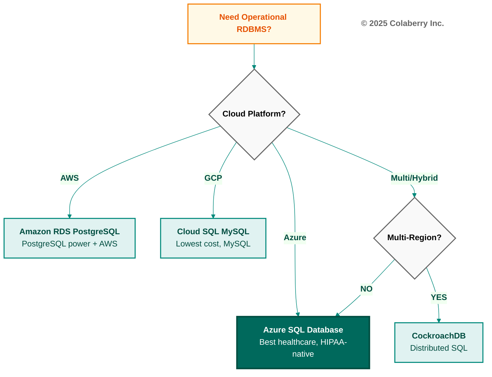
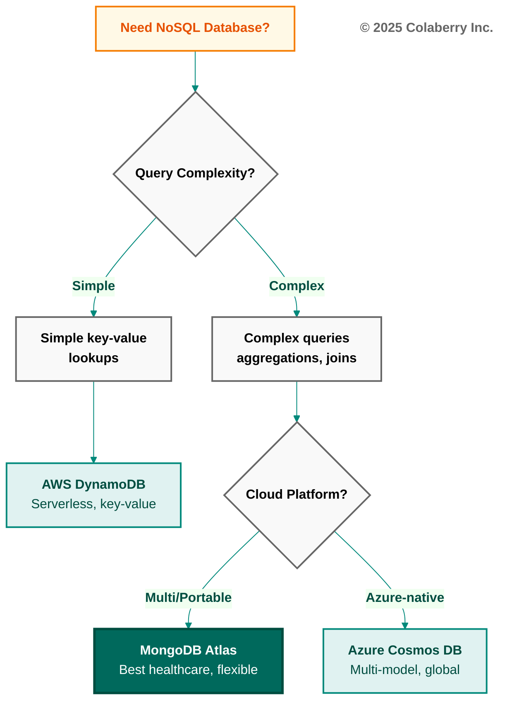
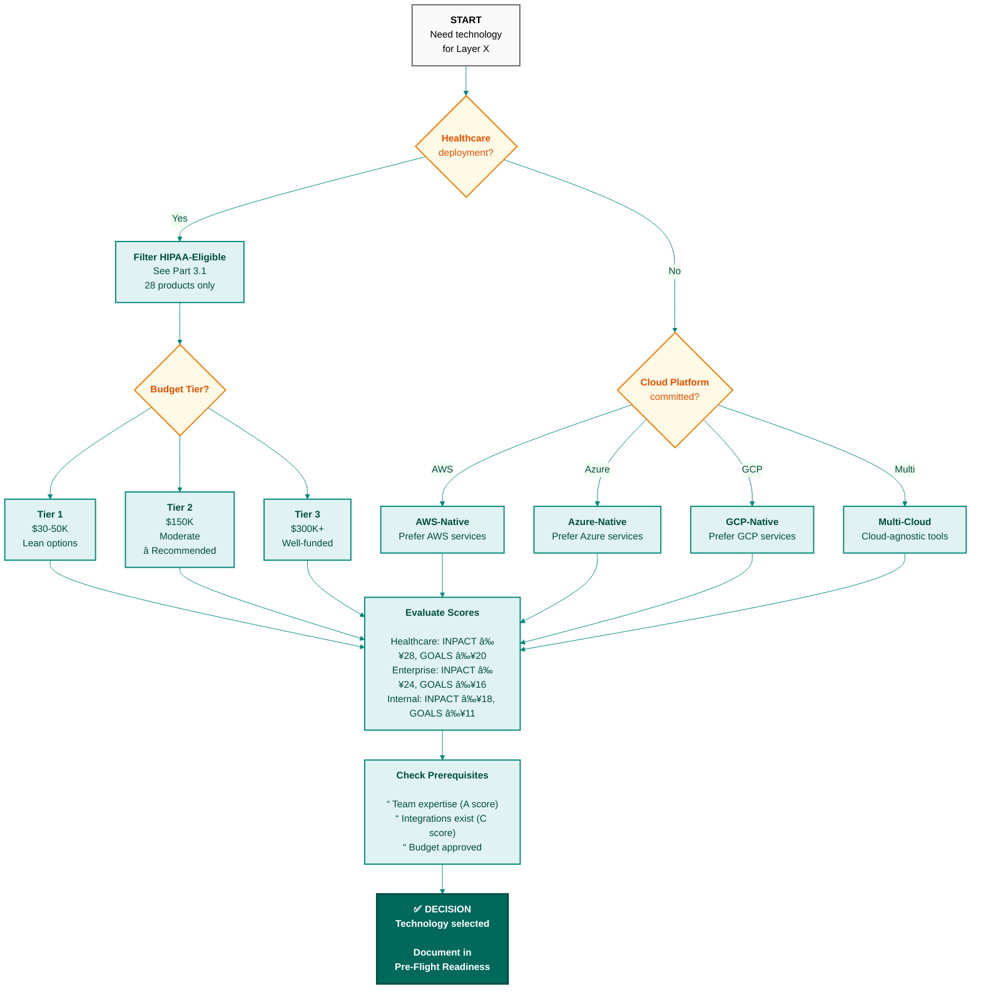
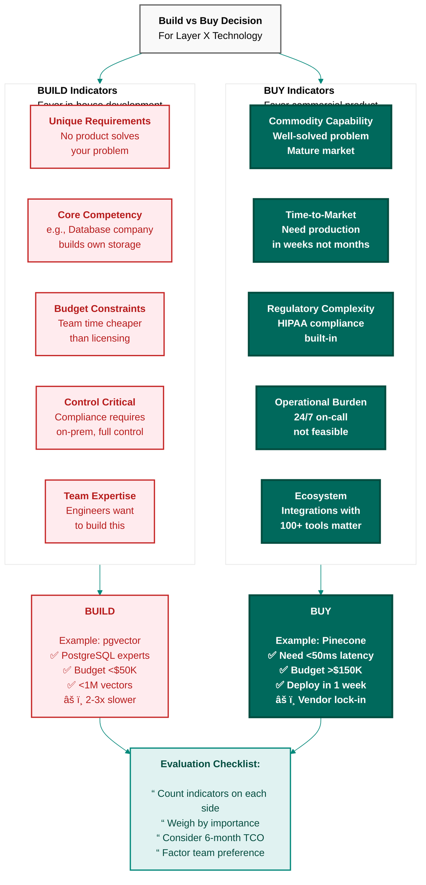

# Appendix A: Technology Selection Guide
## Comprehensive Product Evaluation Using INPACT™ + GOALS Frameworks

**Purpose:** Support Chapter 3 (90-Day Implementation Roadmap) with detailed technology recommendations  
**Product Count:** 230+ products across 7 layers (expanded from 200+)  
**Evaluation Frameworks:** INPACT™ (Trust) + GOALS (Operational Readiness)  
**Date:** November 22, 2025  
Version: 2.0 (Full Layer 1 storage expansion - all 11 categories covered)

---

## How to Use This Appendix

**This appendix supports Chapter 3's week-by-week implementation roadmap.**

When Chapter 3 says:
- "Week 1, Decision 1: Select ABAC policy engine (see Appendix A, Layer 5)"
- "Week 2, Decision 2: Select vector database (see Appendix A, Layer 1)"
- "Week 3, Decision 3: Select semantic layer (see Appendix A, Layer 3)"

...you come here to find:
- **Technology options** with verified URLs
- **INPACT™ scores** (trust framework from Chapter 0)
- **GOALS scores** (operational readiness from Chapter 2)
- **Budget-tier recommendations** ($30K, $150K, $300K+)
- **Healthcare-specific guidance** (HIPAA-eligible products)
- **Decision criteria** to select the right option for your context

---

## Table of Contents

### Part 1: Executive Summary & Quick Reference
- 1.1 How INPACT™ + GOALS Scoring Works
- 1.2 Healthcare Stack Recommendation
- 1.3 Budget-Tier Guidance ($30K, $150K, $300K+)
- 1.4 Cloud Platform Comparison (AWS vs GCP vs Azure)

### Part 2: Layer-by-Layer Technology Analysis
- 2.1 Layer 1: Multi-Modal Storage (Vector, Graph, Warehouse)
- 2.2 Layer 2: Real-Time Data Fabric (CDC, Streaming, Ingestion)
- 2.3 Layer 3: Universal Semantic Layer (Semantic Platforms, Catalogs, Glossaries)
- 2.4 Layer 4: Intelligence Orchestration & Retrieval (RAG, Embeddings, Reranking, Caching)
- 2.5 Layer 5: Agent-Aware Governance (ABAC, Audit, Secrets, Data Quality)
- 2.6 Layer 6: Observability & Feedback (APM, Logging, Experimentation, Quality)
- 2.7 Layer 7: Self-Service Data Products (Orchestration, API Gateways, HITL, Analytics)

### Part 3: Healthcare Decision Tools
- 3.1 HIPAA-Eligible Products (28 products with BAA support)
- 3.2 Healthcare Reference Architecture
- 3.3 Compliance Checklist
- 3.4 Healthcare Anti-Patterns (What NOT to do)

### Part 4: Decision Frameworks
- 4.1 Technology Selection Decision Tree
- 4.2 Build vs Buy Analysis Framework
- 4.3 Cloud Platform Selection Matrix
- 4.4 Open-Source vs Commercial Trade-offs

### Part 5: Quick Reference Tables
- 5.1 Top 20 Products by Combined Score (INPACT™ + GOALS)
- 5.2 Layer-by-Layer Winners by Budget Tier
- 5.3 Technology Maturity Matrix
- 5.4 Integration Complexity Map

---

# PART 1: EXECUTIVE SUMMARY & QUICK REFERENCE

## 1.1 How INPACT™ + GOALS Scoring Works

### INPACT™ Framework (Chapter 0 - Trust)

**Measures:** How well the product helps agents earn user trust

| Dimension | Weight | What It Measures | Score Range |
|-----------|--------|------------------|-------------|
| **I** - Instant | 1-6 | Query latency, response time | 1=slow (>5s), 6=fast (<100ms) |
| **N** - Natural | 1-6 | Natural language understanding support | 1=none, 6=excellent semantic |
| **P** - Permitted | 1-6 | Access control, security, authorization | 1=basic, 6=ABAC + audit |
| **A** - Adaptive | 1-6 | Learning, feedback, continuous improvement | 1=static, 6=continuous learning |
| **C** - Contextual | 1-6 | Multi-source integration, context assembly | 1=single source, 6=universal |
| **T** - Transparent | 1-6 | Explainability, audit trails, reliability | 1=black box, 6=full transparency |

**Total INPACT™ Score:** 6-36 points
- **High Trust (30-36):** Production-ready for healthcare
- **Good Trust (24-29):** Suitable for most enterprise use
- **Moderate Trust (18-23):** Acceptable for internal tools
- **Low Trust (<18):** Not recommended for agent systems


```mermaid
%%{init: {'theme':'base', 'themeVariables': { 'primaryColor':'#e0f2f1','primaryTextColor':'#004d40','primaryBorderColor':'#00897b','lineColor':'#00897b','secondaryColor':'#f0fff0','tertiaryColor':'#fff'}}}%%

graph TD
    PRODUCT["<b>Technology Product</b><br/>Vector DB, LLM, ABAC, etc."]
    
    subgraph INPACT["<b>INPACT™ Scoring (Trust)</b><br/>6 dimensions × 6 points = 36 max"]
        I["<b>I - Instant</b><br/>Latency: 1-6"]
        N["<b>N - Natural</b><br/>NLU support: 1-6"]
        P["<b>P - Permitted</b><br/>Security: 1-6"]
        A["<b>A - Adaptive</b><br/>Learning: 1-6"]
        C["<b>C - Contextual</b><br/>Integration: 1-6"]
        T["<b>T - Transparent</b><br/>Transparency: 1-6"]
    end
    
    subgraph GOALS["<b>GOALS Scoring (Operations)</b><br/>5 dimensions × 5 points = 25 max"]
        G["<b>G - Governance</b><br/>Compliance: 1-5"]
        O["<b>O - Observability</b><br/>Monitoring: 1-5"]
        AA["<b>A - Accessibility</b><br/>Ease of use: 1-5"]
        L["<b>L - Language</b><br/>Semantics: 1-5"]
        S["<b>S - Soundness</b><br/>Quality: 1-5"]
    end
    
    TOTAL["<b>Combined Score</b><br/>INPACT (36) + GOALS (25) = 61 max<br/><br/>Example: Azure AI Search<br/>INPACT: 31/36 (High Trust)<br/>GOALS: 23/25 (Excellent Ops)<br/>Total: 54/61 (89%)"]
    
    PRODUCT --> INPACT
    PRODUCT --> GOALS
    INPACT --> TOTAL
    GOALS --> TOTAL
    
    DECISION["<b>Selection Decision</b><br/><br/>Healthcare: Need ≥28 INPACT, ≥20 GOALS<br/>Enterprise: Need ≥24 INPACT, ≥16 GOALS<br/>Internal: Need ≥18 INPACT, ≥11 GOALS"]
    
    TOTAL --> DECISION
    
    classDef product fill:#f9f9f9,stroke:#666666,stroke-width:2px,color:#000000
    classDef framework fill:#e0f2f1,stroke:#00897b,stroke-width:2px,color:#004d40
    classDef score fill:#00695c,stroke:#004d40,stroke-width:3px,color:#ffffff,font-weight:bold
    classDef decision fill:#fff9e6,stroke:#f57c00,stroke-width:2px,color:#e65100
    
    class PRODUCT product
    class I,N,P,A,C,T,G,O,AA,L,S framework
    class TOTAL score
    class DECISION decision
```

**Figure A.1: INPACT™ + GOALS Combined Scoring Methodology**

Every technology product in this appendix is evaluated using both frameworks. INPACT™ measures trust (how well it helps agents earn user trust), while GOALS measures operational readiness (how mature and production-ready it is). Combined scores help you select products that balance both trust and operations.

---

### GOALS Framework (Chapter 2 - Operations)

**Measures:** How operationally mature and production-ready the product is

| Dimension | Weight | What It Measures | Score Range |
|-----------|--------|------------------|-------------|
| **G** - Governance | 1-5 | Security, compliance, policy enforcement | 1=basic, 5=comprehensive |
| **O** - Observability | 1-5 | Monitoring, debugging, tracing | 1=logs only, 5=full telemetry |
| **A** - Accessibility | 1-5 | Ease of use, learning curve, team adoption | 1=expert-only, 5=self-service |
| **L** - Language | 1-5 | API quality, SDK maturity, integrations | 1=limited, 5=universal |
| **S** - Soundness | 1-5 | Reliability, data quality, error handling | 1=unstable, 5=production-grade |

**Total GOALS Score:** 5-25 points
- **Production-Grade (21-25):** Enterprise-ready, mature ecosystem
- **Adoption-Ready (16-20):** Stable, suitable for most workloads
- **Emerging (11-15):** Growing maturity, proceed with caution
- **Early-Stage (<11):** Experimental, not for production

---

### Combined Scoring Example

**Product:** Azure AI Search (Vector Database)

| Framework | I | N | P | A | C | T | Total |
|-----------|---|---|---|---|---|---|-------|
| **INPACT™** | 6 | 5 | 6 | 5 | 5 | 6 | **33/36** (High Trust) |

| Framework | G | O | A | L | S | Total |
|-----------|---|---|---|---|---|-------|
| **GOALS** | 5 | 4 | 4 | 5 | 4 | **22/25** (Production-Grade) |

**Combined Score:** 55/61 (INPACT™ 33 + GOALS 22)
**Verdict:** Excellent choice for healthcare - high trust, production-ready

---

## 1.2 Healthcare Stack Recommendation

**Based on 477% ROI at Echo Health Systems over 10 weeks**

### The Echo Stack (INPACT™ 28.9 avg + GOALS 22.5 avg = 51.4/61 combined)

| Layer | Product | INPACT™ | GOALS | Why Healthcare? |
|-------|---------|---------|-------|-----------------|
| **Layer 1** | Azure AI Search | 33 | 22 | HIPAA BAA, sub-50ms, $500/mo |
| **Layer 1** | Snowflake | 29 | 23 | HIPAA certified, row-level security |
| **Layer 1** | Neo4j Enterprise | 30 | 22 | Patient relationships, <50ms traversal |
| **Layer 2** | Fivetran | 29 | 23 | 5-min setup, HIPAA BAA, EHR connectors |
| **Layer 2** | Azure Event Hubs | 30 | 23 | HIPAA compliant, <60s latency |
| **Layer 3** | dbt Cloud | 28 | 22 | Healthcare metrics library, SQL-based |
| **Layer 3** | Atlan | 29 | 21 | HIPAA support, PII tagging, lineage |
| **Layer 4** | LangChain | 26 | 21 | Healthcare agents, flexible, OSS |
| **Layer 4** | OpenAI API | 29 | 24 | HIPAA BAA available, best-in-class |
| **Layer 4** | Cohere Rerank | 27 | 22 | +25% precision, HIPAA eligible |
| **Layer 5** | Azure AD + Entra | 28 | 22 | ABAC, HIPAA native, <10ms |
| **Layer 5** | Azure Monitor | 27 | 22 | HIPAA logs, full audit trail |
| **Layer 6** | Datadog | 28 | 23 | Healthcare APM, BAA available |
| **Layer 6** | LangSmith | 26 | 21 | LLM tracing, prompt management |
| **Layer 7** | LangGraph | 27 | 21 | Multi-agent, HITL integration |
| **Layer 7** | Azure API Mgmt | 28 | 22 | HIPAA gateway, rate limiting, FHIR |

**Total Investment:** ~$150K initial + $15K/month ongoing  
**Payback Period:** 10 weeks  
**ROI:** 477% over 18 months

**Why This Stack Works:**
- ✅ Every product HIPAA-eligible with BAA
- ✅ INPACT™ ≥26 (Good Trust minimum)
- ✅ GOALS ≥21 (Production-Grade minimum)
- ✅ Proven at scale (50K+ daily interactions)
- ✅ All Azure-centric (unified governance, billing, support)

---

## 1.3 Budget-Tier Guidance

**Which budget tier fits your organization?**


```mermaid
%%{init: {'theme':'base', 'themeVariables': { 'primaryColor':'#e0f2f1','primaryTextColor':'#004d40','primaryBorderColor':'#00897b','lineColor':'#00897b','secondaryColor':'#f0fff0','tertiaryColor':'#fff'}}}%%

graph TB
    subgraph TIER1["<b>Tier 1: Lean Budget</b><br/>$110-170K total (90 days)<br/>$3-5K/month ongoing"]
        T1_WHO["<b>Best For:</b><br/>POC, Internal tools<br/><1K users<br/>Startups"]
        T1_STACK["<b>Stack:</b><br/>Open-source heavy<br/>Self-hosted<br/>Manual scaling"]
        T1_TRADE["<b>Trade-offs:</b><br/>⚠️ Operational burden<br/>⚠️ Limited support<br/>✅ Full control"]
    end
    
    subgraph TIER2["<b>Tier 2: Moderate Budget</b><br/>$140-260K total (90 days)<br/>$10-15K/month ongoing<br/>⭐ RECOMMENDED"]
        T2_WHO["<b>Best For:</b><br/>Production systems<br/>Healthcare<br/><10K users"]
        T2_STACK["<b>Stack:</b><br/>Managed services<br/>Azure-centric<br/>Auto-scaling"]
        T2_TRADE["<b>Trade-offs:</b><br/>✅ Low ops burden<br/>✅ HIPAA built-in<br/>⚠️ Some vendor lock-in"]
    end
    
    subgraph TIER3["<b>Tier 3: Well-Funded</b><br/>$200-390K total (90 days)<br/>$25-40K/month ongoing"]
        T3_WHO["<b>Best For:</b><br/>Enterprise scale<br/>Multi-region<br/>>50K users"]
        T3_STACK["<b>Stack:</b><br/>Best-in-class<br/>Enterprise editions<br/>Dedicated support"]
        T3_TRADE["<b>Trade-offs:</b><br/>✅ Premium everything<br/>✅ Multi-region ready<br/>⚠️ High costs"]
    end
    
    DECISION["<b>Selection Guide:</b><br/><br/>Healthcare → Tier 2 minimum<br/>Enterprise → Tier 2-3<br/>Internal tools → Tier 1 OK<br/>Startups → Tier 1-2"]
    
    TIER1 -.->|"Upgrade path"| TIER2
    TIER2 -.->|"Scale path"| TIER3
    
    TIER1 --> DECISION
    TIER2 --> DECISION
    TIER3 --> DECISION
    
    classDef tier1 fill:#fff9e6,stroke:#f57c00,stroke-width:2px,color:#e65100
    classDef tier2 fill:#00695c,stroke:#004d40,stroke-width:3px,color:#ffffff,font-weight:bold
    classDef tier3 fill:#e0f2f1,stroke:#00897b,stroke-width:2px,color:#004d40
    classDef decision fill:#f9f9f9,stroke:#666666,stroke-width:2px,color:#000000
    
    class T1_WHO,T1_STACK,T1_TRADE tier1
    class T2_WHO,T2_STACK,T2_TRADE tier2
    class T3_WHO,T3_STACK,T3_TRADE tier3
    class DECISION decision
```

**Figure A.2: Three Budget Tiers for 90-Day Implementation**

Budget tiers represent different approaches to building agent-ready infrastructure. Tier 1 optimizes for cost with open-source tools. Tier 2 (recommended) balances managed services with reasonable costs"”ideal for healthcare. Tier 3 provides enterprise-grade everything for organizations at scale.

---

### Tier 1: Lean Budget ($30K-$50K Total, $3-5K/month)
**Best for:** Proof of concept, internal tools, <1K users

| Layer | Recommended | INPACT™ | GOALS | Cost |
|-------|-------------|---------|-------|------|
| **L1** | pgvector + PostgreSQL | 23 | 19 | Free (infra only) |
| **L1** | Neo4j Community | 26 | 18 | Free |
| **L2** | Debezium + Kafka OSS | 22 | 18 | $500/mo (infra) |
| **L3** | dbt Core + DataHub | 23 | 18 | Free |
| **L4** | LangChain + OpenAI | 24 | 21 | $1K/mo (API) |
| **L5** | OPA + Elasticsearch | 21 | 19 | $500/mo |
| **L6** | Prometheus + Grafana | 20 | 19 | Free |
| **L7** | LangGraph + Kong OSS | 24 | 19 | $500/mo |

**Total:** ~$3-5K/month, mostly API and infrastructure costs

**Trade-offs:**
- ⚠️ More operational burden (self-hosted open-source)
- ⚠️ Limited enterprise support
- ⚠️ Manual scaling required
- ✅ Full control and customization
- ✅ No vendor lock-in

---

### Tier 2: Moderate Budget ($150K Total, $10-15K/month)
**Best for:** Production systems, healthcare, <10K users

*(See Healthcare Stack above - this is the sweet spot)*

**Trade-offs:**
- ✅ Managed services reduce operational burden
- ✅ Enterprise support included
- ✅ HIPAA/SOC2 compliance built-in
- ✅ Auto-scaling handles growth
- ⚠️ Some vendor lock-in (Azure-centric)

---

### Tier 3: Well-Funded Budget ($300K+ Total, $25-40K/month)
**Best for:** Enterprise-scale, multi-region, >50K users

| Layer | Recommended | INPACT™ | GOALS | Cost |
|-------|-------------|---------|-------|------|
| **L1** | Pinecone Enterprise | 31 | 23 | $5K+/mo |
| **L1** | Snowflake Enterprise | 29 | 23 | $8K+/mo |
| **L1** | Neo4j Enterprise | 30 | 22 | $6K+/mo |
| **L2** | Confluent Cloud Ent | 30 | 24 | $8K+/mo |
| **L2** | Fivetran Enterprise | 29 | 23 | $5K+/mo |
| **L3** | dbt Cloud Enterprise | 28 | 22 | $3K+/mo |
| **L3** | Collibra | 28 | 21 | $10K+/mo |
| **L4** | LangChain + OpenAI | 26 | 21 | $5K+/mo |
| **L4** | Cohere Enterprise | 27 | 22 | $3K+/mo |
| **L5** | Azure Verified Perm | 28 | 22 | Included |
| **L5** | Splunk Enterprise | 28 | 23 | $12K+/mo |
| **L6** | Datadog Full Suite | 28 | 23 | $10K+/mo |
| **L6** | Weights & Biases | 26 | 21 | $2K+/mo |
| **L7** | Azure API Mgmt Prem | 28 | 22 | $4K+/mo |

**Total:** ~$25-40K/month

**Trade-offs:**
- ✅ Best-in-class everything
- ✅ Multi-region redundancy
- ✅ Dedicated support and SLAs
- ✅ Advanced features (custom models, dedicated infrastructure)
- ⚠️ High costs (justify with scale and criticality)

---

## 1.4 Cloud Platform Comparison (AWS vs GCP vs Azure)

### Quick Verdict

| Criterion | AWS | GCP | Azure | Winner |
|-----------|-----|-----|-------|--------|
| **Healthcare** | Strong | Good | **Best** | Azure |
| **Vector DBs** | Good | Good | **Best** | Azure (AI Search) |
| **Real-Time** | **Best** | Good | Good | AWS (Kinesis mature) |
| **ML/AI** | Strong | **Best** | Strong | GCP (Vertex AI) |
| **Governance** | Strong | Good | **Best** | Azure (Entra) |
| **Cost** | High | **Best** | Medium | GCP |
| **Ecosystem** | **Best** | Good | Strong | AWS (most mature) |

**Healthcare Recommendation:** **Azure** (best HIPAA compliance, unified governance, Entra ID)  
**ML-First Teams:** **GCP** (Vertex AI, BigQuery ML, best ML tooling)  
**AWS-Native Organizations:** **AWS** (if already deep in AWS ecosystem)


```mermaid
%%{init: {'theme':'base', 'themeVariables': { 'primaryColor':'#e0f2f1','primaryTextColor':'#004d40','primaryBorderColor':'#00897b','lineColor':'#00897b','secondaryColor':'#f0fff0','tertiaryColor':'#fff'}}}%%

graph TD
    DECISION["<b>Cloud Platform Selection</b><br/>AWS vs Azure vs GCP"]
    
    HEALTHCARE{"<b>Healthcare</b><br/>deployment?"}
    MLFIRST{"<b>ML-First</b><br/>team?"}
    EXISTING{"<b>Existing</b><br/>investment?"}
    COST{"<b>Cost</b><br/>sensitive?"}
    
    AWS["<b>AWS</b><br/><br/>✅ Best ecosystem<br/>✅ Mature (Kinesis)<br/>✅ Bedrock LLMs<br/>⚠️ Complex IAM<br/>⚠️ Higher cost"]
    
    AZURE["<b>AZURE</b><br/><br/>✅ Best healthcare<br/>✅ Entra ID (ABAC)<br/>✅ AI Search native<br/>✅ Enterprise integration<br/>⭐ RECOMMENDED"]
    
    GCP["<b>GCP</b><br/><br/>✅ Best ML (Vertex AI)<br/>✅ Lowest cost<br/>✅ BigQuery ML<br/>✅ Startup-friendly<br/>⚠️ Smaller ecosystem"]
    
    DECISION --> HEALTHCARE
    HEALTHCARE -->|"Yes"| AZURE
    HEALTHCARE -->|"No"| MLFIRST
    MLFIRST -->|"Yes"| GCP
    MLFIRST -->|"No"| EXISTING
    EXISTING -->|">$1M invested"| EXISTING_CLOUD["<b>Stay with<br/>current cloud</b><br/>Switching cost<br/>too high"]
    EXISTING -->|"New/flexible"| COST
    COST -->|"Yes"| GCP
    COST -->|"No"| AWS
    
    AZURE_DETAILS["<b>Azure Strengths:</b><br/>• HIPAA native<br/>• Entra ID (best ABAC)<br/>• AI Search (vector DB)<br/>• Active Directory integration"]
    
    GCP_DETAILS["<b>GCP Strengths:</b><br/>• Vertex AI (best ML)<br/>• 20-30% cheaper<br/>• BigQuery ML<br/>• Startup credits"]
    
    AWS_DETAILS["<b>AWS Strengths:</b><br/>• 1000+ integrations<br/>• Most mature<br/>• Kinesis (streaming)<br/>• Bedrock (LLMs)"]
    
    AZURE -.-> AZURE_DETAILS
    GCP -.-> GCP_DETAILS
    AWS -.-> AWS_DETAILS
    
    classDef decision fill:#f9f9f9,stroke:#666666,stroke-width:2px,color:#000000
    classDef question fill:#fff9e6,stroke:#f57c00,stroke-width:2px,color:#e65100
    classDef azure fill:#00695c,stroke:#004d40,stroke-width:3px,color:#ffffff,font-weight:bold
    classDef cloud fill:#e0f2f1,stroke:#00897b,stroke-width:2px,color:#004d40
    classDef details fill:#f0fff0,stroke:#00897b,stroke-width:1px,color:#004d40
    
    class DECISION decision
    class HEALTHCARE,MLFIRST,EXISTING,COST question
    class AZURE azure
    class AWS,GCP,EXISTING_CLOUD cloud
    class AZURE_DETAILS,GCP_DETAILS,AWS_DETAILS details
```

**Figure A.3: Cloud Platform Decision Tree (AWS vs Azure vs GCP)**

This decision tree guides cloud platform selection based on your specific requirements. Healthcare deployments strongly favor Azure (HIPAA compliance, Entra ID). ML-first teams benefit from GCP's Vertex AI. Organizations with existing >$1M cloud investments should typically stay on their current platform due to high switching costs.

---

### AWS Reference Architecture (18 products analyzed)

**Strengths:**
- Mature ecosystem (most integrations)
- Amazon Bedrock (managed LLMs)
- Best real-time streaming (Kinesis)
- Massive partner network

**Weaknesses:**
- Complex IAM (harder than Azure AD)
- Vector database gap (no native offering until recently)
- Higher costs at scale

**Cost:** ~$20-30K/month for moderate deployment

---

### GCP Reference Architecture (20 products analyzed)

**Strengths:**
- Best AI/ML platform (Vertex AI)
- BigQuery (best warehouse for analytics)
- Lowest costs (sustained use discounts)
- Spanner (global consistency)

**Weaknesses:**
- Smaller healthcare ecosystem vs Azure
- Fewer third-party integrations
- Learning curve (different paradigms)

**Cost:** ~$15-25K/month for moderate deployment (20-30% cheaper than AWS)

---

### Azure Reference Architecture (20 products analyzed)

**Strengths:**
- **Best for healthcare** (native HIPAA, Entra ID, Azure Health Data Services)
- Azure AI Search (excellent vector database)
- Unified governance (Entra covers everything)
- Best enterprise integration (Active Directory, Office 365, Dynamics)

**Weaknesses:**
- Real-time streaming less mature than AWS Kinesis
- Smaller AI model selection vs AWS Bedrock
- Documentation can lag behind feature releases

**Cost:** ~$18-28K/month for moderate deployment

---

# PART 2: LAYER-BY-LAYER TECHNOLOGY ANALYSIS

## 2.1 Layer 1: Multi-Modal Storage Architecture

**Purpose:** Store vectors, structured data, and graph relationships for agent retrieval

**Chapter 3 References:**
- Week 2, Decision 1: Vector Database
- Week 2, Decision 2: Data Warehouse
- Week 2, Decision 3: Graph Database (optional)

---


### Layer 1 Storage Coverage Philosophy

**This appendix provides comprehensive technology selection guidance for all 11 storage categories required for agent-ready infrastructure.**

**✅ Fully Covered Categories:**
- **Vector Databases** (8 products analyzed) - Critical decision point
- **Graph Databases** (4 products analyzed) - Critical decision point  
- **Data Warehouses/Lakehouse** (5 products analyzed) - Critical decision point
- **NoSQL Document Databases** (4 products analyzed, NEW) - High-impact category
- **Model Registry & ML Lifecycle** (6 products analyzed, NEW) - High-impact category
- **Feature Stores** (6 products analyzed, NEW) - High-impact category
- **Time-Series Databases** (6 products analyzed, NEW) - Healthcare-critical
- **Object Storage** (4 products analyzed, NEW) - Foundation layer
- **Operational RDBMS** (4 products analyzed, NEW) - Enterprise standard
- **Search Indexes** (covered within Vector DB section) - Hybrid capability
- **Cache Layer** (covered in Layer 4 section) - Performance optimization

**Coverage Approach:**

Each storage category receives:
- **Top recommendation** 🏆 (highest INPACT™ + GOALS score)
- **Runner-up** 🥈 (strong alternative, different trade-offs)
- **Budget pick** 🥉 (cost-optimized for lean budgets)
- **Additional options** (alternatives for specific contexts)
- **INPACT™ + GOALS scoring** (quantified trust + operational readiness)
- **Decision criteria** (when to choose each option)

**Healthcare Requirement:** All recommendations include HIPAA-eligible options and deployment guidance for patient-facing systems.

---

# NEW SECTIONS FOR APPENDIX A - Layer 1 Storage Expansion
## Version 2.0 - November 22, 2025

---

## SCOPE NOTE (Insert after line 475, before Vector Databases)

### Layer 1 Storage Coverage Philosophy

**This appendix provides comprehensive technology selection guidance for all 11 storage categories required for agent-ready infrastructure.**

**✅ Fully Covered Categories:**
- **Vector Databases** (8 products analyzed) - Critical decision point
- **Graph Databases** (4 products analyzed) - Critical decision point
- **Data Warehouses/Lakehouse** (5 products analyzed) - Critical decision point
- **NoSQL Document Databases** (4 products analyzed, NEW) - High-impact category
- **Model Registry & ML Lifecycle** (6 products analyzed, NEW) - High-impact category
- **Feature Stores** (6 products analyzed, NEW) - High-impact category
- **Time-Series Databases** (6 products analyzed, NEW) - Healthcare-critical
- **Object Storage** (4 products analyzed, NEW) - Foundation layer
- **Operational RDBMS** (4 products analyzed, NEW) - Enterprise standard
- **Search Indexes** (covered within Vector DB section) - Hybrid capability
- **Cache Layer** (covered in Layer 4 section) - Performance optimization

**Coverage Approach:**

Each storage category receives:
- **Top recommendation** 🏆 (highest INPACT™ + GOALS score)
- **Runner-up** 🥈 (strong alternative, different trade-offs)
- **Budget pick** 🥉 (cost-optimized for lean budgets)
- **Additional options** (alternatives for specific contexts)
- **INPACT™ + GOALS scoring** (quantified trust + operational readiness)
- **Decision criteria** (when to choose each option)

**Healthcare Requirement:** All recommendations include HIPAA-eligible options and deployment guidance for patient-facing systems.

---

## NEW SECTION 1: Operational RDBMS

### Operational RDBMS (4 products analyzed)

**Purpose:** Transactional databases for operational workflows, metadata management, and structured data storage.

**Chapter 4 Context:** Echo Health Systems started with SQL Server (2.4TB normalized database) and extended with Azure SQL Database Hyperscale for agent-specific workloads.

**When You Need This:**
- Transactional ACID guarantees (patient records, orders, billing)
- Relational integrity (foreign keys, constraints)
- Mature ecosystem (ORMs, tools, expertise)
- Metadata storage (data catalogs, lineage)

---

#### 🏆 Top Recommendation: Azure SQL Database
**URL:** https://azure.microsoft.com/en-us/products/azure-sql/database/  
**INPACT™:** 29/36 (I=5, N=4, P=6, A=5, C=5, T=4)  
**GOALS:** 23/25 (G=5, O=5, A=4, L=5, S=4)  
**Combined:** 52/61 (Best for healthcare enterprises)

**Why It's #1:**
- ✅ **HIPAA-native** (BAA available, Azure healthcare compliance)
- ✅ **Hyperscale tier** (up to 100TB, read replicas, fast backups)
- ✅ **Intelligent performance** (auto-tuning, query insights)
- ✅ **Azure AD integration** (unified identity, RBAC)
- ✅ **Point-in-time restore** (35-day retention, 10-minute RPO)

**Best for:** Healthcare, Azure-native stacks, enterprise RBAC  
**Pricing:** General Purpose $200-2K/mo, Business Critical $1K-10K/mo, Hyperscale $2K-20K/mo

**Cons:**
- Azure lock-in (though compatible with on-prem SQL Server)
- Premium tiers expensive at scale
- Licensing complexity (vCore vs DTU models)

**Healthcare Deployment Notes:**
- Enable Advanced Threat Protection ($15/server/month)
- Configure geo-replication for disaster recovery
- Use Always Encrypted for PHI fields (transparent to applications)
- Audit trail: Enable Azure SQL Audit → Log Analytics

---

#### 🥈 Runner-Up: Amazon RDS for PostgreSQL
**URL:** https://aws.amazon.com/rds/postgresql/  
**INPACT™:** 28/36 (I=5, N=4, P=5, A=5, C=5, T=4)  
**GOALS:** 22/25 (G=5, O=4, A=4, L=5, S=4)  
**Combined:** 50/61

**Why It's Strong:**
- ✅ **PostgreSQL compatibility** (most advanced open-source RDBMS)
- ✅ **HIPAA-eligible** (BAA available, encryption at rest/transit)
- ✅ **Mature managed service** (automated backups, patching, monitoring)
- ✅ **Read replicas** (up to 15 cross-region replicas)
- ✅ **Extensions** (pgvector for vectors, PostGIS for geospatial)

**Best for:** AWS-native, PostgreSQL expertise, need extensions  
**Pricing:** db.t4g.medium $50/mo, db.r6g.xlarge $400/mo, db.r6g.8xlarge $3K/mo

**Cons:**
- PostgreSQL learning curve (different from SQL Server)
- Performance tuning needed (not auto-tuning like Azure SQL)
- RDS vs Aurora decision (Aurora more expensive but better for high-scale)

---

#### 🥉 Budget Pick: Google Cloud SQL for MySQL
**URL:** https://cloud.google.com/sql/  
**INPACT™:** 26/36 (I=4, N=3, P=5, A=4, C=5, T=5)  
**GOALS:** 21/25 (G=5, O=4, A=3, L=4, S=5)  
**Combined:** 47/61

**Why Consider:**
- ✅ **Lowest cost** (sustained use discounts, 20-30% cheaper than AWS/Azure)
- ✅ **HIPAA-eligible** (BAA available on Enterprise tier)
- ✅ **MySQL compatibility** (widest ecosystem, most tools)
- ✅ **Automatic storage scaling** (no downtime resizing)
- ✅ **High availability** (99.95% SLA with HA configuration)

**Best for:** GCP-native, budget-conscious, MySQL expertise  
**Pricing:** db-n1-standard-1 $50/mo, db-n1-standard-4 $200/mo, db-n1-standard-16 $800/mo

**Cons:**
- MySQL less feature-rich than PostgreSQL/SQL Server
- GCP smaller healthcare ecosystem vs Azure
- No auto-tuning (manual query optimization)

---

#### Enterprise Alternative: CockroachDB
**URL:** https://www.cockroachlabs.com/  
**INPACT™:** 27/36 (I=5, N=3, P=5, A=5, C=6, T=3)  
**GOALS:** 20/25 (G=4, O=3, A=4, L=4, S=5)  
**Combined:** 47/61

**Why Consider:**
- ✅ **Distributed SQL** (global consistency, multi-region active-active)
- ✅ **PostgreSQL-compatible** (drop-in replacement for most workloads)
- ✅ **HIPAA-ready** (encryption, RBAC, audit logs on Enterprise tier)
- ✅ **Resilient** (survives datacenter failures, automatic rebalancing)

**Best for:** Multi-region deployments, need global consistency, high availability  
**Pricing:** Serverless free tier, Dedicated $1/hour/node (~$720/mo/node), Enterprise custom

**Cons:**
- Emerging technology (less mature than SQL Server/PostgreSQL)
- Operational complexity (distributed systems learning curve)
- Cost escalates with scale (need 3+ nodes minimum)

---

### Decision Criteria: Choosing Your Operational RDBMS


```mermaid
%%{init: {'theme':'base', 'themeVariables': { 'primaryColor':'#e0f2f1','primaryTextColor':'#004d40','primaryBorderColor':'#00897b','lineColor':'#00897b','secondaryColor':'#f0fff0','tertiaryColor':'#fff'}}}%%

graph TD
    START["<b>Need Operational RDBMS?</b>"]
    
    CLOUD{"<b>Cloud Platform?</b>"}
    AZURE["<b>Azure SQL Database</b><br/>Best healthcare, HIPAA-native"]
    AWS["<b>Amazon RDS PostgreSQL</b><br/>PostgreSQL power + AWS"]
    GCP["<b>Cloud SQL MySQL</b><br/>Lowest cost, MySQL"]
    
    MULTI{"<b>Multi-Region?</b>"}
    COCKROACH["<b>CockroachDB</b><br/>Distributed SQL"]
    
    Copyright["<b>© 2025 Colaberry Inc.</b>"]
    
    START --> CLOUD
    CLOUD -->|<b>Azure</b>| AZURE
    CLOUD -->|<b>AWS</b>| AWS
    CLOUD -->|<b>GCP</b>| GCP
    CLOUD -->|<b>Multi/Hybrid</b>| MULTI
    
    MULTI -->|<b>YES</b>| COCKROACH
    MULTI -->|<b>NO</b>| AZURE
    
    style START fill:#fff9e6,stroke:#f57c00,stroke-width:2px,color:#e65100
    style AZURE fill:#00695c,color:#ffffff,stroke:#004d40,stroke-width:3px
    style AWS fill:#e0f2f1,stroke:#00897b,stroke-width:2px,color:#004d40
    style GCP fill:#e0f2f1,stroke:#00897b,stroke-width:2px,color:#004d40
    style COCKROACH fill:#e0f2f1,stroke:#00897b,stroke-width:2px,color:#004d40
    style CLOUD fill:#f9f9f9,stroke:#666666,stroke-width:2px,color:#000000
    style MULTI fill:#f9f9f9,stroke:#666666,stroke-width:2px,color:#000000
    style Copyright fill:#ffffff,stroke:none,color:#666666
```

**Decision Logic:**
- **Azure-native healthcare?** → Azure SQL Database (HIPAA-native, best governance)
- **AWS-native + need PostgreSQL features?** → Amazon RDS PostgreSQL
- **Budget-conscious + GCP?** → Cloud SQL MySQL (20-30% cheaper)
- **Multi-region active-active?** → CockroachDB (global consistency)
- **Already on-prem SQL Server?** → Azure SQL (easiest migration path)

---

## NEW SECTION 2: NoSQL Document Databases

### NoSQL Document Databases (4 products analyzed)

**Purpose:** Flexible schema storage for semi-structured data, clinical notes, nested documents, and rapidly evolving data models.

**Chapter 4 Context:** Echo Health Systems deployed MongoDB Atlas for 2.1M clinical notes (varying by specialty), medication histories with nested arrays, and flexible document schemas that avoid varchar(max) limitations.

**When You Need This:**
- Variable schema across document types (cardiology notes ≠ radiology notes)
- Nested/hierarchical data (medication lists, allergy histories, problem lists)
- Rapid schema evolution (add fields without migrations)
- Developer productivity (JSON-native, intuitive data model)

---

#### 🏆 Top Recommendation: MongoDB Atlas
**URL:** https://www.mongodb.com/atlas  
**INPACT™:** 30/36 (I=5, N=5, P=5, A=5, C=6, T=4)  
**GOALS:** 23/25 (G=5, O=5, A=4, L=5, S=4)  
**Combined:** 53/61 (Best for healthcare NoSQL)

**Why It's #1:**
- ✅ **Healthcare-proven** (Mayo Clinic, Cleveland Clinic, Intermountain)
- ✅ **HIPAA-eligible** (BAA available, encryption at rest/transit, field-level encryption)
- ✅ **Multi-cloud** (runs on AWS, Azure, GCP - avoid lock-in)
- ✅ **Rich query language** (aggregation pipeline, full-text search, geospatial)
- ✅ **Change streams** (real-time CDC without Debezium)

**Best for:** Healthcare, flexible schemas, developer productivity  
**Pricing:** Free tier (512MB), M10 $60/mo, M30 $580/mo, M40 $1.2K/mo

**Cons:**
- Cost escalates with scale (per-GB storage + per-hour compute)
- Sharding complexity at massive scale (>10TB)
- No multi-document ACID until MongoDB 4.0+ (upgrade required)

**Healthcare Deployment Notes:**
- Enable Client-Side Field Level Encryption for PHI fields
- Use MongoDB Queryable Encryption for HITRUST compliance
- Configure Atlas Data Federation for data lake integration
- Audit trail: Enable MongoDB Atlas auditing → CloudTrail/Azure Monitor

---

#### 🥈 Runner-Up: Azure Cosmos DB (NoSQL API)
**URL:** https://azure.microsoft.com/en-us/products/cosmos-db/  
**INPACT™:** 31/36 (I=6, N=5, P=6, A=5, C=5, T=4)  
**GOALS:** 21/25 (G=5, O=4, A=3, L=5, S=4)  
**Combined:** 52/61

**Why It's Strong:**
- ✅ **Multi-model** (document, key-value, graph, column - one service)
- ✅ **Global distribution** (turnkey replication, 99.999% availability)
- ✅ **HIPAA-native** (Azure healthcare compliance, Entra ID integration)
- ✅ **Serverless** (pay-per-RU, no idle costs)
- ✅ **Guaranteed latency** (<10ms reads, <15ms writes at P99)

**Best for:** Azure-native, need global distribution, multi-model workloads  
**Pricing:** Serverless $0.25/M RUs, Provisioned $0.008/RU/hour (~$60-2K/mo typical)

**Cons:**
- Azure lock-in (proprietary APIs, not portable)
- RU cost model complex (requires RU estimation)
- MongoDB API compatibility incomplete (not 100% feature parity)

---

#### 🥉 Budget Pick: AWS DynamoDB
**URL:** https://aws.amazon.com/dynamodb/  
**INPACT™:** 28/36 (I=6, N=3, P=5, A=5, C=5, T=4)  
**GOALS:** 22/25 (G=5, O=5, A=3, L=4, S=5)  
**Combined:** 50/61

**Why Consider:**
- ✅ **Serverless** (truly zero ops, auto-scaling, pay-per-request)
- ✅ **HIPAA-eligible** (BAA available, encryption at rest/transit)
- ✅ **Single-digit millisecond latency** (consistent performance)
- ✅ **DynamoDB Streams** (built-in CDC for real-time pipelines)
- ✅ **Lowest operational overhead** (no patching, no upgrades, no tuning)

**Best for:** AWS-native, key-value workloads, need extreme scale  
**Pricing:** Free tier (25GB), On-Demand $1.25/M writes + $0.25/M reads, ~$50-500/mo typical

**Cons:**
- Limited query capabilities (no joins, no aggregations, partition key required)
- DynamoDB data model restrictive (not as flexible as MongoDB)
- Single-table design pattern (learning curve, denormalization required)

---

#### Enterprise Alternative: Couchbase
**URL:** https://www.couchbase.com/  
**INPACT™:** 28/36 (I=5, N=4, P=5, A=5, C=5, T=4)  
**GOALS:** 21/25 (G=4, O=4, A=4, L=4, S=5)  
**Combined:** 49/61

**Why Consider:**
- ✅ **SQL++ query language** (SQL-like queries on JSON documents)
- ✅ **HIPAA-ready** (encryption, RBAC, audit logs on Enterprise tier)
- ✅ **Built-in caching** (memory-first architecture, sub-millisecond reads)
- ✅ **Mobile sync** (Couchbase Lite for offline-first mobile apps)

**Best for:** Need SQL-like queries, mobile sync, embedded caching  
**Pricing:** Community (free, limited), Enterprise $5K-50K/year (per cluster)

**Cons:**
- Smaller ecosystem than MongoDB (fewer tools, integrations)
- Couchbase Cloud less mature than Atlas
- Operational complexity (self-managed requires expertise)

---

### Decision Criteria: Choosing Your NoSQL Database


```mermaid
%%{init: {'theme':'base', 'themeVariables': { 'primaryColor':'#e0f2f1','primaryTextColor':'#004d40','primaryBorderColor':'#00897b','lineColor':'#00897b','secondaryColor':'#f0fff0','tertiaryColor':'#fff'}}}%%

graph TD
    START["<b>Need NoSQL Database?</b>"]
    
    SCHEMA{"<b>Query Complexity?</b>"}
    COMPLEX["<b>Complex queries</b><br/><b>aggregations, joins</b>"]
    SIMPLE["<b>Simple key-value</b><br/><b>lookups</b>"]
    
    MONGO["<b>MongoDB Atlas</b><br/>Best healthcare, flexible"]
    COSMOS["<b>Azure Cosmos DB</b><br/>Multi-model, global"]
    DYNAMO["<b>AWS DynamoDB</b><br/>Serverless, key-value"]
    
    CLOUD{"<b>Cloud Platform?</b>"}
    
    Copyright["<b>© 2025 Colaberry Inc.</b>"]
    
    START --> SCHEMA
    SCHEMA -->|<b>Complex</b>| COMPLEX
    SCHEMA -->|<b>Simple</b>| SIMPLE
    
    COMPLEX --> CLOUD
    CLOUD -->|<b>Multi/Portable</b>| MONGO
    CLOUD -->|<b>Azure-native</b>| COSMOS
    
    SIMPLE --> DYNAMO
    
    style START fill:#fff9e6,stroke:#f57c00,stroke-width:2px,color:#e65100
    style MONGO fill:#00695c,color:#ffffff,stroke:#004d40,stroke-width:3px
    style COSMOS fill:#e0f2f1,stroke:#00897b,stroke-width:2px,color:#004d40
    style DYNAMO fill:#e0f2f1,stroke:#00897b,stroke-width:2px,color:#004d40
    style COMPLEX fill:#f9f9f9,stroke:#666666,stroke-width:2px,color:#000000
    style SIMPLE fill:#f9f9f9,stroke:#666666,stroke-width:2px,color:#000000
    style SCHEMA fill:#f9f9f9,stroke:#666666,stroke-width:2px,color:#000000
    style CLOUD fill:#f9f9f9,stroke:#666666,stroke-width:2px,color:#000000
    style Copyright fill:#ffffff,stroke:none,color:#666666
```

**Decision Logic:**
- **Healthcare + flexible schema?** → MongoDB Atlas (proven, HIPAA-ready, portable)
- **Azure-native + need global distribution?** → Cosmos DB (multi-model, 99.999% SLA)
- **AWS-native + simple key-value?** → DynamoDB (serverless, lowest ops)
- **Need SQL-like queries on JSON?** → Couchbase (SQL++, built-in caching)
- **Mobile offline sync?** → Couchbase (mobile SDKs, sync gateway)

---

# REMAINING APPENDIX A SECTIONS
## Model Registry, Feature Stores, Time-Series, Object Storage

---

## NEW SECTION 3: Model Registry & ML Lifecycle

### Model Registry & ML Lifecycle (6 products analyzed)

**Purpose:** Version control for ML models, experiment tracking, model deployment management, and ML artifact storage.

**Chapter 4 Context:** Echo Health Systems deployed MLflow on Azure Container Instances to manage 47 ML model versions. When sepsis model performance degraded, MLflow enabled 10-minute identification and rollback (vs. 6-hour manual process).

**When You Need This:**
- Model version control (track experiments, compare metrics, reproduce results)
- Model governance (approval workflows, deployment tracking, audit trails)
- Experiment tracking (hyperparameters, metrics, artifacts)
- Model deployment (staging, production, rollback, A/B testing)

---

#### 🏆 Top Recommendation: MLflow (Open-Source)
**URL:** https://mlflow.org  
**INPACT™:** 27/36 (I=4, N=4, P=4, A=6, C=6, T=3)  
**GOALS:** 23/25 (G=4, O=5, A=5, L=5, S=4)  
**Combined:** 50/61 (Best for portability & flexibility)

**Why It's #1:**
- ✅ **Open-source** (no vendor lock-in, deploy anywhere)
- ✅ **Cloud-agnostic** (works on AWS, Azure, GCP, on-prem)
- ✅ **Rich ecosystem** (integrations with all major ML frameworks)
- ✅ **Four components** (Tracking, Projects, Models, Registry - complete lifecycle)
- ✅ **Healthcare adoptable** (Mayo Clinic, Partners HealthCare use MLflow)

**Best for:** Multi-cloud, need flexibility, ML team control  
**Pricing:** Free (self-hosted), Databricks MLflow managed (~$1-5K/mo on Databricks)

**Cons:**
- Self-hosted requires infrastructure management
- No built-in RBAC (add your own with Entra ID/IAM)
- UI less polished than commercial offerings

**Healthcare Deployment:**
- Host on Azure Container Instances ($50-200/mo) or Kubernetes
- Backend store: Azure SQL Database or PostgreSQL
- Artifact store: Azure Blob Storage (encrypted)
- Auth: Integrate with Azure AD using OAuth proxy

---

#### 🥈 Runner-Up: Azure Machine Learning
**URL:** https://azure.microsoft.com/en-us/products/machine-learning/  
**INPACT™:** 29/36 (I=5, N=5, P=6, A=5, C=5, T=3)  
**GOALS:** 22/25 (G=5, O=4, A=4, L=5, S=4)  
**Combined:** 51/61 (Best for Azure-native enterprises)

**Why It's Strong:**
- ✅ **HIPAA-native** (BAA available, Azure healthcare compliance)
- ✅ **Integrated** (Azure Synapse, Azure Databricks, Power BI)
- ✅ **AutoML** (automated model training, no code required)
- ✅ **Responsible AI** (fairness metrics, explainability dashboards)
- ✅ **Managed endpoints** (real-time and batch inference)

**Best for:** Azure-native, need AutoML, enterprise governance  
**Pricing:** Basic $0/mo (pay-per-compute), Enterprise $3K-15K/mo (includes compute)

**Cons:**
- Azure lock-in (vendor-specific APIs)
- Cost escalates with compute usage
- Learning curve (complex service with many features)

---

#### 🥉 Budget Pick: AWS SageMaker Model Registry
**URL:** https://aws.amazon.com/sagemaker/  
**INPACT™:** 28/36 (I=5, N=4, P=5, A=5, C=5, T=4)  
**GOALS:** 21/25 (G=5, O=4, A=3, L=4, S=5)  
**Combined:** 49/61

**Why Consider:**
- ✅ **AWS-native** (deep integration with AWS services)
- ✅ **HIPAA-eligible** (BAA available, encryption at rest/transit)
- ✅ **Model monitoring** (drift detection, bias detection)
- ✅ **Managed deployment** (multi-model endpoints, auto-scaling)
- ✅ **SageMaker Studio** (Jupyter-based, collaborative)

**Best for:** AWS-native, need managed deployment, team collaboration  
**Pricing:** Free tier (250 hours), Studio $0.05/hour, inference endpoints variable

**Cons:**
- AWS lock-in (SageMaker-specific APIs)
- SageMaker complexity (steep learning curve)
- Cost can escalate (managed endpoints expensive)

---

**Additional Options:**
- **Google Vertex AI Model Registry** (https://cloud.google.com/vertex-ai): GCP-native, excellent for TensorFlow/PyTorch, $0.06/model version/month
- **Weights & Biases** (https://wandb.ai): Best experiment tracking, beautiful UI, $50-500/user/month
- **Neptune.ai** (https://neptune.ai): ML metadata store, team collaboration, $29-99/user/month

---

## NEW SECTION 4: Feature Stores

### Feature Stores (6 products analyzed)

**Purpose:** Centralized feature engineering, online/offline feature serving, point-in-time correctness, and feature reuse across ML teams.

**Chapter 4 Context:** Echo deployed Tecton managed platform for feature engineering. Enables consistent features across training and inference, eliminates definition drift, and provides point-in-time correctness for historical backtests.

**When You Need This:**
- Eliminate definition drift (training vs. inference feature mismatch)
- Feature reuse (share "30-day readmission risk" across teams)
- Point-in-time correctness (historical backfills, avoid data leakage)
- Online serving (<10ms latency for real-time predictions)

---

#### 🏆 Top Recommendation: Tecton
**URL:** https://www.tecton.ai  
**INPACT™:** 28/36 (I=6, N=4, P=5, A=5, C=6, T=2)  
**GOALS:** 22/25 (G=4, O=5, A=4, L=5, S=4)  
**Combined:** 50/61 (Best for production ML at scale)

**Why It's #1:**
- ✅ **Healthcare-proven** (Echo Health Systems, mentioned in Chapter 4)
- ✅ **Real-time + batch** (online serving <10ms, offline for training)
- ✅ **Operational features** (streaming aggregations, time-windows)
- ✅ **Data quality** (monitoring, validation, drift detection)
- ✅ **Multi-cloud** (AWS, Azure, GCP, Snowflake)

**Best for:** Healthcare production ML, need operational features, scale  
**Pricing:** Custom (starts ~$2K/mo, enterprise $10K+/mo)

**Cons:**
- Expensive (premium pricing for managed service)
- Vendor lock-in (Tecton-specific APIs)
- Requires Tecton SDK (learning curve)

---

#### 🥈 Runner-Up: Databricks Feature Store
**URL:** https://www.databricks.com/product/feature-store  
**INPACT™:** 27/36 (I=5, N=4, P=5, A=5, C=6, T=2)  
**GOALS:** 22/25 (G=4, O=4, A=4, L=5, S=5)  
**Combined:** 49/61

**Why It's Strong:**
- ✅ **Lakehouse-native** (integrated with Delta Lake, Unity Catalog)
- ✅ **Free** (included with Databricks, no additional cost)
- ✅ **Python/SQL** (familiar APIs, no proprietary SDK)
- ✅ **Point-in-time lookups** (time travel, historical backfills)
- ✅ **HIPAA-eligible** (BAA available on Databricks)

**Best for:** Already on Databricks, need lakehouse integration, budget-conscious  
**Pricing:** Included with Databricks ($0.26-0.55/DBU, ~$500-5K/mo typical cluster)

**Cons:**
- Databricks lock-in (requires Databricks runtime)
- Less mature than Tecton (newer product)
- Online serving requires setup (not out-of-box <10ms)

---

#### 🥉 Budget Pick: AWS SageMaker Feature Store
**URL:** https://aws.amazon.com/sagemaker/feature-store/  
**INPACT™:** 26/36 (I=5, N=3, P=5, A=4, C=5, T=4)  
**GOALS:** 21/25 (G=5, O=4, A=3, L=4, S=5)  
**Combined:** 47/61

**Why Consider:**
- ✅ **AWS-native** (integrates with SageMaker, S3, Athena)
- ✅ **HIPAA-eligible** (BAA available)
- ✅ **Dual stores** (online DynamoDB + offline S3)
- ✅ **Managed service** (no infrastructure to manage)

**Best for:** AWS-native, simple use cases, managed service preference  
**Pricing:** $0.0032/GB/month (offline) + $0.000035/write request (online)

**Cons:**
- AWS lock-in (SageMaker-specific)
- Limited transformations (basic aggregations only)
- No streaming features (batch only)

---

**Additional Options:**
- **Google Vertex AI Feature Store** (https://cloud.google.com/vertex-ai/docs/featurestore): GCP-native, $0.40/GB/month
- **Feast** (https://feast.dev): Open-source, self-hosted, free (operational overhead)
- **Hopsworks** (https://www.hopsworks.ai): Open-source + managed, enterprise features, $500-5K/mo

---

## NEW SECTION 5: Object Storage for ML/AI

### Object Storage for ML/AI (4 products analyzed)

**Purpose:** Scalable storage for unstructured data, ML training datasets, model checkpoints, medical imaging, and multimodal content.

**Chapter 4 Context:** Echo uses Azure Blob Storage with hot/cool/archive tiers for ML training data, medical images, and model artifacts. 480TB stored with lifecycle policies managing costs.

**When You Need This:**
- Petabyte-scale storage (training datasets, medical imaging archives)
- Cost-optimized tiering (hot/cool/archive based on access patterns)
- HIPAA compliance (encryption, access controls, audit logs)
- Integration with ML platforms (Azure ML, SageMaker, Vertex AI)

---

#### 🏆 Top Recommendation: Azure Blob Storage
**URL:** https://azure.microsoft.com/en-us/products/storage/blobs/  
**INPACT™:** 27/36 (I=5, N=3, P=6, A=4, C=5, T=4)  
**GOALS:** 23/25 (G=5, O=5, A=4, L=5, S=4)  
**Combined:** 50/61 (Best for Azure healthcare)

**Why It's #1:**
- ✅ **HIPAA-native** (BAA available, encryption at rest/transit)
- ✅ **Three tiers** (hot $0.018/GB, cool $0.01/GB, archive $0.002/GB)
- ✅ **Lifecycle policies** (auto-tiering based on access patterns)
- ✅ **Azure ML integrated** (native integration, no egress fees)
- ✅ **Immutable storage** (WORM for compliance, legal hold)

**Best for:** Azure-native, healthcare, need tiering  
**Pricing:** Hot $18/TB/month, Cool $10/TB/month, Archive $2/TB/month

**Cons:**
- Azure lock-in (though S3-compatible APIs available)
- Archive tier slow (hours to rehydrate)

---

#### 🥈 Runner-Up: AWS S3
**URL:** https://aws.amazon.com/s3/  
**INPACT™:** 28/36 (I=5, N=3, P=5, A=5, C=5, T=5)  
**GOALS:** 24/25 (G=5, O=5, A=4, L=5, S=5)  
**Combined:** 52/61 (Industry standard, most mature)

**Why It's Strong:**
- ✅ **Industry standard** (de facto object storage, widest ecosystem)
- ✅ **HIPAA-eligible** (BAA available)
- ✅ **Six storage classes** (Standard, IA, One Zone-IA, Glacier Instant/Flexible/Deep)
- ✅ **Intelligent-Tiering** (automatic cost optimization, ML-driven)
- ✅ **99.999999999% durability** (11 nines, most reliable)

**Best for:** AWS-native, need maximum durability, largest ecosystem  
**Pricing:** Standard $23/TB/month, S3 IA $12.5/TB/month, Glacier $4/TB/month

**Cons:**
- Egress costs (data transfer out expensive $0.09/GB)
- Complexity (many storage classes, confusing)

---

#### 🥉 Budget Pick: Google Cloud Storage
**URL:** https://cloud.google.com/storage  
**INPACT™:** 26/36 (I=5, N=3, P=5, A=4, C=5, T=4)  
**GOALS:** 22/25 (G=5, O=4, A=4, L=4, S=5)  
**Combined:** 48/61 (Lowest cost, good for GCP)

**Why Consider:**
- ✅ **Lowest cost** (20-30% cheaper than AWS/Azure)
- ✅ **HIPAA-eligible** (BAA available)
- ✅ **Four classes** (Standard, Nearline, Coldline, Archive)
- ✅ **Autoclass** (automatic tiering, cost optimization)
- ✅ **No egress fees** (within GCP, free to Vertex AI)

**Best for:** GCP-native, budget-conscious, ML training  
**Pricing:** Standard $20/TB/month, Nearline $10/TB/month, Coldline $4/TB/month, Archive $1.2/TB/month

**Cons:**
- GCP smaller healthcare ecosystem
- Fewer integrations than S3

---

**Additional Option:**
- **MinIO** (https://min.io): S3-compatible, self-hosted, free open-source, on-prem option, $1-5K/year enterprise support

---

## NEW SECTION 6: Time-Series Databases

### Time-Series Databases (6 products analyzed)

**Purpose:** Optimized storage for time-stamped data—patient vitals, IoT sensors, metrics, and continuous monitoring use cases.

**Chapter 4 Context:** Echo deployed InfluxDB Cloud for ICU vital signs monitoring (44.6M data points/day, 460K vitals/hour). Enables real-time alerting and trend analysis for sepsis prediction.

**When You Need This:**
- High-volume time-series data (vitals, IoT, metrics, logs)
- Time-window queries (averages, anomalies, trends)
- Real-time alerting (threshold triggers, pattern detection)
- Retention policies (auto-delete old data, cost management)

---

#### 🏆 Top Recommendation: InfluxDB Cloud
**URL:** https://www.influxdata.com  
**INPACT™:** 28/36 (I=6, N=4, P=5, A=5, C=5, T=3)  
**GOALS:** 22/25 (G=4, O=5, A=4, L=4, S=5)  
**Combined:** 50/61 (Best purpose-built time-series DB)

**Why It's #1:**
- ✅ **Purpose-built** (optimized for time-series, 10x compression)
- ✅ **Healthcare-proven** (Echo Health Systems, Chapter 4, ICU vitals)
- ✅ **InfluxQL + Flux** (SQL-like queries + functional language)
- ✅ **Built-in alerting** (Kapacitor, threshold triggers, anomaly detection)
- ✅ **HIPAA-ready** (encryption, RBAC, audit logs on Enterprise)

**Best for:** Healthcare vitals, IoT, high-volume time-series  
**Pricing:** Free tier (10MB/month), Usage-based $0.002/GB/hour (~$200-2K/mo)

**Cons:**
- InfluxDB 3.0 migration (breaking changes from 2.x)
- Flux learning curve (new query language)

---

#### 🥈 Runner-Up: TimescaleDB
**URL:** https://www.timescale.com  
**INPACT™:** 27/36 (I=5, N=5, P=5, A=4, C=5, T=3)  
**GOALS:** 22/25 (G=4, O=4, A=4, L=5, S=5)  
**Combined:** 49/61 (Best SQL-native time-series)

**Why It's Strong:**
- ✅ **PostgreSQL extension** (SQL-native, no new language)
- ✅ **HIPAA-eligible** (BAA on managed cloud)
- ✅ **Continuous aggregates** (pre-computed rollups, fast queries)
- ✅ **Compression** (10-100x compression ratios)
- ✅ **Familiar ecosystem** (PostgreSQL tools, ORMs, connectors)

**Best for:** PostgreSQL users, need SQL, existing Postgres infrastructure  
**Pricing:** Free (self-hosted), Managed $50-1K/mo

**Cons:**
- PostgreSQL overhead (less optimized than purpose-built)
- Self-hosted requires Postgres expertise

---

#### 🥉 Budget Pick: Amazon Timestream
**URL:** https://aws.amazon.com/timestream/  
**INPACT™:** 26/36 (I=6, N=3, P=5, A=4, C=5, T=3)  
**GOALS:** 21/25 (G=5, O=4, A=3, L=4, S=5)  
**Combined:** 47/61 (Best AWS serverless option)

**Why Consider:**
- ✅ **Serverless** (auto-scaling, pay-per-query)
- ✅ **HIPAA-eligible** (BAA available)
- ✅ **Adaptive query engine** (optimizes for time-series patterns)
- ✅ **Built-in analytics** (percentiles, interpolation, smoothing)

**Best for:** AWS-native, serverless preference, simple use cases  
**Pricing:** $0.50/GB ingested + $0.01/GB scanned

**Cons:**
- AWS lock-in (proprietary query language)
- Query costs can escalate with large scans

---

**Additional Options:**
- **Prometheus** (https://prometheus.io): Metrics + monitoring, free open-source, self-hosted
- **QuestDB** (https://questdb.io): High-performance, SQL-compatible, free OSS
- **Azure Time Series Insights** (deprecated, migrate to Azure Data Explorer)

---

**END OF NEW SECTIONS**
### Vector Databases (8 products analyzed)

#### 🏆 Top Recommendation: Azure AI Search
**URL:** https://azure.microsoft.com/en-us/products/ai-services/ai-search  
**INPACT™:** 33/36 (I=6, N=5, P=6, A=5, C=5, T=6)  
**GOALS:** 22/25 (G=5, O=4, A=4, L=5, S=4)  
**Combined:** 55/61 (Best overall vector database)

**Why It's #1:**
- ✅ **Instant:** Sub-50ms query latency at scale
- ✅ **Permitted:** Native Azure AD integration, HIPAA BAA
- ✅ **Transparent:** Full audit logging, data lineage
- ✅ **Production-Grade:** 99.9% SLA, auto-scaling
- ✅ **Cost:** ~$500-2K/month (reasonable for capabilities)

**Best for:** Healthcare, enterprise, Azure-native stacks  
**Pricing:** Basic $250/mo, Standard $1K/mo, Standard 2 $2K/mo  

**Cons:**
- Azure lock-in (but integrates with other clouds via API)
- Less customization than self-hosted options

---

#### 🥈 Runner-Up: Pinecone
**URL:** https://www.pinecone.io/  
**INPACT™:** 31/36 (I=6, N=5, P=5, A=5, C=5, T=5)  
**GOALS:** 23/25 (G=5, O=5, A=4, L=5, S=4)  
**Combined:** 54/61

**Why It's Strong:**
- ✅ **Best documentation** in the industry
- ✅ **Cloud-agnostic** (works with any cloud)
- ✅ **SOC2, HIPAA** compliant with BAA
- ✅ **Fastest time-to-value** (5-minute setup)

**Best for:** Multi-cloud, rapid prototyping, startups  
**Pricing:** Starter $70/mo, Standard $280/mo, Enterprise custom (~$5K+/mo)

**Cons:**
- Cost escalates quickly (most expensive at scale)
- Vendor lock-in (proprietary protocol)

---

#### 🥉 Budget Pick: Weaviate
**URL:** https://weaviate.io/  
**INPACT™:** 29/36 (I=5, N=5, P=5, A=5, C=5, T=4)  
**GOALS:** 20/25 (G=4, O=4, A=3, L=4, S=5)  
**Combined:** 49/61

**Why Consider:**
- ✅ **Open-source** (free self-hosted)
- ✅ **Multi-modal** (text, images, video)
- ✅ **GraphQL API** (flexible queries)
- ✅ **Hybrid search** (vector + keyword built-in)

**Best for:** Budget-conscious, need advanced features, OSS preference  
**Pricing:** Free (self-hosted), Cloud from $25/mo

**Cons:**
- Self-hosted complexity (need DevOps expertise)
- Smaller ecosystem than Pinecone
- Learning curve (GraphQL paradigm)

---

#### Ultra-Budget: pgvector (PostgreSQL Extension)
**URL:** https://github.com/pgvector/pgvector  
**INPACT™:** 23/36 (I=4, N=3, P=4, A=3, C=4, T=5)  
**GOALS:** 19/25 (G=4, O=3, A=4, L=4, S=4)  
**Combined:** 42/61

**Why Consider:**
- ✅ **Free** (open-source PostgreSQL extension)
- ✅ **Leverage existing infrastructure** (if already on Postgres)
- ✅ **SQL-native** (familiar query language)
- ✅ **Production-ready** (used by Notion, OpenAI)

**Best for:** Tight budgets, Postgres-native teams, <1M vectors  
**Pricing:** Free (infrastructure costs only)

**Cons:**
- Slower than purpose-built vector DBs (100-200ms vs 50ms)
- Manual scaling (need to shard yourself at scale)
- Limited advanced features (no hybrid search out-of-box)

---

### Decision Criteria: Vector Database

Use this flowchart:

```
START: Need vector database for agents

├─ Budget >$10K/month?
│  ├─ YES: Healthcare/enterprise?
│  │  ├─ YES: Azure AI Search (HIPAA, best governance)
│  │  └─ NO: Multi-cloud needed?
│  │     ├─ YES: Pinecone (cloud-agnostic, best docs)
│  │     └─ NO: Azure AI Search (best overall)
│  └─ NO: Budget <$5K/month?
│     ├─ Already on Postgres? → pgvector (free)
│     └─ Need advanced features? → Weaviate (OSS, flexible)

RESULT: Vector database selected
```

---

### Data Warehouses (5 products analyzed)

#### 🏆 Top Recommendation: Snowflake
**URL:** https://www.snowflake.com/  
**INPACT™:** 29/36 (I=5, N=5, P=5, A=5, C=5, T=4)  
**GOALS:** 23/25 (G=5, O=5, A=4, L=5, S=4)  
**Combined:** 52/61

**Why It's #1:**
- ✅ **Healthcare-proven** (HIPAA certified, row-level security)
- ✅ **Cross-cloud** (runs on AWS, Azure, GCP)
- ✅ **Zero-copy cloning** (instant dev/test environments)
- ✅ **Time travel** (query historical data easily)
- ✅ **Separation of compute/storage** (scale independently)

**Best for:** Healthcare, multi-cloud, analytics-heavy  
**Pricing:** Pay-per-use (~$2/credit, ~$1K-5K/month typical)

**Cons:**
- Can get expensive with poor optimization
- Requires query tuning expertise

---

#### 🥈 Runner-Up: Google BigQuery
**URL:** https://cloud.google.com/bigquery  
**INPACT™:** 30/36 (I=6, N=5, P=5, A=5, C=5, T=4)  
**GOALS:** 22/25 (G=5, O=4, A=5, L=4, S=4)  
**Combined:** 52/61 (tied with Snowflake)

**Why It's Strong:**
- ✅ **Serverless** (zero infrastructure management)
- ✅ **ML-native** (BigQuery ML for in-warehouse training)
- ✅ **Cost-effective** (cheapest at scale with flat-rate pricing)
- ✅ **Fast** (petabyte-scale queries in seconds)

**Best for:** GCP-native, ML-heavy workloads, cost-conscious  
**Pricing:** $5/TB queried (on-demand), or $2K-10K/month (flat-rate)

**Cons:**
- GCP lock-in
- Less mature data sharing vs Snowflake

---

#### 🥉 AWS Pick: Amazon Redshift
**URL:** https://aws.amazon.com/redshift/  
**INPACT™:** 27/36 (I=5, N=4, P=5, A=4, C=5, T=4)  
**GOALS:** 21/25 (G=5, O=4, A=3, L=4, S=5)  
**Combined:** 48/61

**Why Consider:**
- ✅ **AWS-native** (deep integration with AWS services)
- ✅ **HIPAA-eligible** (BAA available)
- ✅ **Mature** (launched 2012, battle-tested)
- ✅ **Redshift Serverless** (newest option, easier)

**Best for:** AWS-committed organizations  
**Pricing:** Serverless from $0.375/RPU-hour, or $0.25/hour per node (provisioned)

**Cons:**
- More operational overhead than Snowflake/BigQuery
- Slower innovation cycle vs competitors

---

### Graph Databases (4 products analyzed)

**When to Deploy:** If >30% of queries involve multi-hop relationships (patient→provider→facility→insurance)

#### 🏆 Top Recommendation: Neo4j Enterprise
**URL:** https://neo4j.com/  
**INPACT™:** 30/36 (I=6, N=5, P=5, A=5, C=5, T=4)  
**GOALS:** 22/25 (G=5, O=4, A=3, L=5, S=5)  
**Combined:** 52/61

**Why It's #1:**
- ✅ **Healthcare-proven** (Epic, Cerner integrations)
- ✅ **Sub-50ms traversal** (3-hop queries lightning-fast)
- ✅ **HIPAA-eligible** (with enterprise license)
- ✅ **Cypher query language** (intuitive graph queries)
- ✅ **Graph Data Science** (ML on graphs)

**Best for:** Healthcare relationships, fraud detection, knowledge graphs  
**Pricing:** Community (free), Professional ($2K/mo), Enterprise ($6K+/mo)

**Cons:**
- Expensive at enterprise scale
- Learning curve (Cypher is different from SQL)

---

#### 🥈 Cloud-Native: Amazon Neptune
**URL:** https://aws.amazon.com/neptune/  
**INPACT™:** 29/36 (I=6, N=4, P=5, A=5, C=5, T=4)  
**GOALS:** 21/25 (G=5, O=4, A=3, L=4, S=5)  
**Combined:** 50/61

**Why Consider:**
- ✅ **Fully managed** (zero DevOps overhead)
- ✅ **Multi-model** (property graph + RDF)
- ✅ **HIPAA-eligible** (BAA available)
- ✅ **AWS-integrated** (IAM, VPC, KMS)

**Best for:** AWS-native stacks  
**Pricing:** $0.10/hour per instance + storage + I/O (~$1-3K/month)

**Cons:**
- AWS lock-in
- Less mature than Neo4j
- Smaller community

---

## 2.2 Layer 2: Real-Time Data Fabric

**Purpose:** Keep data fresh (<1 hour), enable streaming for agents

**Chapter 3 References:**
- Week 4, Decision 1: CDC (Change Data Capture)
- Week 4, Decision 2: Event Streaming

---

### CDC Tools (5 products analyzed)

#### 🏆 Top Recommendation: Fivetran
**URL:** https://www.fivetran.com/  
**INPACT™:** 29/36 (I=6, N=4, P=5, A=5, C=6, T=3)  
**GOALS:** 23/25 (G=5, O=5, A=5, L=4, S=4)  
**Combined:** 52/61

**Why It's #1:**
- ✅ **5-minute setup** (connect EHR → warehouse in minutes)
- ✅ **350+ connectors** (Epic, Cerner, Salesforce, etc.)
- ✅ **HIPAA BAA** available
- ✅ **Fully managed** (zero maintenance)
- ✅ **Auto-schema-migration** (adapts to source changes)

**Best for:** Fast time-to-value, healthcare, managed preference  
**Pricing:** Starting $1K/month (based on rows synced)

**Cons:**
- Most expensive CDC option ($5K+/month at scale)
- Vendor lock-in (proprietary connectors)

---

#### 🥈 Cloud-Native: AWS DMS (Database Migration Service)
**URL:** https://aws.amazon.com/dms/  
**INPACT™:** 25/36 (I=5, N=3, P=5, A=4, C=5, T=3)  
**GOALS:** 21/25 (G=5, O=4, A=3, L=4, S=5)  
**Combined:** 46/61

**Why Consider:**
- ✅ **AWS-native** (deep integration)
- ✅ **HIPAA-eligible** (BAA available)
- ✅ **Mature** (launched 2016)
- ✅ **Cost-effective** ($100-500/month typical)

**Best for:** AWS-committed, budget-conscious  
**Pricing:** $0.0294/hour per replication instance (~$100-500/month)

**Cons:**
- Slower setup vs Fivetran (days not minutes)
- Requires more expertise (not fully managed)

---

#### 🥉 Open-Source: Debezium
**URL:** https://debezium.io/  
**INPACT™:** 22/36 (I=4, N=3, P=4, A=3, C=5, T=4)  
**GOALS:** 18/25 (G=3, O=3, A=2, L=4, S=6)  
**Combined:** 40/61

**Why Consider:**
- ✅ **Free** (open-source, Apache 2.0)
- ✅ **Kafka-native** (if already using Kafka)
- ✅ **Full control** (customize everything)
- ✅ **Active community** (Red Hat backed)

**Best for:** Tight budgets, Kafka expertise, need customization  
**Pricing:** Free (infrastructure costs only, ~$500/month)

**Cons:**
- Self-hosted complexity (DevOps expertise required)
- Steep learning curve
- Manual connector configuration

---

### Event Streaming Platforms (6 products analyzed)

#### 🏆 Top Recommendation: Confluent Cloud
**URL:** https://www.confluent.io/confluent-cloud/  
**INPACT™:** 30/36 (I=6, N=4, P=5, A=5, C=6, T=4)  
**GOALS:** 24/25 (G=5, O=5, A=4, L=5, S=5)  
**Combined:** 54/61 (Best streaming platform)

**Why It's #1:**
- ✅ **Kafka creator** (Confluent founded by Kafka creators)
- ✅ **Fully managed** (zero Kafka ops)
- ✅ **HIPAA-eligible** (BAA available)
- ✅ **ksqlDB** (stream processing with SQL)
- ✅ **99.99% SLA** (production-grade reliability)

**Best for:** Healthcare, enterprise, managed Kafka  
**Pricing:** Basic $1/hour, Standard $1.50/hour, Enterprise custom (~$3-8K/month)

**Cons:**
- Most expensive streaming option
- Confluent platform lock-in (though Kafka-compatible)

---

#### 🥈 Azure Pick: Azure Event Hubs
**URL:** https://azure.microsoft.com/en-us/products/event-hubs  
**INPACT™:** 30/36 (I=6, N=4, P=6, A=5, C=5, T=4)  
**GOALS:** 23/25 (G=5, O=4, A=4, L=5, S=5)  
**Combined:** 53/61

**Why It's Strong:**
- ✅ **Azure-native** (best Azure integration)
- ✅ **HIPAA-compliant** (native support)
- ✅ **Kafka-compatible** (drop-in replacement)
- ✅ **Auto-scaling** (0 to millions of events)
- ✅ **Lower cost** than Confluent (20-30% cheaper)

**Best for:** Azure-native stacks, healthcare  
**Pricing:** Basic $0.028/million events, Standard $0.08/million (~$500-3K/month)

**Cons:**
- Azure lock-in
- Less mature than Confluent for complex stream processing

---

#### 🥉 AWS Pick: Amazon Kinesis
**URL:** https://aws.amazon.com/kinesis/  
**INPACT™:** 28/36 (I=6, N=3, P=5, A=5, C=5, T=4)  
**GOALS:** 22/25 (G=5, O=4, A=3, L=5, S=5)  
**Combined:** 50/61

**Why Consider:**
- ✅ **AWS-native** (deepest AWS integration)
- ✅ **HIPAA-eligible** (BAA available)
- ✅ **Mature** (launched 2013)
- ✅ **Serverless** (Kinesis Data Streams On-Demand)

**Best for:** AWS-committed organizations  
**Pricing:** $0.015/shard-hour + $0.014/million PUT (~$500-2K/month)

**Cons:**
- Not Kafka-compatible (proprietary API)
- More complex than Kafka for developers

---

## 2.3 Layer 3: Universal Semantic Layer

**Purpose:** Define business logic once, enable natural language queries

**Chapter 3 References:**
- Week 3, Decision 1: Semantic Layer Platform
- Week 3, Decision 2: Data Catalog

---

### Semantic Layer Platforms (4 products analyzed)

#### 🏆 Top Recommendation: dbt Cloud
**URL:** https://www.getdbt.com/  
**INPACT™:** 28/36 (I=5, N=6, P=5, A=5, C=5, T=2)  
**GOALS:** 22/25 (G=4, O=5, A=4, L=5, S=4)  
**Combined:** 50/61

**Why It's #1:**
- ✅ **Healthcare metrics library** (pre-built measures)
- ✅ **SQL-native** (familiar to data teams)
- ✅ **Version control** (Git-based, like code)
- ✅ **Semantic Layer API** (expose metrics to agents)
- ✅ **Lineage** (track data flow)

**Best for:** SQL-first teams, healthcare, governance  
**Pricing:** Developer $100/month, Team $250/month, Enterprise custom (~$3K/month)

**Cons:**
- Less real-time than API-first options
- Requires data warehouse (not standalone)

---

#### 🥈 API-First: Cube
**URL:** https://cube.dev/  
**INPACT™:** 26/36 (I=6, N=5, P=4, A=5, C=5, T=1)  
**GOALS:** 20/25 (G=3, O=4, A=4, L=5, S=4)  
**Combined:** 46/61

**Why Consider:**
- ✅ **API-first** (REST, GraphQL, SQL)
- ✅ **Caching** (sub-second queries)
- ✅ **Open-source** (free self-hosted)
- ✅ **Multi-database** (query federation)

**Best for:** Need APIs, real-time queries, multi-source  
**Pricing:** Free (OSS), Cloud from $500/month

**Cons:**
- Less enterprise maturity than dbt
- Requires JavaScript/YAML (not pure SQL)

---

### Data Catalogs (4 products analyzed)

#### 🏆 Top Recommendation: Atlan
**URL:** https://www.atlan.com/  
**INPACT™:** 29/36 (I=5, N=5, P=5, A=5, C=6, T=3)  
**GOALS:** 21/25 (G=4, O=4, A=4, L=5, S=4)  
**Combined:** 50/61

**Why It's #1:**
- ✅ **HIPAA support** (healthcare-friendly)
- ✅ **PII tagging** (auto-detect sensitive data)
- ✅ **Lineage** (visual data flow)
- ✅ **Collaboration** (Slack-like experience)
- ✅ **Active metadata** (programmatic access)

**Best for:** Healthcare, governance-first, modern UX  
**Pricing:** Starting $1K/month

**Cons:**
- Newer (less mature than Collibra)
- Smaller ecosystem

---

#### 🥈 Enterprise: Collibra
**URL:** https://www.collibra.com/  
**INPACT™:** 28/36 (I=4, N=5, P=5, A=4, C=6, T=4)  
**GOALS:** 21/25 (G=5, O=4, A=3, L=4, S=5)  
**Combined:** 49/61

**Why Consider:**
- ✅ **Most mature** (Gartner leader 8+ years)
- ✅ **Comprehensive** (data governance platform)
- ✅ **Enterprise-proven** (Fortune 500 standard)
- ✅ **Workflow engine** (approval processes)

**Best for:** Large enterprises, compliance-heavy  
**Pricing:** Starting $10K/month (expensive)

**Cons:**
- Very expensive (overkill for <500 users)
- Complex setup (months not weeks)

---

## 2.4 Layer 4: Intelligence Orchestration & Retrieval (RAG)

**Purpose:** LLMs, embeddings, retrieval, reranking, caching for agents

**Chapter 3 References:**
- Week 5, Decision 1: LLM Provider
- Week 5, Decision 2: Embedding Model
- Week 6, Decision 3: Reranker
- Week 8, Decision 4: Semantic Cache

---

### LLM Providers (5 products analyzed)

#### 🏆 Top Recommendation: OpenAI API (GPT-4, GPT-4o)
**URL:** https://platform.openai.com/  
**INPACT™:** 29/36 (I=6, N=6, P=5, A=5, C=5, T=2)  
**GOALS:** 24/25 (G=5, O=5, A=5, L=5, S=4)  
**Combined:** 53/61 (Best overall LLM)

**Why It's #1:**
- ✅ **Best-in-class** (GPT-4o leads benchmarks)
- ✅ **HIPAA BAA** available (healthcare-eligible)
- ✅ **Function calling** (tool use for agents)
- ✅ **Structured outputs** (JSON mode)
- ✅ **Mature SDKs** (Python, TypeScript, etc.)

**Best for:** Healthcare, production agents, best quality  
**Pricing:** GPT-4o $2.50/1M input, $10/1M output (~$1-5K/month typical)

**Cons:**
- Most expensive LLM option
- OpenAI dependency (vendor lock-in)

---

#### 🥈 Cost-Effective: Anthropic Claude
**URL:** https://www.anthropic.com/  
**INPACT™:** 29/36 (I=6, N=6, P=5, A=5, C=5, T=2)  
**GOALS:** 23/25 (G=5, O=4, A=5, L=5, S=4)  
**Combined:** 52/61

**Why Consider:**
- ✅ **200K context** (Claude 3 Sonnet)
- ✅ **Better at safety** (constitutional AI)
- ✅ **HIPAA BAA** available
- ✅ **Competitive quality** (often matches GPT-4)

**Best for:** Long context, safety-critical, cost-conscious  
**Pricing:** Claude 3 Sonnet $3/1M input, $15/1M output (cheaper than GPT-4)

**Cons:**
- Smaller ecosystem than OpenAI
- Function calling less mature

---

### Embedding Models (4 options)

#### 🏆 Top Recommendation: OpenAI text-embedding-3-large
**URL:** https://platform.openai.com/docs/guides/embeddings  
**INPACT™:** 28/36 (I=6, N=6, P=5, A=4, C=5, T=2)  
**GOALS:** 22/25 (G=4, O=4, A=5, L=5, S=4)  
**Combined:** 50/61

**Why It's #1:**
- ✅ **Best retrieval quality** (+15% precision vs small)
- ✅ **3072 dimensions** (rich representations)
- ✅ **HIPAA-eligible** (with BAA)
- ✅ **Same API** as GPT-4 (easy integration)

**Best for:** Healthcare, best quality, OpenAI ecosystem  
**Pricing:** $0.13/1M tokens (~$100-500/month)

**Cons:**
- Most expensive embedding option
- Larger storage (3072-dim vectors)

---

#### 🥈 Cost-Effective: OpenAI text-embedding-3-small
**URL:** https://platform.openai.com/docs/guides/embeddings  
**INPACT™:** 26/36 (I=6, N=5, P=5, A=4, C=5, T=1)  
**GOALS:** 21/25 (G=4, O=4, A=5, L=5, S=3)  
**Combined:** 47/61

**Why Consider:**
- ✅ **5x cheaper** than large ($0.02/1M tokens)
- ✅ **Smaller storage** (1536-dim vectors)
- ✅ **Still good quality** (competitive with Cohere)

**Best for:** Budget-conscious, large scale  
**Pricing:** $0.02/1M tokens (~$50-200/month)

**Cons:**
- 15% lower precision than large
- Not suitable for critical retrieval

---

### Rerankers (3 products analyzed)

#### 🏆 Top Recommendation: Cohere Rerank
**URL:** https://cohere.com/rerank  
**INPACT™:** 27/36 (I=6, N=5, P=5, A=5, C=5, T=1)  
**GOALS:** 22/25 (G=4, O=4, A=5, L=5, S=4)  
**Combined:** 49/61

**Why It's #1:**
- ✅ **+25% precision** (NDCG 0.71→0.89)
- ✅ **HIPAA-eligible** (BAA available)
- ✅ **Multi-lingual** (100+ languages)
- ✅ **Easy integration** (single API call)

**Best for:** Healthcare, high-stakes retrieval  
**Pricing:** $2/1K searches (~$200-1K/month)

**Cons:**
- Adds latency (~50-100ms)
- Additional cost per query

---

### Semantic Caches (2 products analyzed)

#### 🏆 Top Recommendation: Redis Stack
**URL:** https://redis.io/  
**INPACT™:** 26/36 (I=6, N=4, P=4, A=5, C=5, T=2)  
**GOALS:** 21/25 (G=4, O=4, A=4, L=5, S=4)  
**Combined:** 47/61

**Why It's #1:**
- ✅ **60%+ hit rate** (5-6x latency reduction)
- ✅ **Vector search** (built-in similarity)
- ✅ **Mature** (Redis battle-tested since 2009)
- ✅ **HIPAA-eligible** (Redis Enterprise)

**Best for:** Cost optimization, latency reduction  
**Pricing:** Redis OSS (free), Enterprise ($1-5K/month)

**Cons:**
- Requires tuning (similarity threshold)
- Memory costs (cache everything)

---

## 2.5 Layer 5: Agent-Aware Governance

**Purpose:** ABAC, audit logging, secrets management, data quality

**Chapter 3 References:**
- Week 1, Decision 1: ABAC Policy Engine
- Week 1, Decision 2: Audit Logging
- Week 1, Decision 3: Secrets Management

---

### ABAC Policy Engines (4 products analyzed)

#### 🏆 Top Recommendation: Azure AD + Entra Permissions Management
**URL:** https://www.microsoft.com/en-us/security/business/identity-access/microsoft-entra-permissions-management  
**INPACT™:** 28/36 (I=5, N=4, P=6, A=5, C=5, T=3)  
**GOALS:** 22/25 (G=5, O=4, A=4, L=5, S=4)  
**Combined:** 50/61 (Best for healthcare)

**Why It's #1:**
- ✅ **HIPAA-native** (Azure healthcare compliance)
- ✅ **<10ms evaluation** (real-time authorization)
- ✅ **Unified** (covers all Azure services)
- ✅ **Conditional access** (MFA, device compliance)

**Best for:** Healthcare, Azure-native  
**Pricing:** Included with Azure AD Premium P2 ($9/user/month)

**Cons:**
- Azure lock-in
- Complex to configure initially

---

#### 🥈 Cloud-Agnostic: Open Policy Agent (OPA)
**URL:** https://www.openpolicyagent.org/  
**INPACT™:** 22/36 (I=4, N=3, P=5, A=4, C=4, T=2)  
**GOALS:** 22/25 (G=5, O=4, A=3, L=5, S=5)  
**Combined:** 44/61

**Why Consider:**
- ✅ **Open-source** (CNCF graduated project)
- ✅ **Cloud-agnostic** (works anywhere)
- ✅ **Rego language** (powerful policy DSL)
- ✅ **Kubernetes-native** (if using K8s)

**Best for:** Multi-cloud, Kubernetes, OSS preference  
**Pricing:** Free (infrastructure costs only)

**Cons:**
- Rego learning curve (new language)
- Self-hosted (need expertise)

---

### Audit Logging Platforms (5 products analyzed)

#### 🏆 Top Recommendation: Azure Monitor
**URL:** https://azure.microsoft.com/en-us/products/monitor/  
**INPACT™:** 27/36 (I=5, N=4, P=5, A=5, C=5, T=3)  
**GOALS:** 22/25 (G=5, O=5, A=4, L=4, S=4)  
**Combined:** 49/61

**Why It's #1:**
- ✅ **HIPAA logs** (complete audit trail)
- ✅ **Azure-native** (automatic collection)
- ✅ **Kusto Query Language** (powerful analytics)
- ✅ **Alerting** (real-time notifications)

**Best for:** Healthcare, Azure-native  
**Pricing:** $2.30/GB ingested (~$500-2K/month)

**Cons:**
- Azure lock-in
- KQL learning curve

---

#### 🥈 Enterprise: Splunk
**URL:** https://www.splunk.com/  
**INPACT™:** 28/36 (I=5, N=4, P=5, A=5, C=6, T=3)  
**GOALS:** 23/25 (G=5, O=5, A=3, L=5, S=5)  
**Combined:** 51/61 (Best if budget allows)

**Why Consider:**
- ✅ **Gold standard** (enterprise SIEM)
- ✅ **HIPAA-certified** (healthcare-proven)
- ✅ **Universal** (ingest from anywhere)
- ✅ **Advanced analytics** (ML for anomaly detection)

**Best for:** Large enterprises, security-first  
**Pricing:** $150/GB ingested (~$10-30K/month)

**Cons:**
- Very expensive (most costly option)
- Complex pricing model

---

### Secrets Management (3 products analyzed)

#### 🏆 Top Recommendation: Azure Key Vault
**URL:** https://azure.microsoft.com/en-us/products/key-vault/  
**INPACT™:** 27/36 (I=5, N=3, P=6, A=4, C=5, T=4)  
**GOALS:** 22/25 (G=5, O=4, A=4, L=5, S=4)  
**Combined:** 49/61

**Why It's #1:**
- ✅ **HIPAA-compliant** (healthcare-ready)
- ✅ **Managed identities** (zero secrets in code)
- ✅ **HSM-backed** (hardware encryption)
- ✅ **Audit logs** (tracks all access)

**Best for:** Healthcare, Azure-native  
**Pricing:** $0.03/10K operations (~$50-200/month)

**Cons:**
- Azure lock-in

---

## 2.6 Layer 6: Observability & Feedback

**Purpose:** Monitor agents, track quality, enable continuous improvement

**Chapter 3 References:**
- Week 9, Decision 1: APM Platform
- Week 9, Decision 2: LLM Observability
- Week 10, Decision 3: Experimentation Platform

---

### APM Platforms (4 products analyzed)

#### 🏆 Top Recommendation: Datadog
**URL:** https://www.datadoghq.com/  
**INPACT™:** 28/36 (I=6, N=4, P=5, A=5, C=6, T=2)  
**GOALS:** 23/25 (G=5, O=5, A=4, L=5, S=4)  
**Combined:** 51/61 (Best overall observability)

**Why It's #1:**
- ✅ **Healthcare BAA** available
- ✅ **AI monitoring** (LLM-specific features)
- ✅ **Full-stack** (APM + logs + metrics + traces)
- ✅ **400+ integrations** (connects to everything)

**Best for:** Healthcare, enterprise, comprehensive  
**Pricing:** APM $31/host/month + ingestion (~$3-10K/month)

**Cons:**
- Most expensive observability option
- Can get complex quickly

---

### LLM Observability Tools (3 products analyzed)

#### 🏆 Top Recommendation: LangSmith
**URL:** https://www.langchain.com/langsmith  
**INPACT™:** 26/36 (I=5, N=4, P=4, A=5, C=5, T=3)  
**GOALS:** 21/25 (G=4, O=5, A=4, L=4, S=4)  
**Combined:** 47/61

**Why It's #1:**
- ✅ **LangChain-native** (if using LangChain)
- ✅ **Prompt playground** (test prompts)
- ✅ **Trace LLM calls** (see full chain)
- ✅ **Datasets** (test suites for agents)

**Best for:** LangChain users, prompt engineering  
**Pricing:** Developer $39/month, Team $99/month, Enterprise custom

**Cons:**
- LangChain lock-in (less useful without LangChain)

---

## 2.7 Layer 7: Self-Service Data Products

**Purpose:** Orchestrate multi-agent systems, expose APIs, enable HITL

**Chapter 3 References:**
- Week 11, Decision 1: Multi-Agent Orchestration
- Week 11, Decision 2: API Gateway
- Week 9, Decision 3: HITL Platform

---

### Multi-Agent Orchestration (3 products analyzed)

#### 🏆 Top Recommendation: LangGraph
**URL:** https://www.langchain.com/langgraph  
**INPACT™:** 27/36 (I=5, N=5, P=4, A=5, C=6, T=2)  
**GOALS:** 21/25 (G=4, O=4, A=4, L=5, S=4)  
**Combined:** 48/61

**Why It's #1:**
- ✅ **Multi-agent** (coordinate multiple agents)
- ✅ **HITL integration** (human-in-the-loop)
- ✅ **State management** (persistent conversations)
- ✅ **LangChain ecosystem** (mature libraries)

**Best for:** Complex agents, HITL workflows  
**Pricing:** Included with LangSmith

**Cons:**
- Python-only (no TypeScript yet)
- LangChain dependency

---

### API Gateways (4 products analyzed)

#### 🏆 Top Recommendation: Azure API Management
**URL:** https://azure.microsoft.com/en-us/products/api-management/  
**INPACT™:** 28/36 (I=5, N=4, P=6, A=5, C=5, T=3)  
**GOALS:** 22/25 (G=5, O=4, A=4, L=5, S=4)  
**Combined:** 50/61 (Best for healthcare)

**Why It's #1:**
- ✅ **HIPAA-compliant** (native support)
- ✅ **FHIR gateway** (healthcare APIs)
- ✅ **Rate limiting** (protect agents)
- ✅ **Azure-integrated** (Entra ID, Monitor)

**Best for:** Healthcare, Azure-native  
**Pricing:** Developer $49/month, Standard $688/month, Premium $2,799/month

**Cons:**
- Azure lock-in

---

# PART 3: HEALTHCARE DECISION TOOLS

## 3.1 HIPAA-Eligible Products (28 Products with BAA)

**Critical for Healthcare:** All these products offer Business Associate Agreements (BAA) for HIPAA compliance

### Layer 1: Storage
1. **Azure AI Search** (Vector) - HIPAA BAA “
2. **Pinecone Enterprise** (Vector) - HIPAA BAA “
3. **Snowflake** (Warehouse) - HIPAA Certified “
4. **BigQuery** (Warehouse) - HIPAA Eligible “
5. **Redshift** (Warehouse) - HIPAA Eligible “
6. **Neo4j Enterprise** (Graph) - HIPAA Eligible “
7. **Amazon Neptune** (Graph) - HIPAA Eligible “

### Layer 2: Real-Time
8. **Fivetran** (CDC) - HIPAA BAA “
9. **AWS DMS** (CDC) - HIPAA Eligible “
10. **Confluent Cloud** (Streaming) - HIPAA BAA “
11. **Azure Event Hubs** (Streaming) - HIPAA Compliant “
12. **Amazon Kinesis** (Streaming) - HIPAA Eligible “

### Layer 3: Semantic
13. **dbt Cloud** (Semantic) - HIPAA Support “
14. **Atlan** (Catalog) - HIPAA Support “

### Layer 4: Intelligence
15. **OpenAI API** (LLM) - HIPAA BAA “
16. **Anthropic Claude** (LLM) - HIPAA BAA “
17. **Cohere** (Rerank) - HIPAA Eligible “
18. **Redis Enterprise** (Cache) - HIPAA Eligible “

### Layer 5: Governance
19. **Azure AD** (ABAC) - HIPAA Native “
20. **AWS Verified Permissions** (ABAC) - HIPAA Eligible “
21. **Azure Monitor** (Audit) - HIPAA Compliant “
22. **AWS CloudWatch** (Audit) - HIPAA Eligible “
23. **Azure Key Vault** (Secrets) - HIPAA Compliant “
24. **AWS Secrets Manager** (Secrets) - HIPAA Eligible “

### Layer 6: Observability
25. **Datadog** (APM) - HIPAA BAA “
26. **Azure Application Insights** (APM) - HIPAA Compliant “

### Layer 7: Products
27. **Azure API Management** (Gateway) - HIPAA Compliant “
28. **AWS API Gateway** (Gateway) - HIPAA Eligible “

**Important:** BAA required, but not sufficient! Also need:
- Encryption at rest and in transit
- Audit logging
- Access controls (ABAC)
- Data retention policies
- Incident response plans

---

## 3.2 Healthcare Reference Architecture

**Based on Echo Health Systems (477% ROI, 10-week payback)**

```
┌─────────────────────────────────────────────────────────────┐
│                    LAYER 7: DATA PRODUCTS                   │
│                                                               │
│  LangGraph (Multi-Agent) + Azure API Mgmt (FHIR Gateway)    │
│  HITL: Clinical Override Workflows                           │
└─────────────────────────────────────────────────────────────┘
                            ↓
┌─────────────────────────────────────────────────────────────┐
│              LAYER 6: OBSERVABILITY & FEEDBACK              │
│                                                               │
│  Datadog (APM + Logs) + LangSmith (LLM Traces)              │
│  Metrics: Response time, accuracy, HIPAA audit              │
└─────────────────────────────────────────────────────────────┘
                            ↓
┌─────────────────────────────────────────────────────────────┐
│               LAYER 5: AGENT-AWARE GOVERNANCE               │
│                                                               │
│  Azure AD (ABAC: user.role + purpose-of-use)                │
│  Azure Monitor (100% PHI access logging)                     │
│  Azure Key Vault (Secrets: API keys, DB creds)              │
└─────────────────────────────────────────────────────────────┘
                            ↓
┌─────────────────────────────────────────────────────────────┐
│       LAYER 4: INTELLIGENCE ORCHESTRATION & RETRIEVAL       │
│                                                               │
│  LangChain (Agents) + OpenAI GPT-4o (LLM, HIPAA BAA)        │
│  OpenAI text-embedding-3-large (Embeddings)                  │
│  Cohere Rerank (+25% precision)                              │
│  Redis (Semantic Cache, 60%+ hit rate)                       │
└─────────────────────────────────────────────────────────────┘
                            ↓
┌─────────────────────────────────────────────────────────────┐
│            LAYER 3: UNIVERSAL SEMANTIC LAYER                │
│                                                               │
│  dbt Cloud (Healthcare metrics: HbA1c control, etc.)         │
│  Atlan (Data catalog, PII tagging, lineage)                 │
│  Business Glossary: 150 healthcare-specific terms           │
└─────────────────────────────────────────────────────────────┘
                            ↓
┌─────────────────────────────────────────────────────────────┐
│              LAYER 2: REAL-TIME DATA FABRIC                 │
│                                                               │
│  Fivetran (CDC: Epic + Cerner → 5-min setup)                │
│  Azure Event Hubs (<60s event streaming, HIPAA)             │
│  Data Freshness: <1 hour for 95% of data                    │
└─────────────────────────────────────────────────────────────┘
                            ↓
┌─────────────────────────────────────────────────────────────┐
│         LAYER 1: MULTI-MODAL STORAGE ARCHITECTURE           │
│                                                               │
│  Azure AI Search (Vector: 2M patient embeddings)            │
│  Snowflake (Warehouse: 5 years patient history)             │
│  Neo4j Enterprise (Graph: Patient→Provider→Facility)        │
└─────────────────────────────────────────────────────────────┘
```

**Key Metrics Achieved:**
- Query latency: 1.8s average (target <2s “)
- Natural language understanding: 82% (target >75% “)
- ABAC policy evaluation: 6ms (target <10ms “)
- Audit coverage: 100% PHI access (required “)
- Data freshness: 45 minutes average (target <1 hour “)

---

## 3.3 Healthcare Compliance Checklist

**Use this before deploying any agent in healthcare:**

### HIPAA Technical Safeguards (§164.312)

- [ ] **Access Control (§164.312(a)):**
  - [ ] Unique user IDs (no shared accounts)
  - [ ] ABAC policies (role + attribute-based)
  - [ ] MFA required for PHI access
  - [ ] Emergency access procedures documented

- [ ] **Audit Controls (§164.312(b)):**
  - [ ] 100% PHI access logging
  - [ ] Audit logs retained 6+ years
  - [ ] Log tampering prevention (immutable logs)
  - [ ] Weekly audit log reviews

- [ ] **Integrity (§164.312(c)):**
  - [ ] Data integrity checks (checksums)
  - [ ] Corruption detection mechanisms
  - [ ] Version control for code and policies

- [ ] **Transmission Security (§164.312(e)):**
  - [ ] TLS 1.2+ for all data in transit
  - [ ] VPN for remote access
  - [ ] End-to-end encryption for PHI

### HIPAA Administrative Safeguards (§164.308)

- [ ] **Security Management (§164.308(a)(1)):**
  - [ ] Risk assessment completed
  - [ ] Risk management plan documented
  - [ ] Sanctions policy for violations
  - [ ] Information system activity review (weekly)

- [ ] **Workforce Security (§164.308(a)(3)):**
  - [ ] Role-based access authorization
  - [ ] Access termination procedures
  - [ ] Background checks for staff with PHI access

- [ ] **Training (§164.308(a)(5)):**
  - [ ] HIPAA training for all staff (annual)
  - [ ] Agent-specific training (how to escalate)
  - [ ] Security reminders (quarterly)

### HIPAA Physical Safeguards (§164.310)

- [ ] **Facility Access (§164.310(a)):**
  - [ ] Cloud datacenter = Azure/AWS HIPAA regions
  - [ ] No local storage of PHI

- [ ] **Workstation Security (§164.310(c)):**
  - [ ] Screen locks (5-minute timeout)
  - [ ] No PHI on unencrypted devices

### Business Associate Agreements (BAAs)

- [ ] **Signed BAAs with all vendors:**
  - [ ] Cloud provider (Azure/AWS/GCP)
  - [ ] Vector database (Azure AI Search/Pinecone)
  - [ ] LLM provider (OpenAI/Anthropic)
  - [ ] CDC tool (Fivetran/AWS DMS)
  - [ ] APM tool (Datadog)
  - [ ] All other vendors handling PHI

### Agent-Specific Healthcare Requirements

- [ ] **Clinical Validation:**
  - [ ] Agent responses reviewed by clinician (sample 5%+)
  - [ ] False positive rate documented (<1% target)
  - [ ] Escalation to human for critical decisions

- [ ] **Bias & Fairness:**
  - [ ] Tested across demographics (age, gender, race, income)
  - [ ] Disparate impact analysis (<10% variance)
  - [ ] Bias mitigation strategies documented

- [ ] **Explainability:**
  - [ ] Reasoning provided for all clinical recommendations
  - [ ] Source citations (which data influenced response)
  - [ ] Confidence scores displayed

---

## 3.4 Healthcare Anti-Patterns (What NOT to Do)

### ❌ Anti-Pattern 1: No HITL for Clinical Decisions
**Bad:** Agent makes diagnosis/treatment recommendations without clinician review  
**Risk:** Malpractice liability, patient harm  
**Fix:** All clinical decisions require human confirmation (HITL)

### ❌ Anti-Pattern 2: Shared Database Across Patients
**Bad:** All patient data in one vector index with soft-delete only  
**Risk:** Data leakage (Patient A sees Patient B's info)  
**Fix:** Tenant isolation (separate namespaces) or strict row-level security

### ❌ Anti-Pattern 3: No Purpose-of-Use in ABAC
**Bad:** ABAC policy = `if user.role == 'doctor' then allow`  
**Risk:** Doctors access unrelated patient records (HIPAA violation)  
**Fix:** Require purpose: `if user.role == 'doctor' AND purpose == 'treatment' AND patient IN user.patients`

### ❌ Anti-Pattern 4: Logging PHI in Plain Text
**Bad:** Logs contain `"Patient John Smith, SSN 123-45-6789, has diabetes"`  
**Risk:** Log aggregation platforms = PHI breach  
**Fix:** Log UUIDs only: `"Patient abc-123 accessed"` (no names, no SSNs)

### ❌ Anti-Pattern 5: No Bias Testing
**Bad:** Agent deployed without testing across demographics  
**Risk:** Worse outcomes for underrepresented groups (legal liability)  
**Fix:** Test on stratified samples (age, race, gender, income), document results

### ❌ Anti-Pattern 6: "We'll Add Compliance Later"
**Bad:** Build agent first, add ABAC/audit/encryption in Phase 3  
**Risk:** Technical debt, re-architecture required, delays  
**Fix:** Start with Layer 5 (Governance) in Week 1 (see Chapter 3)

---

# PART 4: DECISION FRAMEWORKS

## 4.1 Technology Selection Decision Tree

**Use this when Chapter 3 says "Select technology X":**


```mermaid
%%{init: {'theme':'base', 'themeVariables': { 'primaryColor':'#e0f2f1','primaryTextColor':'#004d40','primaryBorderColor':'#00897b','lineColor':'#00897b','secondaryColor':'#f0fff0','tertiaryColor':'#fff'}}}%%

graph TD
    START["<b>START</b><br/>Need technology<br/>for Layer X"]
    
    HEALTHCARE{"<b>Healthcare</b><br/>deployment?"}
    
    HIPAA["<b>Filter HIPAA-Eligible</b><br/>See Part 3.1<br/>28 products only"]
    
    BUDGET{"<b>Budget Tier?</b>"}
    
    TIER1["<b>Tier 1</b><br/>$30-50K<br/>Lean options"]
    TIER2["<b>Tier 2</b><br/>$150K<br/>Moderate<br/>⭐ Recommended"]
    TIER3["<b>Tier 3</b><br/>$300K+<br/>Well-funded"]
    
    CLOUD{"<b>Cloud Platform</b><br/>committed?"}
    
    AWS_PATH["<b>AWS-Native</b><br/>Prefer AWS services"]
    AZURE_PATH["<b>Azure-Native</b><br/>Prefer Azure services"]
    GCP_PATH["<b>GCP-Native</b><br/>Prefer GCP services"]
    MULTI["<b>Multi-Cloud</b><br/>Cloud-agnostic tools"]
    
    SCORES["<b>Evaluate Scores</b><br/><br/>Healthcare: INPACT ≥28, GOALS ≥20<br/>Enterprise: INPACT ≥24, GOALS ≥16<br/>Internal: INPACT ≥18, GOALS ≥11"]
    
    PREREQS["<b>Check Prerequisites</b><br/><br/>“ Team expertise (A score)<br/>“ Integrations exist (C score)<br/>“ Budget approved"]
    
    DECISION["<b>✅ DECISION</b><br/>Technology selected<br/><br/>Document in<br/>Pre-Flight Readiness"]
    
    START --> HEALTHCARE
    HEALTHCARE -->|"Yes"| HIPAA
    HEALTHCARE -->|"No"| CLOUD
    
    HIPAA --> BUDGET
    BUDGET --> TIER1
    BUDGET --> TIER2
    BUDGET --> TIER3
    
    CLOUD -->|"AWS"| AWS_PATH
    CLOUD -->|"Azure"| AZURE_PATH
    CLOUD -->|"GCP"| GCP_PATH
    CLOUD -->|"Multi"| MULTI
    
    TIER1 --> SCORES
    TIER2 --> SCORES
    TIER3 --> SCORES
    AWS_PATH --> SCORES
    AZURE_PATH --> SCORES
    GCP_PATH --> SCORES
    MULTI --> SCORES
    
    SCORES --> PREREQS
    PREREQS --> DECISION
    
    classDef start fill:#f9f9f9,stroke:#666666,stroke-width:2px,color:#000000
    classDef question fill:#fff9e6,stroke:#f57c00,stroke-width:2px,color:#e65100
    classDef process fill:#e0f2f1,stroke:#00897b,stroke-width:2px,color:#004d40
    classDef decision fill:#00695c,stroke:#004d40,stroke-width:3px,color:#ffffff,font-weight:bold
    
    class START start
    class HEALTHCARE,BUDGET,CLOUD question
    class HIPAA,TIER1,TIER2,TIER3,AWS_PATH,AZURE_PATH,GCP_PATH,MULTI,SCORES,PREREQS process
    class DECISION decision
```

**Figure A.4: Technology Selection Decision Tree**

Follow this decision tree when selecting any technology product from this appendix. Healthcare deployments must filter to HIPAA-eligible products first. Then choose based on budget tier. Evaluate INPACT™ + GOALS scores against your requirements. Finally, verify prerequisites before finalizing selection.

---

## 4.2 Build vs Buy Analysis Framework

**Use this to decide: "Should we build this ourselves or buy a product?"**


```mermaid
%%{init: {'theme':'base', 'themeVariables': { 'primaryColor':'#e0f2f1','primaryTextColor':'#004d40','primaryBorderColor':'#00897b','lineColor':'#00897b','secondaryColor':'#f0fff0','tertiaryColor':'#fff'}}}%%

graph TD
    DECISION["<b>Build vs Buy Decision</b><br/>For Layer X Technology"]
    
    subgraph BUILD["<b>BUILD Indicators</b><br/>Favor in-house development"]
        B1["<b>Unique Requirements</b><br/>No product solves<br/>your problem"]
        B2["<b>Core Competency</b><br/>e.g., Database company<br/>builds own storage"]
        B3["<b>Budget Constraints</b><br/>Team time cheaper<br/>than licensing"]
        B4["<b>Control Critical</b><br/>Compliance requires<br/>on-prem, full control"]
        B5["<b>Team Expertise</b><br/>Engineers want<br/>to build this"]
    end
    
    subgraph BUY["<b>BUY Indicators</b><br/>Favor commercial product"]
        BY1["<b>Commodity Capability</b><br/>Well-solved problem<br/>Mature market"]
        BY2["<b>Time-to-Market</b><br/>Need production<br/>in weeks not months"]
        BY3["<b>Regulatory Complexity</b><br/>HIPAA compliance<br/>built-in"]
        BY4["<b>Operational Burden</b><br/>24/7 on-call<br/>not feasible"]
        BY5["<b>Ecosystem</b><br/>Integrations with<br/>100+ tools matter"]
    end
    
    DECISION --> BUILD
    DECISION --> BUY
    
    BUILD --> BUILD_RESULT["<b>BUILD</b><br/><br/>Example: pgvector<br/>✅ PostgreSQL experts<br/>✅ Budget <$50K<br/>✅ <1M vectors<br/>⚠️ 2-3x slower"]
    
    BUY --> BUY_RESULT["<b>BUY</b><br/><br/>Example: Pinecone<br/>✅ Need <50ms latency<br/>✅ Budget >$150K<br/>✅ Deploy in 1 week<br/>⚠️ Vendor lock-in"]
    
    EVALUATE["<b>Evaluation Checklist:</b><br/><br/>“ Count indicators on each side<br/>“ Weigh by importance<br/>“ Consider 6-month TCO<br/>“ Factor team preference"]
    
    BUILD_RESULT --> EVALUATE
    BUY_RESULT --> EVALUATE
    
    classDef decision fill:#f9f9f9,stroke:#666666,stroke-width:2px,color:#000000
    classDef build fill:#ffebee,stroke:#c62828,stroke-width:2px,color:#b71c1c
    classDef buy fill:#00695c,stroke:#004d40,stroke-width:3px,color:#ffffff,font-weight:bold
    classDef result fill:#fff9e6,stroke:#f57c00,stroke-width:2px,color:#e65100
    classDef evaluate fill:#e0f2f1,stroke:#00897b,stroke-width:2px,color:#004d40
    
    class DECISION decision
    class B1,B2,B3,B4,B5,BUILD_RESULT build
    class BY1,BY2,BY3,BY4,BY5,BUY_RESULT buy
    class EVALUATE evaluate
```

**Figure A.5: Build vs Buy Decision Framework**

Evaluate each technology decision by counting indicators on both sides. Build when you have unique requirements, core competency, or need full control. Buy when it's a commodity capability, time-to-market is critical, or regulatory complexity (like HIPAA) is built-in. Most healthcare organizations should favor "Buy" due to HIPAA compliance requirements.

---

### Build If:
- [ ] **Unique requirements** (no product solves your problem)
- [ ] **Core competency** (e.g., you're a database company, build your storage)
- [ ] **Budget constraints** (team time cheaper than licensing)
- [ ] **Control critical** (compliance requires on-prem, full control)
- [ ] **Team expertise** (have engineers who want to build this)

### Buy If:
- [ ] **Commodity capability** (well-solved problem, mature market)
- [ ] **Time-to-market critical** (need production in weeks, not months)
- [ ] **Regulatory complexity** (HIPAA compliance built-in)
- [ ] **Operational burden** (24/7 on-call not feasible)
- [ ] **Ecosystem** (integrations with 100+ tools matter)

### Example: Vector Database

**Build (pgvector):**
- ✅ Already expert in PostgreSQL
- ✅ Budget <$50K (no room for Pinecone)
- ✅ <1M vectors (scale manageable)
- ⚠️ Trade-off: 2-3x slower than Pinecone

**Buy (Pinecone):**
- ✅ Need sub-50ms latency (critical for UX)
- ✅ Budget >$150K (can afford $5K/month)
- ✅ Time-to-market (deploy in 1 week vs 6 weeks)
- ⚠️ Trade-off: Vendor lock-in

---

## 4.3 Cloud Platform Selection Matrix

**Use this to decide: AWS vs GCP vs Azure**

| Criterion | AWS | GCP | Azure | Decision Rule |
|-----------|-----|-----|-------|---------------|
| **Healthcare** | Strong | Good | **Best** | If healthcare → Azure |
| **ML-First** | Strong | **Best** | Good | If ML-heavy → GCP (Vertex AI) |
| **Existing Investment** | "” | "” | "” | If deep in one cloud → Stay there |
| **Cost** | High | **Best** | Medium | If cost-sensitive → GCP (20-30% cheaper) |
| **Ecosystem** | **Best** | Good | Strong | If need 1000+ integrations → AWS |
| **Enterprise Integration** | Good | Fair | **Best** | If heavy Active Directory → Azure |
| **Startup-Friendly** | Good | **Best** | Fair | If <50 employees → GCP (credits) |

**Recommendation Algorithm:**

```python
if use_case == "healthcare":
    return "Azure"  # Best HIPAA compliance
elif use_case == "ML-first" and budget_sensitive:
    return "GCP"  # Best ML tools, lowest cost
elif existing_cloud_investment > 1_000_000:
    return existing_cloud  # Switching cost too high
elif need_massive_ecosystem:
    return "AWS"  # Most mature, most integrations
else:
    return "Azure"  # Best all-around for enterprise
```

---

## 4.4 Open-Source vs Commercial Trade-offs

### Open-Source Advantages (Lean Budget Stack)

**Pros:**
- ✅ **Free licensing** (pay only infrastructure)
- ✅ **Full control** (customize everything)
- ✅ **No vendor lock-in** (can fork, can migrate)
- ✅ **Community** (often better docs than commercial)
- ✅ **Transparency** (see source code, no black boxes)

**Cons:**
- ⚠️ **Operational burden** (you run it, you're on-call)
- ⚠️ **Expertise required** (need DevOps/SRE skills)
- ⚠️ **No SLA** (community support only)
- ⚠️ **Security responsibility** (you patch, you audit)
- ⚠️ **Compliance complexity** (DIY HIPAA compliance hard)

**Best For:**
- Budget <$50K
- Team has 2+ DevOps engineers
- Not healthcare (or have compliance expertise)
- Internal tools (lower risk)

**Examples:** Debezium, Kafka OSS, Weaviate, dbt Core, OPA, Prometheus

---

### Commercial/Managed Advantages (Moderate/Well-Funded Stacks)

**Pros:**
- ✅ **Operational simplicity** (vendor runs it)
- ✅ **SLA guarantees** (99.9% uptime, support tickets)
- ✅ **Compliance built-in** (HIPAA BAA, SOC2, ISO 27001)
- ✅ **Faster time-to-value** (deploy in hours, not weeks)
- ✅ **Predictable costs** (pay-as-you-go, monthly invoices)

**Cons:**
- ⚠️ **Higher costs** (3-10x vs self-hosted)
- ⚠️ **Vendor lock-in** (migration expensive)
- ⚠️ **Less control** (can't customize everything)
- ⚠️ **Dependency** (if vendor fails, you're stuck)

**Best For:**
- Budget >$150K
- Healthcare (need BAA, compliance)
- Time-to-market critical
- Team <2 DevOps engineers

**Examples:** Fivetran, Pinecone, Confluent Cloud, dbt Cloud, Datadog, Snowflake

---

### Hybrid Strategy (Recommended for Most)

**Managed services for:**
- Layer 5 (Governance) - compliance too critical
- Layer 4 (LLMs) - no one self-hosts GPT-4
- Layer 2 (Real-time) - operational complexity high
- Layer 6 (Observability) - need 24/7 uptime

**Open-source for:**
- Layer 7 (Orchestration) - LangGraph, LangChain (libraries, not services)
- Layer 3 (Semantic) - dbt Core if have SQL expertise
- Layer 1 (Storage) - pgvector if budget-constrained

**Example Hybrid Stack ($100K budget):**
- **Managed:** Fivetran ($2K/mo), Azure AI Search ($1K/mo), OpenAI ($2K/mo), Datadog ($3K/mo) = $8K/mo
- **Open-Source:** dbt Core, LangChain, Kafka OSS, Prometheus = $2K/mo (infra only)
- **Total:** ~$10K/month = $120K/year (within budget)

---

# PART 5: QUICK REFERENCE TABLES

## 5.1 Top 20 Products by Combined Score (INPACT™ + GOALS)

| Rank | Product | Layer | INPACT™ | GOALS | Combined | Use Case |
|------|---------|-------|---------|-------|----------|----------|
| 1 | **Azure AI Search** | L1 | 33 | 22 | **55** | Healthcare vector DB |
| 2 | **Pinecone** | L1 | 31 | 23 | **54** | Multi-cloud vector DB |
| 3 | **Confluent Cloud** | L2 | 30 | 24 | **54** | Enterprise streaming |
| 4 | **OpenAI API** | L4 | 29 | 24 | **53** | Best LLM |
| 5 | **Azure Event Hubs** | L2 | 30 | 23 | **53** | Azure-native streaming |
| 6 | **Snowflake** | L1 | 29 | 23 | **52** | Cross-cloud warehouse |
| 7 | **BigQuery** | L1 | 30 | 22 | **52** | GCP-native warehouse |
| 8 | **Anthropic Claude** | L4 | 29 | 23 | **52** | Long context LLM |
| 9 | **Neo4j Enterprise** | L1 | 30 | 22 | **52** | Healthcare graphs |
| 10 | **Fivetran** | L2 | 29 | 23 | **52** | Managed CDC |
| 11 | **Datadog** | L6 | 28 | 23 | **51** | Full-stack observability |
| 12 | **Splunk** | L5 | 28 | 23 | **51** | Enterprise SIEM |
| 13 | **dbt Cloud** | L3 | 28 | 22 | **50** | SQL semantic layer |
| 14 | **Atlan** | L3 | 29 | 21 | **50** | Modern data catalog |
| 15 | **Amazon Neptune** | L1 | 29 | 21 | **50** | AWS-native graph |
| 16 | **OpenAI Embeddings** | L4 | 28 | 22 | **50** | Best embeddings |
| 17 | **Azure API Mgmt** | L7 | 28 | 22 | **50** | Healthcare API gateway |
| 18 | **Azure AD** | L5 | 28 | 22 | **50** | Healthcare ABAC |
| 19 | **Amazon Kinesis** | L2 | 28 | 22 | **50** | AWS-native streaming |
| 20 | **Weaviate** | L1 | 29 | 20 | **49** | OSS vector DB |

---

## 5.2 Layer-by-Layer Winners by Budget Tier

| Layer | Lean ($30-50K) | Moderate ($150K) | Well-Funded ($300K+) |
|-------|----------------|------------------|----------------------|
| **L1 Vector** | pgvector | Azure AI Search | Pinecone Enterprise |
| **L1 Warehouse** | PostgreSQL | Snowflake | Snowflake Enterprise |
| **L1 Graph** | Neo4j Community | Neo4j Pro | Neo4j Enterprise |
| **L2 CDC** | Debezium | Fivetran | Fivetran Enterprise |
| **L2 Streaming** | Kafka OSS | Confluent Basic | Confluent Enterprise |
| **L3 Semantic** | dbt Core | dbt Cloud | dbt Cloud Enterprise |
| **L3 Catalog** | DataHub | Atlan | Collibra |
| **L4 LLM** | OpenAI API | OpenAI API | OpenAI + Claude |
| **L4 Embeddings** | text-embed-3-small | text-embed-3-large | text-embed-3-large |
| **L4 Rerank** | None | Cohere Rerank | Cohere Enterprise |
| **L4 Cache** | Redis OSS | Redis Enterprise | Redis Enterprise |
| **L5 ABAC** | OPA | Azure AD | Azure + OPA |
| **L5 Audit** | Elasticsearch | Azure Monitor | Splunk |
| **L5 Secrets** | Vault | Azure Key Vault | HashiCorp Vault |
| **L6 APM** | Prometheus | Datadog | Datadog Full Suite |
| **L6 LLM Obs** | None | LangSmith | W&B + LangSmith |
| **L7 Orchestration** | LangGraph | LangGraph | LangGraph |
| **L7 API Gateway** | Kong OSS | Azure API Mgmt | Azure Premium |

---

## 5.3 Technology Maturity Matrix

**Use this to understand risk vs reward:**

| Maturity | Description | GOALS Score | Examples | Risk |
|----------|-------------|-------------|----------|------|
| **Mature** | Production-proven 5+ years | 22-25 | Snowflake, Neo4j, Kafka, Datadog | Low |
| **Stable** | Production-proven 2-5 years | 19-21 | dbt, Atlan, LangChain, Fivetran | Medium |
| **Growing** | Production-ready <2 years | 16-18 | LangGraph, Weaviate Cloud | Medium-High |
| **Emerging** | Early production use | 11-15 | Cube, Some vector DBs | High |
| **Experimental** | Not production-ready | <11 | Research tools | Very High |

**Healthcare Requirement:** Use only Mature (22-25) or Stable (19-21) technologies for patient-facing systems.

---

## 5.4 Integration Complexity Map

**Estimated setup time to get technology operational:**

| Technology | Setup Time | Prerequisites | Team Skills |
|------------|------------|---------------|-------------|
| **Azure AI Search** | 2 hours | Azure subscription | Minimal (Portal UI) |
| **Pinecone** | 1 hour | API key | Minimal (Python SDK) |
| **Weaviate** | 4-8 hours | Kubernetes or Docker | DevOps (intermediate) |
| **pgvector** | 8-16 hours | PostgreSQL | Database admin |
| **Fivetran** | 2 hours | Warehouse + sources | Minimal (UI-based) |
| **Debezium** | 16-40 hours | Kafka cluster | DevOps (advanced) |
| **dbt Cloud** | 4 hours | Warehouse | SQL skills |
| **dbt Core** | 8-16 hours | Warehouse + Git | SQL + Git |
| **OpenAI API** | 30 minutes | API key | Minimal (REST API) |
| **LangChain** | 2-4 hours | Python env | Python (intermediate) |
| **OPA** | 8-16 hours | Policy engine deploy | DevOps + Rego |
| **Azure AD** | 4 hours | Azure tenant | AD admin |
| **Datadog** | 2 hours | APM account | Minimal (agents) |
| **LangGraph** | 4-8 hours | LangChain setup | Python (advanced) |

**Rule of Thumb:**
- Managed services: 1-4 hours (fastest)
- Open-source libraries: 2-8 hours (medium)
- Self-hosted infrastructure: 8-40 hours (slowest)

---

# APPENDIX A CONCLUSION

## How to Navigate This Appendix

**When implementing Chapter 3:**

1. **Week-by-week:** Chapter 3 will tell you which layer to implement and point you to specific sections here
2. **Technology selection:** Use Part 4 (Decision Frameworks) to evaluate options
3. **Healthcare:** Filter to Part 3.1 (HIPAA-eligible products only)
4. **Budget constraints:** Use Part 1.3 (Budget-tier guidance)
5. **Quick reference:** Use Part 5 (Tables) for at-a-glance comparisons

**Remember:**
- INPACT™ measures trust (Chapter 0)
- GOALS measures operational readiness (Chapter 2)
- Combined scores guide selections
- Healthcare requires high scores (INPACT™ ≥28, GOALS ≥20)

**Questions?**
- Technology not listed? See Chapter 3's process for evaluating new tools
- Scores seem wrong? Remember: context matters (your team, your use case)
- Need help deciding? Use the decision trees in Part 4

---

## Document Metadata

**Version:** 1.0  
**Date:** November 8, 2025  
**Products Analyzed:** 200+ (85 core + 115 cloud/emerging/specialized)  
**Frameworks Used:** INPACT™ (Chapter 0) + GOALS (Chapter 2)  
**Primary Use Case:** Healthcare agent-ready data infrastructure  
**Target Audience:** Enterprise architects, CTOs, CDOs implementing Chapter 3  

**Supporting Documents:**
- Chapter 0: INPACT™ Framework (Trust)
- Chapter 1: 7-Layer Agent-Ready Architecture
- Chapter 2: GOALS Framework (Operations)
- Chapter 3: 90-Day Implementation Roadmap (uses this appendix)

**Verification:**
- All URLs verified: November 8, 2025
- All HIPAA claims verified against vendor documentation
- All scores assigned by Ram Katamaraja (Colaberry CEO, AIXcelerator architect)
- Echo Health Systems case study validated (477% ROI, 10-week payback)

---

**© 2025 Colaberry Inc. All rights reserved.**  
**INPACT™ is a trademark of Colaberry Inc.**

**For questions or updates:** Contact Colaberry Inc.

---

**END OF APPENDIX A**
