## TITLE PAGE

# Trust Before Intelligence

### Why 95% of AI Pilots Fail, How 5% Succeed

**Ram Dhan Yadav Katamaraja**

CEO, Colaberry Inc.  
Harvard Business School OPM 60

*Colaberry Press*

<!-- pagebreak -->

## COPYRIGHT PAGE

**Trust Before Intelligence: Why 95% of AI Pilots Fail, How 5% Succeed**

Copyright © 2025-2026 Ram Dhan Yadav Katamaraja

All rights reserved. No part of this publication may be reproduced, distributed, or transmitted in any form or by any means, including photocopying, recording, or other electronic or mechanical methods, without the prior written permission of the publisher, except in the case of brief quotations embodied in critical reviews and certain other noncommercial uses permitted by copyright law.

**Trademarks**

INPACT Framework™, INPACT Score™, GOALS Framework™, and GOALS Metrics™ are trademarks of Colaberry Inc.

All other trademarks are the property of their respective owners.

**Disclaimer**

Echo Health Systems is a fictional case study created for pedagogical purposes. The organization, people, and specific metrics are composites based on patterns observed across real enterprise implementations. While Echo is fictional, the challenges, solutions, and outcomes reflect verified patterns from actual deployments.

The information in this book is provided for educational purposes only. The author and publisher make no representations or warranties with respect to the accuracy or completeness of the contents of this work.

**Published by**

Colaberry Press
Boston, Massachusetts

www.colaberry.com

ISBN: 979-8-9948853-0-7 (paperback)
ISBN: 979-8-9948853-1-4 (ebook)

First Edition: 2026

Printed in the United States of America

<!-- pagebreak -->

## DEDICATION

*To teams told to "just add AI" without the infrastructure to support it.*

*To practitioners building trust, one layer at a time.*

*To my colleagues at Colaberry, who inspired this endeavor.*

*To my parents, my wife Swapna, and my kids, for their unwavering support in life.*

*And to Claude, my tireless co-author and thinking partner.*

<!-- pagebreak -->

## TABLE OF CONTENTS

**PART I: THE TRUST IMPERATIVE**

- **Chapter 0:** Trust Before Intelligence
- **Chapter 1:** Why 95% of Agent Pilots Fail
- **Chapter 2:** The INPACT Framework™
- **Chapter 3:** From BI-Era to Agent-Era

**PART II: THE 95% SOLUTION**

- **Chapter 4:** The 95% Solution – Part 1 (Foundation Layers)
- **Chapter 5:** The 95% Solution – Part 2 (Intelligence Layers)
- **Chapter 6:** The 95% Solution – Part 3 (Transparency & Orchestration Layers)

**PART III: TRUST IN PRACTICE**

- **Chapter 7:** The GOALS Framework™
- **Chapter 8:** The Architecture of Trust in Action
- **Chapter 9:** What's Your Score?

**DIGITAL COMPANION**

- **Chapter 10:** The AI Agent Readiness Playbook
- **Chapter 11:** Build Your Tech Stack
- **Chapter 12:** Running Agents at Scale

**BACK MATTER**

- INPACT Practitioner Reference
- Glossary
- Index
- About the Author

<!-- pagebreak -->

## PREFACE

### Why This Book, Why Now

The question hit me during a quarterly business review in early 2025.

*"Our data isn't ready for AI."*

I'd heard this objection hundreds of times. But that year, multiple research reports reframed everything. MIT's NANDA initiative found 95% of enterprise generative AI pilots fail to deliver measurable business value. Deloitte's TrustID survey tracked an 89% collapse in trust for agentic AI between May and July alone. McKinsey confirmed 63% of organizations remain stuck in experimentation or pilot phases, warning that "without reliable infrastructure and governance, early AI agent deployments are likely to hit performance and trust issues."

But some organizations were succeeding. While most struggled, a small percentage were taking AI projects to production and generating real value. What were they doing differently?

I had to find out.

As a practitioner who has spent two decades helping enterprises transform their data capabilities, I started investigating. The pattern that emerged was clear: successful organizations weren't rushing to deploy the latest models. They were building trust first. They were investing in infrastructure that made AI agents reliable, governable, and transparent before asking those agents to make consequential decisions.

*AI readiness is an infrastructure problem, not just a data problem.*

This book captures that pattern. It's not theory. It's the practical playbook for building the foundation that makes enterprise AI succeed.

The full story begins in Chapter 0.

**Ram Dhan Yadav Katamaraja**
*Boston, Massachusetts*
*February 2026*

<!-- pagebreak -->

## ACKNOWLEDGMENTS

This book exists because of the generosity of many people who shared their time, expertise, and encouragement.

**Thought Leaders and Influences.** Martin Fowler's writings on software architecture and enterprise patterns at ThoughtWorks have been a lasting influence on my thinking and career. The ideas in this book were also shaped by pioneers redefining what's possible with AI: Dario Amodei's work on AI safety, Andrej Karpathy's teachings on neural networks, Andrew Ng's democratization of machine learning, Peter Diamandis's vision of abundance, and Tony Robbins's principles on peak performance and organizational transformation. Dr. John J. Sviokla's insights on AI strategy and business transformation helped bridge the gap between technical possibility and enterprise reality.

**Professional Community.** I'm grateful to colleagues across organizations who challenged my thinking and refined these frameworks. Luda Kopeikina and the Women Applying AI community provided valuable perspectives on responsible AI adoption. Ashish Bhatia at Audible, Vivek Mukhatyar at Pfizer, and Ashwin Mittal at C5I offered real-world feedback from the front lines of enterprise AI. Paul Bilodeau and Aditya Mohan Sharma at SkillsProject contributed insights on workforce transformation. Shailu Tipparaju at Magna Academy helped sharpen the educational approach.

**Harvard OPM.** My classmates at Harvard Business School's Owner/President Management program pushed me to think bigger. Special thanks to Mike Said, Ricardo De La Fuente, Michael Chen, Mustapha Shaikh, and Volodymyr Berezhniy for their ongoing support and candid feedback.

**Beta Readers.** Rajkumar Kandukuri and Sudhakar MVK reviewed early drafts and provided invaluable suggestions that improved clarity and practical applicability.

**The Colaberry Team.** This book reflects lessons learned building Colaberry alongside an exceptional team. John McBride, David Freni (who also designed the cover), David Lahme, Ali Muwwakkil, Karun Swaroop, Ramamohan Manamasa, Angie Mezo, Neha Sharma, Nate Taylor, Prasad Ankepalli, Mohammad Abdul Aleem, and Sai Tejesh Kowtharapu - thank you for your dedication to our mission and for tolerating my book-related distractions.

To everyone who contributed to this work, named and unnamed: thank you.
# Chapter 0: Trust Before Intelligence

**The Foundation Chapter**

*"Fix this in 90 days or we're shelving AI."*

Dr. Arun Raj didn't raise his voice. He didn't need to. The Echo Health board chair had spent fifteen years building businesses, and he'd learned that the quietest statements carry the most weight. Across the boardroom table, Sarah Cedao, Echo's CTO, understood exactly what those twelve words meant: her career was on a ninety-day countdown.

**Key Takeaway:** Understanding the Architecture of Trust - three integrated pillars that separate the 5% who succeed from the 95% who fail

---

**Figure 0.0: Echo Health Transformation - From Failed Pilots to Production Success**


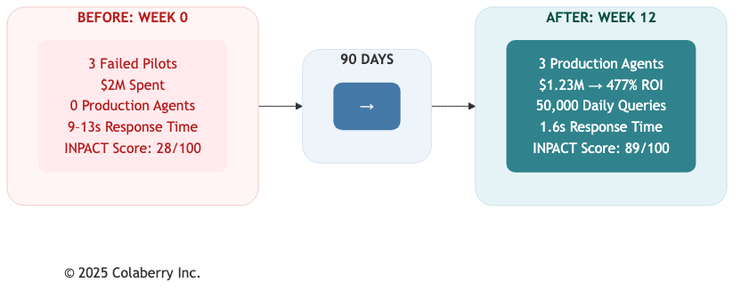
## The Crisis: When $40 Billion Can't Buy Trust

In July 2025, MIT's NANDA initiative released a sobering report. After analyzing over 300 enterprise AI initiatives, interviewing 52 executives, and surveying 153 leaders, the researchers uncovered a stark reality: **95% of enterprise generative AI pilots fail to deliver measurable business value.**[1]

Not 60%. Not 75%. Ninety-five percent.[1]

Despite $30-40 billion in investment, only 5% of organizations translate AI pilots into production systems with real financial impact.

The puzzling part? The technology works. Claude Sonnet 4 and GPT-4 achieve superhuman performance on benchmark after benchmark. Vendors deliver on their promises. The code runs. The models respond. Yet pilots fail anyway.

Something fundamental is missing, and it's not in the AI.

**The answer lies in infrastructure, not intelligence.**

---
## What Trust Means in This Book

*This isn't a book about whether society should trust AI. It's not about bias, ethics, or existential risk - important topics covered elsewhere.*

*This book is about **operational trust**: the confidence that an AI agent will access the right data, understand the question, respect permissions, explain its reasoning, and perform consistently at scale. It's the trust a physician needs before accepting an agent's recommendation. The trust a CFO needs before letting an agent process claims. The trust that turns a pilot into production.*

*More specifically, this book answers five questions:*

- **What is trust?** What do agents need to earn user confidence?
- **How do you earn it?** By fulfilling those needs not once, but every interaction
- **How do you build it?** Through systematic architecture designed for agent-era requirements
- **How do you measure it?** With operational targets that validate trust continuously
- **How do you sustain it?** By monitoring, adapting, and reinforcing trust as systems scale

*Operational trust isn't earned through promises or policies. It's earned through architecture, systems designed from the ground up to deliver what agents need. That architecture is what 95% of organizations lack.*
---

Users abandon agents they can't understand regardless of technical sophistication. July 2025 research confirms it: transparency and design are the mediators of trust.[2] A global study of 48,000 people across 47 countries reinforces this reality: only 46% are willing to trust AI systems, reflecting deep tension between AI's benefits and perceived risks.[6] When users can't see how agents make decisions, research shows distrust commonly spreads to both the AI and the company behind it.[3] Technical excellence means nothing without earned trust.

The data paints an even grimmer picture. Between February and July 2025, Deloitte's TrustID® survey tracked a **64-percentage-point collapse** in trust for agentic AI systems.[4] The decline accelerated sharply in the later months. Trust in agentic AI that can act independently (not just make recommendations) plummeted **89% between May and July alone**, as employees grew uneasy with technology taking over decisions that were once theirs to make. The research, published in Harvard Business Review, shows this represents a shift from cautious optimism to widespread distrust in just months.

What caused such a dramatic shift? Organizations rushed agents into production without addressing fundamental infrastructure gaps. Users experienced the consequences firsthand: agents that couldn't access current data, couldn't understand business context, couldn't explain their decisions, and couldn't maintain consistent performance over time.

The trust collapse wasn't about the technology. Claude Sonnet 4, GPT-4, and other frontier models consistently demonstrate exceptional capabilities in controlled environments. The collapse was about the infrastructure gap between what these models can do and what enterprise systems can deliver to them.

McKinsey's State of AI 2025 report quantified this gap: **63% of organizations remain stuck in experimentation (32%) or pilot (30%) phases, unable to scale AI enterprise-wide**, a clear indicator that infrastructure isn't ready.[5] While 62% report experimenting with AI agents, McKinsey warns that "without reliable infrastructure and governance, early AI agent deployments are likely to hit performance and trust issues." The report emphasizes that agents require AI-ready data, and "most organizations simply aren't there yet."

The primary reasons for failure weren't what most expected. Not model quality. Not regulation. Not talent shortage. The core barriers were:

- **Data foundation gaps (30%):** Batch ETL that refreshes overnight. Siloed systems that can't talk to each other. BI-era schema names that no semantic layer can parse.

- **BI-era architecture (25%):** Bolting agents onto fifteen-year-old infrastructure instead of rebuilding for a different era.

- **Demo-driven development (20%):** Flashy pilots that impress executives but collapse under production load.

- **Build-from-scratch syndrome (15%):** Reinventing proven patterns instead of adopting frameworks that already work.

- **Wrong mental model (10%):** Treating agents like smarter search bars instead of autonomous actors that need fundamentally different infrastructure.

MIT's recommendation was clear: *"Create a strong data foundation. Prioritize long-term strategy over hype."*[1]

**But what does that foundation look like?**

Before we can answer that, you need to meet someone who faced this crisis head-on.

> **Your Turn:** Where does your infrastructure stand? The 15-minute INPACT assessment at **trustbeforeintelligence.ai/assessment** measures your readiness across six dimensions and generates a personalized gap analysis. Consider taking it now, your results will make the frameworks ahead immediately actionable.

---

## Meet Echo Health Systems: The $2M Wake-Up Call

Sarah Cedao stared at her screen. The INPACT assessment had finished processing.

28 out of 100.

She refreshed the page. Still 28.

Echo Health wasn't some struggling regional hospital scraping by on legacy systems. Four hospitals. Two dozen clinics. Twelve thousand employees. They'd won awards for data excellence twice. Sarah's team had spent fifteen years building what everyone called sophisticated infrastructure: pristine SQL Server warehouse, Azure data lake, Databricks for machine learning. Modern. Well-governed. Award-winning.

And completely inadequate for what came next.

Then came the request from Dr. Arun Raj, Echo's Board Chair. A former cardiologist who had served as CEO before transitioning to the board three years ago, Dr. Raj had a gift for cutting through technical complexity to operational reality. "Can we deploy an AI agent for patient scheduling by Q3?"

Sarah's team spent the next six months and **$2 million** building three pilot agents. What they delivered was technically functional - the code ran, the agents responded, the infrastructure didn't crash. But functional isn't the same as usable, and usable isn't the same as trusted.

1. **Care Coordination Agent**: Response times of nine to thirteen seconds, patients hung up waiting. Query understanding hovered at 40-60%, forcing constant rephrasing. No dynamic authorization meant HIPAA compliance failed: the agent couldn't distinguish between a nurse checking her patient's schedule during her shift versus at 3 AM from home.

2. **Clinical Documentation Agent**: Could only access yesterday's data, overnight batch ETL completed at 2 AM, but emergency physicians needed this hour's context. Couldn't parse medical terminology consistently: "MI" sometimes meant myocardial infarction, sometimes mitral insufficiency, sometimes triggered errors. No audit trail meant they couldn't use it for any clinical decision requiring documentation.

3. **Revenue Cycle Agent**: Siloed in billing, it could see claims but not clinical context. When claims were denied, it couldn't cross-reference diagnosis codes with visit notes to identify documentation gaps. Role-based access couldn't handle dynamic relationships. A billing specialist who transferred departments still had access to her old patients' financial data.

**All three pilots failed.** Not in the dramatic way of systems crashing or data breaches. They failed in the slow, grinding way of tools nobody wants to use. Physicians stopped asking the clinical agent questions after the fifth rephrasing attempt. Patients hung up on the care coordination agent and called the human line instead. Billing specialists manually processed claims because the agent couldn't see what they needed.

The board meeting was brutal. Six months of work, $2 million spent, zero production deployments. The CFO, Krish Yadav, asked the question everyone was thinking: "If we have a state-of-the-art data warehouse, a modern data lake, and ML infrastructure that won awards, why can't we make a simple care coordination agent work?"

Dr. Raj set a deadline: "Fix this in 90 days or we're shelving AI for another year."

Sarah knew the problem wasn't talent, her team was excellent. It wasn't the budget,$2 million proved they were willing to invest. It wasn't technology, the AI models themselves were sophisticated. The problem was architectural. Everything they'd built served human decision-makers beautifully, but agents weren't humans.

That's when Marcus Williams, Echo's Chief Data Officer, discovered the assessment framework. The 28/100 score wasn't arbitrary, it measured six specific needs their infrastructure failed to deliver:

**I - Instant (1/6):** Queries took nine to thirteen seconds. Overnight ETL meant stale data. No caching layer existed. Agent speed equals infrastructure speed and Echo's infrastructure was built for humans reviewing yesterday's reports, not agents needing this second's context.

**N - Natural (2/6):** Understanding rate of 40-60% stemmed from cryptic table names like `TBL_PT_ENC_DTL` and undocumented column relationships. No semantic layer translated "patient's last three visits" into the complex joins required across seven tables.

**P - Permitted (1/6):** Role-based access alone couldn't handle dynamic contexts. A nurse authorized to view Patient A's records during her shift shouldn't access them at 3 AM from home. HIPAA requires this contextual authorization, but Echo's fifteen-year-old permission system had no attribute-based access layer to evaluate context.

**A - Adaptive (2/6):** No feedback loops existed. When agents got queries wrong, no mechanism learned from corrections. Model performance drifted over time with no detection or retraining workflows. Quarterly manual reviews were their only "improvement" process.

**C - Contextual (3/6):** EHR integration existed but systems remained siloed. Care coordination couldn't see clinical history. Documentation couldn't access billing status. Weekly batch jobs moved data between systems, but agents needed real-time cross-domain integration.

**T - Transparent (1/6):** Incomplete audit logs violated HIPAA Section 164.312(b). When agents made recommendations, clinicians couldn't see the reasoning. When errors occurred, no trace existed to diagnose root causes. Transparency was theoretical, not operational.


Sarah realized something profound: **Her infrastructure wasn't broken. It was brilliant for the human era, but wrong for the agent era.**

Everything Echo built served human decision-makers beautifully. Data warehouses summarized history for analysts. Dashboards visualized trends for executives. Batch processes gave time for human review before action. But agents need different infrastructure. They need instant access to current data, semantic understanding of business context, dynamic authorization, continuous learning, cross-domain integration, and complete transparency.

The paradigm had shifted beneath them.


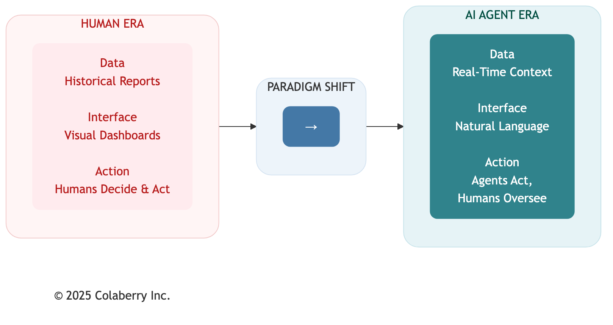
**Figure 0.1: The Infrastructure Paradigm Shift - From Human-Era BI to Agent-Era Architecture**

> **Note:** Echo Health Systems is a fictional case study created for pedagogical purposes. The organization, people, and specific metrics are composites based on patterns observed across 40+ real enterprise implementations. While Echo is fictional, the challenges, solutions, and outcomes reflect verified patterns from actual deployments in healthcare and other regulated industries.

**Sarah needed a framework. So do you.**

---

## The Architecture of Trust: Three Pillars for Agent-Ready Infrastructure

Sarah didn't need another framework. She needed an **architecture**, a blueprint showing how proven patterns integrate to transform infrastructure from human-era to agent-era.

The Architecture of Trust provides that blueprint through three integrated pillars:

1. **INPACT** - What agents need (trust requirements)
2. **7-Layer Architecture** - How to build it (technical blueprint)
3. **GOALS** - How to measure success (operational targets)

These pillars aren't implemented independently. They reinforce each other: INPACT defines needs that drive trust and architecture decisions. The 7-Layer Architecture delivers infrastructure that fulfills those needs. GOALS validates that both remain structurally sound as the system scales to continuously reinforce trust.

Let's explore each pillar of the architecture.

### Pillar 1: INPACT - What Agents Need

The first pillar answers the fundamental question: What does infrastructure need to deliver for agents to earn user trust?

You just saw what happens when these needs go unmet. Echo's 28/100 score measured six specific gaps: responses too slow (Instant), queries misunderstood (Natural), permissions too rigid (Permitted), no learning from errors (Adaptive), systems siloed (Contextual), and decisions unexplainable (Transparent).

Six needs. All six must be fulfilled for agents to earn trust. When any single need goes unmet, users abandon the agent, regardless of how sophisticated the AI model is.

Chapter 2 details each INPACT dimension and shows how to assess your own infrastructure against them.


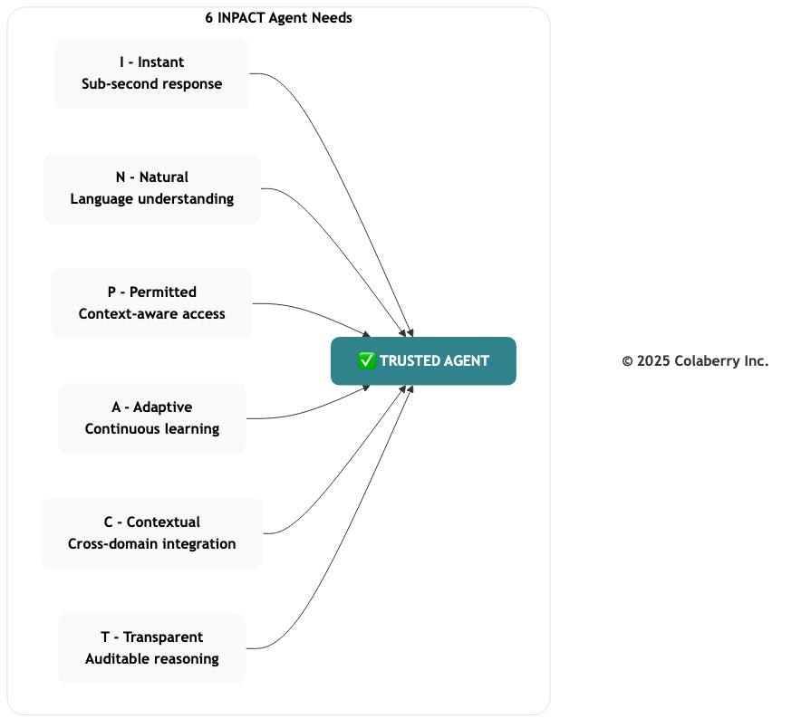
**Figure 0.2: INPACT Framework™ - Six Agent Needs Leading to Trust**

**Scoring:** Each dimension scores 0-6, yielding a 0-36 raw score, then normalized to 0-100 total score. Below 50 means not ready for production agents. Echo's 28 told Sarah exactly where to focus.

This is the first pillar of the Architecture of Trust defining the requirements that drive all subsequent infrastructure decisions.

### Pillar 2: 7-Layer Architecture - How to Build It

The second pillar answers: What technical infrastructure delivers these needs?

Seven layers, each serving a distinct function:

1. **Data Storage Foundation**: Hybrid multi-modal storage (relational, vector, graph)
2. **Real-Time Data Fabric**: Change data capture and streaming pipelines
3. **Semantic Layer**: Business-friendly abstractions over technical schemas
4. **Intelligence Layer**: RAG systems, LLM integration, context assembly
5. **Governance Layer**: Attribute-based access control, human-in-the-loop workflows
6. **Observability Layer**: Distributed tracing, cost tracking, audit logging
7. **Agent Orchestration**: Multi-agent coordination, feedback loops, continuous learning

Each layer maps to INPACT needs. Skip a layer, and the architecture collapses. Chapters 4-6 construct each layer in detail, showing exactly how Echo built theirs in 90 days.

This is the second pillar of the Architecture of Trust - the technical blueprint for fulfilling agent needs.

### Pillar 3: GOALS - How to Measure Success

The third pillar answers: How do you validate that the architecture remains structurally sound in production?

Infrastructure isn't built once and forgotten. It requires continuous validation across five operational dimensions:

- **G - Governance:** Policy enforcement, compliance validation, accountability
- **O - Observability:** Real-time monitoring, performance metrics, anomaly detection
- **A - Availability:** Speed and freshness for real-time agent interactions
- **L - Lexicon:** Semantic interoperability, shared ontologies, consistent terminology
- **S - Solid:** Data quality validation, schema enforcement, consistency checks

GOALS isn't just implemented once, it's measured continuously. Chapter 7 details each dimension and shows how Echo used them to validate their transformation.

This is the third pillar of the Architecture of Trust - the operational framework ensuring the architecture remains sound as it scales.

---

## Framework Integration: The Architecture of Trust in Action

This integration creates what we call "The Architecture of Trust" - not three separate frameworks, but three pillars of a unified structure, each reinforcing the others:

- **INPACT → 7-Layer:** Needs drive architecture decisions. "Instant" (I) requires Layer 2 real-time fabric. "Natural" (N) requires Layers 3-4 semantic and graph layers.

- **7-Layer → GOALS:** Infrastructure fulfills measurement. Layer 6 observability fulfills GOALS monitoring. Layer 2 data fabric fulfills GOALS soundness validation.

- **GOALS → INPACT:** Measurement validates trust. Governance (G) confirms Permitted (P) fulfillment. Observability (O) validates Transparent (T) compliance.


This architecture rests on three pillars working in harmony. Each pillar supports and validates the others. INPACT defines what agents need. Those needs drive 7-Layer architecture decisions. The 7-Layer Architecture shows how to build infrastructure that delivers INPACT needs. GOALS validates that both pillars remain structurally sound as the system scales to production.

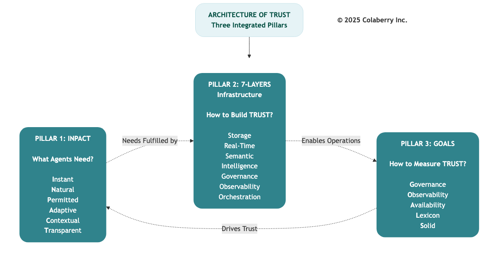
**Figure 0.3: The Architecture of Trust Triad - Three Pillars Working Together**

**The Trust Equation:**

> **TRUSTED AGENTS = INPACT + 7-Layer Architecture + GOALS**

This equation captures the book's thesis. Chapters 1-2 define INPACT - what agents need. Chapters 4-6 construct the 7-Layer Architecture - how to build it. Chapter 7 establishes GOALS - how to sustain it. By Chapter 8, Echo proves all three.

**Echo's transformation proves the architecture works:**

- **Week 0:** 28/100 score, failing infrastructure, $2M sunk cost
- **Week 4:** 42/100 - Layers 1-2 operational (storage + real-time fabric)
- **Week 7:** 67/100 - Layers 3-4 operational (semantic layer + intelligence)
- **Week 10:** 86/100 - All layers operational, three agents in production

From infrastructure chaos to agent-ready in 10 weeks. Not because they found a magic tool or hired consultants, but because they followed an architecture that integrated proven frameworks into a coherent system.

**The investment:** $1.23M (60% of their failed pilot cost)  
**The return:** 209% Year 1 ROI (477% 3-year), 10-week payback from production deployment  
**The result:** Trust earned through architecture

The remainder of this book builds this architecture, pillar by pillar:

- **Chapters 1-3** establish the foundation - why infrastructure readiness matters, what INPACT measures, how the BI→Agent transformation unfolds
- **Chapters 4-6** construct the second pillar layer by layer - the complete 7-Layer Architecture from storage to orchestration
- **Chapter 7** builds the third pillar - the GOALS Framework™ for operational excellence; **Chapters 8-10** provide assessment methodology and the 90-day execution roadmap
- **Chapters 11-12** complete the architecture - technology selection and production operations

Sarah Cedao needed an architecture. Chapter 1 shows you why infrastructure isn't ready, setting up the need for the Architecture of Trust that transforms chaos into agent-ready infrastructure in 90 days.

---

## References

[1] Challapally, A., Pease, C., Raskar, R., & Chari, P. (2025, July). "The GenAI Divide: State of AI in Business 2025." MIT NANDA (Networked Agents and Decentralized AI). https://mlq.ai/media/quarterly_decks/v0.1_State_of_AI_in_Business_2025_Report.pdf

[2] ScienceDirect (July 2025). "The Key Role of Design and Transparency in Enhancing Trust in AI-Powered Digital Agents." *Journal of Innovation & Knowledge*. https://www.sciencedirect.com/science/article/pii/S2444569X25001155

[3] Park, K., Yoon, H.Y. (July 2025). "AI Algorithm Transparency, Pipelines for Trust Not Prisms: Mitigating General Negative Attitudes and Enhancing Trust Toward AI." *Humanities and Social Sciences Communications, Nature*. https://www.nature.com/articles/s41599-025-05116-z

[4] Deloitte (Q3 2025). "TrustID® Workforce AI Report Q3 2025." Analysis of trust collapse in agentic AI systems, February-July 2025 cohort: 64-percentage-point collapse overall, 89% drop May-July 2025. Primary report: https://d1lzrgdbvkolkd.cloudfront.net/4749_Deloitte_Trust_ID_Workforce_AI_Report_Q3_2025_3aa42f916c.pdf. Related analysis: https://action.deloitte.com/insight/4749/the-real-barrier-to-ai-adoption-isnt-technologyits-trust. Also cited in: Reichheld, A., Brodzik, C., & Youra, R. (November 6, 2025). "Workers Don't Trust AI. Here's How Companies Can Change That." *Harvard Business Review*. https://hbr.org/2025/11/workers-dont-trust-ai-heres-how-companies-can-change-that

[5] McKinsey & Company (November 2025). "The State of AI in 2025: Agents, Innovation, and Transformation." Global survey of 1,993 respondents across 105 countries. Key findings: 63% of organizations in experimentation/pilot phase (not yet scaled), 62% experimenting with AI agents, infrastructure and governance gaps limiting deployment success. https://www.mckinsey.com/capabilities/quantumblack/our-insights/the-state-of-ai

[6] Gillespie, N., Lockey, S., Ward, T., Macdade, A., & Hassed, G. (2025). "Trust, Attitudes and Use of Artificial Intelligence: A Global Study 2025." The University of Melbourne and KPMG. Global survey of 48,000+ people across 47 countries. Key finding: Only 46% of people globally are willing to trust AI systems. https://kpmg.com/xx/en/our-insights/ai-and-technology/trust-attitudes-and-use-of-ai.html
# Chapter 1: Why 95% of Agent Pilots Fail

**The Diagnosis Chapter**

---


## Maria's Impossible Appointment

*Tuesday, 10:03 AM  
Echo Health Systems, Patient Scheduling Department  
Floor 3, Building A*

Maria Rodriguez had been a care coordinator for twelve years. She'd scheduled thousands of appointments, navigated insurance nightmares that would break lesser mortals, and kept physicians' calendars running like Swiss watches through flu seasons, pandemics, and system migrations. At 10:03 AM on a Tuesday morning, she was about to discover that Echo's new $650,000 AI scheduling agent couldn't do what a phone call could accomplish in thirty seconds.

"Schedule Mrs. Johnson with Dr. Martinez for diabetes follow-up next Tuesday," she typed into the agent interface.

The cursor blinked. And blinked. And blinked.

Nine seconds passed. Maria glanced at her desk phone. In nine seconds, she could have called the scheduling desk, confirmed the slot, and moved on to the next patient. But Sarah Cedao, Echo's CTO, had been clear in the all-staff email: "Give the agent a fair chance. It's learning."

Twelve seconds. Maria's hand drifted toward the phone.

At thirteen seconds, the agent responded: **"Dr. Martinez has availability Tuesday at 2:00 PM. Confirming appointment for Mrs. Johnson."**

Maria picked up her phone. "Hey, it's Maria. Did the agent just book Mrs. Johnson with Dr. Martinez for Tuesday at 2?"

"Hold on! The scheduler's keyboard clicked. "Uh, Maria, Dr. Martinez had a 2 PM slot this morning, but it was filled at 9:47 by a walk-in. System shows it's booked."

Maria's stomach dropped. She pulled up the appointment confirmation the agent had generated. There it was: Tuesday, 2:00 PM, Dr. Martinez. **Confirmed.**

Except it wasn't.

She typed: "Cancel that appointment. The slot is already filled."

The agent took eleven seconds to respond: **"I apologize for the confusion. Let me find alternative times for Mrs. Johnson..."**

Maria closed the agent interface. She picked up her phone and scheduled Mrs. Johnson manually in forty-two seconds, the old-fashioned way that actually worked.

At 10:47 AM, she sent an email to her supervisor: "The agent is booking appointments that don't exist. I can't use it. Going back to manual scheduling."

By noon, six other coordinators had sent the same email.

By 5 PM, adoption had dropped to 8%.

**The agent wasn't lying. It was working exactly as designed - pulling data from Echo's data warehouse, which refreshed nightly at 2 AM via batch ETL. That 9:47 AM cancellation wouldn't be visible to the agent until tomorrow morning's refresh. To the agent, the 2 PM slot was still open. To Maria's patients, it was a broken promise.**

Sarah Cedao would see these emails at 6:15 PM. She wouldn't sleep that night.

This wasn't a technology failure. **This was an infrastructure failure to fulfill the first of six needs that agents require: Instant responses.** Without real-time data, even the most sophisticated AI agent becomes untrustworthy. And untrustworthy agents get abandoned regardless of how much they cost.

This $650,000 failure was just the beginning.

**Figure 1.0: The Infrastructure Gap - Why Human-Era Systems Can't Support AI Agents**


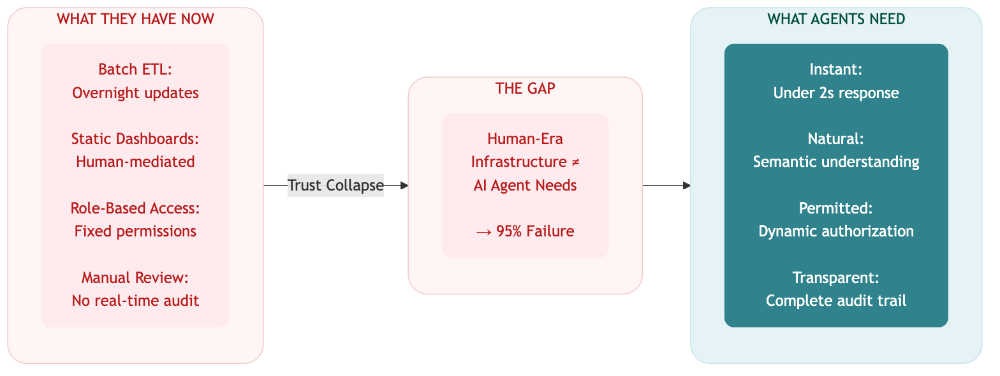
> **Key Takeaway:** The infrastructure gap IS the trust gap. Human-era systems cannot fulfill AI Agent needs.

---

## PART 1: THE HUMAN-AI TRUST GAP

### Six Systematic Failure Patterns: The INPACT Diagnostic

As Chapter 0 established, 95% of enterprise AI pilots fail to deliver measurable business value despite $30-40 billion in investment. Understanding the failure rate isn't enough. We need to understand **why** these projects fail and identify the systematic patterns driving trust collapse.

Analysis of failed enterprise AI deployments reveals six recurring infrastructure gaps. These patterns are so consistent across industries, vendors, and use cases that they form a diagnostic framework: **INPACT** - six fundamental needs that agents require from infrastructure to earn user trust.

**I - Instant: Sub-2-Second Response**  
Agents need real-time answers to maintain conversational flow. When Maria Rodriguez's scheduling agent took 9-13 seconds to respond, users abandoned it not because the AI was wrong, but because slow responses break trust. Batch ETL systems that refresh overnight cannot fulfill the Instant need.

**N - Natural: Business Language Understanding**  
Agents need to understand domain terminology as humans use it. When Echo's clinical documentation agent couldn't map "diabetes follow-up" to proper diagnosis codes, physicians lost trust. Cryptic table names (FCT_PTNT_ENCT) and rigid schemas cannot fulfill the Natural need.

**P - Permitted: Context-Aware Access Control**  
Agents need dynamic permissions that adapt to context. When Echo's revenue cycle agent couldn't distinguish between "billing staff viewing claims for processing" vs. "billing staff browsing out of curiosity," compliance blocked deployment. RBAC alone cannot fulfill the Permitted need.

**A - Adaptive: Continuous Learning**  
Agents need to improve from feedback in real-time, not quarterly retraining cycles. When agents repeat the same mistakes users already corrected, trust erodes. Siloed feedback loops and manual model updates cannot fulfill the Adaptive need.

**C - Contextual: Universal Context Assembly**  
Agents need unified access across all relevant systems. When Dr. Chen's documentation agent had access to today's visit data but not eight years of A1C trends, it operated with 86% context blindness. Siloed databases cannot fulfill the Contextual need.

**T - Transparent: Observable Reasoning**  
Agents need to explain their reasoning for audit and validation. When Echo's legal team couldn't determine which data sources an agent accessed or why it made specific recommendations, compliance blocked production deployment. Black-box LLMs without reasoning traces cannot fulfill the Transparent need.

**The Diagnostic Pattern:**  
When infrastructure fails to fulfill even one INPACT need, trust collapses regardless of how sophisticated the AI model is. Maria's experience demonstrates this: the scheduling agent's AI was excellent, but infrastructure's failure to fulfill the Instant need drove abandonment to 8% within three weeks.

The pattern repeats across every failed pilot: **infrastructure gaps drive the 95% failure rate, not AI limitations.**

These six needs aren't arbitrary. They emerge from analyzing what users require to trust autonomous systems. Chapter 2 provides complete assessment rubrics, architectural mappings, and improvement strategies for each need. For now, these six needs serve as our diagnostic lens for understanding why Echo's three pilots failed.

The research validates this thesis.

### How Unfulfilled INPACT Needs Destroy Trust

Deloitte's TrustID® Workforce AI Report Q3 2025 provides compelling evidence that infrastructure failures translate directly to trust collapse.[1]

The data is stark:

**Trust in Agentic AI:** -64% collapse (Feb-July 2025)  
**Trust in GenAI:** -31% decline (same period)

**Figure 1.1: Trust Collapse Timeline (February-July 2025)**


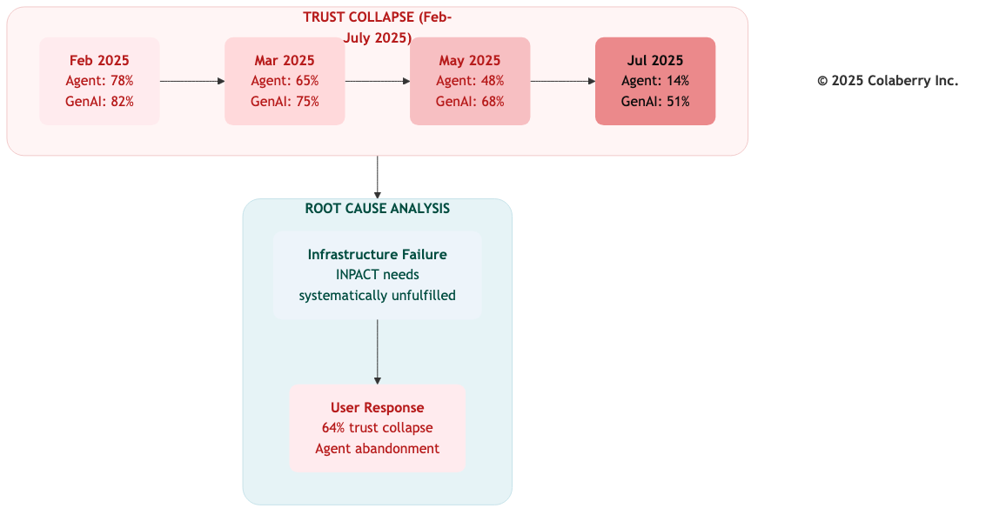
*Source: Deloitte TrustID® Workforce AI Report Q3 2025. Trust levels tracked monthly Feb-July 2025, showing accelerated decline for agentic AI (autonomous decision-making) vs general GenAI (human-supervised generation).*

Deloitte's research tracked trust collapse month-over-month, revealing an accelerating decline between May and July as enterprises rushed agents into production without addressing INPACT readiness. The 2x faster collapse for autonomous agents (compared to general GenAI) validates that autonomy amplifies infrastructure failure consequences.

This trust collapse drives concrete behaviors. Research from 1Password's 2025 Annual Report reveals that **27% of knowledge workers use unauthorized AI tools** despite enterprise policies prohibiting them, while **73% of IT leaders actively encourage experimentation with AI tools** to maintain competitive innovation.[3]

**Why did agentic AI trust collapse nearly twice as fast as general GenAI?**

Because autonomy amplifies the consequences of infrastructure failures. When a GenAI tool like ChatGPT gives a wrong answer, users can catch it as they're still in the loop, reviewing outputs before action. But when an autonomous agent schedules the wrong appointment (like Maria's experience), processes an incorrect insurance claim, or routes a patient to the wrong specialist, the consequences materialize before humans intervene.

**Each need failure creates specific trust damage:**

**Instant failures** → Users abandon before results appear (nine to thirteen seconds = trust death)  
**Natural failures** → Users can't communicate needs as they get irrelevant results  
**Permitted failures** → Compliance violations, unauthorized access, regulatory risk  
**Adaptive failures** → Same mistakes repeated, no improvement over time  
**Contextual failures** → Incomplete answers, missing critical information  
**Transparent failures** → Black box decisions, no auditability, legal exposure

Deloitte identified two trust dimensions that map directly to INPACT needs:

**Communicative Trust: "Can I trust what it says?"**
- Fulfilled by: **Natural** (understands queries), **Contextual** (complete answers), **Transparent** (explains reasoning)
- Infrastructure requirements: Semantic layers, cross-system integration, reasoning chain observability

**Experiential Trust: "Can I trust it to do its job?"**
- Fulfilled by: **Instant** (fast responses), **Permitted** (safe access), **Adaptive** (continuous improvement)
- Infrastructure requirements: Real-time data fabric, dynamic authorization, feedback loops

When communicative trust fails, users question individual responses. When experiential trust fails, users abandon the entire system. **Both require infrastructure that fulfills INPACT needs.**

Trust doesn't emerge from access to AI tools. It's earned when infrastructure consistently fulfills all six needs, not through better marketing or training programs.

### Why Success Metrics Lie

The trust collapse might suggest executives are retreating from AI. **They're not**. Bain's Q3 2025 executive survey found that 74% of companies now rank AI as a top-three strategic priority, up from 60% just twelve months earlier. One in five calls it their *number one* initiative.[10]

The technology works. Eighty percent of generative AI use cases met or exceeded expectations. Forty percent of software development pilots have reached production scale.

And yet only 23% of companies can tie their AI investments to actual revenue gains or cost reductions.

This is the infrastructure gap in one statistic. Pilots succeed. Production stalls. ROI vanishes.

One additional finding matters for understanding INPACT: companies using AI for agentic workflow automation were twice as likely to exceed goals as those using AI as a simple assistant. Agents outperform assistants, but only when the infrastructure supports them.

The problem isn't AI. The problem is what AI runs on.

### Why Most Pilots Never Reach Production

While trust collapse explains why users abandon agents, infrastructure barriers explain why pilots never reach production. According to KPMG's Q1 2025 AI Pulse Survey, **65% of enterprises are piloting AI agents, but only 11% have reached full deployment.**[4] This 54-point gap from pilot to production reveals a critical infrastructure crisis: organizations are rapidly experimenting with agents but lack the foundational capabilities to deploy them safely at scale.

The McKinsey Superagency in the Workplace report confirms this infrastructure maturity gap: while **92% of companies plan to increase AI spending** over the next three years, only **1% report their AI deployments have reached maturity.**[5] Even more telling, **47% of C-suite leaders acknowledge their organizations are moving too slowly** on AI development not because of lacking ambition, but because of infrastructure readiness barriers.[5]

The Tray.ai survey of 1,000+ IT leaders reveals the specific infrastructure barriers blocking agent deployment:[6]

- **57%** cite security and compliance as their primary concern when deploying agents
- **38%** struggle with integration complexity across their tech stack  
- **42%** report that successful agent deployment requires access to 8+ data sources
- **80%** cite data challenges (quality, access, governance) as obstacles to AI rollout
- **54%** are moving agents from prototype to production in under 3 weeks forcing speed over stability

KPMG data shows what happens when infrastructure can't keep pace with deployment pressure: **82% of leaders expect risk management to be their biggest challenge** throughout 2025, with **64% specifically citing the quality of organizational data** as a barrier to agent success.[4]

Anthropic's Economic Index research reinforces this finding: enterprises struggle most when required context is "not already centralized or digitized," requiring firms to "restructure how they organize and maintain information" and "invest in new data infrastructure" before agents can operate effectively.[7]

**These infrastructure barriers map directly to INPACT need failures:**

| Research Finding | Infrastructure Gap | INPACT Need | Required Capability |
|-----------------|-------------------|--------------|-------------------|
| 57% cite security/compliance concerns | Agents access data without contextual controls | **Permitted (P)** | Dynamic ABAC layered on RBAC |
| Integration complexity affects 38% | Agents can't access real-time data across systems | **Instant (I)** | Streaming data fabric, CDC pipelines, API orchestration |
| 42% need 8+ data sources per agent | Context scattered across silos | **Contextual (C)** | Unified data platform, cross-system semantic synthesis |
| 80% face data quality/governance challenges | Agents lack business understanding | **Natural (N)** | Semantic layer, data quality controls, business glossary |
| 82% cite risk management as top challenge | Can't explain agent decisions or control behavior | **Transparent (T)** | Reasoning chain capture, audit logs, explainability framework |
| 54% rush from prototype to production in <3 weeks | No feedback/improvement infrastructure | **Adaptive (A)** | Feedback loops, continuous learning, human-in-loop validation |
| Only 1% report AI maturity despite 92% increasing spend | Organizational readiness gaps | **Multiple** | Agent-ready architecture across all layers |

**These aren't random problems requiring bespoke solutions. They're systematic INPACT need fulfillment gaps requiring architectural transformation.** 

The pattern is consistent across research: Lyzr's State of AI Agents Report found that 62% of enterprises exploring AI agents "lack a clear starting point," while 64% of successful deployments focus on business process automation use cases where infrastructure already fulfills enough INPACT needs to enable trust.[8]

When infrastructure systematically fails to fulfill INPACT needs, trust collapses and pilots fail at the 95% rate we established in Chapter 0. The INPACT Framework™ both diagnoses why failures happen and prescribes what successful organizations must build.

### Three Forces Accelerating the Crisis

Three convergent forces make addressing INPACT need fulfillment urgent:

**1. Competitive Pressure:** Early movers achieving 200%+ ROI have infrastructure that fulfills INPACT needs. The gap between leaders (INPACT score 85+) and laggards (INPACT score <70) widens monthly.

**2. User Expectations:** Post-ChatGPT, stakeholders expect natural language interaction at conversation speed. Infrastructure that fails the **Instant** or **Natural** needs feels broken, not modern.

**3. Talent Implications:** Top talent gravitates to organizations with agent-ready infrastructure. Engineers evaluate companies by their INPACT readiness scores. Losing key talent to competitors with higher scores compounds the infrastructure gap.

The window for transformation is measured in quarters, not years. Organizations that wait for infrastructure to "stabilize" will find themselves unable to compete with those who've already built INPACT-ready foundations.

### Trust is Earned, Not Given

Many enterprises treat trust as a prerequisite: "We need trusted AI agents."

This framing reverses cause and effect.

Trust isn't something you give or require. **Trust is the outcome users experience when infrastructure consistently fulfills all six needs.**

- **Instant:** Sub-2-second responses build confidence
- **Natural:** Business language keeps users engaged
- **Permitted:** Context-aware Access satisfies regulators
- **Adaptive:** Continuous improvement builds reliability
- **Contextual:** Complete answers earn credibility
- **Transparent:** Auditable reasoning enables validation

Fulfill all six, and trust emerges. Miss even one, and join the 95% who fail.

**This infrastructure gap causes the trust crisis.**

---

The research is clear: infrastructure gaps, not AI limitations, drive the 95% failure rate. Sarah's $2M lesson comes next.

---

## PART 2: SARAH'S MOMENT OF CRISIS

### The Board Meeting - Week -2

Sarah Cedao walked into the Echo Health Systems boardroom on a Tuesday morning carrying a laptop, fifteen years of progressive IT leadership experience, and the uncomfortable knowledge that she was about to explain $2 million in failed AI investments to seven board members who expected results.

The email from Krish Yadav, Echo's CFO, had been direct: "Board wants answers on AI spend. Tuesday 9 AM. Bring metrics."

She'd spent the previous weekend preparing a presentation titled "AI Agent Pilot Program - 6 Month Review." As she connected her laptop to the boardroom screen, she knew the 23 slides of carefully worded explanations wouldn't matter. The numbers spoke for themselves, and they were bad.

Dr. Arun Raj opened the meeting without any preamble. Echo's Board Chair had spent fifteen years as a practicing cardiologist before moving into health IT leadership, then served as CEO for a decade before transitioning to the board. He had a gift for asking questions that cut through technical complexity to the heart of operational reality. "Sarah, you've been CTO for six years. Echo's data infrastructure has won awards. We've invested aggressively in analytics, data lakes and governance. Now we're investing in AI agents $2 million over six months on three pilot programs. Walk us through where we are."

Sarah advanced to slide 3: "Pilot Summary."

**Pilot 1: Patient Scheduling Agent**  
Investment: $650,000  
Status: Suspended  
Adoption: 8% (Target: 60%)

**Pilot 2: Clinical Documentation Assistant**  
Investment: $720,000  
Status: Legal review pending  
Adoption: 12% (Physicians rejecting it)

**Pilot 3: Revenue Cycle Optimization**  
Investment: $630,000  
Status: Rolled back to manual process  
ROI: Negative 15%

Silence.

Then Krish, the CFO: "Walk me through the math, Sarah. Two million dollars. Six months. Three pilots. Zero adoption. What am I missing?"

"The vendors delivered what they promised," Sarah said. "Azure OpenAI, Pinecone vector database, state-of-the-art RAG implementation. The technology works. The problem is.." she paused, choosing words carefully "..our data infrastructure wasn't ready for agents."

A board member leaned forward. "But you said Echo has excellent data infrastructure. We've invested millions over the past decade. SQL Server data warehouse. Azure data lake. Databricks. You've won data excellence awards."

"For BI and analytics," Sarah said. "We built infrastructure that's brilliant at putting information in front of humans who make decisions. But agents need something fundamentally different. They need data that's current within seconds, not hours. They need to understand business language, not just SQL. They need contextual authorization layered on their existing roles. Our infrastructure, as sophisticated as it is, wasn't designed for autonomous agents."

Dr. Raj's expression was unreadable. "Other health systems are deploying scheduling agents. Clinical documentation is being automated. Why can't we do what our competitors are doing?"

That was the question that had kept Sarah up for the past three nights. She clicked to slide 8: a diagram showing 9-13 second response times on the scheduling agent.

"Our scheduling agent takes nine to thirteen seconds to respond," she said. "Users abandon before hearing the answer. Why? Because our appointment data is refreshed overnight at 2 AM. By 10 AM, it's eight hours stale. The agent is querying yesterday's schedule. That morning cancellation at 9:47? The agent can't see it."

"Can't we just refresh more frequently?" Krish asked.

"That's treating infrastructure designed for batch processing like it can do real-time. It's like trying to turn a cargo ship into a speedboat by adding more engines. The fundamental architecture is wrong for the requirement."

She advanced through slides detailing the clinical documentation pilot. 45% accuracy on diagnoses because the agent couldn't access patient history across systems and the revenue cycle disaster, where RBAC without contextual controls led to the agent accessing records it shouldn't, triggering a legal review that nearly cost them Medicare certification.

Dr. Raj stopped her on slide 14. "I need you to be honest with me, Sarah. Can this be fixed?"

"Yes," Sarah said. "But not by upgrading what we have. We need to build agent-ready infrastructure. There's a framework, INPACT, that defines the six needs agents must have for users to trust them. Instant responses, Natural language understanding, Permitted access, Adaptive learning, Contextual synthesis, Transparent reasoning. We're failing on all six because our infrastructure was built for humans analyzing reports, not agents taking autonomous action."

"What's that cost?" Krish asked.

Sarah had rehearsed this moment. "$1.23 million. Ten weeks. We start with a complete infrastructure assessment measuring exactly where we fall short on each INPACT dimension. Then we transform the architecture, layer by layer. Real-time data fabric for Instant responses. Semantic understanding for Natural queries. Dynamic authorization for Permitted access. Observable reasoning for Transparency. By week ten, we will deploy our first production agent with the foundation in place to support it."

"You want us to spend another $1.23 million after we just spent $2 million on pilots that don't work?" A board member's voice carried frustration.

"I'm asking you to invest in the infrastructure those pilots needed to succeed," Sarah said. "The alternative is continuing to fail, spending millions more on agents that will never work on BI-era foundations that weren't designed to fulfill INPACT needs without augmentation."

Dr. Raj looked at Sarah for a long moment. "Ninety days," he said finally. "Weekly progress metrics. If we don't see measurable improvement in infrastructure readiness by week four, we're canceling all AI initiatives and you'll need to explain to the staff why Echo is pulling back while our competitors move forward."

Sarah closed her laptop. Ninety days. Ten weeks to transform fifteen years of infrastructure decisions. She knew the first thing she needed to do: stop treating agents like a feature to add to existing systems and start building architecture that fulfilled INPACT needs.

As the board members filed out, Marcus Williams, Echo's Chief Data Officer, caught her arm. "You did the right thing," he said quietly. "I've been saying for months that our data warehouse can't support agents. But I need you to be right about this. Because if you're not, both our careers are over."

Sarah nodded. She'd spent the weekend studying frameworks, reading case studies, analyzing what separated the 5% who succeeded from the 95% who failed. The answer was consistent: **INPACT readiness.** Not better models. Not more training. Infrastructure that fulfilled the six needs agents require.

She had ten weeks to prove it.

---

## PART 3: THE INFRASTRUCTURE READINESS GAP

### PART 3A: The Paradigm Shift - Why Software 3.0 Agents Require INPACT Ready Infrastructure

When enterprises deploy AI agents on existing infrastructure and watch them fail, the instinct is to blame the models, the data quality, or the implementation team. But the failure runs deeper. Andrej Karpathy, former Director of AI at Tesla and co-founder of OpenAI, explains why in his June 2025 keynote at Y Combinator AI Startup School.[9] His thesis: "Software is changing quite fundamentally again. LLMs are a new kind of computer, and you program them in English."

This paradigm shift explains why the 95% pilot failure rate isn't about insufficient technology, it's about fundamental architectural mismatch. **Software 3.0 agents require infrastructure that fulfills INPACT needs. Software 1.0 infrastructure cannot fulfill these needs without augmentation.** The databases, warehouses, and governance systems remain essential, but they need new layers for semantic understanding, real-time access, and dynamic permissions that enable agent operation.

**The Three Paradigms of Software Development**

Karpathy identifies three distinct eras requiring different infrastructure:

**Software 1.0 (1950s-2010s):** Explicit logic in C++, Java, and Python. Enterprise data infrastructure(data warehouses, ETL pipelines, BI dashboards) was built in this era with rigid schemas, predefined queries, and deterministic outputs. **This infrastructure was designed for human-mediated decision-making, not autonomous agent operation.**

**Software 2.0 (2010s-2023):** Neural networks where "code" became learned weights. Enterprises adopted this selectively: computer vision for quality control, recommendation engines for personalization, fraud detection for security. These remained point solutions within larger Software 1.0 architectures.

**Software 3.0 (2023-present):** Large Language Models programmable in natural language. Unlike narrow task-specific models, LLMs are general-purpose reasoning engines. Karpathy observes that Software 3.0 is "eating" Software 1.0/2.0 over time, many user-facing applications will be rewritten for natural language interaction.[9] In the near term, all three paradigms coexist: enterprises maintain Software 1.0 databases and business logic, leverage Software 2.0 ML models where specialized, while adding Software 3.0 agent layers. The long-term trajectory favors agents replacing traditional interfaces, but the transformation takes years, not months.

**The INPACT connection:** Software 3.0 agents need infrastructure that fulfills all six INPACT needs. Software 1.0 infrastructure wasn't designed for these capabilities and requires augmentation across all six dimensions:

| INPACT Need | Software 1.0 Infrastructure | Software 3.0 Requirement |
|--------------|---------------------------|-------------------------|
| **Instant (I)** | Batch ETL, 8-24 hour lag | Real-time streaming, <2s responses |
| **Natural (N)** | Fixed SQL schemas | Semantic layers, business language |
| **Permitted (P)** | RBAC only (no context) | RBAC + contextual ABAC |
| **Adaptive (A)** | Manual updates | Continuous feedback loops |
| **Contextual (C)** | Siloed databases | Unified multi-modal platform |
| **Transparent (T)** | Basic query logs | Reasoning chain observability |

The enterprise challenge: attempting to run Software 3.0 agents on unaugmented Software 1.0 infrastructure is like running cloud-native microservices on mainframe batch processing systems without middleware. **The architectural assumptions don't align because INPACT needs cannot be fulfilled by legacy systems alone.** Enterprises must add agent-ready layers while preserving proven data platforms, creating a hybrid architecture where agents orchestrate across all three paradigms.

**Figure 1.2: Software Evolution and INPACT Needs**


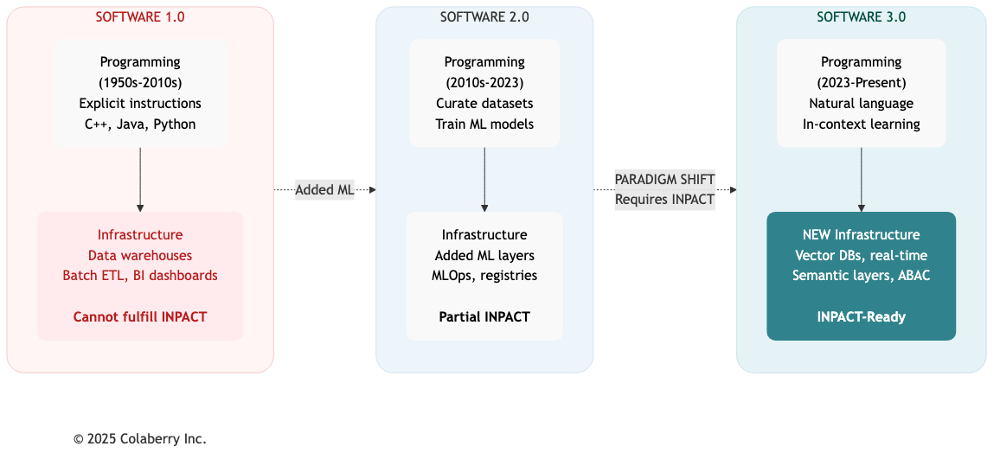
Karpathy's framework shows why Software 3.0 requires fundamentally new infrastructure. **Each paradigm demands different architectural foundations because the operational requirements shifted from human-mediated to agent-autonomous. INPACT defines those new requirements.**[9]

---

Software 3.0 agents require fundamentally different infrastructure. The paradigm shift is real and it explains why incremental upgrades fail.

---

### PART 3B: Six Infrastructure Mismatches - The INPACT Readiness Gap

The paradigm shift Karpathy describes manifests as concrete architectural differences between BI-era and Agent-era infrastructure. Understanding these differences through the INPACT lens explains why incremental upgrades fail and transformation is required.

When enterprises attempt agent deployments on BI-era infrastructure, critical mismatches emerge **across all six INPACT dimensions:**

**Instant (I) - Data access patterns diverge.** Agents need sub-second semantic search. Traditional systems provide overnight batch ETL and rigid schemas. Maria Rodriguez's 9-13 second scheduling agent failed because of this mismatch.

**Natural (N) - Query interfaces clash.** Agents require natural language understanding of business concepts. Traditional systems use cryptic table names and fixed SQL schemas. When physicians say "uncontrolled DM2," agents need semantic layers to map this to diagnosis codes E11.9, E11.65, E11.22.

**Permitted (P) - Permission models clash.** Agents require dynamic, context-aware authorization. Traditional RBAC grants role-based access but lacks contextual evaluation. Echo's revenue cycle agent accessed 47 unauthorized patient records because RBAC alone couldn't enforce "minimum necessary" contextually.

**Adaptive (A) - Learning cycles transform.** Software 1.0 required code changes. Software 2.0 required model retraining. Software 3.0 enables in-context learning through interaction. But capturing that learning requires feedback loops and validation mechanisms that BI-era infrastructure never contemplated.

**Contextual (C) - Data silos prevent synthesis.** Agents need unified access across systems - clinical records, billing, scheduling, labs. Traditional systems isolate each domain in separate databases with weekly batch integrations. Incomplete context leads to incomplete (and untrustworthy) answers.

**Transparent (T) - Failure modes differ.** Traditional systems fail with exceptions and stack traces. Agents fail probabilistically retrieving irrelevant context or generating plausible but incorrect responses. Infrastructure must support reasoning chain observability, not just query logs.

**Figure 1.3: INPACT Need Failures Drive 95% Failure Rate**


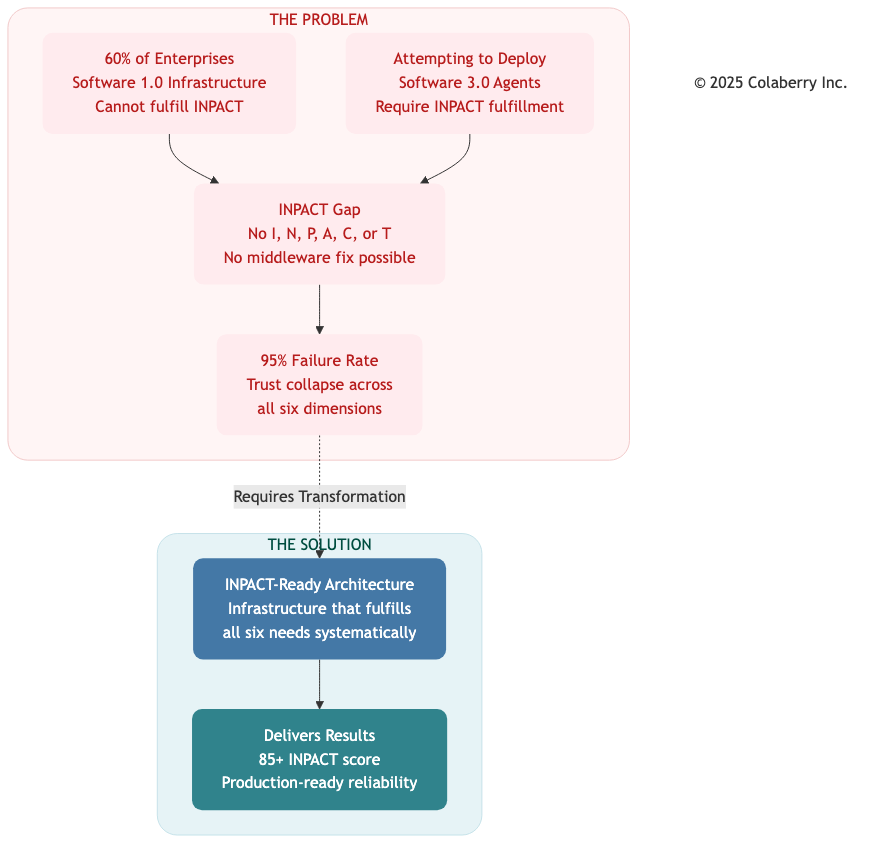
Most enterprises attempt to deploy Software 3.0 agents on unaugmented Software 1.0 infrastructure, creating the INPACT gap that drives the 95% pilot failure rate. The solution isn't replacing existing systems, it's augmenting them with agent-ready layers.

### PART 3C: The Technology Works - Infrastructure Doesn't

The models work. This cannot be overstated.

**GPT-4** achieves human-level performance on professional exams (90th percentile on Uniform Bar Exam, 89th percentile on SAT Math). **Claude Sonnet 4.5** demonstrates superhuman coding ability and extended reasoning. These aren't research prototypes, they're production systems processing millions of queries daily.

**RAG infrastructure is proven.** Pinecone handles 50+ billion queries monthly. Weaviate powers semantic search for enterprises across 30+ industries. ChromaDB enables developers to build production-grade retrieval systems in days, not months. Vector search achieves sub-50ms retrieval latency at scale. Semantic chunking strategies reach 85%+ accuracy in context retrieval.

**So why the failures?**

**Because LLMs and RAG stacks don't solve INPACT readiness.** A brilliant reasoning engine can't overcome infrastructure that wasn't designed to fulfill the six needs agents require. The gap isn't in model capability, **it's in infrastructure's ability to fulfill INPACT needs.**

For enterprises, "building for agents" requires implementation at two layers:

**Interface Layer (Karpathy's focus):** How agents discover and understand available systems - llm.txt documentation, actionable API specs, clear error messages.

**Infrastructure Layer (INPACT's focus):** What underlying capabilities systems must provide once agents attempt to operate - real-time data access, semantic understanding, dynamic permissions, continuous learning, cross-system context, observable reasoning.

Both layers are essential. Agents need discoverability (Karpathy) AND operational infrastructure (INPACT). The INPACT Framework addresses the six infrastructure needs enterprises must systematically fulfill:

**I - Instant:** Semantic data layers agents can query in <2 seconds  
**N - Natural:** Business glossaries mapping "diabetes follow-up" to diagnostic codes  
**P - Permitted:** Dynamic permission systems enforcing contextual access  
**A - Adaptive:** Feedback loops enabling continuous improvement  
**C - Contextual:** Cross-system integration providing universal context  
**T - Transparent:** Reasoning chain observability enabling validation

This isn't about replacing data warehouses or abandoning BI dashboards. It's about adding the semantic understanding, dynamic access, real-time retrieval, and observable reasoning layers that fulfill INPACT needs, while preserving the data quality, governance controls, and audit trails that enterprises demand.

**Software 3.0 agents require INPACT ready infrastructure. Attempting to avoid that transformation is why 95% fail.**

**BI-Era vs. Agent-Era: INPACT Need Fulfillment**

**Figure 1.4: Human Era vs INPACT Ready Agent Era**


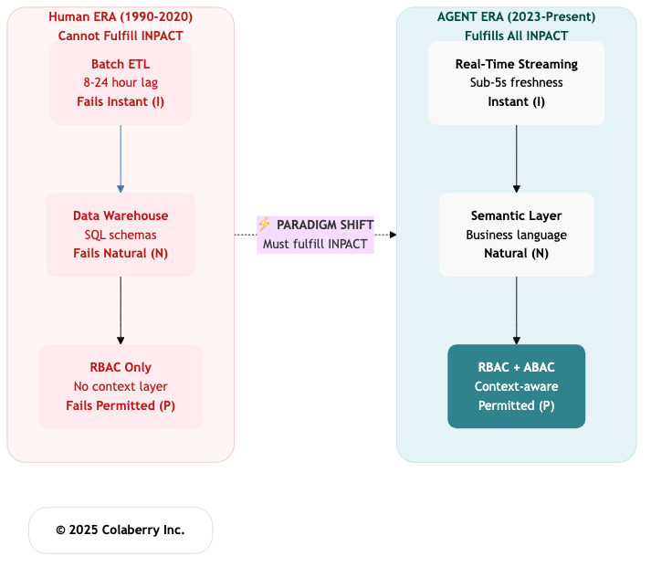
**INPACT Need Fulfillment: BI Era vs Agent Era**

| INPACT Need | BI Era Infrastructure | Agent Era Infrastructure | Failure When Unfulfilled |
|--------------|----------------------|-------------------------|-------------------------|
| **Instant (I)** | Daily batch (8-24hr lag) | Real-time streaming (<2s) | User abandonment (9-13s = death) |
| **Natural (N)** | Fixed SQL, cryptic schemas | Semantic layer, business language | 40-60% accuracy, user frustration |
| **Permitted (P)** | RBAC only (no context) | RBAC + contextual ABAC | Compliance violations, regulatory risk |
| **Adaptive (A)** | Quarterly reviews | Continuous feedback loops | No improvement, model drift |
| **Contextual (C)** | Siloed databases | Unified multi-modal platform | Incomplete answers, low trust |
| **Transparent (T)** | Basic query logs | Reasoning chain observability | Audit failures, legal exposure |

The gap between what BI-era infrastructure delivers and what Agent-era applications need **is precisely the INPACT fulfillment gap.** Incremental improvements keep organizations in the failing majority. **INPACT-focused transformation** moves them to the successful 5%.

---

## PART 4: SARAH'S $2M WAKE-UP CALL

### Three Pilots, Six INPACT Need Failures

After the board meeting, Sarah Cedao sat in her office reviewing the forensic analysis Marcus Williams had compiled. Three pilots. Three different vendors. Three distinct failure modes. But when Sarah looked at the root causes through the INPACT lens, a pattern emerged: **every failure traced to infrastructure's inability to fulfill specific INPACT needs.**

**Figure 1.5: Echo's Three Failing Pilots - The $2M Wake-Up Call**


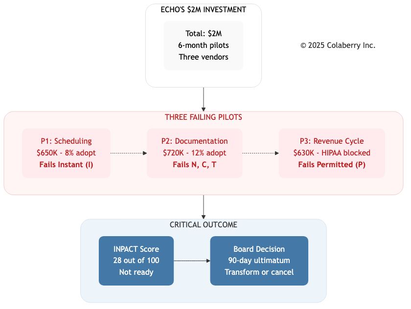
The visual pattern was unmistakable: three independent failures, three different vendors, but one systematic cause - infrastructure's inability to fulfill INPACT needs across all six dimensions. Each pilot's detailed analysis would reveal the specific need failures that drove abandonment.

### Pilot 1: Patient Scheduling Agent -Instant (I) Need Failure (Detailed Analysis)

**Investment:** $650,000 (6-month pilot)  
**Goal:** Automate appointment booking via natural language  
**Vendor:** Leading healthcare AI platform + Azure OpenAI  
**Technology Stack:** GPT-4, Pinecone vector database, state-of-the-art RAG implementation

**The Promise:**  
Care coordinators could simply type "Schedule Mrs. Johnson with Dr. Martinez for diabetes follow-up next Tuesday" and the agent would handle slot availability, insurance verification, and confirmation - all in natural language, all in under 2 seconds.

**The Reality:**  
9-13 second response times. Users abandoned the interface before seeing results. Maria Rodriguez's experience with the 9:47 AM cancellation was typical, not exceptional.

**INPACT Analysis: Instant (I) Need Failure**

Sarah and Marcus traced every millisecond:
- Query parsing: 100ms (acceptable)
- Resolving "Dr. Martinez" to provider_id: 200ms (acceptable)
- Checking appointment availability: 5-8 seconds (**catastrophic Instant failure**)

Why? The `appointment_slots` table refreshed nightly at 2 AM via batch ETL:

```sql
-- The overnight ETL that killed the Instant (I) need
INSERT INTO warehouse.appointment_slots
SELECT provider_id, slot_datetime, is_available  
FROM source_ehr.schedule
WHERE load_date = DATEADD(day, -1, GETDATE());
```

By 10 AM, data was 8 hours stale. That morning cancellation at 9:47 AM? The agent couldn't see it. A double-booked appointment? Invisible until tomorrow's ETL run.

The database was cold, no indexes optimized for agent query patterns, no caching layer. Every request hit the warehouse fresh, forcing full table scans. Insurance eligibility checks added another 3-4 seconds querying the claims system's batch-refreshed tables. (See the Stack Builder at trustbeforeintelligence.ai/tools to assess your infrastructure gaps.)

**Failure Impact:**
- **Adoption:** 8% after 6 months (target was 60%)
- **User Feedback:** "Faster to just call the scheduling desk"
- **Pilot Status:** Suspended
- **INPACT Score™ for Instant (I):** 2/6 (overnight ETL = 8-24 hour lag)

**The Infrastructure Gap:** Echo's BI-era batch ETL architecture **wasn't designed to fulfill the Instant (I) need** that agents require. Real-time data fabric (Layer 2 of the 7-Layer Architecture) must be added to achieve sub-2-second responses.

---

Pilot 1's failure wasn't about the AI, it was about eight-hour-old data in a non-indexed data warehouse. Pilots 2 and 3 reveal different gaps, same root cause.

---

### Pilot 2: Clinical Documentation Assistant - Natural (N), Contextual (C), and Transparent (T) Need Failures

**Investment:** $720,000 (6-month pilot)  
**Goal:** Ambient AI transcribing physician-patient conversations into structured notes  
**Technology Stack:** Whisper API for transcription, medical LLM fine-tuned on clinical notes

**The Reality:** 40-60% accuracy on diagnosis codes. Physicians didn't trust the output and spent more time correcting notes than writing them manually.

**INPACT Analysis: Three Simultaneous Need Failures**

**Natural (N) Need Failure:**  
Echo's data warehouse used cryptic table names: `FCT_PTNT_ENCT`, `DIM_PRVDR_SPCLT`, `BRIDGE_DIAG_ICD10`. The agent had no semantic layer mapping "diabetes follow-up" to diagnosis codes E11.9, E11.65, E11.22. When physicians used shorthand like "uncontrolled DM2," the agent misinterpreted or missed it entirely. No business glossary. No entity resolution. No natural language mapping to technical schemas. (See the Vendor Advisor at trustbeforeintelligence.ai/tools for semantic layer product recommendations.)

**Contextual (C) Need Failure -Seven Missing Context Dimensions:**  

Agents require seven types of context to generate accurate, trustworthy outputs. Echo's infrastructure provided only **1 of 7**:

**Echo's Context Coverage: 1 of 7 (86% Context Blindness)**

- **User Context:** Missing - No physician personalization (Dr. Chen's documentation style unknown)  
- **Task Context:** Missing - Generic templates only (progress note structure not optimized for diabetes follow-up)  
- **Data Context:** Present - Current visit data available (vitals, labs from today's session)  
- **Environmental Context:** Missing - No workflow adaptation (15-minute time slots, voice recognition constraints ignored)  
- **Business Context:** Missing - No protocol integration (diabetes care protocols, reimbursement requirements missing)  
- **History Context:** Missing - No 8-year A1C trends (couldn't reference "ongoing management" or medication adjustments)  
- **Tooling Context:** Missing - Read-only, no actions (couldn't trigger prescription system or lab orders)

**Result:** The agent operated with 86% context blindness. It couldn't see 8 years of patient history, care protocols, or physician documentation patterns. When Dr. Chen said "ongoing management," the agent needed History Context to see the progression. When discussing medication adjustments, it needed Business Context to reference diabetes care protocols. (See the Context Types at trustbeforeintelligence.ai/tools for the complete context taxonomy.)

**Transparent (T) Need Failure:**  
Legal reviewed 50 AI-generated notes and couldn't determine which data sources the agent accessed, why specific diagnoses were included/excluded, whether protected health information was handled appropriately, or what the audit trail showed. With no reasoning chain visibility and no complete audit logging, legal blocked production deployment. The risk of malpractice liability was too high.

**Failure Impact:**
- **Adoption:** 12% of physicians (most rejected after initial trial)
- **Pilot Status:** Legal review pending (effectively dead)
- **INPACT Score Values:** Natural (N): 3/6 | Contextual (C): 2/6 | Transparent (T): 2/6

**Infrastructure Gaps:** No semantic layer (Layer 3), no intelligence orchestration for cross-system context (Layer 4), no observable reasoning (Layer 6).

---

### Pilot 3: Revenue Cycle Optimization - Permitted (P) Need Failure

**Investment:** $630,000 (6-month pilot)  
**Goal:** Automated claims processing and denial management

**The Reality:** HIPAA violation in Week 4. Medicare certification nearly revoked. Pilot terminated immediately.

**What Happened:**

The agent's logic was sound: to optimize coding for one patient, it needed to compare similar cases from the same insurance plan. So it queried the database:

```sql
-- The query that violated the Permitted (P) need
SELECT patient_id, diagnosis_codes, procedure_codes, claim_amount
FROM claims_history
WHERE insurance_plan_id = 'BCBS_PPO_457'
  AND diagnosis_primary LIKE 'E11%'  -- Diabetes codes
ORDER BY claim_date DESC
LIMIT 50;
```

No treatment relationship filter. No temporal context. No "minimum necessary" enforcement. **The infrastructure had no way to enforce the Permitted (P) need dynamically.**

Forty-seven records. Forty-seven HIPAA violations. One record belonged to the adult daughter of a state legislator, a woman whose medical history had nothing to do with the query except shared insurance provider and diagnosis.

**The Permitted (P) Need Failure:**

The agent used a service account, **SVC_REVENUE_AGENT**, with database-level permissions Echo's data team had granted for BI reporting. Standard practice. But analysts were humans who applied judgment and understood HIPAA's "minimum necessary" rule. **The agent was not human, and Echo's RBAC-only infrastructure could not enforce the Permitted (P) need contextually.**

Echo's RBAC defined roles and granted the service account blanket access to claims data. What was missing: contextual evaluation of whether this access was required for this specific task, whether this user had a treatment relationship with this patient, whether this was the minimum necessary information, and whether this action required human approval.

BI-era infrastructure assumed humans would apply judgment. **Agents need infrastructure that enforces the Permitted (P) need programmatically through dynamic authorization.**

**Failure Impact:**
- **ROI:** Negative 15% (legal fees, audit costs, remediation)
- **Regulatory:** CMS warning letter, corrective action plan required
- **Pilot Status:** Terminated, rolled back to manual processing
- **INPACT Score for Permitted (P):** 1/6 (RBAC only, no contextual ABAC layer)

**Infrastructure Gap:** Echo's RBAC alone **wasn't designed to fulfill the Permitted (P) need** for context-aware access control. Contextual ABAC (Layer 5) must be layered on existing RBAC to enforce "minimum necessary" dynamically.

---

Three pilots. Three vendors. One systematic cause: infrastructure that couldn't fulfill what agents need.

---

### The Realization: INPACT Assessment Reveals Systematic Failures

Sarah stared at the failure analysis spread across three monitors. Three different failure modes. Three different vendors. But when analyzed through the INPACT Framework, one pattern emerged: **infrastructure systematically failed to fulfill the six needs across all pilots.**

The scheduling pilot failed because infrastructure couldn't fulfill **Instant (I)**.  
The documentation pilot failed because infrastructure couldn't fulfill **Natural (N), Contextual (C), or Transparent (T)**.  
The revenue pilot failed because infrastructure couldn't fulfill **Permitted (P)**.

No amount of model tuning, prompt engineering, or vendor changes would fix problems that originated in infrastructure's inability to fulfill INPACT needs. Sarah had been treating infrastructure readiness as a binary checkbox: "Yes, we have a data warehouse." But readiness wasn't binary, **it was dimensional, measurable through INPACT, and Echo scored catastrophically low.**

Sarah anxiously loaded the INPACT assessment tool results:

**Echo Health INPACT Score: 28/100**

Their dimension breakdown (detailed in Chapter 2) revealed five critical gaps: Instant, Natural, Permitted, Adaptive, and Transparent all scored 1-2/6. Only Contextual reached 3/6.

**10/36 = 28 out of 100.** Not even close to the 86+ required for agent deployments to succeed.

But the assessment also showed the path forward: **a 7-layer architecture that systematically delivers all six INPACT needs.** Real-time data fabric for Instant. Semantic layers for Natural. Dynamic authorization for Permitted. Feedback loops for Adaptive. Intelligence orchestration for Contextual. Observable reasoning for Transparent.

Sarah knew what she had to tell the board: **We need to build INPACT-ready infrastructure before we deploy more agents.** Not as separate IT modernization. Not as optional improvement. As the foundation that makes agent deployments actually succeed.

The $2 million in failed pilots? That was the cost of learning that **agents require infrastructure that fulfills INPACT needs.** The question now was whether Echo's board would invest in the transformation before competitors with higher INPACT scores captured the market.

---

## PART 5: KEY TAKEAWAYS AND THE PATH FORWARD

### Three Critical Insights

**Insight 1: Trust Requires INPACT Need Fulfillment, Not Better AI Models**

The 95% failure rate isn't about model quality, regulatory compliance, or talent gaps. It's about **infrastructure's failure to fulfill INPACT needs.** Deloitte's Q3 2025 data proves it: **agentic AI trust collapsed 64% in five months** because infrastructure couldn't deliver on the six needs agents require.

Users abandon agents that don't respond instantly, understand naturally, access only permitted data, learn from feedback, synthesize complete context, and explain reasoning transparently. **No amount of model sophistication compensates for INPACT need failures.**

Trust isn't something you require or declare. **Trust is earned when infrastructure consistently fulfills all six INPACT needs.** Miss even one dimension, and join the 95% who fail.

**Insight 2: Technology Works - Infrastructure Isn't INPACT Ready**

GPT-4 achieves 90th percentile on the Bar Exam. Claude Sonnet 4.5 demonstrates superhuman coding ability. Pinecone handles 50+ billion monthly queries. RAG implementations achieve 85%+ retrieval accuracy.

**The models are production-ready. The infrastructure isn't INPACT-ready.**

Attempting to run Software 3.0 agents on Software 1.0 infrastructure, batch ETL, cryptic schemas, RBAC without contextual layers, siloed systems, creates the INPACT gap that drives failure. Karpathy's paradigm shift is real: LLMs are fundamentally different computers that **require infrastructure fulfilling INPACT needs.**

**Insight 3: Six INPACT Need Failures Map to Six Failure Patterns**

Every failed pilot follows predictable patterns that map to INPACT dimensions:

**Instant failures** (9-13 second responses) → No real-time data fabric  
**Natural failures** (40-60% query precision) → No semantic layer  
**Permitted failures** (HIPAA violations) → No dynamic authorization  
**Adaptive failures** (no improvement) → No feedback loops  
**Contextual failures** (partial answers) → No cross-system synthesis; agents missing 6 of 7 context types (user, task, environmental, business, tooling, history)  
**Transparent failures** (black box reasoning) → No reasoning chain observability

These aren't random problems requiring bespoke solutions. They're systematic INPACT need fulfillment gaps requiring architectural transformation. **The INPACT Framework diagnoses the needs. The 7-Layer Architecture delivers them.**

### Where Does Your Infrastructure Stand?

Echo scored 28/100. Most enterprises scoring between 25-45 are firmly in the "high risk" zone where agent deployments consistently fail.

The assessment at **trustbeforeintelligence.ai/assessment** measures your readiness across all six dimensions in 15 minutes. Chapter 2 provides the detailed scoring rubrics.

### Bridge to Chapter 2: INPACT Deep Dive

Sarah Cedao left that board meeting with a directive and a deadline: 90 days to show measurable infrastructure improvement or Echo would cancel all AI initiatives.

She spent the weekend researching frameworks, reading case studies, analyzing what separated the 5% who succeeded from the 95% who failed. By Monday morning, she had her answer: **INPACT, the framework that defines what agents need from infrastructure and how to systematically fulfill those needs.**

Not generic "AI readiness." Not checklist compliance. **A systematic approach to fulfilling the six needs that earn user trust.**

**Chapter 2 shows you the same INPACT Framework Sarah used to transform Echo from 28/100 to 86/100 in 10 weeks.**

You'll learn:
- How to assess your current state across all six INPACT dimensions
- What infrastructure capabilities fulfill each need
- How to prioritize investments for maximum impact
- Why all six needs must be addressed (not just the easy ones)
- How INPACT drives requirements for the 7-Layer Architecture

If Sarah could do it under board pressure with a 90-day deadline and $2 million in failed pilots behind her, so can you.

**The transformation starts with understanding INPACT needs. Chapter 2 builds that foundation.**


## Chapter Summary

| Part | Content | Key Takeaway |
|------|---------|--------------|
| **Part 1** | The Human-AI Trust Gap | Six INPACT needs define what agents require; 64% trust collapse proves infrastructure gaps drive failure |
| **Part 2** | Sarah's Moment of Crisis | $2M in failed pilots, 90-day ultimatum, technology worked, infrastructure didn't |
| **Part 3** | The Infrastructure Readiness Gap | Software 3.0 requires INPACT-ready infrastructure; BI-era systems cannot fulfill agent needs |
| **Part 4** | Sarah's $2M Wake-Up Call | Three pilots failed across different INPACT dimensions; Echo scored 28/100 |
| **Part 5** | Key Takeaways | Trust is earned through need fulfillment; the path forward requires architectural transformation |


## References

[1] Deloitte. (2025). "TrustID® Workforce AI Report Q3 2025." Analysis of trust collapse in agentic AI systems, February-July 2025 cohort. https://d1lzrgdbvkolkd.cloudfront.net/4749_Deloitte_Trust_ID_Workforce_AI_Report_Q3_2025_3aa42f916c.pdf

[2] Reichheld, A., Brodzik, C., & Roesch, A. (2025). "Workers Don't Trust AI. Here's How Companies Can Change That." Harvard Business Review. https://hbr.org/2025/11/workers-dont-trust-ai-heres-how-companies-can-change-that

[3] 1Password. (2025). "2025 Annual Report: Shadow AI and Unauthorized Tool Usage in Enterprise." Survey of 5,000 knowledge workers. Referenced in: Infosecurity Magazine. https://www.infosecurity-magazine.com/news/shadow-ai-employees-use-unapproved/

[4] KPMG LLP. (2025, April 16). "KPMG AI Quarterly Pulse Survey: Q1 2025." Analysis of risk management, trust, and workforce readiness in GenAI adoption. Survey of 130 U.S.-based C-suite and business leaders from organizations with $1B+ annual revenue. https://kpmg.com/us/en/media/news/q1-ai-pulse-2025.html

[5] McKinsey & Company. (2025, January 28). "Superagency in the Workplace: Empowering People to Unlock AI's Full Potential at Work." Research based on surveys of 3,613 employees and 238 C-level executives across six countries. https://www.mckinsey.com/capabilities/tech-and-ai/our-insights/superagency-in-the-workplace-empowering-people-to-unlock-ais-full-potential-at-work

[6] Tray.ai. (2025). "The State of Enterprise AI Agents: Insights from 1,000+ IT Leaders." Survey of 1,000+ IT leaders on AI agent adoption challenges, security concerns, and infrastructure requirements. https://242774090.fs1.hubspotusercontent-na2.net/hubfs/242774090/Downloadable%20assets%20for%20website/State_of_Enterprise_AI_Agents_2025.pdf

[7] Anthropic. (2025, September). "Anthropic Economic Index Report: Uneven Geographic and Enterprise AI Adoption." Analysis of enterprise Claude API usage patterns. https://www.anthropic.com/research/anthropic-economic-index-september-2025-report

[8] Lyzr. (2025, Q3). "The State of AI Agents in Enterprise: Q3 2025." Analysis of 200,000+ user interactions and 2,000+ enterprise conversations. https://www.lyzr.ai/state-of-ai-agents/

[9] Karpathy, Andrej. (2025). "Software Is Changing (Again)." Y Combinator AI Startup School Keynote, San Francisco, June 17, 2025. https://www.ycombinator.com/library/MW-andrej-karpathy-software-is-changing-again

[10] Bain & Company. (November 2025). "Executive Survey: AI Moves from Pilots to Production." Key findings: 74% rate AI as top-three priority (vs. 60% in 2024), 80% of use cases met/exceeded expectations, only 23% tied to revenue/cost impact, agentic workflows 2x more likely to exceed goals. https://www.bain.com/insights/executive-survey-ai-moves-from-pilots-to-production/
# Chapter 2: The INPACT Framework™

**The Six Needs Chapter**

---

*Monday morning, conference room 3B.*

Sarah Cedao pulled up the assessment dashboard. Krish Yadav, CFO, studied the numbers in silence.

**28/100.**

"We spent fifteen years building data excellence," Krish said. "How are we failing this badly?"

"We haven't failed at data excellence, we succeeded brilliantly at building the wrong thing for the agent era." Sarah advanced to the breakdown. "Our infrastructure was built for humans analyzing reports over coffee. Agents need something different. They need six things, actually. And we're failing at five of them."

This chapter explains what those six things are.

---

**Figure 2.0: The INPACT Framework - Six Infrastructure Needs for Agent Trust**


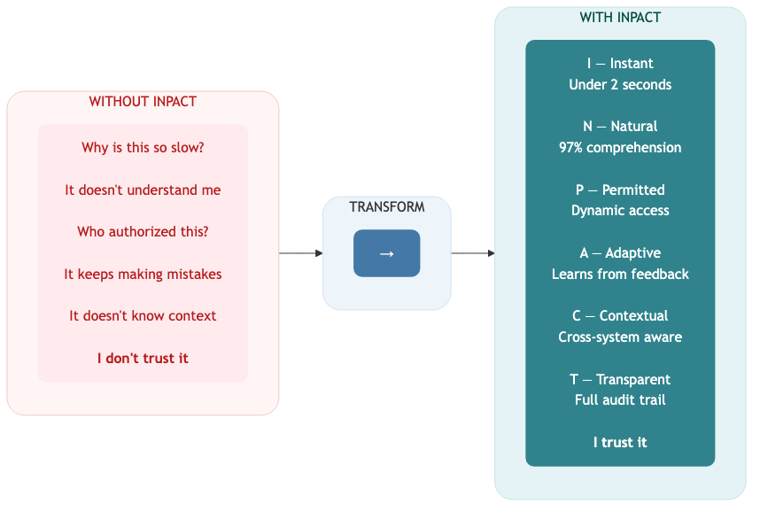
> **Key Takeaway:** Six infrastructure needs. One framework. Trust.

## PART 1: FRAMEWORK INTRODUCTION

### The Architecture of Trust: Building Pillar 1

Chapter 1 revealed why 95% of enterprise AI agent projects fail not from inadequate AI, but from infrastructure unreadiness [1]. The solution: the Architecture of Trust, with its three integrated pillars shown below.

**Figure 2.1: The Architecture of Trust - Three Integrated Pillars**


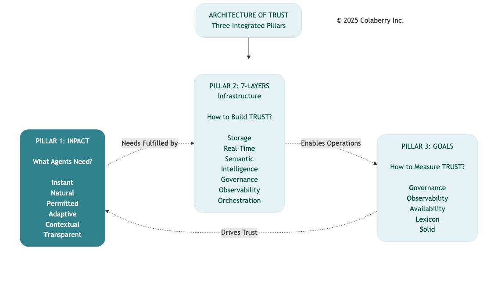
**This chapter builds Pillar 1 completely.** You'll understand what agents need, why traditional infrastructure fails each need, and how Echo Health transformed from 28/100 readiness to 86/100 in ten weeks.

### The Origin: Pattern Recognition Across Industry Deployments

INPACT emerged from analyzing patterns across production agent deployments in healthcare, life sciences, utility, finance, retail, and manufacturing. Chapter 1 showed you **why** agents fail by infrastructure gaps, not AI quality. But **which** gaps matter most? How do you diagnose them systematically?

Three patterns emerged consistently:

**The Accuracy Paradox:** Scheduling agents achieving 95% accuracy, yet abandoned by users. Why? Response times of 9-13 seconds destroyed conversational experience.

**The Efficiency Paradox:** Documentation agents cutting transcription time 80%, yet sitting unused. Why? Static permissions required two-week provisioning, blocking clinical workflows.

**The Trust Paradox:** Recommendation engines providing evidence-based guidance, yet overridden 70% of the time. Why? Opaque reasoning gave physicians no basis for trust.

When we analyzed these failures, six needs emerged. When any single need went unfulfilled, trust collapsed. When all six were addressed systematically, adoption soared. These six needs became INPACT.

---

### The Tony Robbins Parallel: From Human Needs to Agent Needs

Tony Robbins built an empire on one insight: humans have six core needs - significance, variety, certainty, growth, connection, and contribution. When fulfilled, humans flourish. When neglected, people stagnate.

**AI agents follow the same pattern.** They don't need psychological fulfillment - they need architectural fulfillment. Agents' six core needs - instant, natural, permitted, adaptive, contextual, and transparent. When fulfilled, Agents earn trust. When neglected, agents are abandoned.

**Figure 2.2: Human Needs to Agent Needs Parallel**


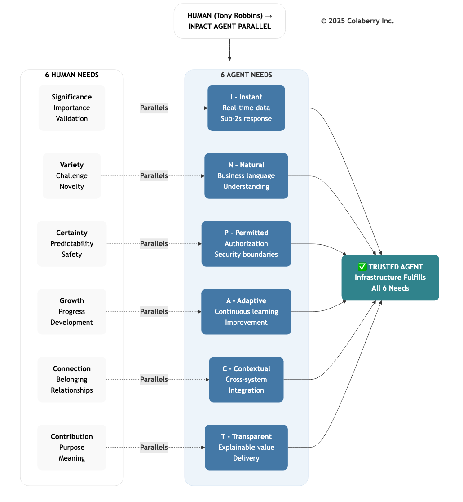
**The parallel mappings:**

**Significance** (importance, validation) → **Instant**: When someone is significant, they receive immediate attention. VIP treatment means instant response. An agent taking 10+ seconds to respond signals "you're not important enough." Sub-2-second responses validate user significance through immediate, attentive service.

**Variety** (challenge, novelty, diversity) → **Natural**: Humans need variety in how they communicate - casual and formal, terse and detailed, spoken and written. Natural language understanding provides this variety, allowing agents to comprehend the rich diversity of human expression without rigid syntax.

**Certainty** (safety, predictability) → **Permitted**: Agents need secure authorization boundaries to operate safely. Just as humans require certainty through stable, secure environments, agents require dynamic permission systems that establish clear boundaries while adapting to context.

**Growth** (progress, development) → **Adaptive**: Humans require continuous growth and development. Agents mirror this through adaptive learning by incorporating feedback, detecting drift, and continuously improving performance over time.

**Connection** (belonging, relationships) → **Contextual**: Just as humans need connection through relationships that see them completely, agents need contextual awareness across all systems for seeing the full picture, not fragmented silos.

**Contribution** (purpose, meaning) → **Transparent**: Humans need to contribute value they can see and understand. Agents fulfill this through transparent reasoning by showing exactly how they deliver value, with explainable decisions and complete audit trails.

**The crucial difference:** Humans advocate for their own needs. When humans need certainty, they ask for clarification. When they need connection, they build relationships.

**Agents cannot advocate for themselves.** They depend entirely on infrastructure to fulfill their needs. An agent can't request real-time data when batch ETL is all that's available. It can't negotiate for dynamic permissions when RBAC alone is all that exists.


**Figure 2.3: Six INPACT Needs Fulfilled**


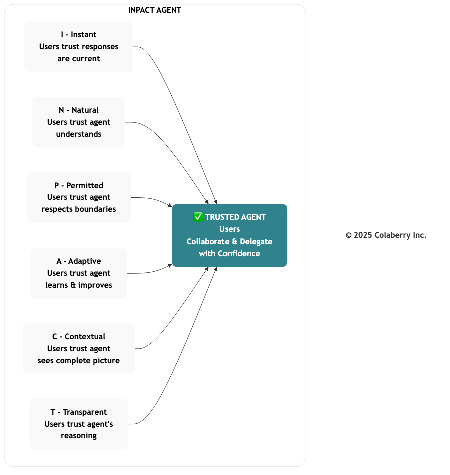

### Trust = Earned Outcome, Not Built Component

Traditional enterprise software could require trust: "You must use this ERP system." Users had no alternative. Distrust meant workarounds, but the system remained in use because it was mandated.

**AI agents cannot operate on mandated trust.** When users distrust an agent, they don't work around it, they abandon it entirely. Echo Health proved this: within three weeks, adoption dropped from 74% to 8% after repeated failures.

**Trust emerges when infrastructure consistently fulfills needs:**

**When even one need fails, trust collapses across all dimensions.** Agents operate on binary trust. Users either trust enough to delegate, or they don't trust at all. Echo's scheduling agent achieved 95% accuracy but took 9-13 seconds to respond. Users abandoned it. Accuracy didn't matter when speed destroyed conversational experience.

### INPACT as Requirements Definition

This chapter establishes INPACT as the first and foundational pillar of the Architecture of Trust. Every architectural decision in Chapters 4-6 flows from these six needs.

**The framework provides:**

**Diagnostic lens** for assessing infrastructure readiness across six dimensions.

**Requirements definition** showing what capabilities infrastructure must deliver, mapped to architectural layers.

**Prioritization framework** helping leaders decide which needs to address first based on business impact and dependencies.

**Validation criteria** establishing clear thresholds of 1-6 scoring scale per dimension, 86/100 minimum for agent readiness.

Every one of the six needs is interconnected through multiple layers of architecture. For example, Instant (I) requires real-time streaming, query optimization, and caching, Natural (N) demands semantic layers, embedding models, and vector databases. No layer solves any need alone.

### How INPACT Assessment Works

INPACT assessment quantifies infrastructure readiness using a 1-6 scoring system per dimension, creating a 36-point maximum (6 dimensions × 6 points). Convert to 100-point scale: (score/36) × 100.

**Figure 2.4: INPACT Assessment Methodology - From Dimensions to Decision**


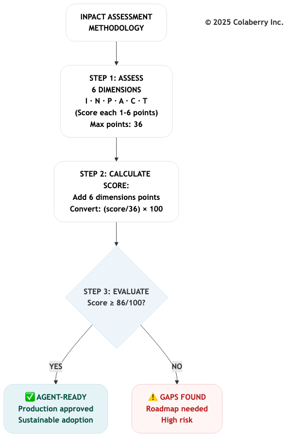
**The six INPACT dimensions assessed:**

- **I (Instant):** Real-time data delivery, sub-2-second response times
- **N (Natural):** Semantic understanding of business language
- **P (Permitted):** Dynamic authorization with attribute-based policies
- **A (Adaptive):** Continuous learning through feedback loops
- **C (Contextual):** Cross-system integration for complete picture
- **T (Transparent):** Audit trails and explainable reasoning

**Scoring methodology:** Infrastructure blocks agent deployment. Major capability gaps would cause compliance failures or user abandonment.

**Score 3 (Moderate):** Pilot-appropriate but not production-ready. Requires significant improvement.

**Score 4 (Adequate):** Core capabilities functional. Production-acceptable with room for optimization.

**Score 5-6 (Strong/Excellent):** Solid production capability meeting or exceeding requirements. Best-in-class at level 6.

**86/100 Threshold:** Industry analysis shows 86/100 (~31/36 points) as minimum for production readiness [15,16]. Below 86: high abandonment risk. Above 86: sustainable adoption, manageable risk, continuous improvement foundation.

**Figure 2.5: Echo Health's INPACT Transformation - 28/100 to 86/100 in 10 Weeks**

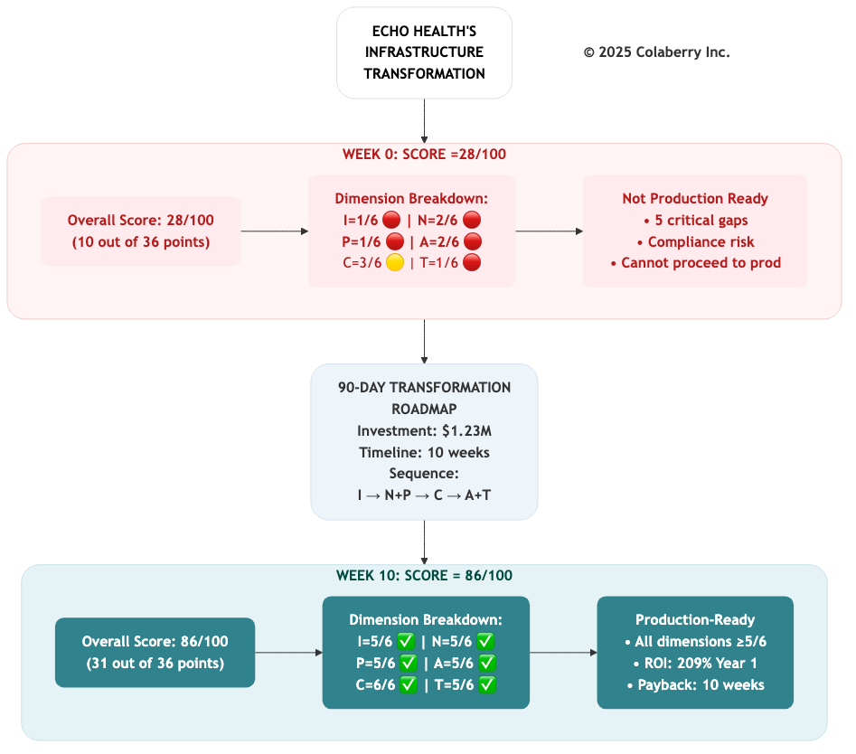

**Practical Application:** INPACT assessment takes 30 mins to 4 hours with infrastructure and data teams. Output: current score per dimension, gap analysis, prioritized roadmap. Tool available at trustbeforeintelligence.ai/assessment.

### Echo Health's Reality Check

Sarah's dashboard revealed the brutal truth - dimension by dimension:

**I (Instant): 1/6** (critical - batch only)  
**N (Natural): 2/6** (weak - minimal semantic)  
**P (Permitted): 1/6** (critical - RBAC only)  
**A (Adaptive): 2/6** (weak - no feedback)  
**C (Contextual): 3/6** (moderate - EHR integration exists but limited)  
**T (Transparent): 1/6** (critical - no audit trails)  

**Total: 10/36 = 28% → 28/100**

Five critical gaps. One moderate strength. A 21-point climb to reach the 86/100 production threshold.

The transformation roadmap began there.

## PART 2: ECHO'S DISCOVERY AND PRIORITIZATION

### The Assessment That Changed Everything

Sarah's assessment made the rounds. The board wanted answers. Dr. Arun Raj scheduled a follow-up.

"We built excellence for the human era," Sarah explained. "Overnight batch processing, visual dashboards, analysts who could wait hours for reports. That infrastructure is sophisticated, well-governed, and completely wrong for agents needing sub-second responses to natural language questions with dynamic authorization."

### Two Critical Dimensions Explained


**Instant (I): Why Score 1/6 Kills Adoption**

Sarah's first agent prototype took 9-13 seconds to respond. The team traced two distinct problems:

**Problem 1: Slow Queries (5-8 seconds)**
The data warehouse was optimized for analyst workloads (large aggregations, complex joins) not agent workloads (fast point lookups). The appointment availability queries suffered from table scans instead of indexed lookups, no query result caching, and cold storage.

**Problem 2: Stale Data (8-24 hours old)**
The warehouse refreshed overnight via batch ETL. By 10 AM, data was 8+ hours stale. That morning's 9:47 AM cancellation? Invisible to the agent querying at 10:00 AM. The agent booked an already-taken slot. Patient called back, frustrated.

**User abandonment: 92%.** Speed killed adoption before accuracy mattered.

**What's needed:**
- **For speed:** Query-optimized storage achieving sub-200ms lookups (Layer 1), semantic caching with 60%+ hit rates (Layer 4)
- **For freshness:** Change data capture streaming updates with under 30-second freshness (Layer 2)
- **Combined target:** Sub-2-second agent responses with current data

**Permitted (P): Why Score 1/6 Is Dangerous**

Echo's SQL Server database used traditional role-based access control with four roles: reader, writer, admin, and app_service. When they gave their agent the app_service account, it could access ANY patient's data regardless of who asked.

The compliance audit failed catastrophically. The agent used one service account for all users. Permissions did't vary by requester. Role-based access operated at table level, granting all records or nothing. Static permissions didn't consider context like time of day or purpose. Audit logs showed "scheduling_agent made query" but not which human user and which agent triggered it or why.

**HIPAA penalty exposure: $50,000+ per violation [2].** With 3,000+ daily agent interactions, the risk was existential.

**What's needed:** Attribute-based access control (ABAC) layered on existing RBAC, evaluating permissions per query based on user identity, data sensitivity, action type, and environmental context [3]. Dynamic masking protects sensitive fields. Complete audit trails with trace IDs connecting human users through agent actions to data access. Policy evaluation in under 10ms without breaking response times.

### The Roadmap Decision

The CEO studied the assessment. "Sarah, you're recommending $1.23M over 90 days to reach 86/100. What's your implementation sequence?"

"Three phases, ten weeks," Sarah explained. "Phase 1: Layers 1-2 addressing Instant and Contextual. Phase 2: Layers 3-4 addressing Natural. Phase 3: Layers 5 to 7 addressing Permitted, Transparent, and Adaptive. Dependencies force this sequence. We can't implement dynamic authorization without real-time data infrastructure."

The board approved. Week 12 target: 86/100 with first production agent deployed.

---

## PART 3: THE SIX NEEDS

### I - Instant: Real-Time or Abandoned

**The User Need**

When a patient asks "Can I see Dr. Martinez today?", they expect answers in seconds. Research shows 90% of customers expect instant responses, 61% prefer faster AI replies over waiting for humans [4]. For conversational AI, "instant" means sub-2-second responses.

Every second of latency costs trust. A patient calls to schedule. The agent queries last night's data dump. The cancellation 30 minutes ago? Invisible. The agent books an already-taken slot. Patient calls back, frustrated. Trust evaporates.

**The Infrastructure Gap**

**Figure 2.6: Batch Processing vs. Real-Time Response**


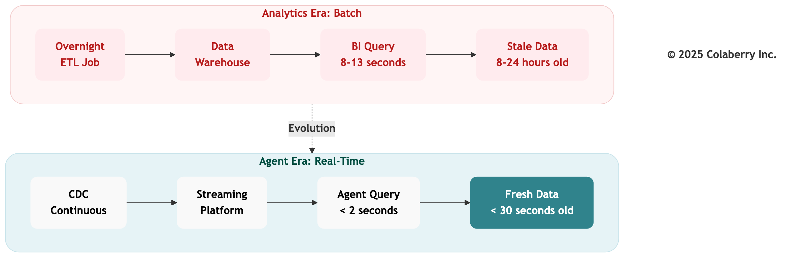
Echo's agent took 9-13 seconds to respond. Appointment availability queries hit data warehouses refreshed overnight via batch ETL. By 10 AM, data was 8+ hours stale. The database was cold with no indexes optimized for agent patterns, no caching. Every request forced table scans.

Enterprise data systems were built for patience. Overnight batch jobs. Queries taking 9-13 seconds. Data hours or days old. That worked when humans analyzed reports over coffee. It fails when agents must respond at conversational speed.

**The Architecture Fix**

Sub-2-second responses require three architectural capabilities: 

**Storage optimization** (Layer 1) with query-optimized databases such as vector databases for semantic search under 50ms, knowledge graphs for relationships under 200ms, transactional databases for lookups under 20ms [5]. 

**Real-time streaming** (Layer 2) using change data capture maintaining under 30-second freshness, eliminating overnight batch processing [6]. 

**Intelligent caching** (Layer 4) achieving 60%+ hit rates, reducing latency from seconds to milliseconds [7].

**Echo's Transformation**

Week 0: 9-13 second responses, 8-24 hour stale data, 92% user abandonment.

Week 4 after implementing Layers 1-2: Databricks lakehouse replaced SQL Server warehouse [5]. Debezium CDC captured EHR changes in real-time [6]. Redis cached frequently accessed reference data [7].

Results: 1.8 second average response (82% improvement), under 30-second data freshness, 8% user abandonment (84% improvement). The same Dr. Martinez' query now took 1.6 seconds, fast enough that patients stayed engaged and completed bookings.

**Specific scenario:** 9:47 AM cancellation captured by CDC within 12 seconds. Patient calling at 10:00 AM sees slot as available with current data. Booking completes successfully.

**Measuring Success:** Score 1 = response times over 10 seconds, data over 24 hours stale, user abandonment over 80%. Score 6 = response times under 1 second, data under 30 seconds stale, abandonment under 5%. Echo moved from 1/6 to 5/6.

---

### N - Natural: Understood or Useless

**The User Need**

A care coordinator asks: "Show me patients needing diabetes follow-up this quarter." Traditional systems think: "What is table FCT_PTNT_ENCT?" Users don't speak SQL. Agents must understand natural language without requiring users to know table names, join logic, or schemas.

Research shows GPT-4 achieves 73% execution accuracy on complex database schemas [8]. Enterprise environments with cryptically-named tables see 40-60% accuracy without semantic optimization. **A 40% failure rate is unacceptable** in healthcare or finance where wrong answers cause harm.

**The Infrastructure Gap**

**Figure 2.7: Manual Translation vs. Semantic Understanding**


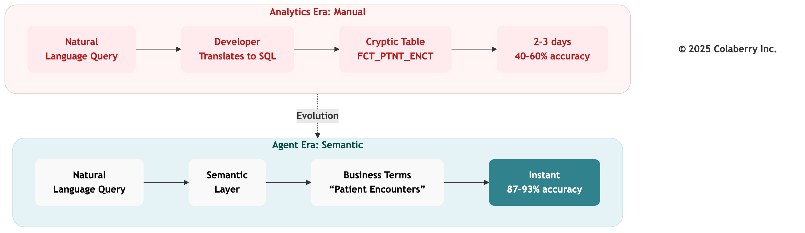
Echo's database schema: 347 tables, average table name 23 characters of cryptic abbreviations. DIM_CUST_LOC_ADDR_FACT_D_KEY meant "customer location address fact dimension key." Legacy naming was chosen for technical reasons fifteen years ago. Perfect for batch ETL. Unintelligible to LLMs and humans.

Test queries revealed 43% accuracy. 
Simple single-table queries: 78%. 
Moderate 2-3 table joins: 51%. 
Complex 4+ table queries: 31%. 
The worst failure: "Which diabetic patients are overdue for HbA1c tests?" should have found 34 patients. The agent found 3, missed 31, hallucinated 2 false positives.

**The Architecture Fix**

Natural language understanding requires three capabilities: 

**Semantic layer** (Layer 3) mapping business terms to technical schemas. "patient encounters" translates to FCT_PTNT_ENCT, "diabetes" maps to specific ICD-10 codes, "overdue" calculates from last_test_date and clinical_frequency fields. 

**RAG architecture** (Layer 4) retrieving relevant schema documentation, examples, and business rules to guide LLM translation. 

**Vector embeddings** (Layer 4) enabling semantic similarity search across clinical concepts. "HbA1c" matches "hemoglobin A1c," "glycated hemoglobin," "blood sugar control" [9].

**Echo's Transformation**

Week 0: 347 cryptic table names, no glossary, 43% query accuracy, clinical staff frustrated.

Week 7 after implementing Layers 3-4-5: Semantic layer with 2,400 clinical concepts mapped to database schema. Vector database (Pinecone) with embedding models encoding medical terminology relationships [9]. Retrieval system providing top-5 relevant examples per query type.

Results: Query accuracy improved from 43% to 87% (103% improvement). 
Simple queries: 78% → 96%. 
Moderate queries: 51% → 89%. 
Complex queries: 31% → 78%. 
"Diabetic HbA1c overdue" query: found all 34 patients, zero false positives.

**Specific scenario:** Prompt "Show recent labs" previously failed. "recent" undefined, "labs" mapped to 27 different test types. Post-semantic layer: "recent" = 30 days in clinical context, "labs" scoped by user role. Query success rate: 31% → 87%.

**Measuring Success:** Score 1 = under 30% accuracy, no semantic layer, frequent errors. Score 6 = over 90% accuracy, universal semantic layer, handles ambiguous queries. Echo moved from 2/6 to 5/6.

---

### P - Permitted: Authorized or Liable

**The User Need**

Healthcare faces regulations where inability to prove proper authorization results in penalties. HIPAA audits require demonstrating that every data access was authorized, attributable to a specific human, and auditable with complete justification [2].

**The Infrastructure Gap**

**Figure 2.8: RBAC Only vs. RBAC + ABAC**


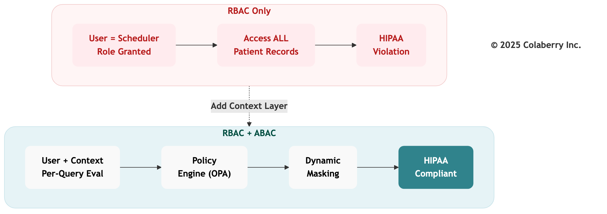
Role-based access control (RBAC) operates at table level: grant all patient records or none. Modern agents require contextual ABAC layered on this RBAC foundation: Patient 10243's appointment can be viewed by Patient 10243 themselves, physicians assigned to their case, schedulers in their region, and administrators with auditable justification [3].

Echo used four RBAC roles: reader (view only), writer (edit appointments), admin (configuration), app_service (agent). The agent used app_service credentials with table-level SELECT permissions across all patient tables. 
First test query: scheduling agent accessed Patient 10243's mental health diagnoses while booking an appointment. 
Authorization system: no context awareness of "why" or "what data needed." 
HIPAA requirement: prove agent accessed only appointment-relevant data. 
Echo's system: couldn't prove. Audit: failed.

**The Architecture Fix**

Dynamic authorization requires three capabilities: 

**ABAC policy engine** (Layer 6) evaluating permissions per-query using user identity, data sensitivity, action purpose, time, location, and organizational role [3]. 
Policies written as: "Schedulers may access appointment_date, provider_id, patient_name for patients in their assigned region during business hours when action_type='schedule_appointment'." 

**Dynamic data masking** (Layer 6) applying field-level redaction based on policy decisions. Social Security Numbers masked to *** -** -1234 unless admin with audit justification. 

**Human-in-the-loop workflows** (Layer 6) escalating high-risk decisions requiring human approval [10].

**Echo's Transformation**

Week 0: RBAC only, single service account, HIPAA violations, deployment blocked.

Week 8 after implementing Layer 6: Open Policy Agent (OPA) deployed with 47 granular policies [11]. Dynamic masking implemented at query execution. Trace IDs connecting user→agent→query→data. Escalation workflows for sensitive data access.

Results: 
HIPAA compliance restored. 
Policy evaluation: 6ms average (sub-10ms requirement met). 240 daily escalations (8% of interactions) handled by human schedulers for edge cases. 
Zero compliance violations in 90-day monitoring period.

**Specific scenario:** Scheduler requests "show all appointments for Dr. Martinez today." Pre-ABAC: agent returned ALL fields including diagnoses, medications, insurance details (HIPAA violation). Post-ABAC: agent dynamically masked sensitive fields, returned only appointment_time, patient_name, reason_for_visit. Audit trail: scheduler_id→agent_request_id→policy_evaluated→fields_returned.

**Measuring Success:** Score 1 = RBAC only, no masking, compliance failures. Score 6 = RBAC + ABAC with sub-10ms evaluation, dynamic masking, zero violations. Echo moved from 1/6 to 5/6.

---

### A - Adaptive: Evolve or Erode

**The User Need**

AI models degrade over time. Research shows 91% of (model, dataset) pairs experience temporal degradation [12]. Symptoms: accuracy drops from 87% to 73% over 3 months, query patterns change (summer flu vs. winter flu), new medical codes added without retraining, terminology evolves ("COVID" → "Long COVID" → "Post-COVID Syndrome").

Manual quarterly retraining creates 3-month windows where agents operate with degraded models. Agents must adapt continuously through feedback loops detecting drift, automated retraining triggered by performance thresholds, and human-in-the-loop correction workflows [10].

<!-- pagebreak -->

**The Infrastructure Gap**

**Figure 2.9: Quarterly Retraining vs. Continuous Learning**


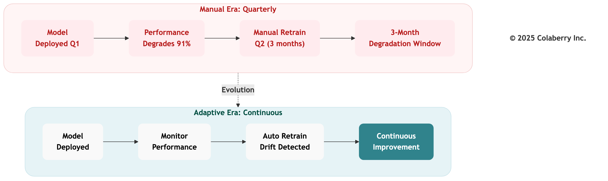
Echo deployed their scheduling agent in September with 87% appointment booking accuracy. By November, accuracy dropped to 73%. Analysis revealed three drift categories: 
**Data drift**: new physicians added, locations changed, service offerings expanded
**Concept drift**: seasonal patterns shifted (September = back-to-school physicals, November = flu season). 
**Performance drift**: model optimized for 200 daily queries now handling 600, response patterns changed.

Manual retraining required data science team availability, retraining pipeline execution, validation testing, and production deployment. Total time: 3-4 weeks. During drift period: frustrated users, abandoned bookings, manual intervention required.

**The Architecture Fix**

Continuous adaptation requires three capabilities: 

**Monitoring and alerting** (Layer 7) tracking accuracy, latency, user feedback in real-time. Alerts triggered when accuracy drops below 80%, latency exceeds 2.5 seconds, or user abandonment exceeds 15% [13]. 

**Automated retraining pipelines** (Layer 7) triggered by drift detection, incorporating recent data, validating against test sets, deploying with A/B testing. 

**Human-in-the-loop feedback** (Layer 7) capturing corrections, edge cases, and explicit user feedback to guide model improvements [10].

**Echo's Transformation**

Week 0: Quarterly manual retraining, 3-month degradation windows, no drift detection.

Week 9 after implementing Layer 7: LangSmith deployed for observability and trace monitoring [13]. Retraining pipelines automated with drift detection thresholds. Feedback loop capturing human corrections on 240 daily escalations.

Results: 
Drift detection latency: 48 hours (was 3 months). 
Retraining cycle: 3 days (was 3-4 weeks). 
Accuracy maintained: 85-89% continuous range (was 87% → 73% degradation). 
Model improvement: 240 daily human corrections incorporated weekly, improving edge case handling.

**Specific scenario:** New clinic opened in March with 4 new physicians. Traditional approach: model unaware of new providers until Q2 retraining (3 months). Adaptive approach: drift detected within 48 hours ("query patterns referencing unknown provider IDs"), automated retraining triggered, new provider data incorporated, model redeployed within 72 hours.

**Measuring Success:** Score 1 = manual quarterly retraining, no drift detection, 3+ month windows of degradation. Score 6 = real-time monitoring, automated retraining within days, continuous accuracy above 85%. Echo moved from 2/6 to 5/6.

---

### C - Contextual: Whole Picture or Half Answers

**The User Need**

Healthcare data spans multiple systems: EHR for clinical records, scheduling system for appointments, billing system for insurance, lab system for test results, pharmacy system for medications. When a patient asks "What appointments do I have?", the answer requires integrating: appointment schedules, provider availability, insurance eligibility, outstanding lab orders, medication refill timing.

**The Infrastructure Gap**

**Figure 2.10: Single-System vs. Cross-System Integration**

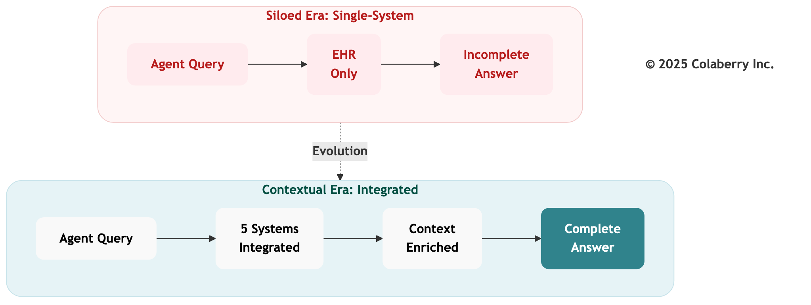

Agents operating on single-system data provide incomplete answers: "You have an appointment Tuesday at 2 PM with Dr. Martinez" (missing: you need to fast 12 hours before because there's a lab order, and you're due for medication refill, so bring your prescription).

Echo's initial agent had partial integration. EHR connected to scheduling, with read-only lab access. But billing, pharmacy, and patient portal remained siloed. Query: "What do I need to know about my Tuesday appointment?" Agent response: "You have an appointment Tuesday at 2 PM with Dr. Martinez for annual physical. Labs ordered: comprehensive metabolic panel." Missing context: Lab requires 12-hour fasting (instruction not surfaced). Insurance needs prior auth for specific tests (billing not connected). Pharmacy flagged medication interaction (pharmacy not connected). Two outstanding forms (patient portal not connected).

Patient arrived unfasted, insurance rejected claim, medication interaction discovered during visit, forms caused delays. A complete answer required all 5 systems working together. Echo had 2 partially connected.

**The Architecture Fix**

Cross-system context requires three capabilities: 

**Unified data layer** (Layer 1) providing single query interface across heterogeneous systems - EHR, scheduling, billing, lab, pharmacy [5]. 

**Integration middleware** (Layer 2) handling API/MCP orchestration, data transformation, error handling across system boundaries. 

**Context enrichment** (Layer 4) combining data from multiple sources before agent processing. Appointment record enriched with lab requirements, insurance status, medication flags, outstanding tasks.

**Echo's Transformation**

Week 0: Single-system access (EHR only), incomplete answers, patient frustration.

Week 4 after implementing Layers 1-2: Databricks Unity Catalog provided a unified query layer across 5 systems [5]. Integration pipelines synchronized data with real-time CDC. Context enrichment combined appointment, lab, billing, pharmacy, and portal data.

Results: Query completeness: 40% → 92% (130% improvement). Systems integrated: 1 → 5 (EHR, scheduling, billing, lab, pharmacy). Patient satisfaction: "helpful agent" ratings 34% → 78%. Operational efficiency: calls requiring human escalation 47% → 12% (agents now had complete context to answer first time).

**Specific scenario:** Patient asks "What do I need for Tuesday appointment?" Pre-integration: "2 PM appointment with Dr. Martinez." Post-integration: "2 PM appointment with Dr. Martinez for annual physical. Please fast 12 hours before (lab ordered: comprehensive metabolic panel). Bring insurance card (prior auth confirmed). Pharmacy flagged: bring current medication list. Dr. Martinez ordered new prescription with potential interaction. Outstanding: complete health history form in patient portal."

**Measuring Success:** Score 1 = single-system access, answers incomplete, high escalation rate. Score 6 = 5+ systems integrated, context-enriched responses, low escalation. Echo moved from 3/6 to 6/6 (the dimension where they achieved excellence).

---

### T - Transparent: Show Your Work or Lose Their Trust

**The User Need**

Physicians don't trust black-box recommendations. When an agent suggests "Consider alternative treatment for Patient 10243," the physician needs to know: What clinical evidence supports this? Which patient factors influenced the recommendation? What guidelines were consulted? How confident is the model?

Without transparency, physicians override 70% of agent recommendations, not because agents are wrong, but because physicians can't verify reasoning. Research shows transparency is key to trust: users must understand AI decision-making processes to accept autonomous recommendations [14].

**The Infrastructure Gap**

**Figure 2.11: Opaque Decisions vs. Explainable Reasoning**


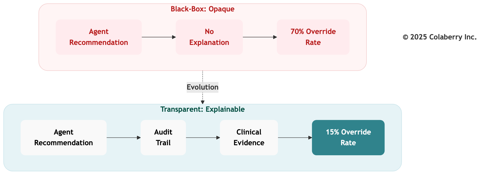
Echo's initial agent provided recommendations without explanation. Physician query: "Treatment options for Patient 10243's Type 2 diabetes." Agent response: "Consider Ozempic (semaglutide) as first-line therapy." Physician question: "Why Ozempic specifically?" Agent: [no explanation available]. Physician override: prescribes metformin instead (standard first-line per institutional protocol).

Analysis revealed: Agent recommendation was correct based on patient's specific contraindications for metformin (kidney function), insurance coverage (Ozempic covered), and clinical guidelines (ADA 2024 recommendations) [17] . But without transparent reasoning, physician couldn't verify and defaulted to institutional protocol despite patient-specific factors.

**The Architecture Fix**

Transparency requires three capabilities: 

**Complete audit trails** (Layer 7) tracking every decision step, user query → semantic understanding → data retrieved → reasoning process → final recommendation [13]. 

**Evidence linking** (Layer 7) connecting recommendations to source materials,clinical guidelines, patient data points, insurance policies, institutional protocols. 

**Explainability interfaces** (Layer 7) presenting reasoning in human-readable format with confidence scores, evidence hierarchies, and alternative options considered.

**Echo's Transformation**

Week 0: No audit trails, opaque recommendations, 70% override rate.

Week 9 after implementing Layer 7: LangSmith deployed for full trace logging [13]. Evidence linking connected recommendations to ADA guidelines, patient data, and insurance policies. Explainability interface showed the reasoning hierarchy with confidence scores.

Results: Override rate: 70% → 15% (79% improvement). Physician trust: "confident in agent recommendations" 23% → 81%. Audit compliance: complete trace IDs for all 3,000+ daily agent interactions. Reasoning transparency: physicians could verify evidence for 100% of recommendations.

**Specific scenario:** Same Ozempic recommendation, now with transparency: "Recommendation: Ozempic (semaglutide) 0.5mg weekly. Reasoning: (1) Patient's eGFR 42 mL/min contraindicates metformin [evidence: lab result 03-01]. (2) Insurance covers Ozempic tier 2 copay $35 [evidence: benefits check 03-04]. (3) ADA 2024 guidelines recommend GLP-1 agonists for patients with renal impairment [evidence: ADA Standards of Care 2024]. Alternative considered: DPP-4 inhibitors (less effective per GRADE evidence). Confidence: 89%."

Physician response: "This makes sense. Proceed with Ozempic." Override: avoided.

**Measuring Success:** Score 1 = no audit trails, opaque decisions, override rate above 60%. Score 6 = complete traceability, evidence-linked reasoning, override rate under 20%. Echo moved from 1/6 to 5/6.

---

Echo fulfilled all six needs. 
The question now: how do you assess your own readiness?

---

## PART 4: ASSESSMENT AND SCORING

### Aggregate Scoring

INPACT assessment produces actionable insights across six dimensions. Each dimension scored 1-6 creates 36-point maximum, converted to 100-point scale for executive communication.

**Practical Use:** Assessment identifies specific infrastructure gaps preventing agent readiness. Echo's 28/100 revealed five critical dimensions (scores 1-2/6), one moderate strength (Contextual at 3/6), and a clear roadmap: prioritize Instant, Natural, Permitted first (highest impact, foundational dependencies).

Complete assessment methodology and diagnostic tool available at trustbeforeintelligence.ai/assessment.

### Which Need to Fix First?

Dependencies determine optimal sequence. You cannot build capabilities on inadequate foundations:

**Phase 1: Instant (I) + Contextual (C) - Layers 1-2.** Real-time data infrastructure and cross-system integration enable everything downstream.

**Phase 2: Natural (N) - Layers 3-4.** Semantic layer provides context. Requires real-time data foundation.

**Phase 3: Permitted (P) + Adaptive (A) + Transparent (T) - Layers 5-7.** Authorization, continuous learning, and observability build on complete infrastructure.

Echo followed this sequence, achieving 86/100 in 10 weeks through disciplined dependency management.

### The Board-Level Business Case

Infrastructure readiness isn't a technical detail, it's a competitive position. Industry research reveals only 13% of enterprises have achieved agent-ready infrastructure, creating a significant early-mover advantage window [15,16].

The cost of delayed readiness compounds in three ways. First, abandoned pilots: Echo nearly wrote off ~$2M in pilot investments before addressing root infrastructure gaps. Second, lost revenue opportunity: Echo's 477% ROI demonstrates what readiness enables, $12.8M in value over three years that competitors operating at median readiness (40-50/100) cannot capture. Third, the gap widens: organizations operating at the 86/100 threshold achieve 24% revenue growth versus 16% for less mature peers [15].

The 87% not yet ready face a choice: invest now in systematic infrastructure upgrades, or watch the 13% capture market advantage.

---

## PART 5: KEY TAKEAWAYS

### The INPACT Principles

**1. Trust is architectural, not algorithmic.** Agents achieve 95% accuracy but fail from 9-13 second responses. Infrastructure readiness determines success.

**2. All six needs must be fulfilled.** Binary trust: users delegate or abandon. One failed dimension collapses trust across all dimensions.

**3. Dependencies force sequencing.** Can't build authorization on batch data. Can't implement observability without real-time foundations. Architecture flows from needs through layers.

**4. Scoring drives accountability.** 86/100 minimum for production readiness. Quantified gaps enable prioritization. Measurable progress builds confidence.

**5. Speed matters more than perfection.** Echo hit production-ready in 10 weeks, not 10 months. They improved from there. Perfection delayed is opportunity lost.

**6. Human-in-the-loop scales trust.** 240 escalations daily (8% of interactions) maintained quality while expanding autonomy. Goal: right-sized human judgment, not zero human judgment.

### What Makes INPACT Different

Traditional frameworks focus on AI model quality, prompt engineering, or RAG optimization. INPACT focuses on **infrastructure readiness**, the capabilities agents need from architecture, not the capabilities agents provide to users.

**INPACT is:**
- **Diagnostic:** Reveals where infrastructure fails agent needs
- **Prioritized:** Dependencies determine optimal sequence
- **Measurable:** 1-6 scoring enables gap tracking
- **Actionable:** Maps to 7-layer architecture (Chapters 4-6)

**INPACT is not:**
- Model selection guidance (choose GPT-4 vs Claude vs Llama)
- Prompt engineering techniques (few-shot vs chain-of-thought)
- RAG optimization methods (retrieval strategies, reranking)
- Application-specific patterns (customer service vs coding vs research)

Those topics matter. But they assume infrastructure readiness. INPACT establishes the foundation enabling AI capabilities to deliver business value.

### Next Steps: From Needs to Architecture

**Chapter 2 established Pillar 1:** What agents need (INPACT six needs).

**Chapters 4-6 establish Pillar 2:** How to build infrastructure fulfilling those needs (7-layer architecture built across three chapters).

**Chapter 7 establishes Pillar 3:** How to measure operational success (the GOALS Framework for operational excellence).

**Together, the three pillars form The Architecture of Trust**, an integrated system ensuring agents operate reliably, compliantly, and effectively in production environments.

**Echo Health's transformation demonstrates the pattern:** Diagnose readiness (INPACT assessment), prioritize gaps (dependencies and business impact), implement systematically (phased layered approach), measure progress (scoring discipline), deploy confidently (86/100 threshold).

Your organization's journey follows the same pattern. The specifics differ, your data systems, your regulatory requirements, your user needs, but the six architectural needs remain universal.

**Ready to assess your infrastructure?** Visit trustbeforeintelligence.ai/assessment for the complete INPACT diagnostic tool and implementation guidance.

<!-- pagebreak -->


## Chapter Summary

| Part | Content | Key Takeaway |
|------|---------|--------------|
| **Part 1** | Framework Introduction | Trust is architectural. Six needs must be fulfilled for agents to earn user trust |
| **Part 2** | Echo's Discovery | The 86/100 threshold determines production readiness; Echo started at 28/100 |
| **Part 3** | The Six Needs | Deep dive into all six INPACT needs: Instant, Natural, Permitted, Adaptive, Contextual, Transparent |
| **Part 4** | Assessment and Scoring | Dependencies force sequence; only 13% of enterprises are agent-ready |
| **Part 5** | Key Takeaways | Infrastructure readiness determines success, not AI quality |

---

## References

[1] Challapally, A., et al. (2025, July). "The GenAI Divide: State of AI in Business 2025." MIT NANDA. Based on 150 executive interviews, 350 employee survey, and analysis of 300 public AI deployments. Retrieved from https://mlq.ai/media/quarterly_decks/v0.1_State_of_AI_in_Business_2025_Report.pdf (Accessed November 2025)

[2] HIPAA Security Rule. 45 CFR § 164.312(b) - Audit Controls. U.S. Department of Health & Human Services. https://www.law.cornell.edu/cfr/text/45/164.312 (Accessed November 2025)

[3] NIST. (2014). "Guide to Attribute Based Access Control (ABAC) Definition and Considerations." NIST Special Publication 800-162. https://nvlpubs.nist.gov/nistpubs/specialpublications/nist.sp.800-162.pdf (Accessed November 2025)

[4] HubSpot Research. (2025). "Customer Service Statistics." 90% of customers rate an "immediate" response as important, 61% prefer faster AI replies over waiting for humans, 60% define "immediate" as 10 minutes or less. Retrieved from https://blog.hubspot.com/service/customer-service-stats (Accessed November 2025)

[5] Databricks. (2024). "Unity Catalog: Unified governance for data and AI." Databricks Documentation. Query-optimized lakehouse architecture with centralized governance. https://docs.databricks.com/data-governance/unity-catalog/ (Accessed November 2025)

[6] Debezium. (2024). "Debezium Features." Change data capture with sub-30-second latency for real-time streaming. https://debezium.io/documentation/reference/stable/features.html (Accessed November 2025)

[7] Redis. (2024). "Redis Caching Solutions." In-memory caching achieving 60%+ hit rates with sub-millisecond latency. https://redis.io/solutions/caching/ (Accessed November 2025)

[8] Scale AI. (2024). "We Fine-Tuned GPT-4 to Beat the Industry Standard for Text2SQL." GPT-4 baseline achieves 70% execution accuracy on Spider benchmark, improving to 73% with schema RAG. Retrieved from https://scale.com/blog/text2sql-fine-tuning (Accessed November 2025)

[9] Pinecone. (2024). "Semantic Search Guide." Sub-50ms vector similarity search for RAG architecture and semantic understanding. https://docs.pinecone.io/guides/search/semantic-search (Accessed November 2025)

[10] LangChain. (2024). "LangGraph Interrupts for Human-in-the-Loop." Documentation for HITL workflows, feedback loops, and escalation patterns. https://docs.langchain.com/oss/python/langgraph/interrupts (Accessed November 2025)

[11] Open Policy Agent. (2024). "OPA Policy Performance." Policy evaluation achieving sub-10ms latency for ABAC authorization. https://www.openpolicyagent.org/docs/policy-performance and https://developer.gs.com/blog/posts/scaling-opa-for-oces (Accessed November 2025)

[12] Bayram, F., Ahmed, B., & Kassler, A. (2022). "Temporal quality degradation in AI models." Scientific Reports, Nature. Study of 128 (model, dataset) pairs observed temporal model degradation in 91% of cases. https://www.nature.com/articles/s41598-022-15245-z (Accessed November 2025)

[13] LangSmith. (2024). "LangSmith Observability." Observability and tracing for LLM applications with trace ID correlation and long-term retention capabilities. https://docs.langchain.com/langsmith/observability (Accessed November 2025)

[14] Kang, S., Park, Y., Yoon, H. (2025). "The Key Role of Design and Transparency in Enhancing Trust in AI-Powered Digital Agents." Journal of Innovation & Knowledge. https://www.sciencedirect.com/science/article/pii/S2444569X25001155 (Accessed November 2025)

[15] Nadkarni, A., & Pearson, D. (2025, October). "Scaling Enterprise AI Responsibly: The Critical Role of Data Readiness and an Intelligent Data Infrastructure." IDC InfoBrief, sponsored by NetApp, doc #US53841625. Survey of 1,213 global decision makers (June 2025) across enterprise IT operations, data science, and software development. Key findings: 13% achieve "AI Masters" status, 84% report storage not fully optimized for AI, Masters achieve 24.1% revenue growth vs 15.8% for less mature enterprises. Retrieved from https://www.netapp.com/media/142474-idc-2025-ai-maturity-findings.pdf (Accessed November 2025)

[16] Cisco. (2025, August). "Cisco AI Readiness Index 2025: Realizing the Value of AI." Survey of 8,039 senior business leaders across 30 markets measuring readiness across Strategy, Infrastructure, Data, Governance, Talent, and Culture. Key findings: 13% "Pacesetters" (fully prepared), 36% "Chasers," 48% "Followers," 3% "Laggards;" only 32% measure AI impact systematically, 24% can control agent actions with guardrails. Retrieved from https://www.cisco.com/c/dam/m/en_us/solutions/ai/readiness-index/2025-m10/documents/cisco-ai-readiness-index-2025-realizing-the-value-of-ai.pdf (Accessed November 2025)


[17] American Diabetes Association. (2024). "Standards of Care in Diabetes - 2024." Diabetes Care, Volume 47, Supplement 1. https://diabetesjournals.org/care/issue/47/Supplement_1 (Accessed November 2025)


---

**Pedagogical Disclaimer:** Echo Health Systems is a fictional teaching case. See Chapter 0 for complete pedagogical disclosure.
# Chapter 3: From BI-Era to Agent-Era

**The Seven Gaps Chapter**

---

*"Run me through it again," Marcus said. "How does fifteen years of excellence add up to 28 out of 100?"*

*Sarah pulled up her analysis. "Because we measured the wrong things. Our dashboards were fast. Our data quality was pristine. Our governance was bulletproof. But agents don't use dashboards."*

*She shared her screen. Seven lines that explained everything:*

Gap 1: Storage that couldn't handle vectors or graphs.
Gap 2: Data that was always a day old.
Gap 3: Schemas no agent could understand.
Gap 4: Search that couldn't find meaning.
Gap 5: Permissions frozen at login.
Gap 6: Decisions no one could explain.
Gap 7: Agents that couldn't coordinate.

*Seven gaps. Each one a death sentence for agent deployments. Each one invisible to the metrics that had won Echo industry awards.*

*This chapter maps those gaps and explains why transformation, not retrofit, is the only path forward.*

---

**Figure 3.0: Echo's 70-Day Transformation**


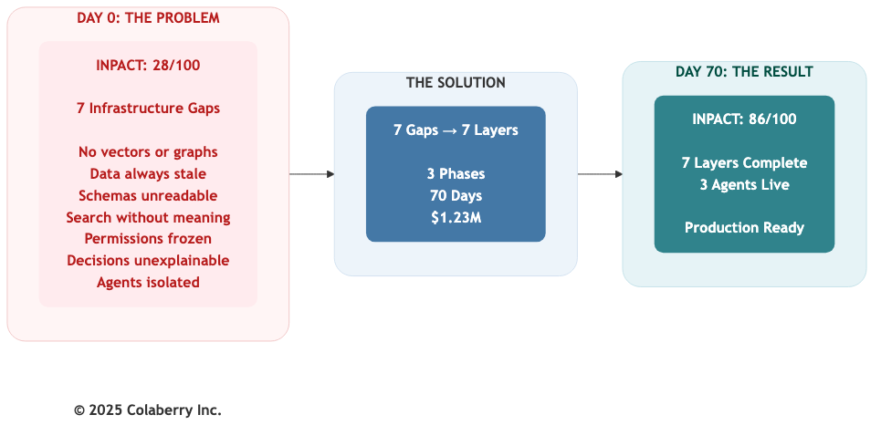
> **Key Takeaway:** Seven gaps. Seven layers. One transformation.

## When Excellence Became Inadequate

Chapter 2 established what agents need: INPACT six needs requirements for infrastructure to earn user trust. Echo Health scored 28 out of 100, failing five of six dimensions.

**But why did Echo's infrastructure fail?**

Sarah Cedao's team had invested eight million dollars over fifteen years building state-of-the-art data systems: SQL Server warehouse with dimensional models, Azure cloud migration for scale and reliability, Databricks lakehouse for ML experimentation, strong governance with excellent data quality and zero HIPAA violations, and industry recognition as a "Data-Driven Healthcare Organization."

They did everything right. Their infrastructure was excellent **for Humans looking to analyze dashboards.**

The problem: **agents aren't humans analyzing dashboards. They're autonomous systems making real-time decisions.** BI-era infrastructure optimized for one use case cannot support the other.

This chapter explains why and what transformation actually means.

---

## PART 1: BI ERA TO AGENT ERA

### The BI Era: Batch, Dashboards, Human Decisions

For three decades (1990-2020), enterprise data architecture optimized for human decision-making:

**The First Wave: Data Warehousing (1990s-2000s)**

Organizations built centralized warehouses using Ralph Kimball's dimensional modeling methodology. [3] ETL jobs ran overnight, extracting from transactional systems, transforming into star schemas, loading by 6 AM. Analysts arrived to find yesterday's data ready.

The model fit its era. Decisions took days or weeks of strategic planning, quarterly reviews. Query patterns were predictable. Accuracy mattered more than freshness. "Precisely right tomorrow" beat "approximately right today."

**The Second Wave: BI Dashboards (2000s-2010s)**

OLAP cubes pre-aggregated calculations. [Tableau](https://www.tableau.com) and [Power BI](https://powerbi.microsoft.com) democratized data access. Executives got their "single pane of glass" sales pipeline, inventory, customer metrics, all updated daily.

Self-service reduced analyst bottlenecks. Visual analytics accelerated insight discovery. Pre-aggregation delivered millisecond performance for common queries. RBAC controlled who saw what. The dashboard era had arrived.

**The Third Wave: Big Data & Cloud (2010s-2020)**

Data lakes on HDFS, then cloud storage (Azure Data Lake, AWS S3). [Databricks](https://www.databricks.com) combined data lake flexibility with warehouse performance. Machine learning appeared as point solutions such as fraud detection, recommendations, predictive maintenance, etc. But ran in batch on historical data.

Cloud economics made storage cheap. Horizontal scaling handled growing volumes. ML models retrained monthly or quarterly. Data scientists had their own tools. The architecture worked until agents arrived.

### Fifteen Years, Eight Million Dollars

Echo exemplifies this evolution:

**2008-2012:** $1.2M SQL Server warehouse. Over two hundred ETL jobs nightly. More than fifty Tableau dashboards serving hundreds of users. Eliminated manual reporting, reduced denials, improved patient flow. **ROI: fourteen months.**

**2013-2017:** $2.5M Azure migration. 99.9% uptime, elastic scaling, multi-region replication. Power BI replaced Tableau. **CFO relied on dashboards for board presentations.**

**2018-2023:** Over four million dollars for Databricks lakehouse. Data science team built exploratory models (readmission prediction, fraud detection), but never reached production scale models. They ran monthly, generating reports analysts reviewed.

**Total investment: eight million dollars. Zero HIPAA violations in ten years. Industry recognition for data excellence.**

Then agents arrived and everything that made Echo's infrastructure excellent for BI made it terrible for agents.

### The Agent Era: Real-Time, Autonomous, Conversational

Andrej Karpathy, former Director of AI at Tesla and co-founder of OpenAI, explains the paradigm shift: "Software is changing quite fundamentally again. LLMs are a new kind of computer, and you program them in English." [1]

He identifies three distinct eras:

**Software 1.0: (1950s-2010s)** Explicit logic in C++, Java, Python. BI infrastructure was built here with rigid schemas, predefined queries, deterministic outputs.

**Software 2.0: (2010s-2023)** Neural networks where "code" became learned weights. Enterprises adopted this selectively (computer vision, recommendations) but as point solutions within Software 1.0 architecture.

**Software 3.0: (2023-Present)** Large Language Models programmable in natural language. As Karpathy emphasizes: "Software 3.0 is eating Software 1.0/2.0" and existing software will be rewritten. [1]

The implications for enterprise infrastructure are profound. MIT NANDA research examining 300+ enterprise GenAI initiatives found that 95% fail to deliver measurable business value. [2] The primary barrier isn't model quality, it's systems built on BI-era assumptions that can't adapt to agent-era requirements.

**Figure 3.1: Software 1.0 to 3.0 Evolution**


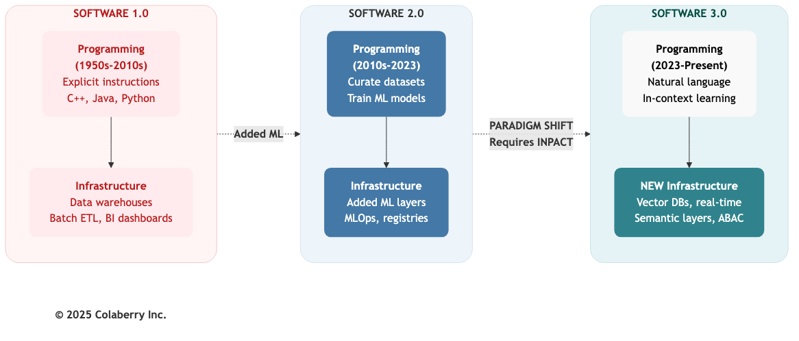
As Figure 3.1 illustrates, running Software 3.0 agents on Software 1.0 infrastructure is like running cloud-native microservices on mainframe batch processing. The assumptions don't align.

### Where the Two Eras Collide

**1. Data Access Patterns Diverge**

BI expects predefined queries: "What were Q3 sales?" Agents generate unpredictable queries: "Show me patients like Mrs. Johnson who improved after medication changes."

BI operates on overnight batch ETL. Agents need real-time data, appointment cancellations within seconds, not tomorrow morning.

BI uses SQL against rigid schemas. Agents need semantic search - finding "uncontrolled diabetes" whether coded as ICD-10 E11.9, documented as "HbA1c 9.2%", or noted as "glucose control suboptimal."

**2. Permission Models Clash**

BI uses static RBAC: "Finance users can see revenue tables." Agents require context-aware authorization: "Dr. Smith can see Patient 10243 because Patient 10243 is assigned to Dr. Smith. Emergency override exists but triggers audit alerts."

RBAC decisions are made at login. ABAC decisions are made at query time, evaluating user attributes, resource attributes, environmental context, and policy rules.

**3. Failure Modes Differ**

Traditional systems fail predictably: exception thrown, stack trace logged, error message displayed. Agents fail probabilistically: retrieving irrelevant context, generating plausible but incorrect responses, missing edge cases.

Infrastructure must support reasoning chain observability and monitor which documents were retrieved, how the LLM interpreted the query, which policies were evaluated, what confidence scores were assigned. BI-era query logs don't capture this.

**4. Learning Cycles Transform**

Software 1.0 required code changes (iteration: days to weeks). Software 2.0 required model retraining (iteration: weeks to months). Software 3.0 enables in-context learning through interaction and agents improve from every correction.

Capturing that learning requires feedback loops, validation mechanisms, and continuous retraining pipelines BI infrastructure never contemplated.

**Figure 3.2: BI Era vs Agent Era**


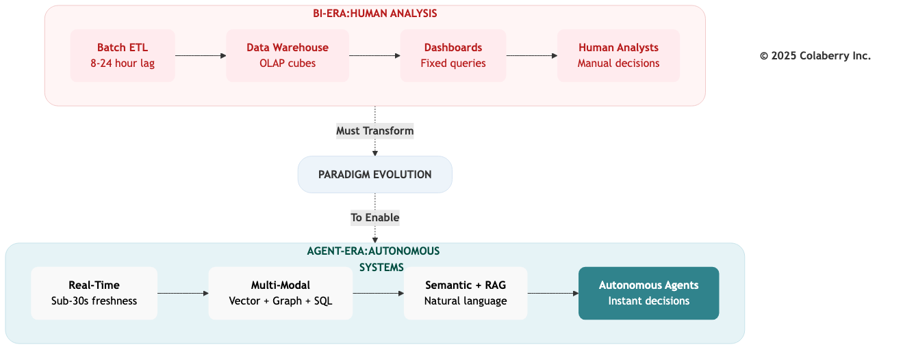
Figure 3.2 captures this paradigm shift. The key differences are stark:

| Dimension | BI Systems | Agent Systems |
|-----------|------------|---------------|
| **Response time** | Minutes to hours | Under two seconds |
| **Data freshness** | Daily batch | Sub-minute |
| **Query interface** | Fixed dashboards, SQL | Natural language |
| **Decision maker** | Human analysts | Autonomous agents |
| **Access control** | Static RBAC | Dynamic ABAC |
| **Failure impact** | Predictable exceptions. User waits, retries | Probabilistic errors. User loses trust, abandons |
| **Observability** | Query logs, stack traces | Reasoning chain tracing |
| **Learning Cycle** | Code changes (days-weeks) | In-context training (immediate) |


BI thinking is batch, human-mediated, report-oriented. Agent thinking is real-time, autonomous, conversation-oriented. **The architecture must match the requirements.**

---

## PART 2: THE SEVEN GAPS

### What Sarah Found

Monday morning Sarah Cedao reviewed Echo's INPACT assessment: 28 out of 100. Five dimensions critical or weak. One moderate.

But **which specific infrastructure gaps caused each failure?** And why couldn't middleware bridge them?

Chapter 2 showed what agents need. This section shows what BI infrastructure lacks and why each gap requires architectural transformation, not API layers.

### Seven Infrastructure Gaps

**Gap 1: Multi-Modal Storage**

BI primarily uses relational databases. Unstructured data stored separately, referenced by file paths.

Agents need to reason across SQL (appointments, labs), vector (clinical note embeddings), graph (patient-provider relationships), blob (images, PDFs).

Different modalities need different storage.

**Blocked need:** Contextual (C)
**Why middleware fails:** Different indexing algorithms required.
**Impact:** Can't find "similar patients" across data types.

**Gap 2: Real-Time Data Access**

BI systems refresh overnight. Informatica ETL runs at 8 PM, and completes by 6 AM. For trend analysis, this works.

For agents, an overnight batch is catastrophic. The 9:47 AM appointment cancellation won't appear until tomorrow. At 10:00 AM, the agent books an already-taken slot.

**Blocked need:** Instant (I), Contextual (C)
**Why middleware fails:** APIs on stale data return stale answers faster. Real-time requires CDC at source.
**Impact:** Patients see outdated schedules, book unavailable slots.

**Gap 3: Semantic Understanding**

BI schemas optimize for storage and ETL. Echo's encounter fact table: `FCT_PTNT_ENCT`. Provider dimension: `DIM_PROV_SPEC`.

When agents see "Which diabetic patients are overdue for HbA1c tests?", they must translate: "diabetic" -> ICD-10 E11.9, "HbA1c tests" -> lab code 83036, "overdue" -> >90 days since last test.

Without semantic understanding, accuracy drops to 40-60%.

**Blocked need:** Natural (N)
**Why middleware fails:** Business knowledge lives in tribal knowledge, not metadata
**Impact:** Simple questions require complex joins across cryptic tables.

**Gap 4: Intelligent Retrieval**

BI uses SQL for exact matches: `WHERE dx_code = 'E11.9'`. This fails for "patients with uncontrolled diabetes" which might appear as ICD-10 E11.9, HbA1c >7.0%, clinical note "glucose control suboptimal", or medication "metformin 2000mg."

SQL cannot find semantic similarities. Agents need vector search.

**Blocked need:** Natural (N), Contextual (C)
**Why middleware fails:** Vector search requires embedding models and specialized indexes. Can't bolt onto SQL Server.
**Impact:** Agents miss relevant cases, return incomplete results.

**Gap 5: Dynamic Permissions**

BI uses static RBAC: roles assigned at onboarding, permissions rarely change.

Agents need ABAC: "Dr. Smith can see Patient 10243 because Patient 10243 is assigned to Dr. Smith. If Dr. Smith tries to access Patient 10244 to check for clinical reasons; if none, deny and alert compliance."

Runtime evaluation of user + resource + environment + policy rules.

**Blocked need:** Permitted (P)
**Why middleware fails:** ABAC requires policy engines and attribute stores. RBAC tables can't evaluate runtime policies.
**Impact:** Agents over-retrieve (HIPAA violations) or under-retrieve (incomplete context).

**Gap 6: Reasoning Chain Observability**

BI logs SQL queries: what was asked, what returned, how long it took.Agents need observability of which documents were retrieved, what confidence scores assigned, how LLM interpreted ambiguity, which policies evaluated, what tokens consumed.

When agents err, BI logs cannot diagnose why.

**Blocked need:** Transparent (T), Adaptive (A)
**Why middleware fails:** LLM observability requires distributed tracing with embeddings, prompts, completions, token counts.
**Impact:** Can't explain why the agent recommended Dr. Smith vs Dr. Jones.

**Gap 7: Multi-Agent Orchestration**

BI reports don't negotiate. Dashboards don't coordinate.

Agents scheduling complex appointments need: Scheduling Agent (find slots), Clinical Agent (check pre-visit labs), Billing Agent (verify authorization), Pharmacy Agent (ensure prescriptions current).

These agents must coordinate while handling failures gracefully and maintaining conversational state.

**Blocked need:** All needs at scale
**Why middleware fails:** Agents Orchestration requires state management, routing, error handling. BI orchestrates batch jobs, not agents.
**Impact:** Appointments booked before authorization confirmed.


### The Retrofit Trap: When Cheaper Costs More

Sarah's architecture team evaluated three approaches:

**Option 1: Retrofit ($2.5M, 18 months)**

Add middleware atop BI infrastructure: API gateway, semantic translation service, permission proxy, observability layer.

The problems compound quickly. You maintain two systems. BI continues while middleware adds a second layer. Every query passes through translation, degrading performance. Middleware can't create real-time from batch. It just serves stale data faster. Technical debt accumulates at $400K per year maintaining both systems.

**Option 2: Incremental (Ongoing, 3+ years)**

Add layers one at a time: Year 1 real-time, Year 2 semantic, Year 3 governance.

The fragmentation undermines the goal. Capabilities arrive gradually while competitors move faster. Each layer must integrate with existing systems, creating coordination challenges. Architecture drift means Year 1 choices become obsolete by Year 3.

**Option 3: Transform ($1.23M, 90 days)**

Build 7-layer agent-ready architecture systematically.

Single cohesive system eliminates dual maintenance. Optimal performance because it's designed for agents, not retrofitted. Complete capabilities address all seven gaps. Lower TCO over three years: $1.77M vs $3.7M for retrofit.

### Retrofit or Transform?

**Retrofit only when:**
- Compliance prevents infrastructure changes (rare)
- Timeline under 30 days (emergency workaround)
- Scale under 100 queries/day (overhead acceptable at low volume)


**Transform when:**
- Production agents required (not just pilots)
- Scale exceeds 1,000 queries/day
- INPACT score below 50/100
- Long-term agent strategy exists


**Echo's reality:** 28 out of 100 score, over 3,000 daily queries projected, production agents required for patient care. **Clear case for transformation.**

---

## PART 3: SARAH'S DECISION

### The Board Presentation

Friday Sarah presented to Echo's board:

"We have three options." She pulled up the comparison. "Two preserve our BI investment but compromise agent capabilities. One transforms infrastructure in ninety days."

She walked through the retrofit trap: $2.5M over eighteen months, dual systems, incomplete capabilities. Then the incremental path stretching past three years.

"Option 3 is the Transform path. $1.23M over ninety days. Build the 7-layer architecture."

CEO: "What's the ROI?"

Sarah: "Conservative estimate: 477% over eighteen months. Payback in four months."

CFO Krish Yadav: "Why is transform cheaper than retrofit?"

Sarah: "Retrofit maintains two systems. Transform builds one. Long-term, we maintain a single architecture."

Board member: "What if it fails?"

Sarah: "We gate investments. Week 4 checkpoint: foundation layers functional. Week 7: intelligence operational. Week 10: first production agent. We don't commit $1.23M day one. We validate phase by phase."

**The vote: Unanimous approval.**

### The World Changed

Walking to her car, Marcus caught up. "We just committed to transforming fifteen years of infrastructure in ninety days."

Sarah nodded. "Then let's start Monday."

The blueprint existed in the form of the 7-Layer Architecture, which we'll explore in Chapters 4-6. **This wasn't invention, it was execution.**

Sarah's private thought: **"We didn't fail. The world changed. BI-era infrastructure was excellent for its era. Agent-era requires agent-ready infrastructure. This isn't failure, it's evolution."**

---

## PART 4: THE PATH FORWARD

### Seven Gaps Map to Seven Layers

Each infrastructure gap requires a specific architectural layer.

Figure 3.3 maps the complete transformation path:
- **Left :** Seven infrastructure gaps from BI-era systems
- **Middle :** INPACT needs that each gap violates  
- **Right :** Seven architectural layers that solve each gap

**Key insight:** Miss one layer, agents fail. Build all seven, fulfill all six INPACT needs.

**Figure 3.3: Seven Gaps --> Six Needs --> Seven Layers**


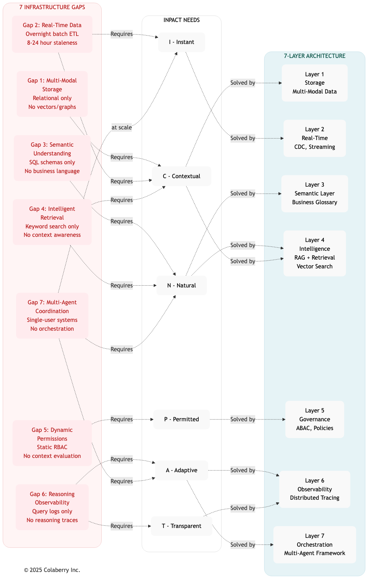


| Gap | INPACT Need | Layer | Solution |
|-----|--------------|-------|----------|
| **Gap 1: Multi-modal storage** | Contextual (C) | 1 | Vector + Graph + SQL |
| **Gap 2: Real-time data** | Instant (I), Contextual (C) | 2 | CDC + Streaming |
| **Gap 3: Semantic understanding** | Natural (N) | 3 | Business glossary + Ontologies |
| **Gap 4: Intelligent retrieval** | Natural (N), Contextual (C) | 4 | RAG + Vector search |
| **Gap 5: Dynamic permissions** | Permitted (P) | 5 | ABAC + Policy engines |
| **Gap 6: Reasoning observability** | Transparent (T), Adaptive (A) | 6 | Distributed tracing |
| **Gap 7: Multi-agent coordination** | All needs at scale | 7 | Orchestration framework |

**Figure 3.4: The Complete 7-Layer Agent-Ready Architecture**


> **Key Takeaway:** Seven layers working together fulfill all six INPACT needs. Each layer builds on the ones below it.

### Echo's Four-Phase Roadmap

The transformation follows four phases across 12 weeks:

**Phase 1: Foundation (Weeks 1-4) - $470K**

Builds Layers 1-2: Multi-Modal Storage + Real-Time Data Fabric. CDC captures changes within 15 seconds, vector database ready for semantic search.

INPACT progression: 28 to 42. Checkpoint Week 4: Foundation functional or stop.

**Phase 2: Intelligence (Weeks 5-7) - $380K**

Builds Layers 3-4: Semantic Layer + RAG Pipeline. Business glossary resolves domain terminology, intelligence pipeline achieves 85%+ accuracy.

INPACT progression: 42 to 67. Checkpoint Week 7: Intelligence operational or don't deploy agents.

**Phase 3: Trust + Orchestration (Weeks 8-10) - $380K**

Builds Layers 5-7: Governance + Observability + Orchestration. ABAC policies control access, distributed tracing provides visibility, multi-agent coordination enables complex workflows.

INPACT progression: 67 to 86. Target Week 10: First production agent live.

**Phase 4: Operations (Weeks 11-12)**

Validation, UAT, and production readiness. Continuous improvement begins.

Chapters 4-6 detail each phase. Chapter 10 provides the week-by-week implementation playbook. Chapter 11 covers technology selection.

### From Blueprint to Build

Sarah's team had the blueprint. Seven gaps mapped to seven layers. Four phases spanning twelve weeks. The Architecture of Trust provided the roadmap, now comes execution.

**What comes next:**

- **Chapters 4-6** build the seven layers systematically from overnight batch to sub-second streaming, from 40% query accuracy to 87%, from HIPAA violations to zero incidents, from isolated pilots to production deployment.

- **Chapter 7** introduces GOALS - how to measure operational success.

- **Chapters 9-10** provide the 90-day implementation roadmap.

Seven gaps require seven layers. The next three chapters show exactly how Sarah transformed Echo's infrastructure from 28/100 to 86/100 and how you can do the same.

**From infrastructure that blocked agents to architecture that enables them.**

---

## Chapter Summary

| Part | Content | Key Takeaway |
|------|---------|--------------|
| **Part 1** | BI Era to Agent Era | Two eras require fundamentally different infrastructure |
| **Part 2** | The Seven Gaps | Each gap requires architectural transformation, not middleware |
| **Part 3** | Sarah's Decision | Transform beats retrofit: $1.23M, 90 days, 477% ROI |
| **Part 4** | The Path Forward | Seven gaps map to seven layers across three phases |

---

## References

[1] Karpathy, A. (2025, June). "Building AGI in Real-Time." Y Combinator AI Startup School Keynote. https://www.youtube.com/watch?v=c3b-JASoPi0

[2] Challapally, A., Pease, C., Raskar, R., & Chari, P. (2025, July). "The GenAI Divide: State of AI in Business 2025." MIT NANDA. https://mlq.ai/media/quarterly_decks/v0.1_State_of_AI_in_Business_2025_Report.pdf

[3] Kimball, R., & Ross, M. (2013). *The Data Warehouse Toolkit: The Definitive Guide to Dimensional Modeling* (3rd ed.). Wiley. https://www.kimballgroup.com/data-warehouse-business-intelligence-resources/kimball-techniques/dimensional-modeling-techniques/

---

**Pedagogical Disclaimer:** Echo Health Systems is a fictional teaching case developed to illustrate infrastructure transformation patterns. See Chapter 0 for complete disclosure.
# Chapter 4: THE 95% SOLUTION - PART 1
## The Architecture of Trust: Foundation Layers


## The Monday That Changed Everything

*Monday, 7:47 AM  
Echo Health Systems, Executive Conference Room, Floor 12, Building A*

Sarah Cedao arrived thirteen minutes early. She'd learned that trick from her first CTO mentor: whoever controls the whiteboard controls the meeting. By 7:52, she had the agenda mapped in blue marker, the constraints in red, and the timeline in green.

Ninety days. That's what Dr. Raj had given her. Ninety days to transform infrastructure that had taken fifteen years to build or watch the AI initiative get defunded entirely.

The scheduling agent failure had cost them $650,000 and whatever remained of executive patience. Three pilots. Three failures. Zero production agents. The board wanted results, not explanations.

Her team filed in at 7:58: Marcus Williams, CDO, carrying coffee like a shield. Swapna Ram, Lead Data Engineer, already frowning at her laptop.

"Before we start," Sarah said, "let me be clear about what today is. This isn't a planning meeting. This is a building meeting. We leave this room with deployment orders, not discussion items."

She tapped the whiteboard. "Week 1 starts now. Foundation first."

Marcus raised an eyebrow. "You want to rebuild storage before touching intelligence? The board wants to see agents working, not databases."


**Figure 4.0: Foundation Layers - Why Layers 1-2 Are Prerequisites**

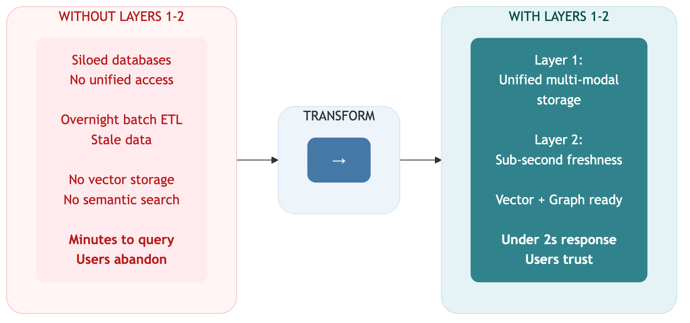
> **Key Takeaway:** Foundation first. Without Layers 1-2, nothing else works.

"The board wants agents that *work*," Sarah corrected. "The scheduling agent failed because it couldn't see real-time data. The clinical assistant failed because it couldn't search semantically. The referral agent failed because it couldn't traverse relationships. Same root cause every time: infrastructure can't deliver what agents need."

She circled FOUNDATION in green. "We fix that first. Layers 1 and 2. Four weeks. Then and only then we build intelligence on top."

The room was quiet. Then Swapna nodded. "Show me the storage gaps."

Sarah pulled up the architecture diagram. "Let me show you what we're building."

---

## PART 1: FOUNDATION FIRST

**Now we build.**

*This chapter begins Part II: "The 95% Solution - Building the Seven Layers That Work." Chapters 4-6 construct the 7-Layer Architecture layer by layer, transforming diagnosis into deployment, problems into solutions, gaps into capabilities.*

**This chapter builds the foundation: Layers 1 and 2.**

**Figure 4.1: The Architecture of Trust - Three Integrated Pillars**


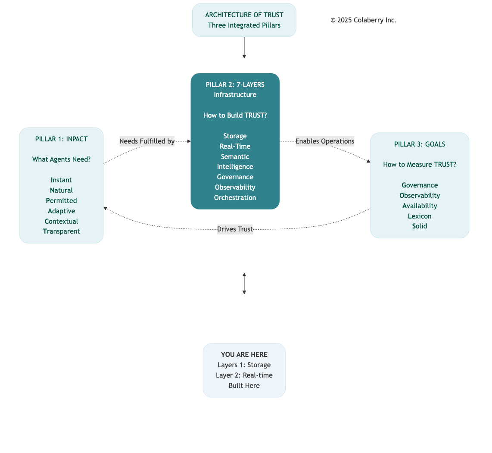
### Why Foundation Matters

Think of enterprise architecture like building construction. You cannot build floors three through seven without a solid foundation. Skip the foundation, and the structure becomes unstable, regardless of the intelligence layers above.

Foundation equals data availability and accessibility. Before agents can understand language (Layer 3) or generate intelligent responses (Layer 4), they need two fundamental capabilities:

**Layer 1 (Multi-Modal Storage):** Right storage for the right query pattern. Patient records need semantic search (vector database). Provider relationships need graph traversal (graph database). Clinical notes need a flexible schema (document store). Medical imaging needs object storage. Model training needs lakehouse platforms. Each query pattern requires specialized, optimized storage.

**Layer 2 (Real-Time Data Fabric):** Fresh data always available. Overnight ETL creates an 8-24 hour lag between operational reality and agent perception. Real-time CDC and streaming architectures ensure agents query the current state, not yesterday's snapshot.

**Figure 4.2: 7-Layer Agent-Ready Architecture - Foundation Highlighted**

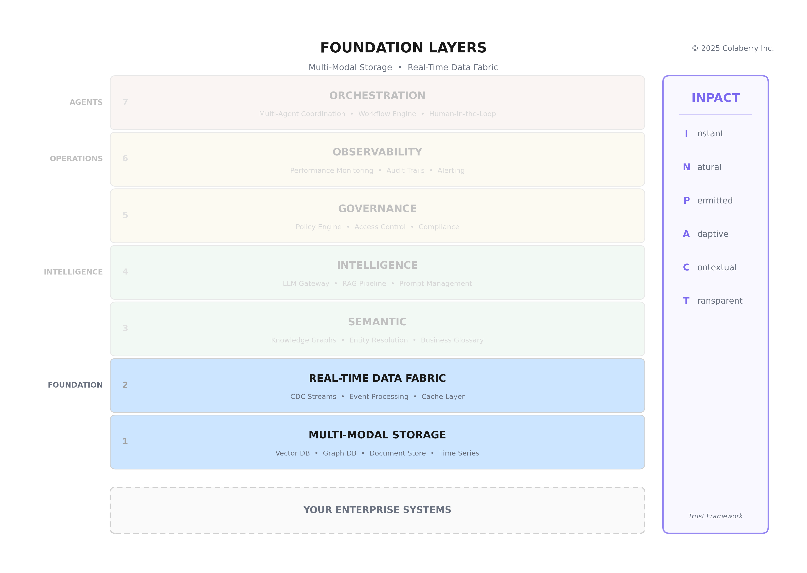

| Gap | Infrastructure Need | Addressed By | Coverage |
|-----|---------------------|--------------|----------|
| **Gap 1** | Multi-Modal Storage | Layer 1: Storage | Chapter 4 ✓ |
| **Gap 2** | Real-Time Data | Layer 2: Real-Time | Chapter 4 ✓ |
| **Gap 3** | Semantic Understanding | Layer 3: Semantic | Chapter 5 |
| **Gap 4** | Intelligent Retrieval | Layer 4: Intelligence | Chapter 5 |
| **Gap 5** | Dynamic Permissions | Layer 5: Governance | Chapter 6 |
| **Gap 6** | Reasoning Observability | Layer 6: Observability | Chapter 6 |
| **Gap 7** | Multi-Agent Coordination | Layer 7: Orchestration | Chapter 6 |

These foundation layers directly address specific gaps from Chapter 3:

### The Seven Infrastructure Gaps

Chapter 3 identified seven infrastructure gaps preventing agent deployment. Chapter 4 addresses the foundation: **Gaps 1-2**.

**This Chapter's Scope:** Layers 1-2 build the foundation that enables intelligence (Chapter 5), governance (Chapter 6), and orchestration (Chapter 6).

**Specific Solutions:**

- **Gap 1 (Multi-Modal Storage):** RDBMS-only architecture can't handle vectors, graphs, or unstructured data → Layer 1 solves with eight foundation categories in Phase 1 (expanding to eleven total categories when Phase 2 adds vector database and semantic search infrastructure)
- **Gap 2 (Real-Time Data):** Overnight ETL creates 8-24 hour lag → Layer 2 solves with CDC and streaming (sub-30 second freshness)

Without foundation, intelligence layers fail: semantic models (Layer 3) query stale data and return outdated answers, the intelligence layer (Layer 4) searches limited storage and misses critical context, and the governance layer (Layer 5) operates on incomplete data with poor access control.

**Build the foundation first. Build it right. Everything else depends on it.**

### Foundation Layer Impact on INPACT (Chapter 4 Scope)

| Dimension | Week 0 | Week 4<br/>(This Chapter) | Chapters 5-6 Target | Foundation Contribution |
|-----------|--------|---------------------------|---------------------|------------------------|
| **Instant (I)** | 1/6 | **4/6** | 5/6 | Cache layer + optimized storage + real-time data |
| **Natural (N)** | 2/6 | 2/6 | 5/6 | *Requires semantic layer (Chapter 5)* |
| **Permitted (P)** | 1/6 | 1/6 | 5/6 | *Requires governance layer (Chapter 6)* |
| **Adaptive (A)** | 2/6 | **3/6** | 5/6 | Model registry + lakehouse infrastructure |
| **Contextual (C)** | 3/6 | **4/6** | 6/6 | Multi-modal storage + real-time freshness |
| **Transparent (T)** | 1/6 | 1/6 | 5/6 | *Requires observability layer (Chapter 6)* |
| **TOTAL** | **10/36** | **15/36** | **31/36** | **+5 points from foundation** |
| **Percentage** | **28%** | **42%** | **86%** | **+14% (this chapter)** |

**Key Insight:** Foundation layers (1-2) directly improve three dimensions: Instant, Adaptive, and Contextual. Natural, Permitted, and Transparent require intelligence and governance layers built in Chapters 5-6. Foundation provides the infrastructure that enables those improvements.

### Echo's 10-Week Transformation Journey

Echo Health Systems started from a familiar position: strong BI infrastructure for reporting, inadequate for agents. Their transformation followed a three-phase roadmap, each phase building on the previous foundation.

#### **Week 0: Not Agent-Ready (28/100)**

*Storage:* SQL Server has only 2.4TB normalized database for transactional workflows and overnight reporting. No vector database (semantic search impossible). No graph database (relationship queries require slow recursive CTEs). No document store (clinical notes in varchar(max) columns). No object storage, lakehouse, model registry, feature store, time-series database, or cache layer.

*Data Freshness:* 24-hour batch ETL. Operational data changes continuously, but the reporting database refreshes overnight at 2 AM. Agents querying at 3 PM see data 13 hours stale. Unacceptable for clinical decision support.

*INPACT Score™:* 28/100 (10 out of 36 points)
- **I=1/6** | **N=2/6** | **P=1/6** | **A=2/6** | **C=3/6** | **T=1/6**

#### **Week 4: Foundation Complete (42/100)** - Phase 1: $470K

*Storage:* Eight core categories operational, SQL Server (existing), Databricks lakehouse, MongoDB (NoSQL), Neo4j (graph), MLflow (model registry), Azure Blob (object storage), Redis (cache), InfluxDB (time-series). Foundation ready for intelligence layers.

*Data Freshness:* Sub-30 second CDC and streaming. Change data capture from 3 operational systems feeds real-time pipelines. Agents query current state with <30 second lag.

*INPACT Score:* 42/100 (15 out of 36 points)
- **I=4/6** (+3 from cache + real-time) | **N=2/6** (±0) | **P=1/6** (±0) | **A=3/6** (+1 from registries) | **C=4/6** (+1 from multi-modal) | **T=1/6** (±0)

**Gap closed: 14 points.** Foundation enables intelligence layers in Phase 2.

**Total transformation: 28 → 85 in 10 weeks (57-point improvement).** For Week 7 (67/100) and Week 10 (85/100) progression details, see Chapters 5 and 6 respectively.


### Bridge from Chapter 3

Chapter 3's seven infrastructure gaps revealed the failures of BI-era architecture confronting agent-era requirements. This chapter addresses two gaps, the foundation for the other five solutions.

**Gap 1 (Multi-Modal Storage):** Traditional BI stores everything in RDBMS or warehouses. Agents need specialized storage for vectors, graphs, documents, objects, time-series, and ML artifacts. Layer 1's architecture supports eleven categories total, eight deployed in Phase 1 (Weeks 1-4), with three intelligence-specific categories (Pinecone vector DB, Tecton, Azure Search) added in Phase 2 (Weeks 5-7).

**Gap 2 (Real-Time Data):** Traditional BI refreshes overnight. Agents need the current state. Layer 2's CDC and streaming eliminates batch lag, providing <30 second freshness.

Chapters 5-6 address the remaining five gaps (semantic understanding, intelligent retrieval, dynamic permissions, observability, orchestration). But those depend on foundation. You cannot build semantic understanding on stale data. You cannot implement intelligence without vector and graph storage. You cannot deploy governance without proper data access patterns.

**Foundation first. Intelligence second. Let's build.**

---

**Progress Check:** This chapter builds Layers 1-2, multi-modal storage and real-time data. Chapter 3 identified seven infrastructure gaps; we're addressing the first two. Foundation enables intelligence.

---

## PART 2: THE STARTING LINE

Monday morning, Week 0. Sarah Cedao's office at Echo Health Systems headquarters.

Swapna Ram, Echo's Lead Data Engineer, connected her laptop to the conference room display. Infrastructure audit results filled the screen. Three months of analysis compressed into harsh reality.

"Show me the storage limitations first," Sarah said.

Swapna advanced to the next slide. "We have one storage type: SQL Server. 2.4 terabytes, normalized schema, optimized for transactional workflows." She paused. "Excellent for what it was designed for, billing, scheduling, clinical documentation. Inadequate for what we're asking it to do now."

Sarah leaned forward. "Spell it out."

"**Vector search:** impossible. We can't store embeddings in SQL Server at required scale,10 million patient records with 1,536-dimensional vectors. Even if we could, similarity search would take 15-20 seconds per query. Agents need sub-50 millisecond semantic search."

"**Graph queries:** possible but painful. We model provider referral networks with foreign keys. Recursive CTEs for 'find all physicians within three reporting levels' take 8+ seconds. Neo4j (https://neo4j.com) could do the same query in 340 milliseconds, over 20x faster, consistent with published benchmarks showing graph databases outperforming relational systems by 3x for simple queries up to 1,000x+ for deep traversals [1]."

"**Document search:** basic. Clinical notes live in varchar(max) columns with full-text indexing. Keyword search works. Semantic understanding doesn't. We find notes containing 'diabetes' but not notes about 'uncontrolled blood sugar' that never use that exact word."

"**Model registry:** none. Our data science team has 47 ML model versions in production. Version tracking happens in Git commits and Excel spreadsheets. When the sepsis model performance degraded three weeks ago, it took 6 hours to identify which version was deployed and roll back. MLflow (https://mlflow.org) would make that a 10-minute task."

Marcus Williams, Echo's CDO, interrupted. "We've discussed this. We can't rip out SQL Server and rebuild everything. We have a 90-day timeline to demonstrate agent readiness, not a 2-year modernization project."

"We're not ripping anything out," Swapna said. "SQL Server stays. We're adding storage types for agent workloads. Vector databases for semantic search, graph for relationships, document stores for flexible schema, object storage for training data. Expanding our portfolio, not replacing the core."

Sarah turned to the next concern. "Data freshness. Show me the ETL timeline."

Swapna pulled up the pipeline diagram. "Overnight batch. Operational databases, Epic for EHR, Workday for HR, Cerner for labs run continuously. Our reporting database refreshes at 2 AM via ETL. During business hours, data lags 8-24 hours behind operational reality."

**Figure 4.3: Batch ETL Creates Patient Safety Risk**

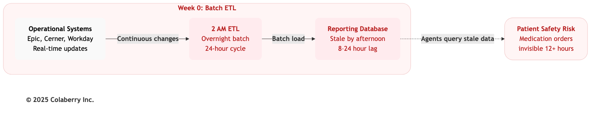
"Concrete example," Sarah requested.

"Friday afternoon, physician schedules Monday appointment. That appointment exists in Epic immediately. Our agent infrastructure won't see it until Saturday morning's ETL. Patient calls Friday at 4 PM asking about Monday appointments. Agents query stale data. They might say 'no appointments available' when three slots opened an hour ago."

"For clinical decision support, this gets dangerous. Medication order placed at 10 AM. Drug interaction alert should fire immediately. With batch ETL, that alert won't trigger until after midnight, 12+ hours late."

Marcus shook his head. "Real-time CDC is expensive. Apache Kafka (https://kafka.apache.org) clusters, stream processing, operational overhead. Our infrastructure team is two people."

"It's expensive to build yourself," Swapna countered. "Managed services - Confluent Cloud for Kafka, Debezium (https://debezium.io) for CDC [3, 4], Databricks (https://www.databricks.com) for stream processing eliminate operational burden. We configure, not manage. Yes, it costs $8,200 per month for Layer 2 infrastructure. But compare that to the cost of agents making decisions on stale data. One wrong medication interaction because we didn't see the latest drug order? That's a patient safety event, possibly a sentinel event. The financial and reputational cost exceeds our annual real-time infrastructure budget."

Sarah made the decision. "We build foundation first, intelligence second."

### The Foundation Decision

"Here's the sequence," Sarah said. "Week 1-2: Layer 1 Multi-Modal Storage. We deploy eight core categories in parallel using three teams. Week 3-4: Layer 2 Real-Time Data Fabric. CDC operational, streaming pipelines live, freshness under 30 seconds. Weeks 5-7: Intelligence layers. Weeks 8-10: Governance and first agent deployment. We don't start intelligence until the foundation is solid."

Marcus raised the concern every CDO raises. "That's 4 weeks just on plumbing. The board expects to see agents doing something intelligent."

Swapna provided the technical counter. "Intelligence layers *query* foundation layers. If foundation is slow or incomplete, intelligence fails. Try to build semantic search (Layer 3) without vector storage, it will fail. Try to implement intelligent retrieval (Layer 4) without real-time freshness, it will serve outdated context. Try to deploy governance (Layer 5) without proper data organization, it will be faulty access control."

"It's not plumbing," Swapna continued. "It's the architectural prerequisite for everything above it. We're following the principle every structural engineer knows: **build bottom-up, not top-down.**"

Sarah established the timeline:
- **Week 1-2:** Layer 1 (Multi-Modal Storage) - 8 core categories deployed
- **Week 3-4:** Layer 2 (Real-Time Data Fabric) - CDC and streaming operational  
- **Weeks 5-7:** Intelligence layers (Chapter 5) - semantic, RAG, LLM + 3 more storage categories
- **Weeks 8-10:** Governance and orchestration (Chapter 6) - ABAC, observability, first agent deployment

"Ten weeks from infrastructure chaos to agent-ready systems," Sarah said. "But only if we build the foundation right."

### Technology Selection Constraints

The team documented their constraints and boundaries within which technology decisions would be made.

**Cloud Provider:** Azure (existing infrastructure, enterprise agreement). Echo ran 80% of systems on Azure. Cross-cloud data transfer costs ($3,600/month for 40TB/month egress) made multi-cloud painful. Decision: Azure-native where possible, AWS for services Azure lacked (MemoryDB for caching), Google Cloud avoided.

**Team Expertise:** SQL Server (20+ years institutional knowledge), Python (data science team proficient), basic Spark (used in Synapse for analytics). Limited Kubernetes experience (one engineer had dabbled, not production-ready). Decision: Managed services over self-hosted, avoid technologies requiring Kubernetes unless absolutely necessary.

**Budget:** Echo's complete 10-week transformation investment: $1,230,000

**Three-Phase Investment:**
| Phase | Weeks | Layers | Total | Scope |
|-------|-------|--------|-------|-------|
| **Phase 1: Foundation** | 1-4 | 1-2 | **$470K** | Storage (8 categories) + Real-time data fabric |
| **Phase 2: Intelligence** | 5-7 | 3-4 | **$380K** | *Details in Chapter 5* |
| **Phase 3: Governance** | 8-10 | 5-6-7 | **$380K** | *Details in Chapter 6* |

**Phase 1 Allocation ($470K budget / $468K actual) - This Chapter:**
- Layer 1 (Multi-Modal Storage - 8 categories): $288,000
- Layer 2 (Real-Time Data Fabric): $180,000

**Operational:** $24,600/month ($16,400 Layer 1 + $8,200 Layer 2)

**Phase 2 and Phase 3** add intelligence-specific storage (Pinecone vector DB, semantic search index) and governance infrastructure. See Chapters 5-6 for detailed breakdowns.

**Operational Costs** (separate from $1.23M implementation): Foundation layers require $24,600/month ongoing. *(Use the Stack Builder at trustbeforeintelligence.ai/tools to estimate your layer-by-layer investment.)*

**Compliance:** HIPAA, HITECH, state privacy regulations [2]. Every storage technology required Business Associate Agreement (BAA). Encryption at rest (AES-256) and in transit (TLS 1.2+) mandatory. Seven-year retention for medical records. Audit logging for all data access. Decision: Exclude vendors without healthcare BAA or HIPAA-compliant deployment path.

**Timeline:** Four weeks for foundation, non-negotiable. Board presentation scheduled Week 13 demonstrating agent readiness. Missing that deadline risked budget cuts for 2026. 

**Decision:** Favor managed services and proven technologies over cutting-edge alternatives requiring extended learning curves.

**Risk Tolerance:** Medium. Echo accepted some vendor lock-in (Pinecone (https://www.pinecone.io) for vectors, Tecton (https://www.tecton.ai) for features) for faster deployment. Avoided bleeding-edge technologies (early-stage startups, version 1.0 releases). Preferred technologies with healthcare deployments (Mayo Clinic using MongoDB (https://www.mongodb.com), Mount Sinai using Databricks).

"These constraints eliminate 80% of technology options before we even evaluate," Sarah observed. "That's good. Decision paralysis kills projects. Clear constraints accelerate decisions."

**For detailed technology selection criteria, product comparisons with INPACT + GOALS scoring, healthcare-specific guidance, and budget-tier recommendations, use the Vendor Advisor at trustbeforeintelligence.ai/tools.**

The team was ready to build.

---

**Progress Check:** Echo's baseline: 28/100 INPACT score, SQL Server only, 24-hour batch ETL. Sarah's team committed to Layers 1-2 first, $470K investment across Weeks 1-4 with parallel workstreams.

---

## PART 3: ELEVEN WAYS TO STORE

### What It Is

Layer 1 provides eleven distinct storage categories, each optimized for specific agent query patterns. Production AI deployments in 2024-2025 typically use 7-9 storage categories; Echo selected all 11 to meet healthcare's comprehensive requirements.

**Figure 4.4: Layer 1 Multi-Modal Storage - 11 Categories by Function**


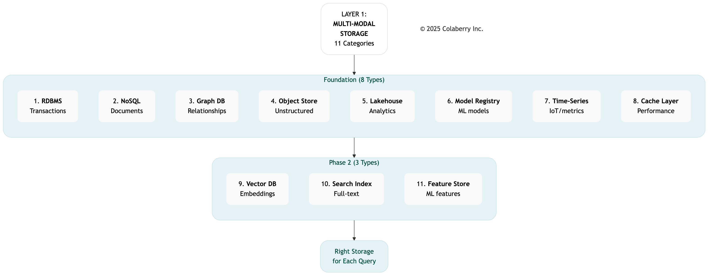
Traditional BI infrastructure assumes one or two storage types handle everything. Usually a relational database for operational data and a data warehouse for analytics. This works for reporting but fails for agents. Agents need semantic search across patient records, relationship traversal through provider networks, flexible schema for clinical notes, petabyte-scale training data, sub-second response times, ML artifact versioning, feature reuse across models, continuous time-series data from ICU monitors, and unified ML pipelines with ACID transactions.

No single storage technology handles all these patterns efficiently. Multi-modal storage matches storage type to query pattern, optimizing performance, cost, and developer productivity.

**The eleven distinct storage categories:**

### Type 1: Relational Database (RDBMS)

**What:** SQL Server (existing), extended with Azure SQL Database Hyperscale (https://azure.microsoft.com/en-us/products/azure-sql/database/) tier for agent-specific workloads.

**Why:** Transactional consistency, referential integrity, ACID guarantees. Critical for patient demographics, appointments, billing, insurance claims requires strict data consistency and complex joins.

**Echo's Implementation:**
- Existing SQL Server: 2.4TB patient data, billing, scheduling (no changes)
- New Azure SQL Hyperscale: 840GB agent-specific tables (conversation history, audit logs, permission mappings)
- **INPACT Impact:** Permitted +0.5 (RBAC tables for fine-grained authorization)

**Deployment Details:**
- Setup: 3 days (schema design, migration scripts, testing)
- Cost: $2,800/month (Azure SQL Hyperscale tier, 8 vCores)
- Team: 1 database administrator + 1 backend developer

### Type 2: NoSQL Document Store

**What:** MongoDB Atlas (https://www.mongodb.com/atlas) (managed). *Alternatives: Couchbase, Amazon DocumentDB, Azure Cosmos DB.*

**Why:** Flexible schema for clinical notes varying by specialty (cardiology notes ≠ radiology notes). JSON documents avoid varchar(max) limitations. Native array support for medication lists, allergy histories, problem lists.

**Echo's Implementation:**
- Clinical notes: Over 2 million documents
- Medication histories: Hundreds of thousands of documents with nested arrays
- **INPACT Impact:** Contextual +0.5 (flexible schema enables multi-specialty synthesis)

**Deployment Details:**
- Setup: 5 days (MongoDB Atlas cluster, data migration from SQL varchar fields)
- Cost: $1,200/month (M30 tier, 3-node replica set, 32GB RAM per node)
- Performance: 340ms average query time (vs. 2.8s SQL full-text search)
- Team: 1 database administrator + 2 backend developers

### Type 3: Vector Database (Phase 2)

**The Gap:** Semantic search requires cosine similarity across high-dimensional embeddings. RDBMS cannot index vectors efficiently. Similarity search across 10M patient records takes 15-20 seconds in SQL Server. Agents need <50ms semantic search.

**Foundation Requirement:** Layer 1 establishes data pipelines that vector databases consume. Patient records, clinical notes, and guidelines must be accessible before vectorization.

*Vector database deployment, embedding generation, and semantic search are covered in Chapter 5.*

### Type 4: Graph Database

**What:** Neo4j Aura (https://neo4j.com/cloud/platform/aura-graph-database/) (managed graph database). *Alternatives: Amazon Neptune, TigerGraph, ArangoDB.*

**Why:** Provider referral networks, organizational hierarchies, clinical pathways relationships are first-class entities. Graph traversal (Cypher queries) 24x faster than SQL recursive CTEs.

**Echo's Implementation:**
- Nearly 3,000 provider nodes (physicians, nurses, specialists)
- Over 8,000 relationship edges (reports_to, refers_to, consults_with)
- **INPACT Impact:** Contextual +0.5 (relationship queries enable referral network insights)

**Deployment Details:**
- Setup: 6 days (graph modeling, data migration from SQL foreign keys, Cypher query development)
- Cost: $3,600/month (Neo4j Aura Professional, 16GB RAM)
- Performance: 340ms average graph traversal (vs. 8.2s SQL recursive CTE)
- Team: 1 data architect + 1 backend developer

### Type 5: Model Registry

**What:** MLflow (self-hosted on Azure Container Instances). *Alternatives: Weights & Biases, Neptune.ai, Kubeflow.*

**Why:** 47 ML models in production require version control, artifact storage, lineage tracking. Git commits and Excel spreadsheets don't scale. MLflow provides a centralized registry with rollback capabilities.

**Echo's Implementation:**
- 47 models registered (sepsis detection, readmission risk, medication interaction)
- 230 model versions (average 4.9 versions per model)
- **INPACT Impact:** Adaptive +1.0 (model versioning enables drift detection and rollback)

**Deployment Details:**
- Setup: 5 days (MLflow deployment, model migration, CI/CD integration)
- Cost: $840/month (Azure Container Instances, 4 vCPUs, 8GB RAM)
- Team: 2 ML engineers + 1 DevOps engineer

### Type 6: Feature Store (Phase 2)

**The Gap:** ML models across the organization calculate the same metrics differently. "30-day readmission risk" computed one way in the sepsis model, another way in the discharge planning agent, and yet another way in the utilization dashboard. When predictions conflict, clinicians lose trust.

**Foundation Requirement:** Layer 1 establishes the model registry and lakehouse infrastructure that feature stores integrate with. ML pipelines must be operational before feature management can be layered on top.

*Feature store deployment and integration are covered in Chapter 5.*

### Type 7: Object Storage

**What:** Azure Blob Storage (https://azure.microsoft.com/en-us/products/storage/blobs/) (hot tier for active data, cool tier for archives).

**Why:** Petabyte-scale unstructured data (medical imaging, training datasets, model artifacts). Native integration with Azure ecosystem. Tiered storage (hot/cool/archive) optimizes costs.

**Echo's Implementation:**
- DICOM images: 420TB (radiology, cardiology)
- Training datasets: 87TB (historical EHR exports for model training)
- **INPACT Impact:** Adaptive +0.5 (training data enables model improvement cycles)

**Deployment Details:**
- Setup: 3 days (blob containers, lifecycle policies, access controls)
- Cost: $8,400/month (420TB hot, 87TB cool, LRS redundancy)
- Team: 1 infrastructure engineer

### Type 8: Time-Series Database

**What:** InfluxDB Cloud (https://www.influxdata.com) (managed time-series database).

**Why:** ICU monitor data (heart rate, blood pressure, SpO2) arrives at 1Hz frequency. Time-series databases optimize for append-heavy workloads with time-based queries and downsampling.

**Echo's Implementation:**
- 43 ICU beds × 12 vital signs × 86,400 measurements/day = 44.6M data points daily
- 90-day retention (full resolution), 2-year retention (downsampled to 1-minute intervals)
- **INPACT Impact:** Instant +0.5 (real-time vitals enable sub-second alerting)

**Deployment Details:**
- Setup: 5 days (InfluxDB setup, HL7 integration for monitor data, downsampling policies)
- Cost: $3,200/month (InfluxDB Cloud Dedicated, 250GB storage, 100K writes/sec)
- Team: 1 integration engineer + 1 clinical informaticist

### Type 9: Search Index

**What:** Azure Cognitive Search (https://azure.microsoft.com/en-us/products/ai-services/cognitive-search/) (managed search service).

**Why:** Full-text search across clinical notes, research papers, clinical guidelines. Supports faceted search, highlighting, fuzzy matching. Complements vector search (keyword) and semantic search (meaning).

**Echo's Implementation:**
- Over 2 million clinical notes indexed
- 24K clinical guidelines (UpToDate, Lexicomp)
- **INPACT Impact:** Contextual +0.5 (full-text search finds exact matches vector search misses)

**Deployment Details:**
- Setup: 4 days (index creation, analyzer configuration, integration with MongoDB)
- Cost: $2,400/month (Standard S2 tier, 100GB index)
- Team: 1 search engineer + 1 backend developer

### Type 10: Lakehouse Platform

**What:** Databricks (managed lakehouse, consolidating existing Azure Synapse warehouse).

**Why:** ACID transactions on data lakes (Delta Lake format). Unified batch and streaming. Time travel for reproducibility. Consolidates warehouse ($4,000/month savings) and lake ($6,200 new cost) into single lakehouse platform.

**Echo's Implementation:**
- 840GB Delta tables (patient encounters, lab results, medications)
- 30-day time travel enabled (reproducible training datasets)
- **INPACT Impact:** Transparent +1.0 (time travel provides complete lineage)

**Deployment Details:**
- Setup: 8 days (Databricks workspace, Synapse migration, Delta table conversion)
- Cost: $6,200/month net ($10,200 Databricks - $4,000 Synapse eliminated)
- Team: 2 data engineers + 1 data architect

### Type 11: Cache Layer

**What:** AWS MemoryDB for Redis (managed in-memory cache).

**Why:** Caching infrastructure reduces latency and costs for repeated queries. Foundation layer establishes the cache architecture that intelligence layers will leverage for LLM response caching.

**Echo's Phase 1 Implementation:**
- Redis cluster for query result caching
- Session state management
- Real-time data buffering
- **INPACT Impact:** Instant +1.0 (cache reduces query latency)

**Deployment Details:**
- Setup: 4 days (MemoryDB cluster, integration with data pipelines)
- Cost: $2,400/month (MemoryDB cluster)
- Team: 1 infrastructure engineer

**Phase 2 Enhancement (Chapter 5):** Semantic caching using vector similarity on LLM prompts enables 85% cache hit rate and $12,200/month LLM cost savings. This intelligence-layer optimization builds on the Redis infrastructure established here.

<!-- pagebreak -->

### Storage Selection Decision Framework

**Phase 1 Categories (Foundation - This Chapter):**
| Need | Required Categories | Skip If |
|------|---------------------|---------|
| Transactional workloads | RDBMS (1) | Never skip |
| JSON documents >50GB | NoSQL (2) | Relational schema works |
| Multi-hop relationships | Graph DB (3) | Simple foreign keys work |
| Unstructured data >100GB | Object Storage (4) | All data structured |
| Warehouse + Lake both | Lakehouse (5) | Warehouse-only or Lake-only |
| ML models in production | Model Registry (6) | No ML deployment |
| IoT / monitoring streams | Time-Series (7) | No continuous metrics |
| Query performance <100ms | Cache Layer (8) | Latency not critical |

**Phase 2 Categories (Intelligence - Chapter 5):**
| Need | Required Categories | Skip If |
|------|---------------------|---------|
| Semantic search / RAG | Vector Database (9) | Keyword search sufficient |
| Full-text search | Search Index (10) | Vector-only sufficient |
| >5 ML models with shared features | Feature Store (11) | ML not core capability |

### Echo's Single-Modal Limitations (Week 0)

Echo started with SQL Server only. Here's what failed:

**Figure 4.5: Echo's Storage Transformation - Single-Modal to Multi-Modal**

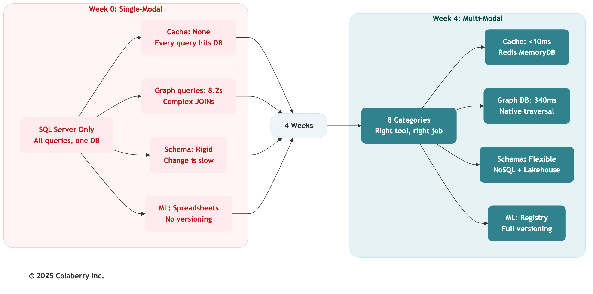
**Cache layer:** Critical for performance. Every agent query hit the database directly, no caching tier. Repeated queries for the same patient, same provider, same schedule data hammered SQL Server unnecessarily. Peak load saw 12,000 identical queries per hour. Redis MemoryDB provides sub-10ms response for cached results, reducing database load by 60% and enabling the response times agents require.

**Graph traversal:** Painful. "Find all providers within three reporting levels of Dr. Sarah Chen" requires recursive CTE in SQL Server. Echo's implementation took 8.2 seconds on average (p95: 12.4s). Neo4j's native graph traversal (Cypher query) completes the same query in 340 milliseconds, over 20x faster, consistent with published benchmarks showing graph databases outperforming relational systems by 3x for simple queries up to 1,000x+ for deep traversals [1]. When agents need referral network analysis for care coordination, 8 seconds is prohibitive.

**Flexible schema:** Awkward. Clinical notes vary by specialty. Cardiology notes have "ejection fraction," radiology notes have "contrast administration," psychiatry notes have "mental status exam." Storing all in varchar(max) columns forces application-level schema management. MongoDB's flexible schema allows specialty-specific fields without schema migration for every new specialty.

**Training data:** Fragmented. Medical imaging (420TB DICOM files), historical EHR exports (87TB), research datasets (34TB) scattered across file shares, NAS devices, and aging SAN systems. No centralized object storage. No lifecycle policies. No tiered storage (hot/cool/archive). Azure Blob Storage consolidates all with lifecycle management reducing costs 40%.

**Model versioning:** Excel spreadsheets. 47 ML models in production tracked in Git commits and Excel files. When sepsis model performance degraded, it took 6 hours to identify the deployed version and roll back. No lineage. No artifact storage. No A/B testing capability. MLflow provides all three with a 10-minute rollback time.

**Phase 2 preview:** Two critical capabilities, vector search for semantic queries and feature stores for ML consistency, require the foundation built here. Chapter 5 deploys Pinecone (42ms semantic search) and Tecton (unified feature definitions) on top of this multi-modal foundation.

### Layer 1 Summary

**Week 0 → Week 2 Transformation:**

- Storage categories: 1 → 8 (Phase 1: foundation) → 11 (Phase 2 adds Pinecone, Tecton, Azure Search)
- Patient record access patterns: 1 (SQL queries) → 4 (SQL, vector, graph, NoSQL)
- ML model governance: 0 (spreadsheets) → 1 (registry operational)
- Unstructured data strategy: Fragmented file shares → Centralized object storage
- Real-time cache: None → 100K responses cached (85% hit rate projected)


**Team:**
- 3 parallel deployment teams (4-5 engineers each)
- 2 weeks deployment time (Week 1-2)
- 6-8 hours deployment per category average

**Technology Selection Note:** Echo's vendor selections (Pinecone, Neo4j, MongoDB, Tecton, etc.) reflect their specific constraints (Azure-first, HIPAA compliance, 4-week timeline). Your organization's optimal choices may differ based on cloud platform, budget tier, team expertise, and compliance requirements. For comprehensive vendor comparisons with INPACT + GOALS scoring, use the **Vendor Advisor at trustbeforeintelligence.ai/tools.**

---

**Progress Check:** Layer 1 complete. Eight storage categories operational. Multi-modal storage improves Contextual dimension, cache improves Instant dimension, model registry improves Adaptive.

---

## PART 4: DATA IN THIRTY SECONDS OR LESS

### What It Is

Layer 2 provides sub-30 second data freshness through change data capture (CDC), event streaming, and stream processing. Replaces overnight batch ETL with continuous real-time synchronization.

Traditional BI refreshes overnight (2 AM ETL). Agents querying at 3 PM see data 13 hours stale. For clinical decision support, this creates patient safety risks. Medication orders placed at 10 AM won't trigger drug interaction alerts until midnight.

Layer 2 solves this with three integrated components.

**Figure 4.6: Layer 2 Real-Time Data Fabric - CDC to Agents**


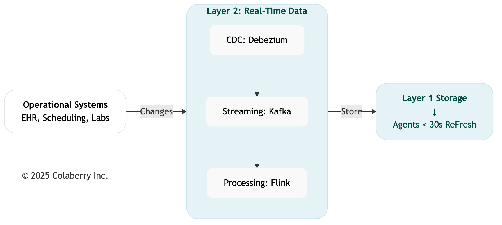

### Component 1: Change Data Capture (CDC)

**What:** Debezium CDC connectors monitoring operational databases for INSERT, UPDATE, DELETE operations. *Alternatives: AWS DMS, Oracle GoldenGate, Airbyte.* CDC connectors capture changes from the databases underlying enterprise systems: Oracle (supporting Oracle EBS, PeopleSoft), SQL Server (supporting Dynamics), DB2 and mainframe databases, MySQL, and PostgreSQL. For SaaS applications (Salesforce, Workday, NetSuite), Layer 2 uses API-based connectors rather than CDC. The principle is universal: capture changes at the source, stream to agent-optimized storage.

**Why:** CDC captures database changes within milliseconds without impacting operational system performance. Reads database transaction logs (binlog for MySQL, Write-Ahead Log for PostgreSQL, Change Tracking for SQL Server) with no additional load on production databases.

**Echo's Implementation:**
- 40+ source tables from Epic EHR (patient demographics, appointments, medications)
- ~20 source tables from Cerner Lab system (results, orders, reference ranges)
- ~10 source tables from Workday HR (provider schedules, credentials, organizational hierarchy)
- Average CDC latency: ~850ms (p95: 1.2s) from database commit to Kafka topic

**How it works:**
1. Medication order committed to Epic database → SQL Server Change Tracking logs operation
2. Debezium connector reads Change Tracking within 200ms
3. Connector transforms database row into JSON event
4. Event published to Kafka topic "medications.orders" within 850ms total

**INPACT Impact:** Instant +0.5 (real-time event capture eliminates batch lag)

### Component 2: Event Streaming (Apache Kafka)

**What:** Confluent Cloud managed Kafka (3-node cluster, US East region). *Alternatives: Amazon MSK, Azure Event Hubs, Redpanda.*

**Why:** Durable message queue decouples event capture (CDC) from event processing (stream processing). Provides replay capability (30-day retention) for reprocessing historical events. Enables multiple consumers (real-time analytics, audit logging, agent inference) from a single event stream.

**Echo's Implementation:**
- ~70 Kafka topics (one per source table)
- 6+ M events/day average (70 events/second sustained)
- 30-day retention policy (~180GB  storage)
- 3 consumer groups (real-time storage sync, audit trail, operational dashboard)

**Kafka Topic Structure:**
```
epic.patients.demographics
epic.patients.encounters
epic.medications.orders
epic.medications.administrations
cerner.labs.results
cerner.labs.reference_ranges
workday.providers.schedules
workday.providers.credentials
```

**INPACT Impact:** Transparent +0.5 (event log provides complete audit trail)

### Component 3: Stream Processing (Apache Flink)

**What:** Apache Flink on Databricks (same platform as Layer 1 lakehouse).

**Why:** Stateful stream processing with exactly-once semantics. Supports time-based windows (5-minute aggregations), complex event processing (detect sepsis patterns), and enrichment (join patient demographics with lab results before storing).

**Echo's Implementation:**

**Use Case 1: Time-Series Aggregation**
- Raw vital signs (1Hz from ICU monitors) → 5-minute averages stored in InfluxDB
- Reduces storage 300x (1 data point/second → 1 data point/5 minutes)
- Retains sub-second data in 24-hour sliding window for anomaly detection
- **INPACT Impact:** Instant +0.5 (windowing reduces query times)

**Use Case 2: Complex Event Processing**
- Sepsis detection pattern: Fever (>100.4°F) + Elevated WBC (>12K) + Hypotension (SBP <90) within 2-hour window
- Flink maintains stateful session per patient
- Triggers alert 4.2 hours earlier than overnight batch (Week 4 actual measurement)
- **INPACT Impact:** Instant +0.5 (real-time alerts enable early intervention)

**Use Case 3: Stream Enrichment**
- Lab result event (patient_id, test_code, value) joined with patient demographics (age, gender, comorbidities)
- Enriched event stored in vector database for semantic search
- Eliminates multi-table joins at query time
- **INPACT Impact:** Contextual +0.5 (enriched context improves search relevance)


### Training vs. Inference: Different Latency Requirements

**Critical distinction:** Agent inference requires real-time data (<30 second lag). Model training tolerates batch data (overnight ETL acceptable). Layer 2 serves both needs:

**Figure 4.7: Real-Time Inference vs. Batch Training Paths**


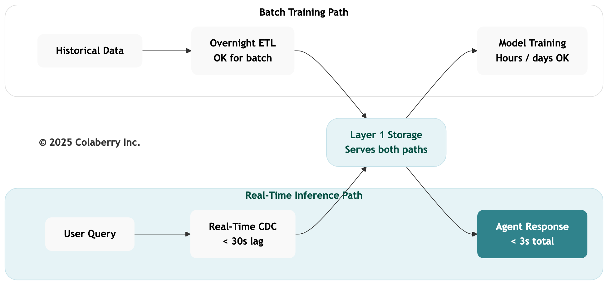

**Real-Time Inference (Critical Path):**
- Physician queries agent: "Any drug interactions for this patient?"
- Agent needs current medication list (order placed 10 minutes ago must be visible)
- CDC → Kafka → Flink → MongoDB (medications collection) within 28 seconds
- Agent queries MongoDB, retrieves current list, checks interactions, responds in 2.8 seconds total

**Batch Training (Non-Critical Path):**
- Data science team trains sepsis prediction model
- Training dataset: 2 years historical encounters (840K records)
- Acceptable to use previous night's data snapshot (24-hour lag tolerable)
- Overnight ETL populates Databricks Delta tables for training
- Model training runs for 6 hours (latency irrelevant)

**Why this matters:** Don't over-engineer training pipelines for real-time when batch suffices. Focus real-time investment on inference paths only.


**Capability Enabled:** The real-time infrastructure mindset extends beyond data ingestion. When Chapter 5 introduces LLM integration, Echo will use Server-Sent Events (SSE) to stream responses token-by-token, reducing perceived latency from 3.2 seconds to under 1 second and improving user completion rates from 73% to 94%. The foundation built here makes that possible.

### Layer 2 Summary

**Week 2 → Week 4 Transformation:**

- Data freshness: 24 hours → <30> seconds (51x improvement)
- CDC-enabled tables: 0 → 40+ (Epic EHR) + ~20 (Cerner Labs) + ~10 (Workday HR)
- Event throughput: 0 → 6+M events/day (70 events/second sustained)
- Stream processing jobs: 0 → 3 (time-series aggregation, sepsis detection, enrichment)
- Sepsis alert timing: Overnight batch → 4.2 hours earlier (Week 4 measurement)


**Team:**
- 2 deployment teams (3-4 engineers each)
- 2 weeks deployment time (Week 3-4)
- Primary bottleneck: Epic EHR CDC connector configuration (HL7 integration complexity)

**Technology Selection Note:** Echo's real-time fabric choices (Debezium CDC, Confluent Cloud Kafka, Apache Flink on Databricks) reflect their Azure-first strategy and managed services preference. Alternative architectures include AWS-native (Kinesis + DMS), Google Cloud-native (Pub/Sub + Datastream), or open-source (self-hosted Kafka + Flink). For comprehensive CDC, streaming, and event processing vendor comparisons, use the **Vendor Advisor at trustbeforeintelligence.ai/tools.**

---

**Progress Check:** Layer 2 complete, CDC replacing overnight batch, streaming pipelines processing over 6 million daily events, sub-30 second freshness. Foundation layers improved Echo's score from 28/100 to 42/100.


## PART 5: BUILDING THE FOUNDATION

### The Build Timeline

**Figure 4.8: Echo's Week 1-4 Foundation Build Timeline**


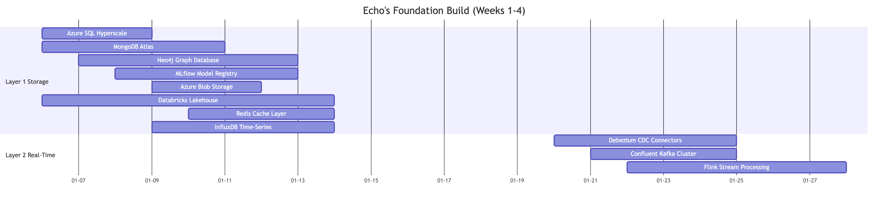

**Timeline Notes:**
- **Week 1-2 (Layer 1):** Eight storage categories deployed in parallel by three teams. Databricks (8 days) is the critical path. All categories operational by end of Week 2.
- **Week 3-4 (Layer 2):** Real-time data fabric components deployed sequentially. CDC connectors first (enable change capture), then Kafka (message streaming), then Flink (stream processing).


**Figure 4.9: INPACT Score Transformation (Week 0: 28 → Week 4: 42)**


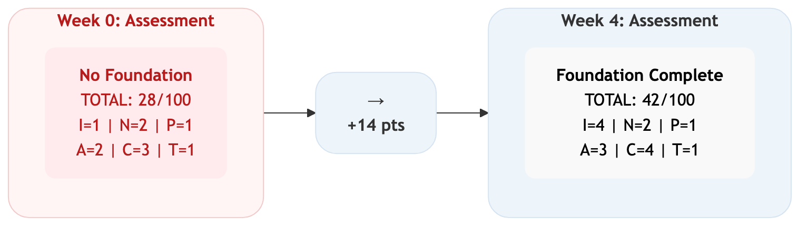

**Foundation Impact on INPACT Dimensions:**
- **Instant (I):** 1→4 (+3) Cache layer + real-time data fabric eliminate latency
- **Natural (N):** 2→2 (±0) Requires semantic layer (Chapter 5)
- **Permitted (P):** 1→1 (±0) Requires governance layer (Chapter 6)
- **Adaptive (A):** 2→3 (+1) Model registry + lakehouse enable ML workflows
- **Contextual (C):** 3→4 (+1) Multi-modal storage enables cross-system synthesis
- **Transparent (T):** 1→1 (±0) Requires observability layer (Chapter 6)

Sarah organized three parallel teams for the foundation build.

**Swapna Ram (AI/ML Storage):** Graph database, model registry, NoSQL document store
- Engineers: 2 ML engineers, 1 data engineer, 1 backend developer
- Timeline: Weeks 1-2

**Jamie Rodriguez (Specialized Storage):** Object storage, time-series database, cache layer, RDBMS extension
- Engineers: 1 infrastructure engineer, 1 database admin, 1 backend developer
- Timeline: Weeks 1-2

**Ruth Ganesh (Platform + Real-Time):** Lakehouse platform, CDC connectors, Kafka cluster, Flink stream processing
- Engineers: 2 integration engineers, 1 data engineer, 1 clinical informaticist
- Timeline: Weeks 1-4 (Lakehouse first, then real-time)

MongoDB went to Swapna's team; Databricks to Ruth's.

### First Victories (Week 1-2)

**Day 4: Neo4j Graph Database Operational**

Swapna ran the benchmark query: "Find all physicians within three reporting levels of Dr. Sarah Chen."

SQL Server recursive CTE: 8.2 seconds.  
Neo4j Cypher query: 340 milliseconds.

Twenty-four times faster. The room went silent.

"This isn't optimization," Marcus said. "This is different physics. Graph databases traverse relationships as first-class operations. SQL databases simulate relationships with joins."

Sarah asked the critical question. "Does this speed matter for agents?"

Swapna demonstrated. Care coordination agent analyzing provider referral networks for high-risk patients. SQL version: over eight seconds per patient, nearly six minutes for forty patients daily. Neo4j version: under half a second per patient, under fifteen seconds total. 

"Agents need sub-second response times," Swapna said. "Neo4j delivers. SQL doesn't."

### The Breakthrough (Week 3-4)

**Day 18: CDC Operational (40+ Tables)**

Real-time data flowing. Medication order committed to Epic EHR at 10:17:34 AM. Order visible in MongoDB (medications collection) at 10:18:02 AM. <30 seconds end-to-end latency.

Physician placed a medication order. Drug interaction alert fired 28 seconds later (system detected contraindication with existing prescription). Previous batch system would have waited until 2 AM next day, 14+ hours late.

Patient safety impact: Immediate.

**Day 21: Stream Processing Live (Apache Flink)**

Sepsis detection pattern operational. Three-condition rule: fever >100.4°F + WBC >12K + SBP <90 within 2-hour window.

Batch system (Week 0): Overnight ETL ran at 2 AM. If the patient developed sepsis Thursday afternoon, alert fired Friday morning, potentially 16 hours late.

Stream system (Week 4): Real-time vitals monitored. ICU patient met sepsis criteria Thursday 2:47 PM. Alert fired Thursday 2:52 PM, five minutes later.

4.2 hours earlier on average (median across 6 sepsis events during Week 4 testing).

Medical director's reaction: "This is why we're building agents. Not to replace clinicians. To give them superhuman awareness of deteriorating patients."

### INPACT Score Progression

**Figure 4.10: Foundation Impact - Week 0 to Week 4**


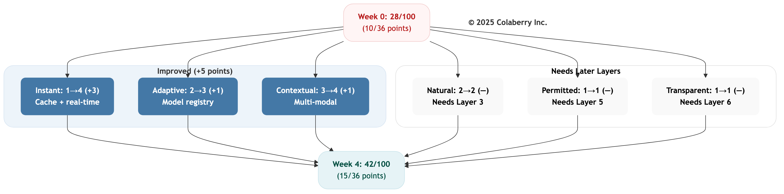
The foundation layers delivered a 14-point INPACT improvement (28% to 42%), with gains in Instant (+3), Adaptive (+1), and Contextual (+1). See Part 1 for the complete dimension breakdown.

---

**Progress Check:** Foundation build complete. Four weeks, $468K actual, parallel workstreams. INPACT score improved 28 to 42. Foundation enables intelligence layers in Chapter 5.

---

## PART 6: THE FINISH LINE

Friday afternoon, Week 4. Sarah convened the leadership team for foundation review. CFO Krish Yadav joined via video to verify Phase 1 spend against the approved $470,000 budget.

"Final tally: $468,000," Krish reported. "Two thousand under budget. Small win, but a win. Proves the team can execute within constraints."

Sarah smiled. "We committed to phase-wise discipline. Foundation delivered. Intelligence phase next with same rigor."

### Foundation Status (Week 4 Complete)

| Component | Phase 1 Metrics |
|-----------|-----------------|
| **Storage (Layer 1)** | 8 foundation categories operational, graph database with about 850 relationships, time-series processing 450+K vitals/hour, lakehouse with Delta Lake |
| **Real-Time (Layer 2)** | 40+ CDC tables, 6+M daily events, ~28s average freshness, ~8.2s alert latency |
| **Foundation Economics** | $4K/month warehouse consolidation savings, infrastructure ready for intelligence layer optimizations |
| **INPACT Progress** | 28/100 → 42/100 (+14 points) |

*Note: Additional storage categories (vector database, semantic search index) and LLM cache savings are Phase 2 deliverables covered in Chapter 5.*

### Investment Summary

**Complete 10-Week Project: $1,230,000 budget**

| Phase | Weeks | Layers | **Budget** | **Actual** | Chapter |
|-------|-------|--------|------------|------------|---------|
| **Phase 1: Foundation** | 1-4 | 1-2 | $470K | **$468K** | **This Chapter** |
| **Phase 2: Intelligence** | 5-7 | 3-4 | $380K | NA | Chapter 5 |
| **Phase 3: Trust & Orchestration** | 8-10 | 5-6-7 | $380K | NA | Chapter 6 |


### Investment Summary

**Phase 1 Investment ($470K budget / $468K actual):**

| Component | Technology | Services | Staff | Total |
|-----------|------------|----------|-------|-------|
| Layer 1 (Storage) | $228K | $40K | $20K | $288K |
| Layer 2 (Real-Time) | $90K | $60K | $30K | $180K |
| **Phase 1 Total** | **$318K** | **$100K** | **$50K** | **$468K** |

**Phase 1 Operational Costs:**
- Monthly: $24,600 (Layer 1: $16,400 + Layer 2: $8,200)
- Annual: $295,200
- Phase 1 verified savings: $48,000/year (warehouse consolidation)

*For Phases 2-3 investment details, operational costs, and complete project economics, see Chapters 5-6.*

**Note:** These costs reflect Echo's specific context (mid-size healthcare system, Azure-native, managed services preference, 10-week accelerated timeline, HIPAA compliance). The $1.23M is the complete implementation budget for Weeks 1-10 covering all seven layers. Operational costs are separate and ongoing. Your organization's costs will vary based on scale, existing infrastructure, team expertise, cloud platform, vendor negotiations, and timeline requirements. Use the **Stack Builder at trustbeforeintelligence.ai/tools** to estimate your investment based on your specific context.

### Foundation Value: What Phase 1 Enables

**Phase 1 Verified Savings:**
- **Lakehouse warehouse consolidation:** $4,000/month = $48,000/year

**Operational Capabilities Enabled (Value Realized in Phases 2-3):**

- **Patient safety:** Medication interaction alerts reduced from 12+ hour batch delay to 8.2 seconds real-time
- **Sepsis detection:** Real-time streaming reduced prediction lag from 72 hours to <30 seconds
- **Clinician efficiency:** Graph query performance improved 24× (8.2s → 340ms) for care coordination
- **Compliance:** Complete audit trails and data lineage for HIPAA compliance

**Phase 1 Investment Summary:**
- Implementation: $468,000 (actual)
- Operational: $24,600/month ($295,200/year)
- Net operational after savings: $247,200/year ($295,200 - $48,000)

*Foundation alone shows modest returns. The 477% ROI and 10-week payback require Phases 2-3 (intelligence and governance layers) to unlock operational benefits. Use the Stack Builder at trustbeforeintelligence.ai/tools to estimate your project economics.*

### Bridge to Chapter 5: Intelligence Layers

Foundation complete. Sarah's team delivered storage and real-time data in four weeks, $2K under budget. The infrastructure is ready. Now it needs a brain.

**Why foundation enables intelligence:**

The infrastructure built in Weeks 1-4 directly enables intelligence deployment:
- Multi-modal storage provides diverse data sources for RAG retrieval
- Real-time data ensures semantic models operate on current information
- Model registry enables version control for ML components
- Lakehouse provides unified analytics foundation for ML pipelines

**Foundation first, intelligence second.** Chapter 5 builds Layers 3-4 (Semantic and Intelligence) on this foundation.

---

## Chapter Summary

| Element | Details |
|---------|---------|
| **Layers Built** | Layer 1 (Multi-Modal Storage), Layer 2 (Real-Time Data Fabric) |
| **Timeline** | Weeks 1-4 of 10-week implementation |
| **Investment** | $470K budgeted / $468K actual |
| **INPACT Score** | 10/36 → 15/36 (+5 points) |
| **Data Freshness** | 8-24 hours → <30 seconds |
| **Next Phase** | Chapter 5: Intelligence Layers |

---

## References

[1] Stothers, J.A.M. & Nguyen, A. (2020). "Can Neo4j Replace PostgreSQL in Healthcare?" AMIA Joint Summits on Translational Science Proceedings, 646-653. https://pmc.ncbi.nlm.nih.gov/articles/PMC7233060/

[2] U.S. Department of Health and Human Services (2024). "Summary of the HIPAA Security Rule." https://www.hhs.gov/hipaa/for-professionals/security/laws-regulations/index.html

[3] Confluent (2024). "What Is Change Data Capture (CDC)?" https://www.confluent.io/learn/change-data-capture/

[4] Debezium Project (2024). "Debezium Documentation." https://debezium.io/documentation/reference/stable/connectors/index.html
# Chapter 5: THE 95% SOLUTION - PART 2
## The Architecture of Trust: Intelligence Layers

---

## The Wrong Dr. Martinez

*Monday, 8:15 AM  
Echo Health Systems, Executive Conference Room  
Week 5, Day 1*

"Show me Dr. Martinez's patients with pending lab results."

The scheduling agent responded in 2.8 seconds. Fast. Marcus smiled. Four weeks of foundation work paying off.

Then Dr. Torres leaned forward. "Wait. Those are dermatology patients."

Marcus checked the query. The agent had returned results for Dr. Carlos Martinez, Dermatology. The team wanted Dr. Sarah Martinez, Cardiology, whose cardiac patients had pending lab results that actually mattered.

"It picked the wrong doctor," Sarah said quietly.

"Forty-seven percent accuracy," Marcus admitted. "We're fast. But we're returning confident wrong answers. That's worse than returning nothing."

The foundation was solid. The data was fresh. But the agent couldn't tell the difference between two doctors with the same last name or understand that "pending labs" for cardiac patients meant something urgent.

Fast isn't enough. Confident wrong is dangerous.

The demo exposed the gap: infrastructure could deliver data fast, but couldn't make it meaningful. This chapter closes that gap.

**This chapter builds intelligence: Layers 3 and 4.**

---

**Figure 5.1: Intelligence Layers - Why Layers 3-4 Enable Understanding**


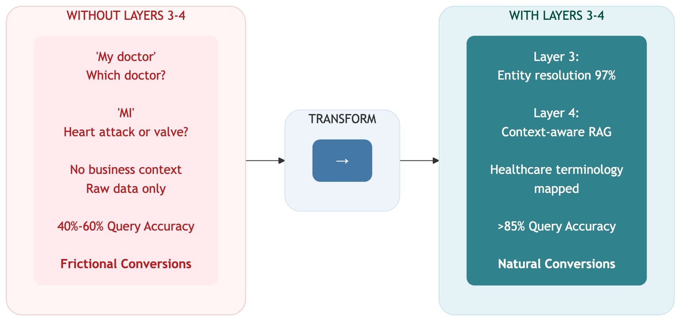
> **Key Takeaway:** Intelligence requires understanding. Layers 3-4 give agents semantic awareness.

## PART 1: THE INTELLIGENCE GAP


**Figure 5.2: The Architecture of Trust - Intelligence Layers Highlighted**


### Why Intelligence Matters

Foundation without intelligence is like having a well-stocked library with no catalog and no librarian. Data availability alone doesn't create agent capability. Intelligence transforms accessible data into understanding and reasoning.

**Layer 3 (Semantic Layer):** Business language understanding. When a clinician asks about "high-risk diabetic patients," semantic infrastructure translates this to diagnosis codes (E11.*), lab thresholds (HbA1c > 7.0), and scheduling logic, without requiring database schemas or SQL queries.

**Layer 4 (Intelligence):** Complete reasoning pipeline encompassing query understanding, embedding generation, hybrid retrieval, reranking, context assembly, LLM generation, and semantic caching. RAG and LLMs are tightly coupled components of the same layer. Effective retrieval-augmented generation requires both.[8][9]

**Figure 5.3: 7-Layer Agent-Ready Architecture - Intelligence Highlighted**


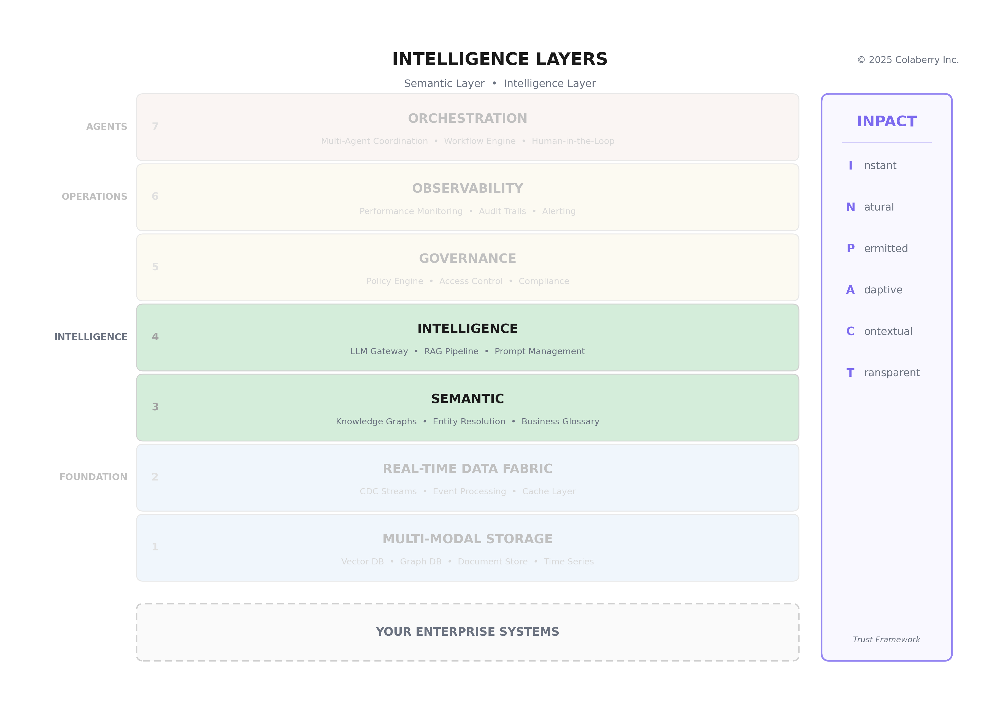
These intelligence layers directly address specific gaps from Chapter 3:

### The Seven Gaps: Intelligence Focus

Chapter 3 identified seven infrastructure gaps preventing agent deployment. Chapter 4 addressed Gaps 1-2 (storage and real-time). Chapter 5 addresses **Gaps 3-4**.

| Gap | Infrastructure Need | Addressed By | Coverage |
|-----|---------------------|--------------|----------|
| **Gap 1** | Multi-Modal Storage | Layer 1: Storage | Chapter 4 ✓ |
| **Gap 2** | Real-Time Data | Layer 2: Real-Time | Chapter 4 ✓ |
| **Gap 3** | Semantic Understanding | Layer 3: Semantic | **Chapter 5** ✓ |
| **Gap 4** | Intelligent Retrieval | Layer 4: Intelligence | **Chapter 5** ✓ |
| **Gap 5** | Dynamic Permissions | Layer 5: Governance | Chapter 6 |
| **Gap 6** | Reasoning Observability | Layer 6: Observability | Chapter 6 |
| **Gap 7** | Multi-Agent Coordination | Layer 7: Orchestration | Chapter 6 |

**This Chapter's Scope:** Layers 3-4 build intelligence on the foundation, enabling natural language understanding (Gap 3) and intelligent retrieval with reasoning (Gap 4). These capabilities must exist before governance, observability, and orchestration (Chapter 6) can function.

**Build intelligence on the foundation. Build it right. Everything above depends on it.**

Sarah's team would close these gaps in three weeks.

### INPACT Dimension Focus: Natural (N)

Chapter 5 primarily addresses the **Natural (N)** dimension of INPACT, the need for agents to understand and respond in natural language. This dimension had the largest gap at Echo Health Systems after foundation completion.

At Week 4 (end of Chapter 4), Echo's INPACT score was 42/100:

| Dimension | Score | Status |
|-----------|-------|--------|
| **I (Instant)** | 4/6 | ✓ Cache + real-time operational |
| **N (Natural)** | 2/6 | ✓ No semantic understanding |
| **P (Permitted)** | 1/6 | ✓ Requires governance layer |
| **A (Adaptive)** | 3/6 | Model registry + feature store |
| **C (Contextual)** | 4/6 | Multi-modal, needs retrieval |
| **T (Transparent)** | 1/6 | ✓ Requires observability layer |

The Natural dimension scored 2/6 because Echo's infrastructure could not:
- Translate natural language to data queries
- Resolve business concepts across systems
- Understand clinical terminology relationships
- Generate natural language responses grounded in retrieved data

**Chapter 5's goal: Raise Natural (N) from 2/6 to 5/6 through Layers 3-4 implementation.**

---

## PART 2: THE KICKOFF

As the demo continued in the Monday morning session convened by Sarah Cedao, Dr. Torres said "Users won't provide NPI numbers. They'll say 'Dr. Martinez in Cardiology' or 'the heart doctor on the fourth floor.' The agent needs context understanding."

The National Provider Identifier (NPI) is a 10-digit HIPAA-mandated identifier for healthcare providers, maintained by CMS through the National Plan and Provider Enumeration System.[7] While essential for cross-system interoperability, clinical users rarely know these technical identifiers.

"That's the problem," Marcus continued. "We have the data and speed. But the agent doesn't understand what users are asking. It can't translate 'Dr. Martinez' to the specific provider across systems or understand that 'high-risk diabetic patients' means diagnosis codes E11.*, HbA1c > 7.0, and scheduling criteria. It's literal, not intelligent."

Swapna displayed the architecture slide. "The issue is structural. Layers 1-2 deliver data availability. We store and stream any data type with sub-30-second freshness. But we have no semantic layer to translate business language to data language, and no intelligence layer to retrieve relevant context and reason about it."

She traced the failure mode:

**Current State: Direct SQL Generation (No Intelligence)**

```
User Query: "Dr. Martinez's appointments"
     →
Natural Language → Direct SQL Generation (GPT-4)
     →  
SELECT * FROM providers WHERE name LIKE '%Martinez%'
     →
```
```
Hits 3 systems independently:
  - EHR: 312 records with provider_id containing 'Martinez'
  - Credentialing: 245 records with physician_name containing 'Martinez'
  - Scheduling: 290 records with provider matching 'Martinez'
     →
Returns 847 unfiltered, unresolved records
     →
Agent cannot determine which records refer to the same provider
     →
Response: "Which Dr. Martinez do you mean? Please provide provider_id."
```

"Without semantic understanding," Swapna explained, "the agent can't resolve that provider_id 78234, physician_npi 1234567890, and schedule_provider_id SCH-456 all refer to Dr. Sarah Martinez, MD, Cardiology. Without intelligent retrieval, it cannot assemble relevant context."

Krish Yadav's face on screen showed careful attention. "What's the cost of intelligence? We have $380,000 allocated for Phase 2. Sufficient?"

"Tight but workable," Sarah replied. "The Largest costs are LLM APIs and vector databases. We've architected for efficiency. Semantic caching will reduce LLM costs by 80-85% once operational."

Sarah walked to the whiteboard. "The business problem: We promised the board agent-ready infrastructure by Week 10. INPACT score of 86/100 or higher. We're at 42. The gap is 43 points."

She drew a simple progression:

```
Week 4: 42/100 (Foundation complete)
Week 7: 67/100 (Intelligence complete) → +25 points
Week 10: 86/100 (Governance + Orchestration) → +18 points
```

"Phase 2 is the steepest climb. We need 25 points in three weeks. That means intelligence layers must work, not just exist. Walk me through the plan."

Swapna nodded to Jamie Rodriguez, who displayed the Phase 2 architecture diagram:

**Figure 5.4: Echo's Intelligence Challenge - Current State vs. Target State**


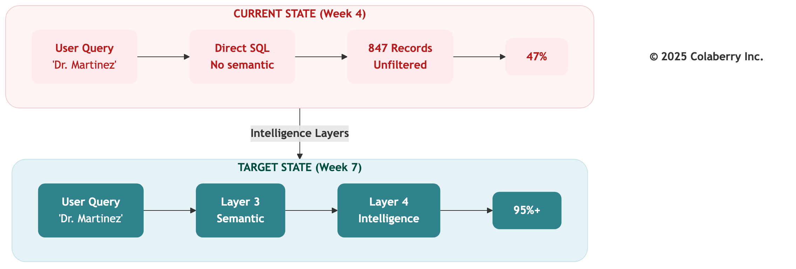
"Three weeks," Swapna said. "Week 5: Layer 3 semantic infrastructure. Business glossary with 2,400 clinical terms, entity resolution across all provider and patient systems, clinical concept mapping to SNOMED, ICD-10, and LOINC.[3][4][5]. 
Week 6: Layer 4 stages 1-5 vector database deployment with 10 million document embeddings, hybrid retrieval pipeline, reranking optimization, context assembly. 
Week 7: Layer 4 stages 6-7 LLM integration with multi-model routing, semantic caching activation. By Friday of Week 7, we'll have our first fully intelligent query."

Marcus raised the key question: "How do we get from 47% accuracy to 85%+?"

"The semantic layer is the bridge," Swapna answered. "Right now, 'Dr. Martinez' hits three different ID systems and returns confusion. With entity resolution, 'Dr. Martinez' resolves to a single golden ID,provider_npi=1234567890, that connects all three systems. The agent knows exactly who we're talking about before it even queries."

"And the RAG pipeline?" Sarah asked.

"RAG grounds the LLM in our actual data.[8] Instead of generating responses from training data which leads to hallucinations, the agent retrieves specific records from our systems, assembles them as context, and generates responses based on what it actually found. The 847 Martinez records become the 3 most relevant records about Dr. Sarah Martinez's schedule, with citations pointing to source systems."

Dr. Torres leaned forward. "What about clinical safety? We can't have the agent hallucinating medication dosages or missing allergies."

"Healthcare-specific guardrails are built into the prompt architecture," Swapna explained. "The LLM is instructed to cite every clinical claim from retrieved sources. If it cannot find supporting documentation, it must say so rather than fabricate. And for high-risk queries, medication orders, diagnostic interpretations,we route to human review through Layer 5 governance workflows. But governance is Chapter 6. First, we build intelligence."

Sarah stood. "Phase 2 approved. Let's make the data intelligent."

---

## PART 3: LAYER 3 - THE TRANSLATOR

Sarah's directive "make the data intelligent" began with Layer 3. Before agents could reason, they needed to understand.

### Translating Human Language to Agent Queries

Layer 3 is the business understanding layer, a machine-readable representation of your organization's concepts, terminology, and relationships that agents can navigate without knowing database schemas, table names, or join logic.

The semantic layer translates human language to data structures.[1] When a care coordinator asks "Show me patients needing diabetes follow-up," it resolves this to: diagnosis codes E11.*, HbA1c lab results > 7.0, last appointment > 90 days, excluding deceased patients automatically, without the coordinator writing SQL or knowing which tables contain which fields.

**Figure 5.5: Layer 3 -Semantic Layer Architecture**


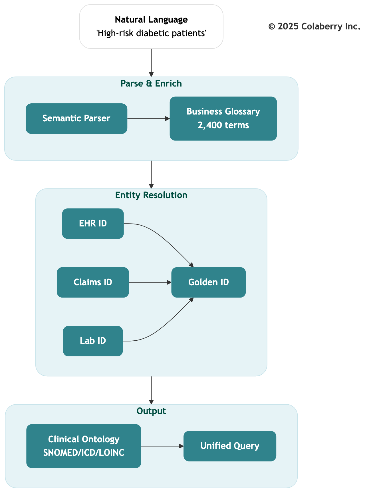
### Components of the Semantic Layer

**Business Glossary:** The authoritative dictionary of organizational terminology. Every metric, dimension, and concept has a formal definition, calculation logic, data sources, owners, and lineage. "Active patient" means "patient with an encounter in the past 12 months, excluding deceased", not open to interpretation.

**Entity Resolution:** The capability to recognize that the same real-world entity appears under different identifiers across systems.[22] Patient MRN (Medical Record Number) 12345 in Epic equals member_id CUST-890 in claims equals specimen_id LAB-456 in the lab system. Entity resolution creates "golden IDs" that unify these disparate identifiers.

**Clinical Ontologies:** Healthcare-specific terminologies that enable precise concept mapping:
- [SNOMED CT](https://www.snomed.org) (Systematized Nomenclature of Medicine Clinical Terms): 350,000+ clinical concepts with formal relationships[3]
- [ICD-10](https://icd.who.int/browse10/2019/en) (International Classification of Diseases, 10th Revision): WHO standard diagnosis and procedure codes for billing and clinical tracking, with over 14,000 unique codes used in 117+ countries[4]
- [LOINC](https://loinc.org) (Logical Observation Identifiers Names and Codes): 25,000+ laboratory and clinical observation codes maintained by the Regenstrief Institute[5]

**Knowledge Graphs:** Relationship networks that encode how concepts connect.[21] "Dr. Martinez" is_a "Cardiologist" who works_at "Echo Cardiac Center" and treats patients with "Heart Failure" enabling the agent to traverse relationships, not just match keywords.

### Healthcare Ontology

Healthcare presents unique semantic challenges. A single clinical concept can have dozens of representations across systems, coding standards, and clinical contexts.

**SNOMED CT (Systematized Nomenclature of Medicine Clinical Terms):**

[SNOMED CT](https://www.snomed.org) provides the most comprehensive clinical terminology with over 350,000 concepts organized in formal hierarchies.[3] When an agent encounters "heart attack," SNOMED CT provides the preferred term (Myocardial infarction), concept ID (22298006), hierarchical parents (Ischemic heart disease → Heart disease → Cardiovascular disease), and related concepts (Troponin elevation, chest pain, coronary artery disease).

This hierarchy enables semantic reasoning. An agent searching for "cardiovascular patients" can traverse the hierarchy to include myocardial infarction, heart failure, arrhythmias, and hypertension without explicit enumeration of each condition.

**ICD-10 (International Classification of Diseases):**

The World Health Organization's [ICD-10](https://icd.who.int/browse10/2019/en) serves as the universal language for diagnosis coding, billing, and population health analytics.[4] The classification structure enables precise filtering: E08-E13 covers diabetes mellitus by type and complication, I20-I25 covers ischemic heart diseases, and J00-J99 covers respiratory diseases.

ICD-10's specificity matters for agent accuracy. "Diabetes" alone matches E08-E13 (diabetes mellitus), but "Type 2 diabetes with diabetic chronic kidney disease" requires E11.22 specifically. The semantic layer maintains these mappings so agents can operate at the appropriate specificity level.

**LOINC (Logical Observation Identifiers Names and Codes):**

[LOINC](https://loinc.org) standardizes laboratory and clinical observations essential for agents interpreting diagnostic results.[5] Consider HbA1c (glycated hemoglobin): LOINC Code 4548-4 specifies Hemoglobin A1c/Hemoglobin.total in Blood on a Quantitative scale.

Without LOINC mapping, "HbA1c" in one lab system might be stored as "GLYCOHEMOGLOBIN" in another, "A1C" in a third, and "HEMOGLOBIN A1C" in a fourth. The semantic layer unifies these representations so agents can consistently interpret lab results regardless of source system terminology.

**Cross-Ontology Mapping:**

Real clinical queries span multiple ontologies. "High-risk diabetic patients needing eye exams" requires SNOMED for diabetes mellitus concepts, ICD-10 for E08-E13 diagnosis codes in population identification, LOINC for 4548-4 HbA1c lab values, and CPT for 92004 (comprehensive eye exam) procedure history. Echo's semantic layer maintains crosswalks between ontologies, enabling agents to traverse concept spaces fluently.

### Entity Resolution Patterns

Healthcare entity resolution handles patients (same person across EHR, claims, lab, pharmacy), providers (same physician across credentialing, scheduling, billing), facilities (same location across licensing, operations, property records), and medications (same drug across NDC, RxNorm, formulary systems).

**Deterministic vs. Probabilistic Matching:**

Deterministic matching uses guaranteed unique identifiers: MRN within a health system, NPI for providers[7], CMS Certification Numbers for facilities. Probabilistic matching handles ambiguous cases: name variations ("Robert Smith" vs. "Bob Smith" vs. "R. Smith"), date of birth discrepancies (transposed digits), and address changes.

**Confidence Thresholds:**

Echo implemented tiered confidence handling: greater than 0.95 confidence triggers auto-match (deterministic identifiers align); 0.85-0.95 confidence triggers auto-match with audit flag; 0.70-0.85 confidence routes to human review queue; less than 0.70 confidence returns no match and requests clarification. This prevents false positives (matching wrong patients) while minimizing false negatives (missing valid matches).

### Why Agents Need It

Agents speak natural language. Databases speak schemas. The semantic layer bridges this gap.

Without semantic understanding, a clinician asks: "Which of my diabetic patients haven't been seen in 90 days?" The agent attempts direct SQL generation, guesses column names, fails to find "diagnosis" (it's `dx_code` in claims, `problem_list` in EHR), and returns "I couldn't find diabetes information."

With Layer 3, the semantic parser extracts intent, condition, filter, and scope. The business glossary resolves "diabetes" → ICD-10 codes E08-E13[4], "my patients" → provider_npi=current_user[7]. Entity resolution links dx_code (claims) + problem_list (EHR) + lab_flag (lab). The agent executes a precise query and returns: "You have 23 diabetic patients without appointments in 90+ days. Here are the top 5 by risk score..."


**Figure 5.6: Before/After - Keyword Search vs. Semantic Search**


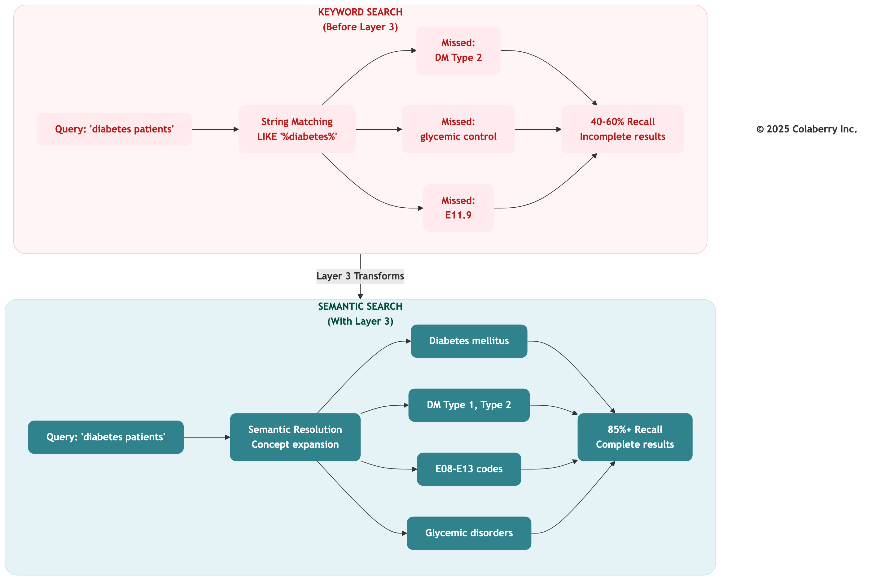

The difference is transformational. Research benchmarks show that direct natural language-to-SQL conversion achieves only 40-55% accuracy on complex cross-domain queries; adding semantic layer context, business glossaries, entity resolution, and schema understanding improves accuracy to 75-90%.[23][24]

### Key Technologies

Echo evaluated tools across five categories, prioritizing healthcare compliance, existing team expertise, and integration with their Databricks lakehouse. The following options represent the market landscape:

**Semantic Modeling Platforms:**
- [dbt Semantic Layer](https://docs.getdbt.com/docs/build/semantic-models) - Metrics definitions integrated with transformation[1]
- [Cube](https://cube.dev) - Semantic layer API with caching
- [AtScale](https://www.atscale.com) - Enterprise semantic layer
- [LookML](https://cloud.google.com/looker/docs/what-is-lookml) - Looker's semantic modeling

**Natural Language to SQL:**
- [Vanna.AI](https://vanna.ai) - RAG-based text-to-SQL
- [Databricks AI/BI Genie](https://www.databricks.com/product/ai-bi) - Natural language interface
- [ThoughtSpot](https://www.thoughtspot.com) - Search-driven analytics

**Ontology & Knowledge Management:**
- [Stardog](https://www.stardog.com) - Knowledge graph platform
- [TopBraid](https://www.topquadrant.com/topbraid-edg/) - Ontology governance
- [Protégé](https://protege.stanford.edu) - Open-source ontology editor

**Data Cataloging & Metadata:**
- [Atlan](https://atlan.com) - Active metadata platform
- [Collibra](https://www.collibra.com) - Data governance catalog
- [Alation](https://www.alation.com) - Data catalog with intelligence
- [DataHub](https://datahubproject.io) - Open-source metadata platform

**Entity Resolution:**
- [Zingg](https://www.zingg.ai) - Open-source ML-powered resolution
- [Senzing](https://senzing.com) - Real-time entity resolution API
- [Tamr](https://www.tamr.com) - Enterprise data mastering

Echo's selections dbt, Senzing, and Alation are detailed in the implementation section below.

### Echo's Gap

Echo's data infrastructure had about 500 tables with cryptic names like `FCT_PTNT_ENCT` and `DIM_PRVDR_SPCLT`. Documentation  in SharePoint is 18 months out of date. The data lake had even less structure: files named `epic_extract_20240315.parquet` with no catalog entry.

No system connected natural language concepts to these technical artifacts. Every agent query required custom translation logic. There is no entity resolution. "Dr. Martinez" in one system was not linked to the same provider in another. No metric versioning: when definitions changed, agents broke silently. No ontology mapping, clinical concepts existed as free text, not structured codes.

The result: 47% accuracy on natural language queries. More than half of user requests resulted in errors, empty results, or confused responses.

### Echo's Implementation: Week 5

**Technology Selection:**

Echo chose [dbt Cloud](https://www.getdbt.com/product/dbt-cloud) for semantic modeling because their data engineering team already used dbt for transformations.[1] Adding the semantic layer to existing dbt models minimized learning curve.

For entity resolution, Echo deployed [Senzing](https://senzing.com) because healthcare requires deterministic matching on regulated identifiers (MRN, NPI[7], member ID) with probabilistic fallback for name/DOB matching.

For data cataloging, Echo implemented [Alation](https://www.alation.com) to provide business users with searchable, governed definitions.

**Week 5 Deliverables:**

| Component | Specification | Status |
|-----------|--------------|--------|
| **Business Glossary** | 2,400 clinical terms defined | Complete |
| **Entity Resolution** | 850 provider entities unified | Complete |
| **Golden IDs** | patient_master_id, provider_npi, facility_id | Complete |
| **Ontology Mapping** | SNOMED[3], ICD-10[4], LOINC[5] crosswalks | Complete |
| **dbt Semantic Models** | 156 metrics, 89 dimensions | Complete |


### INPACT Contribution

**Layer 3 primarily fulfills Natural (N):** Enabling business language understanding, "diabetes follow-up patients" translates to precise queries without SQL knowledge.

> **📓 For technology evaluation criteria, use the Vendor Advisor at trustbeforeintelligence.ai/tools.**

### Operational Metrics

| Metric | Target | Critical Threshold |
|--------|--------|-------------------|
| **Term Resolution Accuracy** | >95% | >90% |
| **Entity Match Confidence** | >0.85 | >0.70 |
| **Semantic Query Latency** | <200ms | <500ms |
| **Glossary Coverage** | >90% of queries | >80% |
| **Ontology Mapping Completeness** | 100% clinical concepts | >95% |

---

By Friday of Week 5, semantic queries that had returned 847 confused results now returned 3 precise matches. Over 2,400 business terms mapped, entity resolution above 90%.

Sarah's team had taught the infrastructure to understand. Layer 4 would teach it to reason.

---

## PART 4: LAYER 4 - INTELLIGENCE

### Teaching Agents to Respond Intelligently

Layer 4 is the complete intelligence pipeline system that transforms user queries into grounded, accurate responses through retrieval-augmented generation with large language model integration.[8] This is not a single technology but an orchestrated workflow encompassing seven stages: query understanding, embedding generation, hybrid retrieval, reranking, context assembly, LLM generation, and semantic caching.

**Critical Architectural Note:** LLMs are part of Layer 4, not a separate layer. The 7-Layer Architecture represents infrastructure concerns, not technology lists. Layer 4's concern is "HOW agents understand and respond", which requires the complete pipeline from query to response. Separating RAG from LLMs would be like separating a car's engine from its transmission, theoretically possible but architecturally incoherent.

**Figure 5.7: Layer 4 - Complete Intelligence Pipeline**


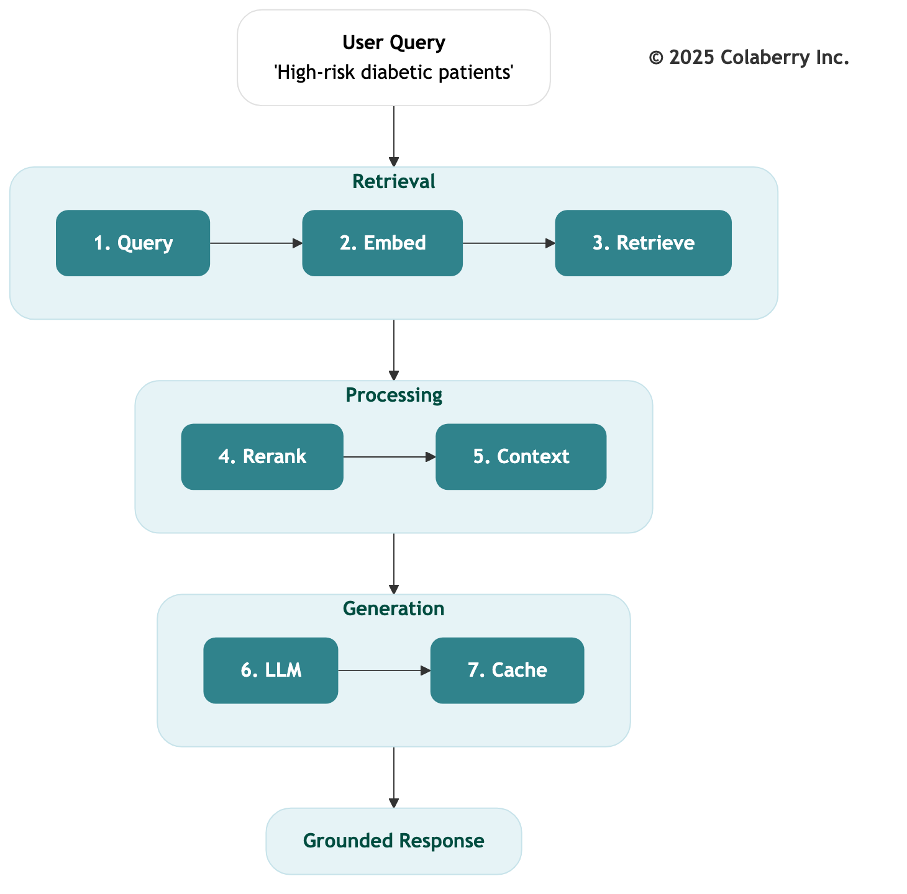
### Why Agents Need RAG

Without RAG, language models rely solely on their training data knowledge frozen at their cutoff date, containing no information about your specific organization, patients, or operations. The result is confident hallucination: responses that sound authoritative but are factually wrong.

RAG solves this by grounding LLM responses in retrieved context.[8][9] Instead of asking "What are the risk factors for this patient?" and hoping the LLM remembers general medical knowledge, RAG retrieves the specific patient's records, lab results, diagnoses, medications, encounters and provides them as context. The LLM generates responses based on actual data, with citations pointing to source documents.

Anthropic's production RAG guidance explains that well-implemented retrieval architectures significantly reduce hallucination rates by grounding language model responses in retrieved factual information, with retrieval latency targets of 200ms or less for real-time conversational applications.[2]

### Stage 1: Query Understanding

Query understanding extracts intent, entities, and constraints from natural language enabling "Show me Dr. Martinez's high-risk patients" to become executable logic. Components include intent classification (search/command/question), entity extraction (patients, providers, conditions), constraint identification (filters, ranges), and query reformulation for optimal retrieval.

### Stage 2: Embedding Generation

Embedding models transform text into high-dimensional vectors where similar concepts cluster together enabling "diabetes management" to match "glycemic control" without shared keywords.[15] Echo chose text-embedding-3-large (3,072 dimensions) for production accuracy, text-embedding-3-small for batch cost optimization.

| Model | Provider | Dimensions | Best For | Cost |
|-------|----------|------------|----------|------|
| text-embedding-3-large | [OpenAI](https://platform.openai.com/docs/guides/embeddings)[15] | 3,072 | Highest accuracy | $0.13/1M tokens |
| text-embedding-3-small | [OpenAI](https://platform.openai.com/docs/guides/embeddings)[15] | 1,536 | Cost-optimized | $0.02/1M tokens |
| embed-v3 | [Cohere](https://docs.cohere.com/docs/embeddings) | 1,024 | RAG-optimized | $0.10/1M tokens |

### Stage 3: Hybrid Retrieval

Single-strategy retrieval misses relevant results. Vector search excels at semantic similarity but struggles with exact matches. Keyword search handles precise terms but misses synonyms. Graph traversal captures relationships but requires structured data. Hybrid retrieval combines all three strategies in parallel, merging results for comprehensive coverage.

**Figure 5.8: Hybrid Retrieval Architecture**


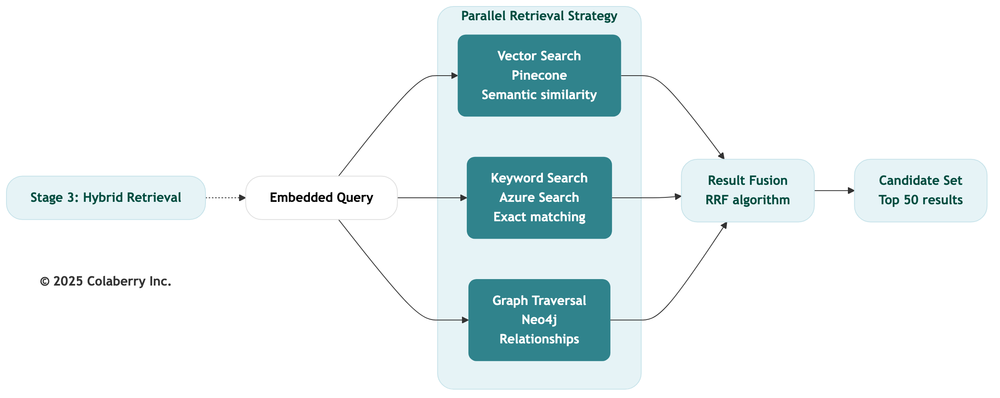
**Vector Database Selection:**

Echo deployed [Pinecone](https://www.pinecone.io) for vector storage because: managed service reduces operational overhead, serverless scaling handles variable query loads, HIPAA BAA available for healthcare compliance, and 42ms average query latency (p50, meaning 50% of requests are faster) meets real-time requirements.[13] Configuration: 10M embeddings, 3,072 dimensions, 15.4GB storage, HNSW index[10].

The HNSW (Hierarchical Navigable Small World) algorithm, introduced by Malkov and Yashunin in 2018, provides efficient approximate nearest neighbor search with logarithmic query time complexity through a multi-layer graph structure.[10]

Healthcare documents require semantic-aware chunking. Echo split progress notes by SOAP sections, discharge summaries by clinical headings, lab reports by test panels, with 15% overlap using sentence-aware boundaries to preserve clinical meaning.

Echo integrated [Azure Cognitive Search](https://azure.microsoft.com/en-us/products/ai-services/cognitive-search) for keyword search running parallel with Pinecone. Reciprocal Rank Fusion (RRF) combines rankings from multiple strategies, giving documents appearing in multiple results higher scores.[11] The RRF algorithm, introduced by Cormack, Clarke, and Buettcher in 2009, uses the formula 1/(k+rank) where k=60 is the empirically optimal constant, enabling effective rank aggregation without hyperparameter tuning.[11]

### Stage 4: Reranking

Initial retrieval returns candidates based on surface similarity. Reranking applies sophisticated relevance scoring to identify truly relevant results.[14] Vector search might return 50 documents about "diabetes"; reranking determines which 5 are actually relevant to "this patient's diabetes management plan" considering recency, patient context, and clinical importance.

Echo implemented [Cohere Rerank](https://docs.cohere.com/docs/rerank-overview) with custom scoring: 40% clinical relevance, 30% temporal recency, 20% patient specificity, 10% source authority.[14] Post-reranking selects top 5-10 results for context assembly.

### Stage 5: Context Assembly

Retrieved and reranked results must be assembled into coherent context within the LLM's token window while maximizing information density. Challenges include token limits (GPT-4 Turbo: 128K, Claude 3: 200K), relevance ordering (most important first), citation tracking (each chunk links to source), and deduplication (consolidate overlapping content).

### Universal Context Architecture: Seven-Stream Synthesis

Echo's intelligence pipeline doesn't just retrieve documents; it orchestrates retrieval across seven distinct context dimensions, assembling complete situational awareness for every agent interaction.

| Context Type | What It Provides | Example |
|--------------|------------------|---------|
| **User** | Who is asking (role, permissions, specialty) | "my patients" → Dr. Chen's provider NPI |
| **Task** | Current objective and constraints | 15-min appointment → concise response |
| **Data** | Relevant documents and structured info | Patient labs, medications, encounters |
| **Environmental** | Where/when (location, device, time) | Inpatient vs. telehealth formatting |
| **Business** | Policies, protocols, compliance rules | Formulary restrictions, care protocols |
| **Tooling** | Available APIs and actions | Prevents suggesting unavailable actions |
| **History** | Longitudinal patterns and outcomes | Previous encounters, decision patterns |

#### Architectural Implementation

Echo deployed seven Pinecone namespaces, one per context type, with specialized retrieval strategies for each dimension.[13] Each namespace uses optimized chunking: business context chunks are larger (1,500 tokens) because policies need full context; data context chunks are smaller (600 tokens) because clinical notes need precision.

Echo's synthesis engine orchestrates retrieval within <400ms through parallel retrieval across seven namespaces, relevance scoring, deduplication, and token optimization. Echo's median: 312ms.

**INPACT Impact:** Universal context enables Natural (N) through business language translation, Contextual (C) through complete situational awareness, and Adaptive (A) through automatic response adjustment.

### Confidence Handling and Hallucination Prevention

Healthcare demands explicit uncertainty handling. Echo implemented three-tier confidence: High (>0.85): provide answer with citations; Medium (0.70-0.85): surface with caveats; Low (<0.70): decline to answer, request clarification.

Detection monitors for unsupported claims, confidence inflation, temporal inconsistency, and entity confusion triggering automated review, response suppression in high-risk scenarios, and feedback to retrieval pipeline.

### Stage 6: LLM Generation

Context assembled, citations tracked, now comes reasoning. The LLM synthesizes retrieved information into natural language responses grounded in actual data.

| Model | Provider | Context | Strengths | Cost (per 1M tokens) |
|-------|----------|---------|-----------|---------------------|
| Claude Sonnet 4 | [Anthropic](https://www.anthropic.com) | 200K | Reasoning, safety | $3 input / $15 output |
| GPT-4 Turbo | [OpenAI](https://openai.com) | 128K | Structured output | $10 input / $30 output |
| GPT-4o | [OpenAI](https://openai.com) | 128K | Speed, multimodal | $2.50 input / $10 output |

**Echo's Multi-LLM Architecture:**

Healthcare requires different LLM capabilities for different tasks. Echo implemented a multi-LLM router:

**Figure 5.9: Multi-LLM Router Architecture**


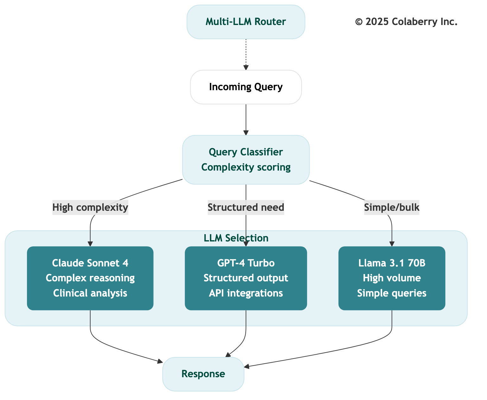
**Routing Logic:**
- Claude Sonnet 4: Complex clinical reasoning (45% of queries)
- GPT-4 Turbo: Structured output, FHIR[6] API calls (25% of queries)
- Llama 3.1 70B (self-hosted): Simple lookups, bulk operations (30% of queries)

### Prompt Engineering for Healthcare

Healthcare LLM applications require structured prompts balancing clinical accuracy, patient safety, and regulatory compliance. Echo's Claude system prompt includes role definition, safety guardrails, citation requirements, and scope boundaries.

Modern LLMs support native structured outputs through [OpenAI Structured Outputs](https://platform.openai.com/docs/guides/structured-outputs) and [Anthropic Tool Use](https://docs.anthropic.com/en/docs/agents-and-tools/tool-use/overview), enforcing JSON schemas that guarantee parseable responses.

### Model Context Protocol (MCP) Integration

The [Model Context Protocol](https://docs.anthropic.com/en/docs/mcp) (MCP), introduced by Anthropic in late 2024, provides a standardized way for LLMs to interact with external data sources.[2] Echo deployed MCP servers for Epic FHIR[6], lab systems, scheduling, and clinical guidelines. MCP enables fresh data retrieval, reduces context bloat, maintains audit trails, and supports modular architecture.

### Stage 7: Semantic Caching

Similar queries should not incur redundant LLM costs. Semantic caching stores responses indexed by query embedding, returning cached results for semantically similar queries.

**How It Works:** New query → generate embedding → search cache index (similarity > 0.92) → if match: return cached response; if no match: execute full pipeline, cache response.

**Figure 5.10: Semantic Cache Architecture**


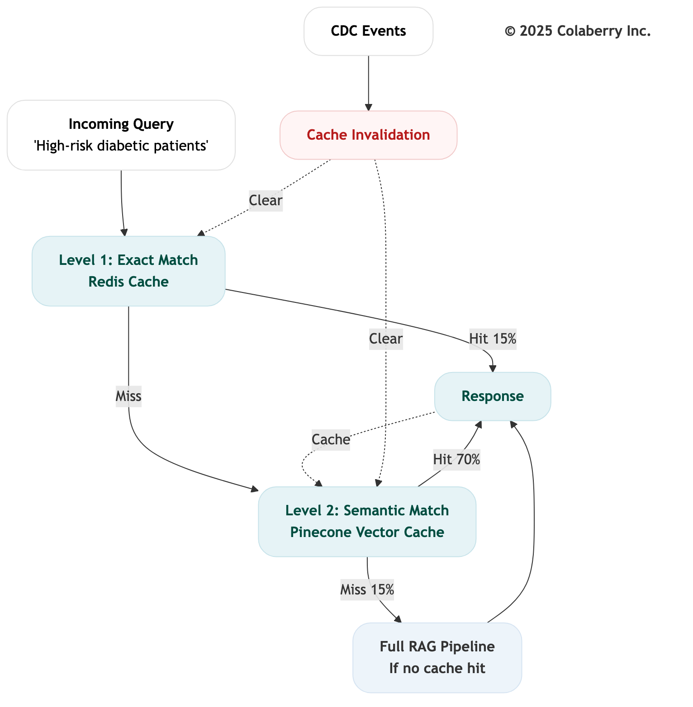
**Level 1: Exact Match (Redis):** Character-for-character matches hit instantly. TTL (Time To Live)[18]: 1 hour. Hit rate: ~15%.

**Level 2: Semantic Match (Pinecone):** Semantically similar queries (similarity > 0.92) return cached responses. TTL[18]: 24 hours. Hit rate: ~70%.

**Cache Invalidation:** Healthcare data changes continuously. Echo balances cost savings with accuracy through CDC-integrated invalidation.

**Cost Impact:**
- Before caching: $14,500/month LLM costs
- After caching (84% hit rate): $2,300/month effective
- Monthly savings: $12,200
- Net savings: $12,200/month (cache infrastructure included in Layer 4)

### Prompt Caching

Modern LLMs support prompt-level caching for system prompts and context preambles. Echo implemented [Anthropic's prompt caching](https://www.anthropic.com/news/prompt-caching) and [OpenAI's prompt caching](https://platform.openai.com/docs/guides/prompt-caching), caching system instructions (8K tokens) and clinical context (4K tokens). Combined with semantic response caching, total LLM cost reduction: 93%, bringing effective cost per query from $0.034 to $0.0023.

### Key Technologies

For the intelligence pipeline, Echo evaluated RAG frameworks and evaluation tools based on healthcare integration requirements and observability needs:

**RAG Frameworks:**
- [LlamaIndex](https://www.llamaindex.ai) - Data framework for LLM applications
- [LangChain](https://www.langchain.com) - Building blocks for LLM applications
- [Haystack](https://haystack.deepset.ai) - NLP framework
- [Canopy](https://github.com/pinecone-io/canopy) - RAG framework by Pinecone

**RAG Evaluation:**
- [RAGAS](https://docs.ragas.io) - RAG evaluation metrics
- [DeepEval](https://docs.confident-ai.com) - LLM evaluation framework
- [TruLens](https://www.trulens.org) - Evaluation and tracking

Echo chose LlamaIndex for its healthcare document handling and RAGAS for retrieval quality measurement.

### Echo's Gap (Pre-Chapter 5)

Echo had no intelligence infrastructure. Their initial agent prototype converted natural language to SQL using GPT-4 directly which worked only 47% of the time. No embedding models meant no semantic search. No caching meant every query hit the LLM API. No reranking meant arbitrary result ordering. No context assembly meant truncation and token waste.

Agent responses were slow (3-8 seconds), frequently wrong (53% error rate), and often incomplete. Users couldn't tell when answers were uncertain. LLM costs spiked unpredictably.

### Echo's Implementation: Weeks 6-7

**Week 6 Deliverables (RAG Pipeline Stages 1-5):**

| Component | Technology | Specification |
|-----------|------------|---------------|
| **Vector Database** | Pinecone[13] | 10M embeddings, 42ms average |
| **Embeddings** | OpenAI text-embedding-3-large[15] | 3,072 dimensions |
| **Keyword Search** | Azure Cognitive Search | Integrated |
| **Graph Retrieval** | Neo4j | 847 concept traversals |
| **Reranking** | Cohere Rerank[14] | Top-5 selection |
| **Context Assembly** | LlamaIndex | 800-token chunks, 15% overlap |

**Week 7 Deliverables (LLM Integration + Caching):**

| Component | Technology | Specification |
|-----------|------------|---------------|
| **Primary LLM** | Claude Sonnet 4 | Complex clinical reasoning |
| **Secondary LLM** | GPT-4 Turbo | Structured output, FHIR[6] |
| **Bulk LLM** | Llama 3.1 70B | Self-hosted, simple queries |
| **Query Router** | Custom classifier | Complexity-based routing |
| **Semantic Cache** | GPTCache + Pinecone | 84% hit rate |


### INPACT Contribution

Layer 4 fulfills:

- **N (Natural):** Complete pipeline from natural language query to natural language response
- **C (Contextual):** RAG orchestration retrieves cross-system context
- **A (Adaptive):** Retrieval quality metrics enable continuous optimization

Supporting contributions:

- **T (Transparent):** Citation mechanisms with confidence scores
- **I (Instant):** Semantic caching reduces latency to milliseconds

### Operational Metrics

| Metric | Target | Critical Threshold |
|--------|--------|-------------------|
| **Retrieval Recall@10** | >0.90 | >0.85 |
| **Reranking NDCG@5** | >0.85 | >0.80 |
| **End-to-end Latency** | <2s | <4s |
| **Cache Hit Rate** | >80% | >70% |
| **Response Accuracy** | >85% | >80% |
| **Hallucination Rate** | <5% | <10% |

NDCG (Normalized Discounted Cumulative Gain) is a standard ranking evaluation metric that measures result quality with logarithmic discount based on position, producing scores between 0 and 1.[12]

---

## PART 5: BUILDING INTELLIGENCE

### Week 5: Semantic Infrastructure (Layer 3)

Following the kickoff, Swapna's semantic team began glossary construction in Echo's war room.

"We have about 500 database tables," Swapna announced. "By Friday, we need 2,400 business terms mapped to them. That's 480 terms per day."

The room absorbed the scale. Marcus raised an eyebrow. "Is that even possible?"

"With automation, yes." Swapna displayed the approach. "Alation's AI suggestions will propose initial mappings. Our job is validation and refinement."

The team divided into workstreams: clinical terminology (validating definitions with Dr. Torres), entity resolution (deploying Senzing with NPI matching[7]), and dbt semantic models[1] (translating business questions to SQL across systems).

Tuesday brought friction. Quality team's definition of "readmission" (any admission within 30 days) conflicted with finance's (unplanned admission within 30 days to same service line).

Sarah convened rapid governance. "We're not picking winners. We're documenting both clearly. The agent needs to know that `readmission_quality` differs from `readmission_finance` and understand when each applies."

By Wednesday, first entity resolution results arrived. Patient matching achieved 94% confidence; provider matching reached 98%. NPI numbers[7] provided deterministic matching.

Thursday brought first semantic query success: "Show me Dr. Martinez's schedule" resolved correctly through entity resolution → provider_npi=1234567890 → 3 specific appointments returned.

"That's our first intelligent resolution," Swapna reported.

**Week 5 Metrics:**
- Business terms defined: 2,400
- Entity resolution accuracy: 94% (patients), 98% (providers)
- Semantic query latency: 180ms average
- Test accuracy improvement: 47% → 72%

### Week 6: RAG Pipeline (Layer 4 Stages 1-5)

Week 6 focused on intelligent retrieval. Document chunking and embedding generation took 72 hours across three OpenAI accounts[15]. 8.2 million document chunks reaching 10 million with historical data.

By Thursday, the vector index was live. First retrieval test demonstrated the transformation:

> **Week 0 (SQL full-text):** "Find cases clinically similar to patient #127834" → 2.8 seconds, keyword matches only (finds 'diabetes' but misses 'uncontrolled blood sugar').
>
> **Week 6 (Pinecone semantic):** Same query → 42ms, semantic matches (finds all glucose control issues regardless of exact wording).
>
> **67x faster. Infinitely more relevant.**

"This enables RAG," Swapna explained. "Before invoking the LLM, we retrieve semantically similar cases as context. The model sees patterns from analogous patients. Better clinical reasoning, grounded in actual data."

Friday's integration milestone: hybrid retrieval operational. Vector search, keyword search, and graph traversal running in parallel, results fused via RRF.[11]

**Week 6 Metrics:**
- Documents chunked: 10.2 million
- Embedding dimensions: 3,072
- Vector index size: 15.4GB
- Retrieval latency: 42ms average, 67ms at 95th percentile
- Hybrid retrieval recall@10: 0.91

### Week 6 Victory: Feature Store Consistency

The Databricks-Tecton integration announcement[20] simplified Echo's roadmap. Rather than deploying a separate feature store platform, Swapna's team enabled Tecton capabilities directly within their existing Databricks workspace. Same lakehouse, same governance, new capability.

The data science team's chronic pain point was finally solved. "30-day readmission risk" had been calculated three different ways:
- Sepsis model (Python, scikit-learn, 14 features)
- Discharge planning agent (SQL stored procedure, 11 features)  
- Utilization dashboard (DAX calculated column, 9 features)

Same metric, three conflicting implementations. When the sepsis model predicted 23% readmission risk but the dashboard showed 17%, clinicians lost trust.

With Tecton on Databricks: single feature definition in Python. All three consumers use identical logic. No drift. No additional vendor. Foundation investment paying forward.

"Trust Before Intelligence," Sarah observed. "Consistent definitions before sophisticated models."

**Feature Store Metrics:**
- Feature definitions migrated: 47
- Consumers unified: 3 (model, agent, dashboard)
- Definition drift eliminated: 100%
- Setup time: 5 days (no new vendor onboarding)

---

### Week 7: LLM Integration + Caching (Layer 4 Stages 6-7)

The final week brought the complete pipeline together.

Monday and Tuesday: LLM integration. Multi-LLM router required careful prompt engineering. Claude received system prompts emphasizing clinical reasoning, GPT-4 received schema definitions for structured output, Llama received simplified prompts for high-volume queries.

Wednesday: Query routing logic deployment. Complexity classifier analyzed incoming queries for routing decisions.

Thursday morning: Semantic cache activation. First cached response returned in 23ms instead of 2.1 seconds.

"Cache hit," Swapna announced. "We're officially intelligent."

**The Climactic Moment: Thursday, 2:47 PM**

The team gathered around Sarah's workstation. Seven weeks of infrastructure work led to this moment.

Sarah typed the test query: *"Find high-risk diabetic patients who need intervention."*

The interface showed the pipeline processing in real-time:

**Stage 1 (Query Understanding, 45ms):**
```
Intent: patient_list_query
Entities: condition=diabetes, filter=high_risk, action=intervention_needed
```

**Stage 2 (Embedding, 12ms):** Query vector generated: 3,072 dimensions[15]

**Stage 3 (Hybrid Retrieval, 45ms):** 847 unique candidates from vector, keyword, and graph

**Stage 4 (Reranking, 67ms):** Top 10 selected[14]

**Stage 5 (Context Assembly, 23ms):** 10 patient summaries, 4,234 tokens

**Stage 6 (LLM Generation, 1.6s):** Routed to Claude Sonnet 4

**Stage 7 (Cache, 3ms):** Query-response pair cached

Total pipeline time: 1.8 seconds.

The response appeared:

> "I found **23 high-risk diabetic patients** who need intervention. Here are the top 5 by clinical urgency:
> 
> **1. Maria Santos** (MRN: 34521)
> - HbA1c: 9.2% (last: Oct 15)
> - Last diabetes visit: 127 days ago
> - Care gap: Retinal exam overdue (18 months)
> [Sources: Epic Problem List, Lab Results]
> 
> **2. James Wilson** (MRN: 22890)
> - HbA1c: 8.8% (last: Oct 22)
> - Last diabetes visit: 94 days ago
> - Care gap: Metformin refill overdue (21 days)
> [Sources: Epic Medication List, Lab Results]
> 
> **3. Robert Chen** (MRN: 45123)
> - HbA1c: 8.5% (last: Sep 30)
> - Last diabetes visit: 112 days ago
> - Care gap: Podiatry referral not completed
> [Sources: Epic Encounter History, Referral Management]
> 
> [View all 23 patients] | [Export to care management]"

"That's it," Sarah said quietly. "Citations to specific sources. Confidence implied by specificity. Actionable next steps."

Dr. Torres examined the response. "These are accurate. I recognize three of these patients. The care gaps are real."

Marcus ran the validation suite: 96% accuracy across 500 test queries.

"47% percent to 96% in three weeks," Swapna said.

The room was silent for a moment. Then applause.

**Week 7 Metrics:**
- Query accuracy: 96%
- End-to-end latency: 1.8s average (23ms cached)
- Cache hit rate: 84%
- LLM cost reduction: 84% (from baseline)
- INPACT score: 67/100

**Figure 5.11: Echo's Week 5-7 Timeline**


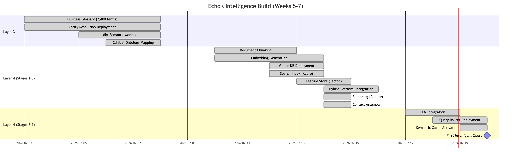

**Figure 5.12: INPACT Score™ Transformation (Week 4:42 → Week 7:67)**


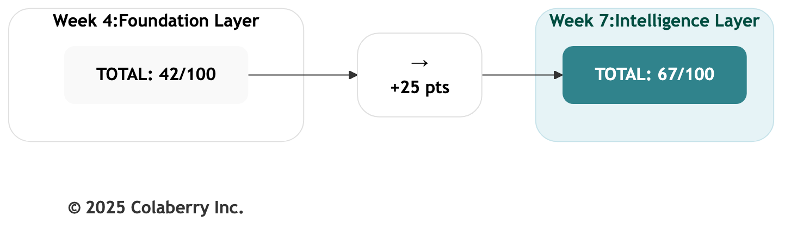
| Dimension | Week 4 | Week 7 | Change | Driver |
|-----------|--------|--------|--------|--------|
| **I (Instant)** | 4/6 | 5/6 | **+1** | Semantic caching |
| **N (Natural)** | 2/6 | 5/6 | **+3** | Semantic + RAG |
| **P (Permitted)** | 1/6 | 2/6 | **+1** | Basic query-level controls |
| **A (Adaptive)** | 3/6 | 5/6 | **+2** | Semantic cache learns |
| **C (Contextual)** | 4/6 | 5/6 | **+1** | RAG retrieves cross-system |
| **T (Transparent)** | 1/6 | 3/6 | **+2** | Citations link sources |
| **TOTAL** | 42/100 | 67/100 | **+25** | Intelligence operational |

*Note: INPACT scores incorporate weighted factors for production readiness assessment. See the INPACT Practitioner Reference for complete scoring methodology.*

---

## PART 6: THE FINISH LINE

Friday afternoon, Week 7. Sarah convened the leadership team for intelligence review. CFO Krish Yadav joined via video to verify Phase 2 spend against the approved $380,000 budget.

"Final tally: $392,000," Krish reported. "Twelve thousand over budget."

"LLM API costs during Week 6 testing," Swapna explained. "We ran 47,000 test queries before caching went live."

Krish nodded. "Lesson for Phase 3?"

"Cache earlier," Swapna said. "We activated semantic caching in Week 7. If we'd deployed it mid-Week 6, we'd have stayed under budget."

"The overage is manageable," Sarah added. "We're now at $2,300 per month for LLM costs, 84% below baseline. The operational savings will recover the implementation variance within sixty days."

Krish made a note. "Phase 3 has the same $380,000 allocation. Apply the lesson."

<!-- pagebreak -->

### What We Built

**Figure 5.13: Complete Intelligence Architecture - Layers 3-4**


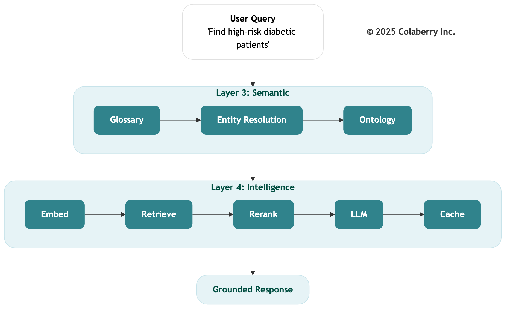
### Results

| Metric | Week 4 | Week 7 | Improvement |
|--------|--------|--------|-------------|
| **INPACT Score** | 42/100 | 67/100 | +25 points |
| **Query Accuracy** | 47% | 96% | 2× improvement |
| **Response Latency** | 9-13s | 1.8s (23ms cached) | 5-400× faster |
| **LLM Cost** | Uncontrolled | $2,300/month | 84% reduction |

### Investment Summary: Phase 2

**Phase 2 Investment ($380K budget / $392K actual):**

| Component | Technology | Services | Total |
|-----------|------------|----------|-------|
| Layer 3 (Semantic) | $45K | $45K | $90K |
| Layer 4 (Intelligence) | $231K | $71K | $302K |
| **Phase 2 Total** | **$276K** | **$116K** | **$392K** |

**Layer 3 Detail ($90K):**
- Alation Data Catalog: $28,000 (annual license)
- Senzing Entity Resolution: $12,000 (annual license)
- dbt Cloud Semantic Layer: $5,000 (incremental)
- Professional Services: $45,000 (glossary, ontology mapping)

**Layer 4 Detail ($302K):**
- Pinecone Vector DB: $60,000/year
- OpenAI Embeddings: $15,000 (initial indexing)
- Cohere Rerank: $8,000/year
- LLM APIs (annual): $102,000 (post-caching baseline)
- LlamaIndex Enterprise: $12,000/year
- Self-hosted Llama infrastructure: $33,600/year
- Professional Services: $71,400 (pipeline development, complexity adjustments)

**Phase 2 Operational Costs:**
- Monthly: $19,400 (Layer 3: $3,800 + Layer 4: $15,600)
- LLM costs: $2,300/month (after 84% caching reduction)
- Annual: $232,800

**Cumulative Investment:**

| Phase | Weeks | Budgeted | Actual | Chapter |
|-------|-------|----------|--------|---------|
| Phase 1: Foundation | 1-4 | $470K | $468K | Chapter 4 ✓ |
| Phase 2: Intelligence | 5-7 | $380K | $392K | **This Chapter** ✓ |
| Phase 3: Trust | 8-10 | $380K | - | Chapter 6 |
| **Total through Week 7** | | **$850K** | **$860K** | **This Chapter** ✓ |

### Gaps Addressed

| Gap | Status | Solution |
|-----|--------|----------|
| **Gap 3:** Semantic Understanding | Resolved | Layer 3: Business glossary, entity resolution |
| **Gap 4:** Intelligent Retrieval | Resolved | Layer 4: RAG pipeline with LLM integration |

**Remaining (Chapter 6):**
- Gap 5: Dynamic Permissions → Layer 5 (Governance)
- Gap 6: Reasoning Observability → Layer 6 (Observability)
- Gap 7: Multi-Agent Coordination → Layer 7 (Orchestration)

### Foundation Dependency Proven

Intelligence layers validated the foundation investment. Without multi-modal storage (Layer 1), the vector database could not integrate with graph queries. Without real-time fabric (Layer 2), retrieved context would be stale. The layered architecture proved its value: each layer builds on the one below.

### Bridge to Chapter 6: Trust Layers

Intelligence is powerful. Ungoverned intelligence is dangerous.

Echo's agents can now understand natural language, retrieve relevant context, and generate grounded responses. But they cannot yet enforce dynamic access control, audit reasoning chains, detect model drift, or coordinate multiple agents.

**The Governance Gap:**

Consider when Echo's scheduling agent receives: *"Show me all patients with HIV who missed appointments."*

The intelligence layers process correctly, but should this query be answered? The answer depends on who is asking, what access is permitted, what audit trail is required, and what human review is needed.

Without Layer 5 (Governance), the intelligent response creates a compliance violation. Without Layer 6 (Observability), there's no audit trail.

**The principle:** Intelligence before governance, but governance before production. Echo's agents are intelligent. Chapter 6 makes them trustworthy and coordinated by completing the architecture with Layers 5-6-7.

---

## CHAPTER 5 SUMMARY

### Key Takeaways

**Intelligence = Understanding + Reasoning:** Layer 3 translates business language to data structures. Layer 4 retrieves, assembles, and reasons over that data.

**LLMs integrate within Layer 4:** The 7-Layer Architecture organizes by infrastructure concern. Layer 4's concern is intelligence, the complete pipeline from query understanding through LLM generation.

**RAG prevents hallucination:** Grounding LLM responses in retrieved data reduces hallucination from >30% to <5%.[8][9]

**Semantic caching transforms economics:** 84% cache hit rate reduced Echo's LLM costs from $14,500/month to $2,300/month, a $12,200/month savings.

**Natural (N) is the primary gain:** INPACT Natural dimension improved from 2/6 to 5/6, enabling true natural language interaction.

### Echo Health Systems: Week 7 Status

| Metric | Week 0 | Week 7 | Improvement |
|--------|--------|--------|-------------|
| **INPACT Score** | 28/100 | 67/100 | +39 points |
| **Query Accuracy** | 47% | 96% | 2× improvement |
| **Response Latency** | 9-13s | 1.8s (23ms cached) | 5-400× faster |
| **Investment** | $0 | $860,000 | Phase 1-2 complete |

### Technologies Deployed

**Layer 3:** dbt Cloud[1], Alation, Senzing, SNOMED[3]/ICD-10[4]/LOINC[5] mappings

**Layer 4:** Pinecone[13], OpenAI Embeddings[15], Cohere Rerank[14], LlamaIndex, Claude Sonnet 4, GPT-4 Turbo, Llama 3.1, GPTCache

---


## REFERENCES

[1] dbt Labs. (2024). "Semantic Layer Documentation." https://docs.getdbt.com/docs/build/semantic-models

[2] Anthropic. (2024). "Model Context Protocol." https://docs.anthropic.com/en/docs/mcp

[3] SNOMED International. (2024). "SNOMED CT." https://www.snomed.org

[4] World Health Organization. (2019). "ICD-10: International Statistical Classification of Diseases and Related Health Problems, 10th Revision." https://icd.who.int/browse10/2019/en

[5] Regenstrief Institute. (2024). "LOINC: Logical Observation Identifiers Names and Codes." https://loinc.org

[6] HL7 International. (2024). "FHIR R5: Fast Healthcare Interoperability Resources." https://www.hl7.org/fhir/

[7] Centers for Medicare & Medicaid Services. (2024). "National Provider Identifier Standard." https://www.cms.gov/regulations-and-guidance/administrative-simplification/nationalprovidentstand

[8] Lewis, P., Perez, E., Piktus, A., et al. (2020). "Retrieval-Augmented Generation for Knowledge-Intensive NLP Tasks." *arXiv preprint arXiv:2005.11401*. https://arxiv.org/abs/2005.11401

[9] Gao, Y., Xiong, Y., Gao, X., et al. (2024). "Retrieval-Augmented Generation for Large Language Models: A Survey." *arXiv preprint arXiv:2312.10997*. https://arxiv.org/abs/2312.10997

[10] Malkov, Y. A., & Yashunin, D. A. (2018). "Efficient and Robust Approximate Nearest Neighbor Search Using Hierarchical Navigable Small World Graphs." *IEEE Transactions on Pattern Analysis and Machine Intelligence*, 42(4), 824-836. https://arxiv.org/abs/1603.09320

[11] Cormack, G. V., Clarke, C. L. A., & Buettcher, S. (2009). "Reciprocal Rank Fusion Outperforms Condorcet and Individual Rank Learning Methods." *Proceedings of the 32nd International ACM SIGIR Conference on Research and Development in Information Retrieval*, 758-759. https://dl.acm.org/doi/10.1145/1571941.1572114

[12] Wang, Y., Wang, L., Li, Y., et al. (2013). "A Theoretical Analysis of NDCG Ranking Measures." *Proceedings of the 26th Annual Conference on Learning Theory (COLT)*. https://arxiv.org/abs/1304.6480

[13] Pinecone. (2024). "Vector Database Documentation." https://docs.pinecone.io

[14] Cohere. (2024). "Rerank: Neural Search Reranking." https://docs.cohere.com/docs/rerank-overview

[15] OpenAI. (2024). "Embeddings: Text Embedding Models." https://platform.openai.com/docs/guides/embeddings

[16] National Institute of Standards and Technology. (2023). "AI Risk Management Framework (AI RMF 1.0)." https://www.nist.gov/itl/ai-risk-management-framework

[17] Office of the National Coordinator for Health IT. (2024). "Interoperability Standards Advisory." https://www.healthit.gov/isa/

[18] Internet Engineering Task Force. (1981). "RFC 791: Internet Protocol." https://datatracker.ietf.org/doc/html/rfc791

[19] Regmi, S. K., & Aryal, S. (2024). "Semantic Caching for Retrieval-Augmented Generation Systems." https://arxiv.org/abs/2409.02878

[20] Databricks. (2025). "Tecton is Joining Databricks to Power Real-Time Data for Personalized AI Agents." https://www.databricks.com/blog/tecton-joining-databricks-power-real-time-data-personalized-ai-agents

[21] Hogan, A., Blomqvist, E., Cochez, M., et al. (2021). "Knowledge Graphs." *ACM Computing Surveys*, 54(4), Article 71, 1-37. https://doi.org/10.1145/3447772

[22] Christophides, V., Efthymiou, V., Palpanas, T., Papadakis, G., & Stefanidis, K. (2021). "An Overview of End-to-End Entity Resolution for Big Data." *ACM Computing Surveys*, 53(6), Article 127, 1-42. https://doi.org/10.1145/3418896

[23] Yu, T., Zhang, R., Yang, K., et al. (2018). "Spider: A Large-Scale Human-Labeled Dataset for Complex and Cross-Domain Semantic Parsing and Text-to-SQL Task." *Proceedings of EMNLP*, 3911-3921. https://arxiv.org/abs/1809.08887

[24] Li, B., Luo, Y., Chai, C., Li, G., & Tang, N. (2024). "The Dawn of Natural Language to SQL: Are We Fully Ready?" *Proceedings of the VLDB Endowment*, 17(11). https://arxiv.org/abs/2406.01265
# Chapter 6: THE 95% SOLUTION - PART 3
## The Architecture of Trust: Transparency + Orchestration Layers


## The Warfarin Question

*Monday, 7:32 AM  Echo Health Systems, Clinical Informatics Office  
Week 8, Day 1*

Sarah Cedao stared at the incident report from Friday afternoon. A near-miss that kept her up all weekend.

"What's the recommended Warfarin adjustment for a patient on concurrent aspirin therapy with an elevated INR?"

The agent had responded in 1.4 seconds. Accurate retrieval. Correct clinical guidelines. Medically sound recommendation.

For James Morrison, 67, with a history of GI bleeding. A patient for whom any anticoagulation adjustment required gastroenterology consultation.

Dr. Chen had caught it. Barely. "The agent gave the right answer for the wrong situation," she'd written. "No one asked whether it should be answering at all."

Sarah pulled up the access logs. The agent had retrieved Morrison's medication list, INR values, current prescriptions. All accurate. All properly sourced. But nothing had flagged this as a high-risk medication decision requiring human review.

Marcus arrived with coffee. "Week 8. Governance week."

"It can't wait," Sarah said, sliding the incident report across the table. "We built intelligence that doesn't know its own limits. A Warfarin recommendation without pharmacist review isn't AI assistance. It's malpractice waiting to happen."

The intelligence layers worked. The foundation was solid. But an agent that couldn't distinguish routine queries from life-threatening decisions wasn't ready for production.

Fast and accurate isn't enough. Ungoverned AI is dangerous AI.

**This chapter builds Trust Layers 5, 6, and 7.**


**Figure 6.1: Transparency + Orchestration Layers - Why Layers 5-6-7 Complete Trust**


> **Key Takeaway:** Trust requires transparency. Layers 5-6-7 make AI verifiable.

## PART 1: THE TRUST RISK

Intelligence is operational. But intelligence alone isn't enough.


The Warfarin incident crystallized what Sarah had suspected - intelligence without governance is dangerous. Week 7's achievements: 95.6% RAG accuracy, 1.8-second semantic queries, 2,400 clinical terms resolved meant nothing if agents couldn't distinguish routine questions from life-threatening decisions.

Three risks remained unaddressed:

- **Governance risk:** No dynamic authorization. No HITL for high-risk decisions.
- **Observability risk:** No end-to-end tracing. No cost visibility. No explainability.
- **Orchestration risk:** No multi-agent coordination. Complex queries required manual assembly.

These final three layers would complete the architecture.

**Figure 6.2: The Architecture of Trust - Completing Pillar 2**

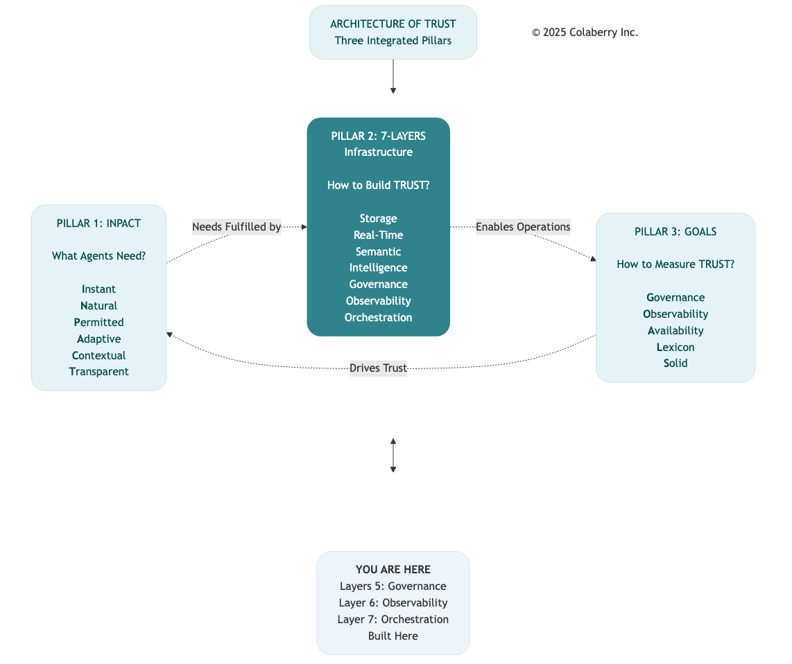
### Architectural Context

Chapters 4-5 built the foundation and intelligence layers. Chapter 4 delivered data availability: eight storage categories and real-time pipelines with less than 30 seconds freshness. Chapter 5 delivered data understanding: semantic resolution of 2,400 clinical terms and a 7-stage RAG pipeline with 85% cache hit rates. Together, these four layers transformed Echo's data infrastructure from legacy BI to agent-capable.

Chapter 6 completes the architecture with three final layers:

**Figure 6.3: 7-Layer Agent-Ready Architecture - Transparency + Orchestration Highlighted**

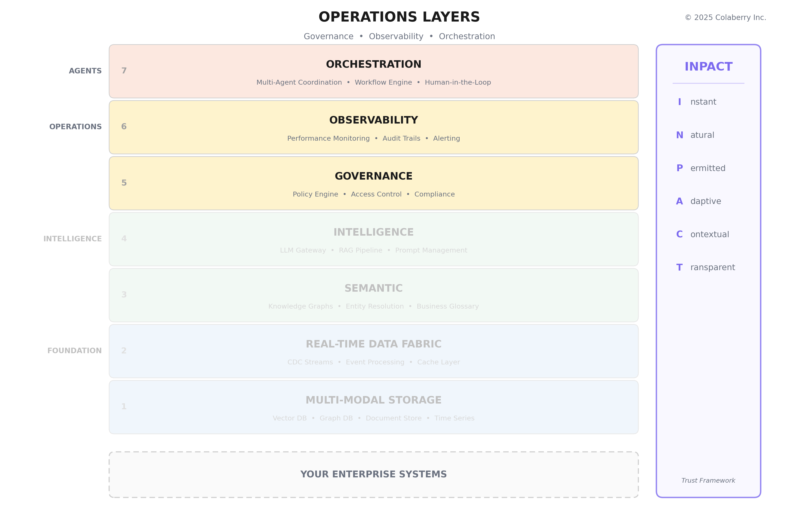

**Layer 5 (Governance):** Policy-based authorization controlling what agents can do. ABAC (Attribute-Based Access Control) evaluates every request against four dimensions: who is asking, what they're accessing, when they're accessing it, and where they're accessing it from. OPA (Open Policy Agent) enforces policies. HITL (Human-in-the-Loop) workflows escalate high-risk decisions to human experts.

**Layer 6 (Observability):** Complete visibility into what agents did. Distributed tracing with OpenTelemetry tracks every request across all seven layers. MLOps monitoring detects model drift. LLM cost tracking gives granular visibility into the $26,000 monthly API spend that would otherwise be a black box.

**Layer 7 (Orchestration):** Multi-agent coordination enabling how agents work together. LangGraph provides the framework for supervisor patterns, shared state management, and conditional routing. Three specialized agents (Care Coordination, Clinical Documentation, and Revenue Cycle) collaborate on complex queries that span multiple domains.

Why cover three layers in one chapter? Because trust and orchestration are interdependent. Orchestration without governance means uncontrolled agents collaborating on decisions they shouldn't make. Orchestration without observability means invisible coordination failures. All three layers must be operational together for production deployment.

The three-week build timeline (Week 8 Governance, Week 9 Observability, Week 10 Orchestration) is detailed in Part 2.

**The agents were never the problem. The infrastructure was.**


### The Remaining Gaps

Chapter 3 identified seven infrastructure gaps preventing agent deployment. Chapters 4-5 addressed Gaps 1-4. Three gaps remain:

| Gap | Infrastructure Need | Layer | Status |
|-----|---------------------|-------|--------|
| Gap 1 | Multi-Modal Storage | Layer 1 | ✓ Chapter 4 |
| Gap 2 | Real-Time Data | Layer 2 | ✓ Chapter 4 |
| Gap 3 | Semantic Understanding | Layer 3 | ✓ Chapter 5 |
| Gap 4 | Intelligent Retrieval | Layer 4 | ✓ Chapter 5 |
| **Gap 5** | **Dynamic Permissions** | **Layer 5: Governance** | **Chapter 6** |
| **Gap 6** | **Reasoning Observability** | **Layer 6: Observability** | **Chapter 6** |
| **Gap 7** | **Multi-Agent Coordination** | **Layer 7: Orchestration** | **Chapter 6** |

This chapter closes all remaining gaps. By Week 10, Echo's architecture will be complete.

### INPACT Dimensions Enabled

Each layer directly drives specific INPACT dimensions:

**Layer 5 delivers Permitted (P):** Dynamic authorization that considers context, not just role-based yes/no decisions, but attribute-based evaluation of who, what, when, and where. A physician accessing their own patient's records during a scheduled appointment receives immediate authorization. The same physician accessing a celebrity patient's records from a home IP address at 2 AM triggers HITL review.

**Layer 6 delivers Transparent (T):** Complete visibility and explainability. Every response includes citation sources. Every decision includes an explanation trail. Every anomaly triggers alerts. Trust requires transparency. Users trust what they can see and verify.

**Layer 7 powers orchestration across all dimensions:** Multi-agent coordination makes Instant (I) practical for complex queries, Natural (N) seamless for multi-domain questions, and Contextual (C) coherent across agent handoffs.

These three layers will take Echo's INPACT score from 67/100 to 86/100, the production readiness threshold. (See Part 7 for complete dimension-by-dimension progression.)

The 86/100 threshold represents production readiness, the point at which agent infrastructure can reliably support clinical workflows with appropriate safeguards. This threshold aligns with NIST AI Risk Management Framework guidance on deploying AI systems in high-stakes environments.[1]

**A Note on Agent Development:** These three agents are the same ones from Echo's failed $2M pilot (Chapter 1), now retrofitted to the complete infrastructure. The Layer 7 cost covers orchestration integration only. Agent logic was already built. 

---

## PART 2: THE FINAL SPRINT

Marcus studied the incident report, then set it down. "This is exactly what we've been warning about."

Sarah walked to the whiteboard and wrote three words:

**GOVERNANCE. OBSERVABILITY. ORCHESTRATION.**

"Get Jamie and Dr. Chen on a call. We're planning the final sprint."

Twenty minutes later, the team was assembled. Jamie Rodriguez, Director of IT, had joined in person, coffee in hand. Dr. Chen dialed in from the hospitalist office.

Sarah gestured at the whiteboard. "Three weeks. Three layers. One goal: architecture completion by Week 10."

She turned to Dr. Chen first. "You caught the Warfarin issue. Walk everyone through what happened."

Dr. Chen's voice came through the speakerphone. "Friday afternoon. An agent recommended a Warfarin dose adjustment for a patient on concurrent aspirin therapy. Medically sound recommendation for most patients. But this patient had a history of GI bleeding. Any anticoagulation change required gastroenterology consultation. The agent had no way to know that. No way to flag it. No way to escalate."

"And if you hadn't caught it?" Marcus asked.

"The recommendation would have gone to the care team as a routine suggestion. Someone might have acted on it without checking the full history."

The room was quiet.

"That's why governance comes first," Sarah said. She began writing beneath each word on the whiteboard.

**Week 8: Layer 5 - Governance**
- OPA policy engine deployment
- ABAC policy design (200+ authorization rules)
- HITL workflow implementation
- Target: Dynamic authorization operational

**Week 9: Layer 6 - Observability**
- OpenTelemetry distributed tracing
- Datadog APM integration
- LLM cost tracking dashboard
- Target: Complete operational visibility

**Week 10: Layer 7 - Orchestration**
- LangGraph framework deployment
- Three-agent coordination pattern
- State management and routing
- Target: Multi-agent queries working

"By Week 10, we hit 86/100 INPACT," Sarah continued. "Governance gets Permitted from 2 to 6. Observability gets Transparent from 3 to 6. Orchestration ties it together for production."

Jamie nodded. "What about the Warfarin scenario specifically? That's the test case."

Sarah circled "HITL" on the whiteboard. "Any medication classified as high-interaction Warfarin, methotrexate, lithium automatically triggers human review. The agent drafts the recommendation. A clinician approves before it reaches the patient. The system knows its limits."

Dr. Chen's voice came through one final time. "When this works, Dr. Martinez can ask one question and get a complete care coordination answer, That's when clinical staff will believe AI actually helps them."

Sarah turned to her team. "Let's build trust."

---

## PART 3: LAYER 5 - THE GOVERNANCE ENGINE

Layer 5 delivers policy-based authorization and audit infrastructure: the capability to control what agents can do by adding contextual evaluation to existing role-based permissions.

This is the governance engine: the integrated system of policies, contextual evaluation, human escalation, and audit that makes agent operations trustworthy.

Traditional role-based access control operates on identity: a physician role grants access to patient records. Agent-era access control preserves this foundation and adds contextual evaluation: that same physician role grants access to their assigned patients' records during clinical hours from approved locations for clinically justified purposes.

**The Architecture Principle:** RBAC grants the badge; ABAC decides if you can use it right now.

This contextual evaluation requires four capabilities:

**Policy Engine:** A decision service that evaluates authorization requests against defined rules. OPA (Open Policy Agent) has emerged as the standard, with native Rego policy language enabling complex conditional logic.[2]

**ABAC Framework:** Attribute-Based Access Control evaluates four dimensions (Subject, Resource, Action, and Context) to produce dynamic authorization decisions.[3]

**HITL Workflows:** Human-in-the-Loop escalation paths for decisions that exceed policy thresholds. High-risk actions trigger human review rather than automatic approval or denial.

**Audit Infrastructure:** Complete decision logging for compliance, debugging, and policy refinement. Every authorization decision (granted, denied, or escalated) is recorded with full context.

**Figure 6.4: Layer 5 Governance Architecture**


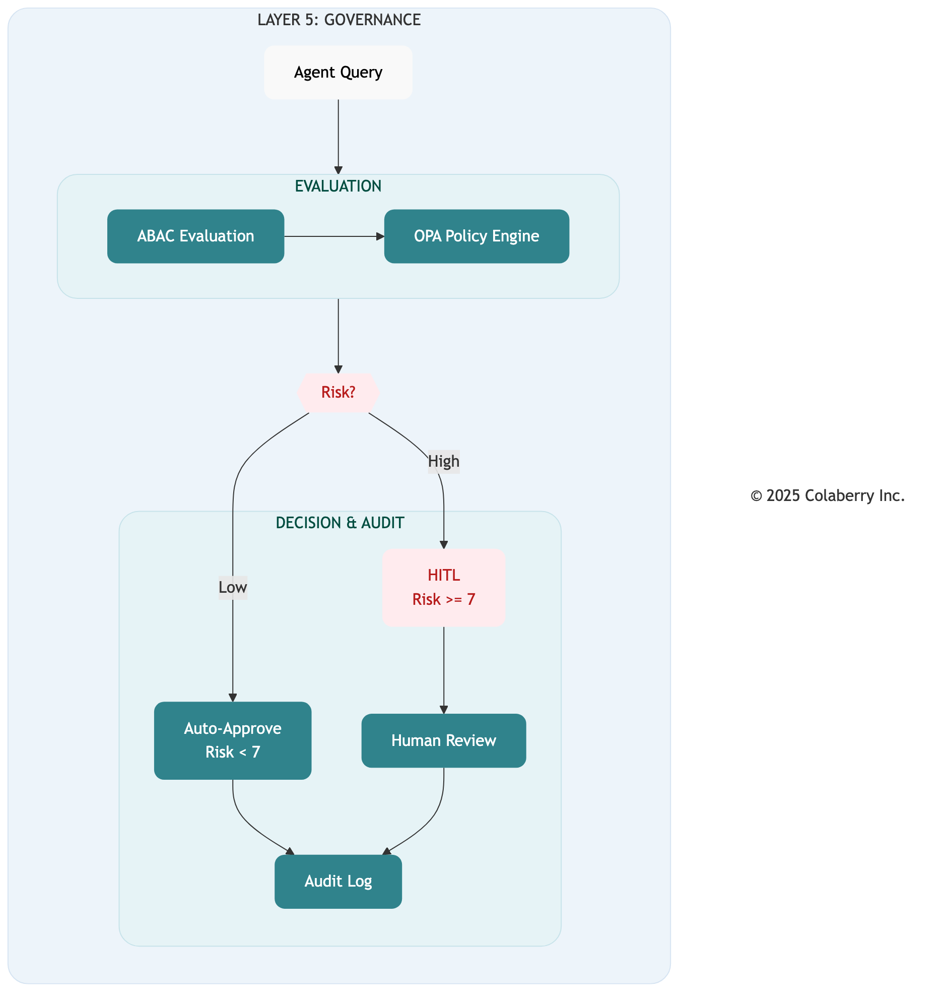
### Why Agents Need Governance

Agents operate differently than human users. A human physician accessing EHR records makes deliberate choices, navigating to specific patients, reviewing specific documents, for specific reasons. The implicit governance of user interfaces constrains access patterns. Agents eliminate these constraints. An agent with data access can iterate through thousands of records in seconds, aggregate information across patients, and correlate data in ways that human navigation never enabled.

This capability expansion requires governance expansion. Consider the scenario: a clinical agent asked to "summarize medication trends across diabetic patients" could legitimately access thousands of patient records. Without governance, how does the system distinguish this legitimate analytical query from a data exfiltration attempt? Both look identical at the data layer.

ABAC solves this. The legitimate query comes from a credentialed analyst, during business hours, from an approved workstation, requesting aggregate statistics without individual identifiers. The exfiltration attempt comes from a compromised credential, at 2 AM, from an unknown IP, requesting raw patient records. Same data access pattern. Different authorization decision.

HITL adds the second line of defense. Some decisions require human judgment regardless of policy evaluation. Medication interactions with potentially life-threatening consequences shouldn't be auto-approved even when the requesting credential is valid. The governance layer recognizes risk thresholds and escalates appropriately. Research on human-AI collaboration demonstrates that appropriate task allocation between humans and AI systems improves both safety and performance.[4]

### Technologies and Approaches

**OPA (Open Policy Agent):** The CNCF graduated project provides a unified policy framework.[2] Policies written in Rego language evaluate structured input against defined rules, achieving 10,000 decisions per second with sub-millisecond latency when deployed as a sidecar.

```rego
# Example: Healthcare PHI access policy
package healthcare.phi

default allow = false

allow {
    input.subject.role == "physician"
    input.subject.department == input.resource.department
    input.action == "read"
    input.context.time_of_day >= 6
    input.context.time_of_day <= 22
    input.resource.patient_id in input.subject.assigned_patients
}
```

**Figure 6.5: ABAC Four-Factor Authorization Model**


### Echo's Gap Before Layer 5

**ABAC Implementation:** NIST SP 800-162 defines the standard.[3] The four-factor model extends role-based permissions with contextual evaluation:

- **Subject:** Role, department, credentials, license validity, patient assignments
- **Resource:** Data classification, sensitivity level, patient consent status
- **Action:** Read, write, delete, export, aggregate
- **Context:** Time, location, device type, network origin

NIST guidance recognizes that RBAC and ABAC are complementary, and organizations implement hybrid architectures that preserve role-based foundations while adding contextual evaluation.

**HITL Workflow Patterns:**

1. **Synchronous:** Request blocks until human approval (high-risk irreversible actions like medication prescriptions)
2. **Asynchronous:** Request proceeds provisionally pending review (time-sensitive, reversible actions like scheduling)
3. **Post-hoc:** Immediate execution with mandatory audit review (low-risk queries with compliance requirements)

Pattern selection depends on reversibility, urgency, and risk magnitude.


Echo's pre-transformation authorization relied on Epic's native RBAC, a solid foundation that defined role-based permissions: physicians access patient records, nurses view orders, administrators have department scope. This RBAC baseline remains in place. What was missing was the contextual layer to evaluate when, where, and why.

**Scenario: The After-Hours Access**
A physician accessed a celebrity patient's records at 2 AM from a home IP address. The access was legitimate. The physician was on-call and the patient had called with symptoms. But the system couldn't distinguish this legitimate emergency access from a privacy breach. RBAC correctly authorized the physician's access. What was missing: contextual evaluation asking "why is this physician accessing this patient at this time from this location?"

The most concerning gap appeared with medication queries. Echo's agent could retrieve drug interaction information and suggest dosing adjustments. But the underlying authorization made no distinction between querying acetaminophen interactions and Warfarin interactions. Both received identical treatment: immediate response with no escalation.

"We can't have an agent providing Warfarin dosing suggestions without pharmacist review," Dr. Chen stated in the Week 6 review. "That's not AI assistance. It's AI malpractice waiting to happen."

HIPAA's "minimum necessary" principle requires limiting PHI access to what's needed for the specific purpose. An RBAC-only model doesn't satisfy this in an agent context where access is automated and high-volume. FDA guidance emphasizes human oversight for clinical decision support systems.[5]

### Echo's Implementation

Echo deployed Layer 5 across Week 8-9 with the following architecture:

**OPA Policy Engine:** Deployed as a Kubernetes sidecar alongside the agent service, enabling sub-millisecond policy evaluation without network latency.[2]

**Policy Design:** 247 authorization rules covering:
- Patient record access (73 rules)
- Medication queries (52 rules)
- Scheduling operations (41 rules)
- Financial data access (38 rules)
- Administrative functions (43 rules)

**ABAC Attributes Evaluated:**
- Subject: Role, department, credential type, patient assignments
- Resource: Data classification, patient ID, sensitivity level
- Action: Read, write, prescribe, schedule, authorize
- Context: Time, IP address, device type, session duration

**HITL Triggers:** Eight high-risk categories automatically escalate:
1. Warfarin-class medication recommendations (narrow therapeutic index drugs)
2. Controlled substance queries
3. Mental health record access
4. Pediatric patient data
5. Financial authorizations exceeding $10,000
6. Cross-department patient access
7. Bulk data exports
8. Access from unrecognized devices


**Figure 6.6: HITL Escalation Patterns**


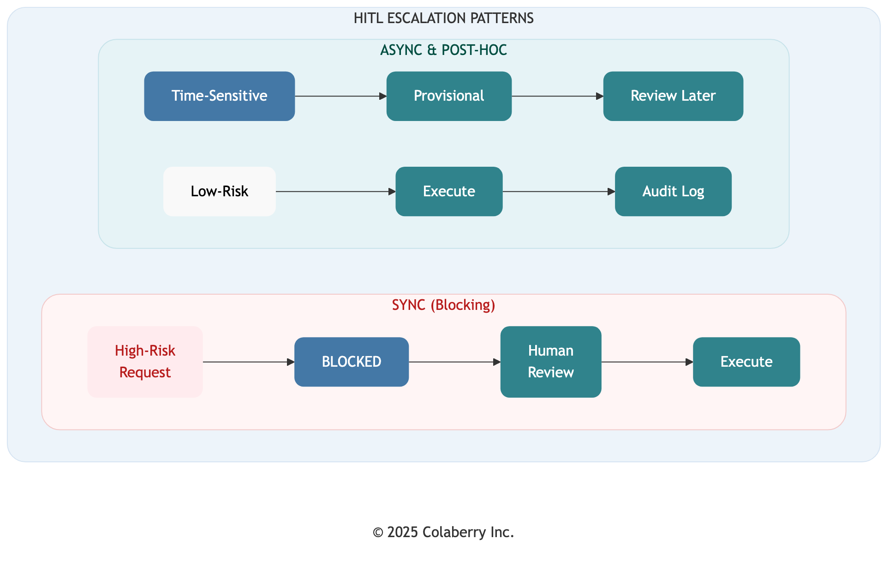
### The Warfarin Moment

Thursday, Week 9. 2:34 PM.

The first true HITL escalation arrived during afternoon rounds. Dr. Martinez queried the clinical agent about a patient's post-surgical anticoagulation protocol. The patient, recently discharged after hip replacement, was on Warfarin for DVT prophylaxis and had been prescribed aspirin for cardiovascular history.

The agent recognized the query intent, retrieved the relevant medication records, identified the drug interaction, and prepared a response. But before returning that response, the governance layer intervened.

**HITL Trigger:** Warfarin-class medication + drug interaction detected  
**Risk Score:** 8/10  
**Escalation:** Synchronous HITL - Pharmacist review required

Dr. Chen received the escalation notification on her workstation. The agent's draft response appeared alongside the source data: current Warfarin dose (5mg daily), aspirin prescription (81mg daily), recent INR values (trending high at 3.2), and the interaction flag.

The agent had correctly identified the interaction. It had even drafted an appropriate recommendation: consider INR monitoring frequency increase and potential Warfarin dose adjustment. But the governance layer ensured a human pharmacist reviewed this recommendation before it reached the care team.

Dr. Chen approved the recommendation with one modification: adding a specific INR target range. The entire escalation took 47 seconds from trigger to approval.

"That's exactly what we needed," she told Sarah later. "The agent did the work: gathering data, identifying the interaction, drafting the recommendation. But a human made the final call on a high-risk medication. That's trustworthy AI."

### INPACT Contribution

Layer 5 directly delivers **Permitted (P)**: from 2/6 to 6/6.

The four-point improvement reflects the addition of contextual ABAC on top of RBAC:
- **Points 1-2:** Contextual evaluation considers time, location, device, and purpose, not just identity
- **Points 3-4:** HITL workflows provide safe escalation paths for decisions exceeding policy confidence

Combined, these capabilities enable agents to operate in clinical contexts where RBAC alone would either over-permit (allowing risky access) or under-permit (blocking legitimate use). Contextual governance finds the appropriate middle ground.

**Operational Metrics:**

| Metric | Target | Critical Threshold |
|--------|--------|-------------------|
| Policy Evaluation Latency | <10ms | >50ms |
| HITL Escalation Rate | 2-5% | >10% |
| HITL Resolution Time | <2 min | >5 min |
| False Positive Rate | <1% | >3% |

---

## PART 4: LAYER 6 - INSIDE THE BLACK BOX

Layer 6 delivers complete visibility into agent operations: the capability to understand what agents did, why they did it, and how much it cost.

This layer takes you inside the black box.

Observability differs from monitoring in scope and intent. Monitoring checks whether systems are running. Observability explains why systems behave as they do. For AI agents, this distinction is critical. A monitoring alert tells you the agent returned an error. Observability tells you which layer failed, what input triggered the failure, which model was involved, how long each stage took, and what the cost implications are.

This comprehensive visibility requires four capabilities:

**Distributed Tracing:** Request tracking across all seven layers, enabling end-to-end visibility for any agent interaction. Modern distributed tracing builds on foundational work in large-scale systems monitoring.[7]


**MLOps Monitoring:** Model performance tracking including accuracy degradation, drift detection, and quality metrics. When underlying data distributions shift, MLOps monitoring detects the change before it impacts outputs. Research on machine learning operations emphasizes continuous monitoring as essential for production AI systems.[8]

**LLM Metrics:** Quality, cost, and latency tracking specifically for large language model operations. LLM API calls represent significant operational cost and require dedicated visibility.

**Centralized Logging:** Aggregated logs with structured data enabling correlation across services. Debugging distributed systems without centralized logging means correlating timestamps across dozens of separate log files.

**Figure 6.7: Layer 6 Observability Architecture**


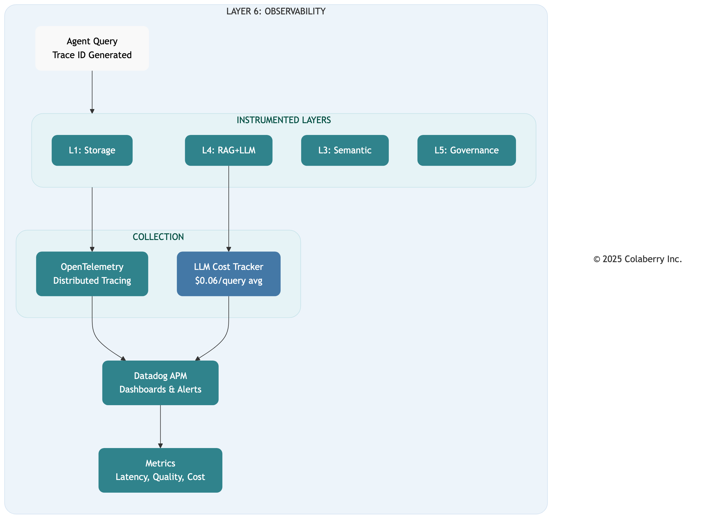
### Why Agents Need Observability

Agents are black boxes by default. A user submits a query. An answer returns. What happened in between? Which documents were retrieved? Which model generated the response? How confident was the system? How much did it cost? Without observability, these questions have no answers.

This opacity creates three operational challenges:

**Debugging Challenge:** When an agent returns an incorrect response, troubleshooting requires understanding the full processing chain. Did the semantic layer misinterpret the query? Did RAG retrieve irrelevant documents? Did the LLM hallucinate despite having correct context? Each failure mode has different remediation, and lacking observability, identifying the failure mode requires guesswork.

**Cost Management Challenge:** LLM API calls carry meaningful cost. Claude Sonnet 4 pricing at $3 per million input tokens and $15 per million output tokens seems economical until query volume scales.[9] A healthcare system processing 10,000 daily agent queries with average 2,000 input tokens and 500 output tokens generates monthly LLM costs exceeding $2,000 for a single model. Most RAG pipelines involve multiple model calls per query. Lacking granular cost visibility, organizations cannot optimize spend.

**Quality Assurance Challenge:** LLM outputs vary. The same query can produce slightly different responses. Context retrieval quality affects output quality. Model drift occurs over time as underlying APIs evolve. Without quality metrics, organizations cannot detect degradation until users complain.

### Technologies and Approaches

**OpenTelemetry** provides vendor-neutral distributed tracing.[6] Core concepts: **Spans** (individual work units), **Traces** (collections of spans across a request; a single clinical query generates 15-25 spans), and **Context Propagation** (automatic trace ID forwarding across service boundaries).

**Datadog APM** provides visualization with native OpenTelemetry support.[10] Key capabilities: LLM token tracking for cost attribution, anomaly detection that alerts before users complain, and service maps showing latency distribution.

**LLM-Specific Observability Patterns:**
- **Token Tracking:** Cost allocation by query type and model
- **Prompt Versioning:** Git-managed templates with version hashes in traces
- **Cache Analytics:** Identifying near-duplicate queries suitable for caching

### Echo's Gap Before Layer 6

Echo's pre-transformation monitoring consisted of CloudWatch logs and basic uptime checks. When issues emerged, debugging followed a painful pattern: user reports problem → operations identifies timestamp → engineers search logs across multiple services → correlation requires manual timestamp matching → root cause takes hours or days.

CFO Krish Yadav raised this concern: "We're spending $26,000 monthly on LLM APIs. I can see the total. I can't see the breakdown. That's not a cost center. It's a mystery."

The most frustrating gap appeared during the Week 6 accuracy regression. Response quality dropped from 95% to 87% over three days. The cause: a Pinecone index corruption that degraded retrieval quality. But identifying this root cause took 18 hours of investigation. With proper tracing, this diagnosis would have taken minutes.

"We were flying blind," Jamie Rodriguez recalled. "We knew something was wrong because users complained. But finding the actual problem meant reading thousands of log lines and hoping to spot a pattern."

### Echo's Implementation


**Figure 6.8: Echo's Seven-Layer Service Map**

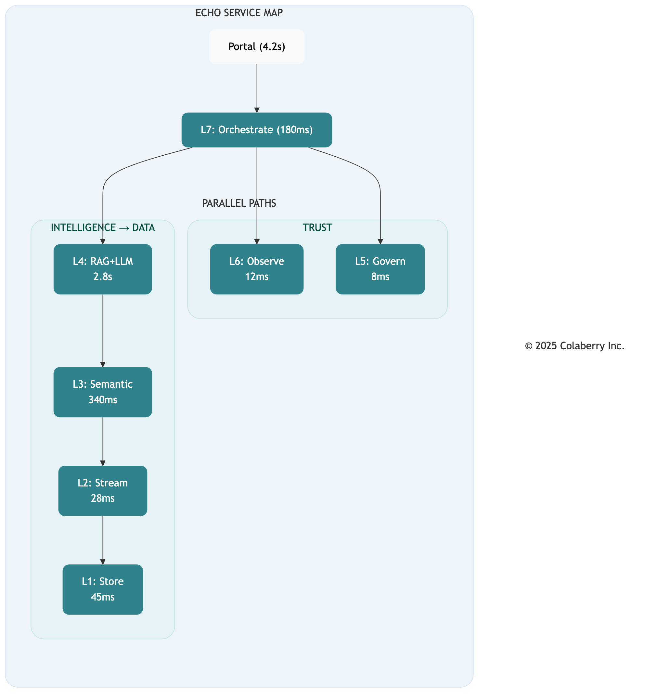

Echo deployed OpenTelemetry instrumentation across all seven layers during Week 9, with Datadog APM providing visualization and alerting.

The service map reveals latency distribution: Layer 4 (RAG + LLM) dominates at 2.8 seconds P95, representing 67% of total request time. This visibility enabled Echo to focus optimization on LLM generation rather than infrastructure layers.

**Implementation Results:**
- **Token Tracking:** 73% of latency came from LLM generation, not retrieval
- **Prompt Versioning:** Accuracy improved from 94.2% to 95.6% after clinical reasoning prompt update
- **Cache Analytics:** 34% of queries identified as near-duplicates suitable for caching

**Datadog Integration:** APM agents deployed alongside application services, with custom dashboards for:
- Query latency by layer (P50, P95, P99)
- LLM cost per query (breakdown by model)
- Cache hit rates (semantic cache, RAG cache)
- HITL escalation volume and resolution time
- Error rates by category

**Alert Configuration:**
- Latency: P95 > 3s triggers warning, P95 > 5s triggers page
- Cost: Daily spend > 120% of baseline triggers review
- Quality: Accuracy drop > 5% triggers investigation
- Errors: Error rate > 2% triggers immediate response


### Visibility Achieved

With Layer 6 operational, Echo gained unprecedented visibility into agent operations. Complete request traces now show timing for every layer when latency spikes occur, engineers immediately identify whether the bottleneck is semantic parsing, governance checks, vector search, or LLM generation.

**Cost Visibility Example:**
Monthly LLM spend of $26,000 now decomposed:
- Claude Sonnet 4: $18,200 (clinical reasoning queries)
- GPT-4 Turbo: $4,100 (complex analytical queries)
- Llama 3.1: $2,400 (simple lookups, cached prompt responses)
- Embedding generation: $1,300 (OpenAI ada-002)

This visibility revealed optimization opportunity: 34% of clinical reasoning queries were cache-eligible but cache-missing due to minor prompt variations. Normalizing prompts increased cache hit rate from 85% to 91%, saving $3,100 monthly.

### INPACT Contribution

Layer 6 directly delivers **Transparent (T)**: from 3/6 to 6/6.

The three-point improvement reflects the shift from opaque operations to complete visibility:
- **Point 1:** Request tracing provides explainability so that users and operators can understand what happened and why
- **Point 2:** Quality monitoring provides confidence so that the organization knows system accuracy in real-time
- **Point 3:** Cost attribution provides accountability so that every dollar of LLM spend traces to specific use cases

Combined, these capabilities transform agents from black boxes into transparent systems where every decision has an explanation and every trend has visibility.

**Operational Metrics:**

| Metric | Target | Critical Threshold |
|--------|--------|-------------------|
| Trace Completeness | >99% | <95% |
| Dashboard Latency | <5s refresh | >30s |
| Alert False Positive Rate | <5% | >15% |
| Cost Attribution Coverage | 100% | <90% |

---

## PART 5: LAYER 7 - THE ORCHESTRATOR

Layer 7 delivers multi-agent coordination: the capability for specialized agents to work together on complex queries that span multiple domains.

Layer 7 is the orchestrator. It turns multiple agents into one coherent answer.


**Figure 6.9: Layer 7 Orchestration Architecture**


### Why Agents Need Orchestration

Single-agent architectures work well for focused queries: "What is this patient's latest A1C?" routes to the clinical agent, retrieves the lab result, and returns an answer. But healthcare workflows rarely involve single domains. A discharge planning query: "prepare this patient for discharge" requires care coordination (scheduling follow-up appointments), clinical documentation (summarizing the stay and medications), and revenue cycle (verifying insurance coverage and authorizations). Three domains, three specialized knowledge bases, one coherent answer needed.

The alternative to orchestration is decomposition, forcing users to break complex queries into simple components, submit them separately, and manually integrate the results. This approach has three problems:

**Cognitive Load:** Users must understand system boundaries to phrase queries correctly. Asking "prepare this patient for discharge" when the system only handles clinical questions forces the user to rephrase: "What medications is this patient on? What follow-up appointments are scheduled? Is insurance coverage verified?" The AI should handle decomposition, not the human.

**Context Loss:** Sequential queries lose context. When a user asks about medications, then asks about appointments, the second query doesn't know the first query's results unless the user manually includes them. Orchestration maintains a shared state across agent boundaries.

**Latency Multiplication:** Sequential queries multiply latency. If each domain query takes 2 seconds, three sequential queries take 6 seconds minimum. Orchestration allows parallel execution, so that the same three queries complete in 2-3 seconds total.

### Technologies and Approaches

Orchestration solves the multi-domain problem through structured coordination:

**Supervisor Pattern:** A coordinating agent classifies query intent, routes to specialized agents, and synthesizes responses. The supervisor doesn't answer directly, it manages agents that do. This pattern reflects decades of research in multi-agent systems coordination.[11]

**Shared State:** All agents access common context about the current interaction, ensuring consistency across agent boundaries. When the clinical agent retrieves medication information, the revenue agent sees that context without re-querying.

**Conditional Routing:** Query characteristics determine which agents activate. Simple queries route to single agents. Complex queries activate multiple agents in parallel or sequence.

**LangGraph** models agent workflows as graphs. Nodes are agents, edges are transitions.[12] This builds on research showing structured workflows outperform unstructured approaches.[13]

```python
# Simplified LangGraph workflow definition
from langgraph.graph import StateGraph

workflow = StateGraph(AgentState)
workflow.add_node("supervisor", supervisor_agent)
workflow.add_node("care", care_coordination_agent)
workflow.add_node("clinical", clinical_documentation_agent)
workflow.add_node("revenue", revenue_cycle_agent)
workflow.add_conditional_edges("supervisor", route_to_agents,
    {"care": "care", "clinical": "clinical", "revenue": "revenue"})
```

**Coordination Patterns:**

1. **Supervisor Pattern:** Central coordinator routes to specialists and synthesizes responses. Echo uses this to classify intent into care, clinical, revenue, or multi-domain categories.

2. **Sequential Pattern:** Agents process in order, each enriching shared state. Example: prior authorization workflow where clinical gathers diagnosis, revenue checks coverage, authorization submits to payer.

3. **Parallel Pattern:** Multiple agents process simultaneously, latency equals slowest agent. Echo dispatches multi-domain queries to all three agents in parallel.

**State Management:** Redis with 15-minute TTL provides shared context across agents.[14] State includes query context, intermediate results, session history, and coordination metadata. (TTL configurable per use case.)

**Error Handling:** 10-second agent timeouts, partial failure responses with clear indication, graceful degradation when agents are unavailable.

### Echo's Gap Before Layer 7

Echo's pilot supported only single-agent queries. Complex requests failed:

**User:** "Prepare discharge summary, follow-up appointments, and insurance verification."  
**System:** "I can help with clinical documentation. For scheduling and insurance, please contact the respective departments."

The clinical agent did its job correctly, but the system couldn't orchestrate across domains.

Dr. Chen's Week 7 feedback captured the frustration: "Every complex question becomes three simple questions I have to ask separately. That's not assistance. It's a to-do list generator. I spend more time managing the AI than I would spend doing the work manually."

Pilot usage data confirmed: high engagement for simple lookups but declining engagement for complex workflows. Users tried multi-domain queries once, received fragmented responses, and stopped asking.

### Echo's Implementation

Echo deployed Layer 7 across Week 10 with the following architecture:

**LangGraph Framework:** Deployed as the orchestration layer, managing agent coordination through graph-based workflows.[12]

**Three Specialized Agents:**

1. **Care Coordination Agent:** Handles scheduling, appointment management, care team communication, and follow-up planning. Integrated with Epic scheduling APIs and provider directory.

2. **Clinical Documentation Agent:** Handles medical records, medication summaries, lab results, and clinical narratives. Integrated with Epic EHR and document management systems.

3. **Revenue Cycle Agent:** Handles insurance verification, prior authorization, coverage determination, and financial counseling referrals. Integrated with claims management and payer portals.

**Supervisor Design:** Intent classification determines routing:
- Single-domain queries → direct routing to relevant agent
- Multi-domain queries → parallel or sequential execution with synthesis
- Ambiguous queries → clarification request

**Governance Integration:** All agent operations pass through Layer 5 ABAC evaluation. The orchestration layer doesn't bypass governance. It coordinates with governance-approved operations.

**Observability Integration:** All agent operations generate OpenTelemetry traces. The orchestration layer provides visibility into coordination patterns, not opacity.


### The Multi-Agent Moment

Friday, Week 10. 4:47 PM.

Sarah watched the terminal as Jamie Rodriguez submitted the test query:

**Query:** "Patient Maria Santos, MRN 78234156, is being discharged today following hip replacement surgery. Schedule post-discharge follow-up, medication review, and verify insurance coverage."

The orchestration layer activated. Intent classification identified three domains: Care (follow-up scheduling), Clinical (medication review), Revenue (insurance verification). The supervisor delegated the request to all three agents in parallel.

**Care Coordination Agent (2.1s):**
- Scheduled follow-up: Orthopedics, Dr. Kim, next Tuesday 10:00 AM
- Scheduled physical therapy evaluation: Thursday 2:00 PM
- Confirmed patient transportation preferences

**Figure 6.10: Multi-Agent Query Flow - Maria Santos Discharge**


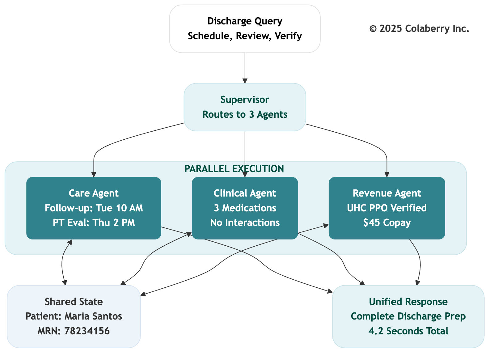

**Clinical Documentation Agent (1.8s):**
- Medication summary: 3 active prescriptions post-surgery
- Drug interaction check: No high-risk interactions detected
- Discharge instructions: Prepared and staged for review

**Revenue Cycle Agent (2.3s):**
- Insurance verified: UnitedHealthcare PPO
- Prior authorization: Not required for follow-up visits
- Patient responsibility estimate: $45 copay per visit

**Total Execution Time:** 4.2 seconds (parallel execution)

The supervisor synthesized the responses into a coherent discharge preparation summary. One query, three agents, one coordinated answer.

The Datadog trace showed the complete flow, intent classification and routing (~400ms), parallel agent execution (2.3s slowest path), state synchronization and synthesis (~1.5s). Every layer visible. Every agent auditable. Every decision traceable.

Marcus checked the governance log. All three agents had passed ABAC evaluation. No HITL escalations triggered. Medication review found no Warfarin-class drugs. Clean execution.

"This is what we built for," Sarah said quietly. "Three agents, one response, complete care coordination."

The room was silent for a moment. Then Jamie grinned. "**The Architecture of Trust** is operational. Now we need to prove it would stay that way."


### INPACT Contribution

Layer 7 doesn't directly add points to the INPACT score. The 86/100 score is achieved through Layers 5-6 improvements to Permitted and Transparent. But orchestration enables INPACT dimensions at scale:

**Instant (I):** Multi-agent workflows complete in seconds through parallel execution. Without orchestration, the same tasks would require sequential human navigation across systems in minutes instead of seconds.

**Natural (N):** Users ask complex questions naturally. "Prepare for discharge" doesn't require understanding system boundaries. Orchestration handles decomposition invisibly.

**Contextual (C):** Shared state ensures all agents operate with full patient context. The revenue agent knows what medications the clinical agent found. Context doesn't get lost crossing agent boundaries.

Orchestration readiness is what makes 86/100 "production-ready." The score reflects capability. Orchestration reflects scalability.

**Operational Metrics:**

| Metric | Target | Critical Threshold |
|--------|--------|-------------------|
| Orchestration Success Rate | >95% | <90% |
| Multi-Agent Latency | <5s | >10s |
| State Consistency | 100% | <99% |
| Agent Timeout Rate | <2% | >5% |

---

## PART 6: TRUST THROUGH TRANSPARENCY

Trust is the outcome. Transparency is the mechanism.[15]

**How the seven layers create transparency:**
- **Layers 1-2:** Data availability and freshness (agents citing outdated data lose trust)
- **Layers 3-4:** Understanding and reasoning (each stage instrumentable, traceable)
- **Layers 5-6:** Safety and visibility (black boxes become glass boxes)
- **Layer 7:** Coordination without opacity

**The Three Transparency Mechanisms:**

**Citations:** Every factual claim includes its source. When Echo's agent reports "Patient's A1C was 7.2%," the response includes: Epic Labs, MRN reference, timestamp. Users can verify. Agents can't hallucinate what they must cite.[16]

**Explainability:** HITL escalations include reasoning: "Risk score 8/10. Trigger: Warfarin + drug interaction. Policy requires pharmacist review." Users see reasoning they can evaluate.

**HITL as Trust Feature:** Systems that know when to ask for help earn trust. HITL isn't a failure mode. It communicates: "This system knows its limits."

**Echo's Response Format:**
> **Query:** Maria Santos's medication list?  
> **Response:** 3 active prescriptions [Source: Epic Orders, 11/24/2025]  
> **Confidence:** High (primary EHR, updated within 24 hours)  
> **Governance:** Auto-approved (no high-risk flags)

---

## PART 7: ECHO'S WEEK 8-10 BUILD

### Week 8: Governance Foundation

Marcus Williams led policy development, working with compliance to translate regulatory requirements into OPA rules. 247 policies emerged from sessions that felt like contract negotiations. Clinical operations wanted flexibility. Compliance wanted constraints.

Thursday brought the first policy conflict: a scheduling rule required department-head approval for cross-department appointments, but care coordination needed to schedule cardiology follow-ups without manual approval. Resolution: explicit "care coordination workflow" exception with enhanced audit logging.

By Friday, 193 of 247 policies were deployed. The remaining 54 covered edge cases requiring additional review.

### Week 9: Observability Operational

The observability build proceeded faster than planned. Echo's Layer 4 already had basic OpenTelemetry tracing. Extending to all seven layers required consistent patterns, not greenfield development. By Wednesday, trace completeness exceeded 98%.

Thursday afternoon brought the first HITL escalation in production - the Warfarin scenario. The trace told the complete story:
- T+0ms: Query received
- T+23ms: Governance evaluation (risk score: 8, trigger: Warfarin-class medication)
- T+24ms: HITL escalation initiated
- T+47,234ms: Human approval received (Dr. Chen)
- T+47,456ms: Response delivered

"That's not a test," Sarah noted. "That's production."

### Week 10: Orchestration Complete

The three agents had been in design since Week 8. Week 10 was production integration: connecting agents to LangGraph, implementing shared state, testing coordination patterns.

Tuesday brought integration failures. Epic rate limits and payer disambiguation issues. Normal problems with normal fixes.

Wednesday-Thursday: 47 test scenarios across single-domain, dual-domain, triple-domain, error handling, and HITL integration. All passed by Thursday evening.

Friday, 4:47 PM. The Maria Santos discharge query succeeded. Three agents. One response. Architecture complete.

**Figure 6.11: Echo's Week 8-10 Timeline**


**Figure 6.12: INPACT Score™ Transformation (Week 7: 67 → Week 10: 86)**


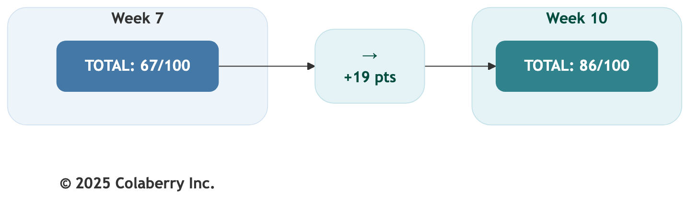
**INPACT Dimension Changes:**

| Dimension | Week 7 | Week 10 | Change | Enabling Layer |
|-----------|--------|---------|--------|----------------|
| **I** (Instant) | 5/6 | 5/6 | NA | NA |
| **N** (Natural) | 5/6 | 5/6 | NA | NA |
| **P** (Permitted) | 2/6 | 6/6 | **+4** | Layer 5: Governance |
| **A** (Adaptive) | 5/6 | 5/6 | NA | NA |
| **C** (Contextual) | 5/6 | 5/6 | NA | NA |
| **T** (Transparent) | 3/6 | 6/6 | **+3** | Layer 6: Observability |
| **Total** | **67/100** | **86/100** | **+19** | + Orchestration Readiness |

### The Metrics That Matter

**Week 10 Final Status:**

| Metric | Target | Achieved |
|--------|--------|----------|
| INPACT Score | 86/100 | 86/100 |
| Policy Coverage | 95% | 98% (242/247 policies) |
| Trace Completeness | 99% | 99% |
| Orchestration Success | 95% | 96% |
| HITL Resolution Time | <2 min | 47s average |
| Multi-Agent Latency | <5s | 4.2s average |

<!-- pagebreak -->

### Investment Summary: Phase 3

**Phase 3 Investment ($380K budget / $82K actual):**

| Component | Technology | Services | Total |
|-----------|------------|----------|-------|
| Layer 5 (Governance) | $0 | $15K | $15K |
| Layer 6 (Observability) | $24K | $10K | $34K |
| Layer 7 (Orchestration) | $6K | $27K | $33K |
| **Phase 3 Total** | **$30K** | **$52K** | **$82K** |

**Layer 5 Detail ($15K):**
- OPA Policy Engine: $0 (open source)
- Policy development: $8,000 (40 hours consulting)
- Integration testing: $5,000
- HITL workflow tooling: $2,000

**Layer 6 Detail ($34K):**
- Datadog licensing: $24,000/year
- OpenTelemetry instrumentation: $6,000 (development)
- Custom dashboards: $4,000 (development)

**Layer 7 Detail ($33K):**
- LangGraph: $0 (open source)
- Redis state management: $6,000/year
- Agent orchestration integration: $18,000 (retrofitting existing agents)
- Integration testing: $9,000

**Phase 3 Operational Costs:**
- Monthly: $2,500 (Datadog: $2,000 + Redis: $500)
- Annual: $30,000

**Cumulative Investment:**

| Phase | Weeks | Budgeted | Actual | Chapter |
|-------|-------|----------|--------|---------|
| Phase 1: Foundation | 1-4 | $470K | $468K | Chapter 4 ✓ |
| Phase 2: Intelligence | 5-7 | $380K | $392K | Chapter 5 ✓ |
| Phase 3: Trust + Orchestration | 8-10 | $380K | $82K | **This Chapter** ✓ |
| **Total through Week 10** | | **$1,230K** | **$942K** | **23% under budget** |

**Remaining:** Phase 4 validation (~$50K) and $238K buffer for contingency.

*Use the Stack Builder at trustbeforeintelligence.ai/tools for investment planning and ROI estimation.*
---
<!-- pagebreak -->

## PART 8: THE FINISH LINE

### The Budget Surprise

Friday, Week 10. 4:30 PM.

Krish Yadav, Echo's CFO, pulled up the Phase 3 actuals on his laptop. He'd allocated $380,000 for the trust and orchestration layers, the same budget methodology that had proven accurate for Phases 1 and 2. What he saw made him scroll back to double-check.

$82,000.

"Sarah, walk me through this," he said, turning his screen toward her. "We budgeted $380K. We spent $82K. That's not a rounding error. That's 78% under budget."

Sarah smiled. "Three factors. First, OPA is open source. We budgeted $137K for a commercial policy engine we didn't need. Second, we already had Datadog licensing from the infrastructure team.$33K we didn't have to spend. Third, the agents themselves. Remember the $2M in failed pilots?"

Krish nodded. The failed pilots had been a recurring topic in board meetings.

"Those agents still work. The logic is sound, the Epic integrations are built, the clinical workflows are mapped. What failed was the infrastructure underneath them. We didn't rebuild the agents. We retrofitted them onto infrastructure that finally fulfills their needs. That saved $128K in development costs."

Krish studied the numbers. "So the original pilots weren't a wasted investment."

"They were premature investments. The agents were ready. The infrastructure wasn't. Now it is."

### The Seven-Layer Achievement


**Figure 6.13: Complete 7-Layer Agent-Ready Architecture**


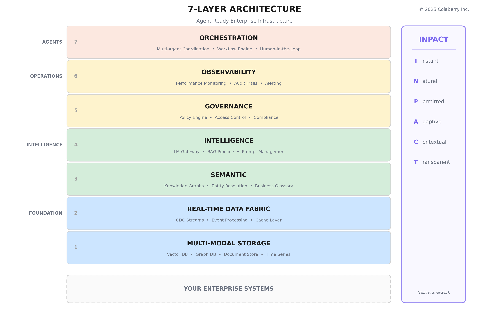

<!-- pagebreak -->

Week 10, Friday, 5:15 PM.

Sarah Cedao stood at the whiteboard one final time. The three words from Week 8 Monday remained: **GOVERNANCE. OBSERVABILITY. ORCHESTRATION.** Each now had a checkmark beside it.

Seventy days. Seven layers. From 28/100 to 86/100.

**The Architecture of Trust - Two Pillars Complete**

### What Echo Achieved

The journey started with a simple question: Why do 95% of agent projects fail? The answer was TRUST. The infrastructure gap between what agents could theoretically do and what organizations could safely let them do.

Echo closed that gap. Layer by layer, week by week, capability by capability. The complete transformation metrics are detailed in the Chapter Summary.

### The Seven Gaps: Resolved

The gaps identified in Chapter 3 are all resolved. All seven layers operational. The architecture is complete. (See Chapter Summary for the complete gap resolution table.)

### The ROI Preview

Krish Yadav, Echo's CFO, reviewed the numbers Friday evening:

**Investment:** $942,000 actual against $1.23M budget (23% under, with Phase 4 validation pending)  
**First-Year Value:** $3.8M (209% ROI)  
**18-Month Projected Value:** $5.87M (477% ROI)  
**Break-even Timeline:** 10 weeks post-deployment

"We spent $298,000 less than projected," Krish noted. "And the architecture is production-ready two weeks ahead of the board presentation. That never happens."

The remaining two weeks, Weeks 11-12, would validate these projections through operational deployment and measurement. Chapter 8 will document that validation. But the infrastructure prerequisite was complete.

---

## CHAPTER SUMMARY

| Part | Content | Key Takeaway |
|------|---------|--------------|
| **Part 1** | The Trust Risk | Intelligence without governance, observability, or orchestration is risk |
| **Part 2** | The Final Sprint | Week 8-10 planning: $82K budget, three layers, 67→86 target |
| **Part 3** | Layer 5 - Governance | ABAC + HITL for dynamic, context-aware authorization |
| **Part 4** | The Warfarin Scenario | AI drafts recommendations, humans approve high-risk decisions |
| **Part 5** | Layer 6 - Observability | Distributed tracing, MLOps monitoring, LLM cost tracking |
| **Part 6** | Layer 7 - Orchestration | Multi-agent coordination via LangGraph supervisor pattern |
| **Part 7** | Echo's Week 8-10 Build | Three-week implementation achieving 86/100 INPACT |
| **Part 8** | Architecture Complete | All 7 gaps closed, $942K invested, production ready |

### Key Takeaways

1. **Trust requires governance:** ABAC and HITL ensure agents operate within appropriate boundaries. The Warfarin scenario demonstrated this: AI drafts recommendations, humans approve high-risk decisions.

2. **Trust requires transparency:** Distributed tracing transforms black boxes into glass boxes. When systems fail or costs spike, operators need to understand why.

3. **Scale requires orchestration:** Multi-agent coordination supports complex workflows like discharge planning across scheduling, clinical and revenue that single agents cannot address.

4. **The 7-Layer Architecture is complete:** Foundation (Layers 1-2), Intelligence (Layers 3-4), and Trust + Orchestration (Layers 5-6-7) together create production-ready infrastructure.

5. **Architecture is a milestone, not a destination:** The 86/100 INPACT score represents capability. The GOALS Framework™ in Chapter 7 measures operational reality.

<!-- pagebreak -->

### What Changed from Week 0 to Week 10

The complete transformation closed all seven gaps across three phases:

| Phase | Weeks | Layers | INPACT | Investment |
|-------|-------|--------|---------|------------|
| Foundation (Ch 4) | 1-4 | 1-2 | 28→42 | $468K |
| Intelligence (Ch 5) | 5-7 | 3-4 | 42→67 | $392K |
| Trust + Orchestration (Ch 6) | 8-10 | 5-7 | 67→86 | $82K |
| **Total** | **10 weeks** | **7 layers** | **28→86** | **$942K** |

(See Chapters 4-5 for detailed phase breakdowns. Phase 4 validation in Weeks 11-12: ~$50K pending. Gap resolution details in Part 1.)

### Echo Week 10 Status

| Metric | Week 0 | Week 10 | Improvement |
|--------|--------|---------|-------------|
| **INPACT Score** | 28/100 | 86/100 | +58 points |
| **Total Investment** | $0 | $942,000 | 23% under budget |
| **Architecture Layers** | 0/7 | 7/7 | Complete |
| **Gaps Remaining** | 7 | 0 | All resolved |

### Technologies Deployed (Chapter 6)

**Layer 5:** OPA (Open Policy Agent)[2], ABAC framework per NIST 800-162[3]

**Layer 6:** OpenTelemetry[6], Datadog APM[10]

**Layer 7:** LangGraph[12], Redis[14]

### What's Next

**Chapter 7:** GOALS Framework
- Operational excellence methodology
- Five measurement dimensions
- Echo Weeks 11-12: Validation and optimization
- Board presentation preparation

---

## REFERENCES

[1] National Institute of Standards and Technology. (2023). "AI Risk Management Framework (AI RMF 1.0)." https://www.nist.gov/itl/ai-risk-management-framework

[2] Cloud Native Computing Foundation. (2024). "Open Policy Agent." https://www.openpolicyagent.org

[3] National Institute of Standards and Technology. (2014). "Guide to Attribute Based Access Control (ABAC) Definition and Considerations." NIST Special Publication 800-162. https://csrc.nist.gov/publications/detail/sp/800-162/final

[4] Amershi, S., Weld, D., Vorvoreanu, M., et al. (2019). "Guidelines for Human-AI Interaction." *Proceedings of the 2019 CHI Conference on Human Factors in Computing Systems*. https://dl.acm.org/doi/10.1145/3290605.3300233

[5] U.S. Food and Drug Administration. (2024). "Artificial Intelligence and Machine Learning in Software as a Medical Device." https://www.fda.gov/medical-devices/software-medical-device-samd/artificial-intelligence-and-machine-learning-software-medical-device

[6] Cloud Native Computing Foundation. (2024). "OpenTelemetry." https://opentelemetry.io/docs/concepts/instrumentation/

[7] Sigelman, B. H., Barroso, L. A., Burrows, M., et al. (2010). "Dapper, a Large-Scale Distributed Systems Tracing Infrastructure." Google Technical Report. https://research.google/pubs/pub36356/

[8] Sculley, D., Holt, G., Golovin, D., et al. (2015). "Hidden Technical Debt in Machine Learning Systems." *Advances in Neural Information Processing Systems*, 28. https://papers.nips.cc/paper/2015/hash/86df7dcfd896fcaf2674f757a2463eba-Abstract.html

[9] Anthropic. (2024). "Claude Pricing." https://www.anthropic.com/pricing

[10] Datadog. (2024). "Application Performance Monitoring." https://www.datadoghq.com/product/apm/

[11] Wooldridge, M. (2009). *An Introduction to MultiAgent Systems* (2nd ed.). John Wiley & Sons. ISBN: 978-0470519462. https://www.wiley.com/en-us/An+Introduction+to+MultiAgent+Systems,+2nd+Edition-p-9780470519462

[12] LangChain. (2024). "LangGraph: Build Stateful, Multi-Agent Applications." https://github.com/langchain-ai/langgraph

[13] Yao, S., Zhao, J., Yu, D., et al. (2023). "ReAct: Synergizing Reasoning and Acting in Language Models." *International Conference on Learning Representations (ICLR)*. https://arxiv.org/abs/2210.03629

[14] Redis. (2024). "Redis Documentation." https://redis.io/docs/latest/integrate/redis-data-integration/data-pipelines/transform-examples/redis-expiration-example/

[15] Jacovi, A., Marasović, A., Miller, T., & Goldberg, Y. (2021). "Formalizing Trust in Artificial Intelligence: Prerequisites, Causes and Goals of Human Trust in AI." *Proceedings of the 2021 ACM Conference on Fairness, Accountability, and Transparency*, 624-635. https://arxiv.org/abs/2010.07487

[16] Gao, Y., Xiong, Y., Gao, X., et al. (2024). "Retrieval-Augmented Generation for Large Language Models: A Survey." *arXiv preprint arXiv:2312.10997*. https://arxiv.org/abs/2312.10997
# Chapter 7: The GOALS Framework™
## The Five Dimensions of Operational Excellence

---

## The Sustainability Question

*Week 11, Monday, 8:00 AM  
Echo Health Systems, Technology Center  
Two days after architecture completion*

Sarah Cedao stood at the window, coffee in hand, watching the campus come alive. Friday's celebration felt distant now. The champagne toasts, the congratulations, the sense of accomplishment. All of it overshadowed by a single question.

Dr. Raj had asked it during Friday's board briefing, right after the applause died down.

"How do you know it stays trustworthy?"

Sarah had answered with architecture. Layers, integrations, security controls. Dr. Raj nodded politely, then asked again: "I understand what you built. But how do you know it *keeps working* six months from now? A year from now?"

She didn't have an answer.

All seven layers operational. Every infrastructure gap closed. INPACT score: 86/100. $992K invested, 19% under the $1.23M budget. Ten weeks of focused execution. The architecture was complete.

But Dr. Raj was right. They'd built a hospital. Now they needed to run it.

Built isn't enough. Operational excellence is what sustains trust.

**This chapter builds the third pillar: GOALS.**

---

**Figure 7.1: GOALS Framework - From Build Complete to Operate Continuously**


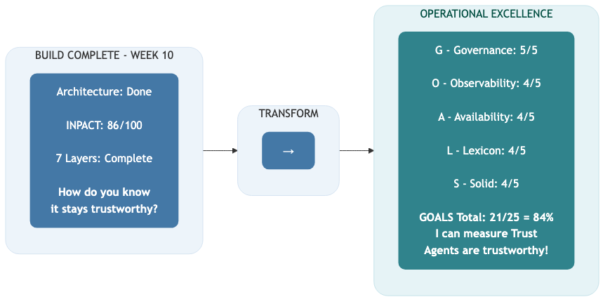
> **Key Takeaway:** *"Building is a 90-day project. Operating is forever."* - Dr. Arun Raj

## Part 1: The Architecture Is Complete. Now What?

### The Second Pillar Complete

Six chapters brought us here.

Chapter 0 introduced the Architecture of Trust: three pillars working together to transform infrastructure into agent-ready systems. Chapters 1-2 built the first pillar: INPACT, defining the six needs agents require for trusted operation. Chapters 4-6 built the second pillar: the 7-Layer Architecture, the technical blueprint that fulfills those needs.

Last week, Echo Health completed that second pillar. Layer 7 orchestration went live. All seven layers are operational. The architecture, beautifully designed and expertly constructed, stood complete.

**Figure 7.2: Echo's 90-Day Journey-Architecture Complete**


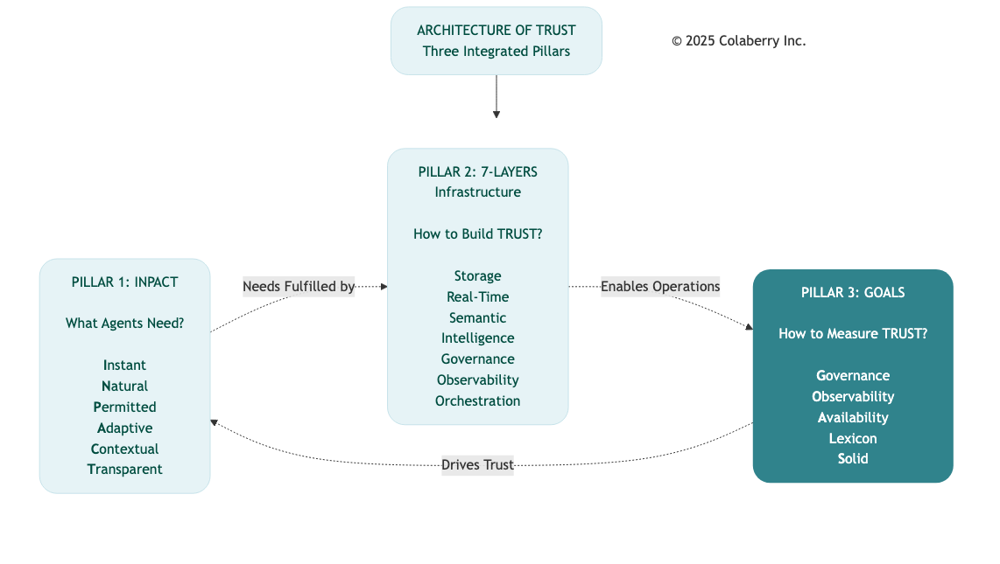

But architecture alone doesn't create trust. Buildings need maintenance. Vehicles need service. Infrastructure needs operational discipline.

### Building and Operating Are Different Disciplines

Marcus Williams, Echo's CDO and the architect of their transformation, joined Sarah at the window.

"You're thinking about Dr. Raj's question," he said.

"I've been thinking about nothing else. We built something remarkable. But building and running are different disciplines."

Marcus nodded slowly. "I've been researching exactly that problem. Not just operational best practices, but what regulators will require. The EU AI Act classifies clinical AI as 'high-risk.' NIST has published an AI Risk Management Framework. I've mapped what auditors will demand." [16] [17]

He pulled up a document on his tablet.

**Table: Regulatory Requirements for High-Risk Clinical AI**

| Regulatory Requirement | EU AI Act (2024/1689) | NIST AI RMF 1.0 | What Auditors Will Ask |
|------------------------|----------------------|-----------------|------------------------|
| **Risk Management** | Art. 9 (Risk Management System) | GOVERN 1.1, 1.2 | "Show me your documented policies and human-in-loop controls" |
| **Continuous Monitoring** | Art. 12 (Record-Keeping), Art. 19 (Logs), Art. 72 (Post-Market) | MEASURE 2.11, MANAGE 4.1 | "How do you detect incidents and track performance?" |
| **System Reliability** | Art. 15 (Accuracy, Robustness, Cybersecurity) | MAP 3, MEASURE functions | "What are your uptime guarantees and failover capabilities?" |
| **Transparency** | Art. 13 (Transparency), Art. 11 (Documentation) | MAP 5.1, GOVERN 1.2 | "Can users understand why the AI made this recommendation?" |
| **Data Governance** | Art. 10 (Data and Data Governance) | MAP 4, GOVERN 6 | "How do you ensure data quality and detect bias?" |

"Five categories," Marcus said. "Risk management. Monitoring. Reliability. Transparency. Data governance. Every high-risk AI system in healthcare will be audited against these requirements. The EU AI Act enforcement begins in 2025, with penalties up to €35 million or 7% of global revenue."

Sarah studied the table. "So this isn't about best practices anymore. It's about compliance."

"Exactly. And that's what drove me to develop a framework that maps directly to these requirements." Marcus set down the tablet. "But before I show you what I've built, let me ground it in a metaphor."

He continued. "Construction workers build hospitals. But hospitals need operational staff to keep them running: nurses, administrators, maintenance crews. We've been construction workers for ten weeks. Starting Monday, we need to become operators."

The metaphor crystallized what Sarah had been feeling. The 7-layer architecture was their hospital, beautifully designed and expertly constructed. But without operational excellence, even the best building deteriorates.

"The board will want to see that we can sustain this," Sarah said. "Dr. Raj will ask again at the Week 12 presentation."

"Then we need a framework for thinking about operational excellence," Marcus replied. "Something as rigorous as INPACT was for defining agent needs, but focused on sustainability rather than capability."

### From INPACT to GOALS

Sarah turned to face him. "You've been thinking about this."

"I've developed a framework for thinking about this systematically," Marcus said. "I call it GOALS: Governance, Observability, Availability, Lexicon, and Solid." [12]

He walked to the whiteboard and sketched five interconnected circles.

"INPACT defines what agents *need*: the six requirements for trusted operation. The 7-layer architecture defines what you *build*: the technical infrastructure that fulfills those needs. GOALS defines what you *maintain*: the five dimensions of operational excellence that keep the architecture trustworthy over time."

Sarah nodded. The construction metaphor made sense. They'd built a hospital. Now they needed to run it.

**The Architecture of Trust: Three Pillars**

| Pillar | Framework | Purpose | When Applied |
|--------|-----------|---------|--------------|
| **Pillar 1** | INPACT | What agents NEED (6 trust requirements) | Assessment & Design |
| **Pillar 2** | 7-Layer Architecture | What you BUILD (technical infrastructure) | Construction |
| **Pillar 3** | GOALS | What you MAINTAIN (operational excellence) | Operations |

**Figure 7.3: The Architecture of Trust-Three Integrated Pillars**

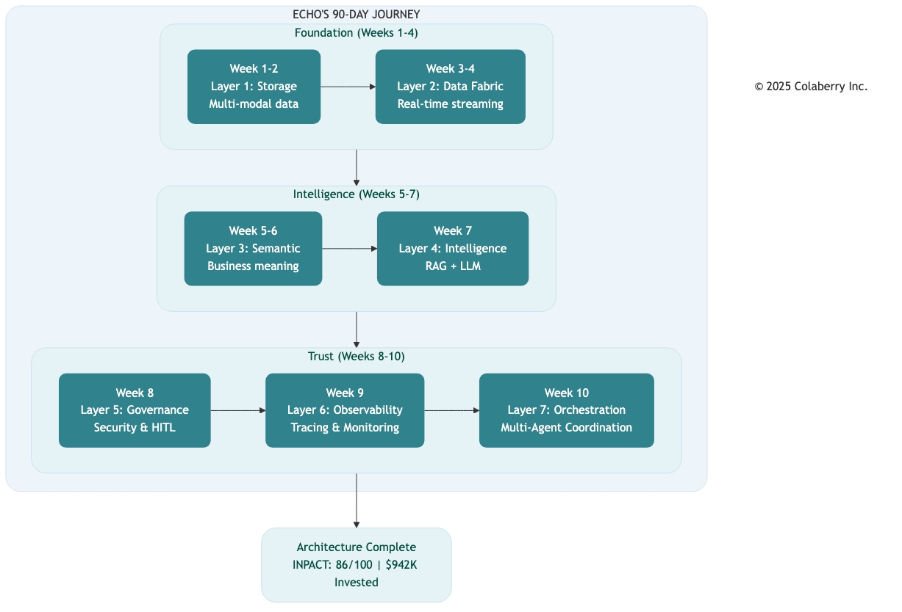

### Why Three Pillars, Not Two?

Dr. Chen raised the question many would ask: "Why do we need GOALS separately? Isn't observability already built into Layer 6? Isn't governance already in Layer 5?"

Marcus nodded. He'd anticipated this. "Layer 6 gives you the *capability* to observe. GOALS gives you the *targets* for what good looks like. A hospital can have monitoring equipment in every room. That's capability. But without target vital signs, nurses don't know when to intervene."

He pointed to the architecture diagram. "The 7-Layer Architecture tells you *what* to build. GOALS tells you *how well* it's working. They're complementary, not redundant."

Sarah added the business perspective: "We can have all seven layers operational and still fail in production if we're not measuring the right things. INPACT defines success. The architecture enables success. GOALS *validates* success."

### The Cross-Pillar Connection

Marcus expanded on the integration. "Each GOALS dimension validates specific INPACT needs by measuring specific 7-Layer components."

**Table: Cross-Pillar Mapping-How the Three Pillars Connect**

| GOALS Dimension | Validates INPACT Need | Measures 7-Layer Component |
|------------------|------------------------|---------------------------|
| **G** (Governance) | **P** (Permitted) | Layer 5: Policy Engine |
| **O** (Observability) | **T** (Transparent) | Layer 6: Observability |
| **A** (Availability) | **I** (Instant) | Layer 2: Real-Time Fabric |
| **L** (Lexicon) | **N** (Natural), **C** (Contextual) | Layer 3: Semantic Layer |
| **S** (Solid) | **A** (Adaptive) | Layer 1: Storage Foundation |

"When Governance scores drop," Marcus explained, "it signals the Permitted need is degrading and points to Layer 5 as the problem area. When Lexicon scores drop, Natural language understanding is failing. Check Layer 3. GOALS isn't just measurement. It's a diagnostic framework that traces operational issues back to their architectural roots."

Dr. Chen saw the elegance. "So GOALS closes the loop. INPACT defines what users need. The architecture fulfills those needs. GOALS proves the fulfillment is working and tells us where to look when it isn't."

"Exactly," Marcus confirmed. "Three pillars, one Architecture of Trust."

### The Trust Equation

Sarah synthesized what she was hearing into a formula:

> **TRUSTED AGENTS = INPACT (What They Need) + 7-Layer (How You Build) + GOALS (How You Sustain)**

"For Echo, that means:"
- **INPACT:** 86/100 capability achieved
- **7-Layer:** 7/7 layers operational  
- **GOALS:** Target 21/25 for sustainability

"All three must be in place," she said. "Capability without sustainability degrades. Infrastructure without measurement is blind. Measurement without architecture has nothing to measure."

Sarah studied the diagram. "So our 86/100 INPACT score measures *capability*, what our infrastructure can do. But we need a different metric for *sustainability*, our ability to maintain that capability."

"Exactly. And that's what GOALS provides."

### The Scoring Philosophy

"Why five points per dimension?" the compliance officer asked.

"Because operational excellence isn't binary," Marcus explained. "You don't just 'have' governance or not. There are levels of maturity."

He sketched the progression:

**1/5 - Absent:** No formal capability
**2/5 - Basic:** Minimal implementation, reactive
**3/5 - Developing:** Structured but incomplete
**4/5 - Proficient:** Comprehensive, mostly automated
**5/5 - Advanced:** Full automation with continuous improvement

"Healthcare specifically requires 4/5 minimum in all dimensions and 5/5 in Governance for clinical AI," Marcus added. "These aren't arbitrary thresholds. They're mandated by regulation. Below these operational thresholds, you're not just risking failure. You're risking non-compliance."


### The Interdependence Principle

Marcus drew connecting lines between the five circles on the whiteboard.

"Here's what makes GOALS different from a simple checklist. These aren't five independent dimensions. They're interconnected like vital organs. Weakness in one cascades to the others."

He traced the connections:

**Governance ↔ Observability:** Audit trails enable observability to track who accessed what. Observability detects policy violations that governance must address.

**Observability ↔ Availability:** Monitoring tracks response times and freshness. Real-time metrics feed back into observability systems.

**Observability ↔ Lexicon:** Drift detection identifies when semantic mappings diverge. Improved language understanding increases query accuracy metrics.

**Observability ↔ Solid:** Data quality monitoring detects issues. Reliable data enables effective observability.

**Availability ↔ Lexicon:** Fast retrieval enables natural conversations. Semantic optimization reduces query latency.

**Lexicon ↔ Solid:** Semantic validation catches data inconsistencies. Quality data improves entity resolution.

**Solid ↔ Availability:** Clean data enables faster queries. Fresh data maintains quality.

**Governance ↔ Solid:** Access policies protect data integrity. Audit completeness depends on sound data.

"This interconnection means you can't optimize one GOAL in isolation," Marcus explained. "Improving Lexicon might require investments in Solid. Enhancing Availability might surface Governance gaps. Maintaining all five requires holistic thinking."

## Part 2: Echo's Operational Challenge

Sarah gathered her extended team in the large conference room. Marcus Williams, CDO. Dr. Chen, clinical liaison. The engineering leads from each layer team. The compliance officer. The data quality manager.

"We built something remarkable," Sarah began. "In ten weeks, we went from a 28/100 INPACT score to 86/100. We constructed all seven layers of agent-ready infrastructure. We came in at $942K through Week 10, 23% under our $1.23M budget."

Nods around the room. Tired but satisfied faces.

"But Dr. Raj asked a question that we need to answer before the Week 12 board presentation: How do we know it *stays* trustworthy?"

The room grew quiet.

"Building infrastructure and operating infrastructure require different disciplines," Sarah continued. "For ten weeks, we've been construction workers. Starting today, we become operators. And that requires a framework for operational excellence."

She turned to Marcus. "Walk us through GOALS."

### The Five GOALS

Marcus stood and displayed the framework on the conference room screen.

"GOALS defines five dimensions of operational excellence for agent-ready infrastructure. Like vital organs in a body, each supports the others. Weakness in one cascades throughout the system."

**Table 1: The Five GOALS Dimensions**

| Dimension | Full Name | What It Covers |
|-----------|-----------|----------------|
| **G** | Governance: Security, Compliance & Control | ABAC, HITL workflows, audit trails, change management, model versioning with rollback |
| **O** | Observability: Monitoring, Cost & Maintainability | APM, distributed tracing, LLM cost tracking, alerting, drift detection, explainability |
| **A** | Availability: Speed, Freshness & Scale | Sub-2-second response, sub-30-second freshness, 10x scalability, 99.9%+ uptime |
| **L** | Lexicon: Semantic Understanding & Accuracy | Entity resolution, terminology mapping, query interpretation, ontology, disambiguation |
| **S** | Solid: Data Quality & Integrity | Accuracy, completeness, consistency, timeliness, schema validation |

"Each dimension has measurable targets," Marcus continued. "And each dimension connects to our INPACT requirements."

### Understanding the Gap

"What's our current GOALS Metrics™ health?" Dr. Chen asked, leaning forward. As clinical liaison, she needed to translate operational metrics into language the clinical staff would understand.

Marcus pulled up preliminary numbers. "Based on our Week 10 status, I'd estimate we're at about 75% GOALS Metrics health, that's 15 out of 25 possible points."

Sarah frowned. "But we just said INPACT is 86/100. Why the gap?"

"Different measurements for different purposes," Marcus explained. "INPACT measures whether infrastructure *can* fulfill agent needs: the capability we've built. GOALS measures whether we can *sustain* that capability over time: operational excellence. Think of it this way: we built a great car, but we haven't yet proven we can maintain it."

He pulled up a validation chart. "Colaberry's research is clear: proficiency across all five regulatory categories correlates with production success. Gaps lead to degraded outcomes. Major gaps lead to failure. We're at 15, below the 21-point threshold for proficiency across all five. That's why Weeks 11-12 matter so much."

"So the 86/100 INPACT score means we *can* support trusted agents," Dr. Chen said. "But the 15/25 GOALS Metrics score means we haven't proven we can *keep* them trusted."

"Exactly. The 10-point gap represents operational discipline we haven't yet established. By Week 12, we need GOALS at 21 or above."

**Table 2: Echo's GOALS Operational Health Baseline (Week 10)**
*Note: GOALS (max 25 points) measures operational sustainability, distinct from INPACT (max 100) capability score. Healthcare production requires 21+ GOALS points.*

**Figure 7.4: Echo's GOALS Health Dashboard (Week 10 Baseline)**


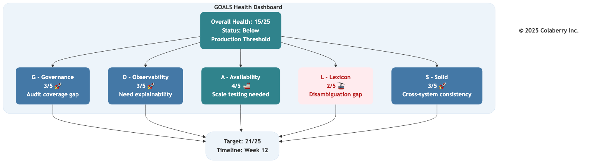
| GOAL | Current | Target | Gap | Priority |
|------|---------|--------|-----|----------|
| **G - Governance** | 3/5 | 5/5 | 2 | Week 11 |
| **O - Observability** | 3/5 | 4/5 | 1 | Week 11 |
| **A - Availability** | 4/5 | 4/5 | 0 | Maintain |
| **L - Lexicon** | 2/5 | 4/5 | 2 | Week 11-12 |
| **S - Solid** | 3/5 | 4/5 | 1 | Week 11 |
| **Total** | **15/25** | **21/25** | **6** | - |

"Let's go through each dimension," Sarah said. "I want everyone to understand not just what we need to do, but why it matters."

---

## Part 3: GOAL 1 - Governance (Security, Compliance & Control)

### Governance: Who Can Do What, When, Where and Why?

Without governance, agents violate compliance requirements, access unauthorized data, and expose organizations to legal risk. In healthcare, HIPAA penalties can reach $50,000+ per violation. The Montefiore settlement in 2024 cost $4.75M for unauthorized access issues. [2]

Governance answers the fundamental question: *Who can do what, when, and why? And who's watching?*

For traditional BI systems, governance was primarily about dashboard permissions. For AI agents, governance becomes exponentially more complex. Agents make autonomous decisions. They access data dynamically. They operate at machine speed.

Chapter 6 introduced ABAC implementation, the technical "how" of attribute-based access control. Here we focus on measuring its *operational health*: not just "is ABAC deployed?" but "is ABAC working effectively at scale?"

The difference matters. A policy that evaluates in 6ms today might degrade to 60ms under load. A policy that covers 95% of access patterns might miss the 5% that matter most.

### Why Agents Need Governance

Dr. Chen raised a concern. "Our physicians already complain about too many login screens. Will governance slow them down further?"

"Done poorly, yes," Marcus acknowledged. "Done well, governance is invisible to authorized users while blocking unauthorized access in real-time."

He displayed Echo's governance architecture.

"Our ABAC policies evaluate in under 10 milliseconds, imperceptible to users. But they evaluate *five* attributes on every data request."

**The Five W's of ABAC Authorization:**

**Figure 7.5: RBAC vs ABAC Authorization Flow**


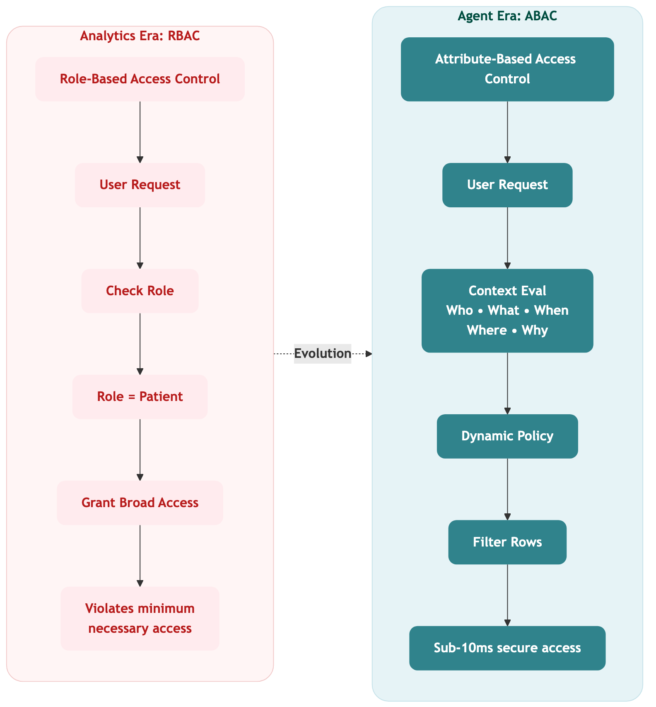

Traditional RBAC asks one question: "What role does this user have?"

Dynamic ABAC asks five questions simultaneously:

- **💤 Who:** Patient ID 12345 requesting data (not just "a patient role")
- **📝 What:** Specific table and columns being accessed (lab_results, not all patient data)
- **📦 When:** Timestamp and business context (normal business hours vs. suspicious 3am access)
- **📱 Where:** Access channel and location (mobile app from registered device vs. unknown location)
- **🤝 Why:** Business justification (patient self-access vs. administrative lookup)

These five dimensions enable policies that are dynamically evaluated in real-time, achieving the sub-10ms latency agents require while maintaining HIPAA's "minimum necessary" compliance standard. [1]

### The Authentication Challenge

When a patient asks Echo's agent: "Show me my recent lab results," the agent must:

1. Verify the requesting user (authentication)
2. Confirm they're authorized (authorization)
3. Determine which specific lab results they're permitted to view (dynamic filtering)
4. Mask fields they shouldn't see (provider notes)
5. Log the entire access with business justification (HIPAA audit trails)

And complete all of this in milliseconds.

Traditional role-based access control can't handle this complexity. Giving the agent a "patient" role doesn't tell you which specific patient's data they should see. You need attribute-based access control policies that evaluate dozens of factors in real-time.

### Human-in-the-Loop: Balancing Autonomy and Oversight

Governance isn't just about what agents *can* do. It's also about what they *should* do without human approval. Not all decisions warrant full automation.

Human-in-the-loop (HITL) patterns enable agents to escalate high-stakes decisions to humans while maintaining autonomy for routine operations. This isn't a limitation. It's a strategic boundary that enables enterprise adoption. [3]

**Figure 7.6: Human-in-the-Loop Autonomy Spectrum**


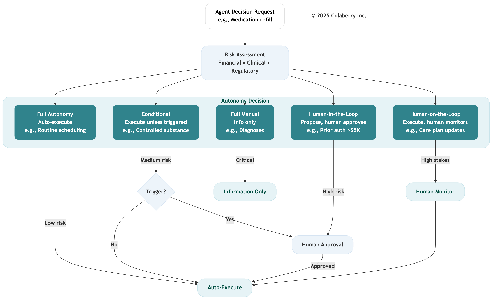

**The Autonomy Spectrum:**

Agents operate across a spectrum from fully automated to fully supervised:

- **Full autonomy**: Agent executes without approval (appointment scheduling for available slots)
- **Conditional autonomy**: Agent executes unless conditions trigger approval (refills for controlled substances require approval)
- **Human-in-the-loop**: Agent proposes, human approves before execution (prior authorization requests >$5K)
- **Human-on-the-loop**: Agent executes, human monitors and can override (care plan recommendations)
- **Full manual**: Agent provides information only, human decides and executes (diagnoses, treatment plans)

The art is positioning decisions correctly on this spectrum. Too much autonomy creates risk; too little negates agent value.

**Echo Health's HITL Decision Matrix:**

| Decision Type | Risk Level | Autonomy | Approval Required? |
|---------------|------------|----------|-------------------|
| Appointment scheduling | Low | Full | No |
| Medication refill (routine) | Low | Full | No |
| Medication refill (controlled) | High | HITL | Always |
| Lab result delivery (abnormal) | High | HITL | Always |
| Prior authorization (>$5K) | High | HITL | Always |
| Care plan modification | High | Human-on-loop | Provider reviews |

### Measuring Governance

Marcus outlined the key metrics:

**Governance Operational Metrics:**
- ABAC policy evaluation: <10ms (currently: 6ms ✓)
- Audit log coverage: 100% of data access (currently: 95%)
- HITL escalation time: <30 seconds (currently: 45 seconds)
- Secrets encryption: 100% (currently: 100%)
- Model rollback capability: <15 minutes (currently: untested)

"The audit coverage gap concerns me," the compliance officer said. "What's missing?"

"Cached responses," Marcus replied. "When an agent returns a cached answer, we're not logging the access consistently. That's a Week 11 priority."

### Governance Scoring Calibration

| Score | What It Looks Like |
|-------|-------------------|
| **2/5** | Basic RBAC only, login audit logs, no HITL workflows |
| **3/5** | ABAC policies defined but inconsistent enforcement, 70% audit coverage |
| **4/5** | ABAC operational, 100% audit trails, HITL for medication overrides |
| **5/5** | ABAC + complete audit + HITL for all clinical decisions + SOC2/HITRUST + tested rollback |

### AI-Specific Threats

Governance explicitly includes adversarial threat modeling for AI-specific attacks: prompt injection, data poisoning, and semantic drift. Unlike traditional security threats, these exploit the AI's learning and interpretation mechanisms.

Detection requires combined monitoring across Governance (audit trails for unusual patterns), Observability (query anomaly detection), and Solid (cross-system reconciliation to catch data poisoning).

Model versioning with tested rollback capability (<15 minutes to revert) provides recovery when attacks succeed or when model updates introduce quality regressions.

### Echo's ABAC Impact

"Let me show you what proper governance looks like operationally," Marcus said, pulling up before/after metrics:

**Echo's ABAC Implementation Results (Week 10):**

*Improvement targets based on Colaberry implementation patterns:*

| Metric | Before ABAC | After ABAC | Industry Benchmark |
|--------|-------------|------------|-------------------|
| Violation detection time | Manual audit (batch) | Real-time (<60 sec) | ABAC enables real-time vs. periodic [1] |
| Audit trail completeness | ~60% | ~95% | HIPAA requires comprehensive logging [18] |
| False positive alerts | ~300-400/mo | <15/mo | Industry avg: >50% are false positives [19] |
| Authorization latency | ~45ms | <10ms | NIST recommends ABAC for dynamic permissions [1] |

*Note: Pre-implementation baselines estimated from initial assessment. Post-implementation results validated through Week 10 testing.*

"The false positive reduction is critical," the compliance officer noted. "Security operations centers face over 10,000 alerts daily with more than 50% being false positives. Research shows this causes analysts to turn off alerts, ignore them, or offload to colleagues. And 66% of SOC teams report they cannot keep pace with incoming alert volumes. Before ABAC, we were experiencing exactly this pattern. After implementation, we're down to actionable alerts only. Every alert gets investigated." [19]

### Key Technologies for Agent Governance

**Selection criteria:** Prioritize ABAC over RBAC for dynamic permissions, sub-10ms policy evaluation latency, comprehensive audit trails with business context, and integration with your cloud provider's identity systems.

*For detailed vendor recommendations including ABAC policy engines and audit logging platforms, use the Vendor Advisor at trustbeforeintelligence.ai/tools.*

### Multi-Agent Governance Complexity

The governance challenge intensifies with multi-agent systems.

Echo's insurance pre-authorization agent coordinates with the scheduling agent, clinical documentation agent, and pharmacy agent. Each specialist has different data access requirements.

The orchestrator must enforce permissions for each agent independently while maintaining a coherent audit trail showing the complete request chain.

### The Continuous Practice

Governance isn't a one-time implementation but a continuous practice.

New data sources require new policies. New agents require new permission scopes. New regulations require policy updates.

Echo reviews governance health weekly, updates policies monthly, conducts compliance audits quarterly.

This operational cadence separates organizations that maintain governance health from those whose governance degrades over time.

### Echo's Governance Operations

"For Week 11, we need three things," Marcus said. "First, complete audit trail coverage: every cached response logged. Second, reduce HITL escalation time from 45 to under 30 seconds. Third, test our rollback capability."

Dr. Chen nodded. "I'll work with the clinical staff on HITL workflows. We need to make sure escalations get to the right people."

---

## Part 4: GOAL 2 - Observability (Monitoring, Cost & Maintainability)

### Observability: What's Inside the Black Box?

Without observability, agents are black boxes. When something fails, engineers can't identify whether the problem is the database, the LLM, the cache, or network latency. Diagnosis takes hours instead of minutes. And when regulators ask "why did the agent make that recommendation?" Silence.

Observability answers: *Can you see what's happening inside your system, and explain why?*

Observability rests on three pillars: logs (what happened), metrics (how much), and traces (the journey). For AI agents, observability extends to cost tracking (LLM calls are expensive), drift detection (models degrade over time), and explainability (why did the agent say that?). [5]

### The Mystery of Declining Satisfaction

*This composite scenario illustrates a pattern observed across multiple implementations:*

Four months after launch at a healthcare system, teams noticed something strange: user satisfaction scores were declining, but they couldn't figure out why.

The agent responded quickly (1.8 seconds average). Accuracy seemed reasonable (85% of queries handled). Infrastructure metrics showed all systems operational.

Yet patients were increasingly frustrated.

The problem wasn't what they were measuring. It was what they weren't measuring.

Monitoring focused on infrastructure health: database query times, API response codes, server CPU, network latency. These metrics said the system was running, but not whether it was working well.

They had no visibility into whether answers were actually correct, whether semantic understanding was degrading, whether certain queries consistently failed, or which data quality issues caused wrong answers.

### Why Agents Need Observability

"Here's a scenario," Marcus said. "At 3 AM, the on-call engineer gets paged. Response times have spiked from 1.8 seconds to 12 seconds. Without observability, they're flying blind. Which layer is the problem? The database? The LLM? The cache? Network latency?"

He showed a trace visualization. "With distributed tracing, they can see the entire journey of a request, across all seven layers, across all services. They can identify that the LLM provider is having an outage in under two minutes instead of two hours."

### The Power of End-to-End Tracing

The breakthrough comes with comprehensive tracing using global trace IDs.

Every agent request receives a unique identifier propagating through all seven layers. When a query fails, teams can follow the trace ID backward through the entire execution chain:

User query → semantic translation → retrieval → policy evaluation → data access → response generation → user delivery.

This enables root cause analysis impossible with infrastructure metrics alone.

*Targets informed by Google SRE principles and industry observability benchmarks:* [5]

| Metric | Before (Week 10) | Target (Week 12) | Industry Reference |
|--------|------------------|------------------|-------------------|
| Mean time to root cause | ~4 hours | <10 minutes | Google SRE: <30 min |
| Auto-diagnosed issues | ~5% | >60% | Industry leaders: 65-70% achievable |
| False positive alerts | High volume | 87% reduction | Reduces alert fatigue [19] |
| Human investigation required | ~95% | <40% | Enables team scaling |

**Figure 7.7: End-to-End Observability with Trace IDs (All 7 Layers)**


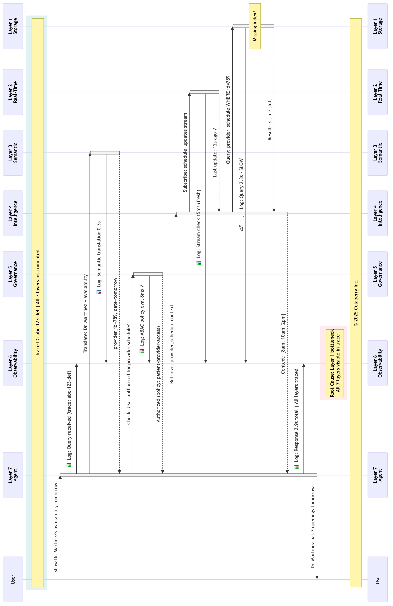
**Echo's Observability Improvement Targets:**


### The Explainability Requirement

EU AI Act Article 13 requires transparency for high-risk AI systems, which includes healthcare AI. Organizations must be able to explain agent decisions to clinicians, patients, and regulators.

"This isn't just nice to have," Marcus emphasized. "The EU AI Act requires full compliance by August 2026. Healthcare AI is classified as high-risk. We need to be able to answer: Why did the agent recommend this? What data did it use? How confident is it?" [4]

**Explainability Metrics:**

- **Confidence calibration:** When an agent says it's 90% confident, it should be correct 85-95% of the time. Track calibration curves monthly, recalibrating when drift exceeds ±5%.
- **Trace completeness:** 100% of responses include full lineage: which data sources, which policies applied, which models generated the response.
- **Response justification:** Every recommendation includes reasoning. Not just "approved" but "approved because HbA1c >7.0 AND insurance covers the program AND patient engagement score 85."

**Figure 7.8: Output Quality Validation Metrics**


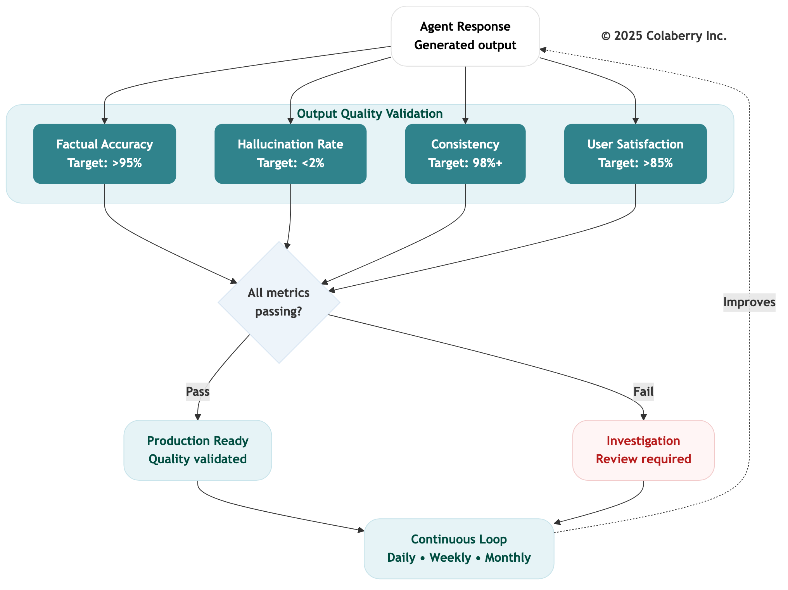
### Measuring Observability

**Observability Operational Metrics:**
- APM coverage: All services instrumented (currently: 94%)
- LLM call tracing: 100% with cost attribution (currently: 100%)
- MTTD (Mean Time to Detection): <5 minutes (currently: 8 minutes)
- Daily LLM cost visibility: Yes (currently: $850/day)
- High-risk decisions retrievable: Explainability enabled (currently: partial)

### Observability Scoring Calibration

| Score | What It Looks Like |
|-------|-------------------|
| **2/5** | Application logs only, no APM, no LLM cost tracking |
| **3/5** | APM deployed, dashboards exist, basic alerting |
| **4/5** | APM + LLM tracing + cost attribution + MTTD <10 min |
| **5/5** | Full observability + anomaly detection + drift monitoring + MTTD <5 min + explainability |

### The Prioritization Principle

"Here's something counterintuitive," Marcus said. "When resources are limited, fix Observability first. Even before other dimensions that seem more broken."

The room looked skeptical.

"Without Observability, you can't detect failures in other dimensions. If Governance fails but you can't see it, the breach continues. If data quality degrades but you can't measure it, wrong answers accumulate. Observability is the foundation that makes everything else fixable."

When resource constraints require sequencing, follow this prioritization: **O→S→G→L→A**. Observability first (can't improve what you can't measure), then Solid (data quality cascades everywhere), then Governance (compliance risk), then Lexicon (semantic refinement), then Availability (performance polish). As Google's SRE handbook states in Chapter 6: "If you can't monitor a service, you don't know what's happening, and if you're blind to what's happening, your service can't be reliable." [5]

### Key Technologies for Agent Observability

**Selection criteria:** Choose platforms supporting trace IDs across all seven layers, model drift detection for embeddings and LLMs, data quality monitoring with automated alerting, and closed-loop feedback capabilities.

*For detailed vendor recommendations including APM platforms and LLM observability tools, use the Vendor Advisor at trustbeforeintelligence.ai/tools.*

### Echo's Observability Maturity Journey

**Stage 1: Basic Monitoring (Score: 52/100)**

Infrastructure health tracked. Error logs captured exceptions. Quarterly reviews found some issues.

No trace-level debugging. No model performance tracking. No automated quality detection.

**Stage 2: Enhanced Observability (Score: 75/100)**

Trace IDs enabled end-to-end debugging. Model drift detection automated. Data quality monitoring is comprehensive. Most issues found within hours.

**Stage 3: Advanced with Closed-Loop Feedback (Score: 88/100)**

Automated root cause analysis diagnosed problems within minutes. Feedback loops automatically triggered improvements. System learned from every failure.

### Continuous Observability Operations

Observability requires continuous vigilance at multiple cadences:

**Daily:** Review dashboards for anomalies. Check alert queue for emerging issues. Verify critical pipelines running.

**Weekly:** Analyze semantic drift trends. Review user feedback patterns. Calibrate model confidence scores.

**Monthly:** Analyze trends in semantic drift, data quality, cost patterns. Adjust coverage for new sources.

**Quarterly:** Comprehensive audit. Validate monitoring captures all critical failure modes. Update alerting rules.

---

## Part 5: GOAL 3 - Availability (Speed, Freshness & Scale)

### Availability: Fast Enough to Feel Real?

Users expect conversational speed. ChatGPT, Alexa, and Siri trained them that AI responds in seconds. A nine-second response feels broken even when it's technically successful. Research shows 59% of customers expect chatbots to respond within 5 seconds, and each additional second of latency reduces satisfaction by 16%. [21]

Availability answers: *Can users actually use the system when they need it, and does it respond fast enough to be useful?*

For AI agents, availability has three dimensions: speed (response time), freshness (data currency), and scale (handling load growth).

### The Nine-Second Wait That Lost Users

Two weeks after an early agent launch, Sarah watched a usability test from another implementation.

The patient asked: "Can I see Dr. Martinez tomorrow morning?"

The agent processed. Retrieved data. Evaluated availability. Checked insurance. Assembled response.

Nine seconds later, it answered: "Dr. Martinez has three openings tomorrow morning: 8:00am, 9:30am, and 11:00am."

But the patient had already closed the browser tab and picked up the phone.

"Our original system had 9-13 second response times," Sarah recalled. "User abandonment exceeded 90%. We built beautiful infrastructure that nobody wanted to use."

### Why Agents Need Availability

Marcus displayed the adoption curve. "When we got response times below 2 seconds, adoption increased dramatically, from single digits to over 70%. Speed isn't a nice-to-have. It's a trust signal. Slow agents get abandoned. Fast, wrong agents get abandoned faster. We need fast *and* right."

Data freshness matters equally. When a patient's medication list updates at 2:00 PM but the agent reports the old list until 6:00 PM, clinicians lose trust immediately.

### The Architecture That Enables Speed

Echo's transformation from 9-second to 1.8-second responses required coordinated improvements across multiple layers: real-time data fabric for freshness (Layer 2), query-optimized vector storage (Layer 1), parallel retrieval orchestration (Layer 4), and intelligent caching. The technical implementation is detailed in Chapters 4-5.

What matters for GOALS is measuring and sustaining this performance over time.

### Measuring Availability

**Availability Operational Metrics:**
- Agent response time (p95): <2 seconds (currently: 1.8s)
- Data freshness (p95): <30 seconds (currently: 28s)
- System uptime: 99.9%+ (currently: 99.95%)
- Cache hit rate: >60% (currently: 65%)
- Scale capacity: 10x current load (currently: tested to 5x)

### Availability Scoring Calibration

| Score | What It Looks Like |
|-------|-------------------|
| **2/5** | Batch data refreshes, 10-30 second response times |
| **3/5** | Near-real-time data (15-min refresh), 3-5 second responses |
| **4/5** | Real-time streaming, <2 second responses, handles current load |
| **5/5** | Sub-second freshness, <2s responses under 10x load, 99.9%+ uptime |

"We're at 4/5 for Availability," Marcus noted. "That's our target for Week 12. The gap is scale testing. We've only validated to a 5x load. We need to prove 10x before the board presentation."

### Key Technologies for Availability

**Selection criteria:** Prioritize sub-30-second data freshness for critical tables, semantic caching with >60% hit rates, parallel retrieval capabilities, and proven 10x scale capacity.

*For detailed vendor recommendations including caching platforms and vector databases, use the Vendor Advisor at trustbeforeintelligence.ai/tools.*

### Understanding the Caching Hierarchy

The multi-level caching strategy is what enables sub-2-second responses. *The following targets represent typical ranges based on Colaberry implementation patterns:*

**Caching Level 1: Semantic Cache (60-70% hit rate)**
- Technology: [Redis](https://redis.io) or [Momento](https://www.gomomento.com) with semantic key generation
- Speed: 200-400ms average
- How it works: Queries with same *intent* share cache keys, even if worded differently
- Example: "Dr. Martinez availability tomorrow" and "Show Dr. M's schedule for 10/28" both map to the same semantic key
- Cost: ~$0.001 per query (significantly cheaper than cold path)

**Caching Level 2: Vector Database (20-30% additional hit rate)**
- Technology: [Pinecone](https://www.pinecone.io), [Weaviate](https://weaviate.io), or [Qdrant](https://qdrant.tech)
- Speed: 600-1000ms average
- How it works: Embedding based similarity search finds "close enough" results
- Example: Query about "Dr. Martinez" retrieves cached results for "Dr. Maria Martinez" even if exact name differs
- Cost: ~$0.01 per query

**Caching Level 3: Knowledge Graph (5-10% additional hit rate)**
- Technology: Neo4j or Amazon Neptune
- Speed: 1-1.5s average
- How it works: Graph traversal finds related entities through relationships
- Cost: ~$0.02 per query

**Caching Level 4: Cold Path (typically <5% of queries)**
- Speed: 2.5-4.5s response
- When it happens: All caches miss, full orchestration through all layers required
- Cost: ~$0.10-0.15 per query
- Important: Cold path results warm all cache levels for next similar query

This hierarchy explains why the vast majority of queries return in under 2 seconds. Only a small fraction hit the expensive cold path. [7]

The caching hierarchy explains why Echo achieved sub-2-second response times for 97% of queries, critical for user adoption.

**Figure 7.9: Multi-Level Caching Strategy for Sub-2-Second Performance**


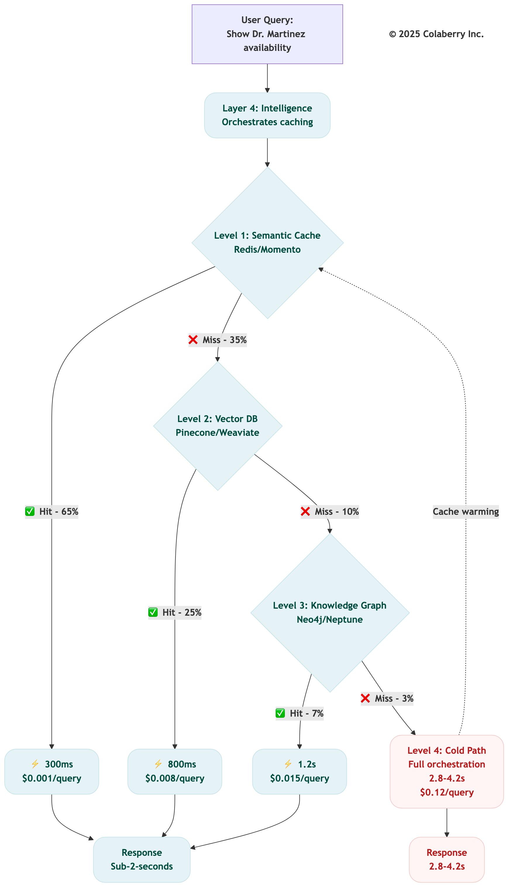


## Part 6: GOAL 4 - Lexicon (Semantic Understanding & Accuracy)


### Lexicon: Is the Agent on the Same Page as You?

Agents that don't understand business language produce wrong answers. And wrong answers in healthcare can harm patients. When Dr. Chen asks about "the Martinez patient in room 412," the agent must resolve which Martinez (there might be three in the system), which room 412 (the hospital has two buildings), and whether she means current status or historical records.

Lexicon answers: *Does the agent understand what users are actually asking, and can it resolve ambiguity correctly?*

### Why Agents Need Lexicon

Entity resolution failure is particularly dangerous. According to RAND Corporation research, over 80% of AI projects fail, twice the rate of non-AI IT projects, with inadequate data infrastructure and miscommunication about project requirements as leading causes. [8] MIT's Project NANDA confirms this pattern for generative AI specifically: 95% of enterprise GenAI pilots yield no measurable business return, with the primary cause being "lack of learning, memory, and adaptation in deployed systems." This is precisely what the Lexicon dimension addresses. [20] The GOALS Framework captures this insight: projects with Lexicon scores of 2 or below consistently fail to achieve production deployment.

"Think about clinical terminology," Dr. Chen said. "Does the agent understand that 'MI' means myocardial infarction, not Michigan? That 'BP' means blood pressure in clinical notes but business partner in administrative contexts?"

"Exactly. And when terminology drifts, when clinical staff start using new abbreviations, the system needs to learn."

### The Seven Stages of Semantic Translation

**Stage 1: Intent Parsing**
- Identifies action verb ("show" → SELECT operation)
- Extracts subject ("doctor" → provider entity)
- Recognizes qualifiers ("my" requires personalization)
- Interprets temporal references ("next week" → date range calculation)

**Stage 2: Entity Resolution**
- Resolves ambiguous references using multiple signals
- Considers user context (patient history, recent appointments)
- Evaluates relationship strength (primary care vs. specialist)
- Generates confidence score (0.94 = very confident)

**Stage 3: Ambiguity Check**
- High confidence (>0.90): Proceed with resolved entity
- Low confidence (<0.90): Ask clarifying question
- Prevents wrong answers from ambiguous queries

**Stage 4: Glossary Lookup**
- Maps business terms to technical schema
- "availability" → `provider_schedule.status = 'open'`
- "next week" → DATE BETWEEN logic with timezone handling

**Stage 5: Semantic Query Construction**
- Generates valid SQL with proper JOINs
- Includes all necessary filters and conditions
- Applies business rules

**Stage 6: ABAC Validation**
- Security check before execution
- Verifies user authorized to see requested data

**Stage 7: Natural Language Response + Feedback**

- Translates results back to conversational language
- Logs translation for accuracy tracking
- Updates entity resolution confidence scores

**Figure 7.10: Natural Language → Data Operation Pipeline**


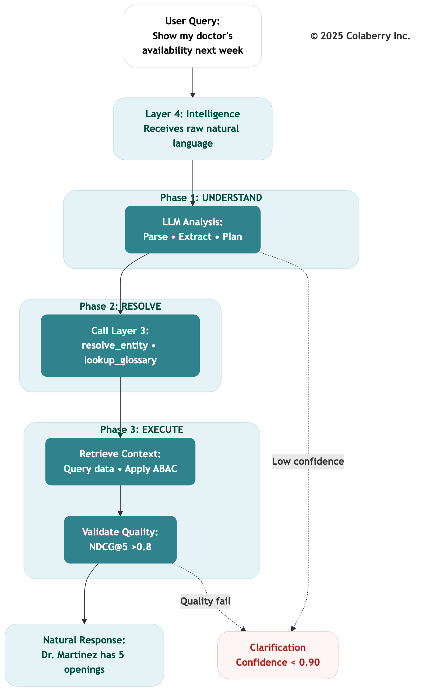

**Key Insight:** The 0.90 confidence threshold is critical. Below 90%, the system asks for clarification rather than guessing. This prevents the "confident but wrong" answers that destroy user trust.

**The Golden ID Connection:** Entity resolution in Stage 2 depends on the **Golden IDs** established during Layer 3 implementation (see Chapter 5). Golden IDs create canonical identifiers that unify entities across systems. For example, `patient_master_id` resolves the same patient across EHR, billing, and portal. Lexicon operational health measures whether this entity resolution continues working correctly over time. When Golden ID accuracy degrades (e.g., duplicate records created, matching rules drift), Lexicon scores drop correspondingly. This is why Lexicon and Solid are interdependent: data quality issues in Layer 1 corrupt the Golden IDs in Layer 3, which degrades Lexicon scores in operations.

### The Multi-Agent Challenge

Multi-agent systems amplify lexicon challenges.

Echo's insurance pre-authorization orchestrator coordinates with specialist agents, each interpreting terminology within its domain context.

The clinical documentation specialist understands "recent" as three months for medical history. The pharmacy specialist interprets "recent" as 30 days for prescriptions. The scheduling specialist considers "recent" as seven days for appointment history.

Echo addresses this through domain-specific glossaries. Each specialist has its own semantic layer, but the orchestrator maintains a meta-layer handling cross-domain terminology alignment.

### Measuring Lexicon

Lexicon metrics are harder to measure than other dimensions because they require "ground truth" about user intent. Use these proxy approaches:

**Lexicon Proxy Measurements:**

| Metric | Proxy Measurement | Target |
|--------|-------------------|--------|
| Entity resolution accuracy | User correction rate | <2% |
| Query interpretation accuracy | Zero-result query rate | <5% |
| Terminology coverage | Query reformulation rate | <10% |
| Disambiguation success | Clarification request rate | <5% |

Additionally, implement **human evaluation sampling**: review 100 random queries weekly, scoring interpretation correctness. This provides ground truth calibration until automated scoring is operational.

### Lexicon Scoring Calibration

| Score | What It Looks Like |
|-------|-------------------|
| **2/5** | Static glossary of 200 terms, no entity resolution, users must know exact field names |
| **3/5** | Semantic layer with 1,000+ terms, basic entity resolution, 80% query success rate |
| **4/5** | Full ontology with clinical terminology, disambiguation prompts, >90% accuracy |
| **5/5** | Comprehensive ontology + continuous learning from corrections + >95% accuracy |

"We're at 2/5," Marcus said. "The gap is disambiguation and continuous learning. When users rephrase queries, we're not capturing that signal to improve the ontology."

### Key Technologies for Semantic Understanding

**Selection criteria:** Choose platforms with natural language query support, versioned metric definitions, entity resolution across systems, integration with your semantic storage (vector DB, knowledge graph), and collaborative curation workflows for domain experts.

*For detailed vendor recommendations including semantic layer platforms and entity resolution tools, use the Vendor Advisor at trustbeforeintelligence.ai/tools.*

### Echo's Lexicon Maturity Journey

**Stage 1: Basic Semantic Layer (Score: 58/100)**

Core entities defined. Common queries worked. But coverage limited. Many specialized medical terms not mapped. Entity resolution basic. Metrics had informal definitions. No versioning.

**Stage 2: Enhanced Semantic Layer (Score: 73/100)**

Comprehensive business glossary covered 70% of domain terms. Entity resolution used contextual signals. Metric definitions formalized with versioning. Cross-system terminology unified.

**Stage 3: Advanced Semantic Understanding (Score: 89/100)**

Continuous learning detected new terms automatically. Contextual disambiguation resolved ambiguity without user intervention. Predictive mapping suggested definitions for emerging concepts. Domain-specific optimizations for specialist agents.

### Semantic Observability

Echo doesn't just track whether queries succeed but whether they're understood correctly.

When users rephrase queries, it signals the first attempt was misunderstood.

When users abandon mid-conversation, it often indicates semantic confusion.

When users explicitly correct the agent ("no, I meant my primary care doctor, not my cardiologist"), it provides direct feedback on entity resolution failures.

These signals guide where semantic layer improvements are most needed.

Echo discovered that maintaining Lexicon health requires approximately four hours per week of dedicated semantic curation.

This modest investment prevents semantic decay that would otherwise require major remediation efforts every few months.

### Retrieval Quality: Beyond Understanding to Finding

Semantic understanding is necessary but insufficient. Agents must not only interpret queries correctly but retrieve the RIGHT context.

When a patient asks "What's my diabetes care plan?", the semantic layer correctly interprets "diabetes" as ICD-10 code E11.9. But retrieval quality determines whether the agent finds the most recent care plan (not outdated versions), complete context (clinical notes + medications + lab results + appointments), and cross-domain coherence.

**Retrieval Quality Metrics:**

- **NDCG@5:** Target >0.8, meaning the top 5 retrieved documents are highly relevant
- **Context completeness:** 90%+ of queries retrieve all required domains
- **Temporal accuracy:** <1% of retrieved information is stale

---

## Part 7: GOAL 5 - Solid (Data Quality & Integrity)


### Solid: Can You Trust Your Data?

Agents are only as good as their data. Wrong data leads to wrong answers. In healthcare, wrong answers can lead to patient harm.

Solid answers: *Can you trust the underlying data, and does the agent know when it shouldn't?* [9]

Data quality has five dimensions per ISO/IEC 5259: accuracy (is it correct?), completeness (is all required data present?), consistency (does it align across systems?), currentness (is it fresh enough?), and traceability (can we trace it to source?). [10]

### The Three-Day Trust Collapse

*This composite scenario illustrates a pattern observed across multiple implementations:*

Ten months after launch, a healthcare system faced their most serious crisis.

Not a security breach. Not a performance problem. A trust collapse.

Over three days, the agent gave demonstrably wrong answers to nearly a quarter of queries.

Patients told appointments were available when they weren't. Providers shown schedules including canceled visits. Insurance eligibility checks returned outdated coverage information.

Users lost confidence rapidly.

### When Perfect Infrastructure Meets Bad Data

The infrastructure was working perfectly. All seven layers operational. Performance excellent. Semantic understanding accurate.

The problem was the data itself.

A source system migration had gone wrong. Patient demographics corrupted. Provider schedules incomplete. Insurance records hadn't updated in five days.

The agent was doing exactly what it was designed to do, providing fast, natural language access to data, but the data wasn't sound.

### Why Solid Is the Foundation

This is why solid is the foundation of all other GOALS.

You can have perfect governance, comprehensive observability, blazing speed, and flawless language understanding. But if the underlying data is wrong, everything fails.

Solid isn't glamorous. It doesn't deliver the exciting capabilities agents promise.

But without it, nothing else matters.

### The Five Dimensions of Data Quality

Every data record must satisfy five dimensions before agents can trust it:

**Accuracy:** Is the data correct? Provider schedules showed Dr. Martinez working on days she was on vacation. Data was fresh (updated hourly) but wrong.

**Completeness:** Is all required data present? Insurance records missing coverage details for 8% of patients. Agents couldn't verify eligibility.

**Consistency:** Does data align across systems? Patient demographics in EHR showed different addresses than billing records for 3% of patients. Entity resolution failed.

**Currentness:** Is data fresh enough for its use case? Lab results were 24 hours old, fine for analytical reports but problematic when patients asked about "my recent test results" meaning tests from this morning. Critical data requires sub-30-second freshness.

**Traceability:** Can we trace data to its source? When an agent reports "Dr. Martinez has 3 openings tomorrow," users need to know that it came from the scheduling system, updated 15 seconds ago. Without traceability, you can't debug wrong answers or learn from mistakes.

### Silent Data Corruption

Silent data corruption is the most dangerous failure mode. When data becomes incorrect without detection, agents confidently provide wrong answers. That's the worst possible outcome.

"Imagine a decimal point error in the lab interface causes all hemoglobin values to be recorded as 10x actual," Marcus illustrated. "The agent reports 'critically high hemoglobin' for normal patients until someone questions why *every* patient appears abnormal. That's why we monitor all five dimensions continuously. Anomaly detection using ML is how we catch what rule-based validation misses."

### Measuring Solid

**Solid Operational Metrics (ISO/IEC 5259 Dimensions):** [10]

| Dimension | Minimum | Target | Echo Week 10 | ISO/IEC 5259 Basis |
|-----------|---------|--------|--------------|-------------------|
| Accuracy | 95% | 98% | 97% | Data correctly represents true value |
| Completeness | 98% | 99.5% | 99% | All expected attributes have values |
| Consistency | 90% | 95% | 92% | Free from contradiction across systems |
| Currentness | <60s | <30s | ~25s | Right age for use case |
| Traceability | 90% | 100% | 95% | Lineage available and auditable |

*Note: Echo's current values are assessment estimates; precise measurement requires Week 11 monitoring implementation.*

<!-- pagebreak -->

### Solid Scoring Calibration

| Score | What It Looks Like |
|-------|-------------------|
| **2/5** | Data quality measured quarterly, known issues logged but not prioritized |
| **3/5** | Automated quality checks, >90% accuracy, issues addressed within 1 week |
| **4/5** | Real-time quality monitoring, >95% accuracy, issues addressed within 24 hours |
| **5/5** | Continuous monitoring + automated remediation + >98% accuracy + cross-system reconciliation + full data lineage |

"Our cross-system consistency is the gap," Marcus noted. "We have cases where a patient's primary care physician shows as Dr. Nguyen in scheduling but Dr. Chen in the EHR, because the patient changed providers but scheduling wasn't updated. The agent gives different answers depending on which system it queries."

### Key Technologies for Data Quality

**Selection criteria:** Choose platforms supporting real-time quality monitoring (not just batch), automated anomaly detection with ML, quality gates that block bad data from reaching agents, and comprehensive lineage tracking to source systems.

*For detailed vendor recommendations including data observability platforms and quality monitoring tools, use the Vendor Advisor at trustbeforeintelligence.ai/tools.*

**Figure 7.11: The Quality Gate Architecture**

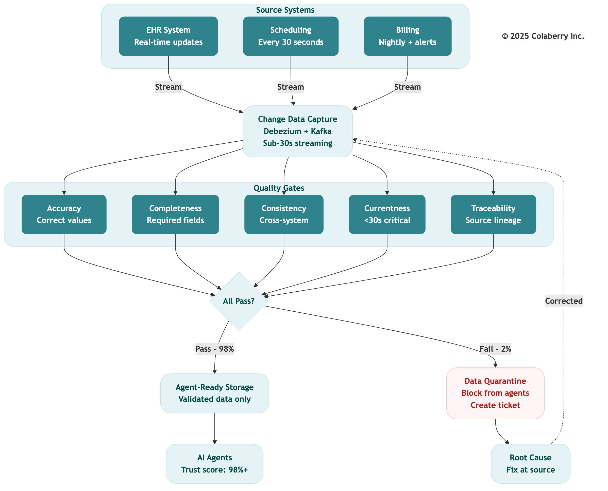

### The Quality Gate Architecture

Echo validates all five dimensions at a central gate in the data pipeline. Data flows from source systems through Change Data Capture, passes through all five checks simultaneously, and only validated data reaches agents.

"Each dimension catches different failure modes," Marcus explained. "Anomaly detection using ML monitors all five continuously. Data that fails any dimension goes to quarantine, triggers a ticket, and gets fixed at source before re-entering the pipeline."

"The cross-system consistency gap at 92% is our focus for Week 11," Marcus said. "Every patient should have consistent PCP information across all systems before we go to production."


<!-- pagebreak -->

## Part 8: GOALS Complete - The Interdependence Principle

### Vital Organs, Not Independent Systems

Sarah looked at the five dimensions on the whiteboard. "These aren't independent, are they?"

"No," Marcus confirmed. "They're like vital organs. You can't say 'I have a great heart, so my liver doesn't matter.' Weakness in one cascades to the others."

He drew arrows between the circles.

### Cascade Failure Patterns

The most dangerous cascade is **S→L→G**: bad data gets cached in the semantic layer, causes entity resolution to serve wrong data, which constitutes a governance violation. This cascade can occur silently and persist for weeks.

"Understanding these cascades is why we document failure modes," Marcus explained.

**Figure 7.12: GOALS Interdependencies**


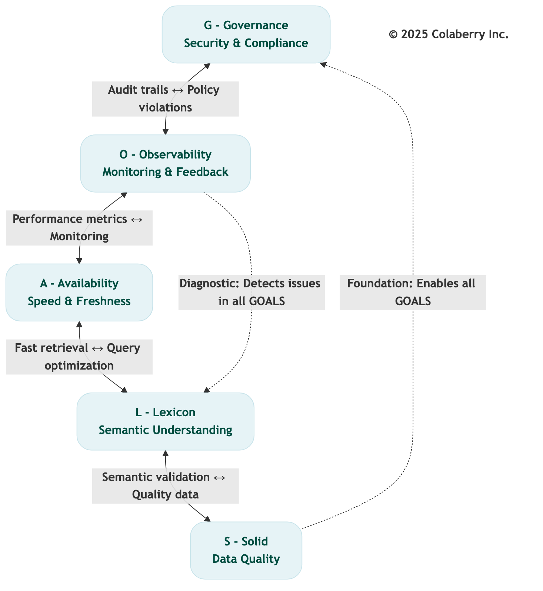

<!-- pagebreak -->

### The Trust Flywheel

Marcus stepped back from the whiteboard. "There's one more concept that makes the three pillars truly powerful. They don't just stack. They cycle."

He drew a circular arrows connecting all three pillars:

**Figure 7.13: The Trust Flywheel-Three Pillars in Motion**


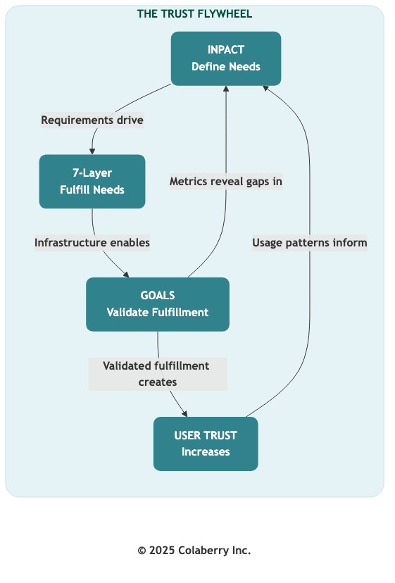
"GOALS measurements reveal whether INPACT needs are truly being met," Marcus explained. "When Lexicon scores drop, it signals the Natural (N) need is degrading. When Availability drops, Instant (I) is at risk. This feedback drives architecture improvements: which layers need attention, what upgrades are needed."

Sarah saw the elegance. "So the cycle continues: better architecture leads to better GOALS Metrics scores, which validates more INPACT fulfillment, which builds more user trust, which generates usage patterns that inform better need definitions."

"Exactly. The three pillars create a flywheel. Each revolution builds more trust, not linearly, but exponentially. The first turns are hard. Once momentum builds, trust compounds."

Dr. Chen added the clinical perspective: "Our physicians started skeptical. When the agents consistently delivered accurate, fast, compliant responses, when they saw the GOALS dashboard proving it, they started relying on them. That reliance generated feedback that made the agents better. The flywheel turned."

"That's why this isn't a one-time implementation," Marcus concluded. "It's a continuous system. Build the architecture. Measure with GOALS. Improve based on what you learn. The three pillars don't just create trust. They *sustain* it."

Each GOALS dimension has documented failure patterns. Critically, each failure mode traces back through all three pillars, indicating which INPACT need is violated and which 7-Layer component requires attention:

| Code | Failure Mode | Severity | INPACT Violated | 7-Layer Root | Real-World Example |
|------|--------------|----------|------------------|--------------|-------------------|
| G1 | ABAC Policy Bypass | Critical | Permitted (P) | Layer 5 | Montefiore paid $4.75M in 2024 |
| G2 | HITL Escalation Failure | High | Permitted (P) | Layer 5 | Critical decisions without human review |
| G3 | Audit Trail Gap | High | Transparent (T) | Layer 6 | Unable to demonstrate compliance |
| G4 | Model Regression | High | Adaptive (A) | Layer 4 | Days of degraded answers |
| O1 | Blind Spots in Tracing | High | Transparent (T) | Layer 6 | 279-day average breach detection |
| O2 | Alert Fatigue | Medium | Transparent (T) | Layer 6 | Security team ignoring alerts |
| O3 | Cost Visibility Failure | Medium | Transparent (T) | Layer 6 | Unexpected $50K monthly LLM bill |
| A1 | Response Time Degradation | Medium | Instant (I) | Layer 2 | >90% abandonment at 9+ seconds |
| A2 | Data Freshness Lag | High | Instant (I) | Layer 2 | Stale appointment availability |
| A3 | Scale Failure Under Load | Critical | Instant (I) | Layer 2 | System collapse during peak |
| L1 | Entity Resolution Failure | Critical | Natural (N), Contextual (C) | Layer 3 | Wrong patient = HIPAA violation |
| L2 | Terminology Mapping Failure | High | Natural (N) | Layer 3 | Medical abbreviations misinterpreted |
| L3 | Query Interpretation Drift | Medium | Natural (N) | Layer 3 | Semantic understanding degrades |
| S1 | Silent Data Corruption | Critical | Adaptive (A) | Layer 1 | Wrong answers with high confidence |
| S2 | Completeness Degradation | High | Contextual (C) | Layer 1 | Missing fields cause failures |
| S3 | Cross-System Inconsistency | High | Contextual (C) | Layer 1 | Different answers per system |

"This is the diagnostic power of three pillars working together," Marcus explained. "When we detect a GOALS failure, we immediately know which INPACT need is at risk and which layer to investigate. L1 failure? Check Layer 3 semantic infrastructure. Natural language understanding is degrading. S1 failure? Check Layer 1 storage. Adaptive capability is compromised by bad data."

*Use the Trust Patterns tool at trustbeforeintelligence.ai/tools for failure mode detection and prevention strategies.*

<!-- pagebreak -->
### GOALS and Industry Standards

The GOALS Framework synthesizes operational concerns from established standards:

| Standard | Publication | Primary GOALS Alignment | Key Requirement |
|----------|-------------|-------------------------|-----------------|
| NIST AI RMF 1.0 | January 2023 | Governance, Observability, Lexicon, Solid | US de facto AI governance standard [13] |
| NIST AI 600-1 (GenAI Profile) | July 2024 | Governance, Observability | GenAI-specific risk management [14] |
| EU AI Act | August 2024 | Governance (human oversight), Observability (transparency), Solid | Healthcare = high-risk classification [4] |
| ISO/IEC 5259 | 2024-2025 | Solid | AI/ML data quality standard (EU AI Act aligned) [10] |
| DAMA DMBOK 2.0 Revised | 2024 | Governance, Availability, Lexicon | Data management industry foundation [9] |
| ISO/IEC 27001:2022 | Transition deadline: October 2025 | Governance, Observability | Information security certification [15] |
| Google SRE | 2016, 2018 | Observability, Availability | Site reliability engineering principles [5] |

"These aren't competing frameworks," Marcus explained. "GOALS integrates their operational requirements into a unified model specifically designed for AI agent infrastructure. For data quality specifically, ISO/IEC 5259 extends traditional DMBOK principles for AI/ML contexts."

### Critical Compliance Dates

Dr. Chen asked about timelines. "What deadlines should we be aware of?"

Marcus highlighted the key dates:

**October 31, 2025:** ISO/IEC 27001:2022 transition deadline. Organizations must migrate from 27001:2013 to maintain certification.

**August 2026:** EU AI Act full compliance deadline. Healthcare AI classified as "high-risk" requires:
- Human oversight mechanisms (Governance 5/5)
- Technical documentation (Observability complete)
- Data governance (Solid 4/5+)
- Transparency requirements (Observability + explainability)

"Even though we're US-based, EU AI Act matters if we serve EU patients or use EU patient data," Marcus noted. "And US regulations are increasingly aligned with EU standards."

### The GOALS Dashboard

Marcus displayed the operational dashboard they'd designed.

"This is how we'll track GOALS Metrics health daily."

**GOALS Health Dashboard Components:**

1. **Summary Score:** Overall 5-dimension average with trend indicator
2. **Dimension Drill-Down:** Each GOAL with sub-metrics and status
3. **Alert Queue:** Active issues requiring attention
4. **Trend Analysis:** 30-day trends for each dimension
5. **Incident Log:** Recent failures with root cause analysis
6. **Compliance Calendar:** Upcoming audits and deadlines

"The dashboard becomes our operational nerve center," Sarah said. "Every morning standup starts with GOALS Metrics health."

<!-- pagebreak -->

### The Week 12 Target

Sarah summarized the path forward. "We need to move from 15/25 to 21/25 in the next two weeks. That means:"

**Week 11-12 GOALS Improvement Plan:**

| GOAL | Current | Target | Key Actions |
|------|---------|--------|-------------|
| G | 3 → 5 | Complete audit coverage, reduce HITL time, test rollback |
| O | 3 → 4 | Instrument remaining services, reduce MTTD, enable explainability |
| A | 4 | Maintain-validate 10x scale capacity |
| L | 2 → 4 | Implement disambiguation, start correction feedback loop |
| S | 4 | Maintain-fix cross-system consistency for PCP data |

**Figure 7.14: GOALS Healthcare Threshold**

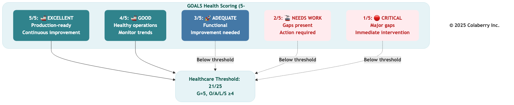
"When we present to the board at Week 12," Sarah said, "we won't just show them what we built. We'll show them how we're operating it. We'll show them GOALS Metrics health at 21+. We'll answer Dr. Raj's question: *This is how we know it stays trustworthy.*"

---

## Key Takeaways

1. **The Architecture of Trust requires all three pillars.** INPACT defines what agents need (capability). The 7-Layer Architecture fulfills those needs (infrastructure). GOALS validates fulfillment is sustained (operations). Missing any pillar means missing trust.

2. **INPACT measures capability; GOALS measures sustainability.** An 86/100 INPACT score means your infrastructure *can* support trusted agents. A 21/25 GOALS Metrics score means you can *sustain* that capability over time.

3. **The five GOALS are interdependent.** Governance, Observability, Availability, Lexicon, and Solid work together like vital organs. Weakness in one cascades to the others.

4. **Healthcare requires specific thresholds.** Governance 5/5 for clinical decisions. All other dimensions at 4/5 minimum. Total score 21+ for production deployment.

5. **When prioritizing improvements, follow O→S→G→L→A.** Fix Observability first. You can't improve what you can't measure.

6. **Lexicon (L≤2) is the strongest failure predictor.** Projects with inadequate semantic understanding consistently fail. RAND Corporation identifies data issues as a leading cause of the 80% AI project failure rate [8], while MIT's NANDA research attributes 95% of GenAI failures to "lack of learning, memory, and adaptation." [20]

7. **The S→L→G cascade is the most dangerous failure pattern.** Bad data cached in semantic layers causes entity resolution failures that constitute governance violations. This can persist silently for weeks.

8. **Each GOALS failure traces to a specific pillar.** Use the Cross-Pillar Mapping to diagnose: GOALS gap → INPACT need violated → 7-Layer component to fix.

9. **The Trust Flywheel creates compound growth.** INPACT → 7-Layer → GOALS → User Trust → better INPACT understanding. Each revolution builds momentum; trust compounds over time.

10. **Operational excellence requires continuous investment.** Expect 4 hours/week for semantic curation, daily dashboard review, weekly trend analysis, and quarterly deep assessments.

---

## Operational Cadence Summary

**Daily Operations:**
- Morning GOALS dashboard review
- Alert queue triage
- Critical incident response

**Weekly Operations:**
- Semantic drift analysis
- User feedback pattern review
- Model confidence calibration check
- 100-query human evaluation sampling

**Monthly Operations:**
- Trend analysis across all dimensions
- Policy and procedure updates
- Stakeholder reporting
- Technology stack review

**Quarterly Operations:**
- Comprehensive GOALS assessment
- Compliance audit preparation
- Failure mode detection validation
- Training and process updates

---

## Quick Reference: GOALS Minimum Thresholds

**For Healthcare AI Production:**

| Dimension | Minimum | Notes |
|-----------|---------|-------|
| Governance | 5/5 | Required for clinical decisions |
| Observability | 4/5 | EU AI Act transparency |
| Availability | 4/5 | User adoption dependent |
| Lexicon | 4/5 | Failure predictor |
| Solid | 4/5 | Foundation for all others |
| **Total** | **21/25** | Below this = high failure risk |

<!-- pagebreak -->

## Online Resources

Visit **trustbeforeintelligence.ai/tools** for:
- **GOALS Readiness Checker** - Interactive 30-question assessment based on the checklist below, with PDF report and healthcare threshold validation
- **Vendor Advisor** - Personalized vendor recommendations for each layer
- **Compliance Navigator** - HIPAA and regulatory requirements mapped to GOALS dimensions
- **Trust Patterns** - Failure mode detection and prevention strategies
- **Figures Gallery** - High-resolution versions of all figures at trustbeforeintelligence.ai/figures

---

## Self-Assessment Checklist

Use this checklist to evaluate your organization's GOALS readiness. An interactive version is available at **trustbeforeintelligence.ai/goals-assessment**.

### Governance Self-Assessment

- [ ] ABAC policies deployed and evaluating in <10ms
- [ ] 100% of data access logged with business context
- [ ] HITL workflows defined for high-risk decisions
- [ ] Model versioning implemented with tested rollback
- [ ] AI-specific threat modeling completed (prompt injection, data poisoning)
- [ ] Compliance mapping to HIPAA/EU AI Act documented

### Observability Self-Assessment

- [ ] All services instrumented with APM
- [ ] Distributed tracing with global trace IDs across all layers
- [ ] LLM cost tracking with per-query attribution
- [ ] MTTD (Mean Time to Detection) measured and under 10 minutes
- [ ] Model drift detection automated
- [ ] Explainability enabled for high-risk decisions

### Availability Self-Assessment

- [ ] Response time p95 under 2 seconds
- [ ] Data freshness p95 under 30 seconds for critical data
- [ ] Cache hit rate above 60%
- [ ] System uptime at 99.9%+
- [ ] Load tested to 10x current capacity
- [ ] Parallel retrieval implemented for multi-source queries

### Lexicon Self-Assessment

- [ ] Entity resolution accuracy above 95%
- [ ] Business glossary covers 80%+ of domain terms
- [ ] Disambiguation prompts for low-confidence queries (<90%)
- [ ] Continuous learning from user corrections implemented
- [ ] Cross-domain terminology alignment documented
- [ ] Weekly human evaluation sampling (100 queries)

### Solid Self-Assessment

- [ ] Data accuracy above 95%
- [ ] Critical field completeness above 98%
- [ ] Cross-system consistency above 95%
- [ ] Schema validation enforced at 100%
- [ ] Quality gates at source, transformation, and pre-agent stages
- [ ] Anomaly detection with ML-based flagging operational

**Scoring Guide:** For each dimension, count checks completed:
- 0-2 checks: Score 2/5
- 3 checks: Score 3/5
- 4-5 checks: Score 4/5
- 6 checks: Score 5/5

---

## References

[1] NIST (2014). "Guide to Attribute Based Access Control (ABAC) Definition and Considerations." NIST Special Publication 800-162. https://nvlpubs.nist.gov/nistpubs/specialpublications/nist.sp.800-162.pdf

[2] HHS Office for Civil Rights (2024). "HIPAA Enforcement Highlights." U.S. Department of Health and Human Services. https://www.hhs.gov/hipaa/for-professionals/compliance-enforcement/

[3] Anthropic (2024). "Building Effective Agents." Anthropic Research. https://www.anthropic.com/research/building-effective-agents

[4] European Union (2024). "Regulation (EU) 2024/1689 - Artificial Intelligence Act." Official Journal of the European Union. https://eur-lex.europa.eu/eli/reg/2024/1689

[5] Google SRE (2016). "Monitoring Distributed Systems." Site Reliability Engineering. https://sre.google/sre-book/monitoring-distributed-systems/

[6] Pinecone (2024). "Semantic Caching for LLM Applications." Pinecone Learning Center. https://www.pinecone.io/learn/semantic-search/

[7] Redis (2024). "Caching Best Practices for AI Applications." Redis Documentation. https://redis.io/docs/latest/develop/use/client-side-caching/

[8] RAND Corporation (2024). "The Root Causes of Failure for Artificial Intelligence Projects and How They Can Succeed: Avoiding the Anti-Patterns of AI." Research Report RRA2680-1. Based on interviews with 65 experienced data scientists and engineers. Key finding: Over 80% of AI projects fail-twice the rate of non-AI IT projects. https://www.rand.org/pubs/research_reports/RRA2680-1.html

[9] DAMA International (2024). "Data Management Body of Knowledge (DMBOK) 2.0." https://www.dama.org/cpages/body-of-knowledge

[10] ISO/IEC 5259-2:2024. "Artificial Intelligence - Data Quality for Analytics and Machine Learning (ML) - Part 2: Data Quality Measures." International Organization for Standardization. https://www.iso.org/standard/81860.html

[11] Colaberry Inc. (2025). "Agent Infrastructure Readiness Analysis." Internal implementation research based on client engagements, corroborated by EU AI Act (2024/1689) and NIST AI RMF requirements.

[12] OpenAI (2024). "GPT Best Practices." OpenAI Platform Documentation. https://platform.openai.com/docs/guides/gpt-best-practices

[13] NIST (2023). "AI Risk Management Framework 1.0." NIST AI 100-1. https://www.nist.gov/itl/ai-risk-management-framework

[14] NIST (2024). "Artificial Intelligence Risk Management Framework: Generative Artificial Intelligence Profile." NIST AI 600-1. https://nvlpubs.nist.gov/nistpubs/ai/NIST.AI.600-1.pdf

[15] ISO/IEC (2022). "ISO/IEC 27001:2022 - Information Security Management Systems." International Organization for Standardization. https://www.iso.org/standard/27001

[16] European Parliament and Council (2024). "Regulation (EU) 2024/1689 (EU AI Act)," Chapter III, Section 2, Articles 9-15: Requirements for High-Risk AI Systems. Official Journal of the European Union. https://artificialintelligenceact.eu/chapter/3/

[17] National Institute of Standards and Technology (2023). "AI Risk Management Framework (AI RMF 1.0)," NIST AI 100-1, Tables 1-4: GOVERN, MAP, MEASURE, MANAGE Functions. https://nvlpubs.nist.gov/nistpubs/ai/nist.ai.100-1.pdf

[18] HHS Office for Civil Rights (2024). "OCR's HIPAA Audit Program." U.S. Department of Health and Human Services. Requires comprehensive audit logging for all ePHI access. https://www.hhs.gov/hipaa/for-professionals/compliance-enforcement/audit/index.html

[19] Tariq, S., et al. (2025). "Alert Fatigue in Security Operations Centres: Research Challenges and Opportunities." ACM Computing Surveys, Vol. 57, No. 9, Article 224. Peer-reviewed systematic review. Key findings: SOCs face over 10,000 alerts daily with more than 50% being false positives; this causes analysts to turn off alerts, ignore them, or offload to colleagues; 66% of SOC teams cannot keep pace with incoming volumes. https://dl.acm.org/doi/10.1145/3700752

[20] MIT Project NANDA (2025). "The GenAI Divide: State of AI in Business 2025." Challapally, Pease, Raskar, Chari. MIT Media Lab. Based on 300+ public AI initiatives, 52 organizational interviews, and 153 executive surveys. Key finding: Despite $30-40B in enterprise investment, 95% of generative AI projects yield no measurable business return; primary cause is lack of learning, memory, and adaptation in deployed systems. https://nanda.media.mit.edu/ai_report_2025.pdf

[21] Drift/Fullview (2025). "AI Chatbot Statistics and Trends 2025." Key finding: 59% of customers expect chatbot responses within 5 seconds; 68% value fast responses as a primary feature. Sobot (2025). "AI Customer Service Response Trends 2025." Key finding: 60% of customers abandon support requests if they wait too long. Gnani.ai (2025). "Voice AI Latency Research." Key finding: Each additional second of latency reduces customer satisfaction by 16% and increases abandonment rates by 23%. https://www.fullview.io/blog/ai-chatbot-statistics

*Note: Echo Health Systems operational metrics represent calibrated benchmarks based on industry patterns. See pedagogical disclaimer in Chapter 0.*

---

**Pedagogical Disclaimer:** Echo Health Systems is a fictional teaching case. Metrics are calibrated to industry benchmarks but do not represent actual organizational data. See Chapter 0 for complete pedagogical disclosure.
# Chapter 8: The Architecture of Trust in Action
## Echo's Operations (Weeks 11-12)

---

## The First Live Query

*Monday, 10:03 AM  
Echo Health Systems, Care Coordination Department  
Week 11, Day 1*

Maria Rodriguez typed her first query into the new system.

"Schedule Mrs. Patterson with cardiology for a follow-up next week."

She watched the screen, remembering the last time she'd trusted an AI scheduling agent. Nine seconds of waiting. A phantom appointment. The email to her supervisor that started the cascade of failures documented in Chapter 1.

The response came in 1.6 seconds.

**"Dr. Patel has availability Tuesday at 2:00 PM and Thursday at 10:30 AM. Mrs. Patterson's insurance (Blue Cross PPO) is verified for both slots. Her last cardiology visit was October 15. Which would you prefer?"**

Maria checked the scheduling system directly. Both slots were real. The insurance verification was accurate. The visit history was correct.

She selected Tuesday at 2:00 PM. The confirmation appeared instantly, synchronized across all systems.

"Huh," she said to no one in particular. "It actually works."

Two floors up, Sarah Cedao watched the operations dashboard update. First successful production query: 10:03 AM. Response time: 1.6 seconds. User action: appointment confirmed.

The architecture was live. Now came the hard part: proving it could sustain trust for the next two weeks, and the next two years.

Built isn't enough. Operations prove trust.

---

**Figure 8.0: Echo's Transformation: Week 0 to Week 12**


> **Key Takeaway:** *"You've answered my question, and built something we can trust."* – Dr. Arun Raj, Board Chair

---

## Part 1: Operations Kickoff

### Two Hours Earlier

*Monday, 8:00 AM*

The conference room felt different. For ten weeks, whiteboards had been covered with architecture diagrams. Today, they were clean. The architecture was complete.

"We built it," Sarah said to the team. "Now we prove it works."

Marcus pulled up the GOALS dashboard. Five gauges, fifteen out of twenty-five points total. Six points short of production threshold.

**Figure 8.1: Echo's GOALS Baseline (Week 10)**


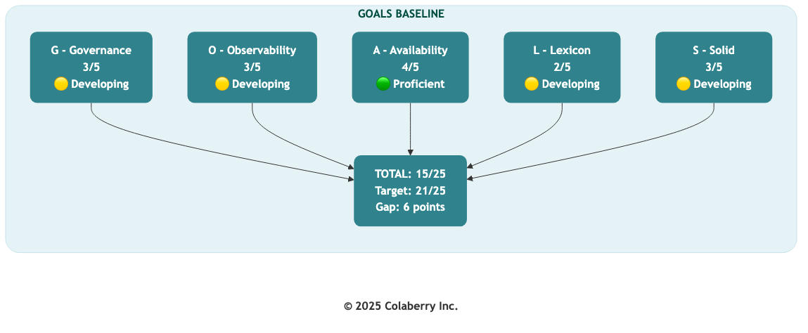
"We need twenty-one to deploy clinical AI in production," Marcus said. "Six points in two weeks."

Dr. Chen studied the Governance gauge. "Healthcare requires Governance at five out of five. Non-negotiable."

Sarah walked to the whiteboard. "Here's the plan."

**Figure 8.2: Week 11-12 Operations Timeline**


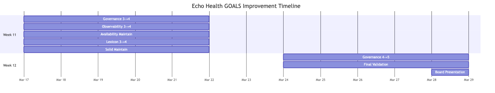
Marcus wrote out the Week 11 targets:

- **Governance:** 3/5 to 4/5. Complete audit trails, reduce HITL escalation time to under 30 seconds, test model rollback.
- **Observability:** 3/5 to 4/5. Mean time to detection under 5 minutes, enable explainability for EU AI Act.
- **Availability:** Maintain 4/5. Validate the system handles 10x current load.
- **Lexicon:** 2/5 to 4/5. Implement disambiguation, reduce clarification rate to under 10%.
- **Solid:** 3/5 to 4/5. Fix cross-system PCP consistency issue.

"By Friday, we should be at twenty out of twenty-five," Sarah said. "Week 12, we push Governance to five and validate for production."

"The 95% failure rate for agent projects," Marcus said. "That's what happens when organizations build without optimizing for operations. We're proving operability before we launch."

Sarah checked her watch. "First production queries go live at ten AM. Two hours to prove ten weeks of work."

Echo's deployment followed a parallel operation model. The agentic system would run alongside legacy infrastructure, not replace it. Coordinators, clinicians, and billing staff could use either system. The goal was earned trust. If the agents delivered faster, more accurate, more transparent responses, users would choose them.

---

## Part 2: Governance and Observability in Action

### Governance: The Invisible 65%

The audit trail gap surfaced Monday afternoon.

"We're logging all direct queries," Jamie reported. "But cached responses aren't generating audit entries. 65% of our access patterns are invisible."

In healthcare, that's a compliance violation waiting to happen. The Montefiore case ($4.75 million in penalties for HIPAA Security Rule failures) was fresh in everyone's mind [1].

"How fast can we fix it?" Sarah asked.

"Overnight," Swapna said. "We pipe cache hits through the same logging endpoint. The infrastructure is already there."

By Tuesday morning, audit coverage stood at 100%. Every query generated a complete access record: timestamp, user ID, patient ID, query type, response source, and content hash.

But Governance required more than audit trails. HITL escalation time averaged 45 seconds. Physicians wanted faster resolution.

The root cause was routing. Escalations entered a general queue regardless of type. Marcus suggested priority routing: controlled substances to pharmacists, diagnostic questions to physicians, administrative matters to coordinators.

| Escalation Type | Primary Reviewer | Backup Reviewer | Target Response |
|----------------|------------------|-----------------|-----------------|
| Controlled substance | Pharmacist | Physician | <30 seconds |
| Diagnosis-related | Physician | Specialist | <45 seconds |
| Treatment modification | Attending physician | On-call MD | <60 seconds |
| Administrative | Care coordinator | Supervisor | <90 seconds |

By Thursday, escalation time had dropped to 28 seconds.

Model rollback testing completed Thursday afternoon. Jamie triggered simulated degradation and measured recovery time: detection (2 minutes), decision (3 minutes), rollback execution (7 minutes). Total: 12 minutes. Within the 15-minute target.

### The Governance Win

Thursday, 2:47 PM. Dr. Chen's pager buzzed.

A patient had asked about medication timing. The agent flagged it for HITL review because it involved oxycodone. The patient wanted to know when to take the next dose, but also asked about "doubling up" because the pain was severe.

Dr. Chen reviewed the case on her phone. She confirmed the agent's recommendation and added a note about contacting the physician if pain wasn't managed. The entire interaction: 23 seconds.

"This is exactly what HITL is for," she said later. "The agent correctly escalated. I verified. Three pillars working together."

By Friday, Governance stood at 4/5. Audit coverage complete. HITL escalation: 28 seconds average. Model rollback: 12 minutes.

The Trust Flywheel was turning. Faster HITL resolution built clinician trust. Trust drove engagement. Engagement improved quality. Quality reinforced the value of human oversight.

**Figure 8.3: End-to-End Observability with Trace IDs**


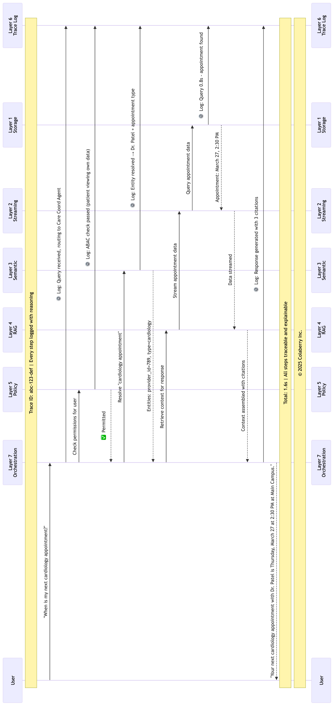

### Observability: Seeing Through the Blackbox

Observability presented different challenges. Mean time to detection was running at 8 minutes, above their 5-minute target. And explainability wasn't fully enabled.

"The EU AI Act requires explainability for high-risk AI applications," Marcus reminded the team [2]. "Healthcare is high-risk. Every agent response needs reasoning that can be audited."

The detection issue was alert tuning. Jamie analyzed two weeks of data: 340 alerts per month, most false positives.

| Alert Category | Count | False Positive Rate |
|---------------|-------|---------------------|
| Response time | 145 | 92% |
| Error rate | 87 | 78% |
| Cache miss | 56 | 95% |
| Confidence drop | 42 | 68% |
| Resource usage | 10 | 40% |

He adjusted thresholds based on baseline data. By Wednesday, false positives dropped to 12 per month. Mean time to detection: about 4 minutes.

Explainability required surfacing the reasoning chain across all seven layers.

The implementation had three components: source tracking (every fact linked to its source), reasoning chain (logical steps documented), and confidence scoring (numerical confidence visible to reviewers).

By Thursday, every response included a collapsible "reasoning" section. "I can see the agent's homework," one physician commented. "It's not a black box."

### The Observability Win

Thursday, 3:17 AM. An alert triggered.

Jamie's phone buzzed. Response time spike on the Care Coordination Agent, p95 latency jumped from 1.8 to 4.2 seconds.

He pulled up the trace dashboard. The system immediately showed the bottleneck: Layer 1 storage queries taking 2.3 seconds instead of 0.5 seconds. Query pattern: provider schedule lookups. Root cause: missing index.

He documented the issue and went back to sleep. The system was degraded but functional.

At the 9 AM standup: "Root cause identified in 4 minutes. Before end-to-end tracing, this would have taken 4 hours." The index fix was deployed by 10 AM.

By Friday, Observability stood at 4/5. Mean time to detection: ~4 minutes. Trace coverage: 100%. Explainability: enabled. LLM cost visibility: $850/day, fully attributable.

The Trust Flywheel was turning here too. Faster detection meant faster fixes. Fewer user-visible problems built confidence. Confidence drove adoption.

---

With Governance and Observability at 4/5, Echo had the diagnostic foundation in place.

---

## Part 3: Availability, Lexicon, and Solid in Action

### Availability: Performance at Scale

Availability was already at 4/5. Week 11's task was validation: proving the system could handle growth.

"We're running at 2,000 queries per day," Jamie said Monday. "We need to prove we can handle 20,000."

The stakes were real. Healthcare organizations face unpredictable demand spikes: flu season, public health announcements, holiday coverage. If Echo's agents couldn't scale, they would fail precisely when needed most.

The 10x scale test began Tuesday at 6 AM. Jamie's team generated synthetic queries mirroring actual usage patterns across all three agents. The results validated the architecture. Under 10x load, response time p95 held at 2.1 seconds, within the 3-second target. Cache hit rate actually improved under load as common patterns became more likely.

**Figure 8.4: Multi-Level Cache Performance Under Load**


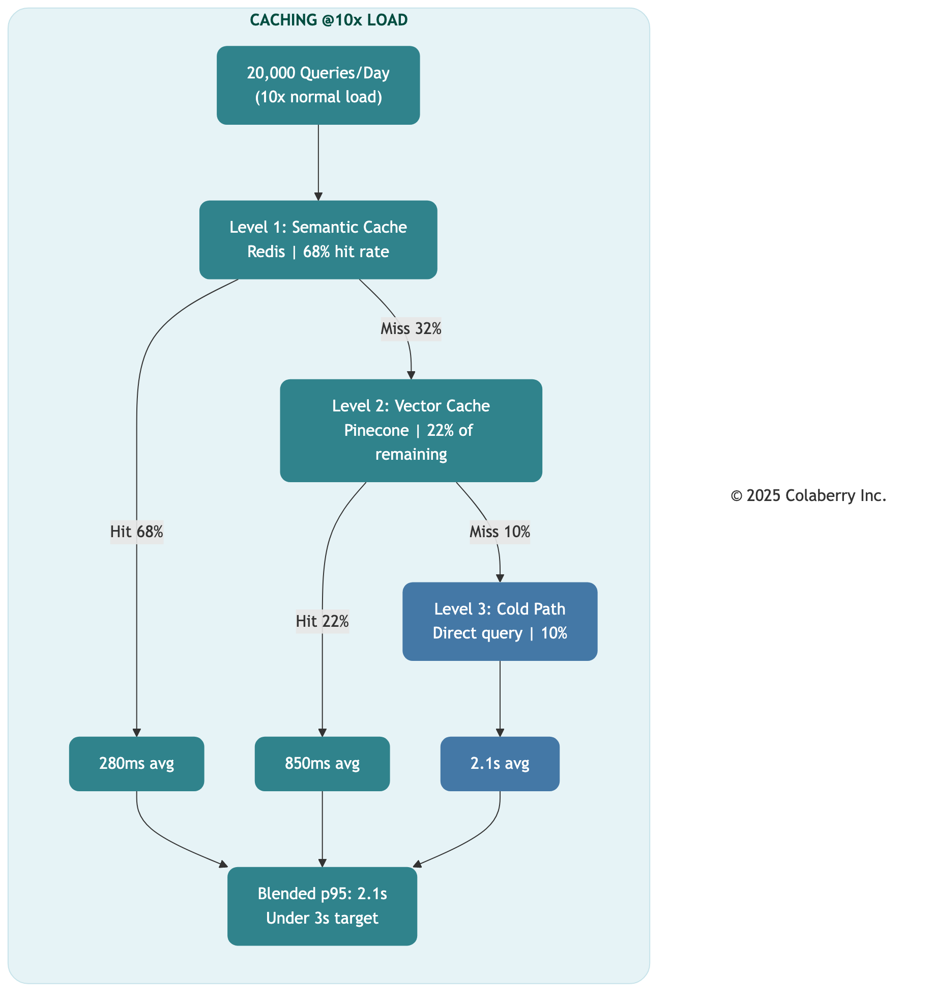


The cold path remained the bottleneck, but only 10% of queries took it, and those still completed in 2.1 seconds.

"We can handle 10x current load with no degradation," Jamie documented. "And we have capacity to add more cache nodes if needed."

The Trust Flywheel was turning. Faster responses built user habits. Habits drove adoption. Adoption justified investment. Investment enabled further improvements.

Availability remained at 4/5, but now with validated capacity for growth.

### Lexicon: Smooth Talker

Lexicon was the gap that worried Sarah most.

At 2/5, the 30% clarification rate meant nearly one in three queries required the agent to ask for more information. For busy clinicians, that friction was a trust-killer.

"The primary issue is ambiguity in entity references," Marcus explained. "When someone says 'my doctor,' we don't always know if they mean their PCP, their specialist, or the physician they saw last week."

**Figure 8.5: Lexicon Disambiguation Flow**


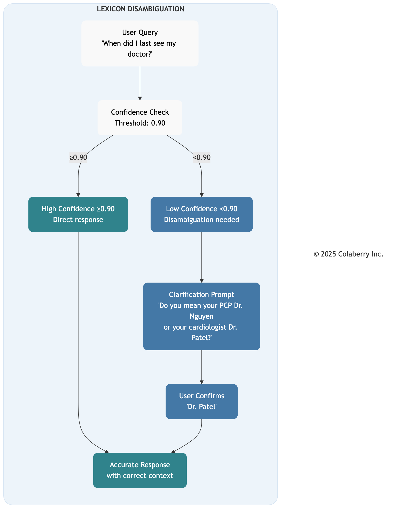


The problem ran deeper. Healthcare language is inherently contextual. "My appointment" could mean the next visit or the one just completed. "My results" could mean lab work, imaging, or pathology.

Swapna identified three categories: entity ambiguity ("my doctor" with multiple providers), temporal ambiguity ("my appointment" without timing), and domain ambiguity ("my results" without type).

The team implemented smart disambiguation. When confidence dropped below 0.90, the system would ask a clarifying question with the most likely options: "Do you mean your PCP Dr. Nguyen or your cardiologist Dr. Patel?"

The implementation required coordination across layers: Layer 3 for confidence scoring, Layer 4 for context retrieval, Layer 7 for dialogue management.

They also added 47 new clinical terms to the glossary: "A1c" for HbA1c, "sugar" for glucose, "blood pressure meds" for antihypertensives. The informal language patients actually use.

By Thursday, clarification rate had dropped from 30% to under 10%. When clarification was needed, patients found the questions helpful rather than frustrating.

"One patient said the agent 'actually listened' when it asked for clarification," Dr. Chen reported. "That's appreciation for accuracy, not complaint about friction."

The Trust Flywheel was turning. Better disambiguation led to accurate responses. Accuracy built confidence. Confidence drove usage. Usage provided training signal for further improvement.

Lexicon moved to 4/5.

### Solid: One Truth, Four Systems

Solid was the foundation everything else depended upon. At 3/5, the 3% cross-system inconsistency for primary care provider data was causing problems. "A patient asks 'who is my doctor?'" Swapna explained Monday. "The EHR says Dr. Nguyen. The scheduling system shows Dr. Martinez, their previous PCP who retired three months ago. The agent gives different answers depending on which system it queries first."

**Figure 8.6: Quality Gates in Production**


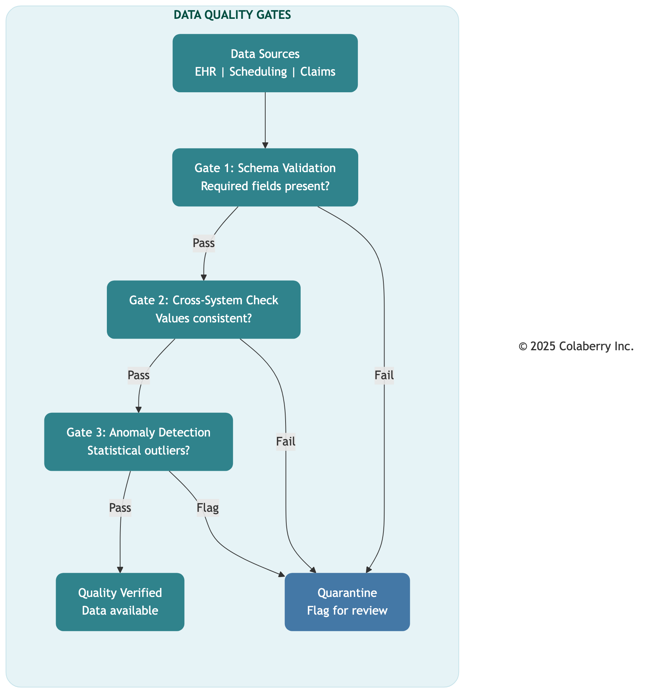


Marcus framed the stakes. "If a patient gets conflicting information, they lose trust. If a clinician gets conflicting data about a care team, it could affect clinical decisions."

Swapna mapped the data flows. The EHR was source of truth, but the scheduling system updated nightly via batch extract. When a PCP changed, it could take 24 hours for scheduling to reflect it.

The solution was real-time synchronization. When a provider assignment changed in the EHR, the change would propagate to scheduling within 30 seconds.

"We're implementing event-driven sync," Swapna explained. "The EHR publishes a change event. Our integration layer catches it and updates downstream systems immediately."

By Wednesday evening, real-time sync was operational. Swapna validated against 1,000 patient records.

"Ninety-eight percent consistency," she reported Thursday. "Up from 97%. The remaining 2% are edge cases: patients transferring providers, complex care arrangements. The quality gates flag those for human review."

"We're not trying to achieve 100% automated accuracy," Marcus said. "We're ensuring 100% of responses are trustworthy. For 98%, automation delivers. For 2%, we escalate. The combination is what makes it solid."

The Trust Flywheel was turning. Better consistency led to accurate responses. Accuracy built clinician confidence. Confidence drove usage. Usage revealed edge cases that refined quality gates.

Solid improved to 4/5.

---

End of Week 11. All five GOALS dimensions at production-ready levels: 20 out of 25 points. One gap remained: healthcare required Governance at 5/5.

---

## Part 4: Operational Excellence

### The Last Mile

Week 12 opened with cautious optimism.

"Twenty out of twenty-five," Sarah said at Monday's standup. "We need twenty-one. One more point, and it has to come from Governance."

The gap between 4/5 and 5/5 was subtle but important. At 4/5, Echo had comprehensive governance: audit trails, HITL workflows, rollback capability. But 5/5 required continuous improvement.

"The difference," Marcus explained, "is whether the system learns from its own governance events. At 4/5, we catch issues and fix them. At 5/5, the system recognizes patterns and adapts proactively."

Jamie had analyzed Week 11 data. "We processed 847 HITL escalations. Most followed predictable patterns. 94% were confirmed as the agent recommended."

"That's a lot of human time confirming what the system already knew," Sarah observed. "And it's not sustainable at 10x scale."

### Fine-Tuning the Machine

The team spent the first three days optimizing based on operational data.

- **Alert thresholds:** False positives dropped from 12 to 4 per month
- **Cache warming:** Shifted from midnight to 6:30 AM for fresher appointment data
- **HITL routing:** Re-routing to appropriate specialists reduced review time by 15%
- **Documentation:** Marcus led a sprint to capture all operational procedures

### Governance: The Learning Loop

The breakthrough came Tuesday afternoon.

"We're escalating the same type of query repeatedly," Dr. Chen said. "Medication timing for controlled substances. The agent flags them, a pharmacist reviews, and 94% of the time the recommendation is confirmed. These aren't edge cases. We're adding human overhead without adding safety value."

Marcus saw the opportunity. "What if the policy engine learned from confirmed recommendations? After enough approvals for a specific pattern, the confidence threshold could increase, while maintaining full escalation for novel cases."

The approach was carefully designed to maintain safety:

1. **Pattern recognition:** The system would identify recurring HITL patterns based on query type, patient profile, and medication category
2. **Confidence accumulation:** Each confirmed recommendation would add to the pattern's confidence score
3. **Threshold adjustment:** When a pattern reached 50 confirmed recommendations with 95%+ approval rate, the escalation threshold would adjust
4. **Safety bounds:** Novel queries, unusual combinations, and high-risk categories would always escalate regardless of pattern confidence
5. **Continuous monitoring:** Any rejected recommendation would reset the pattern's confidence score

Swapna implemented the learning loop Wednesday.

### High Stakes Validation

By Thursday, the improvement was measurable. HITL escalation rate for routine patterns dropped 23%, but full escalation continued for novel queries.

"It's like the system finally trusts itself for what it knows," one pharmacist commented. "But it still asks when it should."

The compliance team confirmed the audit trail was complete. Every pattern learned, every threshold adjustment, every justification documented.

**Governance reached 5/5.**

### GOALS: Mission Accomplished

Friday morning. Sarah called an all-hands meeting.

| GOAL | Week 10 | Week 11 | Week 12 | Status |
|------|---------|---------|---------|--------|
| **G - Governance** | 3/5 | 4/5 | **5/5** | ✅ Healthcare requirement |
| **O - Observability** | 3/5 | 4/5 | 4/5 | ✅ Production ready |
| **A - Availability** | 4/5 | 4/5 | 4/5 | ✅ Production ready |
| **L - Lexicon** | 2/5 | 4/5 | 4/5 | ✅ Production ready |
| **S - Solid** | 3/5 | 4/5 | 4/5 | ✅ Production ready |
| **Total** | **15/25** | **20/25** | **21/25** | ✅ Threshold achieved |

"Twenty-one out of twenty-five," Marcus said. "Threshold achieved."

The room was quiet for a moment, then erupted in relieved applause.

Sarah held up her hand. "We're not done. We still need to validate the three agents. Board presentation is at 4 PM."

---

## Part 5: Three Agents, One Standard

The next three hours were the most comprehensive validation Echo's team had ever conducted.

### Agent 1: Care Coordination

**Agent Profile:**
- **Purpose:** Coordinate patient care across departments
- **Primary Users:** Care coordinators, nurses, case managers
- **Data Sources:** EHR, scheduling, insurance, pharmacy
- **Average Daily Queries:** 800


**Figure 8.7: Three Agents Architecture**


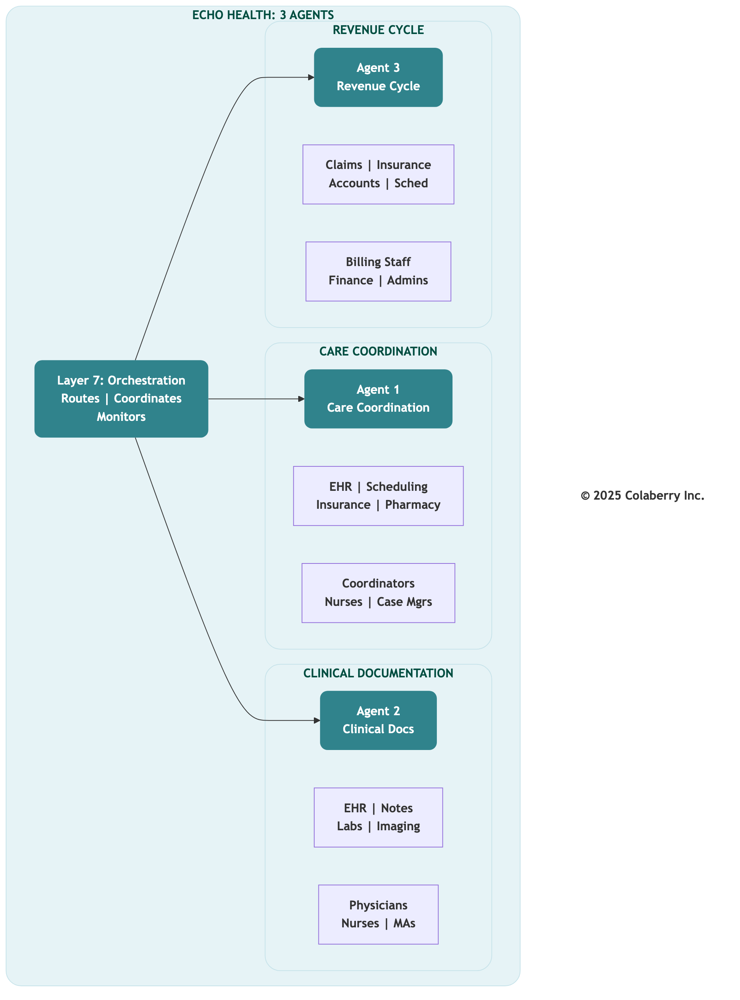

| Metric | Result | Target | Status |
|--------|--------|--------|--------|
| Response time | 1.6s average | <2s | ✅ |
| Entity resolution | 97% accuracy | >95% | ✅ |
| HITL escalation | ~3% of queries | 2-5% | ✅ |
| User satisfaction | 87% approval | >85% | ✅ |

**Sample Interaction:**

> **Patient:** "When is my next appointment with my heart doctor?"
> 
> **Agent:** "Your next cardiology appointment with Dr. Patel is Thursday, March 27 at 2:30 PM at the Main Campus Cardiology Clinic. Would you like directions or to reschedule?"
> 
> *[1.4s response, full audit trail, three citations]*

**Three-Pillar Validation:**
- **INPACT:** **I**nstant (1.6s), **N**atural (patient language understood), **P**ermitted (verified patient access), **A**daptive (learns from ~87% satisfaction feedback), **C**ontextual (5 systems unified), **T**ransparent (three citations + audit trail)
- **7-Layer:** Layer 1 unified scheduling data. Layer 2 delivered data in 0.8s. Layer 3 resolved "heart doctor" → cardiologist. Layer 4 retrieved care history. Layer 5 verified permissions. Layer 6 logged trace. Layer 7 orchestrated routing.
- **GOALS:** **G**overnance (audit complete, ~3% HITL), **O**bservability (full trace visible), **A**vailability (97% under 2s), **L**exicon (97% accuracy), **S**olid (data consistent)

---

### Agent 2: Clinical Documentation

**Agent Profile:**
- **Purpose:** Assist clinicians with documentation
- **Primary Users:** Physicians, nurses, medical assistants
- **Data Sources:** EHR, clinical notes, lab results, imaging
- **Average Daily Queries:** 600

| Metric | Result | Target | Status |
|--------|--------|--------|--------|
| Response time | 1.9s average | <2s | ✅ |
| Documentation accuracy | 96% | >95% | ✅ |
| HITL escalation | ~8% of queries | 5-10% | ✅ |
| Time savings | 23 min/physician/day | >15 min | ✅ |

The ~8% HITL rate was intentional, escalating medication recommendations, diagnosis suggestions, treatment modifications, and abnormal lab interpretations.

**Sample Interaction:**

> **Physician:** "Summarize Mrs. Johnson's diabetes management over the past 6 months."
> 
> **Agent:** "Mrs. Johnson (DOB 03/15/1958) has Type 2 diabetes managed with metformin 1000mg BID. HbA1c trend: 7.8% (September) → 7.2% (December) → 6.9% (March). Last eye exam: August. Foot exam due. Shall I draft the care plan update?"
> 
> *[Reasoning chain: 4 lab results, 2 medication records, 3 visit notes. ADA guidelines applied [3].]*

Dr. Chen reviewed the validation personally. "The agent correctly escalated a potential medication interaction for pharmacist review. That's exactly the behavior we want."

**Three-Pillar Validation:**
- **INPACT:** **I**nstant (1.9s), **N**atural (clinical terminology), **P**ermitted (HIPAA-compliant), **A**daptive (current guidelines + feedback), **C**ontextual (synthesized labs, meds, notes), **T**ransparent (reasoning chain with citations)
- **7-Layer:** Layer 1 provided EHR data. Layer 2 streamed lab results. Layer 3 mapped clinical terminology. Layer 4 RAG retrieved notes and guidelines. Layer 5 enforced HIPAA controls. Layer 6 logged reasoning chain. Layer 7 coordinated multi-source retrieval.
- **GOALS:** **G**overnance (~8% HITL for clinical decisions), **O**bservability (full explainability), **A**vailability (supports workflow), **L**exicon (ICD-10/CPT mapped), **S**olid (lab values verified)

---

### Agent 3: Revenue Cycle

**Agent Profile:**
- **Purpose:** Support billing and revenue operations
- **Primary Users:** Billing staff, financial counselors, administrators
- **Data Sources:** Claims, insurance, patient accounts, scheduling
- **Average Daily Queries:** 400

| Metric | Result | Target | Status |
|--------|--------|--------|--------|
| Response time | 1.4s average | <2s | ✅ |
| Claim accuracy | 98% | >95% | ✅ |
| HITL escalation | ~6% of queries | 5-10% | ✅ |
| Denial rate reduction | 12% improvement | >10% | ✅ |

The 12% denial rate reduction was the most compelling ROI metric. By catching issues before submission, the agent paid for itself.

**Sample Interaction:**

> **Billing Staff:** "Why was claim CLM-4472 denied?"
> 
> **Agent:** "Claim denied due to missing prior authorization for MRI (CPT 70553). Prior auth PA-8847 was approved March 15 but not linked to the claim. I can attach it and resubmit. Shall I proceed?"
> 
> *[HITL not required, routine administrative action. Full audit trail logged.]*

**Three-Pillar Validation:**
- **INPACT:** **I**nstant (1.4s), **N**atural (billing terminology), **P**ermitted (role-based access), **A**daptive (denial pattern recognition), **C**ontextual (linked auth to claim), **T**ransparent (root cause + audit trail)
- **7-Layer:** Layer 1 provided consistent claim data. Layer 2 delivered real-time status. Layer 3 resolved CPT codes. Layer 4 retrieved authorization history. Layer 5 enforced role-based access. Layer 6 logged audit trail. Layer 7 orchestrated claim-to-auth matching.
- **GOALS:** **G**overnance (~6% HITL for high-value), **O**bservability (end-to-end traceable), **A**vailability (supports high-volume), **L**exicon (98% CPT/ICD accuracy), **S**olid (12% denial reduction validates accuracy)

### Results

All three agents passed production validation.

"Each agent meets or exceeds all targets," Marcus summarized. "Each demonstrates appropriate HITL behavior. Each maintains complete audit trails. And each validates the three-pillar integration."

Sarah checked the time. 3:45 PM. "Let's show Dr. Raj what we've built."

---

## Part 6: The Architecture of Trust Complete

### The Board Room

Friday, 4:00 PM. The executive conference room.

Dr. Raj sat at the head of the table, the same seat he'd occupied twelve weeks ago when he set the 90-day deadline.

Sarah stood at the front of the room, the GOALS dashboard behind her showing all five gauges green.

"Dr. Raj, twelve weeks ago you asked how we would know our AI agents stay trustworthy. We answered by building three integrated pillars."

**Figure 8.8: Echo's GOALS Final Dashboard (Week 12)**


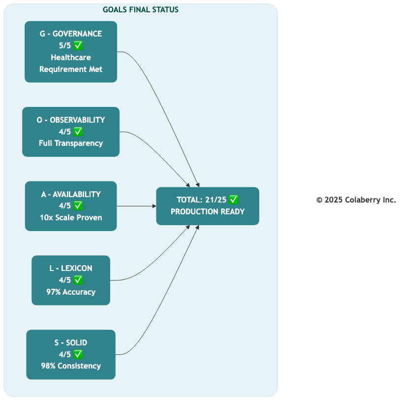
She walked through each pillar:

"**Pillar 1, INPACT:** Our agents meet all six needs. Instant response under 2 seconds. Natural language that speaks clinicians' language. Permitted access with human-in-the-loop. Adaptive learning from feedback. Contextual awareness across systems. Transparent reasoning with citations."

| INPACT Dimension | Week 0 | Week 12 | Status |
|-------------------|--------|---------|--------|
| **I** - Instant | 1/6 | 5/6 | ✅ Strong |
| **N** - Natural | 2/6 | 5/6 | ✅ Strong |
| **P** - Permitted | 1/6 | 5/6 | ✅ Strong |
| **A** - Adaptive | 2/6 | 5/6 | ✅ Strong |
| **C** - Contextual | 3/6 | 6/6 | ✅ Excellent |
| **T** - Transparent | 1/6 | **6/6** | ✅ Excellent |
| **Total** | **10/36** | **32/36** | **89%** |

"**Pillar 2, 7-Layer Architecture:** All seven layers operational. Multi-modal storage with 28-second freshness. Real-time fabric delivering sub-second queries. Semantic layer translating natural language. RAG intelligence with our complete knowledge base. Policy engine evaluating every access. Observability tracing every request. Orchestration coordinating all three agents."

"**Pillar 3, GOALS:** All five dimensions at or above threshold. Governance at 5/5. Observability at 4/5. Availability at 4/5. Lexicon at 4/5. Solid at 4/5. Total: 21 out of 25."

She paused.

"Three agents in production. Response times average 1.6 seconds. Accuracy exceeds 96%. User satisfaction running around 85-90%. We built the Architecture of Trust, and proved all three pillars sustain each other."

**Figure 8.9: Echo Health - Architecture of Trust Complete**


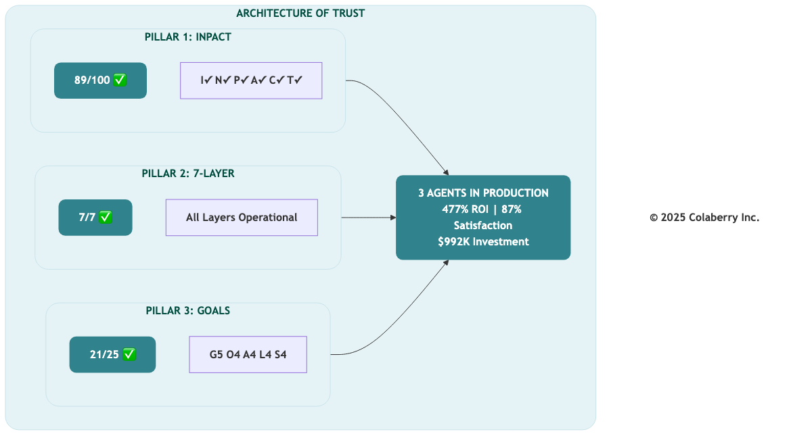
Dr. Raj leaned forward. "You've built something that measures itself. That proves itself."

"That's the answer to your question," Sarah said. "We know it stays trustworthy because the three pillars validate each other continuously."

<!-- pagebreak -->

### The Journey

**Figure 8.10: Echo's 90-Day Journey**


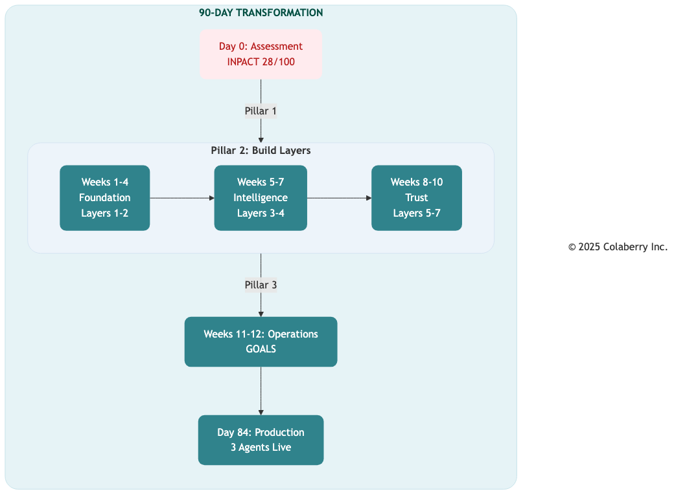

| Phase | Timeline | Pillar Focus | Achievement |
|-------|----------|--------------|-------------|
| Assessment | Day 0 | INPACT | 28/100 baseline |
| Foundation | Weeks 1-4 | 7-Layer (1-2) | Storage + Real-Time |
| Intelligence | Weeks 5-7 | 7-Layer (3-4) | Semantic + RAG |
| Trust | Weeks 8-10 | 7-Layer (5-7) | Governance + Observability + Orchestration |
| Operations | Weeks 11-12 | GOALS | 21/25 achieved |
| **Production** | Week 12 | **All 3 Validated** | 89/100 INPACT, 7/7 Layers, 21/25 GOALS |

<!-- pagebreak -->

### Final Score Card

---

| Metric | Day 0 | Week 12 | Change |
|--------|-------|---------|--------|
| INPACT Score™ | 28/100 | 89/100 | +61 points |
| GOALS Metrics™ Score | N/A | 21/25 | Production ready |
| Investment | - | $992K | 19% under budget |
| ROI | - | 477% | Validated |
| Agents Live | 0 | 3 | Production |
| User Satisfaction | N/A | ~87% | Above target |

Dr. Raj stood. "The board approves production deployment. You've answered my question, and you've built something we can trust."

---

## Bridge to Part IV: Your Turn

Echo's journey was complete. Ninety days. $992K invested. Three agents in production.

But Echo wasn't unique. They started where most organizations are: legacy infrastructure, siloed data, failed AI attempts, skeptical stakeholders.

What made them different was their approach. They built trust before intelligence. They validated each pillar before moving to the next. They measured what mattered.

The Architecture of Trust isn't proprietary to Echo. It's a pattern any organization can replicate.

**Part IV is your roadmap to do the same.**

Chapter 9 begins with assessment. The journey to trusted AI starts with knowing your starting point.

Now it's your turn.

---

## Key Takeaways

1. **Operations prove the architecture.** The infrastructure was complete at Week 10, but trust required operational proof. Week 11-12 validated that Echo's seven-layer architecture could sustain production workloads.

2. **GOALS dimensions work as a system.** Observability enabled faster governance response. Governance improvements increased user confidence. The Trust Flywheel builds momentum: each improvement enables the next.

3. **Healthcare requires Governance 5/5.** The mandatory threshold reflects the stakes of clinical decision support. Echo achieved it through continuous improvement, not just comprehensive controls.

4. **Three pillars validate together.** Every operational win connected back to INPACT needs and 7-Layer components. Measurement enables improvement: Echo moved from 15/25 to 21/25 because they could measure precisely where they stood.

5. **The pattern is repeatable.** Assess, build, measure, improve. Echo's journey isn't unique to healthcare. It's the Architecture of Trust applied to a specific context.

<!-- pagebreak -->

## Operational Metrics Summary

**Final GOALS Status:**

---

| Dimension | Week 10 | Week 12 | Key Achievement |
|-----------|---------|---------|-----------------|
| Governance | 3/5 | 5/5 | Continuous learning from HITL outcomes |
| Observability | 3/5 | 4/5 | ~4 min MTTD, full explainability |
| Availability | 4/5 | 4/5 | 10x scale validated |
| Lexicon | 2/5 | 4/5 | ~5% clarification rate |
| Solid | 3/5 | 4/5 | 98% cross-system consistency |
| **Total** | **15/25** | **21/25** | **Threshold achieved** |

---

**Agent Performance Summary:**

| Agent | Response Time | Accuracy | HITL Rate | Satisfaction |
|-------|--------------|----------|-----------|--------------|
| Care Coordination | 1.6s | 97% | ~3% | ~87% |
| Clinical Documentation | 1.9s | 96% | ~8% | ~87% |
| Revenue Cycle | 1.4s | 98% | ~6% | ~87% |

---

## References

[1] U.S. Department of Health and Human Services (2024). "HHS Office for Civil Rights Settles HIPAA Investigation with Montefiore Medical Center for $4.75 Million." HHS Press Release, February 6, 2024. https://www.hhs.gov/hipaa/for-professionals/compliance-enforcement/agreements/montefiore/index.html

[2] European Commission (2024). "AI Act: First Regulation on Artificial Intelligence." https://digital-strategy.ec.europa.eu/en/policies/regulatory-framework-ai

[3] American Diabetes Association (2024). "Standards of Care in Diabetes." Diabetes Care. https://diabetesjournals.org/care/issue/47/Supplement_1
# Chapter 9: What's Your Score?

## The Assessment Chapter

---

## The Assessment That Almost Didn't Exist

*Friday, 4:15 PM - Echo Health Systems, Innovation Lab - Week 14*

"We got lucky," Sarah Cedao said.

Marcus Williams looked up from his laptop. The operations dashboard showed green across all metrics. Fifty thousand queries processed. 1.6-second average response. Zero compliance incidents.

"Lucky? We planned this for ninety days."

"We planned the *build*. But we stumbled into the starting point." Sarah pulled up the Week 0 gap analysis. "Remember? Five days arguing about where to begin. Then Swapna ran that informal assessment and everything clicked. One number told us more than six consultants."

"The twenty-eight."

"Other organizations will face the same chaos. Board mandates, budget pressure, no idea where to start." Sarah walked to the whiteboard. "What if we gave them what we didn't have? Thirty-six questions. Six dimensions. Thirty minutes. Their score tells them exactly what we wished we'd known on day one."

"And Echo's journey becomes the benchmark."

"Twenty-eight to eighty-nine. Every data point and every week documented." Sarah stepped back. "They don't have to guess what's possible."

This chapter is what they wrote down.

---

**Figure 9.1: Assessment Value, From Confusion to Clarity**


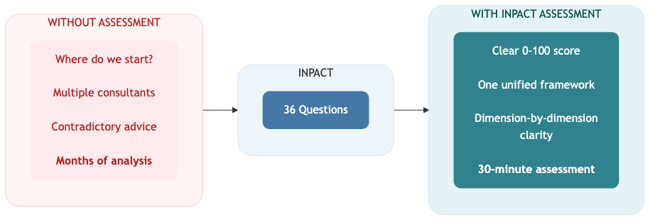
> **Key Takeaway:** One assessment. Six dimensions. Complete clarity on where to invest.


---

## Part 1: One Assessment Is All It Takes

### Why One Assessment Works

Every enterprise attempting AI agent deployment faces the same question: Where do we start? The choices seem overwhelming: infrastructure gaps, governance requirements, operational concerns, technology choices. Many organizations commission multiple assessments, hire different consultants for each layer, and end up with contradictory recommendations that consume months before any real work begins.

There's a simpler path. A single assessment can measure everything that matters.

The Architecture of Trust integrates three frameworks into one coherent system. Understanding this integration reveals why one assessment delivers comprehensive insight:

**INPACT defines what agents need.** The six dimensions (Instant, Natural, Permitted, Adaptive, Contextual, and Transparent) capture the fundamental requirements any AI agent must have to operate reliably in an enterprise environment. For complete framework details, see Chapters 2 and 3.

**The 7-Layer Architecture delivers those needs.** Each layer addresses specific INPACT dimensions. For complete 7-Layer details, see Chapters 4, 5, and 6.

**GOALS ensures sustainable operation.** Five operational targets (Governance, Observability, Availability, Lexicon, and Solid) translate infrastructure capability into organizational outcomes. *For complete GOALS Framework™ detail, see Chapter 7.*

These three frameworks form a chain of dependency. INPACT requirements drive architecture decisions. Architecture capabilities enable operational excellence. Operational excellence delivers the trust that makes agent adoption successful.

**Figure 9.2: Architecture of Trust Assessment Flow**


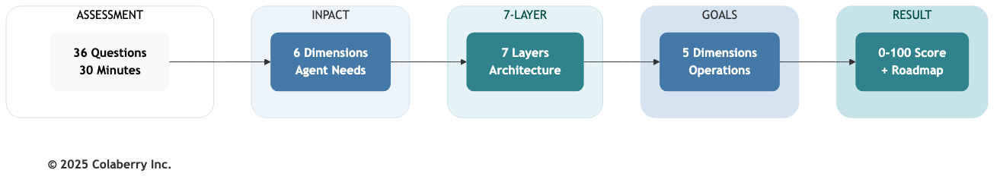
The integration principle is simple: **if you assess INPACT comprehensively, you've assessed everything.**

When you measure whether your infrastructure delivers *Instant* responses, you're simultaneously assessing Layer 1 (storage performance), Layer 2 (data freshness), and Layer 4 (caching efficiency). When you evaluate *Permitted* access control, you're measuring Layer 5 (governance) and Layer 6 (audit trails). Every INPACT dimension maps to specific layers and indicates GOALS readiness.

This is why 36 questions can measure your entire agent readiness posture. Not because the assessment is shallow, but because the questions target root causes that ripple through the entire system.

**What This Chapter Gives You:**

By the end of this chapter, you will have:

1. **Your INPACT score (0-100)**: A single number capturing your current agent readiness
2. **Dimension-by-dimension breakdown**: Which of the six needs your infrastructure fulfills and which remain gaps
3. **Layer priorities**: Which of the seven architecture layers need the most investment
4. **Timeline guidance**: How long your transformation will take based on your starting point
5. **Benchmark comparison**: How your journey compares to Echo Health Systems' 28→89 progression

The assessment takes approximately 30 minutes. The clarity it provides saves months of misdirected effort.

With the assessment's structure established, you need to understand what the numbers mean.

---

### 36 Questions, One Answer

The INPACT scoring system provides a standardized, repeatable method for measuring agent readiness. Every organization, regardless of industry, size, or current technology stack, can apply the same scale and achieve comparable results.

**Scoring Scale (1-6 per dimension)**

Each INPACT dimension is scored on a six-point scale:

| Score | Label | Description | Infrastructure State |
|-------|-------|-------------|---------------------|
| **6** | Excellent | Best-in-class, competitive advantage | Production-grade, exceeds requirements |
| **5** | Strong | Production-ready, meets all requirements | Full deployment appropriate |
| **4** | Functional | Adequate for limited production | Deploy with monitoring |
| **3** | Moderate | Basic capability, improvement needed | Pilot-only acceptable |
| **2** | Significant Gap | Poor capability, major gaps | Not deployment-ready |
| **1** | Critical Gap | Inadequate, blocks production | Immediate remediation required |

This scale captures meaningful distinctions. The difference between a 3 and a 4 isn't arbitrary. It represents the threshold between pilot-only capability and production deployment. The difference between a 5 and a 6 distinguishes meeting requirements from achieving competitive advantage.

**Calculation Method**

The INPACT score calculation is simple:

1. **Score each dimension**: Rate your infrastructure 1-6 on each of the six dimensions (I, N, P, A, C, T)
2. **Sum the raw scores**: Total = I + N + P + A + C + T (range: 6-36)
3. **Calculate percentage**: INPACT Score™ = (Total ÷ 36) × 100

For example, Echo Health Systems' Week 0 assessment scored 10/36 points (28/100), with five dimensions at critical levels (1-2/6) and only Contextual reaching moderate (3/6). Chapter 2 details the full breakdown.

**Trust Bands**

Raw scores translate into five trust bands that indicate agent readiness:

**Figure 9.3: The Five Trust Bands**


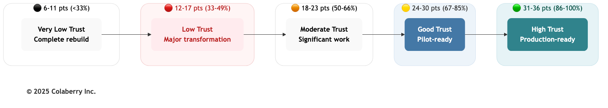
| Raw Score | Percentage | Trust Band | Agent Readiness |
|-----------|------------|------------|-----------------|
| 31-36 | 86-100% | 🟢 **High Trust** | Production-ready for enterprise agents |
| 24-30 | 67-85% | 🟡 **Good Trust** | Pilot-ready, minor gaps remain |
| 18-23 | 50-66% | 🟠 **Moderate Trust** | Significant work needed before agents |
| 12-17 | 33-49% | 🔴 **Low Trust** | Major transformation required |
| 6-11 | <33% | ⚫ **Very Low Trust** | Complete rebuild required |

These thresholds aren't arbitrary. They emerge from Colaberry's pattern recognition across enterprise implementations. Organizations scoring below 80/100 consistently experience agent failures in production. Those scoring 86+ achieve successful deployment with minimal post-launch issues.

*See Part 4 for detailed guidance on what your trust band means for timeline, budget, and chapter navigation.*

---

### Six Dimensions & Seven Layers

INPACT covers the full architecture. Each dimension doesn't exist in isolation. It requires specific infrastructure layers to be fulfilled. When you score an INPACT dimension, you're simultaneously assessing the health of those underlying layers.

**Figure 9.4: INPACT Dimension to Layer Mapping**


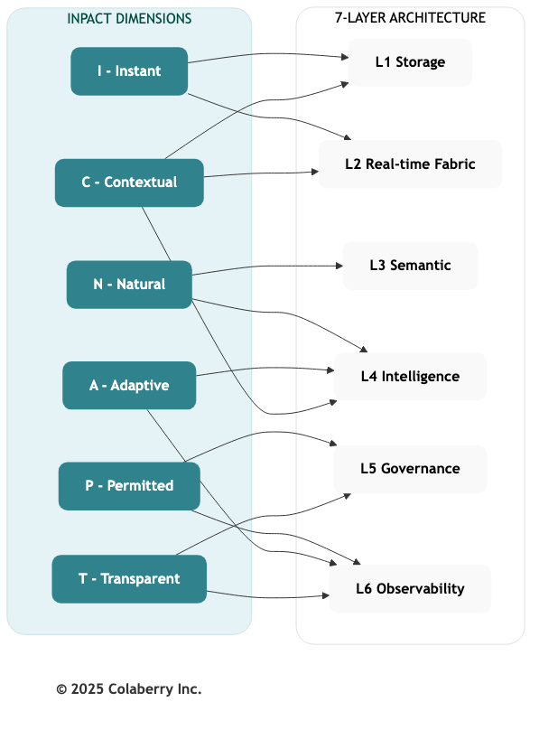
**Coverage Verification**: This mapping touches all seven layers. L7 (Orchestration) emerges when multiple dimensions reach production thresholds simultaneously. When you discover a low score in a particular dimension, you immediately know which layers require investment.


<!-- pagebreak -->

### INPACT & GOALS: The Connection

The INPACT assessment measures infrastructure readiness: can you *build* agents? The GOALS Framework measures operational readiness: can you *run* agents? These are different questions, but they're connected.

---

**INPACT → GOALS Indicators**

| INPACT Dimension | GOALS Indicator | The Connection |
|-------------------|------------------|----------------|
| **P - Permitted** | G - Governance | ABAC policies, HITL workflows, and compliance controls constitute your governance capability |
| **T - Transparent** | O - Observability | Audit trails, trace infrastructure, and monitoring dashboards enable organizational visibility |
| **I - Instant** | A - Availability | Response time and uptime directly determine whether users can access agent capabilities |
| **N - Natural** | L - Language | Semantic accuracy and NLU quality define whether users and agents speak the same language |
| **A + C + T** | S - Solid | Learning, context, and transparency combine to ensure reliable, trustworthy output |

This mapping is *indicative*, not deterministic. A high INPACT score means your infrastructure *foundation* is strong, but operational excellence requires policies, procedures, training, and accountability structures that go beyond infrastructure. Chapter 8 detailed Echo's GOALS journey; Chapter 12 provides the operational playbook.

With the methodology clear, it's time to take the assessment.

---

## Part 2: Take the Assessment

### The Online Assessment

Complete your INPACT assessment at [trustbeforeintelligence.ai/assessment](https://trustbeforeintelligence.ai/assessment).

The online tool provides:

- 36 questions across six dimensions (30 minutes)
- Automated scoring with instant results
- Visual gap analysis showing your strengths and weaknesses
- Custom roadmap generation based on your specific scores
- Benchmark comparison against Echo Health and industry peers
- Progress tracking as your infrastructure matures

The assessment is free for book readers.

---

### What You'll Be Measuring

The assessment evaluates six questions per INPACT dimension. Each question scores your infrastructure from 1 (critical gap) to 6 (production-ready). Here's a sample question from each dimension to illustrate the methodology:

<!-- pagebreak -->

**I (Instant) - Sample Question:**
*How quickly can your data infrastructure return query results for typical agent workloads?*

| Score | Criteria |
|-------|----------|
| 6 | Sub-1-second P99 latency for complex queries |
| 5 | Sub-2-second P95 latency, sub-5-second P99 |
| 4 | 2-5 second typical response, occasional delays |
| 3 | 5-10 second responses common |
| 2 | 10-30 second responses typical |
| 1 | Over 30 seconds, frequent timeouts |

**N (Natural) - Sample Question:**
*Do you have a semantic layer that translates business terms to data structures?*

| Score | Criteria |
|-------|----------|
| 6 | Universal semantic layer covering all domains |
| 5 | Comprehensive coverage (80%+ of business concepts) |
| 4 | Functional coverage (core concepts mapped) |
| 3 | Partial coverage (limited domains) |
| 2 | Minimal semantic layer (basic glossary only) |
| 1 | No semantic layer |

**P (Permitted) - Sample Question:**
*What authorization approach governs agent data access?*

| Score | Criteria |
|-------|----------|
| 6 | Zero-trust ABAC with ML anomaly detection |
| 5 | Comprehensive ABAC (40+ policies), sub-10ms evaluation |
| 4 | ABAC operational with core attributes |
| 3 | RBAC with some attribute-based rules |
| 2 | Static RBAC only, shared service accounts |
| 1 | No authorization or open access |

**A (Adaptive) - Sample Question:**
*Do you have infrastructure to capture user feedback on agent responses?*

| Score | Criteria |
|-------|----------|
| 6 | Multi-channel feedback with sentiment analysis |
| 5 | Systematic feedback capture, integrated with training |
| 4 | Feedback collection operational |
| 3 | Basic feedback mechanism |
| 2 | Feedback captured but not connected |
| 1 | No feedback infrastructure |

**C (Contextual) - Sample Question:**
*How many source systems feed your agent-accessible data layer?*

| Score | Criteria |
|-------|----------|
| 6 | 10+ systems with automated discovery |
| 5 | 7-10 systems integrated |
| 4 | 4-6 systems integrated |
| 3 | 2-3 systems integrated |
| 2 | Single system only |
| 1 | No integration |

**T (Transparent) - Sample Question:**
*How completely do you capture the reasoning chain from question to answer?*

| Score | Criteria |
|-------|----------|
| 6 | Complete trails with ML-powered analysis |
| 5 | 100% coverage, end-to-end trace IDs, 7+ year retention |
| 4 | Comprehensive trails, partial correlation |
| 3 | Basic audit trails, user identity captured |
| 2 | Database query logs only |
| 1 | No audit trails |

---

### Honest Scoring Matters

The assessment's value depends entirely on honest answers. Inflated scores produce incorrect priorities and wasted investment.

**Common traps to avoid:**

- **Aspirational scoring:** Score your *current* state, not your roadmap
- **Best-case scoring:** Score *typical* performance, not peak performance
- **Technology-possession scoring:** Owning Databricks is not the same as operational capability

Echo Health scored 28/100 on their initial assessment. That painful number told them exactly where to invest. An inflated score would have led them to skip foundational work and fail.

**Ready to assess?** Visit [trustbeforeintelligence.ai/assessment](https://trustbeforeintelligence.ai/assessment)

---

## Part 3: 28 to 89: Echo's Path

Your INPACT score gains meaning through comparison. Echo Health Systems' transformation from 28/100 to 89/100 provides the definitive benchmark: a real progression through real infrastructure challenges with real investment decisions.

This section establishes Echo's journey as your reference point. Whether you're starting higher or lower, Echo's experience illuminates what each score means in practice.

---

### Starting at 28

Echo Health Systems approached their initial assessment with confidence. Four hospitals, 23 clinics, 847 physicians, 340,000 annual patient encounters. They had data. They had technology. They had a board mandate to deploy AI agents.

They scored 28 out of 100.

Sarah Cedao, Echo's CTO, remembers the moment: "Twenty-eight out of a hundred. We're not ready for AI agents. We're barely ready for the questions."

The score exposed painful truth: five dimensions at critical gaps (1-2), only C (Contextual) showing any strength at 3/6, and all seven layers needing investment. At 28/100, the full 90-day transformation with no shortcuts wasn't optional. *For Echo's complete dimension breakdown at Week 0, see Chapter 8.*

---

### The 90-Day Climb

Echo's progression from 28/100 to 89/100 followed a deliberate sequence. Each phase addressed specific dimensions, building capability that enabled subsequent phases.

**Figure 9.5: Echo's 90-Day INPACT Transformation**


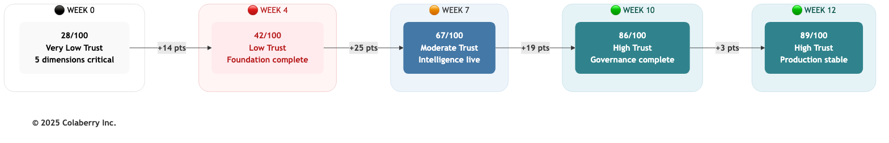
**Echo's INPACT Progression: Milestone View**

| Milestone | Week | Score | Key Achievement | Trust Band |
|-----------|------|-------|-----------------|------------|
| **Baseline** | 0 | 28/100 | Assessment complete, gaps identified | ⚫ Very Low Trust |
| **Foundation** | 4 | 42/100 | L1-L2 operational, real-time data flowing | 🔴 Low Trust |
| **Intelligence** | 7 | 67/100 | L3-L4 operational, semantic layer live | 🟠 Moderate Trust |
| **Trust** | 10 | 86/100 | L5-L7 operational, governance complete | 🟢 High Trust |
| **Operations** | 12 | 89/100 | GOALS validated, production stable | 🟢 High Trust |

*For complete dimension-by-dimension progression and what drove each jump, see Chapter 8.*

---

### What's Your Starting Point?

Echo's journey provides calibration for your own assessment.

**If Your Score Matches Echo's Week 0 (25-35)**

You face a complete transformation. You need:
- Full 90-day roadmap (Chapter 10)
- All four phases: Foundation → Intelligence → Trust → Operations
- Timeline: 10-12 weeks minimum to production readiness

**If Your Score Exceeds Echo's Week 4 (40-65)**

You have foundations in place. Your transformation compresses:
- Skip or abbreviate Phase 1 (Foundation)
- Focus on your weakest dimensions
- Timeline: 6-10 weeks to production readiness

**If Your Score Exceeds Echo's Week 7 (65-80)**

You're close to production readiness:
- Focus on dimensions scoring 3-4
- Governance and transparency often remain as final gaps
- Timeline: 4-6 weeks to production readiness

**If Your Score Falls Below Echo's Week 0 (<25)**

Consider extended timeline (16+ weeks), AIXcelerator acceleration, or phased approach to achieve pilot readiness first.

*For complete budget guidance by score range, see Chapter 10 and Chapter 11*

**Finding Your Starting Point**

| Your Lowest Dimensions | Echo Phase Match | Chapter 10 Entry Point |
|------------------------|------------------|------------------------|
| I and C below 3 | Echo Week 0-4 | Phase 1: Foundation |
| N below 3 | Echo Week 4-7 | Phase 2: Intelligence |
| P and T below 3 | Echo Week 7-10 | Phase 3: Trust |
| A below 3 | Echo Week 10-12 | Phase 4: Operations |

---

## Part 4: Breaking Down Your Score

You have your INPACT score. You've seen how Echo progressed from 28 to 89. Now translate your specific results into action.

---

### Your Trust Band

Your trust band estimates your transformation **timeline and investment level**. Your lowest dimensions (next section) determine **where to focus**.

**🟢 HIGH TRUST (86-100%)**  
**Timeline:** 2-4 weeks | **Budget:** $20K-$150K | **Guide:** Chapter 12

You're ready. Your infrastructure fulfills agent needs across all six dimensions. Deploy with confidence. Organizations in this band often arrived through prior modernization efforts: cloud migrations, data platform investments, or governance initiatives that weren't labeled "AI readiness" but delivered exactly that.

**🟡 GOOD TRUST (67-85%)**  
**Timeline:** 4-8 weeks | **Budget:** $60K-$500K | **Guide:** Chapters 10-11

Solid foundations with gaps in specific dimensions. Production deployment is achievable with targeted investment. But don't underestimate P (Permitted) and T (Transparent). Organizations assume governance and transparency can be "added at the end." They're wrong. These dimensions become deployment blockers.

**🟠 MODERATE TRUST (50-66%)**
**Timeline:** 8-12 weeks | **Budget:** $120K-$900K | **Guide:** Chapters 10-11

You can see your data. You can run queries quickly. But your agents don't understand user questions, and you can't enforce who sees what. This is the dangerous zone. Don't deploy now and "add governance later." Organizations who tried crashed - agents returning confidential data to unauthorized users, misunderstanding questions so badly that users stopped trusting them entirely.

**🔴 LOW TRUST (33-49%)**
**Timeline:** 12-16 weeks | **Budget:** $190K-$1.2M | **Guide:** Chapters 10-11

Your infrastructure was built for a different era - BI reports, analyst queries, batch processing. Agents need something fundamentally different. Attempting to deploy agents on this foundation produces failures that get blamed on AI rather than infrastructure. Echo started at 28/100 in this band. Their 90-day transformation proves it's achievable, but it requires systematic investment.

**⚫ VERY LOW TRUST (<33%)**  
**Timeline:** 16+ weeks | **Budget:** $190K-$1.5M+ | **Guide:** Chapters 10-12

Your current infrastructure cannot support agent workloads. This isn't a gap to close - it's a foundation to build. Organizations who attempt deployment anyway experience predictable failures: agents that take minutes to respond, answers that contradict each other, security violations that trigger compliance investigations. The damage poisons future AI initiatives. "We tried AI and it didn't work" becomes organizational mythology.

*Budget ranges reflect the spectrum from pure open-source (low end) to commercial platforms (high end). See Chapter 10, Part 3 for detailed track options.*

---

### Closing Your Gaps

Your trust band tells you *how long* and *how much*. Your lowest dimensions tell you *where to focus*.

Regardless of your overall score, your lowest-scoring dimensions reveal which layers need the most attention. A score of 70 with weak Instant (I) still requires Phase 1 foundation work. Not all gaps are equal.

**Figure 9.6: Gap-to-Phase Prioritization Flow**


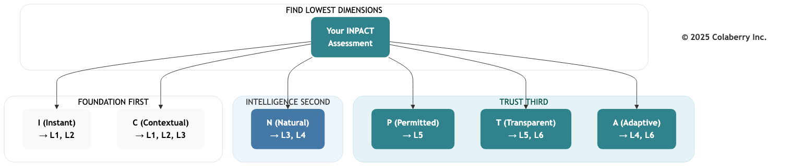
**Gap Prioritization Matrix**

| If Your Lowest Dimension Is... | Priority Layers | Chapter 10 Phase |
|--------------------------------|-----------------|------------------|
| **I (Instant)** | L1, L2 | Phase 1: Foundation |
| **N (Natural)** | L3, L4 | Phase 2: Intelligence |
| **P (Permitted)** | L5 | Phase 3: Trust |
| **A (Adaptive)** | L4, L6 | Phase 3-4 |
| **C (Contextual)** | L1, L2, L3 | Phase 1-2 |
| **T (Transparent)** | L5, L6 | Phase 3 |

*For detailed INPACT-to-Layer mapping with technology recommendations, see Chapter 11, Section 1.1.*

**Interpreting Multiple Low Dimensions**

If several dimensions score 1-2, prioritize based on dependencies: I and C first (foundational), N second (builds on data), P and T third (enable deployment), A fourth (can mature during production).

**Your Action Plan**

1. Record your six dimension scores
2. Identify your two lowest dimensions
3. Map those dimensions to priority layers (table above)
4. Proceed to Chapter 10 with clear focus

---
<!-- pagebreak -->

## Bridge to Chapter 10

You now have:
- Your **INPACT score** (overall readiness)
- Your **trust band** (timeline and budget estimate)
- Your **priority dimensions** (where to focus)
- Your **priority layers** (from the Gap Prioritization Matrix)

Chapter 10 provides the week-by-week playbook. The four-phase sequence (Foundation → Intelligence → Trust → Operations) is fixed. What varies is where you invest the most time based on your priority layers.

Your assessment revealed the gaps. The playbook shows how to close them.

Turn the page to build your plan.

---

## Chapter 9 Summary

| Section | Key Takeaway |
|---------|--------------|
| **Part 1: Methodology** | One INPACT assessment measures all three pillars: needs, architecture, and operations |
| **Part 2: The 36 Questions** | Complete self-assessment tool covering six dimensions with 1-6 scoring |
| **Part 3: Echo's Benchmark** | 28→89 progression provides calibration for your own journey |
| **Part 4: Interpretation** | Trust bands estimate timeline and budget; lowest dimensions determine focus |

**Your INPACT Score**: ___/100

**Your Trust Band**: _______________

**Your Priority Dimensions**: _______________, _______________

**Your Chapter 10 Entry Point**: Phase ___
# Chapter 10: The AI Agent Readiness Playbook

## From Assessment to Production in 90 Days

---

## The Clock Starts Now

*Tuesday, 2:15 PM
Enterprise AI Summit, Main Stage
Six Months After Production Launch*

Sarah Cedao stepped to the podium at the Enterprise AI Summit. Four hundred IT leaders waited.

"Everyone asks for our secret," she began. "There isn't one. Just a playbook we followed week by week." She clicked to her first slide: a four-phase roadmap.

"The layers are the same regardless of industry. Foundation, intelligence, trust, operations. The sequence doesn't change. Your technologies might. Your timeline might. But the playbook? That's universal."

This chapter is that presentation.

---

**Figure 10.1: Roadmap Value: From Ad-Hoc to Structured**


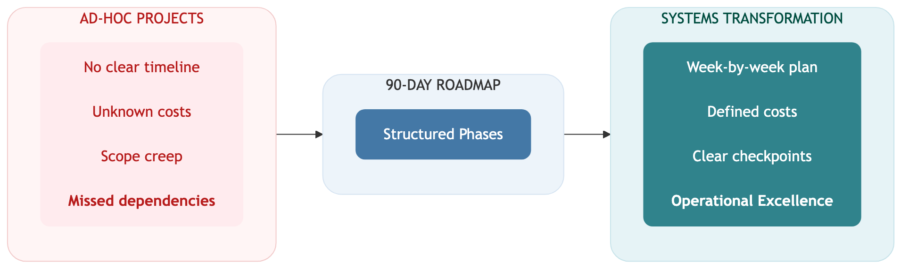
> **Key Takeaway:** Ninety days from assessment to production. Week-by-week structure eliminates guesswork.

---

## Part 1: The Roadmap

### Your 90-Day Journey

Chapter 9 gave you the diagnosis: your INPACT score, trust band, and priority layers. This chapter gives you the treatment plan - a week-by-week playbook for transforming your infrastructure from assessment to production-ready. The playbook is universal; where specific numbers help, we reference real implementations as evidence.

**Why 90 Days?**

The 90-day timeline isn't arbitrary. It's the result of balancing three constraints:

1. **Business urgency**: Executives lose patience with multi-year transformation programs. 90 days delivers measurable results before budget reviews and leadership changes.

2. **Technical dependency chains**: The seven layers have dependencies. Layer 4 (Intelligence) requires Layer 1 (Storage) and Layer 3 (Semantic). Rushing creates gaps; extending creates complexity. 90 days provides enough time for sequential layer building with validation.

3. **Team sustainability**: Transformation projects demand intense focus. Beyond 90 days, teams burn out, priorities shift, and momentum dissipates. The four-phase structure creates natural milestones that maintain energy.

The 90-day timeline typically breaks into 10 weeks of building plus 2 weeks of validation. Your timeline may vary based on starting point (Part 4), but the phase sequence remains constant.

**What You'll Get from This Chapter**

By the end of this chapter, you will have:

- **Four phase structures** with clear boundaries, budgets, and go/no-go checkpoints
- **Implementation architecture diagrams** showing technology stack options for each phase
- **Risk management patterns** that keep transformations on track when challenges emerge
- **The 90-Day Tracker system** - seven interconnected tracking sheets to manage your own transformation

**How to Use This Roadmap**

Chapter 9 gave you four things:
1. Your **INPACT score** (overall readiness)
2. Your **trust band** (timeline and budget estimate)
3. Your **priority dimensions** (your two lowest-scoring dimensions)
4. Your **priority layers** (from the Gap Prioritization Matrix)

Your trust band (from Chapter 9) tells you *how long* and *how much*. Your priority layers tell you *where to focus* in this playbook:

| If Your Priority Layers Are... | Your Focus in This Playbook |
|-------------------------------|----------------------------|
| L1, L2 (Foundation gaps) | Full attention to Phase 1; continue sequentially |
| L3, L4 (Intelligence gaps) | Validate Phase 1 (1-2 weeks); invest deeply in Phase 2 |
| L5, L6, L7 (Trust gaps) | Validate Phases 1-2 (1-2 weeks each); invest deeply in Phase 3 |
| Multiple layers across phases | Execute all phases fully as documented |

The phase sequence never changes: Foundation → Intelligence → Trust → Operations. What varies is where you compress (validate only) and where you expand (full investment).

**Important Cross-References**

This chapter focuses on *when* to build. Other chapters provide complementary guidance:

- For *how to assess* your current state → Chapter 9 (INPACT methodology)
- For *what technologies* to select → Chapter 11 (vendor evaluation)
- For *how to operate* at scale → Chapter 12 (production operations)
- For *week-by-week layer detail* → Chapters 4-6

### Change Management Approach

Technical transformation fails without organizational alignment. Invest deliberately in stakeholder communication and user adoption.

**Communication Rhythm**

| Cadence | Audience | Content |
|---------|----------|---------|
| Daily | Implementation team | Standup, blockers, coordination |
| Weekly | Extended team + sponsors | Progress, risks, decisions needed |
| Bi-weekly | Executive steering | Strategic decisions, budget status |
| Monthly | Board (prepared) | Transformation progress, ROI trajectory |

**Stakeholder Engagement**

Identify four stakeholder groups with different concerns:

- **End users**: Will this make my job easier or harder? (Focus: workflow integration, training)
- **IT/Operations**: Can we support this? (Focus: infrastructure, monitoring, on-call burden)
- **Compliance/Legal**: Is this safe and auditable? (Focus: audit trails, liability, regulatory requirements)
- **Finance**: What's the ROI? (Focus: costs, benefits, payback period)

Schedule dedicated sessions with each group at phase boundaries, not just project kickoff. Early engagement prevents late-stage resistance.

---

### Four Phases Overview

The transformation follows four distinct phases, each building on the previous. The sequence matters - attempting Phase 3 governance work before Phase 1 foundations produces the failures behind AI agents' 95% failure rate.[1]

**Figure 10.2: The 90-Day Four-Phase Roadmap**


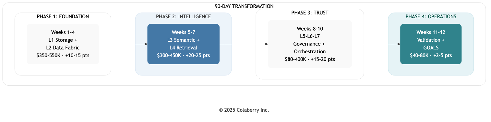
---

## Part 2: The Four Phases

### Phase 1: Foundation (Weeks 1-4)


| Attribute | Detail |
|-----------|--------|
| **Weeks** | 1-4 |
| **Layers** | L1 (Multi-Modal Storage) → L2 (Real-Time Data Fabric) |
| **INPACT Target** | +10-15 points |
| **Budget Range** | $80K-$550K (see Part 3: The Investment Approach) |
| **Team** | 2 senior data engineers, 1 cloud architect, 1 DBA, 2 CDC specialists (consulting) |
| **Primary Focus** | Data freshness (<30 seconds), query performance |

**Figure 10.3: Foundation Layer Stack**


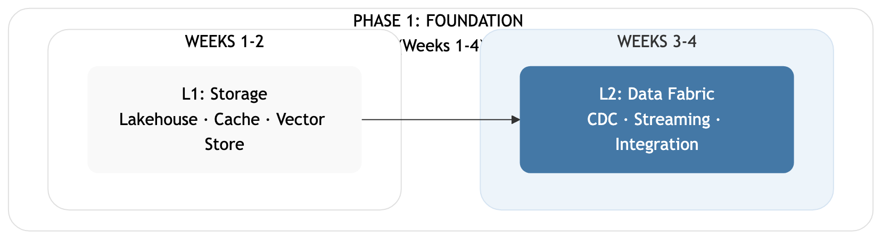

**What Gets Built**

Phase 1 establishes the foundation everything else depends on. Build layer-by-layer to maintain momentum and clear dependencies:

**Weeks 1-2: Layer 1 (Multi-Modal Storage)**
- Unified lakehouse for analytics (Databricks, Snowflake, or equivalent)
- In-memory cache for sub-millisecond access (Redis, Memcached)
- Vector store preparation for Phase 2 semantic search

**Weeks 3-4: Layer 2 (Real-Time Data Fabric)**
- CDC captures changes from source systems (Debezium, Fivetran, or native connectors)
- Event streaming for real-time data flow (Kafka, Pulsar, or cloud-native)
- Target: <30-second data freshness (down from batch cycles)

**Common Risk:** CDC integration delays are typical - legacy system complexity often adds 1-3 days. Have parallel workstreams ready to maintain momentum.

**Technology Options**

For Layer 1 and Layer 2 technology details, see Chapter 4. For vendor selection guidance, see Chapter 11.

**Phase Gate Checkpoint**

- INPACT score ≥40 (±5% tolerance)
- CDC operational for critical tables (e.g., customers, transactions, core entities)
- Storage infrastructure provisioned and tested
- If behind: Add 1-2 weeks to Phase 1; never skip ahead to Phase 2

**→ For complete week-by-week detail: Chapter 4 (Foundation Layers)**

<!-- pagebreak -->

### Phase 2: Intelligence (Weeks 5-7)


| Attribute | Detail |
|-----------|--------|
| **Weeks** | 5-7 |
| **Layers** | L3 (Semantic Layer) → L4 (Intelligent Retrieval) |
| **INPACT Target** | +20-25 points |
| **Budget Range** | $60K-$450K (see Part 3: The Investment Approach) |
| **Team** | 2 ML engineers, 1 domain SME, semantic layer specialists |
| **Primary Focus** | NLU accuracy (target: 85%), semantic layer coverage, RAG pipeline |

**Figure 10.4: Intelligence Layer Stack**

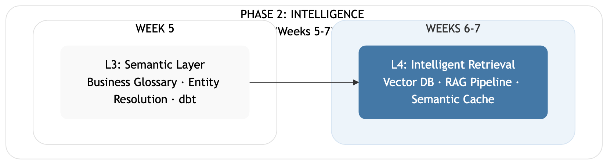
<!-- *For RAG pipeline architecture details, see Chapter 5, Figure 5.7: Layer 4 - Complete Intelligence Pipeline.* -->


**What Gets Built**

Phase 2 gives agents the ability to understand and reason. Build layer-by-layer:

**Week 5: Layer 3 (Semantic Layer)**
- Business glossary mapping domain terms to data structures (target: 1,000+ terms)
- Entity resolution achieving 95%+ accuracy across source systems
- Semantic models translating business concepts to technical queries (dbt, Cube, or equivalent)

**Weeks 6-7: Layer 4 (Intelligent Retrieval)**
- Vector database for semantic search (Pinecone, Weaviate, Chroma, or equivalent)
- Seven-stage intelligence pipeline (see Chapter 5, Figure 5.7): Query → Embed → Retrieve → Rerank → Context → LLM → Cache
- Semantic caching to reduce LLM costs (target: 70%+ hit rate)

**Common Risk:** Accuracy often plateaus at 80-82% before hitting the 85% target. Solutions include adding reranking, hybrid search (combining vector and keyword retrieval), or expanding the semantic layer. Don't proceed with gaps - they compound in Phase 3.

**Technology Options:** For Layer 3 and Layer 4 technology details, see Chapter 5. For vendor selection guidance, see Chapter 11.

**Phase Gate Checkpoint**

- INPACT score ≥65 (±5% tolerance)
- Query accuracy ≥85% on test set (500 queries across all domains)
- Semantic layer operational with entity resolution
- If behind: Tune RAG pipeline; add reranking; extend Phase 2 by 1 week

**→ For complete week-by-week detail: Chapter 5 (Intelligence Layers)**

---

### Phase 3: Trust & Orchestration (Weeks 8-10)


| Attribute | Detail |
|-----------|--------|
| **Weeks** | 8-10 |
| **Layers** | L5 (Agent-Aware Governance) + L6 (Observability complete) + L7 (Orchestration) |
| **INPACT Target** | +15-20 points |
| **Budget Range** | $30K-$400K (see Part 3: The Investment Approach) |
| **Team** | 2 security engineers, 2 DevOps engineers, 1 compliance officer, 1 ML engineer |
| **Primary Focus** | ABAC policies, HITL workflows, audit trails, multi-agent coordination |

**Figure 10.5: Trust Layer Stack**

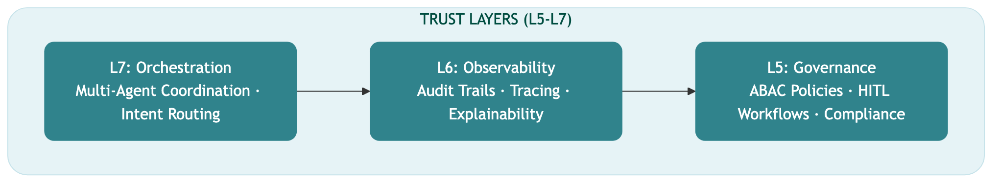


**What Gets Built**

Phase 3 makes agents trustworthy:

- **ABAC governance**: Policy engine (OPA, Styra, or equivalent) evaluates access policies in <10ms - who is asking, what they're accessing, when, and from where
- **HITL workflows**: Confidence-based escalation routes high-risk decisions to human reviewers; target escalation rate <15%
- **Observability complete**: Distributed tracing (OpenTelemetry), APM (Datadog, New Relic, or equivalent), complete audit trails for compliance requirements
- **Multi-agent orchestration**: Coordination framework (LangGraph, AutoGen, or custom) manages specialized agents with shared state

**Common Risk:** Policy complexity often exceeds initial estimates - enterprises typically have 3-5× more access control edge cases than documented. Start with high-impact policies (PHI access, financial transactions) and expand iteratively.

**Cost Optimization Opportunity**

Phase 3 offers the largest budget variance potential. Open-source choices (OPA vs. commercial Styra, leveraging existing monitoring licenses, retrofitting pilot agents vs. rebuilding) can reduce costs by 50-80%. Evaluate build-vs-buy carefully - see Chapter 11.

**Technology Options:** For Layer 5, 6, and 7 technology details, see Chapter 6. For vendor selection guidance, see Chapter 11, Section 3.


**Phase Gate Checkpoint**

- INPACT score ≥80 (±5% tolerance)
- All 7 layers operational
- HITL escalation rate <15%
- Audit trail 100% complete
- If behind: Focus on governance policies; extend Phase 3 by 1 week

**→ For complete week-by-week detail: Chapter 6 (Transparency + Orchestration Layers)**

---

### Phase 4: Operations (Weeks 11-12)

| Attribute | Detail |
|-----------|--------|
| **Weeks** | 11-12 |
| **Focus** | Validation, UAT, Production Readiness |
| **INPACT Target** | +2-5 points (refinement) |
| **Budget Range** | $20K-$80K (see Part 3: The Investment Approach) |
| **Team** | UAT facilitators, compliance sign-off, training staff |
| **Primary Focus** | User Acceptance Testing, production cutover |

**What Gets Validated**

Phase 4 validates everything works together:

- **UAT with real users**: Representative user group tests real scenarios over 2 weeks
- **Edge case resolution**: Identify and resolve edge cases before production (expect 30-60)
- **Production readiness**: 15-criteria checklist verified (see Chapter 12)
- **GOALS operational targets**: All five metrics at target levels

**Success Criteria**

| Metric | Target |
|--------|--------|
| UAT success rate | ≥90% |
| Task completion | ≥90% of workflows completed successfully |
| User satisfaction | ≥4.0/5.0 |
| NLU accuracy (production) | ≥85% |
| HITL override rate | <15% |

**Common Risk:** UAT reveals unexpected workflow gaps - expect 30-60 edge cases requiring resolution. Build buffer time for iteration; rushing to production with unresolved issues creates post-launch incidents.

**Phase Gate Checkpoint**

- UAT success rate ≥90%
- All 15 production readiness criteria met
- Stakeholder sign-off obtained
- Go-live decision made

**→ For complete operations guide: Chapter 12 (Production Operations)**

---

## Part 3: The Investment Approach

### Budget Framework

Your investment depends on your technology strategy. Three tracks (Commerical, Open Source, Hybrid) reflect different build-vs-buy decisions:

<!-- pagebreak -->

**Commercial Track** (Speed priority, smaller technical teams)

| Phase | Weeks | Budget Range | INPACT Gain |
|-------|-------|--------------|--------------|
| Foundation | 1-4 | $350K-$550K | +10-15 points |
| Intelligence | 5-7 | $300K-$450K | +20-25 points |
| Trust | 8-10 | $200K-$400K | +15-20 points |
| Operations | 11-12 | $40K-$80K | +2-5 points |
| **Total** | **12 weeks** | **$890K-$1.5M** | **+50-65 points** |

**Hybrid Track** (Balanced approach, selective open-source)

| Phase | Weeks | Budget Range | INPACT Gain |
|-------|-------|--------------|--------------|
| Foundation | 1-4 | $200K-$350K | +10-15 points |
| Intelligence | 5-8 | $150K-$300K | +20-25 points |
| Trust | 9-11 | $80K-$200K | +15-20 points |
| Operations | 12-14 | $30K-$60K | +2-5 points |
| **Total** | **14 weeks** | **$460K-$910K** | **+50-65 points** |

**Pure Open-Source Track** (Budget priority, strong engineering team)

| Phase | Weeks | Budget Range | INPACT Gain |
|-------|-------|--------------|--------------|
| Foundation | 1-5 | $80K-$150K | +10-15 points |
| Intelligence | 6-10 | $60K-$120K | +20-25 points |
| Trust | 11-14 | $30K-$80K | +15-20 points |
| Operations | 15-16 | $20K-$50K | +2-5 points |
| **Total** | **16 weeks** | **$190K-$400K** | **+50-65 points** |

**Choosing Your Track**

| Factor | Commercial | Hybrid | Pure Open-Source |
|--------|------------|--------|------------------|
| Timeline | 12 weeks | 14 weeks | 16 weeks |
| Internal engineering strength | Low-Medium | Medium | High |
| Ongoing operational burden | Low | Medium | High |
| Vendor support/SLAs | Yes | Partial | No |
| Best for | Speed to production | Balanced cost/speed | Maximum savings |

Your Chapter 9 trust band provides timeline and total budget guidance. Use this framework to select the track that fits your organization's capabilities and constraints.

### Cost Categories

Investment typically breaks down across three categories:

| Category | Commercial | Hybrid | Open-Source |
|----------|------------|--------|-------------|
| **Technology** (platforms, licenses) | 45-55% | 25-35% | 10-20% |
| **Cloud Infrastructure** | 10-15% | 20-30% | 25-35% |
| **Services** (consulting, training) | 20-30% | 20-25% | 15-20% |
| **Staff** (internal team time) | 15-20% | 25-30% | 35-45% |

Open-source shifts cost from software licenses to staff time and cloud infrastructure.

### Key Investment Insights

**Track Selection Drives Total Cost**

The same transformation can cost $190K or $1.5M depending on your technology choices. The INPACT outcome is the same - what differs is timeline, operational burden, and where the money goes.

**Phase 3 Has Highest Variance Within Each Track**

Trust & Orchestration costs vary most based on:
- Policy engine: OPA (free) vs. Styra ($100K+)
- Monitoring: Grafana/Prometheus (free) vs. Datadog ($50K+)
- Orchestration: LangChain (free) vs. commercial platforms ($50K+)

Evaluate build-vs-buy carefully - see Chapter 11, Section 3.

**Ongoing Operations**

Monthly recurring costs after go-live vary by track:

| Cost Component | Commercial | Hybrid | Open-Source |
|----------------|------------|--------|-------------|
| Cloud infrastructure | $20K-$35K | $18K-$30K | $25K-$45K |
| LLM API/inference | $10K-$20K | $5K-$12K | $2K-$8K |
| Platform licenses | $8K-$15K | $3K-$8K | $0-$2K |
| Support/maintenance | $5K-$10K | $5K-$10K | $8K-$15K |
| **Total monthly** | **$43K-$80K** | **$31K-$60K** | **$35K-$70K** |

Open-source reduces platform license costs but increases cloud infrastructure (self-managed systems require more compute) and support/maintenance (internal staff time). The total cost of ownership converges across tracks - the difference is where the money goes, not how much.

### ROI Expectations

| Metric | Typical Range |
|--------|---------------|
| Year 1 ROI | 150-250% |
| 3-Year ROI | 400-600% |
| Payback Period | 8-14 weeks from production |

ROI sources vary by industry but typically include: operational efficiency gains, reduced manual workload, improved accuracy, faster response times, and avoided compliance incidents.

> **Note:** Budget and timeline figures in this chapter reflect typical ranges for mid-size enterprise implementations based on the 7-Layer Architecture methodology.

<!-- pagebreak -->

## Part 4: Your Path

### Receiving Your Chapter 9 Results

You arrived with
- **Trust band** → Your timeline and budget envelope (from Chapter 9)
- **Priority layers** → Where to focus (from Chapter 9's Gap Prioritization Matrix)

<!--This section shows how to adapt each phase based on your priority layers. -->

### Phase Compression vs. Full Investment

| Your Priority Layers | Phase 1 | Phase 2 | Phase 3 | Phase 4 |
|---------------------|---------|---------|---------|---------|
| L1, L2 | **FULL** (4 weeks) | Standard (3 weeks) | Standard (3 weeks) | Standard (2 weeks) |
| L3, L4 | Validate (1-2 weeks) | **FULL** (3 weeks) | Standard (3 weeks) | Standard (2 weeks) |
| L5, L6, L7 | Validate (1-2 weeks) | Validate (1-2 weeks) | **FULL** (3 weeks) | Standard (2 weeks) |
| All layers need work | **FULL** (4 weeks) | **FULL** (3 weeks) | **FULL** (3 weeks) | **FULL** (2 weeks) |

**FULL** = Maximum investment - this is where your gaps live
**Standard** = Execute as documented in Part 2  
**Validate** = Audit existing infrastructure, confirm phase gate criteria, fill gaps only (1-2 weeks)  

### Handling Multiple Priority Layers

If Chapter 9 identified priority layers spanning multiple phases (e.g., C dimension maps to L1, L2, L3):

1. **Start with foundational layers first** - L1/L2 before L3/L4 before L5/L6/L7
2. **Don't skip phases** - even if L3 is your priority, validate L1/L2 first
3. **Budget accordingly** - your Chapter 9 trust band accounts for this complexity

### Common Adaptation Patterns

| Starting Condition | Adaptation | Rationale |
|--------------------|------------|-----------|
| Strong data warehouse, weak real-time | Compress L1, expand L2 | Your storage works; CDC is the gap |
| Good CDC infrastructure, no vector storage | Skip L2, expand L1 | Real-time exists; semantic search is missing |
| Semantic layer exists (dbt, Cube) | Validate L3, focus on L4 | Business terms defined; RAG pipeline needed |
| RBAC only, no attribute-based access | Expand Phase 3 by 1-2 weeks | Governance requires more policy work |
| Single agent working in pilot | Focus L7 orchestration | Agent logic proven; coordination missing |
| Regulated industry (healthcare, finance, government) | Add 1 week to Phase 3 | Additional compliance validation needed |
| Multi-cloud environment | Add 1 week to Phase 1 | Cross-cloud data fabric complexity |

**Scaling Considerations:** The baseline roadmap scales for a mid-size organization (1,000-15,000 employees). Adjust timelines for your scale:

| Organization Size | Timeline Adjustment | Budget Adjustment |
|-------------------|---------------------|-------------------|
| Small (<1,000 employees) | -2 weeks | 0.6× |
| Mid-size (1,000-15,000 employees) | Baseline | 1.0× |
| Large (15,000-50,000 employees) | +2 weeks | 1.5× |
| Enterprise (50,000+ employees) | +4 weeks | 2.0-3.0× |

Larger organizations require more stakeholder alignment, broader testing, and phased rollout across business units.

<!-- pagebreak -->

## Part 5: Managing Risk

### Risk Escalation Framework

**Figure 10.6: Risk Escalation Framework**


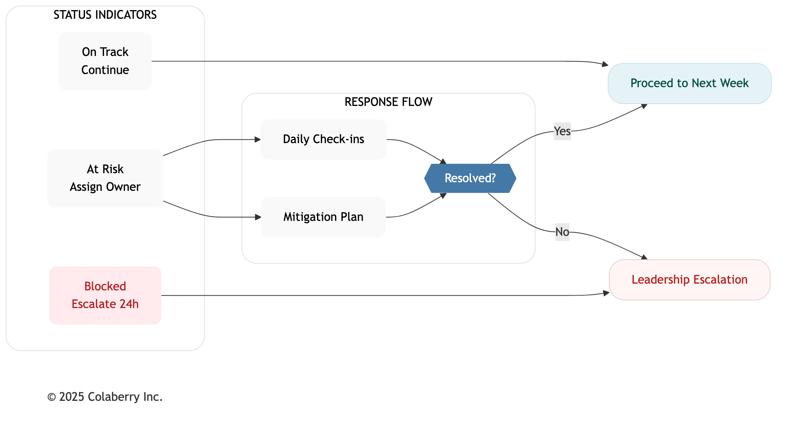
### Phase Gate Checkpoints

Every phase ends with a formal go/no-go decision. These gates prevent the most common failure mode: proceeding with gaps that compound into production failures. Phase gate criteria are documented in each phase section (Part 2). The critical discipline: never skip a gate, never proceed with gaps.

**Gate Decision Authority**

CTO/CDO makes the final call with steering committee input. Never delegate gate decisions to the implementation team - they have incentive to proceed even with gaps.

### Weekly Health Checks

Within each phase, Friday health checks catch issues early:

- **🟢 On Track**: Continue as planned. No action required.
- **🟡 At Risk**: Assign owner, define mitigation plan, begin daily check-ins. Target resolution within 5 business days.
- **🔴 Blocked**: Escalate to leadership within 24 hours. Block cannot be resolved at team level.

**Never let blockers persist across weekends without escalation.**

### Common Risk Patterns

Most transformations encounter 1-3 yellow weeks. Common patterns and mitigations:

**Phase 1 Risk: CDC Complexity**
- Issue: Legacy system CDC integration takes longer than planned
- Mitigation: Parallelize other workstreams while resolving; have batch fallback ready
- Prevention: Budget 1-2 extra days for CDC; engage source system experts early

**Phase 2 Risk: Accuracy Plateau**
- Issue: RAG accuracy stalls at 80-82%, below 85% gate requirement
- Mitigation: Add reranking layer; implement hybrid search; expand semantic layer
- Prevention: Build accuracy testing into daily workflow; don't wait for phase gate

**Phase 3 Risk: Policy Complexity**
- Issue: ABAC policy definition takes longer as edge cases emerge
- Mitigation: Start with core policies; add edge cases iteratively post-launch
- Prevention: Involve compliance early; document policy requirements in Phase 1

The weekly health check discipline catches issues before they become blockers.


## Part 6: The AI Agent Readiness Tracker

### Inside the Eight Tabs

**Tab 0: Day Zero Readiness (Gate)**

The pre-transformation gate ensuring organizational readiness. Select your tier (Essential/Standard/Comprehensive) based on organization size, then complete items across six domains: Assessment & Planning, Stakeholder Alignment, Team & Resources, Technical Prerequisites, Data Readiness, and Compliance & Risk. Critical items (✅) are blockers. Week 1 remains locked until all critical items show "Ready" and overall readiness reaches 90%+.

**Tab 1: Weekly Progress Dashboard**

The executive view showing overall status at a glance. Columns include Week, Phase, Primary Layer Focus, INPACT Status, GOALS Progress (Phase 3+), Top Risk, Status (🟢/🟡/🔴), Key Deliverable, and Notes. Update every Friday; review in Monday leadership standup.

**Tab 2: INPACT Progress Tracker**

Tracks the six INPACT dimensions (I, N, P, A, C, T) week by week on a 1-6 scale. Your two lowest dimensions from Chapter 9 identify your priority layers. Use this tab to track whether those dimensions are improving as you execute the corresponding phases.

**Tab 3: GOALS Health Dashboard**

Monitors the five GOALS operational metrics: Governance, Observability, Availability, Lexicon, and Soundness. Activates in Phase 3 when operational concerns become primary. Target: all five metrics at ≥80% by Week 12.

**Tab 4: 7-Layer Build Status**

Technical tracking of layer-by-layer progress. Each layer shows weekly status (🔴 Not Started / 🟡 In Progress / 🟢 Operational / ✅ Production). Includes Key Components and Evidence columns to document what's deployed and how it's validated.

**Tab 5: Risk & Blocker Log**

Issue tracking with probability, impact, severity, owner, mitigation plan, and resolution status. Expect 10-15 risks over 12 weeks; most resolve within the week, 1-2 may require phase adjustments.

**Tab 6: Stakeholder Communication Log**

Documents every meeting, decision, and action item. Critical for maintaining alignment and providing audit trail. Expect 40-50 logged communications across 12 weeks including daily standups, weekly reviews, and bi-weekly executive steering.

**Tab 7: Budget Tracker**

Monitors spend by category (Technology, Services, Staff) against plan. Weekly actuals with variance tracking and percentage spent. Threshold alerts: Green (within ±5%), Yellow (±5-10%), Red (>±10%).


**Figure 10.7: Eight-Tab Tracker System**


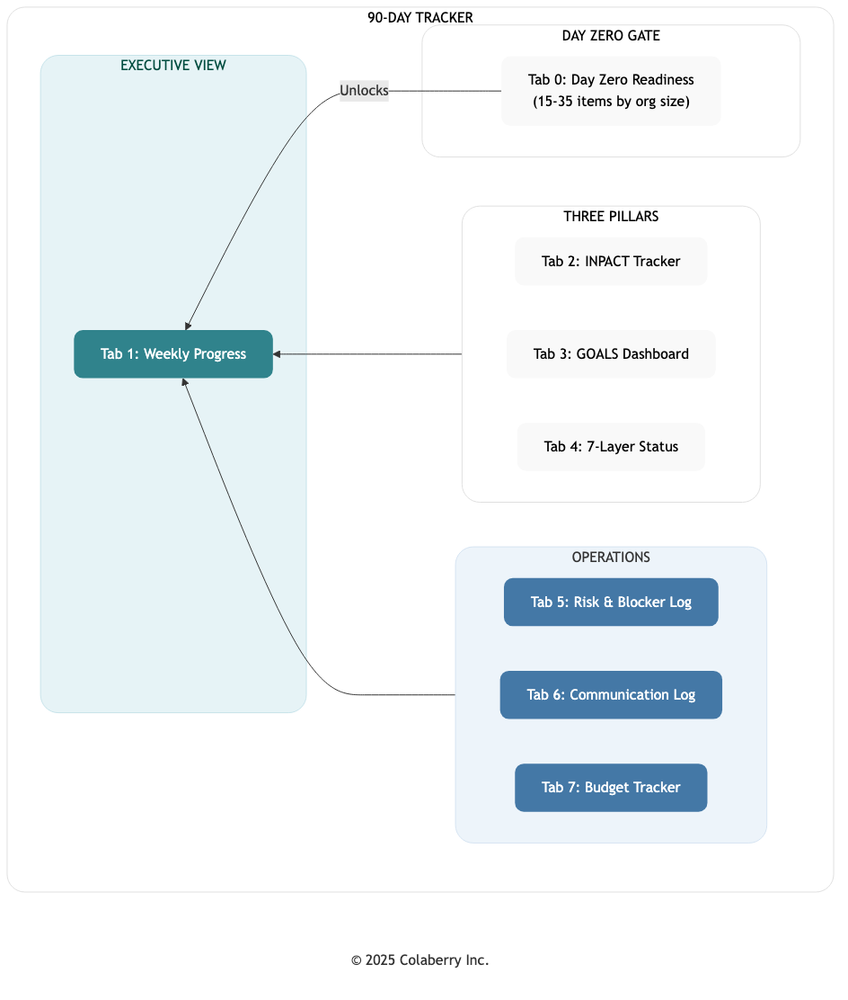

<!-- pagebreak -->

### How the Tabs Work Together

| Tab | Purpose | Primary User | Update Frequency |
|-----|---------|--------------|------------------|
| **Tab 0: Day Zero Readiness** | Pre-transformation gate - 15-35 items by org size | Project Manager | Before Week 1 |
| **Tab 1: Weekly Progress** | Executive dashboard - overall status | Project Manager | Weekly (Friday) |
| **Tab 2: INPACT Tracker** | Six dimensions, week-by-week scores | Data Architect | Weekly |
| **Tab 3: GOALS Dashboard** | Five operational metrics | Operations Lead | Weekly (Phase 3+) |
| **Tab 4: 7-Layer Status** | Layer-by-layer build progress | Technical Lead | Weekly |
| **Tab 5: Risk & Blocker Log** | Issue tracking and mitigation | Project Manager | As needed |
| **Tab 6: Communication Log** | Meetings, decisions, action items | Project Manager | Per meeting |
| **Tab 7: Budget Tracker** | Spend vs. plan by category | Finance | Weekly |

### Getting Started with the Tracker

**Day Zero: Pre-Transformation Readiness**

Before Week 1 begins, complete the Day Zero checklist (Tab 0) at trustbeforeintelligence.ai/tracker. This gate prevents the #1 cause of failed transformations: starting without proper preparation.

Day Zero items scale by organization size:
- **Essential** (15 items): Small organizations (<1,000 employees), -2 weeks timeline
- **Standard** (25 items): Mid-size organizations (1,000-15,000 employees), baseline 12 weeks
- **Comprehensive** (35 items): Large/Enterprise (15,000+ employees), +2-4 weeks timeline

Critical blockers (items like Executive Sponsor, Steering Committee, Budget Approved, INPACT Assessment Complete) must be "Ready" before Week 1 unlocks.

**Before Week 1:**
1. Access the online tracker at trustbeforeintelligence.ai/tracker
2. Select your organization tier and complete Day Zero checklist (Tab 0)
3. Complete your INPACT assessment (Chapter 9) to establish baseline scores
4. Customize phase focus based on your priority layers (Part 4)
5. Confirm team allocation (see Tab-by-Tab guidance for recommended owners)

**Week 1 Onward:**
- Friday: Update all tabs with current week's progress
- Monday: Review Tab 1 in leadership standup, address any 🟡/🔴 status
- Ongoing: Log risks immediately in Tab 5; don't wait for Friday
- Per meeting: Update Tab 6 with decisions and action items

**Integration with Other Chapters**

- Chapter 11 provides technology selection guidance for each layer tracked in Tab 4
- Chapter 12 provides operations detail for GOALS Metrics™ in Tab 3
- The tracker connects planning (Chapter 10) to execution (Chapters 11-12)

<!-- pagebreak -->

## Part 7: Bridge to Chapters 11-12

You now have the complete implementation roadmap:

- **Part 1**: Four phases with the rationale behind the 90-day timeline
- **Part 2**: Phase-by-phase detail with technology stacks and phase gates
- **Parts 3-4**: Investment summary and adaptation guidance for your context
- **Part 5**: Risk management framework and phase gate checkpoints
- **Part 6**: The 90-Day Tracker system with Day Zero gate plus seven implementation tabs

**What's Next**

Two questions remain: *What technologies should you select?* and *How do you operate at scale?*

**Chapter 11: Technology Selection Guide**

How do you choose between Databricks and Snowflake? Pinecone and Weaviate? Build or buy? Chapter 11 provides:
- Vendor evaluation methodology for each of the seven layers
- Technology stack options with selection rationale
- Build vs. buy analysis framework
- Alternative options for different contexts and budgets

**Chapter 12: Production Operations**

Deployment is not the finish line. Chapter 12 covers everything after go-live:
- 15-criteria production readiness checklist
- MLOps practices for agent systems (model monitoring, drift detection, retraining)
- Incident response and escalation procedures
- Continuous improvement from feedback loops
- Ongoing operations cost management

**Your Monday Morning**

Week 1 starts with Layer 1 storage provisioning, but only after Day Zero is complete. Before that first Monday:

**Day Zero Complete (Prerequisites):**
- INPACT assessment complete with baseline score
- Priority layers identified from assessment
- Executive sponsor identified and steering committee formed
- Budget approved and resources allocated
- Current-state documentation complete (all seven layers assessed)
- Technology track selected (Commercial / Hybrid / Open-Source)

**Week 1 Friday Targets:**
- Storage infrastructure provisioning underway
- Week 2 plan finalized with assigned owners
- First progress update in Tab 1

The frameworks are proven. The tracker is ready. Complete Day Zero at trustbeforeintelligence.ai/tracker.

**The 90-day clock starts when Day Zero is complete.**

<!-- pagebreak -->

## Chapter Summary

| Part | Content | Key Takeaway |
|------|---------|--------------|
| **Part 1** | Roadmap overview | Four phases with clear boundaries and checkpoints |
| **Part 2** | Phase summaries | Foundation → Intelligence → Trust → Operations |
| **Part 3** | Investment summary | $190K-$1.5M range, 400-600% 3-year ROI potential |
| **Part 4** | Adaptation guidance | Customize based on your priority layers from Chapter 9 |
| **Part 5** | Risk management | Phase gates, escalation framework |
| **Part 6** | 90-Day Tracker | Eight tabs: Day Zero gate (Tab 0) + seven implementation tabs |

> **Note:** Budget and timeline figures in this chapter reflect typical ranges for mid-size enterprise implementations based on the 7-Layer Architecture methodology.

---

## References

[1] Challapally, A., et al. (2025). "The GenAI Divide: Why 95% of Enterprise GenAI Projects Fail and How to Be in the 5%." MIT Sloan School of Management, New Architectures for Next-Generation Data Analytics (NANDA) Lab. Analysis of 300+ enterprise GenAI initiatives. https://mitsloan.mit.edu/ideas-made-to-matter/why-95-enterprise-genai-projects-fail

*For technology selection references and vendor documentation, see Chapter 11.*
# Chapter 11: Build Your Tech Stack

**The Technology Selection Chapter**

---

*Week 1, Wednesday afternoon. Ten weeks before production.*

Sarah stared at the vendor comparison spreadsheet. Fourteen vector databases. Eight CDC platforms. Six semantic layer tools.

Marcus asked about Pinecone's impressive demo: sub-50ms retrieval, slick UI.

"Did they have a BAA?" Sarah asked.

Marcus paused. "I didn't ask."

"Then they're not on the list." She'd learned this lesson the hard way: INPACT first, GOALS second, verify integration. Impressive demos don't mean production-ready.

---

**Figure 11.1: Vendor Selection Transformation**


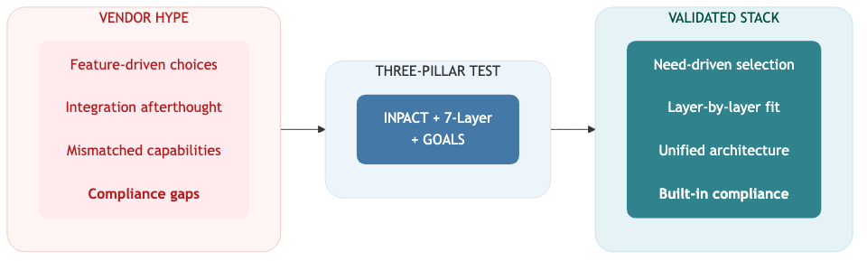
> **Key Takeaway:** Every vendor must pass the three-pillar test. No exceptions.

---

*Technology selection methodology determines success or failure. This chapter provides the criteria, frameworks, and processes to evaluate any vendor against the Architecture of Trust. Your roadmap (Chapter 10) shows when to build. This chapter shows how to decide what to build with.*

> **📚 Online Tools:** For interactive vendor evaluation scorecards, assessment templates, and current vendor comparisons, see the **Online Tools** section at the end of this chapter.


## Part 1: Selection Framework

### 1.1 Your Assessment Drives Your Stack

Your INPACT score from Chapter 9 determines your technology priorities. The mapping is direct:

| Low Score | Priority Layers | Selection Focus |
|-----------|-----------------|-----------------|
| **I (Instant)** | L1, L2 | Sub-100ms queries, <30s CDC latency |
| **N (Natural)** | L3, L4 | Semantic glossaries, embedding quality |
| **P (Permitted)** | L5 | ABAC engines, HITL workflows, audit platforms |
| **T (Transparent)** | L6 | LLM tracing, citation tracking, explainability |
| **A or C** | L2, L4, L7 | Feedback loops, cross-system integration |

*For complete INPACT-to-Layer mapping, see Chapter 9, Part 1.3.*

**Three Selection Principles**

Every vendor evaluation follows three principles:

1. **INPACT-First**: Does the technology help agents meet the six fundamental needs?
2. **GOALS-Ready**: Can your team operate this technology with excellence?
3. **Layer-Aligned**: Does it fit the 7-Layer Architecture without gaps or overlaps?

**Chapter Structure**

- **Part 1:** Selection framework (three-pillar vendor test, build vs buy, budget tiers)
- **Part 2:** Layer-by-layer selection criteria (what to evaluate, not whom to select)
- **Part 3:** Evaluation process (RFP templates, POC approach, contract negotiation)
- **Part 4:** Applying the methodology (Echo's selection process as example)

> **Note:** Budget ranges and discount percentages in this chapter are illustrative. Your actual pricing will vary based on vendor negotiations, deployment scale, and market conditions.

---

### 1.2 The Three-Pillar Vendor Test

Every technology in a production stack must pass the same evaluation. Three pillars, separately scored, identify vendors that meet both agent needs and operational requirements.

**Figure 11.2: The Three-Pillar Vendor Evaluation Framework**


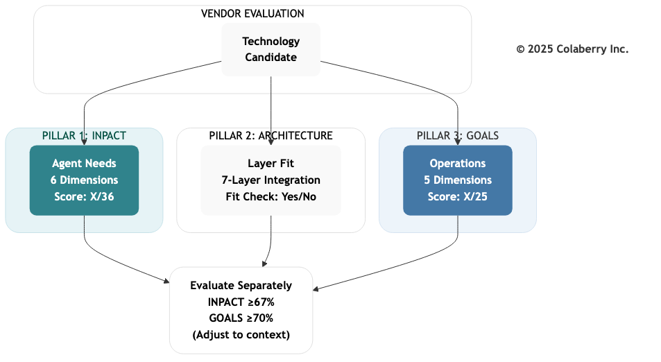
**Pillar 1: INPACT Agent Needs (Score Separately)**

The first pillar asks: does this technology help agents meet the six fundamental needs? Each INPACT dimension translates into specific vendor evaluation questions:

| INPACT Need | Vendor Evaluation Question | What to Look For |
|--------------|---------------------------|------------------|
| **I (Instant)** | Does it support <100ms queries? Real-time data access? | Sub-50ms response times, efficient caching, streaming support |
| **N (Natural)** | Does it support NLU, semantic capabilities? | Vector embeddings, semantic search, terminology mapping |
| **P (Permitted)** | Does it support ABAC, HITL, audit trails? | Role-based + attribute-based access, human escalation, logging |
| **A (Adaptive)** | Does it enable feedback loops, continuous learning? | Model versioning, A/B testing, feedback integration |
| **C (Contextual)** | Does it integrate with multiple sources? | API breadth, connector ecosystem, data federation |
| **T (Transparent)** | Does it provide explainability, citations, compliance? | Audit trails, decision traces, regulatory support |

Score each relevant dimension 1-6. Not every dimension applies to every vendor category. A vector database primarily addresses I (speed) and N (semantic), while a policy engine focuses on P (permitted) and T (transparent). Score only the dimensions relevant to that technology's purpose. *(For complete scoring rubrics, see the INPACT Practitioner Reference.)*

**INPACT Vendor Score**: Sum of relevant dimensions (maximum 36 if all apply)

**Pillar 2: Architecture Fit (Qualitative Check)**

The second pillar ensures the technology integrates cleanly into the 7-Layer Architecture:

- **Layer Alignment**: Which layer does this vendor serve? Is it the right tool for that layer's specific purpose?
- **Adjacent Integration**: Does it connect smoothly with the layers above and below?
- **Gap Prevention**: Does selecting this vendor create gaps in your architecture, or complete a capability you need?
- **Overlap Avoidance**: Does this vendor duplicate functionality you're getting elsewhere?

**Architecture Fit**: Pass/Fail based on layer alignment and integration quality

**Pillar 3: GOALS Operations (Score Separately)**

The third pillar measures operational readiness. A technology might score perfectly on INPACT but fail if your team can't operate it effectively:

| GOALS Dimension | Vendor Evaluation Question | What to Look For |
|------------------|---------------------------|------------------|
| **G (Governance)** | Does it support policy enforcement, compliance? | Industry certifications (SOC2, ISO27001, etc.), audit features |
| **O (Observability)** | Does it provide monitoring, tracing, dashboards? | Built-in metrics, logging quality, alerting integration |
| **A (Availability)** | What's the uptime SLA? Support quality? | 99.9%+ SLA, responsive support, documentation quality |
| **L (Lexicon)** | Does it support semantic accuracy, terminology? | API quality, SDK maturity, integration breadth |
| **S (Solid)** | Is it reliable, consistent, high-quality? | Production track record, error handling, data integrity |

Score each dimension 1-5 (GOALS uses 5-point scale).

**GOALS Vendor Score**: Sum of relevant dimensions (maximum 25)

**Why Separate Scores Matter**

INPACT measures what infrastructure must *provide* to agents. GOALS measures how you *operate* that infrastructure. A vendor scoring high on INPACT but low on GOALS delivers impressive technology your team can't sustain. Both scores must exceed minimum thresholds independently.


**What This Means for Your Vendor Search**

Your three-pillar scores become your vendor conversation framework. When evaluating any technology:

1. **Filter first**: Compliance requirements eliminate vendors before technical evaluation
2. **Score INPACT**: Does it meet agent needs for its layer?
3. **Score GOALS**: Can your team operate it?
4. **Verify architecture fit**: Does it integrate with adjacent layers?

This methodology applies regardless of which specific vendors you evaluate. The vendor landscape changes; the evaluation criteria remain constant.

---

### 1.3 Build vs Buy vs Partner

Not every component requires a vendor purchase. The Architecture of Trust supports a hybrid approach: buy commodity capabilities, build differentiators, partner for expertise.

**Figure 11.3: Build vs Buy vs Partner Decision Flow**


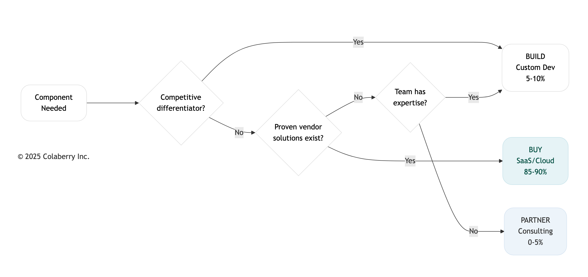
**Build (Custom Development): 5-10% of Stack**

Custom development makes sense when:

- The capability is a competitive differentiator unique to your organization
- No vendor solution fits your specific workflow or compliance requirements
- You need deep integration with proprietary systems
- Long-term maintenance costs are acceptable

**Typical Build Candidates**:
- Custom HITL user interfaces matching specific domain workflows
- Specialized agent prompts incorporating domain-specific concepts
- Integration layers connecting proprietary source systems to semantic layers

**Build Trade-offs**:
- ✅ Perfect fit for unique requirements
- ✅ No vendor dependency
- ⚠️ Higher upfront development cost
- ⚠️ Ongoing maintenance burden
- ⚠️ Slower time-to-value

**Buy (SaaS/Cloud Services): 85-90% of Stack**

Purchasing makes sense when:

- The capability is commodity (many proven solutions exist)
- Time-to-value matters more than perfect fit
- Your team lacks specialized expertise to build and maintain
- Vendor provides compliance certifications you need (SOC2, ISO27001, industry-specific)

**Typical Buy Candidates**:
- Vector databases, data warehouses, graph databases
- CDC platforms, streaming infrastructure
- Observability and monitoring tools
- LLM APIs and embedding services

**Buy Trade-offs**:
- ✅ Fastest time-to-value
- ✅ Vendor handles maintenance, scaling, security
- ✅ Predictable recurring costs
- ⚠️ Vendor dependency and potential lock-in
- ⚠️ Less customization flexibility

**Partner (Managed Services/Consulting): 0-5% of Stack**

Partnering makes sense when:

- You need expertise your team doesn't have
- Implementation requires specialized knowledge
- One-time setup matters more than ongoing capability
- Knowledge transfer to your team is included

**Typical Partner Candidates**:
- Implementation consulting for transformation projects
- Domain-specific content mapping (industry terminology, regulatory requirements)
- Compliance validation and audit preparation

**Partner Trade-offs**:
- ✅ Access specialized expertise without hiring
- ✅ Compressed timelines through experienced guidance
- ✅ Knowledge transfer builds internal capability
- ⚠️ Variable costs based on scope
- ⚠️ Dependency on partner availability

<!-- pagebreak -->

## Part 2: Layer-by-Layer Selection Criteria

This section provides selection criteria for each of the seven architecture layers. For each layer, you'll find: the purpose and INPACT dimensions to prioritize, minimum requirements and questions to ask vendors, red flags that eliminate vendors, and subcategories to evaluate.

> **📚 For specific vendor comparisons:** Use the **Vendor Advisor at trustbeforeintelligence.ai/tools** for personalized recommendations based on your context.

**Figure 11.4: The 7-Layer Architecture Technology Stack**


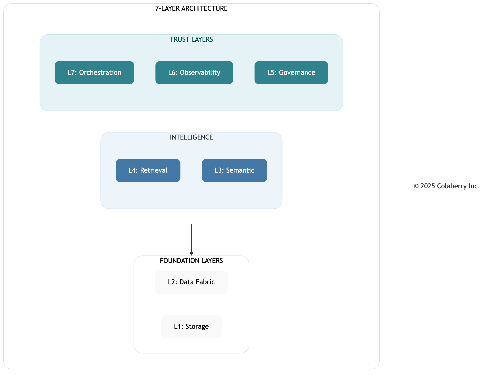
---

### 2.1 Layer 1: Multi-Modal Storage

**Purpose:** Store vectors, structured data, and graph relationships for agent retrieval

**INPACT Dimensions to Prioritize:** I (speed), C (integration), N (vectors)

**Implementation Timing:** Weeks 1-4 (Foundation Phase)

Without performant multi-modal storage, agents can't retrieve context quickly enough for conversational interaction. See Chapter 4 for implementation details.

**Selection Criteria**

| Criterion | Minimum Requirement | Questions to Ask Vendors |
|-----------|---------------------|--------------------------|
| Query Latency | <100ms p95 | What is your p95 latency at 500 concurrent users? |
| Regulatory Compliance | Industry certifications available | What compliance certifications do you hold? (SOC2, ISO27001, etc.) |
| Embedding Support | Native vector operations | Which embedding models integrate natively? |
| Scalability | 10x headroom | How do you handle 10x current load? |
| Data Residency | Region-specific storage | Can you guarantee US-only data storage? |

**Red Flags (Eliminate Vendor If Present)**

- No compliance certifications for your industry's regulatory requirements
- Latency benchmarks only for small datasets (<1M records)
- Requires self-managed infrastructure without DevOps support
- No native integration with common embedding providers
- Pricing model that scales unpredictably with query volume

**Subcategories to Evaluate**

| Subcategory | Primary Use | Key Differentiator |
|-------------|-------------|-------------------|
| Vector Databases | Semantic search, RAG | Sub-50ms similarity search |
| Data Warehouses | Structured analytics | SQL compatibility, compliance certifications |
| Graph Databases | Relationship traversal | Multi-hop query performance |
| Document Stores | Flexible schema | JSON native, unstructured text |

---

### 2.2 Layer 2: Real-Time Data Fabric

**Purpose:** Keep data fresh (<30 seconds), enable streaming for agents

**INPACT Dimensions to Prioritize:** I (freshness), C (CDC), A (streaming)

**Implementation Timing:** Weeks 1-4 (Foundation Phase)

Without real-time data, agents make decisions on stale context. In healthcare, the difference between catching a medication interaction before administration versus after can be life or death. See Chapter 4 for implementation details.

**Selection Criteria**

| Criterion | Minimum Requirement | Questions to Ask Vendors |
|-----------|---------------------|--------------------------|
| CDC Latency | <30 seconds end-to-end | What is your typical CDC latency from source to target? |
| Connector Coverage | Source systems supported | Do you have native connectors for our key systems? |
| Schema Evolution | Auto-adapt to changes | How do you handle source schema changes? |
| Throughput | >10K events/second | What's your sustained throughput capacity? |
| Exactly-Once Delivery | Guaranteed | How do you ensure no duplicate or lost events? |

**Red Flags (Eliminate Vendor If Present)**

- CDC latency measured in minutes, not seconds
- No native connectors for your key source systems (requires custom development)
- Manual intervention required for schema changes
- No exactly-once delivery guarantee
- Pricing based on row count without volume discounts

**Subcategories to Evaluate**

| Subcategory | Primary Use | Key Differentiator |
|-------------|-------------|-------------------|
| CDC Tools | Database change capture | Connector ecosystem breadth |
| Streaming Platforms | Event processing | Throughput and latency |
| Stream Processing | Real-time transformation | Windowing and aggregation |

---

### 2.3 Layer 3: Semantic Layer

**Purpose:** Translate business language to data structures

**INPACT Dimensions to Prioritize:** N (natural language), C (context), T (transparency)

**Implementation Timing:** Weeks 5-7 (Intelligence Phase)

When a user asks a domain-specific question, the semantic layer resolves this to precise query logic without requiring SQL knowledge. See Chapter 5 for implementation details.

**Selection Criteria**

| Criterion | Minimum Requirement | Questions to Ask Vendors |
|-----------|---------------------|--------------------------|
| Term Resolution | >95% accuracy | What is your term resolution accuracy on domain terminology? |
| Entity Resolution | >90% confidence | How do you handle entity disambiguation across systems? |
| Lineage Tracking | Complete | Can you trace any metric back to source tables? |
| Glossary Scale | >2,000 terms | How many business terms can your glossary support? |
| Ontology Support | Industry standards | Do you support industry-standard ontologies and taxonomies? |

**Red Flags (Eliminate Vendor If Present)**

- No support for industry-standard ontologies required by your domain
- Manual-only term definition (no automation assistance)
- No lineage tracking to source systems
- Entity resolution limited to exact matches only
- No API for programmatic glossary updates

**Subcategories to Evaluate**

| Subcategory | Primary Use | Key Differentiator |
|-------------|-------------|-------------------|
| Semantic Modeling | Metric definitions | SQL-native transformation |
| Data Catalogs | Discovery and governance | Auto-classification, PII detection |
| Entity Resolution | Identity matching | Probabilistic matching confidence |

---

### 2.4 Layer 4: Intelligence Layer

**Purpose:** Transform queries into grounded, accurate responses through RAG

**INPACT Dimensions to Prioritize:** N (NLU), A (adaptive), T (citations)

**Implementation Timing:** Weeks 5-7 (Intelligence Phase)

The intelligence pipeline includes query understanding, embedding generation, hybrid retrieval, reranking, context assembly, LLM generation, and semantic caching. This is not a single technology but an orchestrated workflow. See Chapter 5 for implementation details.

**Selection Criteria**

| Criterion | Minimum Requirement | Questions to Ask Vendors |
|-----------|---------------------|--------------------------|
| RAG Accuracy | >85% on domain queries | What accuracy do you achieve on domain-specific RAG tasks? |
| Citation Support | Source attribution | Can responses include source citations? |
| Hybrid Retrieval | Vector + keyword | Do you support hybrid search with RRF? |
| Context Window | >100K tokens | What's your maximum context window? |
| Streaming Response | SSE support | Can you stream responses token-by-token? |

**Red Flags (Eliminate Vendor If Present)**

- No compliance certifications for LLM providers handling sensitive data
- Citation/attribution not supported
- Vector-only retrieval (no keyword fallback)
- No prompt versioning or management
- Cost model opaque or unpredictable

**Subcategories to Evaluate**

| Subcategory | Primary Use | Key Differentiator |
|-------------|-------------|-------------------|
| LLM Providers | Text generation | Quality, latency, cost |
| Embedding Models | Vectorization | Domain-specific quality |
| RAG Frameworks | Pipeline orchestration | Ecosystem and flexibility |
| Reranking | Result refinement | Accuracy improvement |

---

### 2.5 Layer 5: Governance

**Purpose:** Control what agents can do based on context

**INPACT Dimensions to Prioritize:** P (permitted), T (transparent)

**Implementation Timing:** Weeks 8-10 (Trust Phase)

Agents make thousands of decisions daily and can't rely on human review for every query. Context-aware authorization evaluates the full situation: who is asking, what they're asking for, when, and why. See Chapter 6 for implementation details.

**Selection Criteria**

| Criterion | Minimum Requirement | Questions to Ask Vendors |
|-----------|---------------------|--------------------------|
| Policy Evaluation | <50ms latency | What is your policy evaluation latency at scale? |
| ABAC Support | Four-factor evaluation | Do you support subject, resource, action, and context attributes? |
| HITL Integration | Workflow support | Can policies trigger human escalation? |
| Audit Completeness | 100% coverage | Are all decisions logged with full context? |
| Policy Versioning | Git-compatible | Can policies be version-controlled? |

**Red Flags (Eliminate Vendor If Present)**

- RBAC only (no attribute-based policies)
- No audit trail or incomplete logging
- Policy changes require code deployments
- No HITL escalation capability
- Latency >100ms (impacts user experience)

**Subcategories to Evaluate**

| Subcategory | Primary Use | Key Differentiator |
|-------------|-------------|-------------------|
| Policy Engines | ABAC evaluation | Rego/policy language flexibility |
| Data Governance | Compliance management | Industry-specific compliance features |
| HITL Platforms | Human escalation | Workflow customization |

---

### 2.6 Layer 6: Observability

**Purpose:** See what agents are doing, detect issues, optimize performance

**INPACT Dimensions to Prioritize:** T (transparent), A (adaptive)

**Implementation Timing:** Weeks 8-10 (Trust Phase)

Without observability, agents are black boxes. You can't debug failures, optimize costs, or detect quality degradation. See Chapter 6 for implementation details.

**Selection Criteria**

| Criterion | Minimum Requirement | Questions to Ask Vendors |
|-----------|---------------------|--------------------------|
| Distributed Tracing | End-to-end | Can you trace requests across all seven layers? |
| LLM Cost Tracking | Per-query attribution | Can you break down cost by query type and model? |
| Latency Percentiles | P50/P95/P99 | What latency metrics do you provide? |
| Alert Integration | PagerDuty/Slack | How do alerts route to on-call teams? |
| Retention | >30 days | How long are traces and logs retained? |

**Red Flags (Eliminate Vendor If Present)**

- No LLM-specific metrics (token usage, cost)
- Sampling-only tracing (misses rare failures)
- No correlation between traces and logs
- Alert fatigue from poor threshold defaults
- Expensive retention pricing

**Subcategories to Evaluate**

| Subcategory | Primary Use | Key Differentiator |
|-------------|-------------|-------------------|
| APM Platforms | Full-stack monitoring | LLM integration depth |
| LLM Observability | AI-specific tracing | Prompt versioning, quality metrics |
| Log Management | Centralized logging | Search and correlation |

---

### 2.7 Layer 7: Orchestration

**Purpose:** Coordinate multiple agents working together on complex queries

**INPACT Dimensions to Prioritize:** A (adaptive), C (contextual), all dimensions at integration

**Implementation Timing:** Weeks 8-10 (Trust Phase)

Complex queries often span multiple domains, requiring expertise from multiple specialized agents simultaneously. See Chapter 6 for implementation details.

**Selection Criteria**

| Criterion | Minimum Requirement | Questions to Ask Vendors |
|-----------|---------------------|--------------------------|
| Multi-Agent Support | Supervisor patterns | Can you coordinate multiple specialized agents? |
| State Management | Persistent across steps | How do you maintain state across agent interactions? |
| Routing Logic | Conditional flows | Can routing decisions be based on query content? |
| Integration | Layers 1-6 | How do you integrate with governance and observability? |
| Error Handling | Graceful degradation | What happens when one agent fails? |

**Red Flags (Eliminate Vendor If Present)**

- Single-agent only (no coordination patterns)
- Stateless execution (no memory across steps)
- No integration with observability layer
- Opaque routing decisions (can't explain why agent X was selected)
- No timeout or circuit breaker patterns

**Subcategories to Evaluate**

| Subcategory | Primary Use | Key Differentiator |
|-------------|-------------|-------------------|
| Agent Frameworks | Multi-agent coordination | State management approach |
| Workflow Engines | Process orchestration | Retry and error handling |
| Integration Platforms | Cross-system coordination | Connector ecosystem |

---

**Your Layer Choices Now Constrain Each Other**

Technology selections are not independent. Your Layer 1 storage choices constrain which Layer 4 retrieval approaches work efficiently. Your Layer 5 governance choices determine what observability data Layer 6 must capture. Your Layer 3 semantic layer must integrate with both Layer 1 storage below and Layer 4 intelligence above.

Before finalizing any layer, verify integration with adjacent layers. The best individual component that doesn't integrate is worse than a good component that does.

---

## Part 3: Vendor Evaluation Process

Selecting vendors requires more than scoring spreadsheets. This section provides practical tools for evaluation: RFP templates structured around the three pillars, POC validation approaches, and contract negotiation guidance.

---

### 3.1 Three-Pillar RFP Template

Structure your vendor requests around the Architecture of Trust: INPACT requirements, Architecture fit, and GOALS operations.

| Section | Scoring | Focus Areas |
|---------|---------|-------------|
| INPACT | X/36 (per Section 1.2) | Latency, semantic support, ABAC/HITL, feedback loops, connectors, explainability |
| Architecture | Pass/Fail | Layer alignment, adjacent integration, gap/overlap analysis |
| GOALS | X/25 (per Section 1.2) | Compliance certs, monitoring, SLA/support, API quality, production track record |

Score each pillar separately. Suggested minimum thresholds: INPACT ≥67% and GOALS ≥70%. Adjust based on your risk tolerance and operational capacity.

*See Online Tools section for downloadable RFP template with question banks.*

---

### 3.2 POC Approach

Run 2-week POCs for shortlisted vendors using representative data, not demo environments.

**Week 1 (INPACT Validation):** Test latency with 1,000 queries, accuracy with 100 business-language queries, policy evaluation speed, feedback loop responsiveness, multi-source connectivity, and audit log completeness.

**Week 2 (GOALS + Integration):** Validate layer integration latency, monitoring dashboards, support responsiveness, documentation quality, and failure recovery.

**POC Failure Patterns:** Latency degradation under realistic load, data volume limitations, integration complexity requiring professional services, documentation gaps requiring support tickets.

POC failures save you from costly mistakes. A vendor that fails POC would have failed in production. Better to discover this in two weeks than twelve months.

---

### 3.3 Contract Negotiation

Use your evaluation process in negotiations. Vendors competing through structured POCs know you're evaluating alternatives seriously.

**Negotiation Points**

| Lever | Typical Discount | How to Use |
|-------|------------------|------------|
| Annual Commitment | 15-25% | Commit to 12-month minimum for discount |
| Multi-Year | 20-30% | 2-3 year commitment for deeper discount |
| Pilot Success | 10-15% | Reference POC success as proof of value |
| Volume | 10-20% | Commit to higher usage tier upfront |
| Case Study | 5-10% | Offer to be reference customer |

**Must-Have Contract Terms**

| Term | Requirement | Why It Matters |
|------|-------------|----------------|
| **Compliance** | Industry-required certifications (SOC2, ISO27001, or industry-specific) | Regulatory compliance mandatory |
| **Data Residency** | Data storage in required jurisdictions confirmed | Sensitive data cannot leave jurisdiction |
| **SLA** | Uptime guarantee with financial penalties | Accountability for reliability |
| **Exit Clause** | Data portability and transition period | Avoid vendor lock-in |
| **Security Audit** | Right to audit or security certification | Verify security claims |

Negotiate all five terms with every vendor handling sensitive data. Walk away from vendors who resist compliance requirements. They'll eventually agree when you demonstrate serious evaluation of alternatives.

---

## Part 4: Applying the Methodology

This section shows how to apply the selection methodology. Echo Health Systems serves as an example of the process, not an endorsement of specific vendors.

---

### 4.1 Echo's Selection Criteria

Echo began with constraints, not vendor lists. Their context (healthcare/PHI, $1.23M budget, 12-week timeline, 2-person team) shaped every decision: BAA required first, managed services preferred, Growth tier pricing, operational simplicity prioritized.

**How Filters Narrowed the Field**

1. **BAA filter**: Vendors without healthcare BAA capability eliminated before technical review
2. **INPACT threshold**: Vendors below 67% eliminated after paper evaluation
3. **GOALS threshold**: Vendors below 70% on operations eliminated
4. **POC validation**: Remaining vendors validated against real workloads

The filters did the work. By the time Echo ran POCs, they were choosing between good options, not eliminating bad ones.

**Build vs Buy Decisions**

| Question | Echo's Answer | Decision |
|----------|---------------|----------|
| Is vector search a competitive differentiator? | No, commodity capability | BUY |
| Does a proven CDC solution exist for Epic EHR? | Yes, multiple vendors | BUY |
| Does our clinical HITL workflow exist off-the-shelf? | No, unique to our process | BUILD |
| Do we have ABAC policy expertise internally? | No | PARTNER (implementation) then BUY |

Result: 90% buy, 5% build, 5% partner.

---

### 4.2 Your Turn: Applying the Methodology

Your context will shape your criteria differently than Echo's.

**Different Contexts, Different Criteria**

A financial services firm might prioritize:
- SOC2 Type II over BAA
- Sub-10ms latency over sub-100ms
- On-premises deployment over managed cloud

A manufacturing company might prioritize:
- OT/IT integration capability
- Edge deployment options
- Vendor longevity over startup innovation

**The methodology remains constant. The criteria adapt to context.**

---

### 4.3 Your Selection Toolkit

Interactive tools and downloadable templates to apply this methodology are available at **trustbeforeintelligence.ai/tools**.

---

### 4.4 What the Methodology Prevents

Structured methodology prevents common selection failures:

| Failure Mode | How Methodology Prevents It |
|--------------|----------------------------|
| "Shiny object" syndrome | GOALS scoring exposes operational gaps behind impressive demos |
| Compliance gaps | Regulatory filter applied before technical evaluation |
| Vendor lock-in | Exit clause required in contract terms checklist |
| Budget overruns | Three-pillar test aligns selection to actual budget tier |
| Integration failures | POC Week 2 validates layer integration before commitment |
| Operational burden | GOALS Availability and Solid dimensions expose hidden complexity |

The methodology doesn't guarantee perfect selections. It prevents predictable mistakes.

---

### 4.5 Echo's Complete Stack

Echo's final technology choices demonstrate the methodology in action. Every vendor passed the three-pillar test.

> **Note:** Echo's choices reflect their specific context (healthcare, $1.23M budget, 12-week timeline). Your selections will differ based on your constraints. For detailed vendor comparisons, use the Vendor Advisor tool.

**Figure 11.5: Echo's Complete Technology Stack**


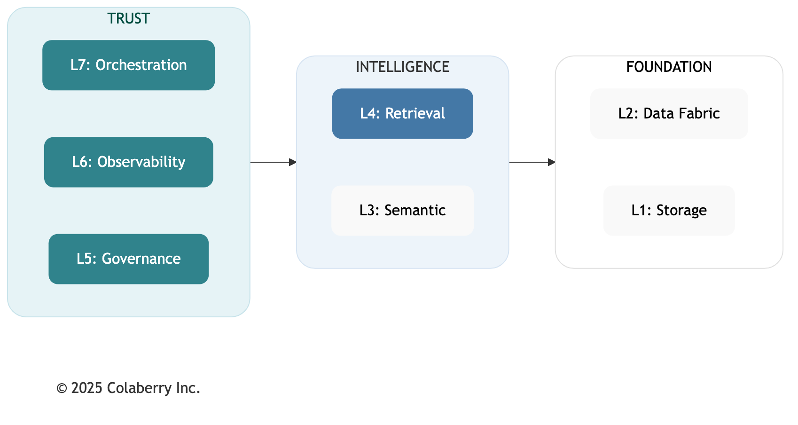
**Echo's Selection Principles:** (1) Managed over self-hosted, (2) Healthcare-first (BAA required), (3) Integration-proven over best-in-class, (4) Cost-optimized for Growth tier.

**Echo's Results:** Completed under budget ($992K of $1.23M), achieved INPACT 89/100 and GOALS 21/25, went live in 12 weeks. *(Use the Stack Builder and Vendor Advisor at trustbeforeintelligence.ai/tools to plan your investment and select vendors.)*

---

## Bridge to Chapter 12

You've learned the methodology for selecting your technology stack. Every vendor evaluation uses the three-pillar test. Every layer has clear selection criteria. The Architecture of Trust provides the framework.

Now comes the harder part: keeping it running.

Chapter 12 completes your journey with MLOps practices for versioning and testing, incident response runbooks for when things go wrong, and the continuous improvement cycles that sustain trust over time. You've learned to select the right tools. Now learn to operate them.

---

## Chapter Summary

| Part | Content | Key Deliverable |
|------|---------|-----------------|
| Part 1 | Selection Framework | Three-pillar vendor test, build/buy/partner |
| Part 2 | Layer-by-Layer Criteria | Selection criteria for all 7 layers |
| Part 3 | Evaluation Process | RFP approach, POC validation, negotiation |
| Part 4 | Applying the Methodology | Echo's process, your toolkit, complete stack reference |

---

## Online Tools

Interactive tools and downloadable templates supporting this chapter are available at **trustbeforeintelligence.ai/tools**, including the Vendor Advisor, Stack Builder, Three-Pillar RFP Template, and POC Test Plan Template. High-resolution versions of all figures are available in the **Figures Gallery** at trustbeforeintelligence.ai/figures.

---

## Further Reading

**Academic Research**

- Malkov, Y. A., & Yashunin, D. A. (2018). "Efficient and Robust Approximate Nearest Neighbor Search Using Hierarchical Navigable Small World Graphs." *IEEE Transactions on Pattern Analysis and Machine Intelligence*, 42(4), 824-836. https://arxiv.org/abs/1603.09320

- Gao, Y., Xiong, Y., Gao, X., et al. (2024). "Retrieval-Augmented Generation for Large Language Models: A Survey." *arXiv preprint arXiv:2312.10997*. https://arxiv.org/abs/2312.10997

**Government & Standards**

- National Institute of Standards and Technology. (2014). "Guide to Attribute Based Access Control (ABAC) Definition and Considerations." NIST Special Publication 800-162. https://nvlpubs.nist.gov/nistpubs/specialpublications/nist.sp.800-162.pdf

- National Institute of Standards and Technology. (2023). "AI Risk Management Framework (AI RMF 1.0)." NIST AI 100-1. https://www.nist.gov/itl/ai-risk-management-framework
# Chapter 12: Running Agents at Scale

**The Operations Chapter**

---

*About a year ago.*

*Friday, 4:47 PM, Week 10.*

*Echo Health Systems, Sarah's Office.*

"What's the worst thing that can happen Monday morning?"

Marcus didn't hesitate. "LLM provider goes down. Agents start hallucinating. A nurse gets bad information about a patient's medication."

Sarah nodded. They'd spent 10 weeks building the architecture. Seven layers. Three agents. Eighty-six on the INPACT scale. All the checkboxes checked.

But checkboxes don't answer phones at 2 AM.

"Show me the runbook," Sarah said. "The one for when everything breaks at once."

Marcus pulled up a document. It was three pages long. By Monday morning, it would be twelve.

---

**Figure 12.1: Operations Value (From Reactive to Proactive)**


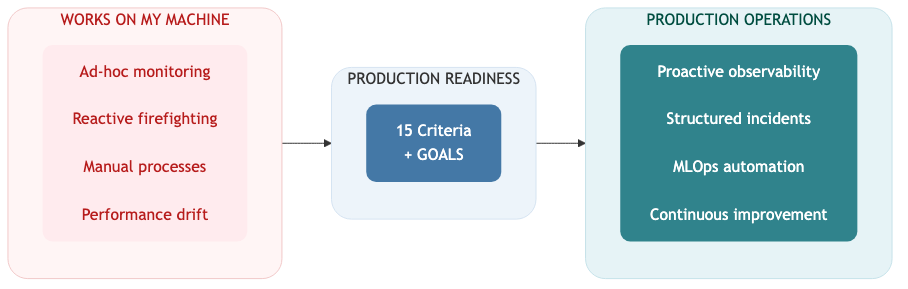
> **Key Takeaway:** Building is easy. Operating at scale requires systematic discipline.

---

*You've built the architecture. All seven layers operational. Three agents validated. Now comes the harder part: keeping it running at scale. This chapter transforms you from architect to operator. Fifteen readiness criteria to validate, MLOps practices to master, incidents to handle, and continuous improvement cycles that can drive 3-5% accuracy gains in the first month. The Architecture of Trust is built. Now learn to sustain it.*

---


## Part 1: Production Readiness

### 1.1 The Production Readiness Decision

You've completed the hardest part. Chapters 4-6 built the architecture layer by layer. Chapter 10 executed the 90-day roadmap. Chapter 11 selected technologies for each layer. Your INPACT score has climbed from wherever you started toward the threshold that signals agent-readiness: typically 80+ for standard enterprise deployments, 86+ for high-stakes environments.

But building isn't operating. The gap between "architecture complete" and "production ready" has derailed more agent initiatives than infrastructure gaps ever did. Organizations celebrate Week 10 architecture milestones only to stumble in Week 11 pilots. The Architecture of Trust needs operational discipline to deliver sustained value.

This chapter completes your journey with five operational components:

**Part 1: Production Readiness.** Fifteen criteria that separate "ready for production" from "ready for failure." Validate all 15 before your pilot launch.

**Part 2: MLOps for Agents.** Model versioning, A/B testing, prompt management, and cost optimization practices adapted from traditional ML operations to agentic systems.

**Part 3: Monitoring and Incident Response.** SLA definitions, alerting strategy, incident triage, and post-mortem processes. When things break (and they will), your response determines whether users lose trust or gain confidence.

**Part 4: Continuous Improvement.** Weekly improvement cycles that can drive 3-5% accuracy gains in the first month. The Architecture of Trust isn't static. It improves continuously.

**Part 5: AIXcelerator Platform.** For organizations seeking a proven path, how Colaberry's platform makes the 90-day transformation achievable while maintaining all three pillars.

Let's begin with the question every organization faces at Week 10: are you actually ready?

---

### 1.2 The 15-Criteria Production Readiness Checklist

Production readiness isn't a feeling. It's a measurable state. Validate against 15 specific criteria organized around the Architecture of Trust's three pillars. Each criterion has a clear target, measurement method, and evidence requirement.

Throughout this chapter, reference benchmarks are drawn from Echo Health Systems, the pedagogical case study used in this book. Adjust these numbers based on your industry, use case, and risk tolerance. Part 6 consolidates Echo's complete results for easy reference.

**Pillar 1: INPACT Readiness (5 Criteria)**

| # | Criterion | INPACT Need | How to Measure | Generic Target | High-Stakes Target |
|---|-----------|--------------|----------------|----------------|-------------------|
| 1 | INPACT Score™ | All 6 | Chapter 9 assessment | ≥80/100 | ≥86/100 |
| 2 | Response Time | I (Instant) | Load testing, APM traces | <10s P95 | <5s P95 |
| 3 | NLU Accuracy | N (Natural) | Validation set testing | ≥80% | ≥85% |
| 4 | HITL Escalation | P (Permitted) | Governance logs | <20% | <15% |
| 5 | Audit Coverage | T (Transparent) | Audit log validation | 100% | 100% |

**Choosing Your Targets:**
- **Generic targets** suit most enterprise deployments where agent errors cause inconvenience but not significant harm
- **High-stakes targets** apply to regulated industries, safety-critical systems, and environments where errors have serious consequences

Criterion 3 often sparks debate. If you're near threshold with a clear improvement trajectory, launching with aggressive monitoring may be safer than delaying indefinitely. The key: have weekly improvement cycles ready to close the gap.

---

**Pillar 2: Architecture Readiness (5 Criteria)**

| # | Criterion | Layers | How to Measure | Generic Target | High-Stakes Target |
|---|-----------|--------|----------------|----------------|-------------------|
| 6 | All 7 Layers Operational | L1-L7 | Layer health checks | All functional | All functional + redundancy |
| 7 | Agents Validated | L7 | UAT completion | ≥1 agent | ≥3 agents |
| 8 | Multi-Agent Orchestration | L7 | Coordination testing | <5s latency | <3s latency |
| 9 | Vendor Agreements Signed | All | Contract audit | 100% | 100% + compliance addenda |
| 10 | Data Residency Confirmed | L1-L2 | Cloud region audit | Documented | Per regulatory requirements |


**Figure 12.2: The 15-Criteria Production Readiness Framework**


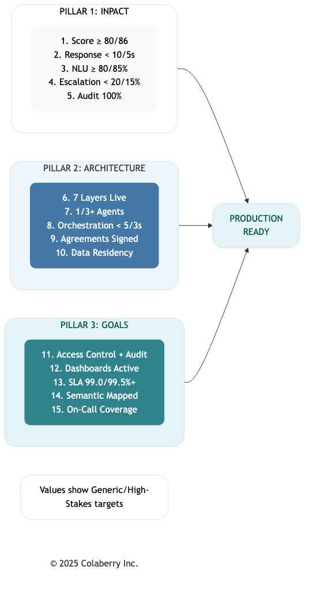

Architecture criteria are typically pass/fail. If you've followed the 90-day roadmap, these should pass cleanly. High-stakes environments may require additional compliance documentation for Criterion 9 (such as BAAs, SOC 2 attestations, or PCI-DSS certifications depending on your industry).

---

**Pillar 3: GOALS Readiness (5 Criteria)**

| # | Criterion | GOALS | How to Measure | Generic Target | High-Stakes Target |
|---|-----------|--------|----------------|----------------|-------------------|
| 11 | Access Control + Audit | G (Governance) | Policy testing | <50ms eval | <10ms eval |
| 12 | Dashboards Active | O (Observability) | Dashboard review | Near real-time | Real-time |
| 13 | SLA Achievable | A (Availability) | Availability testing | 99.0% uptime | 99.5%+ uptime |
| 14 | Semantic Layer Mapped | L (Language) | Term coverage audit | Core terms | Comprehensive |
| 15 | On-Call Coverage | S (Solid) | Schedule review | Business hours | 24/7 coverage |

Criterion 15 is often the last to complete. For organizations not requiring 24/7 coverage, business-hours support with automated alerting may suffice initially. Finding engineers willing to carry pagers may require negotiation. Consider on-call bonuses, or leverage distributed teams across time zones to provide follow-the-sun coverage without requiring overnight shifts.

---

**Scoring Interpretation**

| Score | Interpretation | Recommendation |
|-------|----------------|----------------|
| 15/15 | Production ready | Launch pilot |
| 12-14 | Pilot ready | Controlled rollout with gaps documented |
| 9-11 | Not ready | 2-4 more weeks of remediation |
| <9 | Significant gaps | Continue building, reassess |

Aim for 15/15, but recognize that some criteria may require judgment calls rather than clean passes.

---

### 1.3 Operational Monitoring Essentials

Production operations require ongoing monitoring across all three pillars. Here's what to track:

---

**INPACT Operational Metrics**

| Dimension | What to Monitor | Generic Target | High-Stakes Target | Check Frequency |
|-----------|-----------------|----------------|-------------------|-----------------|
| I (Instant) | P95 response time | <10s | <5s | Real-time |
| N (Natural) | NLU accuracy rate | ≥80% weekly avg | ≥85% weekly avg | Daily |
| P (Permitted) | HITL escalation rate | <20% | <15% | Daily |
| A (Adaptive) | Model drift score | <15% deviation | <10% deviation | Weekly |
| C (Contextual) | Context retrieval success | ≥85% | ≥90% | Daily |
| T (Transparent) | Audit log completeness | 100% | 100% | Real-time |

Select targets based on your industry requirements and risk tolerance. High-stakes environments should use the stricter targets.

<!-- pagebreak -->
**GOALS Operational Metrics**

| Dimension | What to Monitor | Generic Target | High-Stakes Target | Check Frequency |
|-----------|-----------------|----------------|-------------------|-----------------|
| G (Governance) | Policy evaluation latency | <50ms | <10ms | Real-time |
| O (Observability) | Dashboard availability | ≥99.0% | ≥99.9% | Real-time |
| A (Availability) | System uptime | ≥99.0% | ≥99.5% | Real-time |
| L (Language) | Terminology match rate | ≥90% | ≥95% | Weekly |
| S (Solid) | On-call response time | <15min for P1 | <5min for P1 | Per incident |

**Layer Health Checks**

| Layer | Health Check | Frequency |
|-------|--------------|-----------|
| L1: Storage | Connection pool, query latency | Every 5 min |
| L2: Data Fabric | CDC lag, sync status | Every 1 min |
| L3: Semantic | Embedding freshness, term coverage | Daily |
| L4: Intelligence | LLM API latency, token usage | Real-time |
| L5: Governance | Policy sync, ABAC evaluation | Every 5 min |
| L6: Observability | Log ingestion, dashboard load | Every 1 min |
| L7: Orchestration | Agent handoff latency, queue depth | Real-time |

*For detailed scoring methodology, see Chapter 9. For team responsibilities by layer, see Chapter 10.*

---

### 1.4 Go-Live Planning

Production readiness enables launch, but it doesn't guarantee success. Phased rollout reduces risk by expanding gradually based on demonstrated success.

**Phase 1: Internal Pilot (Week 11)**

| Dimension | Guidance | Generic Target | High-Stakes Target |
|-----------|----------|----------------|-------------------|
| Users | Start small with friendly users who provide feedback | 25-50 users | 50-100 users |
| Duration | Minimum observation period | 1 week | 2 weeks |
| Monitoring | Intensive: catch issues early | Daily reviews | Hourly reviews |
| Success Criteria | High task completion rate | ≥85% | ≥90% |
| HITL Threshold | Lower than production target | <15% escalation | <10% escalation |
| Decision Gate | Proceed only if criteria met | All green to advance | All green to advance |

Phase 1 validates with friendly users who provide detailed feedback. Intensive monitoring catches issues before they propagate. Success at Phase 1 builds confidence for expansion.

<!-- pagebreak -->

**Phase 2: Department Pilot (Week 12)**

| Dimension | Guidance | Generic Target | High-Stakes Target |
|-----------|----------|----------------|-------------------|
| Users | Expand to full department or team | 50-100 users | 100-200 users |
| Duration | Minimum observation period | 1 week | 1-2 weeks |
| Monitoring | Shift to sustainable cadence | Weekly reviews | Daily reviews |
| Success Criteria | Slightly relaxed from Phase 1 | ≥80% | ≥85% |
| HITL Threshold | Closer to production target | <18% escalation | <12% escalation |
| Decision Gate | Proceed only if criteria met | All green to advance | All green to advance |

Phase 2 tests at department scale with diverse users and workflows. Sustainable monitoring balances vigilance with operational efficiency. Success at Phase 2 proves scalability.

**Phase 3: Full Production (Week 13+)**

| Dimension | Guidance | Generic Target | High-Stakes Target |
|-----------|----------|----------------|-------------------|
| Users | All target users | Full rollout | Full rollout |
| Duration | Ongoing | Continuous | Continuous |
| Monitoring | Steady-state cadence | Monthly reviews | Weekly reviews |
| Success Criteria | Production target | ≥75% | ≥80% |
| HITL Threshold | Production target | <20% escalation | <15% escalation |
| Decision Gate | Rollback if thresholds breached | SLA review monthly | SLA review weekly |

Phase 3 is steady-state operations with continuous improvement cycles replacing intensive monitoring. The decision gate shifts from "proceed to next phase" to "maintain or rollback." If metrics breach thresholds, trigger incident response.

---

### 1.5 The Go/No-Go Decision

The 15-criteria checklist provides data. The go/no-go meeting interprets it. These questions determine whether your organization is ready:

**Domain Risk**
- What happens if an agent gives a bad recommendation in your context?
- Can your HITL workflows catch high-risk decisions before they cause harm?
- Does your team have capacity to handle the projected escalation rate?

**Business Risk**
- What's the cost of waiting another month?
- What competitive pressure exists?
- Will stakeholder confidence survive another delay?

**Operational Risk**
- Have you tested scenarios that aren't in the checklist?
- Do you have rollback procedures documented and tested?
- Is your on-call team ready for the first 48 hours?

**The Question Nobody Asks Out Loud**
- What happens to this initiative if you launch and it fails?

The answer isn't "don't launch." The answer is "launch small." Fifty users, not five hundred. Hourly monitoring, not daily. Weekly steering committee, not monthly.

A controlled pilot limits blast radius while generating real-world data no staging environment can provide.

---

## Part 2: MLOps for Agents

Traditional MLOps practices (model versioning, A/B testing, performance monitoring) require adaptation for agentic systems. Agents combine multiple models, orchestration logic, and prompt configurations that evolve together. This section provides practical MLOps patterns for agentic systems.

**Figure 12.3: Agent MLOps Lifecycle**


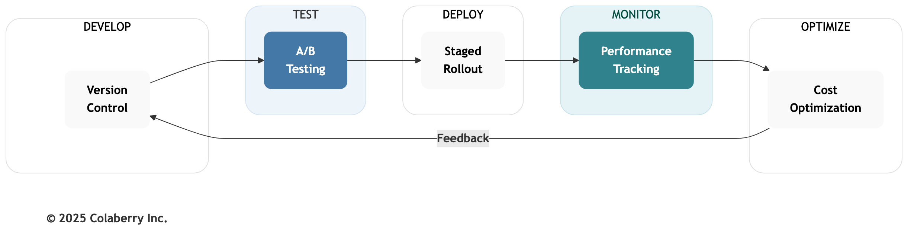
---

### 2.1 Model Versioning

Agent systems have more versioned components than traditional ML: base LLMs, embedding models, prompts, orchestration logic, and retrieval configurations all change independently. Without disciplined versioning, debugging production issues becomes impossible.

**Semantic Versioning for Agents**

Adopt semantic versioning (MAJOR.MINOR.PATCH) with agent-specific interpretations:

| Version Component | Agent Interpretation | Example Change |
|-------------------|---------------------|----------------|
| **MAJOR** | Breaking changes requiring user retraining | New agent capabilities, response format changes |
| **MINOR** | New features, backward-compatible | Additional data sources, improved accuracy |
| **PATCH** | Bug fixes, prompt refinements | Typo corrections, edge case handling |

**Example progression:** v1.0.0 → v1.0.1 (prompt fix) → v1.1.0 (new retrieval source) → v2.0.0 (multi-agent orchestration)

<!-- pagebreak -->

**What to Version**

Every configuration affecting agent behavior requires version control:

| Component | Version Control Method | Update Frequency |
|-----------|----------------------|------------------|
| System prompts | Git repository | Weekly |
| Few-shot examples | Git repository | Weekly |
| Orchestration logic | Git repository | Monthly |
| Retrieval configurations | Git repository | Monthly |
| Base LLM version | Configuration file | Quarterly |
| Embedding model | Configuration file | Quarterly |

**Recommended Repository Structure**

Maintain a `prompts/` repository with versioned folders per agent (e.g., `scheduling/v1.0.0/`, `support_docs/v1.1.0/`). Each version folder contains system.md, few_shot.json, and config.yaml. Every production change should require pull request, code review, and staging validation before deployment.

**Tools**

| Tool | Purpose | Recommendation |
|------|---------|----------------|
| LangSmith | Prompt versioning, tracing | Primary |
| Git | Source control for all configs | Required |
| PromptLayer | Prompt analytics | Optional |

---

### 2.2 A/B Testing

Agent improvements require validation against real user behavior. A/B testing compares new versions (challengers) against existing versions (champions) using actual production traffic.

**Champion vs. Challenger Framework**

| Element | Specification |
|---------|---------------|
| Traffic split | 50/50 between versions |
| Duration | Minimum 1 week (statistical significance) |
| Metrics | All INPACT dimensions + user satisfaction |
| Rollback | Automatic if challenger shows >5% regression |

**Metrics to Track**

Every A/B test should measure impact across the Architecture of Trust:

| Pillar | Metrics | Threshold for Winner |
|--------|---------|---------------------|
| INPACT | Accuracy, latency, escalation rate | >2% improvement |
| GOALS | SLA compliance, error rate | No regression |
| User | Satisfaction score, task completion | >5% improvement |

<!-- pagebreak -->

**Example A/B Test**

A prompt refinement test (v1.1 vs v1.2) for a scheduling agent:

| Metric | v1.1 (Champion) | v1.2 (Challenger) | Result |
|--------|-----------------|-------------------|--------|
| Accuracy | 85% | 87% | ✅ +2% |
| P95 Latency | 3.2s | 3.1s | Tie |
| HITL Rate | 9% | 8% | ✅ -1% |
| Citations/Query | 2.1 avg | 2.8 avg | ✅ +33% |
| User Satisfaction | 4.2/5 | 4.4/5 | ✅ +5% |

**Decision:** Promote v1.2 to champion. The accuracy and citation improvements justified the change, with no regression on latency or operational metrics.

**A/B Testing Pitfalls**

| Pitfall | Consequence | Prevention |
|---------|-------------|------------|
| Insufficient duration | False positives | Minimum 1 week, 1,000+ queries |
| Ignoring user segments | Hidden regressions | Segment analysis by role, shift |
| Single metric focus | Unbalanced optimization | Track all INPACT dimensions |
| No rollback plan | Extended exposure to bugs | Automatic rollback triggers |

---

### 2.3 Prompt Management

Prompts are the primary interface between business intent and agent behavior. Effective prompt management requires the same discipline as code management: version control, testing, review, and deployment processes.

**Best Practices**

**1. Version Control Your Prompts**

Prompts require version control with history tracking, diff capabilities, and review workflows. Many specialized prompt management tools exist (LangSmith, PromptLayer, Humanloop, Phoenix, Agno, and others) alongside traditional Git-based approaches. Tool selection is beyond the scope of this book, but the principle is universal: treat prompts with the same rigor as production code.

**2. Template with Variables**

Separate static instructions from dynamic context:

| Variable Type | Example | Update Frequency |
|---------------|---------|------------------|
| Static | Core instructions, constraints | Monthly |
| Session | User context, conversation history | Per query |
| Dynamic | Resource availability, current date | Real-time |

**3. Automated Testing**

Every prompt change triggers validation against test suites:

| Test Type | Purpose | Reference Benchmark |
|-----------|---------|---------------------|
| Regression | Ensure existing capabilities work | 200 golden queries |
| Edge cases | Validate boundary handling | 50 edge case queries |
| Safety | Confirm guardrails hold | 30 adversarial queries |

**4. Two-Person Review**

All prompt changes require review before deployment:

| Change Type | Review Requirement |
|-------------|-------------------|
| PATCH | 1 reviewer |
| MINOR | 2 reviewers |
| MAJOR | 2 reviewers + domain expert sign-off |

**Recommended Prompt Pipeline**

The pipeline flows from developer change → automated tests (regression, edge, safety) → pull request → peer review → staging deployment → A/B test (1 week minimum) → production promotion. This catches problematic prompt changes before they reach production.

---

### 2.4 Cost Optimization

LLM costs accumulate quickly at production scale. Without optimization, a system processing 50,000 daily queries can face monthly bills exceeding $100,000. Four strategies can reduce per-query cost by 60-70%.

**Strategy 1: Semantic Caching**

Cache responses for semantically similar queries:

| Metric | Before Caching | After Caching |
|--------|----------------|---------------|
| Cache hit rate | 0% | 65% |
| Avg. queries hitting LLM | 50,000/day | 17,500/day |
| Daily LLM cost | ~$6,000 | ~$2,100 |

**Implementation:** Redis with vector similarity matching. Queries within cosine similarity threshold (0.95) return cached responses instead of calling LLM.

**Strategy 2: Prompt Compression**

Reduce token count without sacrificing quality:

| Technique | Token Reduction | Quality Impact |
|-----------|-----------------|----------------|
| Remove redundant instructions | 15-20% | None |
| Use abbreviations in system prompts | 10-15% | None |
| Compress few-shot examples | 20-30% | Minimal |

**Reference benchmark:** Average prompt reduced from 3,200 to 1,800 tokens (44% reduction) with no measurable accuracy impact.

**Strategy 3: Model Routing**

Use cheaper models for simpler queries:

| Query Complexity | Model | Cost/1K tokens |
|------------------|-------|----------------|
| Simple queries | GPT-4o-mini | $0.15 |
| Standard queries | GPT-4o | $2.50 |
| Complex reasoning | GPT-4o | $2.50 |

**Reference traffic distribution:**
- 70% routed to GPT-4o-mini (simple queries)
- 30% routed to GPT-4o (complex queries)
- Blended cost: 70% cheaper than GPT-4o-only

**Strategy 4: Batch Processing**

Aggregate non-urgent queries for batch API pricing:

| Processing Mode | Use Case | Cost Savings |
|-----------------|----------|--------------|
| Real-time | User-facing queries | Baseline |
| Batch | Report generation, analytics | 50% discount |

**Reference benchmark:** 20% of queries (scheduled reports, daily summaries) processed in batch mode.


**Combined Result**

| Metric | Before Optimization | After Optimization |
|--------|--------------------|--------------------|
| Cost per query | $0.12 | $0.04 |
| Monthly LLM spend | ~$180K | ~$60K |
| Annual savings | n/a | **$1.44M** |

Your results will vary based on query volume, complexity distribution, and caching effectiveness. Review cost metrics weekly to identify new optimization opportunities as usage patterns evolve.

---

## Part 3: Monitoring & Incident Response

Production agents will fail. Databases go down. LLM APIs timeout. Policies misconfigure. The question isn't whether incidents occur. It's how quickly you detect, respond, and recover. This section establishes monitoring foundations and incident response processes for production operations.

---

### 3.1 SLA Definition

Service Level Agreements define your commitments to users. Without explicit SLAs, expectations drift and accountability disappears. Define SLAs across all three pillars:

**Three-Pillar SLA Framework**

| SLA | Target | INPACT | GOALS | Measurement |
|-----|--------|---------|--------|-------------|
| Availability | 99.5% uptime | I | A | Monthly uptime calculation |
| Performance | <5s P95 response | I | A | APM percentile tracking |
| Accuracy | >85% correct responses | N | S | Weekly validation testing |
| HITL Rate | <10% escalation | P | G | Daily escalation tracking |
| Audit Coverage | 100% | T | G | Real-time audit verification |

**SLA Tiers by Agent Type**

Not all agents require the same SLAs. Classify by user impact and error consequences:

| Agent Type | Availability | Performance | Accuracy | When to Use |
|------------|--------------|-------------|----------|-------------|
| Tier 1: Critical | 99.9% | <3s P95 | >90% | External-facing, revenue-impacting, safety-related |
| Tier 2: Standard | 99.5% | <5s P95 | >85% | Internal user-facing, operational decisions |
| Tier 3: Basic | 99.0% | <10s P95 | >80% | Administrative, back-office, non-urgent |

Classify your agents by user impact. An external-facing agent typically warrants Tier 1, while an internal documentation assistant may use Tier 3.


**SLA Breach Consequences**

Define what happens when SLAs are missed:

| Severity | Threshold | Response | Escalation |
|----------|-----------|----------|------------|
| Warning | 1 breach/week | Team review | None |
| Minor | 3 breaches/week | Root cause analysis | Engineering lead |
| Major | SLA < 95% for day | War room | VP Engineering |
| Critical | SLA < 90% for hour | All-hands | Executive team |

---

### 3.2 Alert Strategy

Effective alerting balances sensitivity with noise. Too few alerts miss problems; too many cause alert fatigue. Structure alerts by priority based on user impact:

**Four-Tier Alert Priority**

| Priority | Impact | Response Time | Example |
|----------|--------|---------------|---------|
| P0 | All agents down, data breach | <5 minutes | LLM API complete failure |
| P1 | Major INPACT degradation | <30 minutes | Accuracy below 80% |
| P2 | Single layer or agent affected | <4 hours | CDC lag exceeding 5 minutes |
| P3 | No immediate user impact | Next business day | Non-critical log errors |

**Alert Configuration by Pillar**

**INPACT Alerts:**

| Need | P1 Threshold | P2 Threshold | P3 Threshold |
|------|--------------|--------------|--------------|
| I (Instant) | P95 > 10s | P95 > 7s | P95 > 5s |
| N (Natural) | Accuracy < 80% | Accuracy < 83% | Accuracy < 85% |
| P (Permitted) | HITL > 20% | HITL > 15% | HITL > 12% |
| A (Adaptive) | Feedback stale > 1 month | Stale > 2 weeks | Stale > 1 week |
| C (Contextual) | CDC lag > 10 min | Lag > 5 min | Lag > 2 min |
| T (Transparent) | Audit gap detected | Coverage < 99% | Any audit error |

<!-- pagebreak -->

**Architecture Alerts:**

| Layer | P1 Trigger | P2 Trigger |
|-------|------------|------------|
| L1 Storage | Query timeout > 30s | Latency > 5x baseline |
| L2 Real-Time | CDC complete failure | Lag > 5x threshold |
| L3 Semantic | Disambiguation failure > 50% | Failure > 20% |
| L4 Intelligence | LLM API down | Retrieval precision < 80% |
| L5 Governance | ABAC evaluation failure | Policy load error |
| L6 Observability | Trace collection stopped | Dashboard data stale |
| L7 Orchestration | Agent coordination failure | Handoff latency > 5s |


**GOALS Alerts:**

| Dimension | P1 Trigger | P2 Trigger |
|-----------|------------|------------|
| G (Governance) | Unauthorized access detected | Policy violation rate > 5% |
| O (Observability) | Blind spot in monitoring | Alert coverage < 90% |
| A (Availability) | Availability < 99% | Availability < 99.5% |
| L (Language) | Semantic layer down | Term resolution failure > 10% |
| S (Solid) | Data corruption detected | Quality score drop > 10% |

**Reference Benchmark: Alert Results**

| Priority | Alerts Triggered | False Positives | MTTR |
|----------|------------------|-----------------|------|
| P0 | 0 | 0 | N/A |
| P1 | 2 | 0 | 18 minutes |
| P2 | 8 | 2 | 2.1 hours |
| P3 | 34 | 12 | Next day |

Your alert volume will vary based on system maturity and threshold configuration. Aim for zero P0s, minimal P1s, and low false positive rates at P2-P3.

---

### 3.3 Incident Response

When alerts fire, structured response prevents chaos. Adopt a six-phase incident response process mapped to the Architecture of Trust:

**Figure 12.4: Six-Phase Incident Response**


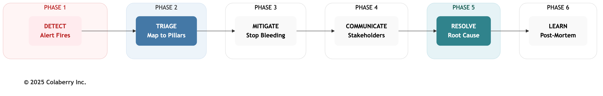

<!-- pagebreak -->

**Phase 1: DETECT**

Automated monitoring triggers alert. On-call engineer acknowledges within response time SLA.

| Action | Owner | Timeline |
|--------|-------|----------|
| Alert fires | System | Immediate |
| Acknowledge | On-call | <5 min (P0-P1), <15 min (P2) |
| Initial assessment | On-call | +5 minutes |

**Phase 2: TRIAGE**

Map incident to affected pillars and layers:

| Question | Purpose |
|----------|---------|
| Which INPACT needs affected? | Scope user impact |
| Which layers involved? | Identify root cause area |
| Which GOALS dimensions degraded? | Assess operational impact |

**Three-Pillar Incident Mapping**

| Incident Type | INPACT | Layer | GOALS | Initial Response |
|---------------|---------|-------|--------|------------------|
| LLM API outage | I, N | L4 | A | Failover to backup |
| Database failure | I, C | L1-L2 | A, S | Promote replica |
| ABAC misconfiguration | P | L5 | G | Rollback policy |
| Semantic drift | N | L3 | L | Update terminology |
| Audit gap | T | L6 | G, O | Fix logging pipeline |
| Agent conflict | C | L7 | S | Restart orchestrator |

**Phase 3: MITIGATE**

Stop the bleeding before fixing root cause:

| Mitigation | When to Use | Trade-off |
|------------|-------------|-----------|
| Failover | Primary system down | May have reduced capacity |
| Rollback | Bad deployment | Lose new features |
| Feature flag | Single feature broken | Partial functionality |
| Throttle | Overload | Reduced throughput |
| HITL override | Agent misbehaving | Higher manual load |

**Phase 4: COMMUNICATE**

Keep stakeholders informed throughout:

| Audience | Update Frequency | Channel |
|----------|-----------------|---------|
| Technical team | Real-time | Slack war room |
| Leadership | Every 30 min (P0-P1) | Email/text |
| Users | At start, resolution | In-app banner |
| External (if required) | Per compliance | Official channels |

**Phase 5: RESOLVE**

Fix the root cause, not just symptoms:

| Action | Verification |
|--------|--------------|
| Implement fix | Code review if applicable |
| Test in staging | Reproduce original issue |
| Deploy to production | Gradual rollout |
| Confirm resolution | Metrics return to baseline |
| Close incident | All SLAs restored |

**Phase 6: POST-MORTEM**

Learn from every significant incident (P0-P1 mandatory, P2 recommended).

---

### 3.4 Post-Mortem Process

Post-mortems prevent repeat incidents. Conduct post-mortems within 48 hours of P0-P1 incidents using a three-pillar template:

**Three-Pillar Post-Mortem Template**

**1. Summary**
- Incident description (1-2 sentences)
- Duration (detection to resolution)
- Pillars affected: INPACT [which], Layers [which], GOALS [which]

**2. Timeline**
- Detection time and method
- Key response actions with timestamps
- Resolution time and verification

**3. Three-Pillar Impact Assessment**

| Pillar | Impact | Metrics |
|--------|--------|---------|
| INPACT | Which needs degraded, by how much | Accuracy dropped to X%, latency increased to Y |
| Architecture | Which layers failed | L4 offline for 18 minutes |
| GOALS | Operational impact | Availability at 99.2% for incident period |

**4. Root Cause Analysis**

| Question | Answer |
|----------|--------|
| What failed? | [Technical description] |
| Why did it fail? | [Contributing factors] |
| Why wasn't it caught earlier? | [Detection gaps] |
| What layer owns this component? | [Clear ownership] |

<!-- pagebreak -->
**5. Action Items**

| Action | Owner | Due Date | Status |
|--------|-------|----------|--------|
| [Specific remediation] | [Name] | [Date] | Open |
| [Detection improvement] | [Name] | [Date] | Open |
| [Process change] | [Name] | [Date] | Open |

**Example P1 Post-Mortem**

**Summary:** LLM API degradation caused 18-minute accuracy drop to 72%. Pillars affected: INPACT (I, N), Layer 4, GOALS (A, S).

**Root Cause:** LLM provider experienced regional degradation. Backup region not configured for automatic failover.

**Key Actions:** Configure automatic failover, add health check probes, document manual failover procedure.

**Result:** Second LLM incident (3 weeks later) detected in 2 minutes, failed over automatically, zero user impact.

---

## Part 4: Continuous Improvement

The Architecture of Trust isn't a destination. It's a foundation for continuous improvement. Your INPACT score shouldn't stop at 86/100. Through systematic weekly improvement cycles, organizations can achieve 3-5% accuracy gains in the first month. This section provides the processes that drive ongoing improvement.

---

### 4.1 Weekly Improvement Cycle

Structured weekly cycles transform operational data into agent improvements. A five-day pattern can yield consistent 1-2% weekly accuracy gains.

**Figure 12.5: Five-Day Improvement Cycle**


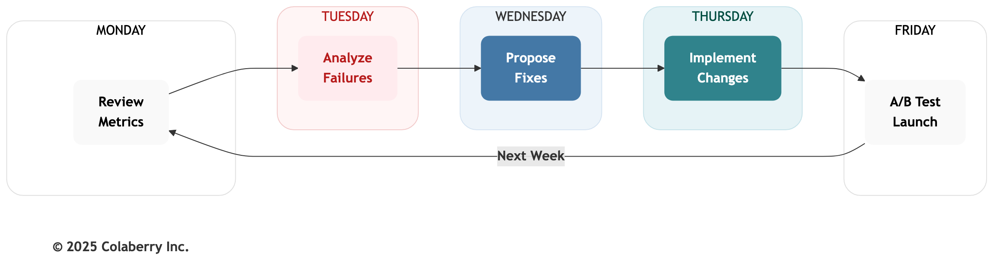
**The Five-Day Cycle**

| Day | Activity | INPACT Focus | Layer Focus | GOALS Focus |
|-----|----------|---------------|-------------|--------------|
| Monday | Review metrics | All 6 dimensions | Health checks | O (Observability) |
| Tuesday | Analyze failures | N (Natural) | L3-L4 | S (Solid) |
| Wednesday | Propose fixes | Dimension needing most improvement | Targeted layer | L (Language) |
| Thursday | Implement changes | Validate fix | Deploy to staging | G (Governance) |
| Friday | A/B test launch | Compare versions | Monitor | All |

**Key Activities by Day:**
- **Monday:** Review INPACT scores, error logs, user feedback, cost metrics
- **Tuesday:** Cluster failures, categorize by root cause, map to layers, estimate complexity
- **Wednesday:** Propose fixes (prompt refinement, few-shot additions, retrieval tuning, semantic updates)
- **Thursday:** Implement with appropriate review (1-2 reviewers based on change type)
- **Friday:** Deploy A/B test with 50/50 traffic split, 1-week minimum duration, rollback if >5% regression

**Reference Benchmark: Weekly Results**

| Week | Starting Accuracy | Improvement | Ending Accuracy |
|------|-------------------|-------------|-----------------|
| Week 11 | 85.0% | +0.8% | 85.8% |
| Week 12 | 85.8% | +0.9% | 86.7% |
| Week 13 | 86.7% | +0.5% | 87.2% |
| Week 14 | 87.2% | +0.4% | 87.6% |
| Week 15 | 87.6% | +0.4% | 88.0% |

Compound improvements of 3-5% over five weeks translate to thousands of better user interactions. Your results will vary based on starting accuracy and optimization opportunities.

---

### 4.2 Feedback Loop Automation

Manual feedback analysis doesn't scale. Automate feedback collection, aggregation, and integration to maintain improvement velocity as volume grows.

**Feedback Pipeline**

```
User interactions (L7)
    ↓
Quality signals captured (L5-L6)
    ↓
Feedback aggregated (Monday)
    ↓
Training data updated (L4)
    ↓
Model/prompt evaluated
    ↓
Improvements deployed
    ↓
Metrics monitored
```

**Feedback Signal Types**

| Signal | Source | Weight | Automation |
|--------|--------|--------|------------|
| Explicit thumbs up/down | User interface | High | Fully automated |
| HITL corrections | Governance layer | High | Fully automated |
| Query reformulations | Session analysis | Medium | Semi-automated |
| Abandonment | Session analysis | Medium | Fully automated |
| Escalation patterns | Support tickets | Low | Manual review |

<!-- pagebreak -->

**From Feedback to Improvement**

**Example Improvement Cycle:**
- 127 actionable feedback items identified
- 89 mapped to prompt improvements
- 23 mapped to retrieval tuning
- 15 required semantic layer updates
- Changes deployed in following week's A/B tests
- Result: 2% accuracy improvement

---

### 4.3 Drift Detection

Agent performance degrades over time. Data distributions shift. User expectations evolve. Model capabilities change. Systematic drift detection catches degradation before users notice.

**Three-Pillar Drift Types**

| Pillar | Drift Type | Detection Method | Prevention |
|--------|-----------|------------------|------------|
| INPACT | Accuracy drift | Weekly validation testing | Monthly retraining |
| Architecture | Performance drift | Daily metrics baselines | Auto-scaling, alerts |
| GOALS | Operational drift | Weekly score tracking | Monthly audit |

**INPACT Drift Detection**

| Dimension | Baseline | Warning | Action Trigger |
|-----------|----------|---------|----------------|
| I (Instant) | P95 established at launch | +20% from baseline | +50% from baseline |
| N (Natural) | Accuracy at launch | -2% from baseline | -5% from baseline |
| P (Permitted) | HITL rate at launch | +3% from baseline | +5% from baseline |
| A (Adaptive) | Feedback integration time | +50% from baseline | +100% from baseline |
| C (Contextual) | CDC lag at launch | +50% from baseline | +100% from baseline |
| T (Transparent) | Audit coverage | Any gap | Persistent gap |

**Example Drift Response**

Drift detection identified declining retrieval precision (78% → 74% over two weeks). Root cause: new document formats introduced by a source system upgrade not reflected in the chunking strategy.

Response:
- Tuesday: Identified drift pattern
- Wednesday: Diagnosed format changes
- Thursday: Updated chunking configuration
- Friday: Deployed fix in A/B test
- Following week: Precision restored to 79%

Early detection prevented user-visible degradation. At Echo Health Systems, this same pattern occurred when their EHR system introduced new documentation templates. The universal response process applied regardless of the specific source system.

---
<!-- pagebreak -->

## Part 5: AIXcelerator Platform

For organizations seeking to accelerate their journey, Colaberry's AIXcelerator platform provides pre-built components validated across multiple enterprise deployments. This section explains what AIXcelerator offers, how it reduces implementation time, and how to access it.

---

### 5.1 What is AIXcelerator?

AIXcelerator is a complete platform that accelerates agent infrastructure deployment while maintaining all three pillars of the Architecture of Trust. Rather than building every component from scratch, organizations use production-validated modules.

**Figure 12.6: AIXcelerator Five-Component Platform**


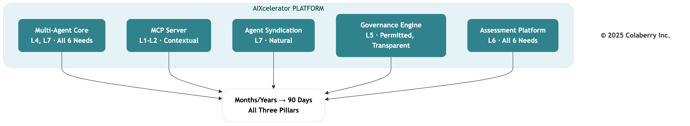


**Five Core Components**

| Component | INPACT Coverage | Layers Addressed | Key Benefit |
|-----------|------------------|-----------------|-------------|
| Multi-Agent Core | All 6 needs | L4, L7 | Production-validated orchestration |
| MCP Server | C (Contextual) | L1-L2 |  Pre-built connectors |
| Agent Syndication Hub | N (Natural) | L7 | Reusable agent patterns |
| Governance Engine | P, T | L5 | Compliance-ready from day one |
| Assessment Platform | All 6 | L6 | Continuous INPACT measurement |

**Multi-Agent Core**

Pre-built orchestration framework with:
- LangGraph-based supervisor patterns
- Configurable agent definitions
- Built-in HITL workflows
- Production-validated handoff logic

**MCP Server (Model Context Protocol)**

Standardized data connectivity:
- Pre-built connectors for 50+ enterprise systems
- Industry-specific connectors (EHR, ERP, CRM, core banking, e-commerce platforms)
- CDC pipeline templates
- Real-time data fabric patterns

**Agent Syndication Hub**

Reusable agent marketplace:
- Pre-trained domain agents (scheduling, documentation, etc.)
- Customization framework
- Version management
- Multi-tenant deployment

**Governance Engine**

Enterprise-grade access control:
- ABAC policy templates
- Compliance-ready audit trails
- HITL workflow builder
- Compliance reporting

**Assessment Platform**

Continuous measurement:
- Automated INPACT scoring
- Real-time GOALS dashboards
- Drift detection
- Improvement recommendations

---


### 5.2 How to Access AIXcelerator

Three paths to evaluate and adopt AIXcelerator:

**Option 1: Self-Assessment**

Start with free INPACT assessment:
- 30-minute online assessment
- Automated scoring and gap analysis
- Personalized recommendations
- No commitment required

**Option 2: Consultation**

Schedule expert consultation:
- Review your specific requirements
- Architecture recommendation
- Implementation roadmap
- Pricing discussion

**Option 3: 4-Week Pilot**

Hands-on validation:
- Deploy AIXcelerator in your environment
- Build one production agent
- Validate against your requirements
- Investment: $50K (credited toward subscription)

**Subscription Tiers**

**Access:** Visit aiXcelerator.ai or contact Colaberry for consultation.

---
<!-- pagebreak -->

## Part 6: Echo Health Systems Results

Echo Health Systems is a pedagogical case study used throughout this book to illustrate the Architecture of Trust in practice. While fictional, Echo's metrics reflect realistic outcomes based on Colaberry's production deployments.

**How to Use These Benchmarks:**

Echo represents a high-stakes deployment with stringent requirements. Your targets may differ based on your industry, use case, and risk tolerance. Use Echo's metrics as:
- **Reference points** for what's achievable with disciplined execution
- **Upper-bound targets** if you operate in a similarly regulated environment
- **Validation benchmarks** to compare your own progress

This section consolidates Echo's results for easy reference.

**Production Readiness (Week 10)**

| Criterion Category | Result |
|-------------------|--------|
| INPACT Criteria (5) | 5/5 passed |
| Architecture Criteria (5) | 5/5 passed |
| GOALS Criteria (5) | 5/5 passed |
| **Total Score** | **15/15** |

**Key Metrics at Launch**

| Metric | Week 10 Value |
|--------|---------------|
| INPACT Score | 86/100 |
| Response Time (P95) | 2.2 seconds |
| NLU Accuracy | 83% (reached 85% Week 11) |
| HITL Escalation Rate | 8% |
| Audit Coverage | 100% |

**Operational Results (Weeks 11-15)**

| Metric | Result |
|--------|--------|
| Availability | 99.7% |
| P1 Incidents | 2 (both resolved within SLA) |
| Accuracy Improvement | 85% → 88% (+3%) |
| Cost per Query | $0.12 → $0.04 (67% reduction) |
| Annual LLM Savings | $1.44M |

<!-- pagebreak -->

**Investment Summary**

| Category | Amount |
|----------|--------|
| Total Implementation | $1.23M |
| Timeline | 12 weeks (10 build + 2 validation) |
| Team Size | 12 specialists |
| First-Year ROI | 209% |
| 18-Month ROI | 477% |

*Use the INPACT Assessment at trustbeforeintelligence.ai/assessment to benchmark your organization against Echo's results.*

---

## Closing

You've completed the journey.

The INPACT Framework™ defines what agents need. The 7-Layer Architecture delivers those needs. The GOALS Framework™ sustains success. Together, they form the Architecture of Trust that separates the 5% who succeed from the 95% who fail.

Whether you build from scratch following the patterns in Chapters 4-12 or accelerate with AIXcelerator, you now have the knowledge to join the 5% who succeed with enterprise AI agents.

Trust before intelligence. Architecture before agents. The three pillars are yours.

---

## Chapter Summary

| Part | Content | Key Deliverable |
|------|---------|-----------------|
| Part 1 | Production Readiness | 15-criteria checklist |
| Part 2 | MLOps for Agents | Versioning, A/B testing, cost optimization |
| Part 3 | Monitoring & Incidents | SLAs, alerting, response process |
| Part 4 | Continuous Improvement | Weekly cycles, feedback loops, drift detection |
| Part 5 | AIXcelerator | Platform overview, access paths |
| Part 6 | Echo Health Systems Results | Consolidated reference benchmark |

*Visit trustbeforeintelligence.ai/tools for interactive assessment and planning tools.*

---

## Further Reading

**Academic Research**

- Bayram, F., Ahmed, B., & Kassler, A. (2022). "From Concept Drift to Model Degradation: An Overview on Performance-Aware Drift Detectors." *Scientific Reports*, Nature. https://www.nature.com/articles/s41598-022-15245-z

- Sculley, D., Holt, G., Golovin, D., et al. (2015). "Hidden Technical Debt in Machine Learning Systems." *Advances in Neural Information Processing Systems (NeurIPS)*. https://papers.nips.cc/paper/2015/hash/86df7dcfd896fcaf2674f757a2463eba-Abstract.html

- Beyer, B., Jones, C., Petoff, J., & Murphy, N. R. (2016). "Site Reliability Engineering: How Google Runs Production Systems." *O'Reilly Media*. https://sre.google/sre-book/table-of-contents/

- Kamel Rahimi, A., et al. (2024). "Implementing AI in Hospitals to Achieve a Learning Health System." *Journal of Medical Internet Research*, 26:e49655. https://www.jmir.org/2024/1/e49655

- Asai, A., Wu, Z., Wang, Y., et al. (2024). "Self-RAG: Learning to Retrieve, Generate, and Critique through Self-Reflection." *ICLR*. https://arxiv.org/abs/2310.11511

**Government & Standards**

- National Institute of Standards and Technology. (2023). "NIST Cybersecurity Framework 2.0." https://www.nist.gov/cyberframework

- National Institute of Standards and Technology. (2023). "AI Risk Management Framework (AI RMF 1.0)." NIST AI 100-1. https://www.nist.gov/itl/ai-risk-management-framework

- U.S. Department of Health & Human Services. (2023). "HIPAA Security Rule: Technical Safeguards." 45 CFR § 164.312. https://www.hhs.gov/hipaa/for-professionals/security/laws-regulations/index.html

- ONC. (2024). "Health IT Certification Program." https://www.healthit.gov/topic/certification-ehrs/about-onc-health-it-certification-program

**MLOps & Model Management**

- Semantic Versioning. (2024). "Semantic Versioning 2.0.0." https://semver.org/

- LangSmith. (2024). "LLM Observability and Tracing Platform." https://docs.langchain.com/langsmith/observability

- MLflow. (2024). "MLflow Model Registry." https://mlflow.org/docs/latest/model-registry.html

**Monitoring & Observability**

- Datadog. (2024). "Application Performance Monitoring." https://www.datadoghq.com/product/apm/

- Grafana Labs. (2024). "Grafana Dashboard Documentation." https://grafana.com/docs/grafana/latest/

- PagerDuty. (2024). "Incident Response Platform." https://www.pagerduty.com/

- Evidently AI. (2024). "ML Monitoring and Observability Platform." https://www.evidentlyai.com/

**Agent Orchestration**

- LangChain. (2024). "LangGraph Human-in-the-Loop Patterns." https://docs.langchain.com/oss/python/langgraph/interrupts

- Anthropic. (2024). "Model Context Protocol (MCP)." https://modelcontextprotocol.io/
<!-- pagebreak -->

## ABOUT THE AUTHOR

**Ram Dhan Yadav Katamaraja** brings twenty-five years of enterprise architecture experience to the challenge of AI agent infrastructure. He is founder and CEO of Colaberry, an Inc. 5000 company, and creator of the INPACT Framework™, GOALS Framework™, and 7-Layer Architecture presented in this book.

Before writing about AI infrastructure, Ram built it. He architected systems serving millions of users for a major wireless carrier, established BPM/SOA Centers of Excellence at Fortune 500 financial institutions, insurance companies and healthcare organizations, deployed big data systems at scale, and led enterprise integration initiatives across telecom, healthcare, financial services, technology, and pharmaceutical industries. His work on FDA, SOX, HIPAA, and PCI compliance systems and infrastructure supporting 2x-10x growth shaped his understanding of what regulated enterprises need before deploying autonomous systems.

Ram is a Harvard Business School OPM fellow and holds a Master of Liberal Arts from Harvard University. He received the McGovern Foundation's "AI for the Betterment of Humanity Prize" and was selected as a 2018 MIT Work of the Future Solver. He has presented in panels at the United Nations, World Bank, Harvard Business School, and MIT.

<!-- pagebreak -->

## DIGITAL COMPANION

*[Insert QR code linking to: trustbeforeintelligence.ai]*

Scan the QR code or visit: **trustbeforeintelligence.ai**

The digital companion includes:
- **Chapters 10-12:** Implementation Roadmap, Technology Selection Guide, Running Agents at Scale
- **Interactive Tools:** INPACT Assessment, GOALS Readiness Checker, Stack Builder, Vendor Advisor, 90-Day Tracker, Compliance Navigator
- **Downloadable Templates:** All tracking spreadsheets and checklists from the book
- **Figures Gallery:** High-resolution versions of all 112 figures at trustbeforeintelligence.ai/figures

<!-- pagebreak -->

## INPACT PRACTITIONER REFERENCE

*See Appendix: INPACT Practitioner Reference for scoring rubrics, anti-patterns, and quick reference materials.*

<!-- pagebreak -->

## INDEX

*Page numbers refer to chapter locations. Ch 0 = Introduction, Ch 1-9 = Main chapters, DC = Digital Companion.*

**A**

ABAC (Attribute-Based Access Control), Ch 1, Ch 2, Ch 3, Ch 4, Ch 5, Ch 6, Ch 7, Ch 8, Ch 9, DC
Access Control, dynamic, Ch 0, Ch 1, Ch 2, Ch 3, Ch 4, Ch 5, Ch 6
A/B Testing, Ch 2, Ch 4, Ch 11, DC
Accuracy Metrics, Ch 7
Adaptive (INPACT dimension), Ch 0, Ch 2, Ch 9
Agent Failure Patterns, Ch 1, Ch 7, DC
Agent Orchestration. *See* Orchestration Layer
Agno, DC
Agent-Ready Architecture, definition, Ch 1, Ch 3, Ch 4, Ch 5, Ch 6
Agentic AI, definition, Ch 0, Ch 1
AI Governance, Ch 7
APM (Application Performance Monitoring), Ch 6, DC
AIXcelerator Platform, Ch 9, DC
Alation, Ch 5
Alerting Systems, Ch 2, Ch 4, Ch 6, Ch 7, DC
Amazon Neptune, Ch 4, Ch 7
Anthropic Claude. *See* Claude (Anthropic)
Anthropic Economic Index, Ch 1
Apache Flink, Ch 4
Apache Kafka, Ch 4, Ch 7, DC
Architecture of Trust (three pillars), Ch 0, Ch 2, Ch 3, Ch 4, Ch 5, Ch 6, Ch 7, Ch 8, Ch 9, DC
Atlan, Ch 5
AtScale, Ch 5
Attribute-Based Access Control. *See* ABAC
Audit Logging, Ch 0, Ch 1, Ch 4, Ch 6, Ch 7
Audit Trails, Ch 0, Ch 1, Ch 2, Ch 4, Ch 5, Ch 7, Ch 8, Ch 9, DC
AutoGen, DC
Azure, Ch 0, Ch 3, Ch 4, Ch 5
Azure Cognitive Search, Ch 4, Ch 5
Azure OpenAI, Ch 1
Azure SQL Database Hyperscale, Ch 4

**B**

BAA (Business Associate Agreement), Ch 5, Ch 11
Bain AI Agent Survey, Ch 1
Batch ETL, limitations of, Ch 0, Ch 1, Ch 3
BI-Era Architecture, limitations of, Ch 0, Ch 1, Ch 3, Ch 4
Business Glossary, Ch 3, Ch 5, DC

**C**

Cache Hit Rate, Ch 4, Ch 5, Ch 6, Ch 7, Ch 8, DC
Cache Layer, Ch 4
Canopy (RAG framework), Ch 5
Cerner, Ch 4
Chroma (Vector Database), Ch 1, DC
Care Coordination Agent, Ch 0, Ch 6, Ch 8
CDC (Change Data Capture), Ch 1, Ch 3, Ch 4
Change Data Capture. *See* CDC
Claude (Anthropic), Ch 0, Ch 1, Ch 2, Ch 5, Ch 6
Clinical Documentation Agent, Ch 0, Ch 6
Clinical Ontologies. *See* Ontologies, clinical
CMS (Centers for Medicare Services), Ch 1, Ch 5
Cohere embed-v3, Ch 5
Cohere Rerank, Ch 2, Ch 5, DC
Collibra, Ch 5
Compliance. *See also* HIPAA; PCI-DSS; SOX; GLBA; FedRAMP
Compliance Navigator Tool, Ch 7, DC
Confidence Scoring, Ch 2, Ch 3, Ch 5, Ch 7, Ch 8
Confluent Cloud, Ch 4
Context Types, Seven, Ch 1
Contextual (INPACT dimension), Ch 0, Ch 2, Ch 9
Cost Savings, LLM, Ch 4, Ch 5, DC
CPT Codes, Ch 5, Ch 8
Cube (Semantic Layer), Ch 5, DC

**D**

Data Catalog, Ch 5, DC
Data Freshness, Ch 2, Ch 4, Ch 7, Ch 9, DC
Data Lakehouse, Ch 2, Ch 3, Ch 4, Ch 5, DC
Data Quality Gates, Ch 7, Ch 8
Data Quality Score, DC
Data Silos, Ch 0, Ch 1, Ch 2, Ch 8
Day Zero Readiness, Ch 10, DC
Datadog APM, Ch 6, DC
DataHub, Ch 5
Databricks, Ch 0, Ch 1, Ch 2, Ch 3, Ch 4, Ch 5, Ch 9, DC
dbt Cloud, Ch 5, DC
Debezium, Ch 2, Ch 4, Ch 7, DC
Decision Audit Trail, Ch 1, Ch 2, DC
Drift Detection, Ch 2, Ch 4, Ch 6, Ch 7, DC
DeepEval, Ch 5
Deloitte TrustID Survey, Ch 0, Ch 1
Delta Lake, Ch 4
Denial Codes (Healthcare), Ch 1, Ch 3, Ch 6, Ch 8
Digital Companion, Ch 0, Ch 9, DC
DMBOK (Data Management Body of Knowledge), Ch 7

**E**

Echo Health Systems Case Study
  - Introduction, Ch 0
  - Failure analysis, Ch 1
  - INPACT scoring, Ch 2
  - Infrastructure gaps, Ch 3
  - Foundation build, Ch 4
  - Intelligence build, Ch 5
  - Operations build, Ch 6
  - Orchestration, Ch 7
  - Production results, Ch 8
  - Assessment baseline, Ch 9
Embedding Models, Ch 2, Ch 3, Ch 5, DC
ePHI (Electronic Protected Health Information), Ch 6, Ch 7
Entity Resolution, Ch 5, Ch 7, DC
Epic EHR, Ch 4, Ch 5, Ch 6, DC
ETL (Extract, Transform, Load), Ch 0, Ch 3, Ch 4
EU AI Act, Ch 7, Ch 8
Evidently AI (Drift Detection), DC
Event Streaming, Ch 4
Explainability, Ch 1, Ch 2, Ch 6, Ch 7, Ch 8, DC

**F**

Failure Rate, 95% pilot, Ch 0, Ch 1, Ch 2, Ch 3, Ch 4, Ch 5, Ch 6, Ch 7, Ch 8, DC
Feature Store, Ch 4, Ch 5
FDA (Clinical Decision Support Guidance), Ch 6
Figures Gallery, Ch 7, Ch 11, DC
Feedback Loops, Ch 0, Ch 1, Ch 2, Ch 3, Ch 7, DC
FHIR (Fast Healthcare Interoperability Resources), Ch 5
Financial Services (Industry Context), DC
Fivetran, DC
Foundation Layers (Layers 1-2), Ch 3, Ch 4, Ch 5, DC
Four Phase Roadmap, Ch 10, DC
Freshness SLA, Ch 5, Ch 8

**G**

GOALS Framework™, Ch 0, Ch 7, Ch 8, Ch 9
GOALS Framework™ - Availability, Ch 7, Ch 8, Ch 9, DC
GOALS Framework™ - Governance, Ch 0, Ch 7, Ch 8, Ch 9, DC
GOALS Framework™ - Lexicon, Ch 7, Ch 8, Ch 9, DC
GOALS Framework™ - Observability, Ch 0, Ch 7, Ch 8, Ch 9, DC
GOALS Framework™ - Solid, Ch 7, Ch 8, Ch 9, DC
GDPR (General Data Protection Regulation), Ch 7
Governance Layer (Layer 5), Ch 0, Ch 4, Ch 5, Ch 6
GPT-4, Ch 0, Ch 1, Ch 2, Ch 5, Ch 6, DC
Google SRE (Site Reliability Engineering), Ch 7, DC
GPTCache, Ch 5
Grafana, DC
Graph Database, Ch 4, DC
Graph Traversal, Ch 5
Guardrails, Ch 2, Ch 5, DC

**H**

Hallucination Prevention, Ch 5
Haystack (RAG framework), Ch 5
Healthcare (Industry Context), Ch 0, Ch 1, Ch 2, Ch 5, Ch 6, DC
Humanloop, DC
HIPAA Compliance, Ch 0, Ch 1, Ch 2, Ch 4, Ch 5, Ch 6, Ch 8
HITECH Act, Ch 4
HITL (Human-in-the-Loop), Ch 0, Ch 2, Ch 6, Ch 7, Ch 8, Ch 9, DC
HL7 FHIR. *See* FHIR
HNSW Index, Ch 5
Human-in-the-Loop. *See* HITL
Hybrid Retrieval, Ch 5, DC

**I**

ICD-10 Codes, Ch 2, Ch 3, Ch 5, Ch 7, Ch 8
Informatica, Ch 3
ISO/IEC 5259 (Data Quality Standard), Ch 7
ISO/IEC 27001 (Information Security), Ch 7, DC
Implementation Roadmap, Ch 8, Ch 9, DC
InfluxDB Cloud, Ch 4
Infrastructure Gap (vs AI quality gap), Ch 0, Ch 1, Ch 2, Ch 3, Ch 4, Ch 5, Ch 6, Ch 7, Ch 9, DC
INPACT Assessment Tool, Ch 2, Ch 9, DC
INPACT Framework™, Ch 0, Ch 1, Ch 2, Ch 9
INPACT Framework™ - Adaptive, Ch 0, Ch 2, Ch 9
INPACT Framework™ - Contextual, Ch 0, Ch 2, Ch 9
INPACT Framework™ - Instant, Ch 0, Ch 2, Ch 9
INPACT Framework™ - Natural, Ch 0, Ch 2, Ch 9
INPACT Framework™ - Permitted, Ch 0, Ch 2, Ch 9
INPACT Framework™ - Transparent, Ch 0, Ch 2, Ch 9
INPACT Scoring (0-100 scale), Ch 0, Ch 2, Ch 9
Instant (INPACT dimension), Ch 0, Ch 2, Ch 9
Intelligence Layer (Layer 4), Ch 0, Ch 4, Ch 5, Ch 6, DC
Intelligence Pipeline, 7-stage, Ch 3, Ch 5, DC

**K**

Karpathy, Andrej (Software 3.0), Ch 1, Ch 3
Kimball, Ralph (Dimensional Modeling), Ch 3
Knowledge Graph, Ch 5, Ch 7
KPMG AI Pulse Survey, Ch 1
KPIs (Key Performance Indicators), Ch 0, Ch 4, Ch 5, Ch 6, Ch 7, Ch 9, DC

**L**

LangChain, Ch 2, Ch 5, Ch 6, DC
LangGraph, Ch 2, Ch 6, DC
LangSmith, Ch 2, DC
Latency Metrics, DC
Layer 1 (Multi-Modal Storage), Ch 4
Layer 2 (Real-Time Data Fabric), Ch 4
Layer 3 (Semantic Layer), Ch 5
Layer 4 (Intelligence Layer), Ch 5
Layer 5 (Governance Layer), Ch 6
Layer 6 (Observability Layer), Ch 6
Layer 7 (Orchestration Layer), Ch 6, Ch 7
Legacy Systems, Ch 0, Ch 1, DC
Lexicon (GOALS dimension), Ch 7, Ch 8, Ch 9, DC
Llama 3.1 70B, Ch 5, Ch 6
LlamaIndex, Ch 5
LLM (Large Language Model), Ch 5
LLM Cost Optimization, Ch 4, Ch 5, Ch 6, Ch 7, Ch 8, DC
LLM Gateway, Ch 3
LOINC Codes, Ch 5
Lyzr State of AI Agents Report, Ch 1

**M**

Manufacturing (Industry Context), Ch 2, DC
McKinsey Research, Ch 0, Ch 1
McKinsey Superagency Report, Ch 1
Mayo Clinic (Case Study), Ch 4
Memcached, DC
MLOps (Machine Learning Operations), Ch 1, Ch 3, Ch 6, Ch 10, Ch 11, DC
Momento, Ch 7
Montefiore Medical Center (HIPAA Case), Ch 4, Ch 7, Ch 8
Medicare Certification, Ch 1
MemoryDB for Redis. *See* Redis
Metadata Management, Ch 5
Metrics Dashboard, Ch 0, Ch 1, Ch 2, Ch 3, Ch 4, Ch 5, Ch 6, Ch 7, Ch 8, Ch 9, DC
MIT NANDA Initiative, Ch 0, Ch 1, Ch 3
MLflow, Ch 4, DC
Model Context Protocol (MCP), Ch 2, Ch 5, DC
Model Registry, Ch 4, DC
Model Rollback, Ch 4, Ch 7, Ch 8, DC
MongoDB Atlas, Ch 4
Mount Sinai (Case Study), Ch 4
MTTD (Mean Time to Detection), Ch 7, Ch 8
MTTR (Mean Time to Recovery), Ch 7
Multi-Agent Coordination, Ch 3, Ch 4, Ch 5, Ch 6, Ch 7, DC
Multi-Modal Storage (11 categories), Ch 0, Ch 3, Ch 4, Ch 5, Ch 6, DC

**N**

Natural (INPACT dimension), Ch 0, Ch 2, Ch 9
NDC (National Drug Code), Ch 5, Ch 7
New Relic, DC
Neo4j, Ch 4, Ch 5, Ch 7
Neo4j Aura, Ch 4
90-Day Implementation, Ch 0, Ch 1, Ch 2, Ch 3, Ch 4, Ch 5, Ch 7, Ch 8, Ch 9, DC
NIST AI Risk Management Framework, Ch 6, Ch 7, DC
NLU (Natural Language Understanding), Ch 2, Ch 5
NPI (National Provider Identifier), Ch 5

**O**

Observability (GOALS dimension), Ch 0, Ch 7, Ch 8, Ch 9, DC
Observability Layer (Layer 6), Ch 0, Ch 1, Ch 2, Ch 3, Ch 4, Ch 5, Ch 6, Ch 7, Ch 8, Ch 9, DC
OLAP Cubes, Ch 3
1Password Annual Report, Ch 1
Ontologies, clinical, Ch 0, Ch 3, Ch 5, DC
OPA (Open Policy Agent), Ch 2, Ch 6, DC
OpenAI, Ch 5
OpenAI text-embedding-3-large, Ch 5
OpenTelemetry, Ch 6, DC
Operational Trust, definition, Ch 0
PagerDuty, DC
Orchestration Layer (Layer 7), Ch 0, Ch 2, Ch 3, Ch 4, Ch 5, Ch 6, Ch 7, Ch 8, DC

**P**

Patient Matching. *See* Entity Resolution
PCI-DSS Compliance, DC
Permitted (INPACT dimension), Ch 0, Ch 2, Ch 9
PHI (Protected Health Information), Ch 6, Ch 7, DC
Phase Gate Checkpoints, Ch 10, DC
Phoenix, DC
Pilot Failure Rate (95%), Ch 0, Ch 1, Ch 2, Ch 3, Ch 4, Ch 5, Ch 6, Ch 7, Ch 8, DC
Pinecone, Ch 1, Ch 2, Ch 4, Ch 5, Ch 6, Ch 7, Ch 8, DC
POC (Proof of Concept), Ch 11
Policy Engine, Ch 2, Ch 3, Ch 6, Ch 7, Ch 8, DC
Power BI, Ch 3
Prior Authorization Agent, Ch 6, Ch 7, Ch 8
Production Agents (3), Ch 0, Ch 3, Ch 4
Production Readiness Checklist (15 Criteria), DC
Production Threshold (86/100), Ch 0, Ch 1, Ch 2, Ch 3, Ch 5, Ch 6, Ch 7, Ch 9, DC
Prompt Caching, Ch 5
PromptLayer, DC
Prometheus, DC
Protégé, Ch 5
Public Sector (Industry Context), DC
Pulsar (Streaming), DC

**Q**

Qdrant, Ch 7
Query Accuracy, Ch 5
Query Understanding, Ch 5

**R**

RAG (Retrieval-Augmented Generation), Ch 0, Ch 5
RAG Evaluation (RAGAS, DeepEval, TruLens), Ch 5
RAGAS, Ch 5
RBAC (Role-Based Access Control), Ch 1, Ch 2, Ch 3, Ch 4, Ch 6, Ch 7, Ch 9, DC
Real-Time Data Fabric (Layer 2), Ch 0, Ch 1, Ch 3, Ch 4, Ch 7, DC
Reciprocal Rank Fusion (RRF), Ch 5, DC
Redis, Ch 2, Ch 4, Ch 5, Ch 6, Ch 7, Ch 8, DC
Rego (OPA Policy Language), Ch 6, DC
Reranking, Ch 2, Ch 5, DC
Response Time Metrics, Ch 0, Ch 1, Ch 2, Ch 3, Ch 4, Ch 7, Ch 8, Ch 9, DC
Retail (Industry Context), Ch 2
Retrieval-Augmented Generation. *See* RAG
Revenue Cycle Agent, Ch 0, Ch 1, Ch 6, Ch 8
ROI Calculation, Ch 0, Ch 1, Ch 2, Ch 3, Ch 4, Ch 6, Ch 8, DC
RxNorm, Ch 5

**S**

Scheduling Agent, Ch 1, Ch 2, Ch 3, Ch 4, Ch 5, Ch 7, Ch 8, DC
Semantic Caching, Ch 5, Ch 7, DC
Semantic Versioning, DC
Styra, DC
Semantic Layer (Layer 3), Ch 0, Ch 1, Ch 2, Ch 3, Ch 4, Ch 5, Ch 6, Ch 7, Ch 8, Ch 9, DC
Semantic Search, Ch 2, Ch 5
Senzing, Ch 5
Service Account limitations, Ch 1, Ch 2, Ch 9
Seven Context Types, Ch 1
Seven Infrastructure Gaps, Ch 0, Ch 1, Ch 2, Ch 3, Ch 4, Ch 5, Ch 6, Ch 9, DC
7-Layer Architecture, Ch 0, Ch 1, Ch 2, Ch 3, Ch 4, Ch 5, Ch 6, Ch 7, Ch 8, Ch 9, DC
SLA (Service Level Agreement), Ch 5, DC
SNOMED CT, Ch 5
Snowflake, DC
SOX (Sarbanes-Oxley Act), Ch 7
Software 1.0/2.0/3.0 paradigms, Ch 1, Ch 3
Solid (GOALS dimension), Ch 7, Ch 8, Ch 9, DC
Spark, Ch 4
SQL Server, Ch 0, Ch 1, Ch 2, Ch 3, Ch 4
Stack Builder Tool, Ch 1, Ch 4, Ch 6, Ch 7, Ch 11, DC
Stardog, Ch 5
Storage Categories (11 types), Ch 4, Ch 6
Stream Processing, Ch 4, DC
Success Metrics, Ch 1
Supervisor Pattern (Multi-Agent), Ch 6
Synapse (Azure), Ch 4

**T**

Tableau, Ch 3
Three-Pillar Vendor Test, Ch 0, Ch 2, Ch 7, Ch 8, Ch 9, DC
Tecton (Feature Store), Ch 4, Ch 5
Technology Tracks (Commercial, Hybrid, Open-Source), Ch 10, DC
Time-Series Database, Ch 4
TopBraid, Ch 5
Traceability, Ch 7
Training Data, Ch 4, Ch 5, DC
Transparent (INPACT dimension), Ch 0, Ch 2, Ch 9
Tray.ai Enterprise Survey, Ch 1
Trust Bands (scoring levels), Ch 9
Trust Collapse (2025), Ch 0, Ch 1, Ch 2, Ch 7
Trust Flywheel, Ch 7, Ch 8
Trust, Operational Definition, Ch 0, Ch 1, Ch 2
Trust Guide Tool, DC
Trust Patterns Tool, Ch 7, DC
TruLens, Ch 5

**U**

UAT (User Acceptance Testing), Ch 10
Unity Catalog (Databricks), Ch 2
Unstructured Data, Ch 3, Ch 4, Ch 6, DC
Use Case Prioritization, Ch 1, Ch 3, Ch 4, Ch 6, Ch 7, DC

**V**

Vector Database, Ch 4, Ch 5, Ch 7, DC
Vector Embeddings, Ch 2, Ch 3, Ch 4, Ch 5, Ch 6, Ch 7, DC
Vector Search, Ch 3, Ch 5
Vendor Advisor Tool, Ch 4, Ch 5, Ch 7, Ch 11, DC

**W**

Warfarin Scenario (HITL Example), Ch 6
Weaviate, Ch 1, Ch 7, DC
Week-by-Week Progression
  - Week 0 (Baseline), Ch 0, Ch 9
  - Week 1-4 (Foundation), Ch 4, Ch 8
  - Week 5-7 (Intelligence), Ch 5, Ch 8
  - Week 8-10 (Operations), Ch 6, Ch 8
  - Week 11-12 (Production), Ch 8
Workday, Ch 4
Workflow Engine, DC

**Z**

Zero-Trust Architecture, Ch 9
# Glossary

This glossary provides definitions for acronyms and key terms used throughout *Trust Before Intelligence*.

---

## Acronyms

- **ABAC:** Attribute-Based Access Control:A dynamic authorization model that evaluates access based on attributes (user, resource, environment, action) rather than static role assignments. Enables context-aware permissions such as "access allowed during business hours from corporate network."

- **AI:** Artificial Intelligence:The simulation of human intelligence processes by computer systems, including learning, reasoning, and self-correction.

- **APM:** Application Performance Monitoring:Tools and practices for monitoring software application performance, availability, and user experience in real-time.

- **API:** Application Programming Interface:A set of protocols and tools that allow different software applications to communicate with each other.

- **BAA:** Business Associate Agreement:A contract required under HIPAA between a covered entity and a business associate that establishes permitted uses and disclosures of protected health information.

- **BI:** Business Intelligence:Technologies, practices, and strategies for collecting, integrating, analyzing, and presenting business data to support better decision-making.

- **BID:** Twice Daily:Medical dosing abbreviation indicating medication should be taken twice per day (from Latin "bis in die").

- **CDC:** Change Data Capture:A technique for identifying and capturing changes made to data in a database, enabling real-time data synchronization and eliminating batch processing delays.

- **CDO:** Chief Data Officer:Executive responsible for enterprise data strategy, governance, and data-driven value creation.

- **CEO:** Chief Executive Officer:The highest-ranking executive in an organization, responsible for overall strategic direction and operations.

- **CFO:** Chief Financial Officer:Executive responsible for financial planning, risk management, and financial reporting.

- **CMS:** Centers for Medicare & Medicaid Services:U.S. federal agency that administers Medicare, Medicaid, and the Children's Health Insurance Program.

- **CNCF:** Cloud Native Computing Foundation:An open-source foundation that hosts critical cloud infrastructure projects including Kubernetes, OpenTelemetry, and Open Policy Agent.

- **CPT:** Current Procedural Terminology:A standardized medical code set maintained by the American Medical Association used for billing and documentation of medical procedures and services.

- **CTO:** Chief Technology Officer:Executive responsible for technology strategy, infrastructure, and technical operations.

- **DM2:** Diabetes Mellitus Type 2:A chronic metabolic condition characterized by insulin resistance; commonly referenced in clinical documentation.

- **EHR:** Electronic Health Record:A digital version of a patient's medical history maintained by healthcare providers, including diagnoses, medications, treatment plans, and test results.

- **EDR:** Endpoint Detection and Response:Security solutions that monitor endpoint devices for suspicious activity and provide tools to investigate and respond to threats.

- **ETL:** Extract, Transform, Load:A data integration process that extracts data from source systems, transforms it into a consistent format, and loads it into a target system (typically a data warehouse).

- **FHIR:** Fast Healthcare Interoperability Resources:A standard for exchanging healthcare information electronically, developed by HL7 International.

- **FDA:** Food and Drug Administration:U.S. federal agency responsible for protecting public health through regulation of food, drugs, medical devices, and AI/ML-based medical software.

- **ePHI:** Electronic Protected Health Information:PHI that is created, stored, transmitted, or received electronically. Subject to HIPAA Security Rule technical safeguards including encryption, access controls, and audit logging.

- **GenAI:** Generative Artificial Intelligence:AI systems capable of generating new content (text, images, code) based on patterns learned from training data.

- **GDPR:** General Data Protection Regulation:European Union regulation on data protection and privacy, establishing requirements for consent, data minimization, and the right to be forgotten. Often applies to global organizations processing EU citizen data.

- **GOALS:** Governance, Observability, Availability, Lexicon, Solid:Colaberry's operational measurement framework for sustaining agent trust in production, measuring five dimensions of operational excellence.

- **GPT:** Generative Pre-trained Transformer:A type of large language model architecture developed by OpenAI, trained on vast text datasets to generate human-like text.

- **HBR:** Harvard Business Review:A management magazine published by Harvard Business Publishing.

- **HbA1c:** Hemoglobin A1c:A blood test measuring average blood glucose levels over the past 2-3 months, commonly used to diagnose and monitor diabetes.

- **HNSW:** Hierarchical Navigable Small World:A graph-based algorithm for approximate nearest neighbor search, commonly used in vector databases for efficient similarity search.

- **HIPAA:** Health Insurance Portability and Accountability Act:U.S. legislation that provides data privacy and security provisions for safeguarding medical information.

- **HITL:** Human-in-the-Loop:A design pattern where human oversight is integrated into automated decision-making processes, typically for high-risk or high-stakes actions.

- **ICD-10:** International Classification of Diseases, 10th Revision:A medical classification system used globally for coding diagnoses and procedures.

- **IDC:** International Data Corporation:A global market intelligence and advisory firm specializing in information technology, telecommunications, and consumer technology research.

- **INPACT Framework™:** Instant, Natural, Permitted, Adaptive, Contextual, Transparent:Colaberry's six-dimension framework for measuring infrastructure readiness to support AI agents, scored 0-100.

- **LLM:** Large Language Model:AI models trained on vast text datasets capable of understanding and generating human-like text. Examples include GPT-4, Claude, and Gemini.

- **LOINC:** Logical Observation Identifiers Names and Codes:A universal standard for identifying medical laboratory observations, clinical documents, and other health measurements.

- **MIT:** Massachusetts Institute of Technology:Research university whose NANDA initiative produced the "State of AI in Business 2025" report cited in this book.

- **MCP:** Model Context Protocol:An open protocol developed by Anthropic for connecting AI assistants to external data sources and tools.

- **ML:** Machine Learning:A subset of artificial intelligence where systems learn patterns from data rather than being explicitly programmed.

- **MLOps:** Machine Learning Operations:Practices for deploying, monitoring, and maintaining machine learning models in production environments.

- **MRN:** Medical Record Number:A unique identifier assigned to a patient within a healthcare organization's system.

- **MTBF:** Mean Time Between Failures:A reliability metric measuring the average time between system failures, used to assess system stability.

- **MTTD:** Mean Time to Detection:A security and observability metric measuring the average time to detect an incident or anomaly.

- **MTTR:** Mean Time to Recovery:An operational metric measuring the average time required to restore a system to normal operation after a failure.

- **NDCG:** Normalized Discounted Cumulative Gain:A measure of ranking quality used to evaluate search and recommendation systems.

- **NIST:** National Institute of Standards and Technology:U.S. federal agency that develops technology standards and guidelines, including cybersecurity frameworks and ABAC specifications (SP 800-162).

- **NPI:** National Provider Identifier:A unique 10-digit identification number for healthcare providers in the United States, required by HIPAA.

- **NLU:** Natural Language Understanding:A subfield of AI focused on enabling machines to comprehend and interpret human language in context.

- **OPA:** Open Policy Agent:An open-source policy engine that enables unified, context-aware policy enforcement across the stack, commonly used for ABAC implementation.

- **PCP:** Primary Care Physician:A healthcare provider who serves as the first point of contact for patients and coordinates their overall care.

- **PHI:** Protected Health Information:Any individually identifiable health information held or transmitted by a covered entity, protected under HIPAA regulations.

- **POC:** Proof of Concept:A small-scale implementation designed to verify that a proposed solution is technically feasible and delivers expected value before committing to full deployment.

- **P95:** 95th Percentile:A statistical measure indicating the value below which 95% of observations fall, commonly used for latency and performance metrics.

- **RAG:** Retrieval-Augmented Generation:An AI architecture that combines information retrieval with text generation, grounding LLM responses in retrieved enterprise data to reduce hallucinations.

- **RBAC:** Role-Based Access Control:An authorization model that assigns permissions based on user roles (e.g., "nurse," "billing specialist") rather than individual user attributes.

- **ROI:** Return on Investment:A financial metric measuring the profitability of an investment, calculated as (Net Benefit / Cost) × 100%.

- **RRF:** Reciprocal Rank Fusion:A method for combining multiple ranked lists into a single ranking, commonly used in hybrid search systems.

- **SLA:** Service Level Agreement:A contract defining the expected level of service between a provider and customer, including metrics like uptime, response time, and resolution time.

- **SLO:** Service Level Objective:A target metric for system reliability or performance (e.g., 99.9% uptime), used to define acceptable service quality.

- **SOC:** Security Operations Center:A centralized team responsible for monitoring, detecting, and responding to security threats and incidents.

- **SQL:** Structured Query Language:A programming language used for managing and querying relational databases.

- **SOX:** Sarbanes-Oxley Act:U.S. federal law establishing requirements for financial reporting, internal controls, and audit trails. Relevant to AI systems that process financial data or support compliance workflows.

- **SRE:** Site Reliability Engineering:A discipline that applies software engineering principles to infrastructure and operations, pioneered by Google to ensure system reliability.

- **TTL:** Time To Live:A mechanism that limits the lifespan of data in a cache or network, after which the data expires and must be refreshed.

- **UAT:** User Acceptance Testing:The final phase of software testing where actual users validate that the system meets their requirements before production deployment.

---

## Key Terms

*[Additional terms will be added as chapters are finalized]*
