# CHAPTER 0 MAPPING DOCUMENT
## Introduction: "Framework for Trust-First AI Agents"

**Version:** 1.4  
**Date:** November 13, 2025  
**Status:** 🎯 READY FOR REFACTORING  
**Target File:** `manuscript/01_chapter_0_introduction.md`  
**Compliant With:** Book Structure Codex v6.3, Book Codex Master v2.4

---

## BOOK IDENTITY

**Title:** Trust Before Intelligence  
**Subtitle:** Why 95% of Agent Projects Fail—and the Architecture Blueprint That Fixes Infrastructure in 90 Days  
**Author:** Ram Katamaraja, CEO, Colaberry Inc.

**Title Finalized:** November 13, 2025

---

## TARGET SPECIFICATIONS

### Chapter Objectives
- **Target Word Count:** 5,000 words (reduced from existing 9,463 words = 53% compression)
- **Target Pages:** 10 pages (500 words/page)
- **Primary Purpose:** Establish the crisis, introduce Echo Health upfront, present Architecture of Trust with three pillars (INPACT™, 7-Layer, GOALS™), show integration map
- **Key Frameworks:** INPACT™ (primary), 7-Layer Architecture (preview), GOALS™ (mention)
- **Echo Integration:** MOVED UP - introduce before frameworks (per v6.3 structure)
- **Reading Time:** ~20-25 minutes

### Structural Requirements (from Book Structure Codex v6.3)
Chapter 0 is **UNIQUE** - it does NOT follow the Moore-Kim 5-movement pattern. Instead:

```
1. The Crisis (2 pages)
   ├─ 95% failure rate + trust collapse
   └─ Assessment CTA

2. Meet Echo Health Systems (2 pages) ← MOVED UP
   ├─ Sarah Cedao (CTO) introduction
   ├─ 28/100 INPACT score (failing)
   └─ "Sarah needed a framework. So do you."

3. The Architecture of Trust (5 pages) ← RENAMED
   ├─ Introduction (0.5p): Architecture concept - three pillars
   ├─ INPACT™ (1.5p): Six needs agents must fulfill - Pillar 1
   ├─ 7-Layer Architecture (1.5p): What to build - Pillar 2
   └─ GOALS™ (1p): How to maintain - Pillar 3

4. Framework Integration Map (1 page)
   ├─ TRIAD DIAGRAM showing three pillars
   └─ Echo's journey: 28 → 85/100 in 10 weeks
```

---

## ARCHITECTURE OF TRUST POSITIONING

### Chapter Role in the Architecture
**Primary Function:** Foundation and Introduction
- **Pillar Focus:** Introduces all three pillars (INPACT™, 7-Layers, GOALS™)
- **Architecture Stage:** Foundation - establishes the complete Architecture of Trust concept
- **Building Phase:** Initial blueprint presentation

### Architectural Elements Introduced
1. **The Architecture of Trust Concept** (Section 3 opening)
   - First use of "Architecture of Trust" terminology
   - Three-pillar metaphor introduction
   - Explain why frameworks must work together as integrated architecture

2. **Pillar 1: INPACT™** (Section 3.1)
   - "What agents need" - trust requirements pillar
   - Brief overview of six dimensions
   - Position as first pillar of the architecture

3. **Pillar 2: 7-Layer Architecture** (Section 3.2)
   - "How to build it" - technical blueprint pillar
   - Layer overview (Storage → Orchestration)
   - Position as second pillar of the architecture

4. **Pillar 3: GOALS™** (Section 3.3)
   - "How to measure success" - operational excellence pillar
   - Brief overview of five operational targets
   - Position as third pillar of the architecture

### Triad Diagram Placement
**REQUIRED:** Section 4 (Framework Integration Map)
- **Diagram Type:** Full Architecture of Trust Triad with all three pillars
- **Placement:** After introducing all three frameworks, before Echo journey timeline
- **Caption:** "Figure 0.1: The Architecture of Trust Triad - Three Pillars Working Together"
- **Text Integration:** 
  - "These aren't separate frameworks—they're three pillars of an integrated architecture"
  - "INPACT™ defines what to build, 7-Layers shows how to build it, GOALS™ validates ongoing success"

### Architectural Language Patterns
**Section 1 (Crisis):**
- No architectural language yet - focus on problem

**Section 2 (Echo Introduction):**
- "Sarah needed an architecture, not more tools..."
- "A comprehensive blueprint for agent-ready infrastructure"

**Section 3 (Architecture of Trust):**
- "The Architecture of Trust provides that blueprint"
- "Built on three pillars that reinforce each other..."
- "Let's explore each pillar of the architecture"

**Section 4 (Integration Map):**
- "This architecture rests on three pillars..."
- "Each pillar supports and validates the others"
- "Together, they form the foundation for trustworthy AI agents"
- "The remainder of this book builds this architecture, pillar by pillar"

### Cross-Pillar References
**In this chapter:**
- Show how INPACT™ dimensions drive 7-Layer requirements
- Explain how GOALS™ validates both INPACT™ and 7-Layers
- Use Echo's 28→85 journey to show all three pillars working together

**Bridge to Chapter 1:**
- "Chapter 1 explores why infrastructure fails—setting up the need for the first pillar (INPACT™) which Chapter 2 builds in detail"

### Success Criteria
By end of chapter, reader should:
- ✅ Understand "Architecture of Trust" as unifying concept
- ✅ Visualize three pillars working together (via triad diagram)
- ✅ See Echo as proof the architecture works
- ✅ Anticipate building each pillar across subsequent chapters

---

## CONTENT SOURCE MAPPING

### FROM LEGACY CHAPTER 0 (chapter_00_complete.md)

**Total Available:** 9,463 words | **Target Use:** 5,000 words | **Compression:** 47% reduction

#### SECTION 1: THE CRISIS (Target: 1,000 words)

**SOURCE CONTENT TO REUSE:**

| Legacy Section | Line Numbers | Word Count | Content Description | Reuse Status |
|----------------|--------------|------------|---------------------|--------------|
| "The $40 Billion Trust Paradox" | 41-57 | ~600w | MIT NANDA 95% failure, $30-40B investment, trust not tech | ✅ USE 100% |
| Opening statistics | 43-54 | ~400w | MIT stats, Deloitte trust collapse data | ✅ USE 100% |

**MODIFICATIONS NEEDED:**
- Add **Deloitte TrustID® Q3 2025** data: -64% trust in agentic AI (Feb-July 2025)
- Add **McKinsey State of AI 2025**: 57% orgs not ready
- Insert **Assessment CTA** at end: "Measure your readiness first" with QR code reference
- Total section: ~1,000 words

**NEW CONTENT REQUIRED:**
- Bridge sentence to Echo: "Sarah Cedao faced exactly this crisis..." (~50 words)

---

#### SECTION 2: MEET ECHO HEALTH SYSTEMS (Target: 1,000 words)

**SOURCE CONTENT TO REUSE:**

| Legacy Section | Line Numbers | Word Count | Content Description | Reuse Status |
|----------------|--------------|------------|---------------------|--------------|
| "Echo Health Story" (from Summary) | 1121-1128 | ~300w | Echo baseline description, 15 years investment | ✅ ADAPT |
| Sarah Cedao references (scattered) | Various | ~200w | Character mentions throughout chapter | ✅ CONSOLIDATE |

**NEW CONTENT REQUIRED:** (~700 words)
- **Opening scene:** "Sarah Cedao, CTO of Echo Health Systems, stared at the assessment results: 28/100..."
- **Echo profile:** 4 hospitals, 23 clinics, 847 physicians, 12K employees, 340K encounters
- **The $2M problem:** "We spent $2M. Nothing works."
  - Three failing pilots
  - Board pressure, CEO deadline
  - Specific pain: 9-13 second responses, 40-60% accuracy, HIPAA violations
- **28/100 INPACT™ score diagnosis:**
  - I (Instant): 3/6 - queries take 9-13 seconds
  - N (Natural): 4/6 - 40-60% query understanding
  - P (Permitted): 2/6 - static RBAC, no dynamic authorization
  - A (Adaptive): 3/6 - quarterly reviews, no continuous learning
  - C (Contextual): 2/6 - siloed systems, batch integration
  - T (Transparent): 2/6 - incomplete audit logs
- **Pedagogical disclaimer:** "Echo Health is a fictional case study based on patterns from 40+ real implementations"
- **Bridge to frameworks:** "Sarah needed a framework. So do you."

**CANONICAL PERSONA DATA (v6.3, line 670):**
- **Sarah Cedao** - CTO (Chief Technology Officer)
- **Marcus Williams** - CDO (Chief Data Officer)
- **Jamie Rodriguez** - Director of IT
- **Krish Yadav** - CFO

---

#### SECTION 3: THE ARCHITECTURE OF TRUST (Target: 2,500 words)

**SECTION 3.0: ARCHITECTURE INTRODUCTION (Target: 200 words)**

**NEW CONTENT REQUIRED:**
- Introduce "Architecture of Trust" concept
- Three-pillar metaphor: "Like a building needs structural pillars..."
- Why integration matters: "Frameworks alone fail. Architecture succeeds."
- Bridge: "Sarah didn't need another framework. She needed an architecture."
- Preview three pillars at high level

---

#### SECTION 3.1: INPACT™ FRAMEWORK - PILLAR 1 (Target: 1,000 words)

**SOURCE CONTENT TO REUSE:**

| Legacy Section | Line Numbers | Word Count | Content Description | Reuse Status |
|----------------|--------------|------------|---------------------|--------------|
| "The INPACT Framework" introduction | 114-147 | ~500w | Tony Robbins parallel, trust outcome, acronym definition | ✅ USE 90% |
| Framework overview | 114-195 | ~800w | Six needs introduction, trust convergence | ✅ COMPRESS 50% |

**MODIFICATIONS NEEDED:**
- **Compress** Tony Robbins section to 100 words (currently ~300w)
- **Keep** trust outcome positioning: "Trust = all six needs fulfilled"
- **Simplify** needs definitions to table format:

| Need | Definition | Why It Matters |
|------|------------|----------------|
| **I**nstant | Sub-second response times | Agents match human conversation pace |
| **N**atural | Understand human language | No training, no syntax |
| **P**ermitted | Dynamic authorization | Right data, right person, right time |
| **A**daptive | Continuous learning | Improve with every interaction |
| **C**ontextual | Full situational awareness | See entire patient journey |
| **T**ransparent | Complete audit trail | Explain every decision |

- **Add** architectural positioning: "INPACT™ is the first pillar - it defines what agents need to earn trust"
- **Echo connection:** "Sarah's 28/100 score mapped directly to INPACT™ dimensions"

**MODIFICATIONS FOR TRANSPARENT (T):**
- Change "Trusted" → "Transparent" throughout
- Update definition: "Complete audit trail and explainability"
- Rationale: "Trust is the outcome; Transparency is the capability that enables it"

---

#### SECTION 3.2: 7-LAYER ARCHITECTURE - PILLAR 2 (Target: 700 words)

**SOURCE CONTENT TO REUSE:**

| Legacy Section | Line Numbers | Word Count | Content Description | Reuse Status |
|----------------|--------------|------------|---------------------|--------------|
| "7-Layer preview" (if exists) | TBD | ~400w | Layer enumeration | ✅ ADAPT |
| Layer descriptions (scattered) | Various | ~300w | Brief layer explanations | ✅ CONSOLIDATE |

**NEW CONTENT REQUIRED:** (~400 words)
- **Opening:** "The second pillar answers: How do you build infrastructure that fulfills all six INPACT™ needs?"
- **Layer enumeration (brief):**
  1. Storage Layer: SQL + Vector + Graph
  2. Real-Time Data Fabric: CDC + Streaming
  3. Semantic Layer: Business logic + metadata
  4. RAG Layer: Retrieval-Augmented Generation
  5. LLM Layer: Foundation models
  6. Governance & Observability: Trust infrastructure
  7. Intelligence Orchestration: Multi-agent coordination

- **Architectural positioning:** "Each layer fulfills specific INPACT™ needs"
- **Preview only:** "Chapters 4-7 build each layer in detail"
- **Echo connection:** "Sarah's team built these seven layers in 10 weeks"

---

#### SECTION 3.3: GOALS™ FRAMEWORK - PILLAR 3 (Target: 500 words)

**SOURCE CONTENT TO REUSE:**

| Legacy Section | Line Numbers | Word Count | Content Description | Reuse Status |
|----------------|--------------|------------|---------------------|--------------|
| GOALS references (if any) | TBD | ~200w | Framework mentions | ✅ ADAPT |

**NEW CONTENT REQUIRED:** (~400 words)
- **Opening:** "The third pillar ensures the architecture doesn't decay - GOALS™ measures ongoing operational excellence"
- **Brief definitions:**
  - **G**overnance: Policies, permissions, compliance
  - **O**bservability: Monitoring, tracing, alerts
  - **A**ccessibility: Latency, availability, performance
  - **L**anguage: Natural interface quality
  - **S**oundness: Accuracy, reliability, trust

- **Architectural positioning:** "GOALS™ validates that INPACT™ needs remain fulfilled as the 7-Layer architecture operates"
- **Preview only:** "Chapter 8 provides operational playbooks for each dimension"
- **Echo connection:** "Sarah used GOALS™ to maintain 85/100 score post-deployment"

---

#### SECTION 4: FRAMEWORK INTEGRATION MAP (Target: 800 words)

**NEW CONTENT REQUIRED:**

**4.1 Architecture Integration (400 words):**
- "These three pillars don't stand alone - they form an integrated architecture"
- **INPACT™ → 7-Layer connection:** "Each INPACT™ need maps to specific layers"
  - Instant (I) → Layers 1, 3, 7 (optimized storage + caching + orchestration)
  - Natural (N) → Layers 4, 5 (RAG + LLM)
  - Permitted (P) → Layer 6 (governance)
  - Adaptive (A) → Layer 7 (continuous learning)
  - Contextual (C) → Layers 2, 4 (real-time + retrieval)
  - Transparent (T) → Layer 6 (observability)
- **7-Layer → GOALS™ connection:** "Each GOALS™ dimension measures layer performance"
- **Complete cycle:** "INPACT™ defines needs → 7-Layers fulfills needs → GOALS™ validates fulfillment"
- **The triad in practice:** "Sarah saw this integration at Echo - each pillar reinforced the others"

**4.2 Echo's Journey (300 words):**
- **Week 0:** 28/100 (broken infrastructure)
- **Weeks 1-4:** Foundation layers built → 52/100
- **Weeks 5-8:** Intelligence layers added → 72/100
- **Weeks 9-10:** Trust layers complete → 85/100
- **Week 11+:** GOALS™ maintains performance
- **Total investment:** $1.23M
- **Timeline:** 10 weeks to production

**4.3 Your Journey Starts Here (100 words):**
- Assessment CTA: "Where does your infrastructure stand?"
- "This book builds the Architecture of Trust, pillar by pillar"
- "Chapter 1 reveals why 95% of attempts fail..."
- "Chapters 2-8 construct each pillar in detail..."
- "Chapters 9-10 provide the 90-Day Roadmap to build your architecture..."
- "Chapters 11-12 help you select technologies and operate at scale..."

---

## DIAGRAM SPECIFICATIONS

### Diagram 1: Human Era → Agent Era Paradigm Shift
**Source:** Reuse from legacy Chapter 0 (no changes needed)
**Location:** Section 1 (The Crisis)
**Purpose:** Establish why current infrastructure fails

**Mermaid Code (Reference):**


**Caption:** "Figure 0.1: The Infrastructure Paradigm Shift - Human Era vs Agent Era"
**Copyright:** "© 2025 Colaberry Inc. All Rights Reserved"

---

### Diagram 2: INPACT™ Framework - Six Needs Converging to Trust
**Source:** Reuse from legacy Chapter 0, verify HITL subgraph
**Location:** Section 3.1 (INPACT™)
**Purpose:** Show six dimensions leading to trust outcome

**Quality Checks:**
- ✅ Verify "Transparent" (not "Trusted") is used
- ✅ Teal/red color scheme compliance
- ✅ Bold text on all nodes
- ✅ HITL (Human-in-the-Loop) subgraph present
- ✅ Copyright notice present

**Caption:** "Figure 0.2: INPACT™ Framework - Six Agent Needs Leading to Trust"
**Copyright:** "© 2025 Colaberry Inc. All Rights Reserved"

---

### Diagram 3: Architecture of Trust Triad (NEW - DETAILED SPEC)

**Location:** Section 4 (Framework Integration Map)
**Purpose:** Show integration of three pillars as unified architecture

**Visual Structure:**
```
┌─────────────────────────────────────────────────────┐
│     THE ARCHITECTURE OF TRUST TRIAD                 │
│                                                      │
│              ┌─────────────┐                        │
│              │  INPACT™    │                        │
│              │  Pillar 1   │                        │
│              │ What Agents │                        │
│              │    Need     │                        │
│              └──────┬──────┘                        │
│                     │                               │
│          ┌──────────┴──────────┐                   │
│          ▼                     ▼                   │
│    ┌──────────┐          ┌──────────┐             │
│    │ 7-LAYER  │          │  GOALS™  │             │
│    │   ARCH   │          │ Pillar 3 │             │
│    │ Pillar 2 │          │   How    │             │
│    │   How    │          │    to    │             │
│    │  to Build│◄─────────┤  Measure │             │
│    └──────────┘          └──────────┘             │
│                                                     │
│    ECHO'S JOURNEY:                                 │
│    Week 0: 28/100 → Week 4: 52/100 →              │
│    Week 8: 72/100 → Week 10: 85/100               │
└─────────────────────────────────────────────────────┘
```

**Mermaid Implementation:**

```mermaid
graph TB
    subgraph "THE ARCHITECTURE OF TRUST TRIAD"
        INPACT["<b>INPACT™</b><br/>Pillar 1: What Agents Need<br/>I-N-P-A-C-T"]
        
        LAYERS["<b>7-LAYER ARCHITECTURE</b><br/>Pillar 2: How to Build It<br/>Storage → Orchestration"]
        
        GOALS["<b>GOALS™</b><br/>Pillar 3: How to Measure<br/>G-O-A-L-S"]
    end
    
    INPACT --> LAYERS
    INPACT --> GOALS
    GOALS --> LAYERS
    
    style INPACT fill:#20c997,stroke:#0ca678,stroke-width:4px,color:#000
    style LAYERS fill:#20c997,stroke:#0ca678,stroke-width:4px,color:#000
    style GOALS fill:#20c997,stroke:#0ca678,stroke-width:4px,color:#000
```


**Design Requirements:**
- **Color coding:**
  - All three pillars: Teal (#20c997) - unified architecture
- **Text formatting:** All text bold
- **Relationships:** 
  - INPACT™ drives both 7-Layer and GOALS™ (defines requirements)
  - GOALS™ validates 7-Layer (feedback loop)
- **Echo overlay:** Include timeline markers showing score progression as caption text, not in diagram
- **Simplicity principle:** "Curiosity over completion" - show three-pillar structure, not implementation details

**Caption:** "Figure 0.3: The Architecture of Trust Triad - Three Pillars Working Together"
**Copyright:** "© 2025 Colaberry Inc. All Rights Reserved"

**Quality Checklist:**
- [ ] Teal color scheme only (no orange)
- [ ] All text bold
- [ ] Shows three pillars clearly (INPACT™, 7-Layer, GOALS™)
- [ ] Echo journey shown in caption, not in diagram
- [ ] Copyright notice present
- [ ] Creates curiosity without revealing implementation details
- [ ] Visually balanced (no pillar dominates)
- [ ] No execution elements (90-Day Roadmap separate)

---

## WRITING STANDARDS (TCC COMPLIANCE)

### The Colaberry Codex (TCC) Requirements

**Evidence-Based Writing:**
- ✅ Every statistic cited with source
- ✅ URLs verified and accessible (no paywalls)
- ✅ Academic sources preferred (MIT, Stanford, peer-reviewed)
- ✅ Industry reports from authoritative sources (Gartner, McKinsey, Deloitte)

**Technical Precision:**
- ✅ Trademark symbols: INPACT™, GOALS™, AIXcelerator™
- ✅ Consistent terminology (per Terminology Dictionary in Book Codex Master)
- ✅ Quantified claims: "95% failure rate" not "most fail"
- ✅ Specific timeframes: "10 weeks" not "quickly"

**Narrative Quality:**
- ✅ Sarah Cedao as reader surrogate
- ✅ Echo as validation case study
- ✅ Balance urgency (95% fail) with hope (Echo succeeded)
- ✅ Concrete numbers over abstract promises

**Architectural Consistency:**
- ✅ Use "Architecture of Trust" terminology throughout Section 3
- ✅ Reference "three pillars" consistently
- ✅ Connect each framework to its pillar role
- ✅ Show integration, not isolation

**Avoid:**
- ❌ Jargon without context
- ❌ Vendor names in Chapter 0 (save for Ch 11)
- ❌ Over-promising ("transform overnight")
- ❌ Vague claims ("it's easy", "just use AI")

---

## IMPLEMENTATION PHASES

### Phase 1: Content Extraction (Week 1, Days 1-2)

**Tasks:**
1. Extract Section 1 content (Crisis) from legacy Chapter 0
   - Lines 41-57: Trust paradox statistics
   - Lines 43-54: MIT/Deloitte data
2. Extract Section 2 fragments (Echo intro) from legacy Chapter 0
   - Lines 1121-1128: Echo baseline
   - Various: Sarah Cedao mentions
3. Extract Section 3 content (INPACT™) from legacy Chapter 0
   - Lines 114-195: Framework introduction
   - Compress Tony Robbins section (114-147)
4. Identify gaps for new content (Sections 3.0, 3.2, 3.3, 4)

**Deliverable:** 2,700 words extracted, organized by target section

**Quality Check:**
- All extracted content includes source line numbers
- Citations preserved with original content
- No content duplication across sections

### Phase 2: New Content Writing (Week 1, Days 3-4)

**Tasks:**
1. Write Section 3.0: Architecture of Trust introduction (200 words)
2. Write Section 2: Echo Health full narrative (700 words)
3. Write Section 3.2: 7-Layer Architecture preview (700 words)
4. Write Section 3.3: GOALS™ framework preview (500 words)
5. Write Section 4: Framework Integration narrative (300 words)
6. Write Assessment CTA (100 words)

**Deliverable:** 2,500 words of new content in 6 sections

### Phase 3: Diagram Adaptation (Week 1, Day 5)

**Tasks:**
1. Copy Diagram 1 (Human Era → Agent Era) - no changes needed
2. Verify Diagram 2 (Six Needs → Trust) - check "Transparent" terminology and HITL subgraph
3. Create NEW: Architecture of Trust Triad diagram per detailed specification
   - Three pillar boxes (INPACT™, 7-Layer, GOALS™)
   - Execution box (90-Day Roadmap)
   - Flow arrows showing pillar relationships
   - Echo's score progression overlay (28 → 52 → 72 → 85/100)
   - Timeline markers (Week 0, 4, 8, 10)
   - Color coding: teal (pillars), orange (execution)
   - Copyright notice

**Deliverable:** 3 diagrams ready for manuscript (2 reused/verified, 1 new)

**Quality Check:**
- All diagrams use teal/red/orange color scheme per Colaberry standards
- All text is bold
- All diagrams have "© 2025 Colaberry Inc." copyright
- Diagram 3 balances curiosity vs. detail (shows relationships, not specifics)
- Diagram 2 uses "Transparent" not "Trusted"

### Phase 4: Assembly (Week 2, Days 1-2)

**Tasks:**
1. Combine sections in sequence: Crisis → Echo → Architecture of Trust → Integration
2. Insert diagrams at specified locations
3. Add section headings and formatting
4. Verify word count targets per section:
   - Section 1 (Crisis): ~1,000 words
   - Section 2 (Echo): ~1,000 words
   - Section 3.0 (Architecture Intro): ~200 words
   - Section 3.1 (INPACT™): ~1,000 words
   - Section 3.2 (7-Layer): ~700 words
   - Section 3.3 (GOALS™): ~500 words
   - Section 4 (Integration): ~800 words
   - **Total:** ~5,200 words (within 10% tolerance)

**Deliverable:** Complete draft of Chapter 0 (5,200 words)

### Phase 5: Quality Assurance (Week 2, Days 3-5)

**Tasks:**
1. TCC compliance check (all items in Quality Checklist below)
2. VERT certification self-assessment
3. Echo consistency verification against canonical data (v6.3 line 670)
   - Sarah Cedao = CTO ✓
   - Marcus Williams = CDO ✓
   - 4 hospitals, 23 clinics ✓
   - 847 physicians, 12K employees ✓
   - 340K encounters ✓
   - Timeline: 28→52→72→85/100 ✓
4. Diagram standards verification (teal/red/orange, bold text, copyright)
5. Architectural language verification (three pillars, Architecture of Trust)
6. Cross-reference verification (mentions of later chapters)
7. URL verification (all links working, no paywalls)
8. Trademark notices check (INPACT™, GOALS™)
9. "Transparent" terminology check (not "Trusted")

**Deliverable:** VERT-certified Chapter 0 ready for final review

---

## QUALITY CHECKLIST

### Content Quality
- [ ] Word count: 4,500-5,500 (±10% of 5,000 target)
- [ ] Reuse rate: 50%+ from legacy content
- [ ] All sections complete (no TODOs or placeholders)
- [ ] Assessment CTA present and clear
- [ ] Pedagogical disclaimer present

### Echo Canonical Data Compliance
- [ ] Sarah Cedao title: CTO (Chief Technology Officer)
- [ ] Marcus Williams title: CDO (Chief Data Officer)
- [ ] Organization size: 4 hospitals, 23 clinics
- [ ] Staff: 847 physicians, 12,000 employees
- [ ] Volume: 340,000 encounters
- [ ] Investment: $1.23M
- [ ] Timeline: 28→52→72→85/100 (Weeks 0, 4, 8, 10)
- [ ] ROI: 477%, Payback: 2.4 months
- [ ] Latency: 72hr → 12sec (600x improvement)

### Architectural Framework Compliance
- [ ] "Architecture of Trust" terminology used in Section 3
- [ ] Three pillars clearly identified: INPACT™, 7-Layer, GOALS™
- [ ] Each framework positioned as pillar with clear role
- [ ] Integration between pillars explicitly shown
- [ ] Triad diagram present in Section 4
- [ ] Architectural language patterns followed

### Terminology & Trademarks
- [ ] INPACT™ with trademark symbol
- [ ] GOALS™ with trademark symbol
- [ ] "Transparent" not "Trusted" in INPACT™ (T dimension)
- [ ] Consistent layer numbering (1-7)
- [ ] Echo Health Systems (not "Echo Medical" or variants)

### Citations & Evidence
- [ ] All statistics sourced (MIT, Deloitte, McKinsey)
- [ ] URLs verified and accessible
- [ ] No paywalled citations
- [ ] Academic sources preferred
- [ ] Quantified claims (not vague)

### Diagrams
- [ ] Diagram 1: Human Era → Agent Era (verified)
- [ ] Diagram 2: INPACT™ Six Needs (verified, "Transparent" terminology)
- [ ] Diagram 3: Architecture of Trust Triad (new, per specification)
- [ ] All diagrams: Teal/red/orange colors only
- [ ] All diagrams: Bold text
- [ ] All diagrams: Copyright notice "© 2025 Colaberry Inc."
- [ ] Diagram 3: Shows integration without excessive detail

### Bridge to Chapter 1
- [ ] Clear transition statement
- [ ] Sets up infrastructure readiness theme
- [ ] Creates curiosity about "why 95% fail"
- [ ] No content overlap with Chapter 1

### VERT Certification Targets
- [ ] Verification: All Echo data matches canonical (✓)
- [ ] Ethics: Pedagogical disclaimer present (✓)
- [ ] Reliability: All citations verified (✓)
- [ ] Transparency: Clear about fictional case study (✓)
- [ ] **Target Score:** 9.0+/10 (GREEN)

---

## RISK MANAGEMENT

### Potential Issues

| Risk | Likelihood | Impact | Mitigation Strategy |
|------|-----------|--------|-------------------|
| **Word count overrun** | Medium | Medium | Cut Tony Robbins section to 50 words if needed, compress framework previews |
| **Triad diagram complexity** | Medium | Low | Keep to 4 boxes maximum (3 pillars + roadmap), use simple annotations only |
| **Echo consistency gaps** | Low | High | Triple-check all Echo facts against canonical data (v6.3 line 670) |
| **Missing Deloitte/McKinsey data** | Medium | Medium | Search for official reports, use web_search tool to verify URLs |
| **GOALS™ preview too detailed** | Medium | Low | Cap at 500 words, focus on definitions only, defer implementation to Ch 8 |
| **Giving away too much in Diagram 3** | Low | Medium | Follow "curiosity over completion" principle - show relationships, not details |
| **"Trusted" vs "Transparent" confusion** | Low | High | Global search/replace, verify Diagram 2, update definitions |

### Success Criteria

✅ **Content:**
- 5,000 words ±10% (4,500-5,500 words acceptable)
- 50%+ reuse rate from legacy content
- All new sections written and integrated
- Architecture of Trust Triad shows relationships WITHOUT giving away technical details
- "Transparent" terminology used consistently (not "Trusted")

✅ **Quality:**
- TCC compliance: 100% checklist items passed
- VERT score: GREEN (9.0+/10)
- Echo consistency: 100% match with canonical data (v6.3 line 670)
- All 3 diagrams meet Colaberry standards
- Architectural language patterns followed throughout

✅ **Readiness:**
- No placeholders or TODOs remaining
- All URLs verified and working
- All trademarks properly marked (INPACT™, GOALS™)
- Chapter 1 bridge clear and compelling
- Diagram 3 creates curiosity without spoiling later chapters

---

## DEPENDENCIES

### Required Source Documents
- ✅ `chapter_00_complete.md` (legacy Chapter 0)
- ✅ `BOOK_STRUCTURE_CODEX_v6_3_TRANSPARENT.md` (structure specifications)
- ✅ `BOOK_CODEX_MASTER_v2_4_TRANSPARENT.md` (writing standards)
- ✅ Echo canonical data (from Book Structure Codex v6.3, lines 643-675)
- ✅ Colaberry Mermaid Diagram Design Codex (diagram standards)

### Tools & Resources Needed
- Mermaid diagram editor (for creating new diagrams)
- Word count tool
- URL verification tool
- VERT certification rubric

### Blockers
- **None identified** - all required content and specifications are available

---

## NOTES FOR REFACTORING TEAM

### Context for Content Creators

**Why Chapter 0 is Different:**
- This is the ONLY chapter that doesn't follow Moore-Kim pattern
- It's pure exposition: establish crisis, introduce hero (Sarah/Echo), preview solution (Architecture of Trust)
- Think "movie trailer" - give just enough to understand the journey ahead
- Save ALL technical depth for later chapters

**Echo Integration Philosophy:**
- Sarah Cedao is the reader's surrogate - she's where they are (frustrated, skeptical, overwhelmed)
- The 28/100 score is the "moment of truth" - making infrastructure gaps visceral and measurable
- Echo's journey (28→85 in 10 weeks) is the promise - achievable, concrete, proven

**Architecture of Trust Positioning:**
- This is the UNIFYING CONCEPT for the entire book
- Not "three separate frameworks" - it's "one architecture with three pillars"
- Each pillar has a clear role:
  - INPACT™ = WHAT agents need (outcome-focused, business language)
  - 7-Layer = WHAT TO BUILD (architecture-focused, technical guidance)
  - GOALS™ = HOW TO OPERATE (operational-focused, sustaining excellence)
- Integration = HOW THEY CONNECT (workflow-focused, comprehensive transformation)

**Diagram Strategy:**
- **Diagram 1 & 2:** Establish paradigm shift and INPACT™ framework
- **Diagram 3 (Architecture of Trust Triad):** THE KEY DIAGRAM - shows journey without spoiling destination
  - Think "movie trailer" - show enough to understand the plot, not the ending
  - **Curiosity over completion:** Readers should finish Chapter 0 excited to learn HOW in later chapters
  - Color coding creates visual distinction between pillars (teal) and execution (orange)
  - Echo's score progression (28→85) makes abstract architecture tangible

### Tone Guidelines

**Voice:** Authoritative but accessible
- Use "you" to speak directly to reader
- Mix industry statistics with Sarah's emotional journey
- Balance urgency (95% fail) with hope (Echo succeeded)

**Avoid:**
- Jargon dumps without context
- Overwhelming technical detail
- Over-promising ("transform overnight")
- Under-delivering on specifics ("it's easy")

**Embrace:**
- Concrete numbers (28/100, $1.23M, 10 weeks)
- Honest challenges ("Sarah's team spent three days debugging...")
- Earned victories ("Week 10: 85/100, three agents in production")
- Clear next steps ("Chapter 1 shows you exactly how...")

---

## VERSION HISTORY

| Version | Date | Changes | Author |
|---------|------|---------|--------|
| 1.0 | November 12, 2025 | Initial mapping document created | Claude |
| 1.1 | November 12, 2025 | **REVISED DIAGRAM STRATEGY:** Reduced from 4 to 3 diagrams. Removed detailed 7-Layer Stack diagram (too much detail for Ch 0). Enhanced Framework Integration Map specification with "curiosity over completion" principle. | Claude |
| 1.2 | November 12, 2025 | **PERSONA CORRECTIONS:** Updated Sarah Cedao title from "Dr. Sarah Cedao (CMIO)" to "Sarah Cedao, CTO" to match canonical data. | Claude |
| 1.3 | November 12, 2025 | **MARCUS WILLIAMS TITLE UPDATE:** Changed Marcus Williams from "VP Data & Analytics" to "CDO (Chief Data Officer)" per canonical data. | Claude |
| 1.4 | November 13, 2025 | **CODEX v6.3 & v2.4 COMPLIANCE UPDATE:** (1) Corrected version number from 1.0 to 1.4, (2) Added Book Identity section with canonical title "Trust Before Intelligence", (3) Renamed Section 3 from "The Three Frameworks" to "The Architecture of Trust" with subsection 3.0 introducing the architecture concept, (4) Verified Sarah Cedao = CTO and Marcus Williams = CDO per v6.3 line 670, (5) Renamed Diagram 3 to "Architecture of Trust Triad", (6) Added "Transparent" (not "Trusted") terminology checks throughout, (7) Updated architectural language patterns, (8) Added compliance section referencing Book Structure Codex v6.3 and Book Codex Master v2.4. | Claude |

---

## APPROVAL STATUS

- [ ] **Content mapping reviewed and approved**
- [ ] **Word count allocation approved**
- [ ] **Diagram specifications approved**
- [ ] **Quality standards confirmed**
- [ ] **Architecture of Trust positioning verified**
- [ ] **Echo canonical data compliance verified**
- [ ] **Ready to proceed with refactoring**

---

**© 2025 Colaberry Inc. All Rights Reserved.**  
**Document Classification:** Internal - Content Development  
**Next Document:** Chapter 1 Mapping Document v1.4

---

**END OF CHAPTER 0 MAPPING DOCUMENT v1.4**
